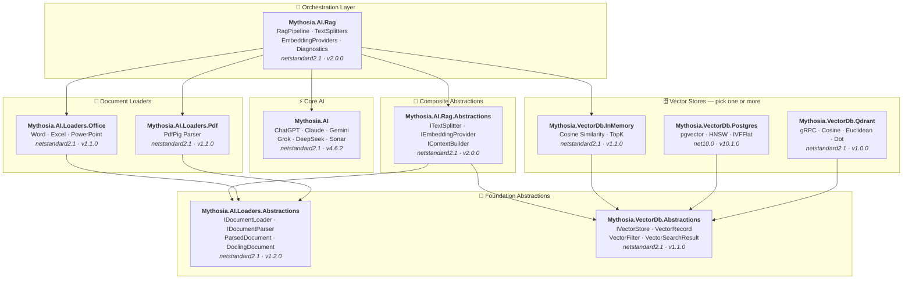

# Mythosia.AI

[](https://www.nuget.org/packages/Mythosia.AI)
[](https://www.nuget.org/packages/Mythosia.AI)

Unified .NET AI library with multi-provider support (OpenAI, Anthropic, Google, DeepSeek, Perplexity, xAI) and RAG extensions.

## Supported Providers

| Provider | Models |
| --- | --- |
| **OpenAI** | GPT-5.2 / 5.2 Codex / 5.1 / 5, GPT-4.1, GPT-4o, o3 |
| **Anthropic** | Claude Opus 4.6 / 4.5 / 4.1 / 4, Sonnet 4.6 / 4.5 / 4, Haiku 4.5 |
| **Google** | Gemini 3 Flash/Pro Preview, Gemini 2.5 Pro/Flash/Flash-Lite |
| **xAI** | Grok 4, Grok 4.1 Fast, Grok 3, Grok 3 Mini |
| **DeepSeek** | Chat, Reasoner |
| **Perplexity** | Sonar, Sonar Pro, Sonar Reasoning |

## Packages

### Core

| Package | NuGet | Description |
| --- | --- | --- |
| [Mythosia.AI](Mythosia.AI/) | [](https://www.nuget.org/packages/Mythosia.AI) | Core library — multi-provider AI service with streaming, function calling, and multimodal support |

### RAG

| Package | NuGet | Description |
| --- | --- | --- |
| [Mythosia.AI.Rag](Mythosia.AI.Rag/) | [](https://www.nuget.org/packages/Mythosia.AI.Rag) | Fluent RAG extension for AIService with `.WithRag()` API |
| [Mythosia.AI.Rag.Abstractions](Mythosia.AI.Rag.Abstractions/) | [](https://www.nuget.org/packages/Mythosia.AI.Rag.Abstractions) | Interfaces and models for RAG pipeline components |

### Document Loaders

| Package | NuGet | Description |
| --- | --- | --- |
| [Mythosia.AI.Loaders.Abstractions](Mythosia.AI.Loaders.Abstractions/) | [](https://www.nuget.org/packages/Mythosia.AI.Loaders.Abstractions) | Document loader interfaces and models |
| [Mythosia.AI.Loaders.Office](Mythosia.AI.Loaders.Office/) | [](https://www.nuget.org/packages/Mythosia.AI.Loaders.Office) | OpenXml parsers for Word / Excel / PowerPoint |
| [Mythosia.AI.Loaders.Pdf](Mythosia.AI.Loaders.Pdf/) | [](https://www.nuget.org/packages/Mythosia.AI.Loaders.Pdf) | PDF parser via PdfPig |

### Vector Stores

> **Pick one or more** — all implement `IVectorStore` from the Abstractions package.

| Package | NuGet | Description |
| --- | --- | --- |
| [Mythosia.VectorDb.Abstractions](vectordb/Mythosia.VectorDb.Abstractions/) | [](https://www.nuget.org/packages/Mythosia.VectorDb.Abstractions) | `IVectorStore` · `VectorRecord` · `VectorFilter` contracts |
| [Mythosia.VectorDb.InMemory](vectordb/Mythosia.VectorDb.InMemory/) | [](https://www.nuget.org/packages/Mythosia.VectorDb.InMemory) | In-memory store — zero infrastructure, great for prototyping |
| [Mythosia.VectorDb.Postgres](vectordb/Mythosia.VectorDb.Postgres/) | [](https://www.nuget.org/packages/Mythosia.VectorDb.Postgres) | PostgreSQL + pgvector — HNSW / IVFFlat indexes, production-ready |
| [Mythosia.VectorDb.Qdrant](vectordb/Mythosia.VectorDb.Qdrant/) | [](https://www.nuget.org/packages/Mythosia.VectorDb.Qdrant) | Qdrant gRPC client — Cosine / Euclidean / Dot, auto-provisioning |

## Architecture



## Demo / Test Bed (Chat UI)

This repository includes a sample Chat UI built on Mythosia.AI — launch Mythosia.AI.Samples.ChatUi to test the library in action.

### Run the sample

Run **`Mythosia.AI.Samples.ChatUi`** to try it locally:

```bash
# from repo root
dotnet run --project Mythosia.AI.Samples.ChatUi
```

https://github.com/user-attachments/assets/62094afe-9add-4c14-b818-6b31f200dc01


## Quick Start

### Basic AI Completion

```csharp
using Mythosia.AI;

var service = new ChatGptService(apiKey, httpClient);
var response = await service.GetCompletionAsync("Hello!");
```

### Streaming

```csharp
await foreach (var token in service.StreamAsync("Tell me a story"))
{
    Console.Write(token);
}
```

### Reasoning Streaming

All reasoning-capable providers (OpenAI, Claude, Gemini, Grok, DeepSeek) share the same streaming pattern:

```csharp
await foreach (var content in service.StreamAsync(message, new StreamOptions().WithReasoning()))
{
    if (content.Type == StreamingContentType.Reasoning)
        Console.Write($"[Think] {content.Content}");
    else if (content.Type == StreamingContentType.Text)
        Console.Write(content.Content);
}
```

### Function Calling

```csharp
var service = new ChatGptService(apiKey, httpClient)
    .WithFunction(
        "get_weather",
        "Gets the current weather for a location",
        ("location", "The city and country", required: true),
        (string location) => $"The weather in {location} is sunny, 22C"
    );

var response = await service.GetCompletionAsync("What's the weather in Seoul?");
```

### Structured Output (Basic)

```csharp
// Deserialize LLM responses directly into C# POCOs with auto-recovery
var result = await service.GetCompletionAsync<WeatherResponse>(
    "What's the weather in Seoul?");
```

### Structured Output (List)

```csharp
// Collection types work directly — no wrapper DTO needed
var items = await service.GetCompletionAsync<List<ItemDto>>(
    "Extract all entities from this document...");
```

### Structured Output (Streaming)

```csharp
// Stream text chunks in real-time + get final deserialized object
var run = service.BeginStream(prompt).As<MyDto>();

await foreach (var chunk in run.Stream())
    Console.Write(chunk);          // real-time UI

MyDto dto = await run.Result;      // parsed & auto-repaired
```

### Conversation Summary Policy

```csharp
// Automatically summarize old messages when conversation gets long
service.ConversationPolicy = SummaryConversationPolicy.ByMessage(
    triggerCount: 20,
    keepRecentCount: 5
);

// Token-based trigger
service.ConversationPolicy = SummaryConversationPolicy.ByToken(
    triggerTokens: 3000,
    keepRecentTokens: 1000
);

// Just use as normal — summarization happens automatically
await service.GetCompletionAsync("Continue our conversation...");

// For streaming, call summarization explicitly before StreamAsync()
await service.ApplySummaryPolicyIfNeededAsync();
await foreach (var chunk in service.StreamAsync("Continue..."))
    Console.Write(chunk.Content);

// Save/restore summary across sessions
string saved = service.ConversationPolicy.CurrentSummary;
policy.LoadSummary(saved);
```

### RAG (Retrieval-Augmented Generation)

```bash
dotnet add package Mythosia.AI.Rag
```

```csharp
using Mythosia.AI.Rag;

var service = new ClaudeService(apiKey, httpClient)
    .WithRag(rag => rag
        .AddDocument("manual.txt")
        .AddDocument("policy.txt")
    );

var response = await service.GetCompletionAsync("What is the refund policy?");
```

## Repository Structure

```text
Mythosia.AI/                          # Core AI service library
Mythosia.AI.Rag/                      # RAG fluent API and pipeline
Mythosia.AI.Rag.Abstractions/         # RAG interfaces and models
Mythosia.AI.VectorDB/                 # In-memory vector store
Mythosia.AI.Loaders.Abstractions/     # Document loader contracts
tests/
  Mythosia.AI.Test/                   # Core AI service tests
  Mythosia.AI.Rag.Tests/             # RAG pipeline tests
```

## Installation

```bash
dotnet add package Mythosia.AI
```

For advanced LINQ operations with streams:

```bash
dotnet add package System.Linq.Async
```

## Documentation

- [Basic Usage Guide](https://github.com/AJ-comp/Mythosia.AI/wiki)
- [Mythosia.AI README](Mythosia.AI/README.md)  Full API reference with function calling, streaming, and model configuration
- [Mythosia.AI.Rag README](Mythosia.AI.Rag/README.md)  RAG pipeline usage and custom implementations
- Loaders Guide: [EN](Mythosia.AI.Loaders.Abstractions/docs/en/loaders.md) · [KO](Mythosia.AI.Loaders.Abstractions/docs/ko/loaders.md) · [JA](Mythosia.AI.Loaders.Abstractions/docs/ja/loaders.md) · [ZH](Mythosia.AI.Loaders.Abstractions/docs/zh/loaders.md)
- [Release Notes](Mythosia.AI/RELEASE_NOTES.md)

## License

This project is licensed under the [MIT License](LICENSE).

## Originally

This project was originally part of [Mythosia](https://github.com/AJ-comp/Mythosia).

