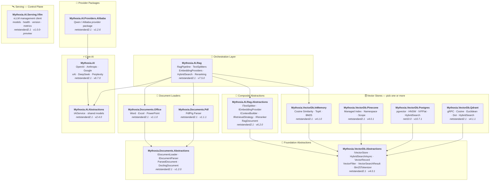

<div align="center">

🌐 [English](README.md) · [한국어](docs/ko/README.md) · [日本語](docs/ja/README.md) · [Français](docs/fr/README.md) · [Deutsch](docs/de/README.md) · [Русский](docs/ru/README.md) · [Українська](docs/uk/README.md) · [简体中文](docs/zh-Hans/README.md) · [繁體中文](docs/zh-Hant/README.md) · [Tiếng Việt](docs/vi/README.md) · [ภาษาไทย](docs/th/README.md) · [Português](docs/pt/README.md) · [Español](docs/es/README.md)

<br>

[](https://github.com/AJ-comp/Mythosia.AI)


### A modular .NET AI library for building intelligent applications.
**Switch providers, add RAG, load documents — all with a unified API.**

<br>

[](https://www.nuget.org/packages/Mythosia.AI)
[](https://www.nuget.org/packages/Mythosia.AI)
[](https://aj-comp.github.io/Mythosia.AI/)
[](https://dotnet.microsoft.com)

<br>

**[📖 Get Started](https://aj-comp.github.io/Mythosia.AI/)** &nbsp;·&nbsp; **[API Reference](https://aj-comp.github.io/Mythosia.AI/api/)** &nbsp;·&nbsp; **[GitHub ↗](https://github.com/AJ-comp/Mythosia.AI)**

<br>

</div>

---

### What do I need to install?

```
dotnet add package Mythosia.AI                    # start here (this is all you need)
dotnet add package Mythosia.AI.Rag                # optional: when you need RAG
dotnet add package Mythosia.VectorDb.Postgres     # optional: when you need a production vector store
```

| Step | Package | When |
| :--: | --- | --- |
| **1** | **`Mythosia.AI`** | **Start here** — completions, streaming, function calling, structured output (OpenAI / Claude / Gemini / Grok / DeepSeek / Perplexity) |
| **2** | **`Mythosia.AI.Rag`** | When you need RAG — text splitters, embeddings, hybrid search, reranking, InMemory vector store, and document loaders (Word / Excel / PowerPoint / PDF) |
| **3** | **`Mythosia.VectorDb.Postgres`** / **`Qdrant`** / **`Pinecone`** | When you need a production vector store instead of InMemory — pick one |

## Architecture


```mermaid
graph TD
    subgraph "🔗 Orchestration Layer"
        Rag["<b>Mythosia.AI.Rag</b><br/>RagPipeline · TextSplitters<br/>EmbeddingProviders · HybridSearch · Reranking<br/><i>netstandard2.1 · v7.5.0</i>"]
    end

    subgraph "⚡ Core AI"
        AI["<b>Mythosia.AI</b><br/>OpenAI · Anthropic · Google<br/>xAI · DeepSeek · Perplexity<br/><i>netstandard2.1 · v6.7.0</i>"]
        AIAbs["<b>Mythosia.AI.Abstractions</b><br/>IAIService · shared models<br/><i>netstandard2.1 · v2.4.0</i>"]
    end

    subgraph "🔌 Provider Packages"
        Alibaba["<b>Mythosia.AI.Providers.Alibaba</b><br/>Qwen / Alibaba provider package<br/><i>netstandard2.1 · v1.2.6</i>"]
    end

    subgraph "🛰️ Serving — Control Plane"
        VllmServing["<b>Mythosia.AI.Serving.Vllm</b><br/>vLLM management client<br/>models · health · version · metrics<br/><i>netstandard2.1 · v1.0.0-preview</i>"]
    end

    subgraph "📄 Document Loaders"
        Office["<b>Mythosia.Documents.Office</b><br/>Word · Excel · PowerPoint<br/><i>netstandard2.1 · v1.1.0</i>"]
        Pdf["<b>Mythosia.Documents.Pdf</b><br/>PdfPig Parser<br/><i>netstandard2.1 · v1.1.1</i>"]
    end

    subgraph "📐 Composite Abstractions"
        RagAbs["<b>Mythosia.AI.Rag.Abstractions</b><br/>ITextSplitter · IEmbeddingProvider<br/>IContextBuilder · IRetrievalStrategy · IReranker<br/>RagDocument<br/><i>netstandard2.1 · v6.2.0</i>"]
    end

    subgraph "🗄️ Vector Stores — pick one or more"
        InMem["<b>Mythosia.VectorDb.InMemory</b><br/>Cosine Similarity · TopK · BM25<br/><i>netstandard2.1 · v4.1.0</i>"]
        Pine["<b>Mythosia.VectorDb.Pinecone</b><br/>Managed Index · Namespace · Scope<br/><i>netstandard2.1 · v4.0.1</i>"]
        Pg["<b>Mythosia.VectorDb.Postgres</b><br/>pgvector · HNSW · IVFFlat · HybridSearch<br/><i>net10.0 · v10.7.1</i>"]
        Qd["<b>Mythosia.VectorDb.Qdrant</b><br/>gRPC · Cosine · Euclidean · Dot · HybridSearch<br/><i>netstandard2.1 · v4.1.1</i>"]
    end

    subgraph "🧱 Foundation Abstractions"
        LoaderAbs["<b>Mythosia.Documents.Abstractions</b><br/>IDocumentLoader · IDocumentParser<br/>ParsedDocument · DoclingDocument<br/><i>netstandard2.1 · v1.2.0</i>"]
        VdbAbs["<b>Mythosia.VectorDb.Abstractions</b><br/>IVectorStore · HybridSearchAsync · VectorRecord<br/>VectorFilter · VectorSearchResult · Bm25Tokenizer<br/><i>netstandard2.1 · v4.0.1</i>"]
    end

    %% Core AI internal
    AI --> AIAbs

    %% Orchestration → dependencies
    Rag --> AIAbs
    Rag --> Office
    Rag --> Pdf
    Rag --> RagAbs
    Rag --> InMem

    %% Provider packages → core
    Alibaba --> AI

    %% Composite → Foundation
    RagAbs --> VdbAbs

    %% Loaders → Foundation
    Office --> LoaderAbs
    Pdf --> LoaderAbs

    %% VectorStores → Foundation
    InMem --> VdbAbs
    Pine --> VdbAbs
    Pg --> VdbAbs
    Qd --> VdbAbs
```

## Demo / Test Bed (Chat UI)

This repository includes a sample Chat UI built on Mythosia.AI — launch Mythosia.AI.Samples.ChatUi to test the library in action.

### Run the sample

Run **`Mythosia.AI.Samples.ChatUi`** to try it locally:

```bash
# from repo root
dotnet run --project apps/Mythosia.AI.Samples.ChatUi
```

https://github.com/user-attachments/assets/62094afe-9add-4c14-b818-6b31f200dc01


## Quick Start

### Basic AI Completion

```csharp
using Mythosia.AI;

var service = new OpenAIService(apiKey, httpClient);
var response = await service.GetCompletionAsync("Hello!");
```

### Streaming

```csharp
await foreach (var token in service.StreamAsync("Tell me a story"))
{
    Console.Write(token);
}
```

### Reasoning Streaming

All reasoning-capable providers (OpenAI, Claude, Gemini, Grok, DeepSeek) share the same streaming pattern:

```csharp
await foreach (var content in service.StreamAsync(message, new StreamOptions().WithReasoning()))
{
    if (content.Type == StreamingContentType.Reasoning)
        Console.Write($"[Think] {content.Content}");
    else if (content.Type == StreamingContentType.Text)
        Console.Write(content.Content);
}
```

### Function Calling

```csharp
var service = new OpenAIService(apiKey, httpClient)
    .WithFunction(
        "get_weather",
        "Gets the current weather for a location",
        ("location", "The city and country", required: true),
        (string location) => $"The weather in {location} is sunny, 22C"
    );

var response = await service.GetCompletionAsync("What's the weather in Seoul?");
```

### Structured Output (Basic)

```csharp
// Deserialize LLM responses directly into C# POCOs with auto-recovery
var result = await service.GetCompletionAsync<WeatherResponse>(
    "What's the weather in Seoul?");
```

### Structured Output (List)

```csharp
// Collection types work directly — no wrapper DTO needed
var items = await service.GetCompletionAsync<List<ItemDto>>(
    "Extract all entities from this document...");
```

### Structured Output (Streaming)

```csharp
// Stream text chunks in real-time + get final deserialized object
var run = service.BeginStream(prompt).As<MyDto>();

await foreach (var chunk in run.Stream())
    Console.Write(chunk);          // real-time UI

MyDto dto = await run.Result;      // parsed & auto-repaired
```

### Conversation Summary Policy

```csharp
// Automatically summarize old messages when conversation gets long
service.ConversationPolicy = SummaryConversationPolicy.ByMessage(
    triggerCount: 20,
    keepRecentCount: 5
);

// Token-based trigger
service.ConversationPolicy = SummaryConversationPolicy.ByToken(
    triggerTokens: 3000,
    keepRecentTokens: 1000
);

// Just use as normal — summarization happens automatically
await service.GetCompletionAsync("Continue our conversation...");

// For streaming, call summarization explicitly before StreamAsync()
await service.ApplySummaryPolicyIfNeededAsync();
await foreach (var chunk in service.StreamAsync("Continue..."))
    Console.Write(chunk.Content);

// Save/restore summary across sessions
string saved = service.ConversationPolicy.CurrentSummary;
policy.LoadSummary(saved);
```

### RAG (Retrieval-Augmented Generation)

```bash
dotnet add package Mythosia.AI.Rag
```

```csharp
using Mythosia.AI.Rag;

var service = new AnthropicService(apiKey, httpClient)
    .WithRag(rag => rag
        .AddDocument("manual.txt")
        .AddDocument("policy.txt")
    );

var response = await service.GetCompletionAsync("What is the refund policy?");
```

For agent-controlled retrieval, register the store with `WithAgenticRag(...)` and run either `RunAgentAsync(...)` or `RunAgentStreamAsync(...)`. See [Mythosia.AI.Rag README](src/rag/Mythosia.AI.Rag/README.md) for full examples.

## Supported Providers

| Provider | Package | Models |
| --- | --- | --- |
| **OpenAI** | `Mythosia.AI` | GPT-5.5 / 5.5 Pro / 5.4 / 5.4 Mini / 5.4 Nano / 5.4 Pro / 5.3 Codex / 5.2 / 5.2 Pro / 5.2 Codex / 5.1 / 5 / 5 Pro / 5 Mini / 5 Nano, GPT-4.1 / 4.1 Mini / 4.1 Nano, GPT-4o / 4o Mini, o3 / o3 Pro |
| **Anthropic** | `Mythosia.AI` | Claude Fable 5, Opus 4.8 / 4.7 / 4.6 / 4.5 / 4.1 / 4, Sonnet 4.6 / 4.5, Haiku 4.5 |
| **Google** | `Mythosia.AI` | Gemini 3.1 Pro Preview, Gemini 3.5 Flash, Gemini 3 Flash Preview, Gemini 3.1 Flash-Lite, Gemini 2.5 Pro/Flash/Flash-Lite |
| **xAI** | `Mythosia.AI` | Grok 4.3, Grok 4.20 (reasoning / non-reasoning), Grok Build 0.1, Grok 3 Mini |
| **DeepSeek** | `Mythosia.AI` | Chat, Reasoner |
| **Perplexity** | `Mythosia.AI` | Sonar, Sonar Pro, Sonar Reasoning Pro |
| **Alibaba / Qwen** | `Mythosia.AI.Providers.Alibaba` | Qwen Max / Plus / Turbo / Qwen3 / Qwen3.5 variants |

## Packages

### Core

| Package | NuGet | Description |
| --- | --- | --- |
| [Mythosia.AI](src/core/Mythosia.AI/) | [](https://www.nuget.org/packages/Mythosia.AI) | Core library — built-in providers, streaming, function calling, and multimodal support |
| [Mythosia.AI.Abstractions](src/core/Mythosia.AI.Abstractions/) | [](https://www.nuget.org/packages/Mythosia.AI.Abstractions) | `IAIService` interface and shared models — lightweight contract package for libraries |
| [Mythosia.AI.Providers.Alibaba](src/core/Mythosia.AI.Providers.Alibaba/) | [](https://www.nuget.org/packages/Mythosia.AI.Providers.Alibaba) | Alibaba / Qwen provider package built on top of `Mythosia.AI` |

### RAG

| Package | NuGet | Description |
| --- | --- | --- |
| [Mythosia.AI.Rag](src/rag/Mythosia.AI.Rag/) | [](https://www.nuget.org/packages/Mythosia.AI.Rag) | Fluent RAG extension for IAIService with `.WithRag()` API |
| [Mythosia.AI.Rag.Abstractions](src/rag/Mythosia.AI.Rag.Abstractions/) | [](https://www.nuget.org/packages/Mythosia.AI.Rag.Abstractions) | Interfaces and models for RAG pipeline components |

### Document Loaders

| Package | NuGet | Description |
| --- | --- | --- |
| [Mythosia.Documents.Abstractions](src/loaders/Mythosia.Documents.Abstractions/) | [](https://www.nuget.org/packages/Mythosia.Documents.Abstractions) | Document loader interfaces and models (`IDocumentLoader`, `DoclingDocument`) |
| [Mythosia.Documents.Office](src/loaders/Mythosia.Documents.Office/) | [](https://www.nuget.org/packages/Mythosia.Documents.Office) | OpenXml parsers for Word / Excel / PowerPoint |
| [Mythosia.Documents.Pdf](src/loaders/Mythosia.Documents.Pdf/) | [](https://www.nuget.org/packages/Mythosia.Documents.Pdf) | PDF parser via PdfPig |

### Vector Stores

> **Pick one or more** — all implement `IVectorStore` from the Abstractions package.

| Package | NuGet | Description |
| --- | --- | --- |
| [Mythosia.VectorDb.Abstractions](src/vectordb/Mythosia.VectorDb.Abstractions/) | [](https://www.nuget.org/packages/Mythosia.VectorDb.Abstractions) | `IVectorStore` · `VectorRecord` · `VectorFilter` contracts |
| [Mythosia.VectorDb.InMemory](src/vectordb/Mythosia.VectorDb.InMemory/) | [](https://www.nuget.org/packages/Mythosia.VectorDb.InMemory) | In-memory store — zero infrastructure, great for prototyping |
| [Mythosia.VectorDb.Pinecone](src/vectordb/Mythosia.VectorDb.Pinecone/) | [](https://www.nuget.org/packages/Mythosia.VectorDb.Pinecone) | Pinecone HTTP API — index/namespace/scope isolation for managed vector DB |
| [Mythosia.VectorDb.Postgres](src/vectordb/Mythosia.VectorDb.Postgres/) | [](https://www.nuget.org/packages/Mythosia.VectorDb.Postgres) | PostgreSQL + pgvector — HNSW / IVFFlat indexes, production-ready |
| [Mythosia.VectorDb.Qdrant](src/vectordb/Mythosia.VectorDb.Qdrant/) | [](https://www.nuget.org/packages/Mythosia.VectorDb.Qdrant) | Qdrant gRPC client — Cosine / Euclidean / Dot, auto-provisioning |

### Serving — Control Plane

> Management/introspection clients for model-serving runtimes. Chat stays on the provider packages: `Providers.*` = chat data plane, `Serving.*` = server control plane.

| Package | NuGet | Description |
| --- | --- | --- |
| [Mythosia.AI.Serving.Vllm](src/serving/Mythosia.AI.Serving.Vllm/) | [](https://www.nuget.org/packages/Mythosia.AI.Serving.Vllm) | vLLM control-plane client — model cards (the actually loaded model via `root`), health, server version, Prometheus metrics |

## Repository Structure

```text
src/
  core/
    Mythosia.AI/                        # Core AI service library
    Mythosia.AI.Abstractions/           # IAIService interface and shared models
    Mythosia.AI.Providers.Alibaba/      # Alibaba / Qwen provider package
  loaders/
    Mythosia.Documents.Abstractions/    # Document loader contracts (IDocumentLoader, DoclingDocument)
    Mythosia.Documents.Office/          # Office document loaders (Word/Excel/PowerPoint)
    Mythosia.Documents.Pdf/             # PDF document loader
  rag/
    Mythosia.AI.Rag/                    # RAG fluent API and pipeline
    Mythosia.AI.Rag.Abstractions/       # RAG interfaces and models (RagDocument)
  serving/
    Mythosia.AI.Serving.Vllm/           # vLLM control-plane client (models/health/version/metrics)
  vectordb/
    Mythosia.VectorDb.Abstractions/     # Vector store contracts
    Mythosia.VectorDb.InMemory/         # In-memory vector store
    Mythosia.VectorDb.Pinecone/         # Pinecone vector store
    Mythosia.VectorDb.Postgres/         # PostgreSQL + pgvector store
    Mythosia.VectorDb.Qdrant/           # Qdrant vector store
apps/                                   # Applications (samples & tools)
tests/                                  # Unit/integration test projects
```

## Installation

```bash
dotnet add package Mythosia.AI
```

For advanced LINQ operations with streams:

```bash
dotnet add package System.Linq.Async
```

## Documentation

- **[📖 Full Documentation Site](https://aj-comp.github.io/Mythosia.AI/)** — DocFX-generated docs covering all features, RAG pipeline, vector stores, and API reference
- [Basic Usage Guide](https://github.com/AJ-comp/Mythosia.AI/wiki)
- [Mythosia.AI README](src/core/Mythosia.AI/README.md)  Full API reference with function calling, streaming, and model configuration
- [Mythosia.AI.Rag README](src/rag/Mythosia.AI.Rag/README.md)  RAG pipeline usage and custom implementations
- [Document Loaders](docs/document-loaders.md)
- [Release Notes](src/core/Mythosia.AI/RELEASE_NOTES.md)

## License

This project is licensed under the [MIT License](LICENSE).

## Originally

This project was originally part of [Mythosia](https://github.com/AJ-comp/Mythosia).

