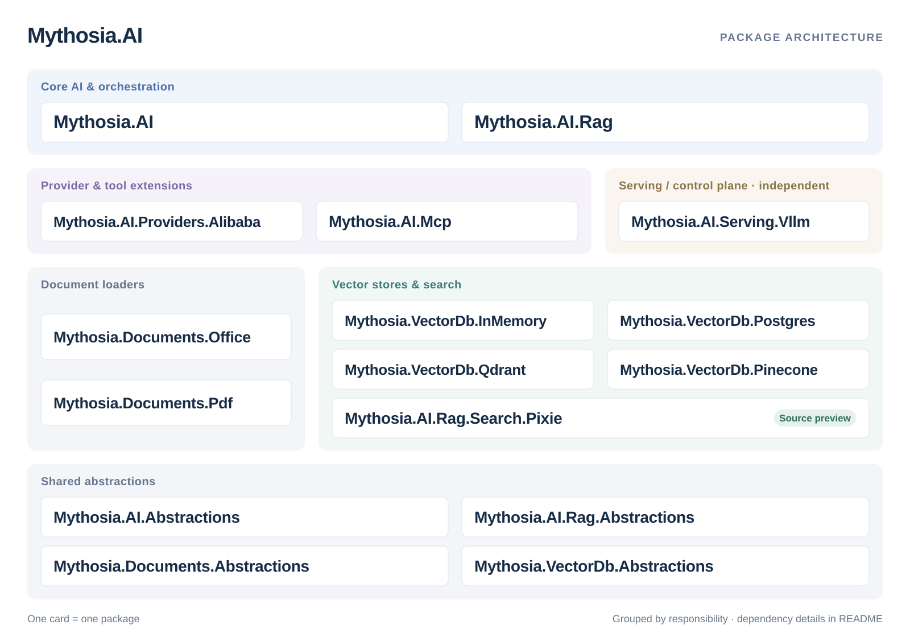
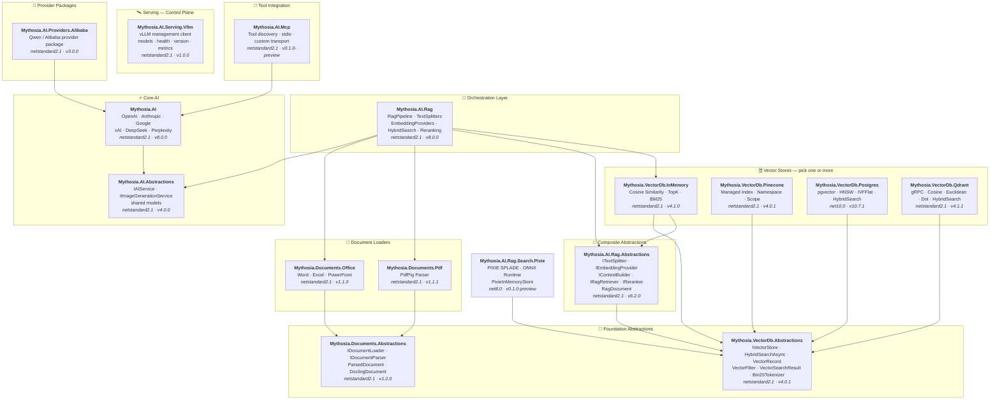

<div align="center">

🌐 [English](README.md) · [한국어](docs/ko/README.md) · [日本語](docs/ja/README.md) · [Français](docs/fr/README.md) · [Deutsch](docs/de/README.md) · [Русский](docs/ru/README.md) · [Українська](docs/uk/README.md) · [简体中文](docs/zh-Hans/README.md) · [繁體中文](docs/zh-Hant/README.md) · [Tiếng Việt](docs/vi/README.md) · [ภาษาไทย](docs/th/README.md) · [Português](docs/pt/README.md) · [Español](docs/es/README.md)

<br>

[](https://github.com/AJ-comp/Mythosia.AI)


### A modular .NET AI library for building intelligent applications.
**Switch providers, add RAG, load documents — all with a unified API.**

<br>

[](https://www.nuget.org/packages/Mythosia.AI)
[](https://www.nuget.org/packages/Mythosia.AI)
[](https://aj-comp.github.io/Mythosia.AI/)
[](https://dotnet.microsoft.com)

<br>

**[📖 Get Started](https://aj-comp.github.io/Mythosia.AI/)** &nbsp;·&nbsp; **[API Reference](https://aj-comp.github.io/Mythosia.AI/api/)** &nbsp;·&nbsp; **[GitHub ↗](https://github.com/AJ-comp/Mythosia.AI)**

<br>

</div>

For TXT and Markdown, [choose a rule-based splitter](docs/text-splitters.md) according to the document structure. Size validation, overlap and Unicode boundaries are checked; Markdown preserves headings, fenced code and table rows. Character/word counts are not model token limits. Table conditions and code indentation retain their meaning; excessive repeated Markdown context fails explicitly before it can expand without a bound.

To prevent an apparently successful index from overwriting chunks or pairing them with the wrong vectors, [indexing validation](docs/rag-pipeline.md#indexing-validation) rejects invalid IDs and embedding batches before persistence; custom splitters must provide unique IDs and inherit document metadata.

Stable [file identities](docs/document-loaders.md#file-source-identity), validated [query vectors](docs/rag-embedding.md#query-embedding-validation), document-scoped [persistence callbacks and URL cancellation](docs/rag-pipeline.md#custom-persistence) prevent duplicate registrations, invalid searches and stale chunks.

To compare local neural sparse retrieval with the existing search, use the optional `Mythosia.AI.Rag.Search.Pixie` preview. It keeps your dense embedding provider and uses an in-memory PIXIE index; it does not migrate persistent stores or replace the default search. [PIXIE setup and comparison guide](docs/rag-pixie-search.md).

The [retrieval evaluation infrastructure](https://github.com/AJ-comp/Mythosia.AI/blob/main/tests/Mythosia.AI.Rag.Evaluation/README.md) supports reusable datasets, search adapters, persistent run reports and regression checks. Extend the same evaluator for new search methods and your own document collections.

Keep request settings independent, stop ongoing work, and collect answers with usage and sources. See the [v8 upgrade guide](docs/v8-migration.md) for the six architecture changes, migration examples and validation scope.

> Package versions documented here: [Mythosia.AI 8.0.0](src/core/Mythosia.AI/RELEASE_NOTES.md#v800), [Abstractions 4.0.0](src/core/Mythosia.AI.Abstractions/RELEASE_NOTES.md#v400), [Alibaba 3.0.0](src/core/Mythosia.AI.Providers.Alibaba/RELEASE_NOTES.md#v300), [RAG 8.0.0](src/rag/Mythosia.AI.Rag/RELEASE_NOTES.md#v800), [MCP 0.1.0-preview](src/integrations/Mythosia.AI.Mcp/RELEASE_NOTES.md#v010-preview), [Serving.Vllm 1.0.0](src/serving/Mythosia.AI.Serving.Vllm/RELEASE_NOTES.md#v100).

---

### What do I need to install?

```
dotnet add package Mythosia.AI                    # start here (this is all you need)
dotnet add package Mythosia.AI.Rag                # optional: when you need RAG
dotnet add package Mythosia.VectorDb.Postgres     # optional: when you need a production vector store
```

| Step | Package | When |
| :--: | --- | --- |
| **1** | **`Mythosia.AI`** | **Start here** — completions, streaming, function calling, structured output (OpenAI / Claude / Gemini / Grok / DeepSeek / Perplexity) |
| **2** | **`Mythosia.AI.Rag`** | When you need RAG — text splitters, embeddings, hybrid search, reranking, InMemory vector store, and document loaders (Word / Excel / PowerPoint / PDF) |
| **3** | **`Mythosia.VectorDb.Postgres`** / **`Qdrant`** / **`Pinecone`** | When you need a production vector store instead of InMemory — pick one |

Prepare different settings without changing another request: `CreateRequest(...).WithTemperature(...).GetCompletionAsync()` uses an independent, reusable request builder. See the [request settings guide](docs/request-building.md) for Before/After examples, runs, profiles, and shared-conversation limits.

For requests where waiting time matters, use [processing speed](docs/request-building.md#inference-speed): `WithSpeed` keeps the model and reasoning effort, while `Processing` reports what the provider actually applied. Fast is a paid option on supported combinations.

## Architecture

<a href="docs/assets/architecture.svg">
  <picture>
    <source media="(prefers-color-scheme: dark)" srcset="docs/assets/architecture-dark.svg">
    
  </picture>
</a>

<details>
<summary>Package dependency details</summary>


```mermaid
graph TD
    Pixie["<b>Mythosia.AI.Rag.Search.Pixie</b><br/>PIXIE SPLADE · ONNX Runtime<br/>PixieInMemoryStore<br/><i>net8.0 · v0.1.0-preview</i>"]
    subgraph "🔗 Orchestration Layer"
        Rag["<b>Mythosia.AI.Rag</b><br/>RagPipeline · TextSplitters<br/>EmbeddingProviders · HybridSearch · Reranking<br/><i>netstandard2.1 · v8.0.0</i>"]
    end

    subgraph "⚡ Core AI"
        AI["<b>Mythosia.AI</b><br/>OpenAI · Anthropic · Google<br/>xAI · DeepSeek · Perplexity<br/><i>netstandard2.1 · v8.0.0</i>"]
        AIAbs["<b>Mythosia.AI.Abstractions</b><br/>IAIService · IImageGenerationService<br/>shared models<br/><i>netstandard2.1 · v4.0.0</i>"]
    end

    subgraph "🔌 Provider Packages"
        Alibaba["<b>Mythosia.AI.Providers.Alibaba</b><br/>Qwen / Alibaba provider package<br/><i>netstandard2.1 · v3.0.0</i>"]
    end

    subgraph "🛰️ Serving — Control Plane"
        VllmServing["<b>Mythosia.AI.Serving.Vllm</b><br/>vLLM management client<br/>models · health · version · metrics<br/><i>netstandard2.1 · v1.0.0</i>"]
    end

    subgraph "🧩 Tool Integration"
        Mcp["<b>Mythosia.AI.Mcp</b><br/>Tool discovery · stdio · custom transport<br/><i>netstandard2.1 · v0.1.0-preview</i>"]
    end

    subgraph "📄 Document Loaders"
        Office["<b>Mythosia.Documents.Office</b><br/>Word · Excel · PowerPoint<br/><i>netstandard2.1 · v1.1.0</i>"]
        Pdf["<b>Mythosia.Documents.Pdf</b><br/>PdfPig Parser<br/><i>netstandard2.1 · v1.1.1</i>"]
    end

    subgraph "📐 Composite Abstractions"
        RagAbs["<b>Mythosia.AI.Rag.Abstractions</b><br/>ITextSplitter · IEmbeddingProvider<br/>IContextBuilder · IRagRetriever · IReranker<br/>RagDocument<br/><i>netstandard2.1 · v6.2.0</i>"]
    end

    subgraph "🗄️ Vector Stores — pick one or more"
        InMem["<b>Mythosia.VectorDb.InMemory</b><br/>Cosine Similarity · TopK · BM25<br/><i>netstandard2.1 · v4.1.0</i>"]
        Pine["<b>Mythosia.VectorDb.Pinecone</b><br/>Managed Index · Namespace · Scope<br/><i>netstandard2.1 · v4.0.1</i>"]
        Pg["<b>Mythosia.VectorDb.Postgres</b><br/>pgvector · HNSW · IVFFlat · HybridSearch<br/><i>net10.0 · v10.7.1</i>"]
        Qd["<b>Mythosia.VectorDb.Qdrant</b><br/>gRPC · Cosine · Euclidean · Dot · HybridSearch<br/><i>netstandard2.1 · v4.1.1</i>"]
    end

    subgraph "🧱 Foundation Abstractions"
        LoaderAbs["<b>Mythosia.Documents.Abstractions</b><br/>IDocumentLoader · IDocumentParser<br/>ParsedDocument · DoclingDocument<br/><i>netstandard2.1 · v1.2.0</i>"]
        VdbAbs["<b>Mythosia.VectorDb.Abstractions</b><br/>IVectorStore · HybridSearchAsync · VectorRecord<br/>VectorFilter · VectorSearchResult · Bm25Tokenizer<br/><i>netstandard2.1 · v4.0.1</i>"]
    end

    %% Core AI internal
    AI --> AIAbs

    %% Orchestration → dependencies
    Rag --> AIAbs
    Rag --> Office
    Rag --> Pdf
    Rag --> RagAbs
    Rag --> InMem

    %% Provider packages → core
    Alibaba --> AI
    Mcp --> AI

    %% Composite → Foundation
    RagAbs --> VdbAbs

    %% Loaders → Foundation
    Office --> LoaderAbs
    Pdf --> LoaderAbs

    %% VectorStores → Foundation
    InMem --> VdbAbs
    InMem --> RagAbs
    Pine --> VdbAbs
    Pg --> VdbAbs
    Qd --> VdbAbs
    Pixie --> VdbAbs
```

</details>

## Demo / Test Bed (Chat UI)

This repository includes a sample Chat UI built on Mythosia.AI — launch Mythosia.AI.Samples.ChatUi to test the library in action.

### Run the sample

Run **`Mythosia.AI.Samples.ChatUi`** to try it locally:

```bash
# from repo root
dotnet run --project apps/Mythosia.AI.Samples.ChatUi
```

https://github.com/user-attachments/assets/62094afe-9add-4c14-b818-6b31f200dc01


## Quick Start

### Basic AI Completion

```csharp
using Mythosia.AI.Services.OpenAI;

var service = new OpenAIService(apiKey, httpClient);
var response = await service.GetCompletionAsync("Hello!");
```

### Streaming

```csharp
await using var run = await service.StartRunAsync(
    "Tell me a story",
    onText: text => Console.Write(text));
string answer = (await run.Result).Text;
```

### Reasoning Streaming

OpenAI, Claude, Gemini, Grok, and DeepSeek Flash expose provider-returned reasoning through the same streaming pattern. Observe it with `StreamOptions.WithReasoning()` after enabling reasoning in the service or request settings:

```csharp
await using var run = await service.StartRunAsync(
    message, options: new StreamOptions().WithReasoning());
await foreach (var content in run.StreamAsync())
{
    if (content.Type == StreamingContentType.Reasoning)
        Console.Write($"[Think] {content.Content}");
    else if (content.Type == StreamingContentType.Text)
        Console.Write(content.Content);
}
```

### Function Calling

```csharp
using Mythosia.AI.Extensions;
using Mythosia.AI.Services.OpenAI;

var service = new OpenAIService(apiKey, httpClient)
    .WithFunction(
        "get_weather",
        "Gets the current weather for a location",
        ("location", "The city and country", required: true),
        (string location) => $"The weather in {location} is sunny, 22C"
    );

var response = await service.GetCompletionAsync("What's the weather in Seoul?");
```

Calls returned in one model response execute sequentially by default. Opt in to
bounded parallel handler execution when the registered functions are independent:

```csharp
using Mythosia.AI.Models.Functions;

service.DefaultPolicy = new FunctionCallingPolicy
{
    ExecutionMode = FunctionExecutionMode.Parallel,
    MaxConcurrency = 3
};
```

Ordinary batch results are sent back to the model in the provider's original call order.
Cancellation skips calls that have not started and supplies matching cancellation results.
Started tools receive the token when supported and are awaited so call/result history stays paired.
`FunctionCallingPolicy.TimeoutSeconds` covers the complete streaming round loop,
including response headers and the SSE body, without resetting between tool rounds.
Policy expiry raises `AIServiceException`; caller cancellation remains an
`OperationCanceledException` associated with the caller's token.

When a slow lookup is running, the model may still have useful independent work,
such as explaining general packing advice before a weather forecast arrives.
Set `FunctionDefinition.AllowAsync = true`, or use `FunctionBuilder.WithAsync()`,
to let a supported model continue while that function runs. The default is `false`.
GPT-6 Astra / Sol / Luna use this option through the Responses API; unsupported models keep the
same handler and wait for its result without sending the unsupported API option.
This is separate from C# `async` handlers and parallel handler scheduling. See
[async tool calling](docs/function-calling.md#async-tool-calling) for the example
and request-lifetime behavior.

### Image Generation and Editing

Create visual drafts from text or revise existing images through an optional capability shared by OpenAI, Google, and xAI. The image model is independent from the selected chat model:

```csharp
using Mythosia.AI.Models.Images;
using Mythosia.AI.Services;
using Mythosia.AI.Services.OpenAI;

IImageGenerationService images = new OpenAIService(apiKey, httpClient);
var generated = await images.GenerateImagesAsync(new ImageGenerationRequest
{
    Prompt = "A glass pavilion at sunrise",
    Size = ImageSize.Pixels(1024, 1024),
    OutputFormat = ImageOutputFormat.Png
});

await File.WriteAllBytesAsync("pavilion.png", generated.Images[0].Data);
```

See the [provider guide](docs/providers.md#image-generation) for generation and editing, or [typed image options and migration](docs/providers.md#image-options-migration) for the major API change. xAI uses `ImageOutputFormat.Auto`; choose the output extension from `GeneratedImage.MediaType`.

Google image presets are model-specific: Flash supports 512/1K/2K/4K, Flash-Lite currently allows 1K, and Pro supports 1K/2K/4K. Flash/Lite offer 14 ratios; Pro offers the 10 standard ratios. All accept `Auto`. Inspect `GetImageCapabilities(model)` before presenting choices; unsupported explicit sizes or ratios fail before HTTP in generation and editing. See the [model matrix and Flash-Lite documentation discrepancy](docs/providers.md#google-image-options).

### Structured Output (Basic)

```csharp
// Deserialize LLM responses directly into C# POCOs with auto-recovery
var result = await service.GetCompletionAsync<WeatherResponse>(
    "What's the weather in Seoul?");
```

### Structured Output (List)

```csharp
// Collection types work directly — no wrapper DTO needed
var items = await service.GetCompletionAsync<List<ItemDto>>(
    "Extract all entities from this document...");
```

### Structured Output (Streaming)

```csharp
// Stream text chunks in real-time + get final deserialized object
var run = service.BeginStream(prompt).As<MyDto>();

await foreach (var chunk in run.Stream())
    Console.Write(chunk);          // real-time UI

MyDto dto = await run.Result;      // parsed & auto-repaired
```

### Conversation Summary Policy

```csharp
// Automatically summarize old messages when conversation gets long
service.ConversationPolicy = SummaryConversationPolicy.ByMessage(
    triggerCount: 20,
    keepRecentCount: 5
);

// Token-based trigger
service.ConversationPolicy = SummaryConversationPolicy.ByToken(
    triggerTokens: 3000,
    keepRecentTokens: 1000
);

// Just use as normal — summarization happens automatically
await service.GetCompletionAsync("Continue our conversation...");

// For streaming, call summarization explicitly before StreamAsync()
await service.ApplySummaryPolicyIfNeededAsync();
await foreach (var chunk in service.StreamAsync("Continue..."))
    Console.Write(chunk.Content);

// Save/restore summary across sessions
string saved = service.ConversationPolicy.CurrentSummary;
policy.LoadSummary(saved);
```

### RAG (Retrieval-Augmented Generation)

Choose keyword, semantic or hybrid retrieval without imposing query embeddings on every search. `UseKeywordSearch()` skips query embeddings; `UseRetriever(...)` connects an external index; `UseHybridSearch(HybridSearchOptions)` forwards explicit weights and candidate settings. Document ingestion still creates vectors. See [retrieval modes and store support](docs/rag-hybrid-search.md).

```bash
dotnet add package Mythosia.AI.Rag
```

```csharp
using Mythosia.AI.Rag;
using Mythosia.AI.Services.Anthropic;

var service = new AnthropicService(apiKey, httpClient)
    .WithRag(rag => rag
        .AddDocument("manual.txt")
        .AddDocument("policy.txt")
    );

var response = await service.GetCompletionAsync("What is the refund policy?");
```

For agent-controlled retrieval, register the store with `WithAgenticRag(...)` and start work with `service.WithMaxRounds(10).StartRunAsync(...)`. Await `run.Result` or observe `run.StreamAsync()` on the same task. See [Mythosia.AI.Rag README](src/rag/Mythosia.AI.Rag/README.md) for full examples.

## Supported Providers

> Grok 4.7 is an unreleased addition; see [model selection, reasoning and processing speed](docs/providers.md#grok-47).

> GPT-6 Sol/Luna are unreleased additions; see [model selection and requirements](docs/providers.md#gpt-6-sol-luna).

> Claude Opus 5.5 requires matching unreleased core and abstractions builds; see [configuration and migration](docs/providers.md#claude-opus-55).

| Provider | Package | Models |
| --- | --- | --- |
| **OpenAI** | `Mythosia.AI` | GPT-6 Astra / Sol / Luna, GPT-5.6 Sol / Terra / Luna, GPT-5.5 / 5.5 Pro / 5.4 / 5.4 Mini / 5.4 Nano / 5.4 Pro / 5.3 Codex / 5.2 / 5.2 Pro / 5.1, GPT-4.1 / 4.1 Mini, GPT-4o / 4o Mini |
| **Anthropic** | `Mythosia.AI` | Claude Fable 5.1 / 5, Mythos 5.1 / 5 (limited), [Opus 5.5](docs/providers.md#claude-opus-55) / 5 / 4.8 / 4.7 / 4.6 / 4.5, Sonnet 5 / 4.6 / 4.5, Haiku 4.5 |
| **Google** | `Mythosia.AI` | Gemini 3.8 Flash, Gemini 3.7 Flash, Gemini 3.6 Flash, Gemini 3.5 Flash/Flash-Lite, Gemini 3.1 Pro Preview/Flash-Lite, Gemini 3 Flash Preview, Gemini 2.5 Pro/Flash/Flash-Lite, Gemini 3.1 Flash Image, Gemini 3.1 Flash-Lite Image, Gemini 3 Pro Image |
| **xAI** | `Mythosia.AI` | Grok 4.7, Grok 4.6, Grok 4.5 (default), Grok 4.3, Grok 4.20 (reasoning / non-reasoning), Grok Build |
| **DeepSeek** | `Mythosia.AI` | Flash (V4.1 Flash), V4 Pro |
| **Perplexity** | `Mythosia.AI` | Agent API presets and `perplexity/sonar` |
| **Alibaba / Qwen** | `Mythosia.AI.Providers.Alibaba` | Qwen Max / Plus / Turbo / Qwen3 / Qwen3.5 variants |

Use Perplexity when an answer must reflect recent information and readers need sources they can check. `PerplexityService` calls the Agent API, while independent search and embeddings let you build retrieval around your own answer model. [Perplexity Agent API, Search, and Embeddings](docs/perplexity.md).

For long document reviews and tasks with repeated tool calls, select Gemini 3.7 Flash or 3.8 Flash through the existing Google adapter. Support starts with `Mythosia.AI` 8.0.0 / `Mythosia.AI.Abstractions` 4.0.0; the service default remains Gemini 3.6 Flash.

For a quick draft followed by a demanding review, explicitly select Grok 4.6 and choose `Low` through `XHigh` effort. Support starts with `Mythosia.AI` 8.0.0 / `Mythosia.AI.Abstractions` 4.0.0; `XAIService` keeps Grok 4.5 as its default. See [Grok configuration](docs/providers.md#xai-xaiservice).

For visual drafts or combining references, use [Grok Imagine Image 2.0](docs/providers.md#grok-imagine-image-20) through `IImageGenerationService`. Keep `OutputFormat = ImageOutputFormat.Auto` and choose the extension from `MediaType`; xAI cannot select an output codec. See [typed image options and migration](docs/providers.md#image-options-migration). The chat model stays unchanged.

For quick visual drafts, choose Flare; for precise revisions, choose Sunburst. [GPT Image 2.5 generation and editing](docs/providers.md#gpt-image-25) uses the existing image API with explicit per-request model selection; the OpenAI default remains GPT Image 2.

For chart and screenshot analysis, local tool calls, or a quick answer followed by deeper review, use [DeepSeek Flash](docs/providers.md#deepseek-deepseekservice) (`AIModels.DeepSeek.Flash`, V4.1 Flash). Thinking stays off by default; enable it with `WithDeepSeekReasoning(...)` or per-request `WithReasoning(...)`.

Select `AIModels.DeepSeek.V4Pro` (`deepseek-v4-pro`, V4-Pro-0813) for text-only work; Flash remains the default and supports images. Both expose Low/High/Max thinking and the same output ceiling. To use DeepSeek Responses with the existing completion, streaming, Run and local-function APIs, set `UseResponsesApi = true` before creating the request. The default stays `false` so existing applications keep Chat Completions; the choice is captured for the whole request and its tool rounds. Responses resends full conversation and native reasoning history instead of relying on server-stored response IDs.

Reuse an uploaded image across Flash questions with `DeepSeekImageFileContent` through Chat Completions or Responses; text-only V4 Pro rejects images. These V4 Pro, Responses and Files additions require matching unreleased core and abstractions builds and are absent from published 8.0.0 / 4.0.0. See [image uploads, reuse and limits](docs/providers.md#deepseek-deepseekservice).

> Claude Fable 5 and Claude Mythos 5 require 30-day data retention and are not eligible for zero-data-retention arrangements. Their adaptive thinking is always on; Mythosia uses low effort with summarized reasoning omitted when callers request reasoning off. Mythos 5 is limited to approved Project Glasswing customers.

## Packages

### Core

| Package | NuGet | Description |
| --- | --- | --- |
| [Mythosia.AI](src/core/Mythosia.AI/README.md) | [](https://www.nuget.org/packages/Mythosia.AI) | Core library — built-in providers, streaming, function calling, and multimodal support |
| [Mythosia.AI.Abstractions](src/core/Mythosia.AI.Abstractions/README.md) | [](https://www.nuget.org/packages/Mythosia.AI.Abstractions) | `IAIService` interface and shared models — lightweight contract package for libraries |
| [Mythosia.AI.Providers.Alibaba](src/core/Mythosia.AI.Providers.Alibaba/README.md) | [](https://www.nuget.org/packages/Mythosia.AI.Providers.Alibaba) | Alibaba / Qwen provider package built on top of `Mythosia.AI` |

### RAG

| Package | NuGet | Description |
| --- | --- | --- |
| [Mythosia.AI.Rag](src/rag/Mythosia.AI.Rag/README.md) | [](https://www.nuget.org/packages/Mythosia.AI.Rag) | Fluent RAG extension for IAIService with `.WithRag()` API |
| [Mythosia.AI.Rag.Abstractions](src/rag/Mythosia.AI.Rag.Abstractions/README.md) | [](https://www.nuget.org/packages/Mythosia.AI.Rag.Abstractions) | Interfaces and models for RAG pipeline components |

### Document Loaders

| Package | NuGet | Description |
| --- | --- | --- |
| [Mythosia.Documents.Abstractions](src/loaders/Mythosia.Documents.Abstractions/README.md) | [](https://www.nuget.org/packages/Mythosia.Documents.Abstractions) | Document loader interfaces and models (`IDocumentLoader`, `DoclingDocument`) |
| [Mythosia.Documents.Office](src/loaders/Mythosia.Documents.Office/README.md) | [](https://www.nuget.org/packages/Mythosia.Documents.Office) | OpenXml parsers for Word / Excel / PowerPoint |
| [Mythosia.Documents.Pdf](src/loaders/Mythosia.Documents.Pdf/README.md) | [](https://www.nuget.org/packages/Mythosia.Documents.Pdf) | PDF parser via PdfPig |

### Vector Stores

> **Pick one or more** — all implement `IVectorStore` from the Abstractions package.

| Package | NuGet | Description |
| --- | --- | --- |
| [Mythosia.VectorDb.Abstractions](src/vectordb/Mythosia.VectorDb.Abstractions/README.md) | [](https://www.nuget.org/packages/Mythosia.VectorDb.Abstractions) | `IVectorStore` · `VectorRecord` · `VectorFilter` contracts |
| [Mythosia.VectorDb.InMemory](src/vectordb/Mythosia.VectorDb.InMemory/README.md) | [](https://www.nuget.org/packages/Mythosia.VectorDb.InMemory) | In-memory store — zero infrastructure, great for prototyping |
| [Mythosia.VectorDb.Pinecone](src/vectordb/Mythosia.VectorDb.Pinecone/README.md) | [](https://www.nuget.org/packages/Mythosia.VectorDb.Pinecone) | Pinecone HTTP API — index/namespace/scope isolation for managed vector DB |
| [Mythosia.VectorDb.Postgres](src/vectordb/Mythosia.VectorDb.Postgres/README.md) | [](https://www.nuget.org/packages/Mythosia.VectorDb.Postgres) | PostgreSQL + pgvector — HNSW / IVFFlat indexes, production-ready |
| [Mythosia.VectorDb.Qdrant](src/vectordb/Mythosia.VectorDb.Qdrant/README.md) | [](https://www.nuget.org/packages/Mythosia.VectorDb.Qdrant) | Qdrant gRPC client — Cosine / Euclidean / Dot, auto-provisioning |

### Serving — Control Plane

> Management/introspection clients for model-serving runtimes. Chat stays on the provider packages: `Providers.*` = chat data plane, `Serving.*` = server control plane.

| Package | NuGet | Description |
| --- | --- | --- |
| [Mythosia.AI.Serving.Vllm](src/serving/Mythosia.AI.Serving.Vllm/README.md) | [](https://www.nuget.org/packages/Mythosia.AI.Serving.Vllm) | vLLM control-plane client — model cards (the model actually loaded via `root`), health, server version, Prometheus metrics |

## Repository Structure

```text
src/
  core/
    Mythosia.AI/                        # Core AI service library
    Mythosia.AI.Abstractions/           # IAIService interface and shared models
    Mythosia.AI.Providers.Alibaba/      # Alibaba / Qwen provider package
  loaders/
    Mythosia.Documents.Abstractions/    # Document loader contracts (IDocumentLoader, DoclingDocument)
    Mythosia.Documents.Office/          # Office document loaders (Word/Excel/PowerPoint)
    Mythosia.Documents.Pdf/             # PDF document loader
  rag/
    Mythosia.AI.Rag/                    # RAG fluent API and pipeline
    Mythosia.AI.Rag.Abstractions/       # RAG interfaces and models (RagDocument)
  serving/
    Mythosia.AI.Serving.Vllm/           # vLLM control-plane client (models/health/version/metrics)
  vectordb/
    Mythosia.VectorDb.Abstractions/     # Vector store contracts
    Mythosia.VectorDb.InMemory/         # In-memory vector store
    Mythosia.VectorDb.Pinecone/         # Pinecone vector store
    Mythosia.VectorDb.Postgres/         # PostgreSQL + pgvector store
    Mythosia.VectorDb.Qdrant/           # Qdrant vector store
apps/                                   # Applications (samples & tools)
tests/                                  # Unit/integration test projects
```

## Installation

```bash
dotnet add package Mythosia.AI
```

For advanced LINQ operations with streams:

```bash
dotnet add package System.Linq.Async
```

## Documentation

For quick drafts followed by deeper review, or answers grounded in current information and hosted documents, see [reasoning and search with sources](docs/reasoning-and-search.md).

- **[📖 Full Documentation Site](https://aj-comp.github.io/Mythosia.AI/)** — DocFX-generated docs covering all features, RAG pipeline, vector stores, and API reference
- [Basic Usage Guide](docs/getting-started.md)
- [Mythosia.AI README](src/core/Mythosia.AI/README.md)  Full API reference with function calling, streaming, and model configuration
- [Mythosia.AI.Rag README](src/rag/Mythosia.AI.Rag/README.md)  RAG pipeline usage and custom implementations
- [Document Loaders](docs/document-loaders.md)
- [Release Notes](src/core/Mythosia.AI/RELEASE_NOTES.md)

## Validate processing speed against real providers

From the repository root, run:

```powershell
./build/test-inference-speed-live.ps1
```

The paid suite uses the existing test Key Vault setup and synthetic prompts. It checks Anthropic Opus 5.5, OpenAI GPT-6 Astra, Gemini 3.8 Flash and Grok 4.6 across ProviderDefault/Standard/Fast and completion/Run paths: 24 cases. Account access errors, absent applied-mode reporting and server downgrades do not count as successful Fast validation; every case must pass without skips. Reports go to `artifacts/test-results/inference-speed-live`. Use `-NoBuild` only after building the current Release tests. This command documents how to run the suite, not a claim that the current account has passed it.

## License

This project is licensed under the [MIT License](https://github.com/AJ-comp/Mythosia.AI/blob/main/LICENSE).

## Originally

This project was originally part of [Mythosia](https://github.com/AJ-comp/Mythosia).

[Choose model controls using shared capability definitions](docs/model-capabilities.md).
