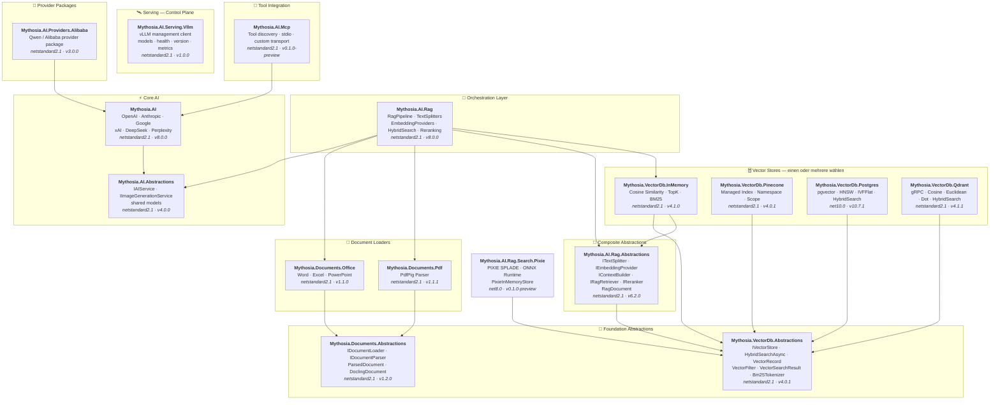

<div align="center">

🌐 [English](../../README.md) · [한국어](../ko/README.md) · [日本語](../ja/README.md) · [Français](../fr/README.md) · [Deutsch](README.md) · [Русский](../ru/README.md) · [Українська](../uk/README.md) · [简体中文](../zh-Hans/README.md) · [繁體中文](../zh-Hant/README.md) · [Tiếng Việt](../vi/README.md) · [ภาษาไทย](../th/README.md) · [Português](../pt/README.md) · [Español](../es/README.md)

<br>

[](https://github.com/AJ-comp/Mythosia.AI)


### Eine modulare .NET-AI-Bibliothek für intelligente Anwendungen

**Anbieter wechseln, RAG hinzufügen, Dokumente laden — alles mit einer einheitlichen API.**

<br>

[](https://www.nuget.org/packages/Mythosia.AI)
[](https://www.nuget.org/packages/Mythosia.AI)
[](https://aj-comp.github.io/Mythosia.AI/)
[](https://dotnet.microsoft.com)

<br>

**[📖 Erste Schritte](https://aj-comp.github.io/Mythosia.AI/)** &nbsp;·&nbsp; **[API-Referenz](https://aj-comp.github.io/Mythosia.AI/api/)** &nbsp;·&nbsp; **[GitHub ↗](https://github.com/AJ-comp/Mythosia.AI)**

<br>

</div>

Wählen Sie für TXT und Markdown einen [regelbasierten Splitter](text-splitters.md) passend zur Struktur. Größenprüfung, Überlappung und Unicode-Grenzen werden berücksichtigt; Markdown behält Überschriften, Codeblöcke und Tabellenzeilen. Zeichen-/Wortzahlen sind keine Modell-Tokenlimits. Tabellenbedingungen und Code-Einrückungen behalten ihre Bedeutung; übermäßige Markdown-Kontextwiederholung endet mit einer expliziten Ausnahme.

Damit eine scheinbar erfolgreiche Indexierung keine Chunks überschreibt oder falsche Vektoren zuordnet, lehnt die [Indexierungsprüfung](rag-pipeline.md#indexing-validation) ungültige IDs und Embedding-Batches vor dem Speichern ab. Benutzerdefinierte Splitter müssen eindeutige IDs vergeben und Dokumentmetadaten übernehmen.

Stabile [Datei-IDs](document-loaders.md#file-source-identity), geprüfte [Fragevektoren](rag-embedding.md#query-embedding-validation) und [dokumentbezogene Persistenz mit URL-Abbruch](rag-pipeline.md#custom-persistence) verhindern doppelte Registrierung, ungültige Suchen und veraltete Chunks.

Mit der optionalen Vorschau `Mythosia.AI.Rag.Search.Pixie` lässt sich lokale neuronale Sparse-Suche mit der bisherigen Suche vergleichen. Der Anbieter dichter Embeddings bleibt erhalten; PIXIE nutzt einen Index im Arbeitsspeicher. Persistente Speicher werden nicht migriert und die Standardsuche wird nicht ersetzt. [PIXIE einrichten und vergleichen (Englisch)](../rag-pixie-search.md).

Anfragen unabhängig konfigurieren, Arbeit abbrechen und Antworten samt Verbrauch und Quellen erhalten: Der [v8-Umstiegsleitfaden](v8-migration.md) beschreibt sechs Architekturänderungen, Migrationsbeispiele und den Prüfumfang.

> Hier dokumentierte Paketversionen: [Mythosia.AI 8.0.0](../../src/core/Mythosia.AI/RELEASE_NOTES.md#v800), [Abstractions 4.0.0](../../src/core/Mythosia.AI.Abstractions/RELEASE_NOTES.md#v400), [Alibaba 3.0.0](../../src/core/Mythosia.AI.Providers.Alibaba/RELEASE_NOTES.md#v300), [RAG 8.0.0](../../src/rag/Mythosia.AI.Rag/RELEASE_NOTES.md#v800), [MCP 0.1.0-preview](../../src/integrations/Mythosia.AI.Mcp/RELEASE_NOTES.md#v010-preview), [Serving.Vllm 1.0.0](../../src/serving/Mythosia.AI.Serving.Vllm/RELEASE_NOTES.md#v100).

---

### Welche Pakete werden benötigt?

```
dotnet add package Mythosia.AI                    # hier starten (mehr brauchen Sie nicht)
dotnet add package Mythosia.AI.Rag                # optional: wenn Sie RAG benötigen
dotnet add package Mythosia.VectorDb.Postgres     # optional: wenn Sie einen produktiven Vector Store benötigen
```

| Schritt | Paket | Wann |
| :--: | --- | --- |
| **1** | **`Mythosia.AI`** | **Hier starten** — Completion, Streaming, Funktionsaufrufe, strukturierte Ausgabe (OpenAI / Claude / Gemini / Grok / DeepSeek / Perplexity) |
| **2** | **`Mythosia.AI.Rag`** | Wenn Sie RAG benötigen — Textsplitting, Embeddings, hybride Suche, Reranking, InMemory Vector Store und Dokumentenlader (Word / Excel / PowerPoint / PDF) |
| **3** | **`Mythosia.VectorDb.Postgres`** / **`Qdrant`** / **`Pinecone`** | Wenn Sie statt InMemory einen produktiven Vector Store benötigen — wählen Sie einen |

Mit `CreateRequest(...).WithTemperature(...).GetCompletionAsync()` bereiten Sie unabhängige Anfrageeinstellungen vor. Der [Anfrageleitfaden](request-building.md) erklärt Before/After, Run, Profile und die Grenzen gemeinsam genutzter Gespräche.

Für zeitkritische Anfragen wählen Sie die [Verarbeitungsgeschwindigkeit](request-building.md#inference-speed). `WithSpeed` behält Modell und Denkaufwand bei; `Processing` meldet den tatsächlich verwendeten Modus. Fast ist für unterstützte Kombinationen kostenpflichtig.

## Architektur

<a href="../assets/architecture.svg">
  <picture>
    <source media="(prefers-color-scheme: dark)" srcset="../assets/architecture-dark.svg">
    
  </picture>
</a>

<details>
<summary>Paketabhängigkeiten im Detail</summary>



</details>

## Demo / Testumgebung (Chat UI)

Dieses Repository enthält eine auf Mythosia.AI basierende Beispiel-Chat-UI — starten Sie Mythosia.AI.Samples.ChatUi, um die Bibliothek in Aktion zu testen.

### Beispiel ausführen

Führen Sie **`Mythosia.AI.Samples.ChatUi`** lokal aus:

```bash
# vom Repository-Root
dotnet run --project apps/Mythosia.AI.Samples.ChatUi
```

https://github.com/user-attachments/assets/62094afe-9add-4c14-b818-6b31f200dc01


## Schnellstart

### Einfache AI-Completion

```csharp
using Mythosia.AI;

var service = new OpenAIService(apiKey, httpClient);
var response = await service.GetCompletionAsync("Hello!");
```

### Streaming

```csharp
await foreach (var token in service.StreamAsync("Tell me a story"))
{
    Console.Write(token);
}
```

### Reasoning-Streaming

OpenAI, Claude, Gemini, Grok und DeepSeek Flash liefern Reasoning-Inhalte des Anbieters im selben Streaming-Muster. Aktiviere Reasoning am Service oder für die Anfrage und beobachte es mit `StreamOptions.WithReasoning()`:

```csharp
await foreach (var content in service.StreamAsync(message, new StreamOptions().WithReasoning()))
{
    if (content.Type == StreamingContentType.Reasoning)
        Console.Write($"[Think] {content.Content}");
    else if (content.Type == StreamingContentType.Text)
        Console.Write(content.Content);
}
```

Wenn Aufgaben mehr Reasoning oder aktuelle beziehungsweise dokumentierte Quellen benötigen, verwenden Sie die [gemeinsamen Reasoning- und Suchoptionen](reasoning-and-search.md).

### Funktionsaufrufe

```csharp
var service = new OpenAIService(apiKey, httpClient)
    .WithFunction(
        "get_weather",
        "Gets the current weather for a location",
        ("location", "The city and country", required: true),
        (string location) => $"The weather in {location} is sunny, 22C"
    );

var response = await service.GetCompletionAsync("What's the weather in Seoul?");
```

Eine langsame Abfrage muss die Antwort nicht vollständig anhalten. Während etwa Wetterdaten geladen werden, kann das Modell bereits allgemeine Reisetipps formulieren, die nicht vom Ergebnis abhängen.

Mit `FunctionDefinition.AllowAsync = true` oder `FunctionBuilder.WithAsync()` erlaubst du GPT-6 Astra / Sol / Luna über Responses asynchrone Tool-Aufrufe. Standard ist `false`; nicht unterstützte Modelle warten auf das Ergebnis desselben Handlers. Beispiele und Details zur Lebensdauer des Requests stehen im [Leitfaden für Funktionsaufrufe](function-calling.md).

### Strukturierte Ausgabe (einfach)

```csharp
// LLM-Antworten direkt in C#-POCOs deserialisieren mit automatischer Wiederherstellung
var result = await service.GetCompletionAsync<WeatherResponse>(
    "What's the weather in Seoul?");
```

### Strukturierte Ausgabe (Liste)

```csharp
// Sammlungstypen funktionieren direkt — kein Wrapper-DTO nötig
var items = await service.GetCompletionAsync<List<ItemDto>>(
    "Extract all entities from this document...");
```

### Strukturierte Ausgabe (Streaming)

```csharp
// Text-Chunks in Echtzeit streamen + finales deserialisiertes Objekt erhalten
var run = service.BeginStream(prompt).As<MyDto>();

await foreach (var chunk in run.Stream())
    Console.Write(chunk);          // Echtzeit-UI

MyDto dto = await run.Result;      // geparst und automatisch repariert
```

### Gesprächszusammenfassungs-Richtlinie

```csharp
// Alte Nachrichten automatisch zusammenfassen, wenn das Gespräch lang wird
service.ConversationPolicy = SummaryConversationPolicy.ByMessage(
    triggerCount: 20,
    keepRecentCount: 5
);

// Tokenbasierter Trigger
service.ConversationPolicy = SummaryConversationPolicy.ByToken(
    triggerTokens: 3000,
    keepRecentTokens: 1000
);

// Einfach wie gewohnt verwenden — die Zusammenfassung erfolgt automatisch
await service.GetCompletionAsync("Continue our conversation...");

// Beim Streaming die Zusammenfassungsrichtlinie vor StreamAsync() explizit anwenden
await service.ApplySummaryPolicyIfNeededAsync();
await foreach (var chunk in service.StreamAsync("Continue..."))
    Console.Write(chunk.Content);

// Zusammenfassung sitzungsübergreifend speichern/wiederherstellen
string saved = service.ConversationPolicy.CurrentSummary;
policy.LoadSummary(saved);
```

### RAG (Retrieval-Augmented Generation)

Stichwort-, semantische oder Hybridsuche wählen, ohne jeder Suche Anfrage-Embeddings vorzuschreiben. [Suchleitfaden](rag-hybrid-search.md).

```bash
dotnet add package Mythosia.AI.Rag
```

```csharp
using Mythosia.AI.Rag;

var service = new AnthropicService(apiKey, httpClient)
    .WithRag(rag => rag
        .AddDocument("manual.txt")
        .AddDocument("policy.txt")
    );

var response = await service.GetCompletionAsync("What is the refund policy?");
```

## Unterstützte Anbieter

> Grok 4.7 ist eine noch unveröffentlichte Ergänzung; siehe [Modellwahl, Reasoning und Verarbeitungsgeschwindigkeit](providers.md#grok-47).

> GPT-6 Sol/Luna sind noch nicht veröffentlicht. Siehe [Modellwahl und Voraussetzungen](providers.md#gpt-6-sol-luna).

> Claude Opus 5.5 benötigt zueinander passende, noch unveröffentlichte Builds von Core und Abstractions; siehe [Konfiguration und Migration](providers.md#claude-opus-55).

| Anbieter | Paket | Modelle |
| --- | --- | --- |
| **OpenAI** | `Mythosia.AI` | GPT-6 Astra / Sol / Luna, GPT-5.6 Sol / Terra / Luna, GPT-5.5 / 5.5 Pro / 5.4 / 5.4 Mini / 5.4 Nano / 5.4 Pro / 5.3 Codex / 5.2 / 5.2 Pro / 5.1, GPT-4.1 / 4.1 Mini, GPT-4o / 4o Mini |
| **Anthropic** | `Mythosia.AI` | Claude Fable 5.1 / 5, Mythos 5.1 / 5 (limited), [Opus 5.5](providers.md#claude-opus-55) / 5 / 4.8 / 4.7 / 4.6 / 4.5, Sonnet 5 / 4.6 / 4.5, Haiku 4.5 |
| **Google** | `Mythosia.AI` | Gemini 3.8 Flash, Gemini 3.7 Flash, Gemini 3.6 Flash, Gemini 3.5 Flash/Flash-Lite, Gemini 3.1 Pro Preview/Flash-Lite, Gemini 3 Flash Preview, Gemini 2.5 Pro/Flash/Flash-Lite, Gemini 3.1 Flash Image, Gemini 3.1 Flash-Lite Image, Gemini 3 Pro Image |
| **xAI** | `Mythosia.AI` | Grok 4.7, Grok 4.6, Grok 4.5 (Standard), Grok 4.3, Grok 4.20 (reasoning / non-reasoning), Grok Build |
| **DeepSeek** | `Mythosia.AI` | Flash (V4.1 Flash), V4 Pro |
| **Perplexity** | `Mythosia.AI` | Agent-API-Presets und `perplexity/sonar` |
| **Alibaba / Qwen** | `Mythosia.AI.Providers.Alibaba` | Qwen Max / Plus / Turbo / Qwen3 / Qwen3.5 Varianten |

Verwenden Sie Perplexity, wenn Antworten aktuelle Informationen und überprüfbare Quellen benötigen. `PerplexityService` ruft die Agent API auf. Die eigenständige Suche und Embeddings ermöglichen eine Dokumentensuche mit einem selbst gewählten Antwortmodell. [Perplexity Agent API, Suche und Embeddings](perplexity.md).

Für lange Dokumentprüfungen und Aufgaben mit wiederholten Tool-Aufrufen kannst du Gemini 3.7 Flash oder 3.8 Flash über den bestehenden Google-Adapter auswählen. Die Unterstützung beginnt mit `Mythosia.AI` 8.0.0 / `Mythosia.AI.Abstractions` 4.0.0; Standard bleibt Gemini 3.6 Flash.

Für einen schnellen Entwurf mit anschließender gründlicher Prüfung kannst du Grok 4.6 ausdrücklich auswählen und den Aufwand von `Low` bis `XHigh` festlegen. Unterstützt ab `Mythosia.AI` 8.0.0 / `Mythosia.AI.Abstractions` 4.0.0; Standard von `XAIService` bleibt Grok 4.5. Siehe [Grok-Konfiguration](providers.md#xai-xaiservice).

Für Bildentwürfe oder kombinierte Referenzen verwenden Sie [Grok Imagine Image 2.0](providers.md#grok-imagine-image-20) über `IImageGenerationService`. Behalten Sie `OutputFormat = ImageOutputFormat.Auto` und wählen Sie die Dateiendung nach `MediaType`; xAI kann keinen Ausgabe-Codec wählen. Siehe [Migration der Bildoptionen](providers.md#image-options-migration). Das Chatmodell bleibt unverändert.

Für schnelle Bildentwürfe eignet sich Flare, für präzise Änderungen Sunburst. [GPT Image 2.5 erzeugen und bearbeiten](providers.md#gpt-image-25) nutzt die bestehende Bild-API mit expliziter Modellauswahl je Anfrage; OpenAI bleibt standardmäßig bei GPT Image 2.

Für gültige Größen bei Bilderzeugung und -bearbeitung beachten Sie die [Google-Bildoptionen je Modell](providers.md#google-image-options): Flash unterstützt 512/1K/2K/4K, Flash-Lite derzeit 1K und Pro 1K/2K/4K. Flash/Lite bieten 14 Seitenverhältnisse, Pro die 10 Standardverhältnisse; alle erlauben `Auto`. Explizit angegebene, nicht unterstützte Größen oder Verhältnisse werden vor dem HTTP-Aufruf abgelehnt.

Für Diagramme, Screenshots, lokale Tool-Aufrufe oder gründliche Prüfung nach einer schnellen Antwort nutze [DeepSeek Flash](providers.md#deepseek-deepseekservice) (`AIModels.DeepSeek.Flash`, V4.1 Flash). Reasoning bleibt standardmäßig aus; aktiviere es mit `WithDeepSeekReasoning(...)` oder `WithReasoning(...)` je Anfrage.

Für reine Textaufgaben steht `AIModels.DeepSeek.V4Pro` (`deepseek-v4-pro`, V4-Pro-0813) bereit. Flash bleibt Standard und unterstützt Bilder; beide bieten Low/High/Max-Reasoning und dieselbe Ausgabegrenze. Mit `UseResponsesApi = true` vor dem Erstellen einer Anfrage verwenden die bestehenden Completion-, Streaming-, Run- und lokalen Funktions-APIs Responses. Der Standard bleibt `false`, damit bestehende Anwendungen Chat Completions behalten. Die Wahl wird für die Anfrage samt Tool-Runden festgehalten. Responses überträgt den gesamten Gesprächs- und ursprünglichen Reasoning-Verlauf erneut, ohne gespeicherte Antwort-IDs vorauszusetzen.

Verwenden Sie ein hochgeladenes Bild mit `DeepSeekImageFileContent` für mehrere Fragen an Flash über Chat Completions oder Responses. Das reine Textmodell V4 Pro lehnt Bilder ab. Die Ergänzungen V4 Pro, Responses und Files benötigen zueinander passende, noch unveröffentlichte Builds von Core und Abstractions und fehlen in den veröffentlichten Versionen 8.0.0 / 4.0.0. Siehe [Bild-Uploads, Wiederverwendung und Grenzen](providers.md#deepseek-deepseekservice).

## Pakete

### Kern

| Paket | NuGet | Beschreibung |
| --- | --- | --- |
| [Mythosia.AI](../../src/core/Mythosia.AI/README.md) | [](https://www.nuget.org/packages/Mythosia.AI) | Kernbibliothek — integrierte Anbieter, Streaming, Funktionsaufrufe und multimodale Unterstützung |
| [Mythosia.AI.Abstractions](../../src/core/Mythosia.AI.Abstractions/README.md) | [](https://www.nuget.org/packages/Mythosia.AI.Abstractions) | `IAIService`-Schnittstelle und gemeinsame Modelle — leichtes Vertragspaket für Bibliotheken |
| [Mythosia.AI.Providers.Alibaba](../../src/core/Mythosia.AI.Providers.Alibaba/README.md) | [](https://www.nuget.org/packages/Mythosia.AI.Providers.Alibaba) | Alibaba / Qwen-Anbieterpaket, basierend auf `Mythosia.AI` |

### RAG

| Paket | NuGet | Beschreibung |
| --- | --- | --- |
| [Mythosia.AI.Rag](../../src/rag/Mythosia.AI.Rag/README.md) | [](https://www.nuget.org/packages/Mythosia.AI.Rag) | Fluent-RAG-Erweiterung für IAIService mit `.WithRag()`-API |
| [Mythosia.AI.Rag.Abstractions](../../src/rag/Mythosia.AI.Rag.Abstractions/README.md) | [](https://www.nuget.org/packages/Mythosia.AI.Rag.Abstractions) | Schnittstellen und Modelle für RAG-Pipeline-Komponenten |

### Dokumentenlader

| Paket | NuGet | Beschreibung |
| --- | --- | --- |
| [Mythosia.Documents.Abstractions](../../src/loaders/Mythosia.Documents.Abstractions/README.md) | [](https://www.nuget.org/packages/Mythosia.Documents.Abstractions) | Schnittstellen und Modelle der Dokumentenlader (`IDocumentLoader`, `DoclingDocument`) |
| [Mythosia.Documents.Office](../../src/loaders/Mythosia.Documents.Office/README.md) | [](https://www.nuget.org/packages/Mythosia.Documents.Office) | OpenXml-Parser für Word / Excel / PowerPoint |
| [Mythosia.Documents.Pdf](../../src/loaders/Mythosia.Documents.Pdf/README.md) | [](https://www.nuget.org/packages/Mythosia.Documents.Pdf) | PDF-Parser via PdfPig |

### Vector Stores

> **Einen oder mehrere wählen** — alle implementieren `IVectorStore` aus dem Abstractions-Paket.

| Paket | NuGet | Beschreibung |
| --- | --- | --- |
| [Mythosia.VectorDb.Abstractions](../../src/vectordb/Mythosia.VectorDb.Abstractions/README.md) | [](https://www.nuget.org/packages/Mythosia.VectorDb.Abstractions) | `IVectorStore` · `VectorRecord` · `VectorFilter`-Verträge |
| [Mythosia.VectorDb.InMemory](../../src/vectordb/Mythosia.VectorDb.InMemory/README.md) | [](https://www.nuget.org/packages/Mythosia.VectorDb.InMemory) | In-Memory-Store — keine Infrastruktur nötig, ideal für Prototyping |
| [Mythosia.VectorDb.Pinecone](../../src/vectordb/Mythosia.VectorDb.Pinecone/README.md) | [](https://www.nuget.org/packages/Mythosia.VectorDb.Pinecone) | Pinecone HTTP API — Index-/Namespace-/Scope-Isolierung für verwaltete Vektordatenbank |
| [Mythosia.VectorDb.Postgres](../../src/vectordb/Mythosia.VectorDb.Postgres/README.md) | [](https://www.nuget.org/packages/Mythosia.VectorDb.Postgres) | PostgreSQL + pgvector — HNSW / IVFFlat-Indizes, produktionsbereit |
| [Mythosia.VectorDb.Qdrant](../../src/vectordb/Mythosia.VectorDb.Qdrant/README.md) | [](https://www.nuget.org/packages/Mythosia.VectorDb.Qdrant) | Qdrant gRPC-Client — Cosine / Euclidean / Dot, automatische Bereitstellung |

### Serving — Control Plane

> Management-/Introspektions-Clients für Model-Serving-Laufzeiten. Chat bleibt bei den Anbieterpaketen: `Providers.*` = Chat Data Plane, `Serving.*` = Server Control Plane.

| Paket | NuGet | Beschreibung |
| --- | --- | --- |
| [Mythosia.AI.Serving.Vllm](../../src/serving/Mythosia.AI.Serving.Vllm/README.md) | [](https://www.nuget.org/packages/Mythosia.AI.Serving.Vllm) | vLLM-Control-Plane-Client — Model Cards (das tatsächlich geladene Modell via `root`), Health, Serverversion, Prometheus-Metriken |

## Repository-Struktur

```text
src/
  core/
    Mythosia.AI/                        # Kern-AI-Dienstbibliothek
    Mythosia.AI.Abstractions/           # IAIService-Schnittstelle und gemeinsame Modelle
    Mythosia.AI.Providers.Alibaba/      # Alibaba / Qwen-Anbieterpaket
  loaders/
    Mythosia.Documents.Abstractions/    # Dokumentenlader-Verträge (IDocumentLoader, DoclingDocument)
    Mythosia.Documents.Office/          # Office-Dokumentenlader (Word/Excel/PowerPoint)
    Mythosia.Documents.Pdf/             # PDF-Dokumentenlader
  rag/
    Mythosia.AI.Rag/                    # RAG Fluent API und Pipeline
    Mythosia.AI.Rag.Abstractions/       # RAG-Schnittstellen und -Modelle (RagDocument)
  serving/
    Mythosia.AI.Serving.Vllm/           # vLLM-Control-Plane-Client (Modelle/Health/Version/Metriken)
  vectordb/
    Mythosia.VectorDb.Abstractions/     # Vector-Store-Verträge
    Mythosia.VectorDb.InMemory/         # In-Memory Vector Store
    Mythosia.VectorDb.Pinecone/         # Pinecone Vector Store
    Mythosia.VectorDb.Postgres/         # PostgreSQL + pgvector Store
    Mythosia.VectorDb.Qdrant/           # Qdrant Vector Store
apps/                                   # Beispielanwendungen
tests/                                  # Unit-/Integrationstestprojekte
```

## Installation

```bash
dotnet add package Mythosia.AI
```

Für erweiterte LINQ-Operationen mit Streams:

```bash
dotnet add package System.Linq.Async
```

## Dokumentation

- [Grundlegende Nutzungsanleitung](getting-started.md)
- [Mythosia.AI README](../../src/core/Mythosia.AI/README.md)  Vollständige API-Referenz mit Funktionsaufrufen, Streaming und Modellkonfiguration
- [Mythosia.AI.Rag README](../../src/rag/Mythosia.AI.Rag/README.md)  RAG-Pipeline-Nutzung und eigene Implementierungen
- [Lader-Leitfaden](document-loaders.md)
- [Versionshinweise](../../src/core/Mythosia.AI/RELEASE_NOTES.md)

## Lizenz

Dieses Projekt steht unter der [MIT-Lizenz](https://github.com/AJ-comp/Mythosia.AI/blob/main/LICENSE).

## Ursprung

Dieses Projekt war ursprünglich Teil von [Mythosia](https://github.com/AJ-comp/Mythosia).

[Modelloptionen mit gemeinsamen Fähigkeitsdefinitionen aufbauen](model-capabilities.md).
