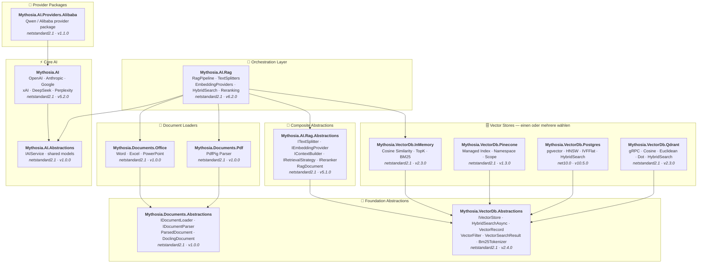

<div align="center">

🌐 [English](../../README.md) · [한국어](../ko/README.md) · [日本語](../ja/README.md) · [Français](../fr/README.md) · [Deutsch](README.md) · [Русский](../ru/README.md) · [Українська](../uk/README.md) · [简体中文](../zh-Hans/README.md) · [繁體中文](../zh-Hant/README.md)

<br>

[](https://github.com/AJ-comp/Mythosia.AI)


### Eine modulare .NET-AI-Bibliothek für intelligente Anwendungen

**Anbieter wechseln, RAG hinzufügen, Dokumente laden — alles mit einer einheitlichen API.**

<br>

[](https://www.nuget.org/packages/Mythosia.AI)
[](https://www.nuget.org/packages/Mythosia.AI)
[](https://aj-comp.github.io/Mythosia.AI/)
[](https://dotnet.microsoft.com)

<br>

**[📖 Erste Schritte](https://aj-comp.github.io/Mythosia.AI/)** &nbsp;·&nbsp; **[API-Referenz](https://aj-comp.github.io/Mythosia.AI/api/)** &nbsp;·&nbsp; **[GitHub ↗](https://github.com/AJ-comp/Mythosia.AI)**

<br>

</div>

---

### Welche Pakete werden benötigt?

```
dotnet add package Mythosia.AI                    # hier starten (mehr brauchen Sie nicht)
dotnet add package Mythosia.AI.Rag                # optional: wenn Sie RAG benötigen
dotnet add package Mythosia.VectorDb.Postgres     # optional: wenn Sie einen produktiven Vector Store benötigen
```

| Schritt | Paket | Wann |
| :--: | --- | --- |
| **1** | **`Mythosia.AI`** | **Hier starten** — Completion, Streaming, Funktionsaufrufe, strukturierte Ausgabe (OpenAI / Claude / Gemini / Grok / DeepSeek / Perplexity) |
| **2** | **`Mythosia.AI.Rag`** | Wenn Sie RAG benötigen — Textsplitting, Embeddings, hybride Suche, Reranking, InMemory Vector Store und Dokumentenlader (Word / Excel / PowerPoint / PDF) |
| **3** | **`Mythosia.VectorDb.Postgres`** / **`Qdrant`** / **`Pinecone`** | Wenn Sie statt InMemory einen produktiven Vector Store benötigen — wählen Sie einen |

## Architektur



## Demo / Testumgebung (Chat UI)

Dieses Repository enthält eine auf Mythosia.AI basierende Beispiel-Chat-UI — starten Sie Mythosia.AI.Samples.ChatUi, um die Bibliothek in Aktion zu testen.

### Beispiel ausführen

Führen Sie **`Mythosia.AI.Samples.ChatUi`** lokal aus:

```bash
# vom Repository-Root
dotnet run --project samples/Mythosia.AI.Samples.ChatUi
```

https://github.com/user-attachments/assets/62094afe-9add-4c14-b818-6b31f200dc01


## Schnellstart

### Einfache AI-Completion

```csharp
using Mythosia.AI;

var service = new OpenAIService(apiKey, httpClient);
var response = await service.GetCompletionAsync("Hello!");
```

### Streaming

```csharp
await foreach (var token in service.StreamAsync("Tell me a story"))
{
    Console.Write(token);
}
```

### Reasoning-Streaming

Alle Anbieter mit Reasoning-Unterstützung (OpenAI, Claude, Gemini, Grok, DeepSeek) verwenden dasselbe Streaming-Muster:

```csharp
await foreach (var content in service.StreamAsync(message, new StreamOptions().WithReasoning()))
{
    if (content.Type == StreamingContentType.Reasoning)
        Console.Write($"[Think] {content.Content}");
    else if (content.Type == StreamingContentType.Text)
        Console.Write(content.Content);
}
```

### Funktionsaufrufe

```csharp
var service = new OpenAIService(apiKey, httpClient)
    .WithFunction(
        "get_weather",
        "Gets the current weather for a location",
        ("location", "The city and country", required: true),
        (string location) => $"The weather in {location} is sunny, 22C"
    );

var response = await service.GetCompletionAsync("What's the weather in Seoul?");
```

### Strukturierte Ausgabe (einfach)

```csharp
// LLM-Antworten direkt in C#-POCOs deserialisieren mit automatischer Wiederherstellung
var result = await service.GetCompletionAsync<WeatherResponse>(
    "What's the weather in Seoul?");
```

### Strukturierte Ausgabe (Liste)

```csharp
// Sammlungstypen funktionieren direkt — kein Wrapper-DTO nötig
var items = await service.GetCompletionAsync<List<ItemDto>>(
    "Extract all entities from this document...");
```

### Strukturierte Ausgabe (Streaming)

```csharp
// Text-Chunks in Echtzeit streamen + finales deserialisiertes Objekt erhalten
var run = service.BeginStream(prompt).As<MyDto>();

await foreach (var chunk in run.Stream())
    Console.Write(chunk);          // Echtzeit-UI

MyDto dto = await run.Result;      // geparst und automatisch repariert
```

### Gesprächszusammenfassungs-Richtlinie

```csharp
// Alte Nachrichten automatisch zusammenfassen, wenn das Gespräch lang wird
service.ConversationPolicy = SummaryConversationPolicy.ByMessage(
    triggerCount: 20,
    keepRecentCount: 5
);

// Tokenbasierter Trigger
service.ConversationPolicy = SummaryConversationPolicy.ByToken(
    triggerTokens: 3000,
    keepRecentTokens: 1000
);

// Einfach wie gewohnt verwenden — die Zusammenfassung erfolgt automatisch
await service.GetCompletionAsync("Continue our conversation...");

// Beim Streaming die Zusammenfassungsrichtlinie vor StreamAsync() explizit anwenden
await service.ApplySummaryPolicyIfNeededAsync();
await foreach (var chunk in service.StreamAsync("Continue..."))
    Console.Write(chunk.Content);

// Zusammenfassung sitzungsübergreifend speichern/wiederherstellen
string saved = service.ConversationPolicy.CurrentSummary;
policy.LoadSummary(saved);
```

### RAG (Retrieval-Augmented Generation)

```bash
dotnet add package Mythosia.AI.Rag
```

```csharp
using Mythosia.AI.Rag;

var service = new AnthropicService(apiKey, httpClient)
    .WithRag(rag => rag
        .AddDocument("manual.txt")
        .AddDocument("policy.txt")
    );

var response = await service.GetCompletionAsync("What is the refund policy?");
```

## Unterstützte Anbieter

| Anbieter | Paket | Modelle |
| --- | --- | --- |
| **OpenAI** | `Mythosia.AI` | GPT-5.4 / 5.4 Mini / 5.4 Nano / 5.4 Pro / 5.3 Codex / 5.2 / 5.2 Pro / 5.2 Codex / 5.1 / 5 / 5 Mini / 5 Nano, GPT-4.1 / 4.1 Mini / 4.1 Nano, GPT-4o / 4o Mini, o3 / o3 Pro |
| **Anthropic** | `Mythosia.AI` | Claude Opus 4.6 / 4.5 / 4.1 / 4, Sonnet 4.6 / 4.5 / 4, Haiku 4.5 |
| **Google** | `Mythosia.AI` | Gemini 3 Flash/Pro Preview, Gemini 2.5 Pro/Flash/Flash-Lite |
| **xAI** | `Mythosia.AI` | Grok 4, Grok 4.1 Fast, Grok 3, Grok 3 Mini |
| **DeepSeek** | `Mythosia.AI` | Chat, Reasoner |
| **Perplexity** | `Mythosia.AI` | Sonar, Sonar Pro, Sonar Reasoning |
| **Alibaba / Qwen** | `Mythosia.AI.Providers.Alibaba` | Qwen Max / Plus / Turbo / Qwen3 / Qwen3.5 Varianten |

## Pakete

### Kern

| Paket | NuGet | Beschreibung |
| --- | --- | --- |
| [Mythosia.AI](../../src/core/Mythosia.AI/) | [](https://www.nuget.org/packages/Mythosia.AI) | Kernbibliothek — integrierte Anbieter, Streaming, Funktionsaufrufe und multimodale Unterstützung |
| [Mythosia.AI.Abstractions](../../src/core/Mythosia.AI.Abstractions/) | [](https://www.nuget.org/packages/Mythosia.AI.Abstractions) | `IAIService`-Schnittstelle und gemeinsame Modelle — leichtes Vertragspaket für Bibliotheken |
| [Mythosia.AI.Providers.Alibaba](../../src/core/Mythosia.AI.Providers.Alibaba/) | [](https://www.nuget.org/packages/Mythosia.AI.Providers.Alibaba) | Alibaba / Qwen-Anbieterpaket, basierend auf `Mythosia.AI` |

### RAG

| Paket | NuGet | Beschreibung |
| --- | --- | --- |
| [Mythosia.AI.Rag](../../src/rag/Mythosia.AI.Rag/) | [](https://www.nuget.org/packages/Mythosia.AI.Rag) | Fluent-RAG-Erweiterung für IAIService mit `.WithRag()`-API |
| [Mythosia.AI.Rag.Abstractions](../../src/rag/Mythosia.AI.Rag.Abstractions/) | [](https://www.nuget.org/packages/Mythosia.AI.Rag.Abstractions) | Schnittstellen und Modelle für RAG-Pipeline-Komponenten |

### Dokumentenlader

| Paket | NuGet | Beschreibung |
| --- | --- | --- |
| [Mythosia.Documents.Abstractions](../../src/loaders/Mythosia.Documents.Abstractions/) | [](https://www.nuget.org/packages/Mythosia.Documents.Abstractions) | Schnittstellen und Modelle der Dokumentenlader (`IDocumentLoader`, `DoclingDocument`) |
| [Mythosia.Documents.Office](../../src/loaders/Mythosia.Documents.Office/) | [](https://www.nuget.org/packages/Mythosia.Documents.Office) | OpenXml-Parser für Word / Excel / PowerPoint |
| [Mythosia.Documents.Pdf](../../src/loaders/Mythosia.Documents.Pdf/) | [](https://www.nuget.org/packages/Mythosia.Documents.Pdf) | PDF-Parser via PdfPig |

### Vector Stores

> **Einen oder mehrere wählen** — alle implementieren `IVectorStore` aus dem Abstractions-Paket.

| Paket | NuGet | Beschreibung |
| --- | --- | --- |
| [Mythosia.VectorDb.Abstractions](../../src/vectordb/Mythosia.VectorDb.Abstractions/) | [](https://www.nuget.org/packages/Mythosia.VectorDb.Abstractions) | `IVectorStore` · `VectorRecord` · `VectorFilter`-Verträge |
| [Mythosia.VectorDb.InMemory](../../src/vectordb/Mythosia.VectorDb.InMemory/) | [](https://www.nuget.org/packages/Mythosia.VectorDb.InMemory) | In-Memory-Store — keine Infrastruktur nötig, ideal für Prototyping |
| [Mythosia.VectorDb.Pinecone](../../src/vectordb/Mythosia.VectorDb.Pinecone/) | [](https://www.nuget.org/packages/Mythosia.VectorDb.Pinecone) | Pinecone HTTP API — Index-/Namespace-/Scope-Isolierung für verwaltete Vektordatenbank |
| [Mythosia.VectorDb.Postgres](../../src/vectordb/Mythosia.VectorDb.Postgres/) | [](https://www.nuget.org/packages/Mythosia.VectorDb.Postgres) | PostgreSQL + pgvector — HNSW / IVFFlat-Indizes, produktionsbereit |
| [Mythosia.VectorDb.Qdrant](../../src/vectordb/Mythosia.VectorDb.Qdrant/) | [](https://www.nuget.org/packages/Mythosia.VectorDb.Qdrant) | Qdrant gRPC-Client — Cosine / Euclidean / Dot, automatische Bereitstellung |

## Repository-Struktur

```text
src/
  core/
    Mythosia.AI/                        # Kern-AI-Dienstbibliothek
    Mythosia.AI.Abstractions/           # IAIService-Schnittstelle und gemeinsame Modelle
    Mythosia.AI.Providers.Alibaba/      # Alibaba / Qwen-Anbieterpaket
  loaders/
    Mythosia.Documents.Abstractions/    # Dokumentenlader-Verträge (IDocumentLoader, DoclingDocument)
    Mythosia.Documents.Office/          # Office-Dokumentenlader (Word/Excel/PowerPoint)
    Mythosia.Documents.Pdf/             # PDF-Dokumentenlader
  rag/
    Mythosia.AI.Rag/                    # RAG Fluent API und Pipeline
    Mythosia.AI.Rag.Abstractions/       # RAG-Schnittstellen und -Modelle (RagDocument)
  vectordb/
    Mythosia.VectorDb.Abstractions/     # Vector-Store-Verträge
    Mythosia.VectorDb.InMemory/         # In-Memory Vector Store
    Mythosia.VectorDb.Pinecone/         # Pinecone Vector Store
    Mythosia.VectorDb.Postgres/         # PostgreSQL + pgvector Store
    Mythosia.VectorDb.Qdrant/           # Qdrant Vector Store
samples/                                # Beispielanwendungen
tests/                                  # Unit-/Integrationstestprojekte
```

## Installation

```bash
dotnet add package Mythosia.AI
```

Für erweiterte LINQ-Operationen mit Streams:

```bash
dotnet add package System.Linq.Async
```

## Dokumentation

- [Grundlegende Nutzungsanleitung](https://github.com/AJ-comp/Mythosia.AI/wiki)
- [Mythosia.AI README](../../src/core/Mythosia.AI/README.md)  Vollständige API-Referenz mit Funktionsaufrufen, Streaming und Modellkonfiguration
- [Mythosia.AI.Rag README](../../src/rag/Mythosia.AI.Rag/README.md)  RAG-Pipeline-Nutzung und eigene Implementierungen
- Lader-Leitfaden: [EN](../../src/loaders/Mythosia.Documents.Abstractions/docs/en/loaders.md) · [KO](../../src/loaders/Mythosia.Documents.Abstractions/docs/ko/loaders.md) · [JA](../../src/loaders/Mythosia.Documents.Abstractions/docs/ja/loaders.md) · [ZH](../../src/loaders/Mythosia.Documents.Abstractions/docs/zh/loaders.md)
- [Versionshinweise](../../src/core/Mythosia.AI/RELEASE_NOTES.md)

## Lizenz

Dieses Projekt steht unter der [MIT-Lizenz](../../LICENSE).

## Ursprung

Dieses Projekt war ursprünglich Teil von [Mythosia](https://github.com/AJ-comp/Mythosia).
