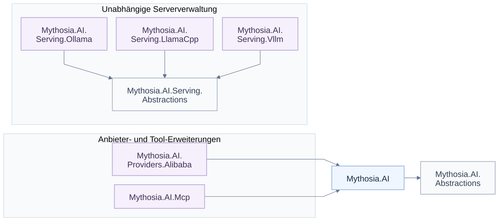
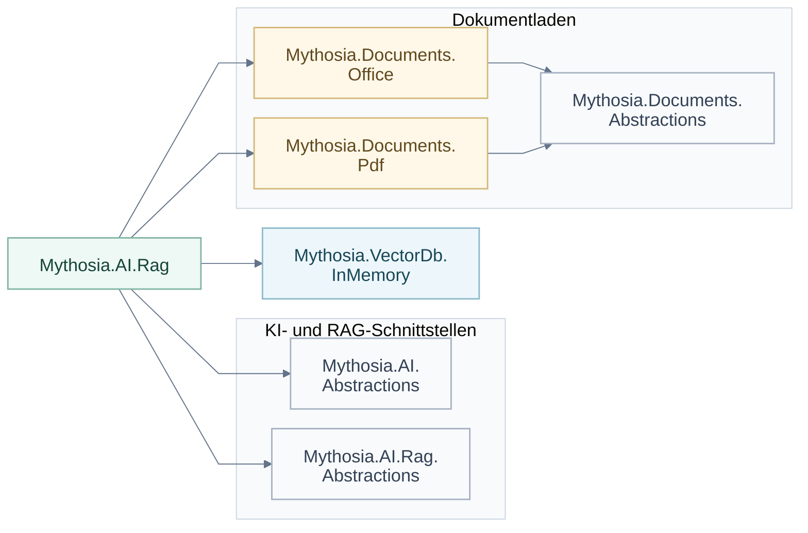
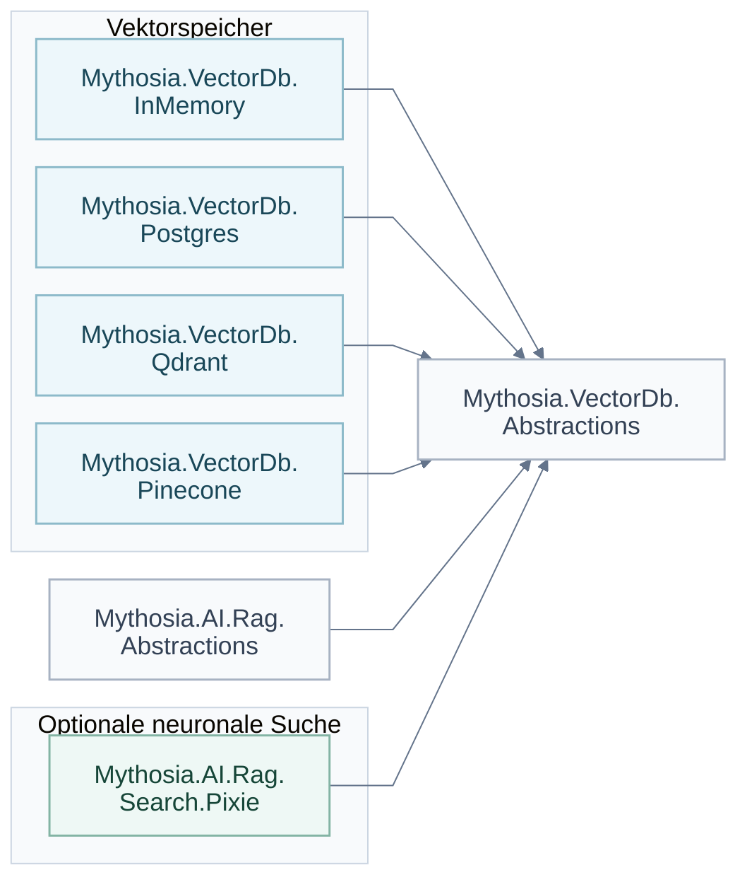

<div align="center">

🌐 [English](../../README.md) · [한국어](../ko/README.md) · [日本語](../ja/README.md) · [Français](../fr/README.md) · [Deutsch](README.md) · [Русский](../ru/README.md) · [Українська](../uk/README.md) · [简体中文](../zh-Hans/README.md) · [繁體中文](../zh-Hant/README.md) · [Tiếng Việt](../vi/README.md) · [ภาษาไทย](../th/README.md) · [Português](../pt/README.md) · [Español](../es/README.md)

<br>

[](https://github.com/AJ-comp/Mythosia.AI)


### Eine modulare .NET-AI-Bibliothek für intelligente Anwendungen

**Anbieter wechseln, RAG hinzufügen, Dokumente laden — alles mit einer einheitlichen API.**

<br>

[](https://www.nuget.org/packages/Mythosia.AI)
[](https://www.nuget.org/packages/Mythosia.AI)
[](https://aj-comp.github.io/Mythosia.AI/)
[](https://dotnet.microsoft.com)

<br>

**[📖 Erste Schritte](https://aj-comp.github.io/Mythosia.AI/)** &nbsp;·&nbsp; **[API-Referenz](https://aj-comp.github.io/Mythosia.AI/api/)** &nbsp;·&nbsp; **[GitHub ↗](https://github.com/AJ-comp/Mythosia.AI)**

<br>

</div>

## Demo / Testumgebung (Chat UI)

Probieren Sie Modelle und Dokumentensuche im Playground aus, bevor Sie Integrationscode schreiben.

Die Aufnahme der aktuellen Playground-Oberfläche zeigt die Modellauswahl, den Sprachwechsel sowie die Einstellungen für Dokumente und die RAG-Pipeline. Das Video enthält englische Untertitel.

https://github.com/user-attachments/assets/4cf90210-b000-41be-8317-a467e93e7504

### Beispiel ausführen

Führen Sie **`Mythosia.AI.Samples.ChatUi`** lokal aus:

```bash
# vom Repository-Root
dotnet run --project apps/Mythosia.AI.Samples.ChatUi
```

<details>
<summary>Playground-Bedienung und Sprachen</summary>

Suchen Sie links Modelle nach Name oder Anbieter und passen Sie die Einstellungen an, führen Sie in der Mitte das Gespräch und prüfen Sie rechts im Inspector die Verarbeitungsinformationen, bevor Sie ein Modell in Ihre Anwendung integrieren. Mit Stop beenden Sie das Warten auf die Antwort; Geschwindigkeitsoptionen lassen sich nur bei unterstützten Modellen und Endpunkten auswählen, und Fast kann zusätzliche Kosten verursachen. Auf kleinen Bildschirmen öffnen sich Models und Inspector als ausklappbare Seitenbereiche; Hinweise zum lokalen Start, zu Dokumenten und zur Pipeline finden Sie im [Chat-UI-Leitfaden](https://github.com/AJ-comp/Mythosia.AI/blob/main/apps/Mythosia.AI.Samples.ChatUi/README.md).

Im Pipeline-Panel können Sie Voyage Context 4, Gemini Embedding 2 und kontextuelle Perplexity-Embeddings mit Schlüssel, Dimensionen und Zeitlimit konfigurieren. Documents zeigt Abschnitts- und Vektoranzahlen und erlaubt den Abbruch der Indexierung. Gespeicherte Einstellungen, Datenbankverbindungen und Codebeispiele verwenden diese Konfiguration. Nach einem Modell- oder Dimensionswechsel muss der Index neu erstellt werden.

Über die Sprachauswahl in der Kopfzeile wechseln Sie zwischen 13 Oberflächensprachen, ohne Eingaben oder Einstellungen zu verlieren. Alle sieben Anbieter erscheinen als eingeklappte Gruppen; klappen Sie eine Gruppe auf oder suchen Sie nach einem Modell.

</details>

## Warum Mythosia.AI?

- **KI-Anbieter über eine API wechseln** — für Chat, Streaming, Tool-Aufrufe und strukturierte Antworten.
- **Antworten auf eigene Dokumente stützen** — mit Dokumentenladern, Embeddings, Suche und Reranking.
- **Anfrageeinstellungen unabhängig halten** und laufende Arbeit über eine gemeinsame Run-API steuern.
- **Nur die benötigten Pakete wählen**, von der Kernbibliothek bis zu optionalen RAG- und Vektorspeicher-Integrationen.

## Welche Pakete werden benötigt?

```
dotnet add package Mythosia.AI                    # hier starten (mehr brauchen Sie nicht)
dotnet add package Mythosia.AI.Rag                # optional: wenn Sie RAG benötigen
dotnet add package Mythosia.VectorDb.Postgres     # optional: wenn Sie einen produktiven Vector Store benötigen
```

| Schritt | Paket | Wann |
| :--: | --- | --- |
| **1** | **`Mythosia.AI`** | **Hier starten** — Completion, Streaming, Funktionsaufrufe, strukturierte Ausgabe (OpenAI / Claude / Gemini / Grok / DeepSeek / Perplexity) |
| **2** | **`Mythosia.AI.Rag`** | Wenn Sie RAG benötigen — Textsplitting, Embeddings, hybride Suche, Reranking, InMemory Vector Store und Dokumentenlader (Word / Excel / PowerPoint / PDF) |
| **3** | **`Mythosia.VectorDb.Postgres`** / **`Qdrant`** / **`Pinecone`** | Wenn Sie statt InMemory einen produktiven Vector Store benötigen — wählen Sie einen |

Mit `CreateRequest(...).WithTemperature(...).GetCompletionAsync()` bereiten Sie unabhängige Anfrageeinstellungen vor. Der [Anfrageleitfaden](request-building.md) erklärt Before/After, Run, Profile und die Grenzen gemeinsam genutzter Gespräche.

Completion, Streaming, strukturierte Ausgabe und Run wenden das tatsächliche Profil einmal an und prüfen die effektiven Einstellungen vor Zusammenfassung, Verlaufsänderungen und Transport. Hilfsanfragen isolieren Unterhaltung und Ausgabeschema der übergeordneten Anfrage, behalten aber die native Anbieterprüfung bei. Siehe [Anfrageeinstellungen](request-building.md).

Anwendungsaufrufe bleiben auch aus gewöhnlichen Kontext- oder Tool-Callbacks und bei wiederverwendeten Profilen oder Nachrichten unabhängig. Bei einem vom Framework aufgerufenen virtuellen Anbieteradapter setzt der erste Aufruf des passenden Basiseinstiegspunkts die vorbereitete Anfrage fort, auch mit ersetzter Eingabe. Ein unabhängiger Hilfsaufruf desselben Einstiegspunkts vor der Weiterleitung benötigt `BeginIndependentRequestScope()`; siehe [Adapterregeln](request-building.md#provider-request-adapters). Eigene Eingabekopien schützen bereits akzeptierten Verlauf vor späteren Aufrufen.

Geänderte Adapterprofile werden vor automatischen Zusammenfassungen geprüft; Callback-Streaming wartet auf die Bereinigung. Claude bewahrt beim Kürzen Werkzeugabhängigkeiten in ersetzten Eingaben und gebundenes Thinking von Mythos 5.1. Zustandslose OpenAI-Hilfsanfragen erhalten den Schutz des ursprünglichen Verlaufs.

Für zeitkritische Anfragen wählen Sie die [Verarbeitungsgeschwindigkeit](request-building.md#inference-speed). `WithSpeed` behält Modell und Denkaufwand bei; `Processing` meldet den tatsächlich verwendeten Modus. Fast ist für unterstützte Kombinationen kostenpflichtig.

## Schnellstart

### Einfache AI-Completion

```csharp
using Mythosia.AI.Services.OpenAI;

var service = new OpenAIService(apiKey, httpClient);
var response = await service.GetCompletionAsync("Hello!");
```

### Streaming

```csharp
await using var run = await service.StartRunAsync(
    "Tell me a story",
    onText: text => Console.Write(text));
string answer = (await run.Result).Text;
```

### Reasoning-Streaming

OpenAI, Claude, Gemini, Grok und DeepSeek Flash liefern Reasoning-Inhalte des Anbieters im selben Streaming-Muster. Aktiviere Reasoning am Service oder für die Anfrage und beobachte es mit `StreamOptions.WithReasoning()`:

```csharp
await using var run = await service.StartRunAsync(
    message, options: new StreamOptions().WithReasoning());
await foreach (var content in run.StreamAsync())
{
    if (content.Type == StreamingContentType.Reasoning)
        Console.Write($"[Think] {content.Content}");
    else if (content.Type == StreamingContentType.Text)
        Console.Write(content.Content);
}
```

### Funktionsaufrufe

```csharp
using Mythosia.AI.Extensions;
using Mythosia.AI.Services.OpenAI;

var service = new OpenAIService(apiKey, httpClient)
    .WithFunction(
        "get_weather",
        "Gets the current weather for a location",
        ("location", "The city and country", required: true),
        (string location) => $"The weather in {location} is sunny, 22C"
    );

var response = await service.GetCompletionAsync("What's the weather in Seoul?");
```

Aufrufe aus derselben Modellantwort werden standardmäßig nacheinander ausgeführt. Sind die registrierten Funktionen unabhängig, können Sie ihre Handler mit begrenzter Parallelität ausführen:

```csharp
using Mythosia.AI.Models.Functions;

service.DefaultPolicy = new FunctionCallingPolicy
{
    ExecutionMode = FunctionExecutionMode.Parallel,
    MaxConcurrency = 3
};
```

Die Ergebnisse eines normalen Batches werden in der ursprünglichen Aufrufreihenfolge an das Modell zurückgegeben. Bei einem Abbruch werden noch nicht gestartete Aufrufe übersprungen und passende Abbruchergebnisse ergänzt. Bereits gestartete Tools erhalten, soweit unterstützt, das Abbruchtoken; ihre Ausführung wird abgewartet, damit Aufrufe und Ergebnisse im Verlauf zusammenpassen. `FunctionCallingPolicy.TimeoutSeconds` gilt für die gesamte Schleife der Streaming-Runden einschließlich Antwort-Headern und SSE-Inhalt, ohne Neustart zwischen Tool-Runden. Ein abgelaufenes Zeitlimit löst `AIServiceException` aus; ein vom Aufrufer ausgelöster Abbruch bleibt eine `OperationCanceledException` mit dessen Token. Für benutzerdefinierten `HttpContent`, der den Inhalt puffert, gilt beim Abrufen des SSE-Inhaltsstreams eine bekannte Ausnahme; siehe [Abbruchgrenzen](streaming.md#sse-acquisition-cancellation-limitation).

Eine langsame Abfrage muss die Antwort nicht vollständig anhalten. Während etwa Wetterdaten geladen werden, kann das Modell bereits allgemeine Reisetipps formulieren, die nicht vom Ergebnis abhängen.

Mit `FunctionDefinition.AllowAsync = true` oder `FunctionBuilder.WithAsync()` erlaubst du GPT-6.1 Sol / GPT-6 Astra / Sol / Luna über Responses asynchrone Tool-Aufrufe. Standard ist `false`; nicht unterstützte Modelle warten auf das Ergebnis desselben Handlers. Beispiele und Details zur Lebensdauer des Requests stehen im [Leitfaden für Funktionsaufrufe](function-calling.md).

Nicht unterstützte Modelle erhalten die API-Option nicht. Diese Funktion ist von C#-`async`-Handlern und der parallelen Ausführung der Handler getrennt. Siehe [asynchrone Tool-Aufrufe](function-calling.md#async-tool-calling) für Beispiele und die Lebensdauer einer Anfrage.

### Bilder erzeugen und bearbeiten

Erstellen Sie Bildentwürfe aus Text oder bearbeiten Sie vorhandene Bilder über eine optionale, gemeinsame Schnittstelle für OpenAI, Google und xAI. Das Bildmodell wird unabhängig vom Chatmodell gewählt:

```csharp
using Mythosia.AI.Models.Images;
using Mythosia.AI.Services;
using Mythosia.AI.Services.OpenAI;

IImageGenerationService images = new OpenAIService(apiKey, httpClient);
var generated = await images.GenerateImagesAsync(new ImageGenerationRequest
{
    Prompt = "Ein Glaspavillon bei Sonnenaufgang",
    Size = ImageSize.Pixels(1024, 1024),
    OutputFormat = ImageOutputFormat.Png
});

await File.WriteAllBytesAsync("pavilion.png", generated.Images[0].Data);
```

Der [Anbieterleitfaden](providers.md#image-generation) beschreibt Erzeugung und Bearbeitung; [typisierte Bildoptionen und Migration](providers.md#image-options-migration) erläutert die grundlegende API-Änderung. xAI verwendet `ImageOutputFormat.Auto`; wählen Sie die Dateiendung anhand von `GeneratedImage.MediaType`.

Für gültige Größen bei Bilderzeugung und -bearbeitung beachten Sie die [Google-Bildoptionen je Modell](providers.md#google-image-options): Flash unterstützt 512/1K/2K/4K, Flash-Lite derzeit 1K und Pro 1K/2K/4K. Flash/Lite bieten 14 Seitenverhältnisse, Pro die 10 Standardverhältnisse; alle erlauben `Auto`. Explizit angegebene, nicht unterstützte Größen oder Verhältnisse werden vor dem HTTP-Aufruf abgelehnt. Prüfen Sie `GetImageCapabilities(model)`, bevor Sie Optionen anzeigen. Die [Modellmatrix](providers.md#google-image-options) erläutert auch die abweichenden Angaben in der Flash-Lite-Dokumentation.

### Strukturierte Ausgabe (einfach)

```csharp
// LLM-Antworten direkt in C#-POCOs deserialisieren mit automatischer Wiederherstellung
var result = await service.GetCompletionAsync<WeatherResponse>(
    "What's the weather in Seoul?");
```

### Strukturierte Ausgabe (Liste)

```csharp
// Sammlungstypen funktionieren direkt — kein Wrapper-DTO nötig
var items = await service.GetCompletionAsync<List<ItemDto>>(
    "Extract all entities from this document...");
```

### Strukturierte Ausgabe (Streaming)

```csharp
// Text-Chunks in Echtzeit streamen + finales deserialisiertes Objekt erhalten
var run = service.BeginStream(prompt).As<MyDto>();

await foreach (var chunk in run.Stream())
    Console.Write(chunk);          // Echtzeit-UI

MyDto dto = await run.Result;      // geparst und automatisch repariert
```

### Gesprächszusammenfassungs-Richtlinie

```csharp
// Alte Nachrichten automatisch zusammenfassen, wenn das Gespräch lang wird
service.ConversationPolicy = SummaryConversationPolicy.ByMessage(
    triggerCount: 20,
    keepRecentCount: 5
);

// Tokenbasierter Trigger
service.ConversationPolicy = SummaryConversationPolicy.ByToken(
    triggerTokens: 3000,
    keepRecentTokens: 1000
);

// Einfach wie gewohnt verwenden — die Zusammenfassung erfolgt automatisch
await service.GetCompletionAsync("Continue our conversation...");

// Beim Streaming die Zusammenfassungsrichtlinie vor StreamAsync() explizit anwenden
await service.ApplySummaryPolicyIfNeededAsync();
await foreach (var chunk in service.StreamAsync("Continue..."))
    Console.Write(chunk.Content);

// Zusammenfassung sitzungsübergreifend speichern/wiederherstellen
string saved = service.ConversationPolicy.CurrentSummary;
policy.LoadSummary(saved);
```

### RAG (Retrieval-Augmented Generation)

Wählen Sie Stichwort-, semantische oder Hybridsuche, ohne für jede Suche Anfrage-Embeddings zu erzwingen. `UseKeywordSearch()` überspringt das Anfrage-Embedding; `UseRetriever(...)` verbindet einen externen Index; `UseHybridSearch(HybridSearchOptions)` übergibt ausdrückliche Gewichtungen und Kandidateneinstellungen. Beim Einlesen von Dokumenten werden weiterhin Vektoren erstellt. Siehe [Suchmodi und Speicherunterstützung](rag-hybrid-search.md).

```bash
dotnet add package Mythosia.AI.Rag
```

```csharp
using Mythosia.AI.Rag;
using Mythosia.AI.Services.Anthropic;

var service = new AnthropicService(apiKey, httpClient)
    .WithRag(rag => rag
        .AddDocument("manual.txt")
        .AddDocument("policy.txt")
    );

var response = await service.GetCompletionAsync("What is the refund policy?");
```

Für agentengesteuerte Suche registrieren Sie den Speicher mit `WithAgenticRag(...)` und starten die Arbeit mit `service.WithMaxRounds(10).StartRunAsync(...)`. Warten Sie auf `run.Result` oder verfolgen Sie denselben Vorgang mit `run.StreamAsync()`. Vollständige Beispiele stehen im [Mythosia.AI.Rag README](../../src/rag/Mythosia.AI.Rag/README.md).

#### Dokumentkontext und Suchabsicht erhalten

Ein Abschnitt kann von benachbarten Passagen abhängen; Suchfrage und indiziertes Dokument haben unterschiedliche Aufgaben. RAG 8.2.0 ergänzt kontextuelle Voyage-Embeddings und Gemini Embedding 2 für aus TXT, Markdown und PDF extrahierten Text.

```csharp
using Mythosia.AI.Rag;

var store = await RagStore.BuildAsync(rag => rag
    .UseVoyageEmbedding(voyageApiKey, httpClient)
    .AddDocument("policy.pdf"));
var result = await store.QueryAsync("What is the refund period?");
```

[Konfiguration und Anbieterverträge](rag-embedding.md#retrieval-aware-embeddings): `UseVoyageEmbedding(...)`, `UseGeminiEmbedding(...)`, `IRetrievalEmbeddingProvider` / `EmbeddingDocument` (RAG 8.2.0, RAG Abstractions 6.4.0).

## Unterstützte Anbieter

> Grok 4.7: Benötigt Mythosia.AI 8.1.0 / Abstractions 4.1.0. [Modellwahl, Reasoning und Verarbeitungsgeschwindigkeit](providers.md#grok-47)

> GPT-6.1 Sol: Benötigt Mythosia.AI 8.2.0 / Abstractions 4.2.0. [Modellwahl und Migration](providers.md#gpt-61-sol)

> GPT-6 Sol/Luna benötigen Mythosia.AI 8.1.0 und Abstractions 4.1.0; siehe [Modellwahl und Voraussetzungen](providers.md#gpt-6-sol-luna).

> Claude Sonnet 5.5: Erfordert Mythosia.AI 8.2.0 / Abstractions 4.2.0. [Konfiguration und Migration](providers.md#claude-sonnet-55)

> Claude Opus 5.5: Benötigt Mythosia.AI 8.1.0 / Abstractions 4.1.0. [Konfiguration und Migration](providers.md#claude-opus-55)

| Anbieter | Paket | Modelle |
| --- | --- | --- |
| **OpenAI** | `Mythosia.AI` | GPT-6.1 Sol / GPT-6 Astra / Sol / Luna, GPT-5.6 Sol / Terra / Luna, GPT-5.5 / 5.5 Pro / 5.4 / 5.4 Mini / 5.4 Nano / 5.4 Pro / 5.3 Codex / 5.2 / 5.2 Pro / 5.1, GPT-4.1 / 4.1 Mini, GPT-4o / 4o Mini |
| **Anthropic** | `Mythosia.AI` | Claude Fable 5.1 / 5, Mythos 5.1 / 5 (eingeschränkt), [Opus 5.5](providers.md#claude-opus-55) / 5 / 4.8 / 4.7 / 4.6 / 4.5, [Sonnet 5.5](providers.md#claude-sonnet-55) / 5 / 4.6 / 4.5, Haiku 4.5 |
| **Google** | `Mythosia.AI` | Gemini 3.8 Flash, Gemini 3.7 Flash, Gemini 3.6 Flash, Gemini 3.5 Flash/Flash-Lite, Gemini 3.1 Pro Preview/Flash-Lite, Gemini 3 Flash Preview, Gemini 2.5 Pro/Flash/Flash-Lite, Gemini 3.1 Flash Image, Gemini 3.1 Flash-Lite Image, Gemini 3 Pro Image |
| **xAI** | `Mythosia.AI` | Grok 4.7, Grok 4.6, Grok 4.5 (Standard), Grok 4.3, Grok 4.20 (mit / ohne Reasoning), Grok Build |
| **DeepSeek** | `Mythosia.AI` | Flash (V4.1 Flash), V4 Pro |
| **Perplexity** | `Mythosia.AI` | Agent-API-Presets und `perplexity/sonar` |
| **Alibaba / Qwen** | `Mythosia.AI.Providers.Alibaba` | Qwen Max / Plus / Turbo / Qwen3 / Qwen3.5 Varianten |

Verwenden Sie Perplexity, wenn Antworten aktuelle Informationen und überprüfbare Quellen benötigen. `PerplexityService` ruft die Agent API auf. Die eigenständige Suche und Embeddings ermöglichen eine Dokumentensuche mit einem selbst gewählten Antwortmodell. [Perplexity Agent API, Suche und Embeddings](perplexity.md).

Für lange Dokumentprüfungen und Aufgaben mit wiederholten Tool-Aufrufen kannst du Gemini 3.7 Flash oder 3.8 Flash über den bestehenden Google-Adapter auswählen. Die Unterstützung beginnt mit `Mythosia.AI` 8.0.0 / `Mythosia.AI.Abstractions` 4.0.0; Standard bleibt Gemini 3.6 Flash.

Für einen schnellen Entwurf mit anschließender gründlicher Prüfung kannst du Grok 4.6 ausdrücklich auswählen und den Aufwand von `Low` bis `XHigh` festlegen. Unterstützt ab `Mythosia.AI` 8.0.0 / `Mythosia.AI.Abstractions` 4.0.0; Standard von `XAIService` bleibt Grok 4.5. Siehe [Grok-Konfiguration](providers.md#xai-xaiservice).

Für Bildentwürfe oder kombinierte Referenzen verwenden Sie [Grok Imagine Image 2.0](providers.md#grok-imagine-image-20) über `IImageGenerationService`. Behalten Sie `OutputFormat = ImageOutputFormat.Auto` und wählen Sie die Dateiendung nach `MediaType`; xAI kann keinen Ausgabe-Codec wählen. Siehe [Migration der Bildoptionen](providers.md#image-options-migration). Das Chatmodell bleibt unverändert.

Für schnelle Bildentwürfe eignet sich Flare, für präzise Änderungen Sunburst. [GPT Image 2.5 erzeugen und bearbeiten](providers.md#gpt-image-25) nutzt die bestehende Bild-API mit expliziter Modellauswahl je Anfrage; OpenAI bleibt standardmäßig bei GPT Image 2.

Für Diagramme, Screenshots, lokale Tool-Aufrufe oder gründliche Prüfung nach einer schnellen Antwort nutze [DeepSeek Flash](providers.md#deepseek-deepseekservice) (`AIModels.DeepSeek.Flash`, V4.1 Flash). Reasoning bleibt standardmäßig aus; aktiviere es mit `WithDeepSeekReasoning(...)` oder `WithReasoning(...)` je Anfrage.

Für reine Textaufgaben steht `AIModels.DeepSeek.V4Pro` (`deepseek-v4-pro`, V4-Pro-0813) bereit. Flash bleibt Standard und unterstützt Bilder; beide bieten Low/High/Max-Reasoning und dieselbe Ausgabegrenze. Mit `UseResponsesApi = true` vor dem Erstellen einer Anfrage verwenden die bestehenden Completion-, Streaming-, Run- und lokalen Funktions-APIs Responses. Der Standard bleibt `false`, damit bestehende Anwendungen Chat Completions behalten. Die Wahl wird für die Anfrage samt Tool-Runden festgehalten. Responses überträgt den gesamten Gesprächs- und ursprünglichen Reasoning-Verlauf erneut, ohne gespeicherte Antwort-IDs vorauszusetzen.

Verwenden Sie ein hochgeladenes Bild mit `DeepSeekImageFileContent` für mehrere Fragen an Flash über Chat Completions oder Responses. Das reine Textmodell V4 Pro lehnt Bilder ab. Siehe [Bild-Uploads, Wiederverwendung und Grenzen](providers.md#deepseek-deepseekservice). Benötigt Mythosia.AI 8.1.0 / Abstractions 4.1.0.

> Claude Fable 5 und Claude Mythos 5 setzen eine Datenspeicherung von 30 Tagen voraus und unterstützen keine Vereinbarungen ohne Datenspeicherung. Ihr adaptives Reasoning ist immer aktiv; wenn Aufrufer Reasoning ausschalten, verwendet Mythosia niedrigen Aufwand und lässt die Reasoning-Zusammenfassung weg. Mythos 5 ist auf zugelassene Kunden von Project Glasswing beschränkt.

## Leitfäden und Migration

Wählen Sie für TXT und Markdown einen [regelbasierten Splitter](text-splitters.md) passend zur Struktur. Größenprüfung, Überlappung und Unicode-Grenzen werden berücksichtigt; Markdown behält Überschriften, Codeblöcke und Tabellenzeilen. Zeichen-/Wortzahlen sind keine Modell-Tokenlimits. Tabellenbedingungen und Code-Einrückungen behalten ihre Bedeutung; übermäßige Markdown-Kontextwiederholung endet mit einer expliziten Ausnahme.

Damit eine scheinbar erfolgreiche Indexierung keine Chunks überschreibt oder falsche Vektoren zuordnet, lehnt die [Indexierungsprüfung](rag-pipeline.md#indexing-validation) ungültige IDs und Embedding-Batches vor dem Speichern ab. Benutzerdefinierte Splitter müssen eindeutige IDs vergeben und Dokumentmetadaten übernehmen.

Stabile [Datei-IDs](document-loaders.md#file-source-identity), geprüfte [Fragevektoren](rag-embedding.md#query-embedding-validation) und [dokumentbezogene Persistenz mit URL-Abbruch](rag-pipeline.md#custom-persistence) verhindern doppelte Registrierung, ungültige Suchen und veraltete Chunks.

Mit der optionalen Vorschau `Mythosia.AI.Rag.Search.Pixie` lässt sich lokale neuronale Sparse-Suche mit der bisherigen Suche vergleichen. Der Anbieter dichter Embeddings bleibt erhalten; PIXIE nutzt einen Index im Arbeitsspeicher. Persistente Speicher werden nicht migriert und die Standardsuche wird nicht ersetzt. [PIXIE einrichten und vergleichen (Englisch)](../rag-pixie-search.md).

Die [Infrastruktur zur Bewertung der Suche](https://github.com/AJ-comp/Mythosia.AI/blob/main/tests/Mythosia.AI.Rag.Evaluation/README.md) unterstützt wiederverwendbare Datensätze, Suchadapter, dauerhaft gespeicherte Testberichte und Regressionsprüfungen. Erweitern Sie denselben Evaluator für neue Suchverfahren und eigene Dokumentensammlungen.

Anfragen unabhängig konfigurieren, Arbeit abbrechen und Antworten samt Verbrauch und Quellen erhalten: Der [v8-Umstiegsleitfaden](v8-migration.md) beschreibt sechs Architekturänderungen, Migrationsbeispiele und den Prüfumfang.

> Hier dokumentierte Paketversionen: [Mythosia.AI 8.2.0](../../src/core/Mythosia.AI/RELEASE_NOTES.md#v820), [Abstractions 4.2.0](../../src/core/Mythosia.AI.Abstractions/RELEASE_NOTES.md#v420), [Alibaba 3.0.2](../../src/core/Mythosia.AI.Providers.Alibaba/RELEASE_NOTES.md#v302), [RAG 9.0.0](../../src/rag/Mythosia.AI.Rag/RELEASE_NOTES.md#v900), [RAG Abstractions 6.5.0](../../src/rag/Mythosia.AI.Rag.Abstractions/RELEASE_NOTES.md#v650), [VectorDb Abstractions 4.2.0](../../src/vectordb/Mythosia.VectorDb.Abstractions/RELEASE_NOTES.md#v420), [InMemory 5.0.0](../../src/vectordb/Mythosia.VectorDb.InMemory/RELEASE_NOTES.md#v500), [PostgreSQL 10.8.1](../../src/vectordb/Mythosia.VectorDb.Postgres/RELEASE_NOTES.md#v1081), [MCP 0.1.1-preview](../../src/integrations/Mythosia.AI.Mcp/RELEASE_NOTES.md#v011-preview), [Serving.Abstractions 1.0.0](../../src/serving/Mythosia.AI.Serving.Abstractions/RELEASE_NOTES.md#v100), [Serving.Ollama 1.0.0](../../src/serving/Mythosia.AI.Serving.Ollama/RELEASE_NOTES.md#v100), [Serving.LlamaCpp 1.0.0](../../src/serving/Mythosia.AI.Serving.LlamaCpp/RELEASE_NOTES.md#v100), [Serving.Vllm 1.1.0](../../src/serving/Mythosia.AI.Serving.Vllm/RELEASE_NOTES.md#v110). Weitere Versionen der Such-, Dokument- und Vektorpakete finden Sie in der [vorherigen Patch-Übersicht](https://github.com/AJ-comp/Mythosia.AI/blob/main/RELEASE_NOTES.md#v811) und der [vorherigen gemeinsamen Veröffentlichung](https://github.com/AJ-comp/Mythosia.AI/blob/main/RELEASE_NOTES.md#v810).

> **Noch nicht veröffentlichte Version — bekannte Einschränkungen:** Sonnet 5.5 / Opus 5.5 können eine `pause_turn`-Fortsetzung ablehnen, die mit einem noch nicht ausgeführten `server_tool_use` endet; siehe [Claude-Fortsetzungen](providers.md#claude-native-continuation-limitation). Ein benutzerdefinierter `HttpContent`, der den Inhalt puffert, kann beim Abrufen des Inhaltsstreams einer erfolgreichen SSE-Antwort den Abbruch oder das Zeitlimit der Richtlinie verzögern und den Run aktiv halten; siehe [SSE-Abbruchgrenzen](streaming.md#sse-acquisition-cancellation-limitation).
>
> Diese Seiten beschreiben noch nicht veröffentlichte Änderungen und bestätigen keine abgeschlossene Release-Validierung. Die [Versionshinweise](https://github.com/AJ-comp/Mythosia.AI/blob/main/RELEASE_NOTES.md) erläutern enthaltene Änderungen, verbleibende Einschränkungen und den Validierungsumfang.

> [Patch für RAG 8.1.1 / PostgreSQL 10.8.1](https://github.com/AJ-comp/Mythosia.AI/blob/main/RELEASE_NOTES.md#v811): Bestehende RAG-Wrapper übernehmen Änderungen des Rewriters zur Laufzeit; gemischte PostgreSQL-Hybridsuchen berücksichtigen die konfigurierten Vektorsucheinstellungen. Bei diesem Patch blieb das Kernpaket `Mythosia.AI` auf 8.1.0.

---

## Architektur

<a href="../assets/architecture.svg">
  <picture>
    <source media="(prefers-color-scheme: dark)" srcset="../assets/architecture-dark.svg">
    
  </picture>
</a>

### Paketabhängigkeiten im Detail

Pfeile zeigen direkte Paketverweise. Gemeinsame Pakete erscheinen in mehreren Ansichten; Serving-Clients teilen Verwaltungsverträge und bleiben von der Kern-KI unabhängig.

#### KI-Kern und Erweiterungen


```mermaid
%%{init: {"theme":"base","look":"classic","htmlLabels":false,"themeVariables":{"fontFamily":"Arial, sans-serif","fontSize":"18px","primaryTextColor":"#172c46","lineColor":"#64748b","clusterBkg":"#f8fafc","clusterBorder":"#cbd5e1"},"flowchart":{"htmlLabels":false,"curve":"linear","nodeSpacing":20,"rankSpacing":36,"padding":16,"wrappingWidth":300},"fontFamily":"Arial, sans-serif","fontSize":18}}%%
flowchart LR
    subgraph Extensions["Anbieter- und Tool-Erweiterungen"]
        Alibaba["Mythosia.AI.<br/>Providers.Alibaba"]:::extension
        Mcp["Mythosia.AI.Mcp"]:::extension
    end
    AI["Mythosia.AI"]:::core
    AIAbs["Mythosia.AI.<br/>Abstractions"]:::contract
    subgraph Independent["Unabhängige Serververwaltung"]
        ServingAbs["Mythosia.AI.Serving.<br/>Abstractions"]:::contract
        OllamaServing["Mythosia.AI.<br/>Serving.Ollama"]:::extension
        LlamaCppServing["Mythosia.AI.<br/>Serving.LlamaCpp"]:::extension
        VllmServing["Mythosia.AI.<br/>Serving.Vllm"]:::extension
        OllamaServing --> ServingAbs
        LlamaCppServing --> ServingAbs
        VllmServing --> ServingAbs
    end
    Alibaba --> AI
    Mcp --> AI
    AI --> AIAbs
    classDef core fill:#eff6ff,stroke:#93b4de,color:#172c46,stroke-width:1.5px
    classDef rag fill:#eef8f5,stroke:#83b4a4,color:#164638,stroke-width:1.5px
    classDef extension fill:#f5f0fc,stroke:#b9a4d4,color:#403054,stroke-width:1.5px
    classDef documents fill:#fff8e9,stroke:#d4b879,color:#61491d,stroke-width:1.5px
    classDef store fill:#edf7fb,stroke:#8dbaca,color:#194758,stroke-width:1.5px
    classDef contract fill:#f8fafc,stroke:#a7b2c2,color:#334155,stroke-width:1.5px
```

#### RAG und Dokumentladen


```mermaid
%%{init: {"theme":"base","look":"classic","htmlLabels":false,"themeVariables":{"fontFamily":"Arial, sans-serif","fontSize":"18px","primaryTextColor":"#172c46","lineColor":"#64748b","clusterBkg":"#f8fafc","clusterBorder":"#cbd5e1"},"flowchart":{"htmlLabels":false,"curve":"linear","nodeSpacing":20,"rankSpacing":36,"padding":16,"wrappingWidth":300},"fontFamily":"Arial, sans-serif","fontSize":18}}%%
flowchart LR
    Rag["Mythosia.AI.Rag"]:::rag
    subgraph Contracts["KI- und RAG-Schnittstellen"]
        AIAbs["Mythosia.AI.<br/>Abstractions"]:::contract
        RagAbs["Mythosia.AI.Rag.<br/>Abstractions"]:::contract
    end
    InMem["Mythosia.VectorDb.<br/>InMemory"]:::store
    subgraph Documents["Dokumentladen"]
        Office["Mythosia.Documents.<br/>Office"]:::documents
        Pdf["Mythosia.Documents.<br/>Pdf"]:::documents
        LoaderAbs["Mythosia.Documents.<br/>Abstractions"]:::contract
        Office --> LoaderAbs
        Pdf --> LoaderAbs
    end
    Rag --> AIAbs
    Rag --> RagAbs
    Rag --> InMem
    Rag --> Office
    Rag --> Pdf
    classDef core fill:#eff6ff,stroke:#93b4de,color:#172c46,stroke-width:1.5px
    classDef rag fill:#eef8f5,stroke:#83b4a4,color:#164638,stroke-width:1.5px
    classDef extension fill:#f5f0fc,stroke:#b9a4d4,color:#403054,stroke-width:1.5px
    classDef documents fill:#fff8e9,stroke:#d4b879,color:#61491d,stroke-width:1.5px
    classDef store fill:#edf7fb,stroke:#8dbaca,color:#194758,stroke-width:1.5px
    classDef contract fill:#f8fafc,stroke:#a7b2c2,color:#334155,stroke-width:1.5px
```

#### Vektorspeicher und Suche


```mermaid
%%{init: {"theme":"base","look":"classic","htmlLabels":false,"themeVariables":{"fontFamily":"Arial, sans-serif","fontSize":"18px","primaryTextColor":"#172c46","lineColor":"#64748b","clusterBkg":"#f8fafc","clusterBorder":"#cbd5e1"},"flowchart":{"htmlLabels":false,"curve":"linear","nodeSpacing":20,"rankSpacing":36,"padding":16,"wrappingWidth":300},"fontFamily":"Arial, sans-serif","fontSize":18}}%%
flowchart LR
    subgraph Stores["Vektorspeicher"]
        InMem["Mythosia.VectorDb.<br/>InMemory"]:::store
        Pg["Mythosia.VectorDb.<br/>Postgres"]:::store
        Qd["Mythosia.VectorDb.<br/>Qdrant"]:::store
        Pine["Mythosia.VectorDb.<br/>Pinecone"]:::store
    end
    subgraph Search["Optionale neuronale Suche"]
        Pixie["Mythosia.AI.Rag.<br/>Search.Pixie"]:::rag
    end
    RagAbs["Mythosia.AI.Rag.<br/>Abstractions"]:::contract
    VdbAbs["Mythosia.VectorDb.<br/>Abstractions"]:::contract
    InMem --> VdbAbs
    RagAbs --> VdbAbs
    Pg --> VdbAbs
    Qd --> VdbAbs
    Pine --> VdbAbs
    Pixie --> VdbAbs
    classDef core fill:#eff6ff,stroke:#93b4de,color:#172c46,stroke-width:1.5px
    classDef rag fill:#eef8f5,stroke:#83b4a4,color:#164638,stroke-width:1.5px
    classDef extension fill:#f5f0fc,stroke:#b9a4d4,color:#403054,stroke-width:1.5px
    classDef documents fill:#fff8e9,stroke:#d4b879,color:#61491d,stroke-width:1.5px
    classDef store fill:#edf7fb,stroke:#8dbaca,color:#194758,stroke-width:1.5px
    classDef contract fill:#f8fafc,stroke:#a7b2c2,color:#334155,stroke-width:1.5px
```

## Pakete

### Kern

| Paket | NuGet | Beschreibung |
| --- | --- | --- |
| [Mythosia.AI](../../src/core/Mythosia.AI/README.md) | [](https://www.nuget.org/packages/Mythosia.AI) | Kernbibliothek — integrierte Anbieter, Streaming, Funktionsaufrufe und multimodale Unterstützung |
| [Mythosia.AI.Abstractions](../../src/core/Mythosia.AI.Abstractions/README.md) | [](https://www.nuget.org/packages/Mythosia.AI.Abstractions) | `IAIService`-Schnittstelle und gemeinsame Modelle — leichtes Vertragspaket für Bibliotheken |
| [Mythosia.AI.Providers.Alibaba](../../src/core/Mythosia.AI.Providers.Alibaba/README.md) | [](https://www.nuget.org/packages/Mythosia.AI.Providers.Alibaba) | Alibaba / Qwen-Anbieterpaket, basierend auf `Mythosia.AI` |

### RAG

| Paket | NuGet | Beschreibung |
| --- | --- | --- |
| [Mythosia.AI.Rag](../../src/rag/Mythosia.AI.Rag/README.md) | [](https://www.nuget.org/packages/Mythosia.AI.Rag) | Fluent-RAG-Erweiterung für IAIService mit `.WithRag()`-API |
| [Mythosia.AI.Rag.Abstractions](../../src/rag/Mythosia.AI.Rag.Abstractions/README.md) | [](https://www.nuget.org/packages/Mythosia.AI.Rag.Abstractions) | Schnittstellen und Modelle für RAG-Pipeline-Komponenten |

### Dokumentenlader

| Paket | NuGet | Beschreibung |
| --- | --- | --- |
| [Mythosia.Documents.Abstractions](../../src/loaders/Mythosia.Documents.Abstractions/README.md) | [](https://www.nuget.org/packages/Mythosia.Documents.Abstractions) | Schnittstellen und Modelle der Dokumentenlader (`IDocumentLoader`, `DoclingDocument`) |
| [Mythosia.Documents.Office](../../src/loaders/Mythosia.Documents.Office/README.md) | [](https://www.nuget.org/packages/Mythosia.Documents.Office) | OpenXml-Parser für Word / Excel / PowerPoint |
| [Mythosia.Documents.Pdf](../../src/loaders/Mythosia.Documents.Pdf/README.md) | [](https://www.nuget.org/packages/Mythosia.Documents.Pdf) | PDF-Parser via PdfPig |

### Vector Stores

> **Einen oder mehrere wählen** — alle implementieren `IVectorStore` aus dem Abstractions-Paket.

| Paket | NuGet | Beschreibung |
| --- | --- | --- |
| [Mythosia.VectorDb.Abstractions](../../src/vectordb/Mythosia.VectorDb.Abstractions/README.md) | [](https://www.nuget.org/packages/Mythosia.VectorDb.Abstractions) | `IVectorStore` · `IVectorStoreDiagnostics` · `VectorRecord` · `VectorFilter`-Verträge |
| [Mythosia.VectorDb.InMemory](../../src/vectordb/Mythosia.VectorDb.InMemory/README.md) | [](https://www.nuget.org/packages/Mythosia.VectorDb.InMemory) | In-Memory-Store — keine Infrastruktur nötig, ideal für Prototyping |
| [Mythosia.VectorDb.Pinecone](../../src/vectordb/Mythosia.VectorDb.Pinecone/README.md) | [](https://www.nuget.org/packages/Mythosia.VectorDb.Pinecone) | Pinecone HTTP API — Index-/Namespace-/Scope-Isolierung für verwaltete Vektordatenbank |
| [Mythosia.VectorDb.Postgres](../../src/vectordb/Mythosia.VectorDb.Postgres/README.md) | [](https://www.nuget.org/packages/Mythosia.VectorDb.Postgres) | PostgreSQL + pgvector — HNSW / IVFFlat-Indizes, produktionsbereit |
| [Mythosia.VectorDb.Qdrant](../../src/vectordb/Mythosia.VectorDb.Qdrant/README.md) | [](https://www.nuget.org/packages/Mythosia.VectorDb.Qdrant) | Qdrant gRPC-Client — Cosine / Euclidean / Dot, automatische Bereitstellung |

Die optionale Speicherinspektion nutzt `IVectorStoreDiagnostics` aus `Mythosia.VectorDb.Abstractions`. InMemory 5.0.0 hängt nicht mehr von RAG-Abstraktionen ab; `RagDiagnostics` und `RagDiagnosticSession` bleiben in RAG 9.0.0. Aktualisieren Sie RAG und InMemory gemeinsam und migrieren Sie bisherige `IRagDiagnosticsStore`-Typumwandlungen. [Diagnose und Migration](vectordb-backends.md#vector-store-diagnostics).

### Serving — Control Plane

Erstellen Sie Modellauswahl- und Serverstatusansichten mit einer gemeinsamen Verwaltungs-API für laufende Ollama-, llama.cpp- und vLLM-Instanzen. `IModelServer` liest Zustand, Modelle und Fähigkeiten aus; bei der Erkennung werden keine Modelle geladen oder heruntergeladen. Die Clients verbinden sich mit vorhandenen Servern, hosten keine Laufzeit und senden keine Chat-Anfragen.

Die optionalen Schnittstellen `IModelLifecycle`, `IModelDownloader` und `IModelMetricsProvider` bieten explizite Operationen, soweit verfügbar. Prüfen Sie die Fähigkeiten des verbundenen Servers: `Unknown` bedeutet unzureichende Nachweise und ist nicht gleich `Unsupported`; auch `Supported` garantiert keinen Erfolg für jedes Modell. Unbekannte Installations- und Ladezustände bleiben unbekannt.

Live-Prüfungen waren mit Ollama **0.34.4** (`qwen2.5:0.5b`), llama.cpp **b11146** im Router- und Einzelmodellmodus (Qwen2.5 0.5B, Q4_K_M) sowie vLLM **0.30.0** (kleines Qwen-Modell) erfolgreich. Die Ergebnisse gelten für die geprüften Konfigurationen. Geprüfte Operationen und Einschränkungen der Laufzeiten beschreibt der [Leitfaden zur Serververwaltung](serving.md).

| Paket | NuGet | Beschreibung |
| --- | --- | --- |
| [Mythosia.AI.Serving.Abstractions](../../src/serving/Mythosia.AI.Serving.Abstractions/README.md) | [](https://www.nuget.org/packages/Mythosia.AI.Serving.Abstractions) | Gemeinsame Verwaltungsverträge und unveränderliche Server-, Modell- und Fähigkeitsdaten. |
| [Mythosia.AI.Serving.Ollama](../../src/serving/Mythosia.AI.Serving.Ollama/README.md) | [](https://www.nuget.org/packages/Mythosia.AI.Serving.Ollama) | Ollama-Inventar, Zustand, explizites Vorladen/Entladen und gestreamte Downloads. |
| [Mythosia.AI.Serving.LlamaCpp](../../src/serving/Mythosia.AI.Serving.LlamaCpp/README.md) | [](https://www.nuget.org/packages/Mythosia.AI.Serving.LlamaCpp) | llama.cpp-Abfragen, geprüfte Routeraktionen und Metriken ohne automatisches Laden. |
| [Mythosia.AI.Serving.Vllm](../../src/serving/Mythosia.AI.Serving.Vllm/README.md) | [](https://www.nuget.org/packages/Mythosia.AI.Serving.Vllm) | vLLM-Modellkarten, Zustand, Version und Metriken mit Labels; konkrete API bleibt erhalten. |

## Repository-Struktur

```text
src/
  core/
    Mythosia.AI/                        # Kern-AI-Dienstbibliothek
    Mythosia.AI.Abstractions/           # IAIService-Schnittstelle und gemeinsame Modelle
    Mythosia.AI.Providers.Alibaba/      # Alibaba / Qwen-Anbieterpaket
  loaders/
    Mythosia.Documents.Abstractions/    # Dokumentenlader-Verträge (IDocumentLoader, DoclingDocument)
    Mythosia.Documents.Office/          # Office-Dokumentenlader (Word/Excel/PowerPoint)
    Mythosia.Documents.Pdf/             # PDF-Dokumentenlader
  rag/
    Mythosia.AI.Rag/                    # RAG Fluent API und Pipeline
    Mythosia.AI.Rag.Abstractions/       # RAG-Schnittstellen und -Modelle (RagDocument)
  serving/
    Mythosia.AI.Serving.Abstractions/  # Gemeinsame Verträge zur Modellserververwaltung
    Mythosia.AI.Serving.Ollama/        # Ollama-Verwaltung und explizite Downloads
    Mythosia.AI.Serving.LlamaCpp/      # llama.cpp-Einzelmodell- und Routerverwaltung
    Mythosia.AI.Serving.Vllm/          # vLLM-Verwaltung und Metriken
  vectordb/
    Mythosia.VectorDb.Abstractions/     # Vector-Store-Verträge
    Mythosia.VectorDb.InMemory/         # In-Memory Vector Store
    Mythosia.VectorDb.Pinecone/         # Pinecone Vector Store
    Mythosia.VectorDb.Postgres/         # PostgreSQL + pgvector Store
    Mythosia.VectorDb.Qdrant/           # Qdrant Vector Store
apps/                                   # Anwendungen (Beispiele und Werkzeuge)
tests/                                  # Unit-/Integrationstestprojekte
```

## Installation

```bash
dotnet add package Mythosia.AI
```

Für erweiterte LINQ-Operationen mit Streams:

```bash
dotnet add package System.Linq.Async
```

## Dokumentation

Für schnelle Entwürfe mit anschließender gründlicher Prüfung oder Antworten auf Basis aktueller Informationen und gehosteter Dokumente siehe [Reasoning und Suche mit Quellen](reasoning-and-search.md).

- **[📖 Vollständige Dokumentation](https://aj-comp.github.io/Mythosia.AI/)** — mit DocFX erstellte Dokumentation zu allen Funktionen, RAG-Pipeline, Vektorspeichern und API-Referenz
- [Grundlegende Nutzungsanleitung](getting-started.md)
- [Mythosia.AI README](../../src/core/Mythosia.AI/README.md)  Vollständige API-Referenz mit Funktionsaufrufen, Streaming und Modellkonfiguration
- [Mythosia.AI.Rag README](../../src/rag/Mythosia.AI.Rag/README.md)  RAG-Pipeline-Nutzung und eigene Implementierungen
- [Lader-Leitfaden](document-loaders.md)
- [Versionshinweise](../../src/core/Mythosia.AI/RELEASE_NOTES.md)

## Verarbeitungsgeschwindigkeit mit echten Anbietern prüfen

Führen Sie im Stammverzeichnis des Repositorys Folgendes aus:

```powershell
./build/test-inference-speed-live.ps1
```

Die kostenpflichtige Testsuite nutzt die vorhandene Key-Vault-Konfiguration und synthetische Prompts. Sie prüft Anthropic Opus 5.5, OpenAI GPT-6 Astra, Gemini 3.8 Flash und Grok 4.6 mit ProviderDefault/Standard/Fast über Completion und Run: insgesamt 24 Fälle. Fehlender Kontozugriff, eine fehlende Rückmeldung zum angewendeten Modus und Herabstufungen durch den Server gelten nicht als erfolgreiche Fast-Prüfung; alle Fälle müssen ohne Überspringen bestehen. Berichte werden unter `artifacts/test-results/inference-speed-live` gespeichert. Verwenden Sie `-NoBuild` nur, nachdem die aktuellen Release-Tests gebaut wurden. Dieser Befehl beschreibt die Ausführung der Suite und behauptet nicht, dass das aktuelle Konto sie bestanden hat.

## Lizenz

Dieses Projekt steht unter der [MIT-Lizenz](https://github.com/AJ-comp/Mythosia.AI/blob/main/LICENSE).

## Ursprung

Dieses Projekt war ursprünglich Teil von [Mythosia](https://github.com/AJ-comp/Mythosia).

[Modelloptionen mit gemeinsamen Fähigkeitsdefinitionen aufbauen](model-capabilities.md).
