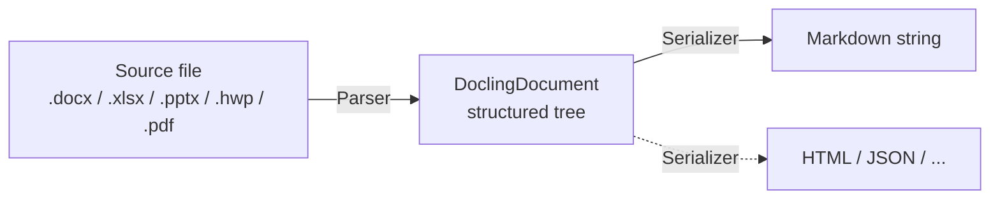
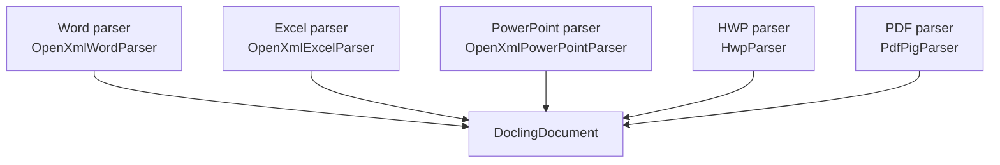

# How Document Parsing Works — The Big Picture

This page is for newcomers who want to understand what `Mythosia.Documents.*` loaders are doing under the hood.
If all you want is "give me markdown," you don't need to read this — two lines is enough:

```csharp
var docs = await new WordDocumentLoader().LoadAsync("report.docx");
string markdown = docs[0].ToMarkdown();
```

But this page is worth your time if any of the following applies:

- Tables aren't rendering the way you want and you'd like to change it
- You're building a RAG pipeline and need to chunk by slide / sheet
- You want to support a new file format (ODT, RTF, etc.)
- You want to output something other than markdown — HTML, JSON, etc.

---

## Your file goes through two stages, not one

It looks like "file → markdown," but internally there are two distinct steps.



- **Stage 1 (Parser)**: Reads the source file and converts every title, paragraph, table, list item, etc. into a tree-shaped data structure called **`DoclingDocument`**. This stage knows nothing about markdown.
- **Stage 2 (Serializer)**: Walks the `DoclingDocument` tree and produces a markdown string. Tables are rendered by a separate `TableSerializer` component.

`ToMarkdown()` runs both stages in one call, but **a `DoclingDocument` exists in memory between them** as the intermediate representation.

---

## Why two stages?

A natural question: "Why not just convert directly to markdown?" Four reasons.

### 1. Same structure, multiple output formats

Markdown is just one possible output. The same `DoclingDocument` could be serialized to HTML, JSON, plain text, etc. (only markdown is implemented today, but the door is open).

### 2. Swap table rendering at runtime

Sometimes you want the same table to be rendered differently depending on context.

```csharp
var doc = (await new ExcelDocumentLoader().LoadAsync("data.xlsx"))[0];

// Default: standard markdown pipe table
string md1 = doc.ToMarkdown();

// Alternative: semantic header-value pairs (better for RAG)
doc.TableSerializer = new SemanticTableSerializer();
string md2 = doc.ToMarkdown();
```

You can switch rendering without re-parsing the file because the structure (`DoclingDocument`) is still in memory from stage 1.

### 3. RAG chunking needs *structure*, not text

When you split a long document into chunks for RAG, **slicing the markdown string directly is dangerous**:

- A table can be cut in half, separating headers from data
- A "## Conclusion" heading can be torn from its body, losing context
- A list can be cut mid-way, breaking the meaning

Working from the `DoclingDocument` tree lets you apply rules like "tables are always one chunk" or "section headings stay attached to their body" — safely.

### 4. Different parsers, same output shape



Each parser uses a different underlying library (OpenXml SDK, HwpLibSharp, PdfPig, etc.), but **they all produce the same `DoclingDocument` shape** — so everything downstream (serializer, chunking, RAG) is format-agnostic.

---

## What this means for everyday use

| You want to... | Recommended approach |
|---|---|
| Get markdown once | `LoadAsync()` → `ToMarkdown()` (you can stop reading here) |
| Change table style only | One line: `doc.TableSerializer = new ...` |
| Chunk by slide / sheet | Iterate `GroupItem`s in the tree |
| Chunk while keeping heading context | Walk the tree (don't slice markdown) |
| Support a new file format | Implement `IDocumentParser` |
| Output to a new format (HTML, etc.) | Write a serializer that consumes `DoclingDocument` |

---

## What to read next

- **[What's inside a DoclingDocument](document-architecture-data-model.md)** — the tree structure and each element type, with examples.
- **[Customizing the output](document-architecture-customization.md)** — recipes for table swapping, chunking, custom parsers, and more.
