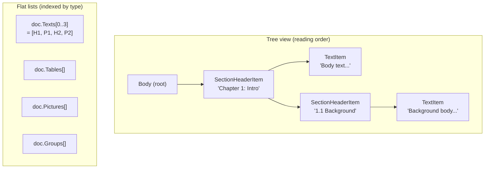

# What's Inside a DoclingDocument

The [previous page](document-architecture-concept.md) explained that your file is first converted into a `DoclingDocument` tree.
This page walks through what's actually in that tree.

> Think of `DoclingDocument` as Word's "Outline View" turned into something you can manipulate from code.
> It throws away **visual representation** (fonts, colors, margins) and keeps only **structure** (titles, paragraphs, tables, lists).

---

## Same data, two views

A `DoclingDocument` keeps the same content in **two parallel views** at the same time.



- **Tree view**: parent/child relationships in reading order. Markdown serialization walks this tree depth-first.
- **Flat lists**: the same elements, indexed by type (`doc.Texts`, `doc.Tables`, `doc.Pictures`, `doc.Groups`). Useful for "how many tables?" or "give me the n-th picture" lookups.

**These are not two copies of the data** — the tree node and the flat-list entry are the same instance, referenced from two places.

---

## Element types

Each type represents a different kind of meaningful unit.

### TitleItem — document title

The main document title (Word's "Title" style; markdown `#`).

```csharp
doc.AddTitle("2026 Business Plan");
// → "# 2026 Business Plan"
```

### SectionHeaderItem — section / subsection heading

Word's "Heading 1", "Heading 2", PowerPoint slide titles, Excel sheet names — they all map here.

```csharp
doc.AddHeading("Chapter 1: Intro", level: 1);   // → "## Chapter 1: Intro"
doc.AddHeading("1.1 Background",   level: 2);   // → "### 1.1 Background"
```

`Level` starts at 1. The number of `#` characters at output is `Level + 1` (Title takes `#`, so headings start at `##`), capped at 6.

### TextItem — a regular paragraph

A single paragraph of body text.

```csharp
doc.AddParagraph("This document outlines the company's 2026 direction.");
```

`Label` lets you classify it further (`Paragraph`, `Text`, `Title`, `SectionHeader`, ...). Plain body paragraphs use `DocItemLabel.Paragraph`.

### DocListItem — one list entry

A single bullet point or numbered item.

```csharp
doc.AddListItem("First item");                                    // → "- First item"
doc.AddListItem("First item", enumerated: true, marker: "1.");    // → "1. First item"
```

A node represents **one entry**, not the whole list. Multiple `DocListItem`s under the same parent render as one continuous list.

### TableItem + TableData + TableCell — a table

`TableItem` is the table itself, `TableData` holds rows/cols metadata, `TableCell` is each cell.

```csharp
var data = new TableData { NumRows = 2, NumCols = 3 };
data.TableCells.Add(new TableCell {
    Text = "header1",
    StartRowOffsetIdx = 0, EndRowOffsetIdx = 1,
    StartColOffsetIdx = 0, EndColOffsetIdx = 1,
    ColumnHeader = true,
});
// ... remaining cells
doc.AddTable(data);
```

`RowSpan`/`ColSpan` plus the offset indices express merged cells.

If any cell has `ColumnHeader = true`, that row is treated as a header. If no cells are explicitly marked, `GridTableSerializer` falls back to treating the first row as the header.

> **Note**: The HWP parser only respects the author's explicit `TitleCell` flag. HWP documents commonly use **left-column headers** (where the first column is the header, not the first row), so positional heuristics would misclassify those layouts. Office parsers default to "first row is header" because that's the dominant convention there.

### PictureItem — image placeholder

```csharp
doc.AddPicture();
// → "<!-- image -->" (default placeholder, configurable via MarkdownSerializer.ImagePlaceholder)
```

Current loaders insert placeholders without extracting the image binary.

### GroupItem — container

Groups child elements together. **Has no visual output of its own** — only its children render.

Uses:
- **PowerPoint**: each slide is a `GroupItem` (label = `Slide`)
- **Excel**: each sheet is a `GroupItem` (label = `Sheet`)
- **General**: any logical grouping (chapters, list groups, etc.)

```csharp
var slideGroup = doc.AddGroup("Slide 1", GroupLabel.Slide);
doc.AddHeading("Slide title", 2, slideGroup);
doc.AddParagraph("Slide body", slideGroup);
```

This makes "chunk by slide" a one-liner: `doc.Groups.Where(g => g.Label == GroupLabel.Slide)`.

### CodeItem, FormulaItem — code blocks and math (rare)

```csharp
doc.AddCode("print('hello')", language: "python");
// → ```python
//   print('hello')
//   ```
```

Formulas render as `$$...$$` (block LaTeX). Office documents rarely produce these; they're more common from PDF or markdown sources.

---

## Per-format mapping table

How each parser maps source elements to `DoclingDocument` nodes:

| Source element | Word | Excel | PowerPoint | HWP |
|---|---|---|---|---|
| Document title | "Title" style → `TitleItem` | — | — | — |
| Heading | "Heading1~9" → `SectionHeaderItem` | sheet name → `SectionHeaderItem` (level 2) | title placeholder → `SectionHeaderItem` (level 2) | "개요 1~9" → `SectionHeaderItem` |
| Paragraph | regular paragraph → `TextItem` | — | text-box paragraph → `TextItem` | regular paragraph → `TextItem` |
| List | numbered paragraph → `DocListItem` | — | bullet/autonum paragraph → `DocListItem` | list paragraph → `DocListItem` |
| Table | `<w:tbl>` → `TableItem` (incl. merged cells) | whole sheet → one `TableItem` | `<a:tbl>` → `TableItem` | `ControlTable` → `TableItem` |
| Image | (not supported yet) | — | (not supported yet) | (not supported yet) |
| Container | — | each sheet → `GroupItem(Sheet)` | each slide → `GroupItem(Slide)` | — |

---

## What's a RefItem? (read only if needed)

Parent/child relationships in the tree don't use direct object references — they use **`RefItem`, a string-pointer**.

```csharp
item.Parent = new RefItem("#/body");                // parent is the body root
parent.Children.Add(new RefItem("#/texts/0"));      // first text item
```

This format follows [JSON Pointer](https://datatracker.ietf.org/doc/html/rfc6901) syntax (a docling convention).

**Why strings instead of object references?**
- The whole `DoclingDocument` should serialize/deserialize as JSON cleanly (no cycles)
- Stable identifiers are needed when crossing process / file / API boundaries

Call `refItem.Resolve(doc)` to get the actual object back.

---

## What to read next

- **[Customizing the output](document-architecture-customization.md)** — table strategies, chunking patterns, custom parsers — practical recipes.
- **[Back to the concept page](document-architecture-concept.md)** — the big picture of the two-stage pipeline.
