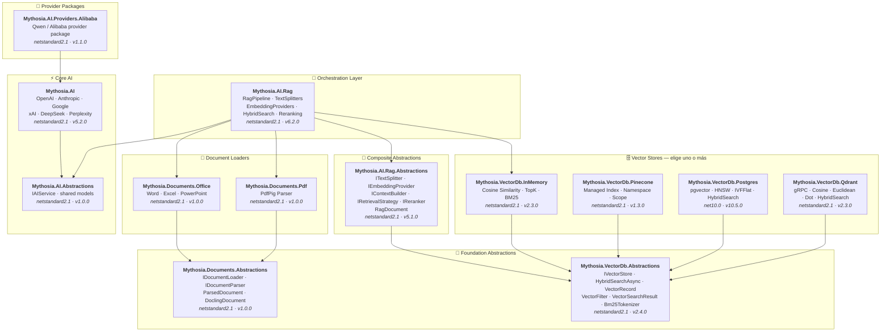

<div align="center">

🌐 [English](../../README.md) · [한국어](../ko/README.md) · [日本語](../ja/README.md) · [Français](../fr/README.md) · [Deutsch](../de/README.md) · [Русский](../ru/README.md) · [Українська](../uk/README.md) · [简体中文](../zh-Hans/README.md) · [繁體中文](../zh-Hant/README.md) · [Tiếng Việt](../vi/README.md) · [ภาษาไทย](../th/README.md) · [Português](../pt/README.md) · [Español](README.md)

<br>

[](https://github.com/AJ-comp/Mythosia.AI)


### Biblioteca .NET modular para construir aplicaciones de IA inteligentes

**Cambia de provider, conecta RAG, carga documentos — todo a través de una API unificada.**

<br>

[](https://www.nuget.org/packages/Mythosia.AI)
[](https://www.nuget.org/packages/Mythosia.AI)
[](https://aj-comp.github.io/Mythosia.AI/)
[](https://dotnet.microsoft.com)

<br>

**[📖 Primeros pasos](https://aj-comp.github.io/Mythosia.AI/)** &nbsp;·&nbsp; **[Referencia de API](https://aj-comp.github.io/Mythosia.AI/api/)** &nbsp;·&nbsp; **[GitHub ↗](https://github.com/AJ-comp/Mythosia.AI)**

<br>

</div>

---

### ¿Qué paquete instalar?

```
dotnet add package Mythosia.AI                    # empieza aquí (solo con este es suficiente)
dotnet add package Mythosia.AI.Rag                # opcional: cuando necesites RAG
dotnet add package Mythosia.VectorDb.Postgres     # opcional: vector store para producción
```

| Paso | Paquete | Cuándo |
| :--: | --- | --- |
| **1** | **`Mythosia.AI`** | **Empieza aquí** — generación de texto, streaming, function calling, structured output (OpenAI / Claude / Gemini / Grok / DeepSeek / Perplexity) |
| **2** | **`Mythosia.AI.Rag`** | Cuando necesites RAG — chunking, embedding, hybrid search, reranking, InMemory store, document loaders (Word / Excel / PowerPoint / PDF) |
| **3** | **`Mythosia.VectorDb.Postgres`** / **`Qdrant`** / **`Pinecone`** | Cuando necesites un vector store de producción en lugar de InMemory — elige uno |

## Arquitectura



## Demo / Pruébalo (Chat UI)

Este repositorio incluye un ejemplo de Chat UI construido con Mythosia.AI — ejecuta `Mythosia.AI.Samples.ChatUi` para probar la biblioteca directamente.

### Ejecutar el ejemplo

Inicia **`Mythosia.AI.Samples.ChatUi`** en tu máquina:

```bash
# desde el directorio raíz del repositorio
dotnet run --project samples/Mythosia.AI.Samples.ChatUi
```

https://github.com/user-attachments/assets/62094afe-9add-4c14-b818-6b31f200dc01


## Inicio Rápido

### Generación de texto básica

```csharp
using Mythosia.AI;

var service = new OpenAIService(apiKey, httpClient);
var response = await service.GetCompletionAsync("¡Hola!");
```

### Streaming

```csharp
await foreach (var token in service.StreamAsync("Cuéntame una historia"))
{
    Console.Write(token);
}
```

### Streaming con razonamiento

Todos los providers con soporte de razonamiento (OpenAI, Claude, Gemini, Grok, DeepSeek) usan el mismo patrón:

```csharp
await foreach (var content in service.StreamAsync(message, new StreamOptions().WithReasoning()))
{
    if (content.Type == StreamingContentType.Reasoning)
        Console.Write($"[Razonamiento] {content.Content}");
    else if (content.Type == StreamingContentType.Text)
        Console.Write(content.Content);
}
```

### Function Calling

```csharp
var service = new OpenAIService(apiKey, httpClient)
    .WithFunction(
        "get_weather",
        "Obtener información meteorológica actual para una ubicación",
        ("location", "Nombre de la ciudad y el país", required: true),
        (string location) => $"El clima en {location} está soleado, 28°C"
    );

var response = await service.GetCompletionAsync("¿Cómo está el tiempo en Madrid?");
```

### Structured Output (básico)

```csharp
// Deserializa la respuesta del LLM directamente a un POCO C# con auto-recuperación
var result = await service.GetCompletionAsync<WeatherResponse>(
    "¿Cómo está el tiempo en Madrid?");
```

### Structured Output (lista)

```csharp
// Las colecciones funcionan directamente — sin wrapper necesario
var items = await service.GetCompletionAsync<List<ItemDto>>(
    "Extrae todas las entidades de este documento...");
```

### Structured Output (streaming)

```csharp
// Transmite cada fragmento de texto en tiempo real + recibe el objeto deserializado al final
var run = service.BeginStream(prompt).As<MyDto>();

await foreach (var chunk in run.Stream())
    Console.Write(chunk);          // interfaz en tiempo real

MyDto dto = await run.Result;      // parseado y auto-recuperado
```

### Política de Resumen de Conversación

```csharp
// Resume automáticamente mensajes anteriores cuando la conversación se hace larga
service.ConversationPolicy = SummaryConversationPolicy.ByMessage(
    triggerCount: 20,
    keepRecentCount: 5
);

// Disparar por conteo de tokens
service.ConversationPolicy = SummaryConversationPolicy.ByToken(
    triggerTokens: 3000,
    keepRecentTokens: 1000
);

// Usa normalmente — el resumen ocurre automáticamente
await service.GetCompletionAsync("Continúa la conversación...");

// En streaming, aplica la política de resumen antes de StreamAsync()
await service.ApplySummaryPolicyIfNeededAsync();
await foreach (var chunk in service.StreamAsync("Continúa..."))
    Console.Write(chunk.Content);

// Guardar/restaurar el resumen entre sesiones
string saved = service.ConversationPolicy.CurrentSummary;
policy.LoadSummary(saved);
```

### RAG (Retrieval-Augmented Generation)

```bash
dotnet add package Mythosia.AI.Rag
```

```csharp
using Mythosia.AI.Rag;

var service = new AnthropicService(apiKey, httpClient)
    .WithRag(rag => rag
        .AddDocument("manual.txt")
        .AddDocument("policy.txt")
    );

var response = await service.GetCompletionAsync("¿Cuál es la política de reembolso?");
```

## Providers Soportados

| Provider | Paquete | Modelos |
| --- | --- | --- |
| **OpenAI** | `Mythosia.AI` | GPT-5.4 / 5.4 Mini / 5.4 Nano / 5.4 Pro / 5.3 Codex / 5.2 / 5.2 Pro / 5.2 Codex / 5.1 / 5 / 5 Mini / 5 Nano, GPT-4.1 / 4.1 Mini / 4.1 Nano, GPT-4o / 4o Mini, o3 / o3 Pro |
| **Anthropic** | `Mythosia.AI` | Claude Opus 4.6 / 4.5 / 4.1 / 4, Sonnet 4.6 / 4.5 / 4, Haiku 4.5 |
| **Google** | `Mythosia.AI` | Gemini 3 Flash/Pro Preview, Gemini 2.5 Pro/Flash/Flash-Lite |
| **xAI** | `Mythosia.AI` | Grok 4, Grok 4.1 Fast, Grok 3, Grok 3 Mini |
| **DeepSeek** | `Mythosia.AI` | Chat, Reasoner |
| **Perplexity** | `Mythosia.AI` | Sonar, Sonar Pro, Sonar Reasoning |
| **Alibaba / Qwen** | `Mythosia.AI.Providers.Alibaba` | Qwen Max / Plus / Turbo / Qwen3 / Qwen3.5 variants |

## Paquetes

### Core

| Paquete | NuGet | Descripción |
| --- | --- | --- |
| [Mythosia.AI](../../src/core/Mythosia.AI/) | [](https://www.nuget.org/packages/Mythosia.AI) | Biblioteca core — providers integrados, streaming, function calling y soporte multimodal |
| [Mythosia.AI.Abstractions](../../src/core/Mythosia.AI.Abstractions/) | [](https://www.nuget.org/packages/Mythosia.AI.Abstractions) | Interfaz `IAIService` y modelos compartilhados — paquete de contrato ligero para bibliotecas |
| [Mythosia.AI.Providers.Alibaba](../../src/core/Mythosia.AI.Providers.Alibaba/) | [](https://www.nuget.org/packages/Mythosia.AI.Providers.Alibaba) | Paquete provider Alibaba / Qwen basado en `Mythosia.AI` |

### RAG

| Paquete | NuGet | Descripción |
| --- | --- | --- |
| [Mythosia.AI.Rag](../../src/rag/Mythosia.AI.Rag/) | [](https://www.nuget.org/packages/Mythosia.AI.Rag) | Extensión RAG fluente para IAIService con API `.WithRag()` |
| [Mythosia.AI.Rag.Abstractions](../../src/rag/Mythosia.AI.Rag.Abstractions/) | [](https://www.nuget.org/packages/Mythosia.AI.Rag.Abstractions) | Interfaces y modelos de los componentes del pipeline RAG |

### Document Loaders

| Paquete | NuGet | Descripción |
| --- | --- | --- |
| [Mythosia.Documents.Abstractions](../../src/loaders/Mythosia.Documents.Abstractions/) | [](https://www.nuget.org/packages/Mythosia.Documents.Abstractions) | Interfaces y modelos del loader de documentos (`IDocumentLoader`, `DoclingDocument`) |
| [Mythosia.Documents.Office](../../src/loaders/Mythosia.Documents.Office/) | [](https://www.nuget.org/packages/Mythosia.Documents.Office) | Parser OpenXml para Word / Excel / PowerPoint |
| [Mythosia.Documents.Pdf](../../src/loaders/Mythosia.Documents.Pdf/) | [](https://www.nuget.org/packages/Mythosia.Documents.Pdf) | Parser PDF basado en PdfPig |

### Vector Stores

> **Elige uno o más** — todos implementan `IVectorStore` del paquete Abstractions.

| Paquete | NuGet | Descripción |
| --- | --- | --- |
| [Mythosia.VectorDb.Abstractions](../../src/vectordb/Mythosia.VectorDb.Abstractions/) | [](https://www.nuget.org/packages/Mythosia.VectorDb.Abstractions) | Contrato `IVectorStore` · `VectorRecord` · `VectorFilter` |
| [Mythosia.VectorDb.InMemory](../../src/vectordb/Mythosia.VectorDb.InMemory/) | [](https://www.nuget.org/packages/Mythosia.VectorDb.InMemory) | Store en memoria — sin infraestructura, ideal para prototipado |
| [Mythosia.VectorDb.Pinecone](../../src/vectordb/Mythosia.VectorDb.Pinecone/) | [](https://www.nuget.org/packages/Mythosia.VectorDb.Pinecone) | Pinecone HTTP API — aislamiento por index/namespace/scope |
| [Mythosia.VectorDb.Postgres](../../src/vectordb/Mythosia.VectorDb.Postgres/) | [](https://www.nuget.org/packages/Mythosia.VectorDb.Postgres) | PostgreSQL + pgvector — índices HNSW / IVFFlat, listo para producción |
| [Mythosia.VectorDb.Qdrant](../../src/vectordb/Mythosia.VectorDb.Qdrant/) | [](https://www.nuget.org/packages/Mythosia.VectorDb.Qdrant) | Qdrant gRPC client — Cosine / Euclidean / Dot, aprovisionamiento automático |

## Estructura del Repositorio

```text
src/
  core/
    Mythosia.AI/                        # Biblioteca AI core
    Mythosia.AI.Abstractions/           # Interfaz IAIService y modelos compartilhados
    Mythosia.AI.Providers.Alibaba/      # Paquete provider Alibaba / Qwen
  loaders/
    Mythosia.Documents.Abstractions/    # Contrato document loader (IDocumentLoader, DoclingDocument)
    Mythosia.Documents.Office/          # Loader de documentos Office (Word/Excel/PowerPoint)
    Mythosia.Documents.Pdf/             # Loader de documentos PDF
  rag/
    Mythosia.AI.Rag/                    # RAG Fluent API y pipeline
    Mythosia.AI.Rag.Abstractions/       # Interfaces y modelos RAG (RagDocument)
  vectordb/
    Mythosia.VectorDb.Abstractions/     # Contrato vector store
    Mythosia.VectorDb.InMemory/         # Vector store en memoria
    Mythosia.VectorDb.Pinecone/         # Vector store Pinecone
    Mythosia.VectorDb.Postgres/         # PostgreSQL + pgvector
    Mythosia.VectorDb.Qdrant/           # Vector store Qdrant
samples/                                # Aplicaciones de ejemplo
tests/                                  # Proyectos de test unitario / integración
```

## Instalación

```bash
dotnet add package Mythosia.AI
```

Para operaciones LINQ avanzadas con streams:

```bash
dotnet add package System.Linq.Async
```

## Documentación

- [Guía de introducción](https://github.com/AJ-comp/Mythosia.AI/wiki)
- [README Mythosia.AI](../../src/core/Mythosia.AI/README.md) — Referencia completa de API: function calling, streaming y configuración de modelos
- [README Mythosia.AI.Rag](../../src/rag/Mythosia.AI.Rag/README.md) — Uso del pipeline RAG e implementaciones personalizadas
- [Guía de loaders](document-loaders.md)
- [Notas de versión](../../src/core/Mythosia.AI/RELEASE_NOTES.md)

## Licencia

Este proyecto se distribuye bajo la [licencia MIT](../../LICENSE).

## Origen

Este proyecto era originalmente parte de [Mythosia](https://github.com/AJ-comp/Mythosia).
