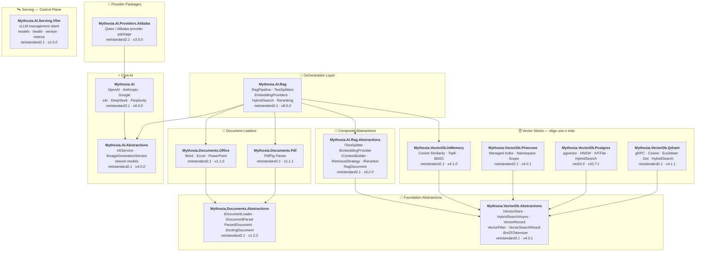

<div align="center">

🌐 [English](../../README.md) · [한국어](../ko/README.md) · [日本語](../ja/README.md) · [Français](../fr/README.md) · [Deutsch](../de/README.md) · [Русский](../ru/README.md) · [Українська](../uk/README.md) · [简体中文](../zh-Hans/README.md) · [繁體中文](../zh-Hant/README.md) · [Tiếng Việt](../vi/README.md) · [ภาษาไทย](../th/README.md) · [Português](../pt/README.md) · [Español](README.md)

<br>

[](https://github.com/AJ-comp/Mythosia.AI)


### Biblioteca .NET modular para construir aplicaciones de IA inteligentes

**Cambia de provider, conecta RAG, carga documentos — todo a través de una API unificada.**

<br>

[](https://www.nuget.org/packages/Mythosia.AI)
[](https://www.nuget.org/packages/Mythosia.AI)
[](https://aj-comp.github.io/Mythosia.AI/)
[](https://dotnet.microsoft.com)

<br>

**[📖 Primeros pasos](https://aj-comp.github.io/Mythosia.AI/)** &nbsp;·&nbsp; **[Referencia de API](https://aj-comp.github.io/Mythosia.AI/api/)** &nbsp;·&nbsp; **[GitHub ↗](https://github.com/AJ-comp/Mythosia.AI)**

<br>

</div>

Configure solicitudes independientes, detenga trabajo en curso y obtenga respuestas con consumo y fuentes. La [guía de migración a v8](v8-migration.md) reúne seis cambios de arquitectura, ejemplos y alcance de validación.

> Versiones de paquetes documentadas aquí: [Mythosia.AI 8.0.0](../../src/core/Mythosia.AI/RELEASE_NOTES.md#v800), [Abstractions 4.0.0](../../src/core/Mythosia.AI.Abstractions/RELEASE_NOTES.md#v400), [Alibaba 3.0.0](../../src/core/Mythosia.AI.Providers.Alibaba/RELEASE_NOTES.md#v300), [RAG 8.0.0](../../src/rag/Mythosia.AI.Rag/RELEASE_NOTES.md#v800), [MCP 0.1.0-preview](../../src/integrations/Mythosia.AI.Mcp/RELEASE_NOTES.md#v010-preview), [Serving.Vllm 1.0.0](../../src/serving/Mythosia.AI.Serving.Vllm/RELEASE_NOTES.md#v100).

---

### ¿Qué paquete instalar?

```
dotnet add package Mythosia.AI                    # empieza aquí (solo con este es suficiente)
dotnet add package Mythosia.AI.Rag                # opcional: cuando necesites RAG
dotnet add package Mythosia.VectorDb.Postgres     # opcional: vector store para producción
```

| Paso | Paquete | Cuándo |
| :--: | --- | --- |
| **1** | **`Mythosia.AI`** | **Empieza aquí** — generación de texto, streaming, function calling, structured output (OpenAI / Claude / Gemini / Grok / DeepSeek / Perplexity) |
| **2** | **`Mythosia.AI.Rag`** | Cuando necesites RAG — chunking, embedding, hybrid search, reranking, InMemory store, document loaders (Word / Excel / PowerPoint / PDF) |
| **3** | **`Mythosia.VectorDb.Postgres`** / **`Qdrant`** / **`Pinecone`** | Cuando necesites un vector store de producción en lugar de InMemory — elige uno |

Prepare ajustes independientes con `CreateRequest(...).WithTemperature(...).GetCompletionAsync()`. La [guía de solicitudes](request-building.md) explica Before/After, Run, perfiles y los límites de las conversaciones compartidas.

## Arquitectura



## Demo / Pruébalo (Chat UI)

Este repositorio incluye un ejemplo de Chat UI construido con Mythosia.AI — ejecuta `Mythosia.AI.Samples.ChatUi` para probar la biblioteca directamente.

### Ejecutar el ejemplo

Inicia **`Mythosia.AI.Samples.ChatUi`** en tu máquina:

```bash
# desde el directorio raíz del repositorio
dotnet run --project apps/Mythosia.AI.Samples.ChatUi
```

https://github.com/user-attachments/assets/62094afe-9add-4c14-b818-6b31f200dc01


## Inicio Rápido

### Generación de texto básica

```csharp
using Mythosia.AI;

var service = new OpenAIService(apiKey, httpClient);
var response = await service.GetCompletionAsync("¡Hola!");
```

### Streaming

```csharp
await foreach (var token in service.StreamAsync("Cuéntame una historia"))
{
    Console.Write(token);
}
```

### Streaming con razonamiento

OpenAI, Claude, Gemini, Grok y DeepSeek Flash exponen el razonamiento del proveedor con el mismo patrón de streaming. Actívalo en el servicio o solicitud y obsérvalo con `StreamOptions.WithReasoning()`:

```csharp
await foreach (var content in service.StreamAsync(message, new StreamOptions().WithReasoning()))
{
    if (content.Type == StreamingContentType.Reasoning)
        Console.Write($"[Razonamiento] {content.Content}");
    else if (content.Type == StreamingContentType.Text)
        Console.Write(content.Content);
}
```

Si una tarea necesita más razonamiento o fuentes actuales o documentales, use las [opciones comunes de razonamiento y búsqueda](reasoning-and-search.md).

### Function Calling

```csharp
var service = new OpenAIService(apiKey, httpClient)
    .WithFunction(
        "get_weather",
        "Obtener información meteorológica actual para una ubicación",
        ("location", "Nombre de la ciudad y el país", required: true),
        (string location) => $"El clima en {location} está soleado, 28°C"
    );

var response = await service.GetCompletionAsync("¿Cómo está el tiempo en Madrid?");
```

Una consulta lenta no tiene por qué detener toda la respuesta. Mientras se cargan los datos del tiempo, por ejemplo, el modelo puede explicar consejos generales de viaje que no dependen del resultado.

`FunctionDefinition.AllowAsync = true` o `FunctionBuilder.WithAsync()` permite habilitar llamadas asíncronas para GPT-6 Astra mediante Responses. El valor predeterminado es `false`; los modelos no compatibles esperan el resultado del mismo manejador. Consulta ejemplos y el ciclo de vida de la solicitud en la [guía de llamadas a funciones](function-calling.md).

### Structured Output (básico)

```csharp
// Deserializa la respuesta del LLM directamente a un POCO C# con auto-recuperación
var result = await service.GetCompletionAsync<WeatherResponse>(
    "¿Cómo está el tiempo en Madrid?");
```

### Structured Output (lista)

```csharp
// Las colecciones funcionan directamente — sin wrapper necesario
var items = await service.GetCompletionAsync<List<ItemDto>>(
    "Extrae todas las entidades de este documento...");
```

### Structured Output (streaming)

```csharp
// Transmite cada fragmento de texto en tiempo real + recibe el objeto deserializado al final
var run = service.BeginStream(prompt).As<MyDto>();

await foreach (var chunk in run.Stream())
    Console.Write(chunk);          // interfaz en tiempo real

MyDto dto = await run.Result;      // parseado y auto-recuperado
```

### Política de Resumen de Conversación

```csharp
// Resume automáticamente mensajes anteriores cuando la conversación se hace larga
service.ConversationPolicy = SummaryConversationPolicy.ByMessage(
    triggerCount: 20,
    keepRecentCount: 5
);

// Disparar por conteo de tokens
service.ConversationPolicy = SummaryConversationPolicy.ByToken(
    triggerTokens: 3000,
    keepRecentTokens: 1000
);

// Usa normalmente — el resumen ocurre automáticamente
await service.GetCompletionAsync("Continúa la conversación...");

// En streaming, aplica la política de resumen antes de StreamAsync()
await service.ApplySummaryPolicyIfNeededAsync();
await foreach (var chunk in service.StreamAsync("Continúa..."))
    Console.Write(chunk.Content);

// Guardar/restaurar el resumen entre sesiones
string saved = service.ConversationPolicy.CurrentSummary;
policy.LoadSummary(saved);
```

### RAG (Retrieval-Augmented Generation)

```bash
dotnet add package Mythosia.AI.Rag
```

```csharp
using Mythosia.AI.Rag;

var service = new AnthropicService(apiKey, httpClient)
    .WithRag(rag => rag
        .AddDocument("manual.txt")
        .AddDocument("policy.txt")
    );

var response = await service.GetCompletionAsync("¿Cuál es la política de reembolso?");
```

## Providers Soportados

| Provider | Paquete | Modelos |
| --- | --- | --- |
| **OpenAI** | `Mythosia.AI` | GPT-6 Astra, GPT-5.6 Sol / Terra / Luna, GPT-5.5 / 5.5 Pro / 5.4 / 5.4 Mini / 5.4 Nano / 5.4 Pro / 5.3 Codex / 5.2 / 5.2 Pro / 5.1, GPT-4.1 / 4.1 Mini, GPT-4o / 4o Mini |
| **Anthropic** | `Mythosia.AI` | Claude Fable 5.1 / 5, Mythos 5.1 / 5 (limited), Opus 5 / 4.8 / 4.7 / 4.6 / 4.5, Sonnet 5 / 4.6 / 4.5, Haiku 4.5 |
| **Google** | `Mythosia.AI` | Gemini 3.8 Flash, Gemini 3.7 Flash, Gemini 3.6 Flash, Gemini 3.5 Flash/Flash-Lite, Gemini 3.1 Pro Preview/Flash-Lite, Gemini 3 Flash Preview, Gemini 2.5 Pro/Flash/Flash-Lite, Gemini 3.1 Flash Image, Gemini 3.1 Flash-Lite Image, Gemini 3 Pro Image |
| **xAI** | `Mythosia.AI` | Grok 4.6, Grok 4.5 (predeterminado), Grok 4.3, Grok 4.20 (reasoning / non-reasoning), Grok Build |
| **DeepSeek** | `Mythosia.AI` | Flash (V4.1 Flash) |
| **Perplexity** | `Mythosia.AI` | Ajustes de Agent API y `perplexity/sonar` |
| **Alibaba / Qwen** | `Mythosia.AI.Providers.Alibaba` | Qwen Max / Plus / Turbo / Qwen3 / Qwen3.5 variants |

Use Perplexity cuando la respuesta necesite información reciente y fuentes que el lector pueda comprobar. `PerplexityService` llama a la Agent API; la búsqueda y los embeddings independientes permiten crear la recuperación de documentos con el modelo de respuesta que prefiera. [Perplexity Agent API, búsqueda y embeddings](perplexity.md).

Para revisar documentos extensos y realizar tareas con varias rondas de herramientas, puedes elegir Gemini 3.7 Flash o 3.8 Flash mediante el adaptador de Google existente. Se admiten desde `Mythosia.AI` 8.0.0 / `Mythosia.AI.Abstractions` 4.0.0; Gemini 3.6 Flash sigue siendo el modelo predeterminado.

Para pasar de un borrador rápido a una revisión exigente, selecciona Grok 4.6 explícitamente y un esfuerzo de `Low` a `XHigh`. Disponible desde `Mythosia.AI` 8.0.0 / `Mythosia.AI.Abstractions` 4.0.0; Grok 4.5 sigue siendo el valor predeterminado de `XAIService`. Consulta la [configuración de Grok](providers.md#xai-xaiservice).

Para crear bocetos o combinar referencias, usa [Grok Imagine Image 2.0](providers.md#grok-imagine-image-20) mediante `IImageGenerationService`. Mantén `OutputFormat = ImageOutputFormat.Auto` y elige la extensión según `MediaType`; xAI no puede seleccionar códec. Consulta la [migración de opciones de imagen](providers.md#image-options-migration). El modelo de chat no cambia.

Elige Flare para borradores visuales rápidos y Sunburst para cambios precisos. La [generación y edición con GPT Image 2.5](providers.md#gpt-image-25) usa la API existente con selección explícita por petición; OpenAI mantiene GPT Image 2 como predeterminado.

Para analizar gráficos y capturas, llamar funciones locales o revisar una respuesta rápida, usa [DeepSeek Flash](providers.md#deepseek-deepseekservice) (`AIModels.DeepSeek.Flash`, V4.1 Flash). El razonamiento sigue desactivado por defecto; actívalo con `WithDeepSeekReasoning(...)` o `WithReasoning(...)` por solicitud.

## Paquetes

### Core

| Paquete | NuGet | Descripción |
| --- | --- | --- |
| [Mythosia.AI](../../src/core/Mythosia.AI/README.md) | [](https://www.nuget.org/packages/Mythosia.AI) | Biblioteca core — providers integrados, streaming, function calling y soporte multimodal |
| [Mythosia.AI.Abstractions](../../src/core/Mythosia.AI.Abstractions/README.md) | [](https://www.nuget.org/packages/Mythosia.AI.Abstractions) | Interfaz `IAIService` y modelos compartilhados — paquete de contrato ligero para bibliotecas |
| [Mythosia.AI.Providers.Alibaba](../../src/core/Mythosia.AI.Providers.Alibaba/README.md) | [](https://www.nuget.org/packages/Mythosia.AI.Providers.Alibaba) | Paquete provider Alibaba / Qwen basado en `Mythosia.AI` |

### RAG

| Paquete | NuGet | Descripción |
| --- | --- | --- |
| [Mythosia.AI.Rag](../../src/rag/Mythosia.AI.Rag/README.md) | [](https://www.nuget.org/packages/Mythosia.AI.Rag) | Extensión RAG fluente para IAIService con API `.WithRag()` |
| [Mythosia.AI.Rag.Abstractions](../../src/rag/Mythosia.AI.Rag.Abstractions/README.md) | [](https://www.nuget.org/packages/Mythosia.AI.Rag.Abstractions) | Interfaces y modelos de los componentes del pipeline RAG |

### Document Loaders

| Paquete | NuGet | Descripción |
| --- | --- | --- |
| [Mythosia.Documents.Abstractions](../../src/loaders/Mythosia.Documents.Abstractions/README.md) | [](https://www.nuget.org/packages/Mythosia.Documents.Abstractions) | Interfaces y modelos del loader de documentos (`IDocumentLoader`, `DoclingDocument`) |
| [Mythosia.Documents.Office](../../src/loaders/Mythosia.Documents.Office/README.md) | [](https://www.nuget.org/packages/Mythosia.Documents.Office) | Parser OpenXml para Word / Excel / PowerPoint |
| [Mythosia.Documents.Pdf](../../src/loaders/Mythosia.Documents.Pdf/README.md) | [](https://www.nuget.org/packages/Mythosia.Documents.Pdf) | Parser PDF basado en PdfPig |

### Vector Stores

> **Elige uno o más** — todos implementan `IVectorStore` del paquete Abstractions.

| Paquete | NuGet | Descripción |
| --- | --- | --- |
| [Mythosia.VectorDb.Abstractions](../../src/vectordb/Mythosia.VectorDb.Abstractions/README.md) | [](https://www.nuget.org/packages/Mythosia.VectorDb.Abstractions) | Contrato `IVectorStore` · `VectorRecord` · `VectorFilter` |
| [Mythosia.VectorDb.InMemory](../../src/vectordb/Mythosia.VectorDb.InMemory/README.md) | [](https://www.nuget.org/packages/Mythosia.VectorDb.InMemory) | Store en memoria — sin infraestructura, ideal para prototipado |
| [Mythosia.VectorDb.Pinecone](../../src/vectordb/Mythosia.VectorDb.Pinecone/README.md) | [](https://www.nuget.org/packages/Mythosia.VectorDb.Pinecone) | Pinecone HTTP API — aislamiento por index/namespace/scope |
| [Mythosia.VectorDb.Postgres](../../src/vectordb/Mythosia.VectorDb.Postgres/README.md) | [](https://www.nuget.org/packages/Mythosia.VectorDb.Postgres) | PostgreSQL + pgvector — índices HNSW / IVFFlat, listo para producción |
| [Mythosia.VectorDb.Qdrant](../../src/vectordb/Mythosia.VectorDb.Qdrant/README.md) | [](https://www.nuget.org/packages/Mythosia.VectorDb.Qdrant) | Qdrant gRPC client — Cosine / Euclidean / Dot, aprovisionamiento automático |

### Serving — Control Plane

> Clientes de gestión/introspección para runtimes de model serving. El chat permanece en los paquetes provider: `Providers.*` = data plane de chat, `Serving.*` = control plane del servidor.

| Paquete | NuGet | Descripción |
| --- | --- | --- |
| [Mythosia.AI.Serving.Vllm](../../src/serving/Mythosia.AI.Serving.Vllm/README.md) | [](https://www.nuget.org/packages/Mythosia.AI.Serving.Vllm) | Cliente control-plane de vLLM — model cards (el modelo realmente cargado vía `root`), health, versión del servidor, métricas de Prometheus |

## Estructura del Repositorio

```text
src/
  core/
    Mythosia.AI/                        # Biblioteca AI core
    Mythosia.AI.Abstractions/           # Interfaz IAIService y modelos compartilhados
    Mythosia.AI.Providers.Alibaba/      # Paquete provider Alibaba / Qwen
  loaders/
    Mythosia.Documents.Abstractions/    # Contrato document loader (IDocumentLoader, DoclingDocument)
    Mythosia.Documents.Office/          # Loader de documentos Office (Word/Excel/PowerPoint)
    Mythosia.Documents.Pdf/             # Loader de documentos PDF
  rag/
    Mythosia.AI.Rag/                    # RAG Fluent API y pipeline
    Mythosia.AI.Rag.Abstractions/       # Interfaces y modelos RAG (RagDocument)
  serving/
    Mythosia.AI.Serving.Vllm/           # Cliente control-plane de vLLM (models/health/version/metrics)
  vectordb/
    Mythosia.VectorDb.Abstractions/     # Contrato vector store
    Mythosia.VectorDb.InMemory/         # Vector store en memoria
    Mythosia.VectorDb.Pinecone/         # Vector store Pinecone
    Mythosia.VectorDb.Postgres/         # PostgreSQL + pgvector
    Mythosia.VectorDb.Qdrant/           # Vector store Qdrant
apps/                                   # Aplicaciones de ejemplo
tests/                                  # Proyectos de test unitario / integración
```

## Instalación

```bash
dotnet add package Mythosia.AI
```

Para operaciones LINQ avanzadas con streams:

```bash
dotnet add package System.Linq.Async
```

## Documentación

- [Guía de introducción](getting-started.md)
- [README Mythosia.AI](../../src/core/Mythosia.AI/README.md) — Referencia completa de API: function calling, streaming y configuración de modelos
- [README Mythosia.AI.Rag](../../src/rag/Mythosia.AI.Rag/README.md) — Uso del pipeline RAG e implementaciones personalizadas
- [Guía de loaders](document-loaders.md)
- [Notas de versión](../../src/core/Mythosia.AI/RELEASE_NOTES.md)

## Licencia

Este proyecto se distribuye bajo la [licencia MIT](https://github.com/AJ-comp/Mythosia.AI/blob/main/LICENSE).

## Origen

Este proyecto era originalmente parte de [Mythosia](https://github.com/AJ-comp/Mythosia).

[Crear opciones de modelo con definiciones compartidas](model-capabilities.md).
