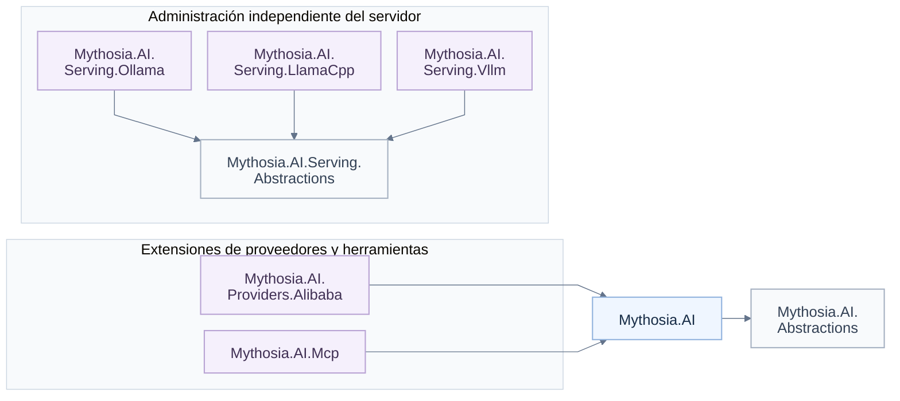
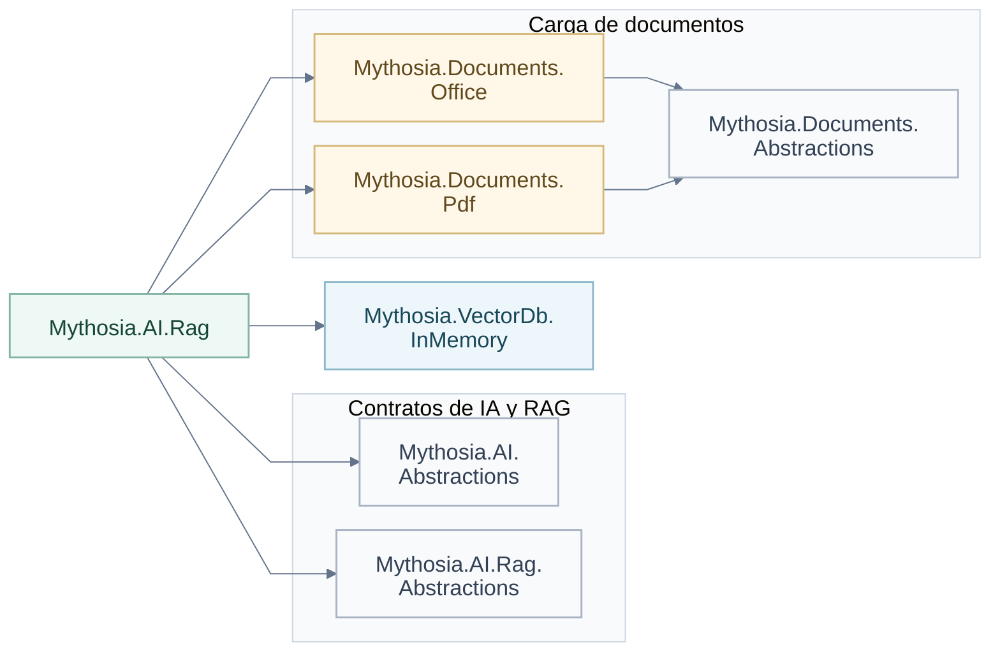
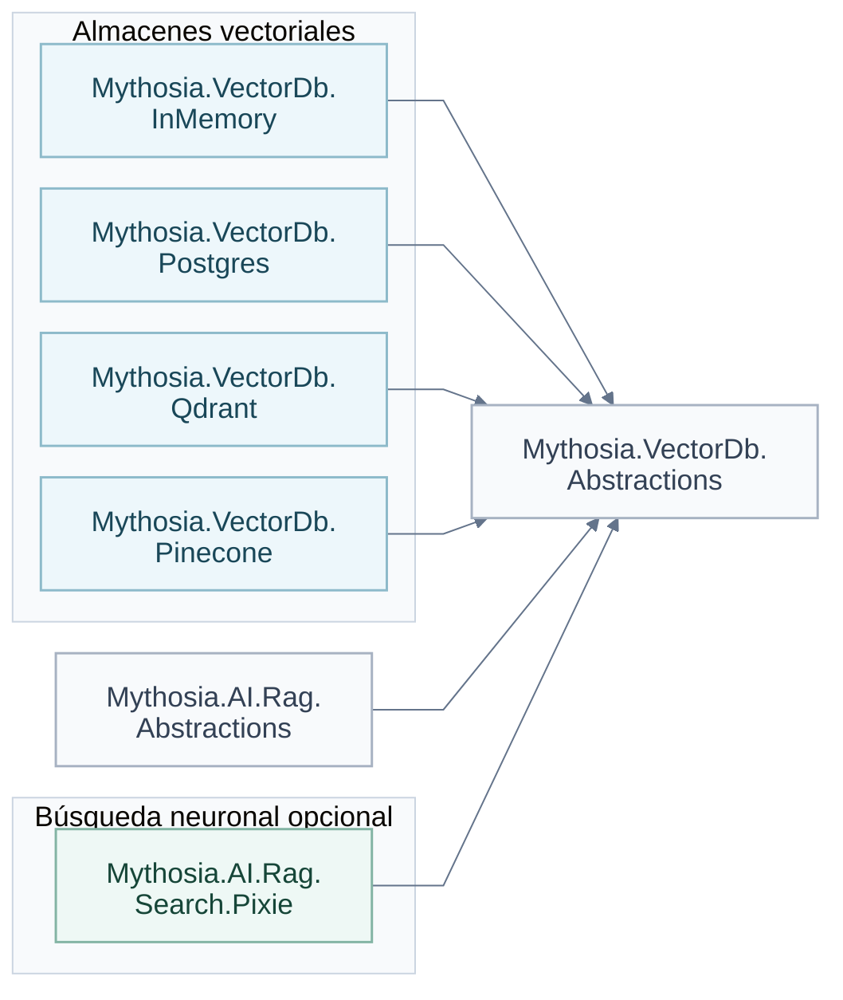

<div align="center">

🌐 [English](../../README.md) · [한국어](../ko/README.md) · [日本語](../ja/README.md) · [Français](../fr/README.md) · [Deutsch](../de/README.md) · [Русский](../ru/README.md) · [Українська](../uk/README.md) · [简体中文](../zh-Hans/README.md) · [繁體中文](../zh-Hant/README.md) · [Tiếng Việt](../vi/README.md) · [ภาษาไทย](../th/README.md) · [Português](../pt/README.md) · [Español](README.md)

<br>

[](https://github.com/AJ-comp/Mythosia.AI)


### Biblioteca .NET modular para construir aplicaciones de IA inteligentes

**Cambia de provider, conecta RAG, carga documentos — todo a través de una API unificada.**

<br>

[](https://www.nuget.org/packages/Mythosia.AI)
[](https://www.nuget.org/packages/Mythosia.AI)
[](https://aj-comp.github.io/Mythosia.AI/)
[](https://dotnet.microsoft.com)

<br>

**[📖 Primeros pasos](https://aj-comp.github.io/Mythosia.AI/)** &nbsp;·&nbsp; **[Referencia de API](https://aj-comp.github.io/Mythosia.AI/api/)** &nbsp;·&nbsp; **[GitHub ↗](https://github.com/AJ-comp/Mythosia.AI)**

<br>

</div>

## Demo / Pruébalo (Chat UI)

Prueba los modelos y la búsqueda de documentos en el Playground antes de escribir el código de integración.

Esta demostración grabada en la interfaz actual del Playground muestra la selección de modelos, el cambio de idioma y la configuración de documentos y del pipeline RAG. El vídeo incluye subtítulos en inglés.

https://github.com/user-attachments/assets/4cf90210-b000-41be-8317-a467e93e7504

### Ejecutar el ejemplo

Inicia **`Mythosia.AI.Samples.ChatUi`** en tu máquina:

```bash
# desde el directorio raíz del repositorio
dotnet run --project apps/Mythosia.AI.Samples.ChatUi
```

<details>
<summary>Controles e idiomas del Playground</summary>

Busca modelos por nombre o proveedor y ajusta la solicitud a la izquierda, conversa en el centro y revisa la información de procesamiento en Inspector a la derecha antes de integrar un modelo en tu aplicación. Usa Stop para dejar de esperar la respuesta; las opciones de velocidad solo se habilitan para modelos y endpoints compatibles, y Fast puede tener un coste adicional. En pantallas pequeñas, Models e Inspector se abren como paneles deslizantes; consulta la [guía de Chat UI](https://github.com/AJ-comp/Mythosia.AI/blob/main/apps/Mythosia.AI.Samples.ChatUi/README.md) para la ejecución local, los documentos y la configuración del proceso de recuperación.

El panel Pipeline permite configurar claves, dimensiones y tiempo de espera para Voyage Context 4, Gemini Embedding 2 y embeddings contextuales de Perplexity. Documents muestra los recuentos de fragmentos y vectores y permite cancelar la indexación. Los ajustes guardados, la reconexión de la base de datos y los ejemplos de código usan esa configuración. Reindexe al cambiar el modelo o las dimensiones.

El selector de idioma de la cabecera permite cambiar entre 13 idiomas sin perder los datos introducidos ni la configuración. Los siete proveedores aparecen como grupos contraídos; expande uno o busca un modelo.

</details>

## ¿Por qué Mythosia.AI?

- **Cambiar de proveedor de IA con una sola API** para chat, streaming, llamadas a herramientas y respuestas estructuradas.
- **Crear respuestas basadas en tus documentos** con cargadores, embeddings, recuperación y reordenación.
- **Mantener independientes las opciones de cada solicitud** y controlar el trabajo en curso mediante una API Run común.
- **Elegir los paquetes que necesitas**, desde la biblioteca principal hasta las integraciones opcionales de RAG y almacenamiento vectorial.

## ¿Qué paquete instalar?

```
dotnet add package Mythosia.AI                    # empieza aquí (solo con este es suficiente)
dotnet add package Mythosia.AI.Rag                # opcional: cuando necesites RAG
dotnet add package Mythosia.VectorDb.Postgres     # opcional: vector store para producción
```

| Paso | Paquete | Cuándo |
| :--: | --- | --- |
| **1** | **`Mythosia.AI`** | **Empieza aquí** — generación de texto, streaming, function calling, structured output (OpenAI / Claude / Gemini / Grok / DeepSeek / Perplexity) |
| **2** | **`Mythosia.AI.Rag`** | Cuando necesites RAG — chunking, embedding, hybrid search, reranking, InMemory store, document loaders (Word / Excel / PowerPoint / PDF) |
| **3** | **`Mythosia.VectorDb.Postgres`** / **`Qdrant`** / **`Pinecone`** | Cuando necesites un vector store de producción en lugar de InMemory — elige uno |

Prepare ajustes independientes con `CreateRequest(...).WithTemperature(...).GetCompletionAsync()`. La [guía de solicitudes](request-building.md) explica Before/After, Run, perfiles y los límites de las conversaciones compartidas.

Completion, streaming, salida estructurada y Run aplican una vez el perfil real y validan los ajustes efectivos antes del resumen automático, los cambios de historial o el transporte. Las solicitudes auxiliares aíslan la conversación y el esquema de salida principal sin omitir la validación nativa del proveedor. Consulte la [guía de ajustes de solicitudes](request-building.md).

Las llamadas de la aplicación siguen siendo independientes, incluidas las llamadas ordinarias desde callbacks de contexto o de herramientas y las que reutilizan perfiles o mensajes. En un adaptador virtual de proveedor invocado por el framework, la primera llamada al punto de entrada correspondiente de la clase base continúa la solicitud preparada, aunque se sustituya la entrada. Una llamada auxiliar independiente a ese mismo punto antes del reenvío necesita `BeginIndependentRequestScope()`; consulte las [reglas de adaptadores](request-building.md#provider-request-adapters). Las copias de entrada evitan que llamadas posteriores reescriban el historial aceptado.

Los perfiles modificados por el adaptador se validan antes del resumen automático; el streaming por callback espera la limpieza. La compresión Claude conserva las dependencias de herramientas de entradas sustituidas y el thinking vinculado de Mythos 5.1. Las solicitudes auxiliares OpenAI sin estado mantienen la protección del historial principal.

Para peticiones donde importa la espera, elija la [velocidad de procesamiento](request-building.md#inference-speed). `WithSpeed` conserva modelo y esfuerzo; `Processing` informa el modo aplicado. Fast es una opción de pago para combinaciones compatibles.

## Inicio Rápido

### Generación de texto básica

```csharp
using Mythosia.AI.Services.OpenAI;

var service = new OpenAIService(apiKey, httpClient);
var response = await service.GetCompletionAsync("¡Hola!");
```

### Streaming

```csharp
await using var run = await service.StartRunAsync(
    "Cuéntame una historia",
    onText: text => Console.Write(text));
string answer = (await run.Result).Text;
```

### Streaming con razonamiento

OpenAI, Claude, Gemini, Grok y DeepSeek Flash exponen el razonamiento del proveedor con el mismo patrón de streaming. Actívalo en el servicio o solicitud y obsérvalo con `StreamOptions.WithReasoning()`:

```csharp
await using var run = await service.StartRunAsync(
    message, options: new StreamOptions().WithReasoning());
await foreach (var content in run.StreamAsync())
{
    if (content.Type == StreamingContentType.Reasoning)
        Console.Write($"[Razonamiento] {content.Content}");
    else if (content.Type == StreamingContentType.Text)
        Console.Write(content.Content);
}
```

### Llamadas a funciones

```csharp
using Mythosia.AI.Extensions;
using Mythosia.AI.Services.OpenAI;

var service = new OpenAIService(apiKey, httpClient)
    .WithFunction(
        "get_weather",
        "Obtener información meteorológica actual para una ubicación",
        ("location", "Nombre de la ciudad y el país", required: true),
        (string location) => $"El clima en {location} está soleado, 28°C"
    );

var response = await service.GetCompletionAsync("¿Cómo está el tiempo en Madrid?");
```

Las llamadas devueltas en una misma respuesta del modelo se ejecutan secuencialmente por defecto. Si las funciones registradas son independientes, puedes activar la ejecución paralela con un límite de concurrencia:

```csharp
using Mythosia.AI.Models.Functions;

service.DefaultPolicy = new FunctionCallingPolicy
{
    ExecutionMode = FunctionExecutionMode.Parallel,
    MaxConcurrency = 3
};
```

Los resultados de un lote normal se devuelven al modelo en el orden original de las llamadas. La cancelación omite las llamadas que aún no han empezado y proporciona sus resultados de cancelación correspondientes. Las herramientas ya iniciadas reciben el token cuando lo admiten; se espera a que terminen para conservar las parejas de llamada y resultado en el historial. `FunctionCallingPolicy.TimeoutSeconds` cubre todo el bucle de rondas de streaming, incluidas las cabeceras de respuesta y el cuerpo SSE, sin reiniciarse entre rondas de herramientas. Su vencimiento genera `AIServiceException`; la cancelación solicitada por el llamador sigue siendo una `OperationCanceledException` asociada a su token. El `HttpContent` personalizado que almacena el cuerpo en un búfer tiene una excepción conocida al obtener el flujo SSE; consulta las [limitaciones de cancelación](streaming.md#sse-acquisition-cancellation-limitation).

Una consulta lenta no tiene por qué detener toda la respuesta. Mientras se cargan los datos del tiempo, por ejemplo, el modelo puede explicar consejos generales de viaje que no dependen del resultado.

`FunctionDefinition.AllowAsync = true` o `FunctionBuilder.WithAsync()` permite habilitar llamadas asíncronas para GPT-6.1 Sol / GPT-6 Astra / Sol / Luna mediante Responses. El valor predeterminado es `false`; los modelos no compatibles esperan el resultado del mismo manejador. Consulta ejemplos y el ciclo de vida de la solicitud en la [guía de llamadas a funciones](function-calling.md).

Los modelos no compatibles no reciben esa opción de API. Esta función es independiente de los manejadores C# `async` y de su ejecución paralela. Consulta las [llamadas asíncronas a herramientas](function-calling.md#async-tool-calling) para ver ejemplos y el ciclo de vida de las solicitudes.

### Generación y edición de imágenes

Crea bocetos visuales a partir de texto o modifica imágenes existentes mediante una capacidad opcional compartida por OpenAI, Google y xAI. El modelo de imagen es independiente del modelo de chat seleccionado:

```csharp
using Mythosia.AI.Models.Images;
using Mythosia.AI.Services;
using Mythosia.AI.Services.OpenAI;

IImageGenerationService images = new OpenAIService(apiKey, httpClient);
var generated = await images.GenerateImagesAsync(new ImageGenerationRequest
{
    Prompt = "Un pabellón de cristal al amanecer",
    Size = ImageSize.Pixels(1024, 1024),
    OutputFormat = ImageOutputFormat.Png
});

await File.WriteAllBytesAsync("pavilion.png", generated.Images[0].Data);
```

Consulta la [guía de proveedores](providers.md#image-generation) para la generación y edición, o las [opciones de imagen tipadas y la migración](providers.md#image-options-migration) para este cambio importante de API. xAI usa `ImageOutputFormat.Auto`; elige la extensión del archivo a partir de `GeneratedImage.MediaType`.

Para elegir tamaños válidos al generar o editar imágenes, consulta las [opciones de imagen de Google por modelo](providers.md#google-image-options). Flash admite 512/1K/2K/4K, Flash-Lite actualmente 1K y Pro 1K/2K/4K. Flash/Lite ofrecen 14 relaciones de aspecto y Pro las 10 estándar; todos aceptan `Auto`. Los tamaños o relaciones explícitos no compatibles se rechazan antes de enviar la petición HTTP. Consulta `GetImageCapabilities(model)` antes de mostrar las opciones. La [matriz de modelos](providers.md#google-image-options) también explica la discrepancia en la documentación de Flash-Lite.

### Salida estructurada (básica)

```csharp
// Deserializa la respuesta del LLM directamente a un POCO C# con auto-recuperación
var result = await service.GetCompletionAsync<WeatherResponse>(
    "¿Cómo está el tiempo en Madrid?");
```

### Salida estructurada (lista)

```csharp
// Las colecciones funcionan directamente — sin wrapper necesario
var items = await service.GetCompletionAsync<List<ItemDto>>(
    "Extrae todas las entidades de este documento...");
```

### Salida estructurada (streaming)

```csharp
// Transmite cada fragmento de texto en tiempo real + recibe el objeto deserializado al final
var run = service.BeginStream(prompt).As<MyDto>();

await foreach (var chunk in run.Stream())
    Console.Write(chunk);          // interfaz en tiempo real

MyDto dto = await run.Result;      // parseado y auto-recuperado
```

### Política de Resumen de Conversación

```csharp
// Resume automáticamente mensajes anteriores cuando la conversación se hace larga
service.ConversationPolicy = SummaryConversationPolicy.ByMessage(
    triggerCount: 20,
    keepRecentCount: 5
);

// Disparar por conteo de tokens
service.ConversationPolicy = SummaryConversationPolicy.ByToken(
    triggerTokens: 3000,
    keepRecentTokens: 1000
);

// Usa normalmente — el resumen ocurre automáticamente
await service.GetCompletionAsync("Continúa la conversación...");

// En streaming, aplica la política de resumen antes de StreamAsync()
await service.ApplySummaryPolicyIfNeededAsync();
await foreach (var chunk in service.StreamAsync("Continúa..."))
    Console.Write(chunk.Content);

// Guardar/restaurar el resumen entre sesiones
string saved = service.ConversationPolicy.CurrentSummary;
policy.LoadSummary(saved);
```

### RAG (Retrieval-Augmented Generation)

Elige búsqueda por palabras clave, semántica o híbrida sin exigir embeddings en cada consulta. `UseKeywordSearch()` omite el embedding de consulta; `UseRetriever(...)` conecta un índice externo; `UseHybridSearch(HybridSearchOptions)` transmite pesos y opciones explícitas para los candidatos. La incorporación de documentos sigue generando vectores. Consulta los [modos de recuperación y los almacenes compatibles](rag-hybrid-search.md).

```bash
dotnet add package Mythosia.AI.Rag
```

```csharp
using Mythosia.AI.Rag;
using Mythosia.AI.Services.Anthropic;

var service = new AnthropicService(apiKey, httpClient)
    .WithRag(rag => rag
        .AddDocument("manual.txt")
        .AddDocument("policy.txt")
    );

var response = await service.GetCompletionAsync("¿Cuál es la política de reembolso?");
```

Para la recuperación controlada por un agente, registra el almacén con `WithAgenticRag(...)` e inicia el trabajo con `service.WithMaxRounds(10).StartRunAsync(...)`. Espera `run.Result` u observa `run.StreamAsync()` en la misma ejecución. Encontrarás ejemplos completos en el [README de Mythosia.AI.Rag](../../src/rag/Mythosia.AI.Rag/README.md).

#### Conservar el contexto del documento y la intención de búsqueda

Un fragmento puede depender de pasajes vecinos, y una pregunta de búsqueda cumple un papel distinto al documento indexado. RAG 8.2.0 incorpora embeddings contextuales de Voyage y Gemini Embedding 2 para texto extraído de TXT, Markdown y PDF.

```csharp
using Mythosia.AI.Rag;

var store = await RagStore.BuildAsync(rag => rag
    .UseVoyageEmbedding(voyageApiKey, httpClient)
    .AddDocument("policy.pdf"));
var result = await store.QueryAsync("What is the refund period?");
```

[Configuración y contratos de los proveedores](rag-embedding.md#retrieval-aware-embeddings): `UseVoyageEmbedding(...)`, `UseGeminiEmbedding(...)`, `IRetrievalEmbeddingProvider` / `EmbeddingDocument` (RAG 8.2.0, RAG Abstractions 6.4.0).

## Proveedores compatibles

> Grok 4.7: Requiere Mythosia.AI 8.1.0 / Abstractions 4.1.0. [selección del modelo, razonamiento y velocidad](providers.md#grok-47)

> GPT-6.1 Sol: Requiere Mythosia.AI 8.2.0 / Abstractions 4.2.0. [Selección y migración](providers.md#gpt-61-sol)

> GPT-6 Sol/Luna requieren Mythosia.AI 8.1.0 y Abstractions 4.1.0; consulta la [selección del modelo y los requisitos](providers.md#gpt-6-sol-luna).

> Claude Sonnet 5.5: Requiere Mythosia.AI 8.2.0 / Abstractions 4.2.0. [Configuración y migración](providers.md#claude-sonnet-55)

> Claude Opus 5.5: Requiere Mythosia.AI 8.1.0 / Abstractions 4.1.0. [configuración y migración](providers.md#claude-opus-55)

| Proveedor | Paquete | Modelos |
| --- | --- | --- |
| **OpenAI** | `Mythosia.AI` | GPT-6.1 Sol / GPT-6 Astra / Sol / Luna, GPT-5.6 Sol / Terra / Luna, GPT-5.5 / 5.5 Pro / 5.4 / 5.4 Mini / 5.4 Nano / 5.4 Pro / 5.3 Codex / 5.2 / 5.2 Pro / 5.1, GPT-4.1 / 4.1 Mini, GPT-4o / 4o Mini |
| **Anthropic** | `Mythosia.AI` | Claude Fable 5.1 / 5, Mythos 5.1 / 5 (acceso limitado), [Opus 5.5](providers.md#claude-opus-55) / 5 / 4.8 / 4.7 / 4.6 / 4.5, [Sonnet 5.5](providers.md#claude-sonnet-55) / 5 / 4.6 / 4.5, Haiku 4.5 |
| **Google** | `Mythosia.AI` | Gemini 3.8 Flash, Gemini 3.7 Flash, Gemini 3.6 Flash, Gemini 3.5 Flash/Flash-Lite, Gemini 3.1 Pro Preview/Flash-Lite, Gemini 3 Flash Preview, Gemini 2.5 Pro/Flash/Flash-Lite, Gemini 3.1 Flash Image, Gemini 3.1 Flash-Lite Image, Gemini 3 Pro Image |
| **xAI** | `Mythosia.AI` | Grok 4.7, Grok 4.6, Grok 4.5 (predeterminado), Grok 4.3, Grok 4.20 (con / sin razonamiento), Grok Build |
| **DeepSeek** | `Mythosia.AI` | Flash (V4.1 Flash), V4 Pro |
| **Perplexity** | `Mythosia.AI` | Ajustes de Agent API y `perplexity/sonar` |
| **Alibaba / Qwen** | `Mythosia.AI.Providers.Alibaba` | Variantes Qwen Max / Plus / Turbo / Qwen3 / Qwen3.5 |

Use Perplexity cuando la respuesta necesite información reciente y fuentes que el lector pueda comprobar. `PerplexityService` llama a la Agent API; la búsqueda y los embeddings independientes permiten crear la recuperación de documentos con el modelo de respuesta que prefiera. [Perplexity Agent API, búsqueda y embeddings](perplexity.md).

Para revisar documentos extensos y realizar tareas con varias rondas de herramientas, puedes elegir Gemini 3.7 Flash o 3.8 Flash mediante el adaptador de Google existente. Se admiten desde `Mythosia.AI` 8.0.0 / `Mythosia.AI.Abstractions` 4.0.0; Gemini 3.6 Flash sigue siendo el modelo predeterminado.

Para pasar de un borrador rápido a una revisión exigente, selecciona Grok 4.6 explícitamente y un esfuerzo de `Low` a `XHigh`. Disponible desde `Mythosia.AI` 8.0.0 / `Mythosia.AI.Abstractions` 4.0.0; Grok 4.5 sigue siendo el valor predeterminado de `XAIService`. Consulta la [configuración de Grok](providers.md#xai-xaiservice).

Para crear bocetos o combinar referencias, usa [Grok Imagine Image 2.0](providers.md#grok-imagine-image-20) mediante `IImageGenerationService`. Mantén `OutputFormat = ImageOutputFormat.Auto` y elige la extensión según `MediaType`; xAI no puede seleccionar códec. Consulta la [migración de opciones de imagen](providers.md#image-options-migration). El modelo de chat no cambia.

Elige Flare para borradores visuales rápidos y Sunburst para cambios precisos. La [generación y edición con GPT Image 2.5](providers.md#gpt-image-25) usa la API existente con selección explícita por petición; OpenAI mantiene GPT Image 2 como predeterminado.

Para analizar gráficos y capturas, llamar funciones locales o revisar una respuesta rápida, usa [DeepSeek Flash](providers.md#deepseek-deepseekservice) (`AIModels.DeepSeek.Flash`, V4.1 Flash). El razonamiento sigue desactivado por defecto; actívalo con `WithDeepSeekReasoning(...)` o `WithReasoning(...)` por solicitud.

Para tareas solo de texto, selecciona `AIModels.DeepSeek.V4Pro` (`deepseek-v4-pro`, V4-Pro-0813). Flash sigue siendo el modelo predeterminado y admite imágenes; ambos ofrecen razonamiento Low/High/Max y el mismo límite de salida. Configura `UseResponsesApi = true` antes de crear la solicitud para usar Responses con las API existentes de completado, streaming, Run y funciones locales. El valor predeterminado sigue en `false` para conservar Chat Completions en aplicaciones existentes; se captura para toda la solicitud y sus rondas. Responses reenvía el historial completo de conversación y razonamiento nativo sin depender de IDs de respuesta almacenados.

Reutiliza una imagen subida en varias preguntas a Flash con `DeepSeekImageFileContent`, mediante Chat Completions o Responses; V4 Pro, que solo admite texto, rechaza imágenes. Consulta [subida, reutilización y límites de imágenes](providers.md#deepseek-deepseekservice). Requiere Mythosia.AI 8.1.0 / Abstractions 4.1.0.

> Claude Fable 5 y Claude Mythos 5 requieren conservar los datos durante 30 días y no admiten acuerdos de retención cero. Su razonamiento adaptativo siempre está activo; si el llamador solicita desactivarlo, Mythosia utiliza un esfuerzo bajo y omite el resumen del razonamiento. Mythos 5 está limitado a clientes aprobados de Project Glasswing.

## Guías y migración

Para TXT y Markdown, elija un [splitter por reglas](text-splitters.md) según la estructura. Se validan tamaño, overlap y límites Unicode; Markdown conserva títulos, código y filas. Los recuentos de caracteres o palabras no son límites de tokens del modelo. Se conserva el significado de las condiciones de tabla y de la sangría; la repetición excesiva de contexto Markdown se detiene con una excepción explícita.

Para evitar que una indexación aparentemente correcta sobrescriba fragmentos o les asigne vectores erróneos, la [validación de indexación](rag-pipeline.md#indexing-validation) rechaza ID y lotes de embeddings no válidos antes de persistirlos. Los divisores personalizados deben asignar ID únicos y heredar los metadatos del documento.

Las [identidades de archivo estables](document-loaders.md#file-source-identity), los [vectores de pregunta validados](rag-embedding.md#query-embedding-validation) y la [persistencia por documento con cancelación URL](rag-pipeline.md#custom-persistence) evitan duplicados, búsquedas inválidas y fragmentos obsoletos.

La versión preliminar opcional `Mythosia.AI.Rag.Search.Pixie` permite comparar búsqueda neuronal dispersa local con la búsqueda existente. Mantiene el proveedor de embeddings densos y un índice PIXIE en memoria, sin migrar almacenes persistentes ni reemplazar la búsqueda predeterminada. [Guía de PIXIE y comparación (inglés)](../rag-pixie-search.md).

La [infraestructura de evaluación de recuperación](https://github.com/AJ-comp/Mythosia.AI/blob/main/tests/Mythosia.AI.Rag.Evaluation/README.md) admite conjuntos de datos reutilizables, adaptadores de búsqueda, informes persistentes y comprobaciones de regresión. Amplía el mismo evaluador para nuevos métodos de búsqueda y tus propias colecciones de documentos.

Configure solicitudes independientes, detenga trabajo en curso y obtenga respuestas con consumo y fuentes. La [guía de migración a v8](v8-migration.md) reúne seis cambios de arquitectura, ejemplos y alcance de validación.

> Versiones de paquetes documentadas aquí: [Mythosia.AI 8.2.0](../../src/core/Mythosia.AI/RELEASE_NOTES.md#v820), [Abstractions 4.2.0](../../src/core/Mythosia.AI.Abstractions/RELEASE_NOTES.md#v420), [Alibaba 3.0.2](../../src/core/Mythosia.AI.Providers.Alibaba/RELEASE_NOTES.md#v302), [RAG 8.3.0](../../src/rag/Mythosia.AI.Rag/RELEASE_NOTES.md#v830), [RAG Abstractions 6.5.0](../../src/rag/Mythosia.AI.Rag.Abstractions/RELEASE_NOTES.md#v650), [VectorDb Abstractions 4.2.0](../../src/vectordb/Mythosia.VectorDb.Abstractions/RELEASE_NOTES.md#v420), [InMemory 4.3.0](../../src/vectordb/Mythosia.VectorDb.InMemory/RELEASE_NOTES.md#v430), [PostgreSQL 10.8.1](../../src/vectordb/Mythosia.VectorDb.Postgres/RELEASE_NOTES.md#v1081), [MCP 0.1.1-preview](../../src/integrations/Mythosia.AI.Mcp/RELEASE_NOTES.md#v011-preview), [Serving.Abstractions 1.0.0](../../src/serving/Mythosia.AI.Serving.Abstractions/RELEASE_NOTES.md#v100), [Serving.Ollama 1.0.0](../../src/serving/Mythosia.AI.Serving.Ollama/RELEASE_NOTES.md#v100), [Serving.LlamaCpp 1.0.0](../../src/serving/Mythosia.AI.Serving.LlamaCpp/RELEASE_NOTES.md#v100), [Serving.Vllm 1.1.0](../../src/serving/Mythosia.AI.Serving.Vllm/RELEASE_NOTES.md#v110). Consulta la [matriz del parche anterior](https://github.com/AJ-comp/Mythosia.AI/blob/main/RELEASE_NOTES.md#v811) y la [publicación coordinada anterior](https://github.com/AJ-comp/Mythosia.AI/blob/main/RELEASE_NOTES.md#v810) para las versiones de los demás paquetes de recuperación, documentos y vectores.

> **Versión pendiente de publicación — limitaciones conocidas:** Sonnet 5.5 / Opus 5.5 pueden rechazar una continuación `pause_turn` que termina con un `server_tool_use` aún no ejecutado; consulta las [limitaciones de continuación de Claude](providers.md#claude-native-continuation-limitation). Un `HttpContent` personalizado que almacena el cuerpo en un búfer puede retrasar la cancelación o el vencimiento del tiempo de la política al obtener el flujo del cuerpo de una respuesta SSE correcta y mantener el Run activo; consulta las [limitaciones de cancelación SSE](streaming.md#sse-acquisition-cancellation-limitation).
>
> Estas páginas describen cambios pendientes de publicación y no confirman que la validación de la versión haya finalizado. Las [notas de la versión](https://github.com/AJ-comp/Mythosia.AI/blob/main/RELEASE_NOTES.md) detallan los cambios incluidos, las limitaciones restantes y el alcance de la validación.

> [Parche RAG 8.1.1 / PostgreSQL 10.8.1](https://github.com/AJ-comp/Mythosia.AI/blob/main/RELEASE_NOTES.md#v811): los contenedores RAG existentes reflejan los cambios del reescritor en tiempo de ejecución y la búsqueda híbrida mixta de PostgreSQL respeta la configuración vectorial. Ese parche mantuvo el paquete principal `Mythosia.AI` en 8.1.0.

---

## Arquitectura

<a href="../assets/architecture.svg">
  <picture>
    <source media="(prefers-color-scheme: dark)" srcset="../assets/architecture-dark.svg">
    
  </picture>
</a>

### Detalles de dependencias de paquetes

Las flechas indican referencias directas. Los paquetes compartidos aparecen en varias vistas; los clientes Serving comparten contratos de administración y son independientes de la IA central.

#### IA principal y extensiones


```mermaid
%%{init: {"theme":"base","look":"classic","htmlLabels":false,"themeVariables":{"fontFamily":"Arial, sans-serif","fontSize":"18px","primaryTextColor":"#172c46","lineColor":"#64748b","clusterBkg":"#f8fafc","clusterBorder":"#cbd5e1"},"flowchart":{"htmlLabels":false,"curve":"linear","nodeSpacing":20,"rankSpacing":36,"padding":16,"wrappingWidth":300},"fontFamily":"Arial, sans-serif","fontSize":18}}%%
flowchart LR
    subgraph Extensions["Extensiones de proveedores y herramientas"]
        Alibaba["Mythosia.AI.<br/>Providers.Alibaba"]:::extension
        Mcp["Mythosia.AI.Mcp"]:::extension
    end
    AI["Mythosia.AI"]:::core
    AIAbs["Mythosia.AI.<br/>Abstractions"]:::contract
    subgraph Independent["Administración independiente del servidor"]
        ServingAbs["Mythosia.AI.Serving.<br/>Abstractions"]:::contract
        OllamaServing["Mythosia.AI.<br/>Serving.Ollama"]:::extension
        LlamaCppServing["Mythosia.AI.<br/>Serving.LlamaCpp"]:::extension
        VllmServing["Mythosia.AI.<br/>Serving.Vllm"]:::extension
        OllamaServing --> ServingAbs
        LlamaCppServing --> ServingAbs
        VllmServing --> ServingAbs
    end
    Alibaba --> AI
    Mcp --> AI
    AI --> AIAbs
    classDef core fill:#eff6ff,stroke:#93b4de,color:#172c46,stroke-width:1.5px
    classDef rag fill:#eef8f5,stroke:#83b4a4,color:#164638,stroke-width:1.5px
    classDef extension fill:#f5f0fc,stroke:#b9a4d4,color:#403054,stroke-width:1.5px
    classDef documents fill:#fff8e9,stroke:#d4b879,color:#61491d,stroke-width:1.5px
    classDef store fill:#edf7fb,stroke:#8dbaca,color:#194758,stroke-width:1.5px
    classDef contract fill:#f8fafc,stroke:#a7b2c2,color:#334155,stroke-width:1.5px
```

#### RAG y carga de documentos


```mermaid
%%{init: {"theme":"base","look":"classic","htmlLabels":false,"themeVariables":{"fontFamily":"Arial, sans-serif","fontSize":"18px","primaryTextColor":"#172c46","lineColor":"#64748b","clusterBkg":"#f8fafc","clusterBorder":"#cbd5e1"},"flowchart":{"htmlLabels":false,"curve":"linear","nodeSpacing":20,"rankSpacing":36,"padding":16,"wrappingWidth":300},"fontFamily":"Arial, sans-serif","fontSize":18}}%%
flowchart LR
    Rag["Mythosia.AI.Rag"]:::rag
    subgraph Contracts["Contratos de IA y RAG"]
        AIAbs["Mythosia.AI.<br/>Abstractions"]:::contract
        RagAbs["Mythosia.AI.Rag.<br/>Abstractions"]:::contract
    end
    InMem["Mythosia.VectorDb.<br/>InMemory"]:::store
    subgraph Documents["Carga de documentos"]
        Office["Mythosia.Documents.<br/>Office"]:::documents
        Pdf["Mythosia.Documents.<br/>Pdf"]:::documents
        LoaderAbs["Mythosia.Documents.<br/>Abstractions"]:::contract
        Office --> LoaderAbs
        Pdf --> LoaderAbs
    end
    Rag --> AIAbs
    Rag --> RagAbs
    Rag --> InMem
    Rag --> Office
    Rag --> Pdf
    classDef core fill:#eff6ff,stroke:#93b4de,color:#172c46,stroke-width:1.5px
    classDef rag fill:#eef8f5,stroke:#83b4a4,color:#164638,stroke-width:1.5px
    classDef extension fill:#f5f0fc,stroke:#b9a4d4,color:#403054,stroke-width:1.5px
    classDef documents fill:#fff8e9,stroke:#d4b879,color:#61491d,stroke-width:1.5px
    classDef store fill:#edf7fb,stroke:#8dbaca,color:#194758,stroke-width:1.5px
    classDef contract fill:#f8fafc,stroke:#a7b2c2,color:#334155,stroke-width:1.5px
```

#### Almacenes vectoriales y búsqueda


```mermaid
%%{init: {"theme":"base","look":"classic","htmlLabels":false,"themeVariables":{"fontFamily":"Arial, sans-serif","fontSize":"18px","primaryTextColor":"#172c46","lineColor":"#64748b","clusterBkg":"#f8fafc","clusterBorder":"#cbd5e1"},"flowchart":{"htmlLabels":false,"curve":"linear","nodeSpacing":20,"rankSpacing":36,"padding":16,"wrappingWidth":300},"fontFamily":"Arial, sans-serif","fontSize":18}}%%
flowchart LR
    subgraph Stores["Almacenes vectoriales"]
        InMem["Mythosia.VectorDb.<br/>InMemory"]:::store
        Pg["Mythosia.VectorDb.<br/>Postgres"]:::store
        Qd["Mythosia.VectorDb.<br/>Qdrant"]:::store
        Pine["Mythosia.VectorDb.<br/>Pinecone"]:::store
    end
    subgraph Search["Búsqueda neuronal opcional"]
        Pixie["Mythosia.AI.Rag.<br/>Search.Pixie"]:::rag
    end
    RagAbs["Mythosia.AI.Rag.<br/>Abstractions"]:::contract
    VdbAbs["Mythosia.VectorDb.<br/>Abstractions"]:::contract
    InMem --> VdbAbs
    RagAbs --> VdbAbs
    Pg --> VdbAbs
    Qd --> VdbAbs
    Pine --> VdbAbs
    Pixie --> VdbAbs
    classDef core fill:#eff6ff,stroke:#93b4de,color:#172c46,stroke-width:1.5px
    classDef rag fill:#eef8f5,stroke:#83b4a4,color:#164638,stroke-width:1.5px
    classDef extension fill:#f5f0fc,stroke:#b9a4d4,color:#403054,stroke-width:1.5px
    classDef documents fill:#fff8e9,stroke:#d4b879,color:#61491d,stroke-width:1.5px
    classDef store fill:#edf7fb,stroke:#8dbaca,color:#194758,stroke-width:1.5px
    classDef contract fill:#f8fafc,stroke:#a7b2c2,color:#334155,stroke-width:1.5px
```

## Paquetes

### Núcleo

| Paquete | NuGet | Descripción |
| --- | --- | --- |
| [Mythosia.AI](../../src/core/Mythosia.AI/README.md) | [](https://www.nuget.org/packages/Mythosia.AI) | Biblioteca core — providers integrados, streaming, function calling y soporte multimodal |
| [Mythosia.AI.Abstractions](../../src/core/Mythosia.AI.Abstractions/README.md) | [](https://www.nuget.org/packages/Mythosia.AI.Abstractions) | Interfaz `IAIService` y modelos compartidos — paquete de contrato ligero para bibliotecas |
| [Mythosia.AI.Providers.Alibaba](../../src/core/Mythosia.AI.Providers.Alibaba/README.md) | [](https://www.nuget.org/packages/Mythosia.AI.Providers.Alibaba) | Paquete provider Alibaba / Qwen basado en `Mythosia.AI` |

### RAG

| Paquete | NuGet | Descripción |
| --- | --- | --- |
| [Mythosia.AI.Rag](../../src/rag/Mythosia.AI.Rag/README.md) | [](https://www.nuget.org/packages/Mythosia.AI.Rag) | Extensión RAG fluente para IAIService con API `.WithRag()` |
| [Mythosia.AI.Rag.Abstractions](../../src/rag/Mythosia.AI.Rag.Abstractions/README.md) | [](https://www.nuget.org/packages/Mythosia.AI.Rag.Abstractions) | Interfaces y modelos de los componentes del pipeline RAG |

### Cargadores de documentos

| Paquete | NuGet | Descripción |
| --- | --- | --- |
| [Mythosia.Documents.Abstractions](../../src/loaders/Mythosia.Documents.Abstractions/README.md) | [](https://www.nuget.org/packages/Mythosia.Documents.Abstractions) | Interfaces y modelos del loader de documentos (`IDocumentLoader`, `DoclingDocument`) |
| [Mythosia.Documents.Office](../../src/loaders/Mythosia.Documents.Office/README.md) | [](https://www.nuget.org/packages/Mythosia.Documents.Office) | Parser OpenXml para Word / Excel / PowerPoint |
| [Mythosia.Documents.Pdf](../../src/loaders/Mythosia.Documents.Pdf/README.md) | [](https://www.nuget.org/packages/Mythosia.Documents.Pdf) | Parser PDF basado en PdfPig |

### Almacenes vectoriales

> **Elige uno o más** — todos implementan `IVectorStore` del paquete Abstractions.

| Paquete | NuGet | Descripción |
| --- | --- | --- |
| [Mythosia.VectorDb.Abstractions](../../src/vectordb/Mythosia.VectorDb.Abstractions/README.md) | [](https://www.nuget.org/packages/Mythosia.VectorDb.Abstractions) | Contrato `IVectorStore` · `IVectorStoreDiagnostics` · `VectorRecord` · `VectorFilter` |
| [Mythosia.VectorDb.InMemory](../../src/vectordb/Mythosia.VectorDb.InMemory/README.md) | [](https://www.nuget.org/packages/Mythosia.VectorDb.InMemory) | Store en memoria — sin infraestructura, ideal para prototipado |
| [Mythosia.VectorDb.Pinecone](../../src/vectordb/Mythosia.VectorDb.Pinecone/README.md) | [](https://www.nuget.org/packages/Mythosia.VectorDb.Pinecone) | Pinecone HTTP API — aislamiento por index/namespace/scope |
| [Mythosia.VectorDb.Postgres](../../src/vectordb/Mythosia.VectorDb.Postgres/README.md) | [](https://www.nuget.org/packages/Mythosia.VectorDb.Postgres) | PostgreSQL + pgvector — índices HNSW / IVFFlat, listo para producción |
| [Mythosia.VectorDb.Qdrant](../../src/vectordb/Mythosia.VectorDb.Qdrant/README.md) | [](https://www.nuget.org/packages/Mythosia.VectorDb.Qdrant) | Qdrant gRPC client — Cosine / Euclidean / Dot, aprovisionamiento automático |

La inspección opcional del almacén usa `IVectorStoreDiagnostics` de `Mythosia.VectorDb.Abstractions`. InMemory 4.3.0 ya no depende de las abstracciones RAG; `RagDiagnostics` y `RagDiagnosticSession` permanecen en RAG 8.3.0. Actualiza RAG e InMemory juntos y migra las conversiones de tipo a `IRagDiagnosticsStore`. [Diagnóstico y migración](vectordb-backends.md#vector-store-diagnostics).

Esta publicación incluye deliberadamente una migración de interfaz incompatible en las versiones menores RAG 8.3.0 e InMemory 4.3.0. Es una excepción de versionado para esta publicación: el código existente que utiliza InMemory mediante `IRagDiagnosticsStore` debe migrar a `IVectorStoreDiagnostics`, aunque los números de versión mayor no cambien.

### Serving — Plano de control

Cree selectores de modelos y pantallas de estado con una API de gestión común para instancias de Ollama, llama.cpp y vLLM en ejecución. `IModelServer` consulta el estado, los modelos y las capacidades; la detección nunca carga ni descarga modelos. Estos clientes se conectan a servidores existentes, sin alojar motores ni enviar solicitudes de chat.

Las interfaces opcionales `IModelLifecycle`, `IModelDownloader` e `IModelMetricsProvider` ofrecen operaciones explícitas cuando están disponibles. Compruebe las capacidades del servidor conectado: `Unknown` significa que faltan pruebas, no que sea `Unsupported`; `Supported` tampoco garantiza el éxito con todos los modelos. Los estados de instalación y carga desconocidos se mantienen como tales.

Las pruebas con servidores reales pasaron en Ollama **0.34.4** (`qwen2.5:0.5b`), llama.cpp **b11146** en los modos Router y de modelo único (Qwen2.5 0.5B, Q4_K_M), y vLLM **0.30.0** (un modelo Qwen pequeño). Los resultados se limitan a esas configuraciones. Consulte la [guía de gestión de servidores](serving.md) para conocer las operaciones verificadas y las limitaciones de cada motor.

| Paquete | NuGet | Descripción |
| --- | --- | --- |
| [Mythosia.AI.Serving.Abstractions](../../src/serving/Mythosia.AI.Serving.Abstractions/README.md) | [](https://www.nuget.org/packages/Mythosia.AI.Serving.Abstractions) | Contratos comunes e instantáneas inmutables de servidores, modelos y capacidades. |
| [Mythosia.AI.Serving.Ollama](../../src/serving/Mythosia.AI.Serving.Ollama/README.md) | [](https://www.nuget.org/packages/Mythosia.AI.Serving.Ollama) | Inventario y salud de Ollama, precarga/retirada explícitas y descargas en streaming. |
| [Mythosia.AI.Serving.LlamaCpp](../../src/serving/Mythosia.AI.Serving.LlamaCpp/README.md) | [](https://www.nuget.org/packages/Mythosia.AI.Serving.LlamaCpp) | Consultas llama.cpp, operaciones router verificadas y métricas sin carga automática. |
| [Mythosia.AI.Serving.Vllm](../../src/serving/Mythosia.AI.Serving.Vllm/README.md) | [](https://www.nuget.org/packages/Mythosia.AI.Serving.Vllm) | Fichas, salud, versión y métricas etiquetadas de vLLM; se conserva la API concreta. |

## Estructura del Repositorio

```text
src/
  core/
    Mythosia.AI/                        # Biblioteca AI core
    Mythosia.AI.Abstractions/           # Interfaz IAIService y modelos compartidos
    Mythosia.AI.Providers.Alibaba/      # Paquete provider Alibaba / Qwen
  loaders/
    Mythosia.Documents.Abstractions/    # Contrato document loader (IDocumentLoader, DoclingDocument)
    Mythosia.Documents.Office/          # Loader de documentos Office (Word/Excel/PowerPoint)
    Mythosia.Documents.Pdf/             # Loader de documentos PDF
  rag/
    Mythosia.AI.Rag/                    # RAG Fluent API y pipeline
    Mythosia.AI.Rag.Abstractions/       # Interfaces y modelos RAG (RagDocument)
  serving/
    Mythosia.AI.Serving.Abstractions/  # Contratos comunes de administración de modelos
    Mythosia.AI.Serving.Ollama/        # Administración Ollama y descargas explícitas
    Mythosia.AI.Serving.LlamaCpp/      # Administración llama.cpp de un modelo o router
    Mythosia.AI.Serving.Vllm/          # Administración y métricas vLLM
  vectordb/
    Mythosia.VectorDb.Abstractions/     # Contrato vector store
    Mythosia.VectorDb.InMemory/         # Vector store en memoria
    Mythosia.VectorDb.Pinecone/         # Vector store Pinecone
    Mythosia.VectorDb.Postgres/         # PostgreSQL + pgvector
    Mythosia.VectorDb.Qdrant/           # Vector store Qdrant
apps/                                   # Aplicaciones (ejemplos y herramientas)
tests/                                  # Proyectos de test unitario / integración
```

## Instalación

```bash
dotnet add package Mythosia.AI
```

Para operaciones LINQ avanzadas con streams:

```bash
dotnet add package System.Linq.Async
```

## Documentación

Para pasar de un borrador rápido a una revisión profunda, o responder con información actual y documentos alojados, consulta el [razonamiento y la búsqueda con fuentes](reasoning-and-search.md).

- **[📖 Sitio completo de documentación](https://aj-comp.github.io/Mythosia.AI/)** — documentación generada con DocFX que cubre todas las funciones, el pipeline RAG, los almacenes vectoriales y la referencia de API
- [Guía de introducción](getting-started.md)
- [README Mythosia.AI](../../src/core/Mythosia.AI/README.md) — Referencia completa de API: function calling, streaming y configuración de modelos
- [README Mythosia.AI.Rag](../../src/rag/Mythosia.AI.Rag/README.md) — Uso del pipeline RAG e implementaciones personalizadas
- [Guía de loaders](document-loaders.md)
- [Notas de versión](../../src/core/Mythosia.AI/RELEASE_NOTES.md)

## Validar la velocidad de procesamiento con proveedores reales

Desde la raíz del repositorio, ejecuta:

```powershell
./build/test-inference-speed-live.ps1
```

Esta suite de pago utiliza la configuración existente de Key Vault y prompts sintéticos. Comprueba Anthropic Opus 5.5, OpenAI GPT-6 Astra, Gemini 3.8 Flash y Grok 4.6 con ProviderDefault/Standard/Fast, mediante completado y Run: 24 casos. Los errores de acceso de la cuenta, la falta de información sobre el modo aplicado y las degradaciones del servidor no cuentan como validación correcta de Fast; todos los casos deben pasar sin omisiones. Los informes se guardan en `artifacts/test-results/inference-speed-live`. Usa `-NoBuild` solo después de compilar los tests Release actuales. Este comando explica cómo ejecutar la suite; no afirma que la cuenta actual la haya superado.

## Licencia

Este proyecto se distribuye bajo la [licencia MIT](https://github.com/AJ-comp/Mythosia.AI/blob/main/LICENSE).

## Origen

Este proyecto era originalmente parte de [Mythosia](https://github.com/AJ-comp/Mythosia).

[Crear opciones de modelo con definiciones compartidas](model-capabilities.md).
