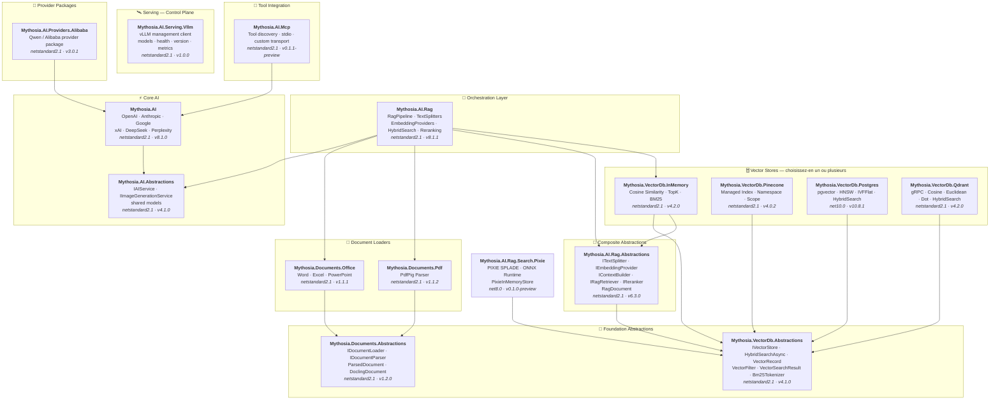

<div align="center">

🌐 [English](../../README.md) · [한국어](../ko/README.md) · [日本語](../ja/README.md) · [Français](README.md) · [Deutsch](../de/README.md) · [Русский](../ru/README.md) · [Українська](../uk/README.md) · [简体中文](../zh-Hans/README.md) · [繁體中文](../zh-Hant/README.md) · [Tiếng Việt](../vi/README.md) · [ภาษาไทย](../th/README.md) · [Português](../pt/README.md) · [Español](../es/README.md)

<br>

[](https://github.com/AJ-comp/Mythosia.AI)


### Bibliothèque .NET AI modulaire pour créer des applications intelligentes

**Changez de fournisseur, ajoutez le RAG, chargez des documents — le tout avec une API unifiée.**

<br>

[](https://www.nuget.org/packages/Mythosia.AI)
[](https://www.nuget.org/packages/Mythosia.AI)
[](https://aj-comp.github.io/Mythosia.AI/)
[](https://dotnet.microsoft.com)

<br>

**[📖 Démarrage](https://aj-comp.github.io/Mythosia.AI/)** &nbsp;·&nbsp; **[Référence API](https://aj-comp.github.io/Mythosia.AI/api/)** &nbsp;·&nbsp; **[GitHub ↗](https://github.com/AJ-comp/Mythosia.AI)**

<br>

</div>

Pour TXT et Markdown, choisissez un [découpeur à règles](text-splitters.md) adapté à la structure. Taille, chevauchement et limites Unicode sont vérifiés ; Markdown conserve titres, code et lignes de tableau. Compter caractères ou mots ne garantit pas le nombre de tokens du modèle. Le sens des conditions de tableau et de l’indentation est conservé ; une répétition excessive de contexte Markdown s’arrête avec une exception explicite.

Pour éviter qu’une indexation apparemment réussie écrase des fragments ou leur associe les mauvais vecteurs, la [validation de l’indexation](rag-pipeline.md#indexing-validation) refuse les ID et les lots d’embeddings invalides avant la persistance. Les découpeurs personnalisés doivent fournir des ID uniques et reprendre les métadonnées du document.

Des [identités de fichier stables](document-loaders.md#file-source-identity), des [vecteurs de question validés](rag-embedding.md#query-embedding-validation) et une [persistance par document avec annulation URL](rag-pipeline.md#custom-persistence) évitent doublons, recherches invalides et fragments périmés.

La préversion optionnelle `Mythosia.AI.Rag.Search.Pixie` permet de comparer la recherche neuronale creuse locale avec la recherche existante. Elle conserve votre fournisseur d’embeddings denses et utilise un index PIXIE en mémoire, sans migrer les stockages persistants ni remplacer le mode par défaut. [Guide PIXIE et comparaison (anglais)](../rag-pixie-search.md).

Isolez les réglages, arrêtez le travail en cours et recevez les réponses avec consommation et sources. Le [guide de migration v8](v8-migration.md) présente six changements d’architecture, des exemples et le périmètre de validation.

> Versions des packages documentées ici: [Mythosia.AI 8.1.0](../../src/core/Mythosia.AI/RELEASE_NOTES.md#v810), [Abstractions 4.1.0](../../src/core/Mythosia.AI.Abstractions/RELEASE_NOTES.md#v410), [Alibaba 3.0.1](../../src/core/Mythosia.AI.Providers.Alibaba/RELEASE_NOTES.md#v301), [RAG 8.1.1](../../src/rag/Mythosia.AI.Rag/RELEASE_NOTES.md#v811), [PostgreSQL 10.8.1](../../src/vectordb/Mythosia.VectorDb.Postgres/RELEASE_NOTES.md#v1081), [MCP 0.1.1-preview](../../src/integrations/Mythosia.AI.Mcp/RELEASE_NOTES.md#v011-preview), [Serving.Vllm 1.0.0](../../src/serving/Mythosia.AI.Serving.Vllm/RELEASE_NOTES.md#v100).

> [Correctif RAG 8.1.1 / PostgreSQL 10.8.1](https://github.com/AJ-comp/Mythosia.AI/blob/main/RELEASE_NOTES.md#v811) : les wrappers RAG existants prennent en compte les changements du réécrivain à l’exécution, et la recherche hybride mixte PostgreSQL respecte les paramètres vectoriels configurés. Le package principal `Mythosia.AI` reste en 8.1.0.

---

### Quels packages installer ?

```
dotnet add package Mythosia.AI                    # commencez ici (c'est tout ce qu'il vous faut)
dotnet add package Mythosia.AI.Rag                # optionnel : quand vous avez besoin du RAG
dotnet add package Mythosia.VectorDb.Postgres     # optionnel : quand vous avez besoin d'un vector store de production
```

| Étape | Package | Quand |
| :--: | --- | --- |
| **1** | **`Mythosia.AI`** | **Commencez ici** — complétion, streaming, appels de fonctions, sortie structurée (OpenAI / Claude / Gemini / Grok / DeepSeek / Perplexity) |
| **2** | **`Mythosia.AI.Rag`** | Quand vous avez besoin du RAG — découpage de texte, embeddings, recherche hybride, reranking, vector store InMemory et chargeurs de documents (Word / Excel / PowerPoint / PDF) |
| **3** | **`Mythosia.VectorDb.Postgres`** / **`Qdrant`** / **`Pinecone`** | Quand vous avez besoin d'un vector store de production à la place d'InMemory — choisissez-en un |

Préparez des paramètres indépendants avec `CreateRequest(...).WithTemperature(...).GetCompletionAsync()`. Le [guide des requêtes](request-building.md) présente Before/After, Run, profils et limites de la conversation partagée.

Pour une requête sensible au temps d’attente, choisissez la [vitesse de traitement](request-building.md#inference-speed). `WithSpeed` conserve modèle et effort, tandis que `Processing` rapporte le mode réellement appliqué. Fast est payant sur les combinaisons compatibles.

## Architecture

<a href="../assets/architecture.svg">
  <picture>
    <source media="(prefers-color-scheme: dark)" srcset="../assets/architecture-dark.svg">
    
  </picture>
</a>

<details>
<summary>Détails des dépendances des packages</summary>



</details>

## Démo / Banc d'essai (Chat UI)

Recherchez un modèle par nom ou fournisseur et réglez les paramètres à gauche, discutez au centre et consultez les informations de traitement dans Inspector à droite avant de l’intégrer à votre application. Stop permet de cesser d’attendre la réponse ; les choix explicites de vitesse ne sont activés que pour les modèles et points de connexion compatibles, et Fast peut entraîner un surcoût. Sur petit écran, Models et Inspector s’ouvrent en panneaux coulissants ; consultez le [guide Chat UI](https://github.com/AJ-comp/Mythosia.AI/blob/main/apps/Mythosia.AI.Samples.ChatUi/README.md) pour le démarrage local, les documents et les réglages du pipeline.

Le sélecteur de langue en haut de la page permet de choisir parmi 13 langues sans perdre les saisies ni les réglages. Les sept fournisseurs sont visibles sous forme de groupes repliés ; dépliez un groupe ou recherchez un modèle.

### Lancer l'exemple

Exécutez **`Mythosia.AI.Samples.ChatUi`** en local :

```bash
# depuis la racine du dépôt
dotnet run --project apps/Mythosia.AI.Samples.ChatUi
```

*La vidéo ci-dessous présente une ancienne interface ; l’écran actuel peut être différent.*

https://github.com/user-attachments/assets/62094afe-9add-4c14-b818-6b31f200dc01


## Démarrage rapide

### Complétion IA de base

```csharp
using Mythosia.AI;

var service = new OpenAIService(apiKey, httpClient);
var response = await service.GetCompletionAsync("Hello!");
```

### Streaming

```csharp
await foreach (var token in service.StreamAsync("Tell me a story"))
{
    Console.Write(token);
}
```

### Streaming avec raisonnement

OpenAI, Claude, Gemini, Grok et DeepSeek Flash exposent le raisonnement du fournisseur selon le même schéma de streaming. Activez le raisonnement dans le service ou la requête, puis observez-le avec `StreamOptions.WithReasoning()` :

```csharp
await foreach (var content in service.StreamAsync(message, new StreamOptions().WithReasoning()))
{
    if (content.Type == StreamingContentType.Reasoning)
        Console.Write($"[Think] {content.Content}");
    else if (content.Type == StreamingContentType.Text)
        Console.Write(content.Content);
}
```

Si une tâche exige davantage de raisonnement ou des sources récentes ou documentaires, utilisez les [options communes de raisonnement et de recherche](reasoning-and-search.md).

### Appel de fonctions

```csharp
var service = new OpenAIService(apiKey, httpClient)
    .WithFunction(
        "get_weather",
        "Gets the current weather for a location",
        ("location", "The city and country", required: true),
        (string location) => $"The weather in {location} is sunny, 22C"
    );

var response = await service.GetCompletionAsync("What's the weather in Seoul?");
```

Une consultation lente ne doit pas forcément suspendre toute la réponse. Pendant le chargement de la météo, par exemple, le modèle peut déjà formuler des conseils de voyage généraux qui ne dépendent pas du résultat.

`FunctionDefinition.AllowAsync = true` ou `FunctionBuilder.WithAsync()` permet d’autoriser les appels asynchrones pour GPT-6 Astra / Sol / Luna via Responses. La valeur par défaut est `false` ; les modèles non compatibles attendent le résultat du même gestionnaire. Voir les exemples et la durée de vie des requêtes dans le [guide des appels de fonctions](function-calling.md).

### Sortie structurée (basique)

```csharp
// Désérialisez les réponses du LLM directement en POCO C# avec auto-récupération
var result = await service.GetCompletionAsync<WeatherResponse>(
    "What's the weather in Seoul?");
```

### Sortie structurée (liste)

```csharp
// Les types collection fonctionnent directement — pas besoin de DTO wrapper
var items = await service.GetCompletionAsync<List<ItemDto>>(
    "Extract all entities from this document...");
```

### Sortie structurée (streaming)

```csharp
// Streamez les fragments de texte en temps réel + obtenez l'objet désérialisé final
var run = service.BeginStream(prompt).As<MyDto>();

await foreach (var chunk in run.Stream())
    Console.Write(chunk);          // UI en temps réel

MyDto dto = await run.Result;      // parsé et auto-réparé
```

### Politique de résumé de conversation

```csharp
// Résumez automatiquement les anciens messages quand la conversation s'allonge
service.ConversationPolicy = SummaryConversationPolicy.ByMessage(
    triggerCount: 20,
    keepRecentCount: 5
);

// Déclencheur basé sur les tokens
service.ConversationPolicy = SummaryConversationPolicy.ByToken(
    triggerTokens: 3000,
    keepRecentTokens: 1000
);

// Utilisez normalement — la synthèse se fait automatiquement
await service.GetCompletionAsync("Continue our conversation...");

// Pour le streaming, appliquez explicitement la politique avant StreamAsync()
await service.ApplySummaryPolicyIfNeededAsync();
await foreach (var chunk in service.StreamAsync("Continue..."))
    Console.Write(chunk.Content);

// Sauvegardez/restaurez le résumé entre les sessions
string saved = service.ConversationPolicy.CurrentSummary;
policy.LoadSummary(saved);
```

### RAG (Génération Augmentée par Récupération)

Choisissez une recherche lexicale, sémantique ou hybride sans imposer un embedding à chaque requête. [Guide de recherche](rag-hybrid-search.md).

```bash
dotnet add package Mythosia.AI.Rag
```

```csharp
using Mythosia.AI.Rag;

var service = new AnthropicService(apiKey, httpClient)
    .WithRag(rag => rag
        .AddDocument("manual.txt")
        .AddDocument("policy.txt")
    );

var response = await service.GetCompletionAsync("What is the refund policy?");
```

## Fournisseurs supportés

> Grok 4.7: Nécessite Mythosia.AI 8.1.0 / Abstractions 4.1.0. [le choix du modèle, le raisonnement et la vitesse](providers.md#grok-47)

> GPT-6 Sol/Luna: Nécessite Mythosia.AI 8.1.0 / Abstractions 4.1.0. [choix du modèle et prérequis](providers.md#gpt-6-sol-luna)

> Claude Opus 5.5: Nécessite Mythosia.AI 8.1.0 / Abstractions 4.1.0. [configuration et migration](providers.md#claude-opus-55)

| Fournisseur | Package | Modèles |
| --- | --- | --- |
| **OpenAI** | `Mythosia.AI` | GPT-6 Astra / Sol / Luna, GPT-5.6 Sol / Terra / Luna, GPT-5.5 / 5.5 Pro / 5.4 / 5.4 Mini / 5.4 Nano / 5.4 Pro / 5.3 Codex / 5.2 / 5.2 Pro / 5.1, GPT-4.1 / 4.1 Mini, GPT-4o / 4o Mini |
| **Anthropic** | `Mythosia.AI` | Claude Fable 5.1 / 5, Mythos 5.1 / 5 (limited), [Opus 5.5](providers.md#claude-opus-55) / 5 / 4.8 / 4.7 / 4.6 / 4.5, Sonnet 5 / 4.6 / 4.5, Haiku 4.5 |
| **Google** | `Mythosia.AI` | Gemini 3.8 Flash, Gemini 3.7 Flash, Gemini 3.6 Flash, Gemini 3.5 Flash/Flash-Lite, Gemini 3.1 Pro Preview/Flash-Lite, Gemini 3 Flash Preview, Gemini 2.5 Pro/Flash/Flash-Lite, Gemini 3.1 Flash Image, Gemini 3.1 Flash-Lite Image, Gemini 3 Pro Image |
| **xAI** | `Mythosia.AI` | Grok 4.7, Grok 4.6, Grok 4.5 (par défaut), Grok 4.3, Grok 4.20 (reasoning / non-reasoning), Grok Build |
| **DeepSeek** | `Mythosia.AI` | Flash (V4.1 Flash), V4 Pro |
| **Perplexity** | `Mythosia.AI` | Préréglages Agent API et `perplexity/sonar` |
| **Alibaba / Qwen** | `Mythosia.AI.Providers.Alibaba` | Qwen Max / Plus / Turbo / Qwen3 / Qwen3.5 variants |

Utilisez Perplexity quand une réponse doit tenir compte d'informations récentes et fournir des sources vérifiables. `PerplexityService` appelle l'Agent API ; la recherche et les embeddings indépendants permettent de construire la récupération de documents autour du modèle de réponse de votre choix. [Perplexity Agent API, recherche et embeddings](perplexity.md).

Pour relire de longs documents ou effectuer plusieurs tours d’outils, choisissez Gemini 3.7 Flash ou 3.8 Flash via l’adaptateur Google existant. Ils sont disponibles à partir de `Mythosia.AI` 8.0.0 / `Mythosia.AI.Abstractions` 4.0.0 ; le modèle par défaut reste Gemini 3.6 Flash.

Pour passer d’une ébauche rapide à une analyse exigeante, sélectionnez explicitement Grok 4.6 et un effort de `Low` à `XHigh`. Disponible dès `Mythosia.AI` 8.0.0 / `Mythosia.AI.Abstractions` 4.0.0 ; Grok 4.5 reste le modèle par défaut de `XAIService`. Voir la [configuration Grok](providers.md#xai-xaiservice).

Pour créer des ébauches ou combiner des références, utilisez [Grok Imagine Image 2.0](providers.md#grok-imagine-image-20) via `IImageGenerationService`. Gardez `OutputFormat = ImageOutputFormat.Auto` et choisissez l’extension selon `MediaType` ; xAI ne permet pas de choisir le codec. Voir la [migration des options d’image](providers.md#image-options-migration). Le modèle de chat reste inchangé.

Choisissez Flare pour des propositions visuelles rapides, Sunburst pour des retouches précises. La [génération et l’édition GPT Image 2.5](providers.md#gpt-image-25) utilisent l’API existante avec un modèle explicite par requête ; le modèle OpenAI par défaut reste GPT Image 2.

Pour choisir des tailles valides lors de la génération ou de la modification d’images, consultez les [options d’image Google par modèle](providers.md#google-image-options). Flash accepte 512/1K/2K/4K, Flash-Lite actuellement 1K et Pro 1K/2K/4K. Flash/Lite proposent 14 rapports d’aspect et Pro les 10 standards ; tous acceptent `Auto`. Les tailles ou rapports explicitement demandés mais non pris en charge sont rejetés avant l’envoi HTTP.

Pour analyser graphiques et captures, appeler vos fonctions ou approfondir une première réponse, utilisez [DeepSeek Flash](providers.md#deepseek-deepseekservice) (`AIModels.DeepSeek.Flash`, V4.1 Flash). Le raisonnement reste désactivé par défaut ; activez-le avec `WithDeepSeekReasoning(...)` ou `WithReasoning(...)` par requête.

Pour le texte uniquement, choisissez `AIModels.DeepSeek.V4Pro` (`deepseek-v4-pro`, V4-Pro-0813). Flash reste le modèle par défaut et accepte les images ; les deux offrent Low/High/Max et le même plafond de sortie. Définissez `UseResponsesApi = true` avant de créer la requête pour utiliser Responses avec les API existantes de complétion, streaming, Run et fonctions locales. La valeur par défaut reste `false` pour conserver Chat Completions dans les applications existantes. Le choix est figé pour la requête et ses tours d’outils. Responses renvoie tout l’historique de conversation et de raisonnement natif sans dépendre d’identifiants de réponses stockés.

Réutilisez une image téléversée dans plusieurs questions à Flash avec `DeepSeekImageFileContent`, via Chat Completions ou Responses ; V4 Pro, réservé au texte, refuse les images. Voir [téléversement, réutilisation et limites des images](providers.md#deepseek-deepseekservice). Nécessite Mythosia.AI 8.1.0 / Abstractions 4.1.0.

## Packages

### Cœur

| Package | NuGet | Description |
| --- | --- | --- |
| [Mythosia.AI](../../src/core/Mythosia.AI/README.md) | [](https://www.nuget.org/packages/Mythosia.AI) | Bibliothèque principale — fournisseurs intégrés, streaming, appels de fonctions et support multimodal |
| [Mythosia.AI.Abstractions](../../src/core/Mythosia.AI.Abstractions/README.md) | [](https://www.nuget.org/packages/Mythosia.AI.Abstractions) | Interface `IAIService` et modèles partagés — package de contrat léger pour les bibliothèques |
| [Mythosia.AI.Providers.Alibaba](../../src/core/Mythosia.AI.Providers.Alibaba/README.md) | [](https://www.nuget.org/packages/Mythosia.AI.Providers.Alibaba) | Package fournisseur Alibaba / Qwen basé sur `Mythosia.AI` |

### RAG

| Package | NuGet | Description |
| --- | --- | --- |
| [Mythosia.AI.Rag](../../src/rag/Mythosia.AI.Rag/README.md) | [](https://www.nuget.org/packages/Mythosia.AI.Rag) | Extension RAG fluide pour IAIService avec l'API `.WithRag()` |
| [Mythosia.AI.Rag.Abstractions](../../src/rag/Mythosia.AI.Rag.Abstractions/README.md) | [](https://www.nuget.org/packages/Mythosia.AI.Rag.Abstractions) | Interfaces et modèles pour les composants du pipeline RAG |

### Chargeurs de documents

| Package | NuGet | Description |
| --- | --- | --- |
| [Mythosia.Documents.Abstractions](../../src/loaders/Mythosia.Documents.Abstractions/README.md) | [](https://www.nuget.org/packages/Mythosia.Documents.Abstractions) | Interfaces et modèles des chargeurs de documents (`IDocumentLoader`, `DoclingDocument`) |
| [Mythosia.Documents.Office](../../src/loaders/Mythosia.Documents.Office/README.md) | [](https://www.nuget.org/packages/Mythosia.Documents.Office) | Parseurs OpenXml pour Word / Excel / PowerPoint |
| [Mythosia.Documents.Pdf](../../src/loaders/Mythosia.Documents.Pdf/README.md) | [](https://www.nuget.org/packages/Mythosia.Documents.Pdf) | Parseur PDF via PdfPig |

### Vector Stores

> **Choisissez-en un ou plusieurs** — tous implémentent `IVectorStore` du package Abstractions.

| Package | NuGet | Description |
| --- | --- | --- |
| [Mythosia.VectorDb.Abstractions](../../src/vectordb/Mythosia.VectorDb.Abstractions/README.md) | [](https://www.nuget.org/packages/Mythosia.VectorDb.Abstractions) | Contrats `IVectorStore` · `VectorRecord` · `VectorFilter` |
| [Mythosia.VectorDb.InMemory](../../src/vectordb/Mythosia.VectorDb.InMemory/README.md) | [](https://www.nuget.org/packages/Mythosia.VectorDb.InMemory) | Store en mémoire — zéro infrastructure, idéal pour le prototypage |
| [Mythosia.VectorDb.Pinecone](../../src/vectordb/Mythosia.VectorDb.Pinecone/README.md) | [](https://www.nuget.org/packages/Mythosia.VectorDb.Pinecone) | API HTTP Pinecone — isolation par index/namespace/scope pour la base de vecteurs gérée |
| [Mythosia.VectorDb.Postgres](../../src/vectordb/Mythosia.VectorDb.Postgres/README.md) | [](https://www.nuget.org/packages/Mythosia.VectorDb.Postgres) | PostgreSQL + pgvector — index HNSW / IVFFlat, prêt pour la production |
| [Mythosia.VectorDb.Qdrant](../../src/vectordb/Mythosia.VectorDb.Qdrant/README.md) | [](https://www.nuget.org/packages/Mythosia.VectorDb.Qdrant) | Client gRPC Qdrant — Cosine / Euclidean / Dot, provisionnement automatique |

### Serving — Plan de contrôle

> Clients de gestion/introspection pour les runtimes de serving de modèles. Le chat reste sur les packages fournisseurs : `Providers.*` = plan de données du chat, `Serving.*` = plan de contrôle du serveur.

| Package | NuGet | Description |
| --- | --- | --- |
| [Mythosia.AI.Serving.Vllm](../../src/serving/Mythosia.AI.Serving.Vllm/README.md) | [](https://www.nuget.org/packages/Mythosia.AI.Serving.Vllm) | Client de plan de contrôle vLLM — fiches de modèles (le modèle réellement chargé via `root`), santé, version du serveur, métriques Prometheus |

## Structure du dépôt

```text
src/
  core/
    Mythosia.AI/                        # Bibliothèque principale du service AI
    Mythosia.AI.Abstractions/           # Interface IAIService et modèles partagés
    Mythosia.AI.Providers.Alibaba/      # Package fournisseur Alibaba / Qwen
  loaders/
    Mythosia.Documents.Abstractions/    # Contrats des chargeurs de documents (IDocumentLoader, DoclingDocument)
    Mythosia.Documents.Office/          # Chargeurs de documents Office (Word/Excel/PowerPoint)
    Mythosia.Documents.Pdf/             # Chargeur de documents PDF
  rag/
    Mythosia.AI.Rag/                    # API Fluent RAG et pipeline
    Mythosia.AI.Rag.Abstractions/       # Interfaces et modèles RAG (RagDocument)
  serving/
    Mythosia.AI.Serving.Vllm/           # Client de plan de contrôle vLLM (modèles/santé/version/métriques)
  vectordb/
    Mythosia.VectorDb.Abstractions/     # Contrats des vector stores
    Mythosia.VectorDb.InMemory/         # Vector store en mémoire
    Mythosia.VectorDb.Pinecone/         # Vector store Pinecone
    Mythosia.VectorDb.Postgres/         # Store PostgreSQL + pgvector
    Mythosia.VectorDb.Qdrant/           # Vector store Qdrant
apps/                                   # Applications d'exemple
tests/                                  # Projets de tests unitaires / d'intégration
```

## Installation

```bash
dotnet add package Mythosia.AI
```

Pour les opérations LINQ avancées sur les flux :

```bash
dotnet add package System.Linq.Async
```

## Documentation

- [Guide d'utilisation de base](getting-started.md)
- [README Mythosia.AI](../../src/core/Mythosia.AI/README.md)  Référence API complète : appels de fonctions, streaming et configuration des modèles
- [README Mythosia.AI.Rag](../../src/rag/Mythosia.AI.Rag/README.md)  Utilisation du pipeline RAG et implémentations personnalisées
- [Guide des chargeurs](document-loaders.md)
- [Notes de version](../../src/core/Mythosia.AI/RELEASE_NOTES.md)

## Licence

Ce projet est distribué sous la [licence MIT](https://github.com/AJ-comp/Mythosia.AI/blob/main/LICENSE).

## À l'origine

Ce projet faisait à l'origine partie de [Mythosia](https://github.com/AJ-comp/Mythosia).

[Construire les options du modèle avec des définitions partagées](model-capabilities.md).
