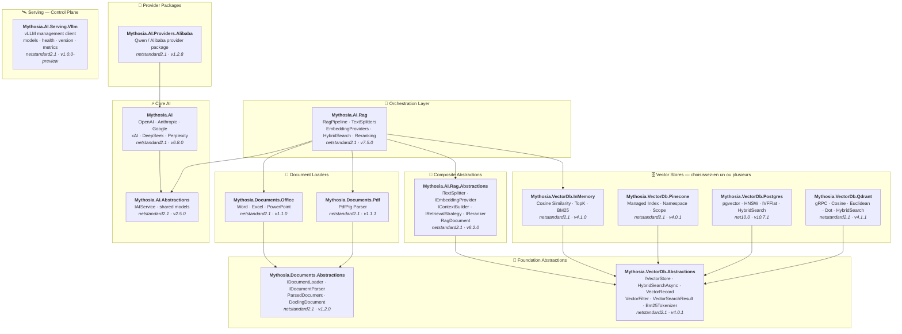

<div align="center">

🌐 [English](../../README.md) · [한국어](../ko/README.md) · [日本語](../ja/README.md) · [Français](README.md) · [Deutsch](../de/README.md) · [Русский](../ru/README.md) · [Українська](../uk/README.md) · [简体中文](../zh-Hans/README.md) · [繁體中文](../zh-Hant/README.md) · [Tiếng Việt](../vi/README.md) · [ภาษาไทย](../th/README.md) · [Português](../pt/README.md) · [Español](../es/README.md)

<br>

[](https://github.com/AJ-comp/Mythosia.AI)


### Bibliothèque .NET AI modulaire pour créer des applications intelligentes

**Changez de fournisseur, ajoutez le RAG, chargez des documents — le tout avec une API unifiée.**

<br>

[](https://www.nuget.org/packages/Mythosia.AI)
[](https://www.nuget.org/packages/Mythosia.AI)
[](https://aj-comp.github.io/Mythosia.AI/)
[](https://dotnet.microsoft.com)

<br>

**[📖 Démarrage](https://aj-comp.github.io/Mythosia.AI/)** &nbsp;·&nbsp; **[Référence API](https://aj-comp.github.io/Mythosia.AI/api/)** &nbsp;·&nbsp; **[GitHub ↗](https://github.com/AJ-comp/Mythosia.AI)**

<br>

</div>

---

### Quels packages installer ?

```
dotnet add package Mythosia.AI                    # commencez ici (c'est tout ce qu'il vous faut)
dotnet add package Mythosia.AI.Rag                # optionnel : quand vous avez besoin du RAG
dotnet add package Mythosia.VectorDb.Postgres     # optionnel : quand vous avez besoin d'un vector store de production
```

| Étape | Package | Quand |
| :--: | --- | --- |
| **1** | **`Mythosia.AI`** | **Commencez ici** — complétion, streaming, appels de fonctions, sortie structurée (OpenAI / Claude / Gemini / Grok / DeepSeek / Perplexity) |
| **2** | **`Mythosia.AI.Rag`** | Quand vous avez besoin du RAG — découpage de texte, embeddings, recherche hybride, reranking, vector store InMemory et chargeurs de documents (Word / Excel / PowerPoint / PDF) |
| **3** | **`Mythosia.VectorDb.Postgres`** / **`Qdrant`** / **`Pinecone`** | Quand vous avez besoin d'un vector store de production à la place d'InMemory — choisissez-en un |

## Architecture



## Démo / Banc d'essai (Chat UI)

Ce dépôt inclut un exemple de Chat UI construit avec Mythosia.AI — lancez Mythosia.AI.Samples.ChatUi pour tester la bibliothèque en conditions réelles.

### Lancer l'exemple

Exécutez **`Mythosia.AI.Samples.ChatUi`** en local :

```bash
# depuis la racine du dépôt
dotnet run --project samples/Mythosia.AI.Samples.ChatUi
```

https://github.com/user-attachments/assets/62094afe-9add-4c14-b818-6b31f200dc01


## Démarrage rapide

### Complétion IA de base

```csharp
using Mythosia.AI;

var service = new OpenAIService(apiKey, httpClient);
var response = await service.GetCompletionAsync("Hello!");
```

### Streaming

```csharp
await foreach (var token in service.StreamAsync("Tell me a story"))
{
    Console.Write(token);
}
```

### Streaming avec raisonnement

Tous les fournisseurs compatibles avec le raisonnement (OpenAI, Claude, Gemini, Grok, DeepSeek) utilisent le même schéma de streaming :

```csharp
await foreach (var content in service.StreamAsync(message, new StreamOptions().WithReasoning()))
{
    if (content.Type == StreamingContentType.Reasoning)
        Console.Write($"[Think] {content.Content}");
    else if (content.Type == StreamingContentType.Text)
        Console.Write(content.Content);
}
```

### Appel de fonctions

```csharp
var service = new OpenAIService(apiKey, httpClient)
    .WithFunction(
        "get_weather",
        "Gets the current weather for a location",
        ("location", "The city and country", required: true),
        (string location) => $"The weather in {location} is sunny, 22C"
    );

var response = await service.GetCompletionAsync("What's the weather in Seoul?");
```

### Sortie structurée (basique)

```csharp
// Désérialisez les réponses du LLM directement en POCO C# avec auto-récupération
var result = await service.GetCompletionAsync<WeatherResponse>(
    "What's the weather in Seoul?");
```

### Sortie structurée (liste)

```csharp
// Les types collection fonctionnent directement — pas besoin de DTO wrapper
var items = await service.GetCompletionAsync<List<ItemDto>>(
    "Extract all entities from this document...");
```

### Sortie structurée (streaming)

```csharp
// Streamez les fragments de texte en temps réel + obtenez l'objet désérialisé final
var run = service.BeginStream(prompt).As<MyDto>();

await foreach (var chunk in run.Stream())
    Console.Write(chunk);          // UI en temps réel

MyDto dto = await run.Result;      // parsé et auto-réparé
```

### Politique de résumé de conversation

```csharp
// Résumez automatiquement les anciens messages quand la conversation s'allonge
service.ConversationPolicy = SummaryConversationPolicy.ByMessage(
    triggerCount: 20,
    keepRecentCount: 5
);

// Déclencheur basé sur les tokens
service.ConversationPolicy = SummaryConversationPolicy.ByToken(
    triggerTokens: 3000,
    keepRecentTokens: 1000
);

// Utilisez normalement — la synthèse se fait automatiquement
await service.GetCompletionAsync("Continue our conversation...");

// Pour le streaming, appliquez explicitement la politique avant StreamAsync()
await service.ApplySummaryPolicyIfNeededAsync();
await foreach (var chunk in service.StreamAsync("Continue..."))
    Console.Write(chunk.Content);

// Sauvegardez/restaurez le résumé entre les sessions
string saved = service.ConversationPolicy.CurrentSummary;
policy.LoadSummary(saved);
```

### RAG (Génération Augmentée par Récupération)

```bash
dotnet add package Mythosia.AI.Rag
```

```csharp
using Mythosia.AI.Rag;

var service = new AnthropicService(apiKey, httpClient)
    .WithRag(rag => rag
        .AddDocument("manual.txt")
        .AddDocument("policy.txt")
    );

var response = await service.GetCompletionAsync("What is the refund policy?");
```

## Fournisseurs supportés

| Fournisseur | Package | Modèles |
| --- | --- | --- |
| **OpenAI** | `Mythosia.AI` | GPT-5.5 / 5.5 Pro / 5.4 / 5.4 Mini / 5.4 Nano / 5.4 Pro / 5.3 Codex / 5.2 / 5.2 Pro / 5.2 Codex / 5.1 / 5 / 5 Pro / 5 Mini / 5 Nano, GPT-4.1 / 4.1 Mini / 4.1 Nano, GPT-4o / 4o Mini, o3 / o3 Pro |
| **Anthropic** | `Mythosia.AI` | Claude Fable 5, Opus 4.8 / 4.7 / 4.6 / 4.5 / 4.1 / 4, Sonnet 4.6 / 4.5, Haiku 4.5 |
| **Google** | `Mythosia.AI` | Gemini 3.1 Pro Preview, Gemini 3.5 Flash, Gemini 3 Flash Preview, Gemini 3.1 Flash-Lite, Gemini 2.5 Pro/Flash/Flash-Lite |
| **xAI** | `Mythosia.AI` | Grok 4.3, Grok 4.20 (reasoning / non-reasoning), Grok Build 0.1, Grok 3 Mini |
| **DeepSeek** | `Mythosia.AI` | Chat, Reasoner |
| **Perplexity** | `Mythosia.AI` | Sonar, Sonar Pro, Sonar Reasoning Pro |
| **Alibaba / Qwen** | `Mythosia.AI.Providers.Alibaba` | Qwen Max / Plus / Turbo / Qwen3 / Qwen3.5 variants |

## Packages

### Cœur

| Package | NuGet | Description |
| --- | --- | --- |
| [Mythosia.AI](../../src/core/Mythosia.AI/) | [](https://www.nuget.org/packages/Mythosia.AI) | Bibliothèque principale — fournisseurs intégrés, streaming, appels de fonctions et support multimodal |
| [Mythosia.AI.Abstractions](../../src/core/Mythosia.AI.Abstractions/) | [](https://www.nuget.org/packages/Mythosia.AI.Abstractions) | Interface `IAIService` et modèles partagés — package de contrat léger pour les bibliothèques |
| [Mythosia.AI.Providers.Alibaba](../../src/core/Mythosia.AI.Providers.Alibaba/) | [](https://www.nuget.org/packages/Mythosia.AI.Providers.Alibaba) | Package fournisseur Alibaba / Qwen basé sur `Mythosia.AI` |

### RAG

| Package | NuGet | Description |
| --- | --- | --- |
| [Mythosia.AI.Rag](../../src/rag/Mythosia.AI.Rag/) | [](https://www.nuget.org/packages/Mythosia.AI.Rag) | Extension RAG fluide pour IAIService avec l'API `.WithRag()` |
| [Mythosia.AI.Rag.Abstractions](../../src/rag/Mythosia.AI.Rag.Abstractions/) | [](https://www.nuget.org/packages/Mythosia.AI.Rag.Abstractions) | Interfaces et modèles pour les composants du pipeline RAG |

### Chargeurs de documents

| Package | NuGet | Description |
| --- | --- | --- |
| [Mythosia.Documents.Abstractions](../../src/loaders/Mythosia.Documents.Abstractions/) | [](https://www.nuget.org/packages/Mythosia.Documents.Abstractions) | Interfaces et modèles des chargeurs de documents (`IDocumentLoader`, `DoclingDocument`) |
| [Mythosia.Documents.Office](../../src/loaders/Mythosia.Documents.Office/) | [](https://www.nuget.org/packages/Mythosia.Documents.Office) | Parseurs OpenXml pour Word / Excel / PowerPoint |
| [Mythosia.Documents.Pdf](../../src/loaders/Mythosia.Documents.Pdf/) | [](https://www.nuget.org/packages/Mythosia.Documents.Pdf) | Parseur PDF via PdfPig |

### Vector Stores

> **Choisissez-en un ou plusieurs** — tous implémentent `IVectorStore` du package Abstractions.

| Package | NuGet | Description |
| --- | --- | --- |
| [Mythosia.VectorDb.Abstractions](../../src/vectordb/Mythosia.VectorDb.Abstractions/) | [](https://www.nuget.org/packages/Mythosia.VectorDb.Abstractions) | Contrats `IVectorStore` · `VectorRecord` · `VectorFilter` |
| [Mythosia.VectorDb.InMemory](../../src/vectordb/Mythosia.VectorDb.InMemory/) | [](https://www.nuget.org/packages/Mythosia.VectorDb.InMemory) | Store en mémoire — zéro infrastructure, idéal pour le prototypage |
| [Mythosia.VectorDb.Pinecone](../../src/vectordb/Mythosia.VectorDb.Pinecone/) | [](https://www.nuget.org/packages/Mythosia.VectorDb.Pinecone) | API HTTP Pinecone — isolation par index/namespace/scope pour la base de vecteurs gérée |
| [Mythosia.VectorDb.Postgres](../../src/vectordb/Mythosia.VectorDb.Postgres/) | [](https://www.nuget.org/packages/Mythosia.VectorDb.Postgres) | PostgreSQL + pgvector — index HNSW / IVFFlat, prêt pour la production |
| [Mythosia.VectorDb.Qdrant](../../src/vectordb/Mythosia.VectorDb.Qdrant/) | [](https://www.nuget.org/packages/Mythosia.VectorDb.Qdrant) | Client gRPC Qdrant — Cosine / Euclidean / Dot, provisionnement automatique |

### Serving — Plan de contrôle

> Clients de gestion/introspection pour les runtimes de serving de modèles. Le chat reste sur les packages fournisseurs : `Providers.*` = plan de données du chat, `Serving.*` = plan de contrôle du serveur.

| Package | NuGet | Description |
| --- | --- | --- |
| [Mythosia.AI.Serving.Vllm](../../src/serving/Mythosia.AI.Serving.Vllm/) | [](https://www.nuget.org/packages/Mythosia.AI.Serving.Vllm) | Client de plan de contrôle vLLM — fiches de modèles (le modèle réellement chargé via `root`), santé, version du serveur, métriques Prometheus |

## Structure du dépôt

```text
src/
  core/
    Mythosia.AI/                        # Bibliothèque principale du service AI
    Mythosia.AI.Abstractions/           # Interface IAIService et modèles partagés
    Mythosia.AI.Providers.Alibaba/      # Package fournisseur Alibaba / Qwen
  loaders/
    Mythosia.Documents.Abstractions/    # Contrats des chargeurs de documents (IDocumentLoader, DoclingDocument)
    Mythosia.Documents.Office/          # Chargeurs de documents Office (Word/Excel/PowerPoint)
    Mythosia.Documents.Pdf/             # Chargeur de documents PDF
  rag/
    Mythosia.AI.Rag/                    # API Fluent RAG et pipeline
    Mythosia.AI.Rag.Abstractions/       # Interfaces et modèles RAG (RagDocument)
  serving/
    Mythosia.AI.Serving.Vllm/           # Client de plan de contrôle vLLM (modèles/santé/version/métriques)
  vectordb/
    Mythosia.VectorDb.Abstractions/     # Contrats des vector stores
    Mythosia.VectorDb.InMemory/         # Vector store en mémoire
    Mythosia.VectorDb.Pinecone/         # Vector store Pinecone
    Mythosia.VectorDb.Postgres/         # Store PostgreSQL + pgvector
    Mythosia.VectorDb.Qdrant/           # Vector store Qdrant
samples/                                # Applications d'exemple
tests/                                  # Projets de tests unitaires / d'intégration
```

## Installation

```bash
dotnet add package Mythosia.AI
```

Pour les opérations LINQ avancées sur les flux :

```bash
dotnet add package System.Linq.Async
```

## Documentation

- [Guide d'utilisation de base](https://github.com/AJ-comp/Mythosia.AI/wiki)
- [README Mythosia.AI](../../src/core/Mythosia.AI/README.md)  Référence API complète : appels de fonctions, streaming et configuration des modèles
- [README Mythosia.AI.Rag](../../src/rag/Mythosia.AI.Rag/README.md)  Utilisation du pipeline RAG et implémentations personnalisées
- [Guide des chargeurs](document-loaders.md)
- [Notes de version](../../src/core/Mythosia.AI/RELEASE_NOTES.md)

## Licence

Ce projet est distribué sous la [licence MIT](../../LICENSE).

## À l'origine

Ce projet faisait à l'origine partie de [Mythosia](https://github.com/AJ-comp/Mythosia).
