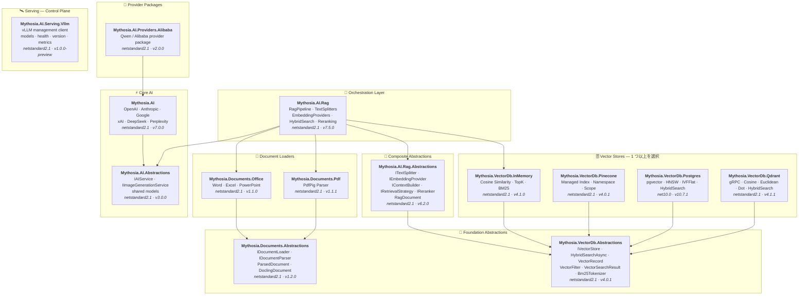

<div align="center">

🌐 [English](../../README.md) · [한국어](../ko/README.md) · [日本語](README.md) · [Français](../fr/README.md) · [Deutsch](../de/README.md) · [Русский](../ru/README.md) · [Українська](../uk/README.md) · [简体中文](../zh-Hans/README.md) · [繁體中文](../zh-Hant/README.md) · [Tiếng Việt](../vi/README.md) · [ภาษาไทย](../th/README.md) · [Português](../pt/README.md) · [Español](../es/README.md)

<br>

[](https://github.com/AJ-comp/Mythosia.AI)


### インテリジェントなアプリケーション構築のためのモジュラー .NET AI ライブラリ

**プロバイダーの切り替え、RAG の追加、ドキュメントの読み込み — 統一された API ですべてに対応。**

<br>

[](https://www.nuget.org/packages/Mythosia.AI)
[](https://www.nuget.org/packages/Mythosia.AI)
[](https://aj-comp.github.io/Mythosia.AI/)
[](https://dotnet.microsoft.com)

<br>

**[📖 はじめに](https://aj-comp.github.io/Mythosia.AI/)** &nbsp;·&nbsp; **[API リファレンス](https://aj-comp.github.io/Mythosia.AI/api/)** &nbsp;·&nbsp; **[GitHub ↗](https://github.com/AJ-comp/Mythosia.AI)**

<br>

</div>

---

### どのパッケージをインストールすればよいですか？

```
dotnet add package Mythosia.AI                    # まずはここから（これだけで始められます）
dotnet add package Mythosia.AI.Rag                # 任意: RAG が必要な場合
dotnet add package Mythosia.VectorDb.Postgres     # 任意: 本番用ベクトルストアが必要な場合
```

| ステップ | パッケージ | 用途 |
| :--: | --- | --- |
| **1** | **`Mythosia.AI`** | **ここから開始** — 補完、ストリーミング、関数呼び出し、構造化出力 (OpenAI / Claude / Gemini / Grok / DeepSeek / Perplexity) |
| **2** | **`Mythosia.AI.Rag`** | RAG が必要な場合 — テキスト分割、エンベディング、ハイブリッド検索、リランキング、InMemory ベクトルストア、ドキュメントローダー (Word / Excel / PowerPoint / PDF) |
| **3** | **`Mythosia.VectorDb.Postgres`** / **`Qdrant`** / **`Pinecone`** | InMemory の代わりに本番用ベクトルストアが必要な場合 — いずれか一つを選択 |

## アーキテクチャ



## デモ / テストベッド (Chat UI)

このリポジトリには Mythosia.AI で構築されたサンプル Chat UI が含まれています。Mythosia.AI.Samples.ChatUi を起動して、ライブラリの動作を実際に確認できます。

### サンプルの実行

**`Mythosia.AI.Samples.ChatUi`** をローカルで実行してみましょう：

```bash
# リポジトリのルートから
dotnet run --project samples/Mythosia.AI.Samples.ChatUi
```

https://github.com/user-attachments/assets/62094afe-9add-4c14-b818-6b31f200dc01


## クイックスタート

### 基本的な AI 補完

```csharp
using Mythosia.AI;

var service = new OpenAIService(apiKey, httpClient);
var response = await service.GetCompletionAsync("Hello!");
```

### ストリーミング

```csharp
await foreach (var token in service.StreamAsync("Tell me a story"))
{
    Console.Write(token);
}
```

### 推論（Reasoning）ストリーミング

推論対応のすべてのプロバイダー（OpenAI、Claude、Gemini、Grok、DeepSeek）が同じストリーミングパターンを使用します：

```csharp
await foreach (var content in service.StreamAsync(message, new StreamOptions().WithReasoning()))
{
    if (content.Type == StreamingContentType.Reasoning)
        Console.Write($"[Think] {content.Content}");
    else if (content.Type == StreamingContentType.Text)
        Console.Write(content.Content);
}
```

### 関数呼び出し

```csharp
var service = new OpenAIService(apiKey, httpClient)
    .WithFunction(
        "get_weather",
        "Gets the current weather for a location",
        ("location", "The city and country", required: true),
        (string location) => $"The weather in {location} is sunny, 22C"
    );

var response = await service.GetCompletionAsync("What's the weather in Seoul?");
```

### 構造化出力（基本）

```csharp
// LLM の応答を C# POCO に直接デシリアライズ + 自動リカバリ
var result = await service.GetCompletionAsync<WeatherResponse>(
    "What's the weather in Seoul?");
```

### 構造化出力（リスト）

```csharp
// コレクション型もラッパー DTO 不要でそのまま動作
var items = await service.GetCompletionAsync<List<ItemDto>>(
    "Extract all entities from this document...");
```

### 構造化出力（ストリーミング）

```csharp
// リアルタイムでテキストをストリーミング + 最終デシリアライズオブジェクトを取得
var run = service.BeginStream(prompt).As<MyDto>();

await foreach (var chunk in run.Stream())
    Console.Write(chunk);          // リアルタイム UI

MyDto dto = await run.Result;      // パース＆自動リカバリ済み
```

### 会話要約ポリシー

```csharp
// 会話が長くなったら古いメッセージを自動的に要約
service.ConversationPolicy = SummaryConversationPolicy.ByMessage(
    triggerCount: 20,
    keepRecentCount: 5
);

// トークンベースのトリガー
service.ConversationPolicy = SummaryConversationPolicy.ByToken(
    triggerTokens: 3000,
    keepRecentTokens: 1000
);

// 通常通り使用するだけ — 要約は自動的に行われます
await service.GetCompletionAsync("Continue our conversation...");

// ストリーミングの場合は StreamAsync() 前に要約ポリシーを明示的に適用
await service.ApplySummaryPolicyIfNeededAsync();
await foreach (var chunk in service.StreamAsync("Continue..."))
    Console.Write(chunk.Content);

// セッション間で要約を保存・復元
string saved = service.ConversationPolicy.CurrentSummary;
policy.LoadSummary(saved);
```

### RAG（検索拡張生成）

```bash
dotnet add package Mythosia.AI.Rag
```

```csharp
using Mythosia.AI.Rag;

var service = new AnthropicService(apiKey, httpClient)
    .WithRag(rag => rag
        .AddDocument("manual.txt")
        .AddDocument("policy.txt")
    );

var response = await service.GetCompletionAsync("What is the refund policy?");
```

## 対応プロバイダー

| プロバイダー | パッケージ | モデル |
| --- | --- | --- |
| **OpenAI** | `Mythosia.AI` | GPT-5.6 Sol / Terra / Luna, GPT-5.5 / 5.5 Pro / 5.4 / 5.4 Mini / 5.4 Nano / 5.4 Pro / 5.3 Codex / 5.2 / 5.2 Pro / 5.1 / 5 / 5 Pro / 5 Mini / 5 Nano, GPT-4.1 / 4.1 Mini, GPT-4o / 4o Mini, o3 / o3 Pro |
| **Anthropic** | `Mythosia.AI` | Claude Fable 5, Mythos 5 (limited), Opus 5 / 4.8 / 4.7 / 4.6 / 4.5, Sonnet 5 / 4.6 / 4.5, Haiku 4.5 |
| **Google** | `Mythosia.AI` | Gemini 3.1 Pro Preview, Gemini 3.5 Flash, Gemini 3 Flash Preview, Gemini 3.1 Flash-Lite, Gemini 2.5 Pro/Flash/Flash-Lite |
| **xAI** | `Mythosia.AI` | Grok 4.5 (default), Grok 4.3, Grok 4.20 (reasoning / non-reasoning), Grok Build |
| **DeepSeek** | `Mythosia.AI` | Chat, Reasoner |
| **Perplexity** | `Mythosia.AI` | Sonar, Sonar Pro, Sonar Reasoning Pro |
| **Alibaba / Qwen** | `Mythosia.AI.Providers.Alibaba` | Qwen Max / Plus / Turbo / Qwen3 / Qwen3.5 variants |

## パッケージ一覧

### コア

| パッケージ | NuGet | 説明 |
| --- | --- | --- |
| [Mythosia.AI](../../src/core/Mythosia.AI/README.md) | [](https://www.nuget.org/packages/Mythosia.AI) | コアライブラリ — 組み込みプロバイダー、ストリーミング、関数呼び出し、マルチモーダル対応 |
| [Mythosia.AI.Abstractions](../../src/core/Mythosia.AI.Abstractions/README.md) | [](https://www.nuget.org/packages/Mythosia.AI.Abstractions) | `IAIService` インターフェースと共有モデル — ライブラリ向け軽量コントラクトパッケージ |
| [Mythosia.AI.Providers.Alibaba](../../src/core/Mythosia.AI.Providers.Alibaba/README.md) | [](https://www.nuget.org/packages/Mythosia.AI.Providers.Alibaba) | `Mythosia.AI` 上に構築された Alibaba / Qwen プロバイダーパッケージ |

### RAG

| パッケージ | NuGet | 説明 |
| --- | --- | --- |
| [Mythosia.AI.Rag](../../src/rag/Mythosia.AI.Rag/README.md) | [](https://www.nuget.org/packages/Mythosia.AI.Rag) | `.WithRag()` API による IAIService 用 Fluent RAG 拡張 |
| [Mythosia.AI.Rag.Abstractions](../../src/rag/Mythosia.AI.Rag.Abstractions/README.md) | [](https://www.nuget.org/packages/Mythosia.AI.Rag.Abstractions) | RAG パイプラインコンポーネントのインターフェースとモデル |

### ドキュメントローダー

| パッケージ | NuGet | 説明 |
| --- | --- | --- |
| [Mythosia.Documents.Abstractions](../../src/loaders/Mythosia.Documents.Abstractions/README.md) | [](https://www.nuget.org/packages/Mythosia.Documents.Abstractions) | ドキュメントローダーのインターフェースとモデル (`IDocumentLoader`, `DoclingDocument`) |
| [Mythosia.Documents.Office](../../src/loaders/Mythosia.Documents.Office/README.md) | [](https://www.nuget.org/packages/Mythosia.Documents.Office) | Word / Excel / PowerPoint 用 OpenXml パーサー |
| [Mythosia.Documents.Pdf](../../src/loaders/Mythosia.Documents.Pdf/README.md) | [](https://www.nuget.org/packages/Mythosia.Documents.Pdf) | PdfPig ベースの PDF パーサー |

### ベクトルストア

> **1 つ以上を選択** — すべて Abstractions パッケージの `IVectorStore` を実装しています。

| パッケージ | NuGet | 説明 |
| --- | --- | --- |
| [Mythosia.VectorDb.Abstractions](../../src/vectordb/Mythosia.VectorDb.Abstractions/README.md) | [](https://www.nuget.org/packages/Mythosia.VectorDb.Abstractions) | `IVectorStore` · `VectorRecord` · `VectorFilter` コントラクト |
| [Mythosia.VectorDb.InMemory](../../src/vectordb/Mythosia.VectorDb.InMemory/README.md) | [](https://www.nuget.org/packages/Mythosia.VectorDb.InMemory) | インメモリストア — インフラ不要、プロトタイピングに最適 |
| [Mythosia.VectorDb.Pinecone](../../src/vectordb/Mythosia.VectorDb.Pinecone/README.md) | [](https://www.nuget.org/packages/Mythosia.VectorDb.Pinecone) | Pinecone HTTP API — マネージドベクトル DB のインデックス/ネームスペース/スコープ分離 |
| [Mythosia.VectorDb.Postgres](../../src/vectordb/Mythosia.VectorDb.Postgres/README.md) | [](https://www.nuget.org/packages/Mythosia.VectorDb.Postgres) | PostgreSQL + pgvector — HNSW / IVFFlat インデックス、本番環境対応 |
| [Mythosia.VectorDb.Qdrant](../../src/vectordb/Mythosia.VectorDb.Qdrant/README.md) | [](https://www.nuget.org/packages/Mythosia.VectorDb.Qdrant) | Qdrant gRPC クライアント — Cosine / Euclidean / Dot、自動プロビジョニング |

### サービング — コントロールプレーン

> モデルサービングランタイム向けの管理／イントロスペクションクライアント。チャットは引き続きプロバイダーパッケージが担当します: `Providers.*` = チャットのデータプレーン、`Serving.*` = サーバーのコントロールプレーン。

| パッケージ | NuGet | 説明 |
| --- | --- | --- |
| [Mythosia.AI.Serving.Vllm](../../src/serving/Mythosia.AI.Serving.Vllm/README.md) | [](https://www.nuget.org/packages/Mythosia.AI.Serving.Vllm) | vLLM コントロールプレーンクライアント — モデルカード（`root` で実際にロードされているモデルを取得）、ヘルスチェック、サーバーバージョン、Prometheus メトリクス |

## リポジトリ構成

```text
src/
  core/
    Mythosia.AI/                        # コア AI サービスライブラリ
    Mythosia.AI.Abstractions/           # IAIService インターフェースと共有モデル
    Mythosia.AI.Providers.Alibaba/      # Alibaba / Qwen プロバイダーパッケージ
  loaders/
    Mythosia.Documents.Abstractions/    # ドキュメントローダーコントラクト (IDocumentLoader, DoclingDocument)
    Mythosia.Documents.Office/          # Office ドキュメントローダー (Word/Excel/PowerPoint)
    Mythosia.Documents.Pdf/             # PDF ドキュメントローダー
  rag/
    Mythosia.AI.Rag/                    # RAG Fluent API とパイプライン
    Mythosia.AI.Rag.Abstractions/       # RAG インターフェースとモデル (RagDocument)
  serving/
    Mythosia.AI.Serving.Vllm/           # vLLM コントロールプレーンクライアント (モデル/ヘルス/バージョン/メトリクス)
  vectordb/
    Mythosia.VectorDb.Abstractions/     # ベクトルストアコントラクト
    Mythosia.VectorDb.InMemory/         # インメモリベクトルストア
    Mythosia.VectorDb.Pinecone/         # Pinecone ベクトルストア
    Mythosia.VectorDb.Postgres/         # PostgreSQL + pgvector ストア
    Mythosia.VectorDb.Qdrant/           # Qdrant ベクトルストア
samples/                                # サンプルアプリケーション
tests/                                  # ユニット/統合テストプロジェクト
```

## インストール

```bash
dotnet add package Mythosia.AI
```

ストリームで高度な LINQ 操作を使用する場合：

```bash
dotnet add package System.Linq.Async
```

## ドキュメント

- [基本使用ガイド](getting-started.md)
- [Mythosia.AI README](../../src/core/Mythosia.AI/README.md)  関数呼び出し、ストリーミング、モデル設定を含む完全な API リファレンス
- [Mythosia.AI.Rag README](../../src/rag/Mythosia.AI.Rag/README.md)  RAG パイプラインの使い方とカスタム実装
- [ローダーガイド](document-loaders.md)
- [リリースノート](../../src/core/Mythosia.AI/RELEASE_NOTES.md)

## ライセンス

このプロジェクトは [MIT ライセンス](https://github.com/AJ-comp/Mythosia.AI/blob/main/LICENSE) のもとで公開されています。

## 元プロジェクト

このプロジェクトはもともと [Mythosia](https://github.com/AJ-comp/Mythosia) の一部でした。
