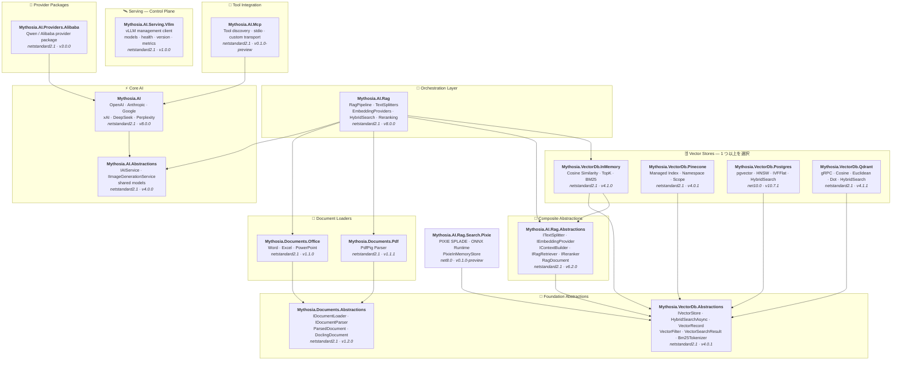

<div align="center">

🌐 [English](../../README.md) · [한국어](../ko/README.md) · [日本語](README.md) · [Français](../fr/README.md) · [Deutsch](../de/README.md) · [Русский](../ru/README.md) · [Українська](../uk/README.md) · [简体中文](../zh-Hans/README.md) · [繁體中文](../zh-Hant/README.md) · [Tiếng Việt](../vi/README.md) · [ภาษาไทย](../th/README.md) · [Português](../pt/README.md) · [Español](../es/README.md)

<br>

[](https://github.com/AJ-comp/Mythosia.AI)


### インテリジェントなアプリケーション構築のためのモジュラー .NET AI ライブラリ

**プロバイダーの切り替え、RAG の追加、ドキュメントの読み込み — 統一された API ですべてに対応。**

<br>

[](https://www.nuget.org/packages/Mythosia.AI)
[](https://www.nuget.org/packages/Mythosia.AI)
[](https://aj-comp.github.io/Mythosia.AI/)
[](https://dotnet.microsoft.com)

<br>

**[📖 はじめに](https://aj-comp.github.io/Mythosia.AI/)** &nbsp;·&nbsp; **[API リファレンス](https://aj-comp.github.io/Mythosia.AI/api/)** &nbsp;·&nbsp; **[GitHub ↗](https://github.com/AJ-comp/Mythosia.AI)**

<br>

</div>

TXT・Markdownには文書構造に合わせた[規則ベースのスプリッター](text-splitters.md)を選択してください。サイズ検証、重複、Unicode境界を処理し、Markdownの見出し・コード・表の行を保持します。文字・単語数はモデルのトークン上限ではありません。 表セルの条件とコードのインデントの意味を保ち、Markdown の文脈反復が過大になる場合は明示的な例外で停止します。

成功したはずのインデックスでチャンクが上書きされたり別のベクトルと結び付いたりしないよう、[インデックス検証](rag-pipeline.md#indexing-validation)は保存前に不正な ID と埋め込みバッチを拒否します。カスタム分割器は一意の ID と文書メタデータの継承を提供してください。

安定した[ファイル ID](document-loaders.md#file-source-identity)、[質問ベクトル検証](rag-embedding.md#query-embedding-validation)、[文書単位の保存と URL キャンセル](rag-pipeline.md#custom-persistence)で、重複登録、不正な検索、古いチャンクの残存を防ぎます。

ローカルのニューラル疎検索を既存検索と比較するには、任意の `Mythosia.AI.Rag.Search.Pixie` プレビューを使用します。既存の密埋め込みプロバイダーを維持し、PIXIE索引をメモリに保存します。永続ストアの移行や既定検索の自動置換は行いません。 [PIXIEの接続と比較ガイド（英語）](../rag-pixie-search.md).

リクエストの設定を分け、処理を中止し、回答と使用量・出典をまとめて受け取れます。[v8移行ガイド](v8-migration.md)に6つの構造変更、移行例、検証範囲をまとめました。

> このドキュメントの対象バージョン: [Mythosia.AI 8.0.0](../../src/core/Mythosia.AI/RELEASE_NOTES.md#v800), [Abstractions 4.0.0](../../src/core/Mythosia.AI.Abstractions/RELEASE_NOTES.md#v400), [Alibaba 3.0.0](../../src/core/Mythosia.AI.Providers.Alibaba/RELEASE_NOTES.md#v300), [RAG 8.0.0](../../src/rag/Mythosia.AI.Rag/RELEASE_NOTES.md#v800), [MCP 0.1.0-preview](../../src/integrations/Mythosia.AI.Mcp/RELEASE_NOTES.md#v010-preview), [Serving.Vllm 1.0.0](../../src/serving/Mythosia.AI.Serving.Vllm/RELEASE_NOTES.md#v100).

---

### どのパッケージをインストールすればよいですか？

```
dotnet add package Mythosia.AI                    # まずはここから（これだけで始められます）
dotnet add package Mythosia.AI.Rag                # 任意: RAG が必要な場合
dotnet add package Mythosia.VectorDb.Postgres     # 任意: 本番用ベクトルストアが必要な場合
```

| ステップ | パッケージ | 用途 |
| :--: | --- | --- |
| **1** | **`Mythosia.AI`** | **ここから開始** — 補完、ストリーミング、関数呼び出し、構造化出力 (OpenAI / Claude / Gemini / Grok / DeepSeek / Perplexity) |
| **2** | **`Mythosia.AI.Rag`** | RAG が必要な場合 — テキスト分割、エンベディング、ハイブリッド検索、リランキング、InMemory ベクトルストア、ドキュメントローダー (Word / Excel / PowerPoint / PDF) |
| **3** | **`Mythosia.VectorDb.Postgres`** / **`Qdrant`** / **`Pinecone`** | InMemory の代わりに本番用ベクトルストアが必要な場合 — いずれか一つを選択 |

他のリクエストの設定を変えずに準備するには`CreateRequest(...).WithTemperature(...).GetCompletionAsync()`を使います。Before/After、Run、プロファイル、共有会話の制約は[リクエスト設定ガイド](request-building.md)を参照してください。

待ち時間が重要なリクエストでは[処理速度](request-building.md#inference-speed)を選べます。`WithSpeed` はモデルと推論レベルを保持し、`Processing` は実際に適用されたモードを示します。Fast は対応する組み合わせで使う有料設定です。

## アーキテクチャ

<a href="../assets/architecture.svg">
  <picture>
    <source media="(prefers-color-scheme: dark)" srcset="../assets/architecture-dark.svg">
    
  </picture>
</a>

<details>
<summary>パッケージ依存関係の詳細</summary>



</details>

## デモ / テストベッド (Chat UI)

このリポジトリには Mythosia.AI で構築されたサンプル Chat UI が含まれています。Mythosia.AI.Samples.ChatUi を起動して、ライブラリの動作を実際に確認できます。

### サンプルの実行

**`Mythosia.AI.Samples.ChatUi`** をローカルで実行してみましょう：

```bash
# リポジトリのルートから
dotnet run --project apps/Mythosia.AI.Samples.ChatUi
```

https://github.com/user-attachments/assets/62094afe-9add-4c14-b818-6b31f200dc01


## クイックスタート

### 基本的な AI 補完

```csharp
using Mythosia.AI;

var service = new OpenAIService(apiKey, httpClient);
var response = await service.GetCompletionAsync("Hello!");
```

### ストリーミング

```csharp
await foreach (var token in service.StreamAsync("Tell me a story"))
{
    Console.Write(token);
}
```

### 推論（Reasoning）ストリーミング

OpenAI、Claude、Gemini、Grok、DeepSeek Flash は同じストリーミング形式で提供元の推論を返します。サービスまたはリクエストで推論を有効にし、`StreamOptions.WithReasoning()` で観察します：

```csharp
await foreach (var content in service.StreamAsync(message, new StreamOptions().WithReasoning()))
{
    if (content.Type == StreamingContentType.Reasoning)
        Console.Write($"[Think] {content.Content}");
    else if (content.Type == StreamingContentType.Text)
        Console.Write(content.Content);
}
```

### 関数呼び出し

```csharp
var service = new OpenAIService(apiKey, httpClient)
    .WithFunction(
        "get_weather",
        "Gets the current weather for a location",
        ("location", "The city and country", required: true),
        (string location) => $"The weather in {location} is sunny, 22C"
    );

var response = await service.GetCompletionAsync("What's the weather in Seoul?");
```

天気の取得に時間がかかるときでも、その結果に依存しない一般的な旅行の持ち物は先に説明できます。モデルによる非同期ツール呼び出しは、このように待ち時間に独立した作業を進めるために使います。結果に依存する判断は、結果が届いてから行う必要があります。

`FunctionDefinition.AllowAsync = true` または `FunctionBuilder.WithAsync()` で、GPT-6 Astra / Sol / Luna の Responses API による非同期ツール呼び出しを選択的に許可できます。既定値は `false` で、未対応のモデルでは同じハンドラーの結果を待ちます。例とリクエストの有効期間は[関数呼び出しガイド](function-calling.md)を参照してください。

最新情報や文書を根拠に回答したい場合は、[推論レベルと検索の使い分け](reasoning-and-search.md)を参照してください。共通設定から Web 検索や既存の文書ストアを利用し、回答の出典も取得できます。

### 構造化出力（基本）

```csharp
// LLM の応答を C# POCO に直接デシリアライズ + 自動リカバリ
var result = await service.GetCompletionAsync<WeatherResponse>(
    "What's the weather in Seoul?");
```

### 構造化出力（リスト）

```csharp
// コレクション型もラッパー DTO 不要でそのまま動作
var items = await service.GetCompletionAsync<List<ItemDto>>(
    "Extract all entities from this document...");
```

### 構造化出力（ストリーミング）

```csharp
// リアルタイムでテキストをストリーミング + 最終デシリアライズオブジェクトを取得
var run = service.BeginStream(prompt).As<MyDto>();

await foreach (var chunk in run.Stream())
    Console.Write(chunk);          // リアルタイム UI

MyDto dto = await run.Result;      // パース＆自動リカバリ済み
```

### 会話要約ポリシー

```csharp
// 会話が長くなったら古いメッセージを自動的に要約
service.ConversationPolicy = SummaryConversationPolicy.ByMessage(
    triggerCount: 20,
    keepRecentCount: 5
);

// トークンベースのトリガー
service.ConversationPolicy = SummaryConversationPolicy.ByToken(
    triggerTokens: 3000,
    keepRecentTokens: 1000
);

// 通常通り使用するだけ — 要約は自動的に行われます
await service.GetCompletionAsync("Continue our conversation...");

// ストリーミングの場合は StreamAsync() 前に要約ポリシーを明示的に適用
await service.ApplySummaryPolicyIfNeededAsync();
await foreach (var chunk in service.StreamAsync("Continue..."))
    Console.Write(chunk.Content);

// セッション間で要約を保存・復元
string saved = service.ConversationPolicy.CurrentSummary;
policy.LoadSummary(saved);
```

### RAG（検索拡張生成）

質問の埋め込みを一律に強制せず、キーワード・意味・ハイブリッド検索を選べます。[検索ガイド](rag-hybrid-search.md)。

```bash
dotnet add package Mythosia.AI.Rag
```

```csharp
using Mythosia.AI.Rag;

var service = new AnthropicService(apiKey, httpClient)
    .WithRag(rag => rag
        .AddDocument("manual.txt")
        .AddDocument("policy.txt")
    );

var response = await service.GetCompletionAsync("What is the refund policy?");
```

## 対応プロバイダー

> Grok 4.7 は未リリースの追加機能です。[モデル選択・推論・処理速度](providers.md#grok-47)を参照してください。

> GPT-6 Sol/Luna は未リリースの追加機能です。[モデルの選択と必要バージョン](providers.md#gpt-6-sol-luna)を参照してください。

> Claude Opus 5.5 には対応する未リリースのコア・抽象化ビルドが必要です。[設定と移行](providers.md#claude-opus-55)を参照してください。

| プロバイダー | パッケージ | モデル |
| --- | --- | --- |
| **OpenAI** | `Mythosia.AI` | GPT-6 Astra / Sol / Luna, GPT-5.6 Sol / Terra / Luna, GPT-5.5 / 5.5 Pro / 5.4 / 5.4 Mini / 5.4 Nano / 5.4 Pro / 5.3 Codex / 5.2 / 5.2 Pro / 5.1, GPT-4.1 / 4.1 Mini, GPT-4o / 4o Mini |
| **Anthropic** | `Mythosia.AI` | Claude Fable 5.1 / 5, Mythos 5.1 / 5 (limited), [Opus 5.5](providers.md#claude-opus-55) / 5 / 4.8 / 4.7 / 4.6 / 4.5, Sonnet 5 / 4.6 / 4.5, Haiku 4.5 |
| **Google** | `Mythosia.AI` | Gemini 3.8 Flash, Gemini 3.7 Flash, Gemini 3.6 Flash, Gemini 3.5 Flash/Flash-Lite, Gemini 3.1 Pro Preview/Flash-Lite, Gemini 3 Flash Preview, Gemini 2.5 Pro/Flash/Flash-Lite, Gemini 3.1 Flash Image, Gemini 3.1 Flash-Lite Image, Gemini 3 Pro Image |
| **xAI** | `Mythosia.AI` | Grok 4.7, Grok 4.6, Grok 4.5 (既定), Grok 4.3, Grok 4.20 (reasoning / non-reasoning), Grok Build |
| **DeepSeek** | `Mythosia.AI` | Flash (V4.1 Flash), V4 Pro |
| **Perplexity** | `Mythosia.AI` | Agent API プリセットと `perplexity/sonar` |
| **Alibaba / Qwen** | `Mythosia.AI.Providers.Alibaba` | Qwen Max / Plus / Turbo / Qwen3 / Qwen3.5 variants |

最新情報に基づく回答と、読者が確認できる出典が必要なときに Perplexity を使います。`PerplexityService` は Agent API を呼び出し、独立した検索と埋め込みは、自分で選んだ回答モデルに検索の仕組みを組み合わせるために使います。 [Perplexity Agent API、検索と埋め込み](perplexity.md).

長い文書のレビューやツールを繰り返し呼び出す処理には、Gemini 3.7 Flash または 3.8 Flash を選択できます。既存の Google アダプターで `Mythosia.AI` 8.0.0 / `Mythosia.AI.Abstractions` 4.0.0 から利用でき、サービスの既定モデルは Gemini 3.6 Flash のままです。

素早い下書きの後に詳しい検証を行う場合は、Grok 4.6 を明示的に選び、`Low` から `XHigh` の推論レベルを指定できます。`Mythosia.AI` 8.0.0 / `Mythosia.AI.Abstractions` 4.0.0 から利用でき、`XAIService` の既定モデルは Grok 4.5 のままです。[Grok の設定](providers.md#xai-xaiservice)を参照してください。

画像案の作成や参照画像の合成には、`IImageGenerationService`から[Grok Imagine Image 2.0](providers.md#grok-imagine-image-20)を使用します。`OutputFormat = ImageOutputFormat.Auto`を保ち、拡張子は`MediaType`から選びます。xAIは出力コーデックを指定できません。[画像オプションの移行](providers.md#image-options-migration)を参照してください。チャットモデルは変わりません。

素早いビジュアル案には Flare、精密な修正には Sunburst を選びます。[GPT Image 2.5 の生成・編集](providers.md#gpt-image-25)は既存の画像 API でリクエストごとにモデルを明示して使い、OpenAI の既定値は GPT Image 2 のままです。

画像の生成・編集で有効なサイズを選ぶには、[Google モデル別の画像オプション](providers.md#google-image-options)を確認してください。Flash は 512/1K/2K/4K、Flash-Lite は現在 1K、Pro は 1K/2K/4K に対応します。比率は Flash/Lite が 14 種類、Pro が標準 10 種類で、すべて `Auto` を受け付けます。未対応のサイズや比率を明示すると、HTTP 送信前に拒否されます。

グラフ・スクリーンショットの分析、ローカルツール、素早い回答後の詳しい検証には [DeepSeek Flash](providers.md#deepseek-deepseekservice) (`AIModels.DeepSeek.Flash`, V4.1 Flash) を使えます。推論は既定で無効です。`WithDeepSeekReasoning(...)` またはリクエストごとの `WithReasoning(...)` で有効にします。

テキスト処理には `AIModels.DeepSeek.V4Pro` (`deepseek-v4-pro`, V4-Pro-0813) を選択できます。既定の Flash は画像にも対応し、両モデルで Low/High/Max 推論と同じ出力上限を使えます。既存の補完・ストリーミング・Run・ローカル関数 API で Responses を使う場合は、リクエスト作成前に `UseResponsesApi = true` を設定します。既存アプリの Chat Completions を維持するため既定値は `false` で、設定は後続のツールラウンドまで固定されます。Responses は保存済み応答 ID に依存せず、会話と元の推論履歴をすべて再送します。

同じ画像について繰り返し質問するには、アップロードした画像を `DeepSeekImageFileContent` で参照します。Flash の Chat Completions と Responses で再利用でき、テキスト専用の V4 Pro は画像を拒否します。V4 Pro・Responses・Files の追加機能には対応する未リリースのコア・抽象化ビルドが必要で、公開済みの 8.0.0 / 4.0.0 には含まれません。[画像のアップロード・再利用・制限](providers.md#deepseek-deepseekservice)を参照してください。

## パッケージ一覧

### コア

| パッケージ | NuGet | 説明 |
| --- | --- | --- |
| [Mythosia.AI](../../src/core/Mythosia.AI/README.md) | [](https://www.nuget.org/packages/Mythosia.AI) | コアライブラリ — 組み込みプロバイダー、ストリーミング、関数呼び出し、マルチモーダル対応 |
| [Mythosia.AI.Abstractions](../../src/core/Mythosia.AI.Abstractions/README.md) | [](https://www.nuget.org/packages/Mythosia.AI.Abstractions) | `IAIService` インターフェースと共有モデル — ライブラリ向け軽量コントラクトパッケージ |
| [Mythosia.AI.Providers.Alibaba](../../src/core/Mythosia.AI.Providers.Alibaba/README.md) | [](https://www.nuget.org/packages/Mythosia.AI.Providers.Alibaba) | `Mythosia.AI` 上に構築された Alibaba / Qwen プロバイダーパッケージ |

### RAG

| パッケージ | NuGet | 説明 |
| --- | --- | --- |
| [Mythosia.AI.Rag](../../src/rag/Mythosia.AI.Rag/README.md) | [](https://www.nuget.org/packages/Mythosia.AI.Rag) | `.WithRag()` API による IAIService 用 Fluent RAG 拡張 |
| [Mythosia.AI.Rag.Abstractions](../../src/rag/Mythosia.AI.Rag.Abstractions/README.md) | [](https://www.nuget.org/packages/Mythosia.AI.Rag.Abstractions) | RAG パイプラインコンポーネントのインターフェースとモデル |

### ドキュメントローダー

| パッケージ | NuGet | 説明 |
| --- | --- | --- |
| [Mythosia.Documents.Abstractions](../../src/loaders/Mythosia.Documents.Abstractions/README.md) | [](https://www.nuget.org/packages/Mythosia.Documents.Abstractions) | ドキュメントローダーのインターフェースとモデル (`IDocumentLoader`, `DoclingDocument`) |
| [Mythosia.Documents.Office](../../src/loaders/Mythosia.Documents.Office/README.md) | [](https://www.nuget.org/packages/Mythosia.Documents.Office) | Word / Excel / PowerPoint 用 OpenXml パーサー |
| [Mythosia.Documents.Pdf](../../src/loaders/Mythosia.Documents.Pdf/README.md) | [](https://www.nuget.org/packages/Mythosia.Documents.Pdf) | PdfPig ベースの PDF パーサー |

### ベクトルストア

> **1 つ以上を選択** — すべて Abstractions パッケージの `IVectorStore` を実装しています。

| パッケージ | NuGet | 説明 |
| --- | --- | --- |
| [Mythosia.VectorDb.Abstractions](../../src/vectordb/Mythosia.VectorDb.Abstractions/README.md) | [](https://www.nuget.org/packages/Mythosia.VectorDb.Abstractions) | `IVectorStore` · `VectorRecord` · `VectorFilter` コントラクト |
| [Mythosia.VectorDb.InMemory](../../src/vectordb/Mythosia.VectorDb.InMemory/README.md) | [](https://www.nuget.org/packages/Mythosia.VectorDb.InMemory) | インメモリストア — インフラ不要、プロトタイピングに最適 |
| [Mythosia.VectorDb.Pinecone](../../src/vectordb/Mythosia.VectorDb.Pinecone/README.md) | [](https://www.nuget.org/packages/Mythosia.VectorDb.Pinecone) | Pinecone HTTP API — マネージドベクトル DB のインデックス/ネームスペース/スコープ分離 |
| [Mythosia.VectorDb.Postgres](../../src/vectordb/Mythosia.VectorDb.Postgres/README.md) | [](https://www.nuget.org/packages/Mythosia.VectorDb.Postgres) | PostgreSQL + pgvector — HNSW / IVFFlat インデックス、本番環境対応 |
| [Mythosia.VectorDb.Qdrant](../../src/vectordb/Mythosia.VectorDb.Qdrant/README.md) | [](https://www.nuget.org/packages/Mythosia.VectorDb.Qdrant) | Qdrant gRPC クライアント — Cosine / Euclidean / Dot、自動プロビジョニング |

### サービング — コントロールプレーン

> モデルサービングランタイム向けの管理／イントロスペクションクライアント。チャットは引き続きプロバイダーパッケージが担当します: `Providers.*` = チャットのデータプレーン、`Serving.*` = サーバーのコントロールプレーン。

| パッケージ | NuGet | 説明 |
| --- | --- | --- |
| [Mythosia.AI.Serving.Vllm](../../src/serving/Mythosia.AI.Serving.Vllm/README.md) | [](https://www.nuget.org/packages/Mythosia.AI.Serving.Vllm) | vLLM コントロールプレーンクライアント — モデルカード（`root` で実際にロードされているモデルを取得）、ヘルスチェック、サーバーバージョン、Prometheus メトリクス |

## リポジトリ構成

```text
src/
  core/
    Mythosia.AI/                        # コア AI サービスライブラリ
    Mythosia.AI.Abstractions/           # IAIService インターフェースと共有モデル
    Mythosia.AI.Providers.Alibaba/      # Alibaba / Qwen プロバイダーパッケージ
  loaders/
    Mythosia.Documents.Abstractions/    # ドキュメントローダーコントラクト (IDocumentLoader, DoclingDocument)
    Mythosia.Documents.Office/          # Office ドキュメントローダー (Word/Excel/PowerPoint)
    Mythosia.Documents.Pdf/             # PDF ドキュメントローダー
  rag/
    Mythosia.AI.Rag/                    # RAG Fluent API とパイプライン
    Mythosia.AI.Rag.Abstractions/       # RAG インターフェースとモデル (RagDocument)
  serving/
    Mythosia.AI.Serving.Vllm/           # vLLM コントロールプレーンクライアント (モデル/ヘルス/バージョン/メトリクス)
  vectordb/
    Mythosia.VectorDb.Abstractions/     # ベクトルストアコントラクト
    Mythosia.VectorDb.InMemory/         # インメモリベクトルストア
    Mythosia.VectorDb.Pinecone/         # Pinecone ベクトルストア
    Mythosia.VectorDb.Postgres/         # PostgreSQL + pgvector ストア
    Mythosia.VectorDb.Qdrant/           # Qdrant ベクトルストア
apps/                                   # サンプルアプリケーション
tests/                                  # ユニット/統合テストプロジェクト
```

## インストール

```bash
dotnet add package Mythosia.AI
```

ストリームで高度な LINQ 操作を使用する場合：

```bash
dotnet add package System.Linq.Async
```

## ドキュメント

- [基本使用ガイド](getting-started.md)
- [Mythosia.AI README](../../src/core/Mythosia.AI/README.md)  関数呼び出し、ストリーミング、モデル設定を含む完全な API リファレンス
- [Mythosia.AI.Rag README](../../src/rag/Mythosia.AI.Rag/README.md)  RAG パイプラインの使い方とカスタム実装
- [ローダーガイド](document-loaders.md)
- [リリースノート](../../src/core/Mythosia.AI/RELEASE_NOTES.md)

## ライセンス

このプロジェクトは [MIT ライセンス](https://github.com/AJ-comp/Mythosia.AI/blob/main/LICENSE) のもとで公開されています。

## 元プロジェクト

このプロジェクトはもともと [Mythosia](https://github.com/AJ-comp/Mythosia) の一部でした。

[共通の対応定義でモデルの機能選択を構成する](model-capabilities.md).
