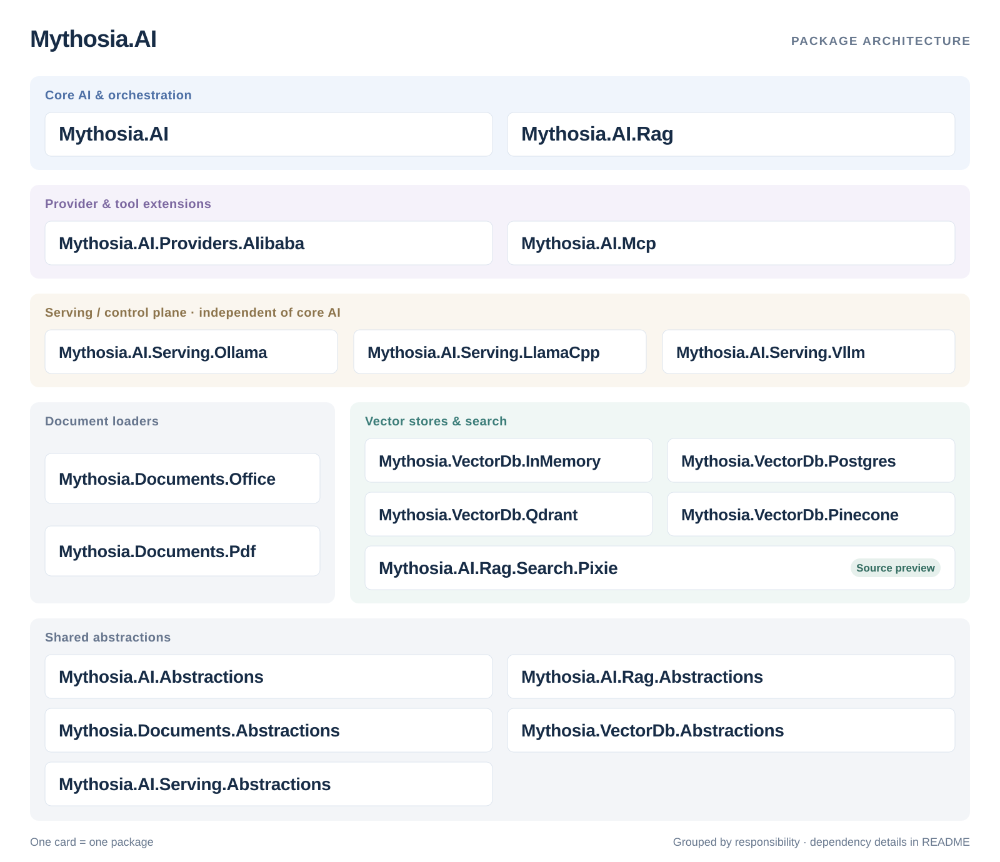
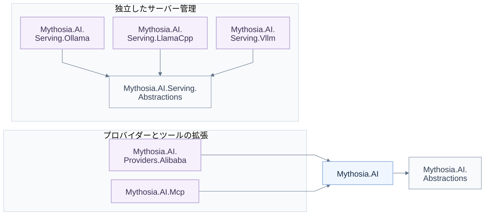
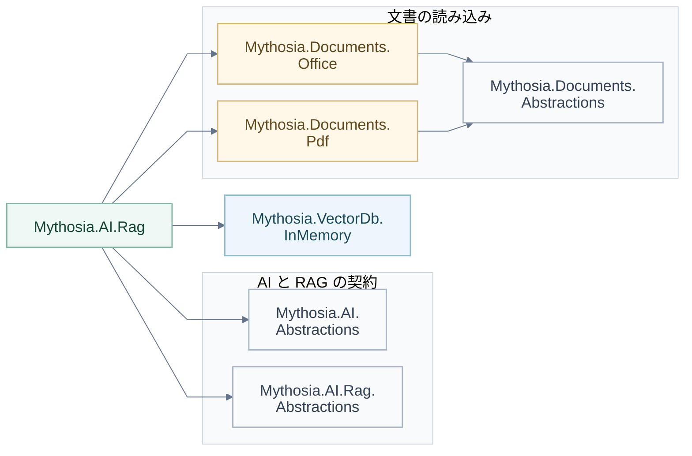
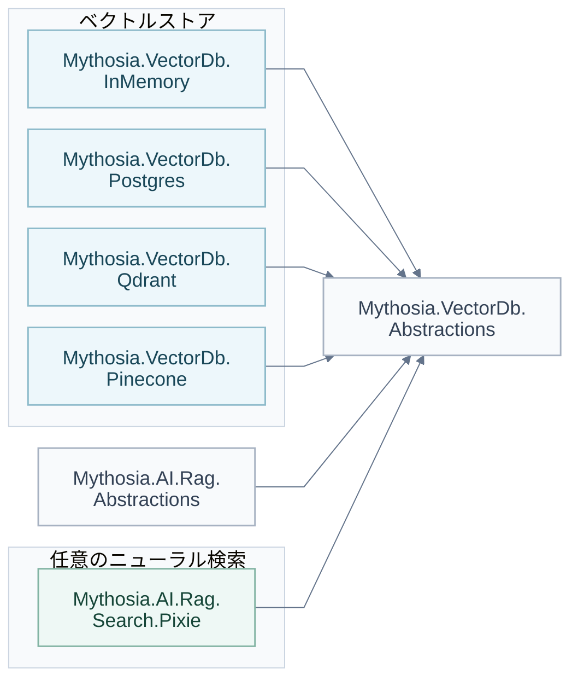

<div align="center">

🌐 [English](../../README.md) · [한국어](../ko/README.md) · [日本語](README.md) · [Français](../fr/README.md) · [Deutsch](../de/README.md) · [Русский](../ru/README.md) · [Українська](../uk/README.md) · [简体中文](../zh-Hans/README.md) · [繁體中文](../zh-Hant/README.md) · [Tiếng Việt](../vi/README.md) · [ภาษาไทย](../th/README.md) · [Português](../pt/README.md) · [Español](../es/README.md)

<br>

[](https://github.com/AJ-comp/Mythosia.AI)


### インテリジェントなアプリケーション構築のためのモジュラー .NET AI ライブラリ

**プロバイダーの切り替え、RAG の追加、ドキュメントの読み込み — 統一された API ですべてに対応。**

<br>

[](https://www.nuget.org/packages/Mythosia.AI)
[](https://www.nuget.org/packages/Mythosia.AI)
[](https://aj-comp.github.io/Mythosia.AI/)
[](https://dotnet.microsoft.com)

<br>

**[📖 はじめに](https://aj-comp.github.io/Mythosia.AI/)** &nbsp;·&nbsp; **[API リファレンス](https://aj-comp.github.io/Mythosia.AI/api/)** &nbsp;·&nbsp; **[GitHub ↗](https://github.com/AJ-comp/Mythosia.AI)**

<br>

</div>

## デモ / テストベッド (Chat UI)

組み込みコードを書く前に、Playground でモデルと文書検索を試せます。

現在の Playground の実画面を録画した動画で、モデルの検索、言語の切り替え、文書と RAG パイプラインの設定を紹介しています。動画には英語字幕が含まれています。

https://github.com/user-attachments/assets/4cf90210-b000-41be-8317-a467e93e7504

### サンプルの実行

**`Mythosia.AI.Samples.ChatUi`** をローカルで実行してみましょう：

```bash
# リポジトリのルートから
dotnet run --project apps/Mythosia.AI.Samples.ChatUi
```

<details>
<summary>Playground の操作と言語</summary>

左側でモデル名やプロバイダーによる検索とリクエスト設定を行い、中央で会話しながら右側の Inspector で処理情報を確認して、アプリへの組み込み前に試せます。Stop で応答の待機を中止でき、速度を選べるのは対応するモデルと接続先のみで、Fast には追加料金がかかる場合があります。狭い画面では Models と Inspector が引き出し式パネルになり、ローカル起動・文書登録・パイプライン設定の詳細は [Chat UI ガイド](https://github.com/AJ-comp/Mythosia.AI/blob/main/apps/Mythosia.AI.Samples.ChatUi/README.md)で確認できます。

パイプラインでは Voyage Context 4、Gemini Embedding 2、Perplexity の文脈埋め込みのキー・次元・タイムアウトを設定できます。文書画面でチャンク数とベクトル数を確認し、索引作成をキャンセルできます。設定の復元、DB 再接続、コード例にも選択内容が反映されます。モデルや次元を変更したら索引を再作成してください。

ヘッダーの言語選択で、入力内容や設定を保ったまま13言語に切り替えられます。モデル一覧には7つのプロバイダーが折りたたまれた状態で表示され、展開するかモデル名で検索できます。

</details>

## Mythosia.AI を選ぶ理由

- チャット、ストリーミング、ツール呼び出し、構造化された応答で、**一つの API から AI プロバイダーを切り替え**られます。
- ローダー、埋め込み、検索、リランキングを組み合わせ、**自分の文書に基づく回答を構築**できます。
- **リクエスト設定を独立して保持**し、共通の Run API で進行中の処理を制御できます。
- コアライブラリから任意の RAG・ベクトルストア連携まで、**必要なパッケージを選択**できます。

## どのパッケージをインストールすればよいですか？

```
dotnet add package Mythosia.AI                    # まずはここから（これだけで始められます）
dotnet add package Mythosia.AI.Rag                # 任意: RAG が必要な場合
dotnet add package Mythosia.VectorDb.Postgres     # 任意: 本番用ベクトルストアが必要な場合
```

| ステップ | パッケージ | 用途 |
| :--: | --- | --- |
| **1** | **`Mythosia.AI`** | **ここから開始** — 補完、ストリーミング、関数呼び出し、構造化出力 (OpenAI / Claude / Gemini / Grok / DeepSeek / Perplexity) |
| **2** | **`Mythosia.AI.Rag`** | RAG が必要な場合 — テキスト分割、エンベディング、ハイブリッド検索、リランキング、InMemory ベクトルストア、ドキュメントローダー (Word / Excel / PowerPoint / PDF) |
| **3** | **`Mythosia.VectorDb.Postgres`** / **`Qdrant`** / **`Pinecone`** | InMemory の代わりに本番用ベクトルストアが必要な場合 — いずれか一つを選択 |

他のリクエストを変更せずに設定を準備できます。`CreateRequest(...).WithTemperature(...).GetCompletionAsync()` は、独立して再利用できるリクエストビルダーを使用します。変更前後の例、Run、プロファイル、共有会話の制約は[リクエスト設定ガイド](request-building.md)を参照してください。

完了、ストリーミング、構造化出力、Run は実際のプロファイルを一度適用し、最終設定を検証してから自動要約、履歴変更、通信を実行します。補助リクエストは親の会話と出力スキーマを分離し、プロバイダー固有の検証を維持します。[リクエスト設定ガイド](request-building.md)を参照してください。

アプリケーションからの呼び出しと、コンテキストやツールのコールバック内からの通常の呼び出しは、プロファイルやメッセージを再利用しても独立します。フレームワークが呼び出した仮想プロバイダーアダプターでは、対応する基底メソッドへの最初の呼び出しが、入力を置き換えた場合も準備済みリクエストを継続します。転送前に同じ基底メソッドで無関係な補助処理を行う場合は `BeginIndependentRequestScope()` を使います。[プロバイダーアダプターの規則](request-building.md#provider-request-adapters)を参照してください。組み込み入力のコピーにより、後の呼び出しが受理済み履歴を書き換えることを防ぎます。

アダプターのプロファイル変更は自動要約前に検証し、コールバック式ストリーミングは内部処理の後始末を待ちます。Claude の圧縮は入力置換に保持されたツール依存関係と Mythos 5.1 の thinking を保護し、OpenAI のステートレス補助要求は親の履歴保護を維持します。

待ち時間が重要なリクエストでは[処理速度](request-building.md#inference-speed)を選べます。`WithSpeed` はモデルと推論レベルを保持し、`Processing` は実際に適用されたモードを示します。Fast は対応する組み合わせで使う有料設定です。

## クイックスタート

### 基本的な AI 補完

```csharp
using Mythosia.AI.Services.OpenAI;

var service = new OpenAIService(apiKey, httpClient);
var response = await service.GetCompletionAsync("Hello!");
```

### ストリーミング

```csharp
await using var run = await service.StartRunAsync(
    "Tell me a story",
    onText: text => Console.Write(text));
string answer = (await run.Result).Text;
```

### 推論（Reasoning）ストリーミング

OpenAI、Claude、Gemini、Grok、DeepSeek Flash は同じストリーミング形式で提供元の推論を返します。サービスまたはリクエストで推論を有効にし、`StreamOptions.WithReasoning()` で観察します：

```csharp
await using var run = await service.StartRunAsync(
    message, options: new StreamOptions().WithReasoning());
await foreach (var content in run.StreamAsync())
{
    if (content.Type == StreamingContentType.Reasoning)
        Console.Write($"[Think] {content.Content}");
    else if (content.Type == StreamingContentType.Text)
        Console.Write(content.Content);
}
```

### 関数呼び出し

```csharp
using Mythosia.AI.Extensions;
using Mythosia.AI.Services.OpenAI;

var service = new OpenAIService(apiKey, httpClient)
    .WithFunction(
        "get_weather",
        "Gets the current weather for a location",
        ("location", "The city and country", required: true),
        (string location) => $"The weather in {location} is sunny, 22C"
    );

var response = await service.GetCompletionAsync("What's the weather in Seoul?");
```

一つのモデル応答で返された呼び出しは、既定では順番に実行されます。登録した関数が互いに独立している場合は、同時実行数を制限した並列ハンドラー実行を選択できます：

```csharp
using Mythosia.AI.Models.Functions;

service.DefaultPolicy = new FunctionCallingPolicy
{
    ExecutionMode = FunctionExecutionMode.Parallel,
    MaxConcurrency = 3
};
```

通常のバッチ結果は、プロバイダーの元の呼び出し順でモデルに返されます。キャンセルすると未開始の呼び出しをスキップし、対応するキャンセル結果を用意します。開始済みのツールには対応していればトークンを渡し、完了を待つことで呼び出しと結果の履歴の対応を保ちます。`FunctionCallingPolicy.TimeoutSeconds` は応答ヘッダーと SSE 本文を含むストリーミングのラウンドループ全体に適用され、ツールのラウンド間でリセットされません。ポリシーの期限切れは `AIServiceException`、呼び出し元によるキャンセルはそのトークンに関連付けられた `OperationCanceledException` になります。 本文をバッファリングするカスタム `HttpContent` には、SSE 本文ストリーム取得時の例外があります。[キャンセルの制限](streaming.md#sse-acquisition-cancellation-limitation)を参照してください。

時間のかかる検索中にも、天気予報が届く前に一般的な旅行の持ち物を説明するなど、モデルは独立した作業を進められます。`FunctionDefinition.AllowAsync = true` または `FunctionBuilder.WithAsync()` を設定すると、対応モデルはその関数の実行中も処理を続けられます。既定値は `false` です。GPT-6.1 Sol / GPT-6 Astra / Sol / Luna は Responses API でこのオプションを使用します。未対応モデルは未対応の API オプションを送信せず、同じハンドラーの結果を待ちます。これは C# の `async` ハンドラーや並列ハンドラーのスケジューリングとは別の機能です。例とリクエストの有効期間中の動作は[非同期ツール呼び出し](function-calling.md#async-tool-calling)を参照してください。

### 画像の生成と編集

OpenAI、Google、xAI が共通で提供する任意の機能を通じて、テキストから画像の下書きを作成したり既存の画像を修正したりできます。画像モデルは、選択中のチャットモデルとは独立しています：

```csharp
using Mythosia.AI.Models.Images;
using Mythosia.AI.Services;
using Mythosia.AI.Services.OpenAI;

IImageGenerationService images = new OpenAIService(apiKey, httpClient);
var generated = await images.GenerateImagesAsync(new ImageGenerationRequest
{
    Prompt = "A glass pavilion at sunrise",
    Size = ImageSize.Pixels(1024, 1024),
    OutputFormat = ImageOutputFormat.Png
});

await File.WriteAllBytesAsync("pavilion.png", generated.Images[0].Data);
```

生成と編集は[プロバイダーガイド](providers.md#image-generation)、主要な API 変更は[型付き画像オプションと移行](providers.md#image-options-migration)を参照してください。xAI は `ImageOutputFormat.Auto` を使用し、出力の拡張子は `GeneratedImage.MediaType` に合わせて選択します。

Google の画像プリセットはモデルごとに異なります。Flash は 512/1K/2K/4K、Flash-Lite は現在 1K、Pro は 1K/2K/4K に対応します。Flash/Lite は14種類、Pro は標準の10種類の縦横比を提供し、すべて `Auto` を受け付けます。選択肢を表示する前に `GetImageCapabilities(model)` を確認してください。未対応のサイズや縦横比を明示すると、生成・編集とも HTTP 送信前に失敗します。[モデル別の対応表と Flash-Lite のドキュメントの不一致](providers.md#google-image-options)を参照してください。

### 構造化出力（基本）

```csharp
// LLM の応答を C# POCO に直接デシリアライズ + 自動リカバリ
var result = await service.GetCompletionAsync<WeatherResponse>(
    "What's the weather in Seoul?");
```

### 構造化出力（リスト）

```csharp
// コレクション型もラッパー DTO 不要でそのまま動作
var items = await service.GetCompletionAsync<List<ItemDto>>(
    "Extract all entities from this document...");
```

### 構造化出力（ストリーミング）

```csharp
// リアルタイムでテキストをストリーミング + 最終デシリアライズオブジェクトを取得
var run = service.BeginStream(prompt).As<MyDto>();

await foreach (var chunk in run.Stream())
    Console.Write(chunk);          // リアルタイム UI

MyDto dto = await run.Result;      // パース＆自動リカバリ済み
```

### 会話要約ポリシー

```csharp
// 会話が長くなったら古いメッセージを自動的に要約
service.ConversationPolicy = SummaryConversationPolicy.ByMessage(
    triggerCount: 20,
    keepRecentCount: 5
);

// トークンベースのトリガー
service.ConversationPolicy = SummaryConversationPolicy.ByToken(
    triggerTokens: 3000,
    keepRecentTokens: 1000
);

// 通常通り使用するだけ — 要約は自動的に行われます
await service.GetCompletionAsync("Continue our conversation...");

// ストリーミングの場合は StreamAsync() 前に要約ポリシーを明示的に適用
await service.ApplySummaryPolicyIfNeededAsync();
await foreach (var chunk in service.StreamAsync("Continue..."))
    Console.Write(chunk.Content);

// セッション間で要約を保存・復元
string saved = service.ConversationPolicy.CurrentSummary;
policy.LoadSummary(saved);
```

### RAG（検索拡張生成）

すべての検索で質問の埋め込みを強制せず、キーワード・意味・ハイブリッド検索を選べます。`UseKeywordSearch()` は質問の埋め込みを省略し、`UseRetriever(...)` は外部インデックスを接続し、`UseHybridSearch(HybridSearchOptions)` は明示的な重みと候補設定を渡します。文書の取り込みでは引き続きベクトルを作成します。[検索モードとストアの対応状況](rag-hybrid-search.md)を参照してください。

```bash
dotnet add package Mythosia.AI.Rag
```

```csharp
using Mythosia.AI.Rag;
using Mythosia.AI.Services.Anthropic;

var service = new AnthropicService(apiKey, httpClient)
    .WithRag(rag => rag
        .AddDocument("manual.txt")
        .AddDocument("policy.txt")
    );

var response = await service.GetCompletionAsync("What is the refund policy?");
```

エージェントに検索を制御させるには、`WithAgenticRag(...)` でストアを登録し、`service.WithMaxRounds(10).StartRunAsync(...)` で処理を開始します。同じタスクの `run.Result` を待つか、`run.StreamAsync()` を観察できます。完全な例は [Mythosia.AI.Rag README](../../src/rag/Mythosia.AI.Rag/README.md) を参照してください。

#### 文書の文脈と検索クエリの役割を保つ

チャンクの理解には隣接する段落が必要な場合があり、検索クエリと索引文書では役割が異なります。RAG 8.2.0 は TXT・Markdown・PDF から抽出したテキストに Voyage の文脈埋め込みと Gemini Embedding 2 を提供します。

```csharp
using Mythosia.AI.Rag;

var store = await RagStore.BuildAsync(rag => rag
    .UseVoyageEmbedding(voyageApiKey, httpClient)
    .AddDocument("policy.pdf"));
var result = await store.QueryAsync("What is the refund period?");
```

[設定とプロバイダーの契約](rag-embedding.md#retrieval-aware-embeddings): `UseVoyageEmbedding(...)`, `UseGeminiEmbedding(...)`, `IRetrievalEmbeddingProvider` / `EmbeddingDocument` (RAG 8.2.0, RAG Abstractions 6.4.0).

## 対応プロバイダー

> Grok 4.7: Mythosia.AI 8.1.0 / Abstractions 4.1.0 が必要です。 [モデル選択・推論・処理速度](providers.md#grok-47)

> GPT-6.1 Sol: Mythosia.AI 8.2.0 / Abstractions 4.2.0 が必要です。[モデル選択と移行](providers.md#gpt-61-sol)

> GPT-6 Sol/Luna: Mythosia.AI 8.1.0 / Abstractions 4.1.0 が必要です。 [モデルの選択と必要バージョン](providers.md#gpt-6-sol-luna)

> Claude Sonnet 5.5: Mythosia.AI 8.2.0 / Abstractions 4.2.0 が必要です。[設定と移行](providers.md#claude-sonnet-55)

> Claude Opus 5.5: Mythosia.AI 8.1.0 / Abstractions 4.1.0 が必要です。 [設定と移行](providers.md#claude-opus-55)

| プロバイダー | パッケージ | モデル |
| --- | --- | --- |
| **OpenAI** | `Mythosia.AI` | GPT-6.1 Sol / GPT-6 Astra / Sol / Luna, GPT-5.6 Sol / Terra / Luna, GPT-5.5 / 5.5 Pro / 5.4 / 5.4 Mini / 5.4 Nano / 5.4 Pro / 5.3 Codex / 5.2 / 5.2 Pro / 5.1, GPT-4.1 / 4.1 Mini, GPT-4o / 4o Mini |
| **Anthropic** | `Mythosia.AI` | Claude Fable 5.1 / 5, Mythos 5.1 / 5 (限定提供), [Opus 5.5](providers.md#claude-opus-55) / 5 / 4.8 / 4.7 / 4.6 / 4.5, [Sonnet 5.5](providers.md#claude-sonnet-55) / 5 / 4.6 / 4.5, Haiku 4.5 |
| **Google** | `Mythosia.AI` | Gemini 3.8 Flash, Gemini 3.7 Flash, Gemini 3.6 Flash, Gemini 3.5 Flash/Flash-Lite, Gemini 3.1 Pro Preview/Flash-Lite, Gemini 3 Flash Preview, Gemini 2.5 Pro/Flash/Flash-Lite, Gemini 3.1 Flash Image, Gemini 3.1 Flash-Lite Image, Gemini 3 Pro Image |
| **xAI** | `Mythosia.AI` | Grok 4.7, Grok 4.6, Grok 4.5 (既定), Grok 4.3, Grok 4.20 (推論 / 非推論), Grok Build |
| **DeepSeek** | `Mythosia.AI` | Flash (V4.1 Flash), V4 Pro |
| **Perplexity** | `Mythosia.AI` | Agent API プリセットと `perplexity/sonar` |
| **Alibaba / Qwen** | `Mythosia.AI.Providers.Alibaba` | Qwen Max / Plus / Turbo / Qwen3 / Qwen3.5 シリーズ |

最新情報に基づく回答と、読者が確認できる出典が必要なときに Perplexity を使います。`PerplexityService` は Agent API を呼び出し、独立した検索と埋め込みは、自分で選んだ回答モデルに検索の仕組みを組み合わせるために使います。 [Perplexity Agent API、検索と埋め込み](perplexity.md).

長い文書のレビューやツールを繰り返し呼び出す処理には、Gemini 3.7 Flash または 3.8 Flash を選択できます。既存の Google アダプターで `Mythosia.AI` 8.0.0 / `Mythosia.AI.Abstractions` 4.0.0 から利用でき、サービスの既定モデルは Gemini 3.6 Flash のままです。

素早い下書きの後に詳しい検証を行う場合は、Grok 4.6 を明示的に選び、`Low` から `XHigh` の推論レベルを指定できます。`Mythosia.AI` 8.0.0 / `Mythosia.AI.Abstractions` 4.0.0 から利用でき、`XAIService` の既定モデルは Grok 4.5 のままです。[Grok の設定](providers.md#xai-xaiservice)を参照してください。

画像案の作成や参照画像の合成には、`IImageGenerationService`から[Grok Imagine Image 2.0](providers.md#grok-imagine-image-20)を使用します。`OutputFormat = ImageOutputFormat.Auto`を保ち、拡張子は`MediaType`から選びます。xAIは出力コーデックを指定できません。[画像オプションの移行](providers.md#image-options-migration)を参照してください。チャットモデルは変わりません。

素早いビジュアル案には Flare、精密な修正には Sunburst を選びます。[GPT Image 2.5 の生成・編集](providers.md#gpt-image-25)は既存の画像 API でリクエストごとにモデルを明示して使い、OpenAI の既定値は GPT Image 2 のままです。

グラフ・スクリーンショットの分析、ローカルツール、素早い回答後の詳しい検証には [DeepSeek Flash](providers.md#deepseek-deepseekservice) (`AIModels.DeepSeek.Flash`, V4.1 Flash) を使えます。推論は既定で無効です。`WithDeepSeekReasoning(...)` またはリクエストごとの `WithReasoning(...)` で有効にします。

テキスト処理には `AIModels.DeepSeek.V4Pro` (`deepseek-v4-pro`, V4-Pro-0813) を選択できます。既定の Flash は画像にも対応し、両モデルで Low/High/Max 推論と同じ出力上限を使えます。既存の補完・ストリーミング・Run・ローカル関数 API で Responses を使う場合は、リクエスト作成前に `UseResponsesApi = true` を設定します。既存アプリの Chat Completions を維持するため既定値は `false` で、設定は後続のツールラウンドまで固定されます。Responses は保存済み応答 ID に依存せず、会話と元の推論履歴をすべて再送します。

同じ画像について繰り返し質問するには、アップロードした画像を `DeepSeekImageFileContent` で参照します。 Flash の Chat Completions と Responses で再利用でき、テキスト専用の V4 Pro は画像を拒否します。 [画像のアップロード・再利用・制限](providers.md#deepseek-deepseekservice)を参照してください。 Mythosia.AI 8.1.0 / Abstractions 4.1.0 が必要です。

> Claude Fable 5 と Claude Mythos 5 は30日間のデータ保持が必要で、ゼロデータ保持の取り決めの対象外です。適応型推論は常に有効です。呼び出し元が推論の無効化を求めた場合、Mythosia は低い推論強度を使用し、要約された推論を省略します。Mythos 5 は承認された Project Glasswing の顧客に限定されます。

## ガイドと移行

TXT・Markdownには文書構造に合わせた[規則ベースのスプリッター](text-splitters.md)を選択してください。サイズ検証、重複、Unicode境界を処理し、Markdownの見出し・コード・表の行を保持します。文字・単語数はモデルのトークン上限ではありません。 表セルの条件とコードのインデントの意味を保ち、Markdown の文脈反復が過大になる場合は明示的な例外で停止します。

成功したはずのインデックスでチャンクが上書きされたり別のベクトルと結び付いたりしないよう、[インデックス検証](rag-pipeline.md#indexing-validation)は保存前に不正な ID と埋め込みバッチを拒否します。カスタム分割器は一意の ID と文書メタデータの継承を提供してください。

安定した[ファイル ID](document-loaders.md#file-source-identity)、[質問ベクトル検証](rag-embedding.md#query-embedding-validation)、[文書単位の保存と URL キャンセル](rag-pipeline.md#custom-persistence)で、重複登録、不正な検索、古いチャンクの残存を防ぎます。

ローカルのニューラル疎検索を既存検索と比較するには、任意の `Mythosia.AI.Rag.Search.Pixie` プレビューを使用します。既存の密埋め込みプロバイダーを維持し、PIXIE索引をメモリに保存します。永続ストアの移行や既定検索の自動置換は行いません。 [PIXIEの接続と比較ガイド（英語）](../rag-pixie-search.md).

[検索評価基盤](https://github.com/AJ-comp/Mythosia.AI/blob/main/tests/Mythosia.AI.Rag.Evaluation/README.md)は、再利用可能なデータセット、検索アダプター、実行レポートの保存、回帰検査をサポートします。新しい検索手法や独自の文書コレクションにも同じ評価器を拡張して利用できます。

リクエストの設定を分け、処理を中止し、回答と使用量・出典をまとめて受け取れます。[v8移行ガイド](v8-migration.md)に6つの構造変更、移行例、検証範囲をまとめました。

> このドキュメントの対象バージョン: [Mythosia.AI 8.2.0](../../src/core/Mythosia.AI/RELEASE_NOTES.md#v820), [Abstractions 4.2.0](../../src/core/Mythosia.AI.Abstractions/RELEASE_NOTES.md#v420), [Alibaba 3.0.2](../../src/core/Mythosia.AI.Providers.Alibaba/RELEASE_NOTES.md#v302), [RAG 8.3.0](../../src/rag/Mythosia.AI.Rag/RELEASE_NOTES.md#v830), [RAG Abstractions 6.5.0](../../src/rag/Mythosia.AI.Rag.Abstractions/RELEASE_NOTES.md#v650), [VectorDb Abstractions 4.2.0](../../src/vectordb/Mythosia.VectorDb.Abstractions/RELEASE_NOTES.md#v420), [InMemory 4.3.0](../../src/vectordb/Mythosia.VectorDb.InMemory/RELEASE_NOTES.md#v430), [PostgreSQL 10.8.1](../../src/vectordb/Mythosia.VectorDb.Postgres/RELEASE_NOTES.md#v1081), [MCP 0.1.1-preview](../../src/integrations/Mythosia.AI.Mcp/RELEASE_NOTES.md#v011-preview), [Serving.Abstractions 1.0.0](../../src/serving/Mythosia.AI.Serving.Abstractions/RELEASE_NOTES.md#v100), [Serving.Ollama 1.0.0](../../src/serving/Mythosia.AI.Serving.Ollama/RELEASE_NOTES.md#v100), [Serving.LlamaCpp 1.0.0](../../src/serving/Mythosia.AI.Serving.LlamaCpp/RELEASE_NOTES.md#v100), [Serving.Vllm 1.1.0](../../src/serving/Mythosia.AI.Serving.Vllm/RELEASE_NOTES.md#v110). その他の検索・文書・ベクトルパッケージのバージョンは、[以前のパッチ一覧](https://github.com/AJ-comp/Mythosia.AI/blob/main/RELEASE_NOTES.md#v811)と[以前の統合リリース](https://github.com/AJ-comp/Mythosia.AI/blob/main/RELEASE_NOTES.md#v810)を参照してください。

> **公開待ちリリースの既知の制限:** Sonnet 5.5 / Opus 5.5 は、未実行の `server_tool_use` で終わる `pause_turn` の継続リクエストを拒否する場合があります。[Claude の継続制限](providers.md#claude-native-continuation-limitation)を参照してください。本文をバッファリングするカスタム `HttpContent` では、成功した SSE 応答の本文ストリーム取得中にキャンセルやポリシーのタイムアウト処理が遅れ、Run が実行中のままになる場合があります。[SSE のキャンセル制限](streaming.md#sse-acquisition-cancellation-limitation)を参照してください。
>
> この文書は公開待ちの変更を説明するもので、リリース検証の完了を示すものではありません。変更内容、残る制限、検証範囲は[リリースノート](https://github.com/AJ-comp/Mythosia.AI/blob/main/RELEASE_NOTES.md)を参照してください。

> [RAG 8.1.1 / PostgreSQL 10.8.1 パッチ](https://github.com/AJ-comp/Mythosia.AI/blob/main/RELEASE_NOTES.md#v811): 既存の RAG ラッパーに実行中の書き換え器の変更を反映し、PostgreSQL の混合ハイブリッド検索にもベクトル検索設定を適用します。このパッチではコアの `Mythosia.AI` は 8.1.0 のままでした。

---

## アーキテクチャ

<a href="../assets/architecture.svg">
  <picture>
    <source media="(prefers-color-scheme: dark)" srcset="../assets/architecture-dark.svg">
    
  </picture>
</a>

### パッケージ依存関係の詳細

矢印は直接のパッケージ参照です。共通パッケージは複数の図に現れ、Serving クライアントは管理契約を共有しつつコア AI から独立しています。

#### コアAIと拡張


```mermaid
%%{init: {"theme":"base","look":"classic","htmlLabels":false,"themeVariables":{"fontFamily":"Arial, sans-serif","fontSize":"18px","primaryTextColor":"#172c46","lineColor":"#64748b","clusterBkg":"#f8fafc","clusterBorder":"#cbd5e1"},"flowchart":{"htmlLabels":false,"curve":"linear","nodeSpacing":20,"rankSpacing":36,"padding":16,"wrappingWidth":300},"fontFamily":"Arial, sans-serif","fontSize":18}}%%
flowchart LR
    subgraph Extensions["プロバイダーとツールの拡張"]
        Alibaba["Mythosia.AI.<br/>Providers.Alibaba"]:::extension
        Mcp["Mythosia.AI.Mcp"]:::extension
    end
    AI["Mythosia.AI"]:::core
    AIAbs["Mythosia.AI.<br/>Abstractions"]:::contract
    subgraph Independent["独立したサーバー管理"]
        ServingAbs["Mythosia.AI.Serving.<br/>Abstractions"]:::contract
        OllamaServing["Mythosia.AI.<br/>Serving.Ollama"]:::extension
        LlamaCppServing["Mythosia.AI.<br/>Serving.LlamaCpp"]:::extension
        VllmServing["Mythosia.AI.<br/>Serving.Vllm"]:::extension
        OllamaServing --> ServingAbs
        LlamaCppServing --> ServingAbs
        VllmServing --> ServingAbs
    end
    Alibaba --> AI
    Mcp --> AI
    AI --> AIAbs
    classDef core fill:#eff6ff,stroke:#93b4de,color:#172c46,stroke-width:1.5px
    classDef rag fill:#eef8f5,stroke:#83b4a4,color:#164638,stroke-width:1.5px
    classDef extension fill:#f5f0fc,stroke:#b9a4d4,color:#403054,stroke-width:1.5px
    classDef documents fill:#fff8e9,stroke:#d4b879,color:#61491d,stroke-width:1.5px
    classDef store fill:#edf7fb,stroke:#8dbaca,color:#194758,stroke-width:1.5px
    classDef contract fill:#f8fafc,stroke:#a7b2c2,color:#334155,stroke-width:1.5px
```

#### RAGと文書読み込み


```mermaid
%%{init: {"theme":"base","look":"classic","htmlLabels":false,"themeVariables":{"fontFamily":"Arial, sans-serif","fontSize":"18px","primaryTextColor":"#172c46","lineColor":"#64748b","clusterBkg":"#f8fafc","clusterBorder":"#cbd5e1"},"flowchart":{"htmlLabels":false,"curve":"linear","nodeSpacing":20,"rankSpacing":36,"padding":16,"wrappingWidth":300},"fontFamily":"Arial, sans-serif","fontSize":18}}%%
flowchart LR
    Rag["Mythosia.AI.Rag"]:::rag
    subgraph Contracts["AI と RAG の契約"]
        AIAbs["Mythosia.AI.<br/>Abstractions"]:::contract
        RagAbs["Mythosia.AI.Rag.<br/>Abstractions"]:::contract
    end
    InMem["Mythosia.VectorDb.<br/>InMemory"]:::store
    subgraph Documents["文書の読み込み"]
        Office["Mythosia.Documents.<br/>Office"]:::documents
        Pdf["Mythosia.Documents.<br/>Pdf"]:::documents
        LoaderAbs["Mythosia.Documents.<br/>Abstractions"]:::contract
        Office --> LoaderAbs
        Pdf --> LoaderAbs
    end
    Rag --> AIAbs
    Rag --> RagAbs
    Rag --> InMem
    Rag --> Office
    Rag --> Pdf
    classDef core fill:#eff6ff,stroke:#93b4de,color:#172c46,stroke-width:1.5px
    classDef rag fill:#eef8f5,stroke:#83b4a4,color:#164638,stroke-width:1.5px
    classDef extension fill:#f5f0fc,stroke:#b9a4d4,color:#403054,stroke-width:1.5px
    classDef documents fill:#fff8e9,stroke:#d4b879,color:#61491d,stroke-width:1.5px
    classDef store fill:#edf7fb,stroke:#8dbaca,color:#194758,stroke-width:1.5px
    classDef contract fill:#f8fafc,stroke:#a7b2c2,color:#334155,stroke-width:1.5px
```

#### ベクトルストアと検索


```mermaid
%%{init: {"theme":"base","look":"classic","htmlLabels":false,"themeVariables":{"fontFamily":"Arial, sans-serif","fontSize":"18px","primaryTextColor":"#172c46","lineColor":"#64748b","clusterBkg":"#f8fafc","clusterBorder":"#cbd5e1"},"flowchart":{"htmlLabels":false,"curve":"linear","nodeSpacing":20,"rankSpacing":36,"padding":16,"wrappingWidth":300},"fontFamily":"Arial, sans-serif","fontSize":18}}%%
flowchart LR
    subgraph Stores["ベクトルストア"]
        InMem["Mythosia.VectorDb.<br/>InMemory"]:::store
        Pg["Mythosia.VectorDb.<br/>Postgres"]:::store
        Qd["Mythosia.VectorDb.<br/>Qdrant"]:::store
        Pine["Mythosia.VectorDb.<br/>Pinecone"]:::store
    end
    subgraph Search["任意のニューラル検索"]
        Pixie["Mythosia.AI.Rag.<br/>Search.Pixie"]:::rag
    end
    RagAbs["Mythosia.AI.Rag.<br/>Abstractions"]:::contract
    VdbAbs["Mythosia.VectorDb.<br/>Abstractions"]:::contract
    InMem --> VdbAbs
    RagAbs --> VdbAbs
    Pg --> VdbAbs
    Qd --> VdbAbs
    Pine --> VdbAbs
    Pixie --> VdbAbs
    classDef core fill:#eff6ff,stroke:#93b4de,color:#172c46,stroke-width:1.5px
    classDef rag fill:#eef8f5,stroke:#83b4a4,color:#164638,stroke-width:1.5px
    classDef extension fill:#f5f0fc,stroke:#b9a4d4,color:#403054,stroke-width:1.5px
    classDef documents fill:#fff8e9,stroke:#d4b879,color:#61491d,stroke-width:1.5px
    classDef store fill:#edf7fb,stroke:#8dbaca,color:#194758,stroke-width:1.5px
    classDef contract fill:#f8fafc,stroke:#a7b2c2,color:#334155,stroke-width:1.5px
```

## パッケージ一覧

### コア

| パッケージ | NuGet | 説明 |
| --- | --- | --- |
| [Mythosia.AI](../../src/core/Mythosia.AI/README.md) | [](https://www.nuget.org/packages/Mythosia.AI) | コアライブラリ — 組み込みプロバイダー、ストリーミング、関数呼び出し、マルチモーダル対応 |
| [Mythosia.AI.Abstractions](../../src/core/Mythosia.AI.Abstractions/README.md) | [](https://www.nuget.org/packages/Mythosia.AI.Abstractions) | `IAIService` インターフェースと共有モデル — ライブラリ向け軽量コントラクトパッケージ |
| [Mythosia.AI.Providers.Alibaba](../../src/core/Mythosia.AI.Providers.Alibaba/README.md) | [](https://www.nuget.org/packages/Mythosia.AI.Providers.Alibaba) | `Mythosia.AI` 上に構築された Alibaba / Qwen プロバイダーパッケージ |

### RAG

| パッケージ | NuGet | 説明 |
| --- | --- | --- |
| [Mythosia.AI.Rag](../../src/rag/Mythosia.AI.Rag/README.md) | [](https://www.nuget.org/packages/Mythosia.AI.Rag) | `.WithRag()` API による IAIService 用 Fluent RAG 拡張 |
| [Mythosia.AI.Rag.Abstractions](../../src/rag/Mythosia.AI.Rag.Abstractions/README.md) | [](https://www.nuget.org/packages/Mythosia.AI.Rag.Abstractions) | RAG パイプラインコンポーネントのインターフェースとモデル |

### ドキュメントローダー

| パッケージ | NuGet | 説明 |
| --- | --- | --- |
| [Mythosia.Documents.Abstractions](../../src/loaders/Mythosia.Documents.Abstractions/README.md) | [](https://www.nuget.org/packages/Mythosia.Documents.Abstractions) | ドキュメントローダーのインターフェースとモデル (`IDocumentLoader`, `DoclingDocument`) |
| [Mythosia.Documents.Office](../../src/loaders/Mythosia.Documents.Office/README.md) | [](https://www.nuget.org/packages/Mythosia.Documents.Office) | Word / Excel / PowerPoint 用 OpenXml パーサー |
| [Mythosia.Documents.Pdf](../../src/loaders/Mythosia.Documents.Pdf/README.md) | [](https://www.nuget.org/packages/Mythosia.Documents.Pdf) | PdfPig ベースの PDF パーサー |

### ベクトルストア

> **1 つ以上を選択** — すべて Abstractions パッケージの `IVectorStore` を実装しています。

| パッケージ | NuGet | 説明 |
| --- | --- | --- |
| [Mythosia.VectorDb.Abstractions](../../src/vectordb/Mythosia.VectorDb.Abstractions/README.md) | [](https://www.nuget.org/packages/Mythosia.VectorDb.Abstractions) | `IVectorStore` · `IVectorStoreDiagnostics` · `VectorRecord` · `VectorFilter` コントラクト |
| [Mythosia.VectorDb.InMemory](../../src/vectordb/Mythosia.VectorDb.InMemory/README.md) | [](https://www.nuget.org/packages/Mythosia.VectorDb.InMemory) | インメモリストア — インフラ不要、プロトタイピングに最適 |
| [Mythosia.VectorDb.Pinecone](../../src/vectordb/Mythosia.VectorDb.Pinecone/README.md) | [](https://www.nuget.org/packages/Mythosia.VectorDb.Pinecone) | Pinecone HTTP API — マネージドベクトル DB のインデックス/ネームスペース/スコープ分離 |
| [Mythosia.VectorDb.Postgres](../../src/vectordb/Mythosia.VectorDb.Postgres/README.md) | [](https://www.nuget.org/packages/Mythosia.VectorDb.Postgres) | PostgreSQL + pgvector — HNSW / IVFFlat インデックス、本番環境対応 |
| [Mythosia.VectorDb.Qdrant](../../src/vectordb/Mythosia.VectorDb.Qdrant/README.md) | [](https://www.nuget.org/packages/Mythosia.VectorDb.Qdrant) | Qdrant gRPC クライアント — Cosine / Euclidean / Dot、自動プロビジョニング |

任意のストア検査には `Mythosia.VectorDb.Abstractions` の `IVectorStoreDiagnostics` を使用します。InMemory 4.3.0 は RAG 抽象化に依存せず、`RagDiagnostics` と `RagDiagnosticSession` は RAG 8.3.0 に残ります。RAG と InMemory を同時に更新し、従来の `IRagDiagnosticsStore` キャストを移行してください。[診断と移行](vectordb-backends.md#vector-store-diagnostics)。

このリリースでは、マイナーバージョンの RAG 8.3.0 と InMemory 4.3.0 に、互換性を破るインターフェイス移行を意図的に含めています。このリリースに限るバージョン付けの例外として、メジャーバージョン番号が変わらなくても、`IRagDiagnosticsStore` を使用する既存の InMemory 呼び出し側は `IVectorStoreDiagnostics` への移行が必要です。

### サービング — コントロールプレーン

稼働中の Ollama、llama.cpp、vLLM に対して、共通の管理 API でモデル選択画面やサーバー状態画面を構築できます。`IModelServer` はヘルス、モデル、対応機能を取得し、確認のためにモデルをロードしたりダウンロードしたりしません。既存のサーバーに接続するクライアントであり、ランタイムのホスティングやチャット要求の送信は行いません。

任意の `IModelLifecycle`、`IModelDownloader`、`IModelMetricsProvider` は、利用可能な機能を明示的に実行するための契約です。接続先の機能を確認してください。`Unknown` は判断材料が不足している状態で、`Unsupported` とは異なります。`Supported` もすべてのモデルでの成功を保証しません。確認できないインストール状態やロード状態は不明のまま保持します。

Ollama **0.34.4**（`qwen2.5:0.5b`）、llama.cpp **b11146** の Router モードと単一モデルモード（Qwen2.5 0.5B、Q4_K_M）、vLLM **0.30.0**（小型 Qwen モデル）で実サーバー検証に合格しました。結果は検証した構成に限られます。検証対象の操作とランタイム別の制約は[サーバー管理ガイド](serving.md)を参照してください。

| パッケージ | NuGet | 説明 |
| --- | --- | --- |
| [Mythosia.AI.Serving.Abstractions](../../src/serving/Mythosia.AI.Serving.Abstractions/README.md) | [](https://www.nuget.org/packages/Mythosia.AI.Serving.Abstractions) | 共通管理契約と不変のサーバー・モデル・機能スナップショット。 |
| [Mythosia.AI.Serving.Ollama](../../src/serving/Mythosia.AI.Serving.Ollama/README.md) | [](https://www.nuget.org/packages/Mythosia.AI.Serving.Ollama) | Ollama のモデル一覧と正常性、明示的なプリロード・アンロードとストリーミング取得。 |
| [Mythosia.AI.Serving.LlamaCpp](../../src/serving/Mythosia.AI.Serving.LlamaCpp/README.md) | [](https://www.nuget.org/packages/Mythosia.AI.Serving.LlamaCpp) | llama.cpp の確認、ルーター確認付き管理・取得、自動ロードなしのメトリック。 |
| [Mythosia.AI.Serving.Vllm](../../src/serving/Mythosia.AI.Serving.Vllm/README.md) | [](https://www.nuget.org/packages/Mythosia.AI.Serving.Vllm) | vLLM のモデルカード、正常性、バージョン、ラベル付きメトリック。従来の具象 API を維持。 |

## リポジトリ構成

```text
src/
  core/
    Mythosia.AI/                        # コア AI サービスライブラリ
    Mythosia.AI.Abstractions/           # IAIService インターフェースと共有モデル
    Mythosia.AI.Providers.Alibaba/      # Alibaba / Qwen プロバイダーパッケージ
  loaders/
    Mythosia.Documents.Abstractions/    # ドキュメントローダーコントラクト (IDocumentLoader, DoclingDocument)
    Mythosia.Documents.Office/          # Office ドキュメントローダー (Word/Excel/PowerPoint)
    Mythosia.Documents.Pdf/             # PDF ドキュメントローダー
  rag/
    Mythosia.AI.Rag/                    # RAG Fluent API とパイプライン
    Mythosia.AI.Rag.Abstractions/       # RAG インターフェースとモデル (RagDocument)
  serving/
    Mythosia.AI.Serving.Abstractions/  # 共通モデルサーバー管理契約
    Mythosia.AI.Serving.Ollama/        # Ollama の管理と明示的なダウンロード
    Mythosia.AI.Serving.LlamaCpp/      # llama.cpp の単一モデル・ルーター管理
    Mythosia.AI.Serving.Vllm/          # vLLM の管理とメトリック
  vectordb/
    Mythosia.VectorDb.Abstractions/     # ベクトルストアコントラクト
    Mythosia.VectorDb.InMemory/         # インメモリベクトルストア
    Mythosia.VectorDb.Pinecone/         # Pinecone ベクトルストア
    Mythosia.VectorDb.Postgres/         # PostgreSQL + pgvector ストア
    Mythosia.VectorDb.Qdrant/           # Qdrant ベクトルストア
apps/                                   # サンプルアプリケーション
tests/                                  # ユニット/統合テストプロジェクト
```

## インストール

```bash
dotnet add package Mythosia.AI
```

ストリームで高度な LINQ 操作を使用する場合：

```bash
dotnet add package System.Linq.Async
```

## ドキュメント

素早い下書きの後に詳しい検討が必要な場合や、最新情報・登録文書を根拠に回答する場合は、[推論と出典付き検索](reasoning-and-search.md)を参照してください。

- **[📖 完全なドキュメントサイト](https://aj-comp.github.io/Mythosia.AI/)** — 全機能、RAG パイプライン、ベクトルストア、API リファレンスを網羅する DocFX 生成ドキュメント
- [基本使用ガイド](getting-started.md)
- [Mythosia.AI README](../../src/core/Mythosia.AI/README.md)  関数呼び出し、ストリーミング、モデル設定を含む完全な API リファレンス
- [Mythosia.AI.Rag README](../../src/rag/Mythosia.AI.Rag/README.md)  RAG パイプラインの使い方とカスタム実装
- [ローダーガイド](document-loaders.md)
- [リリースノート](../../src/core/Mythosia.AI/RELEASE_NOTES.md)

## 実際のプロバイダーで処理速度を検証する

リポジトリのルートから実行します：

```powershell
./build/test-inference-speed-live.ps1
```

この有料テストスイートは、既存のテスト用 Key Vault 設定と合成プロンプトを使用します。Anthropic Opus 5.5、OpenAI GPT-6 Astra、Gemini 3.8 Flash、Grok 4.6 について、ProviderDefault/Standard/Fast と補完/Run 経路を組み合わせた24ケースを検証します。アカウントのアクセスエラー、適用モードの報告欠落、サーバー側のモード引き下げは Fast の検証成功とみなさず、全ケースがスキップなしで合格する必要があります。レポートは `artifacts/test-results/inference-speed-live` に保存されます。`-NoBuild` は現在の Release テストをビルドした後にのみ使用してください。このコマンドは実行方法の説明であり、現在のアカウントで合格したことを示すものではありません。

## ライセンス

このプロジェクトは [MIT ライセンス](https://github.com/AJ-comp/Mythosia.AI/blob/main/LICENSE) のもとで公開されています。

## 元プロジェクト

このプロジェクトはもともと [Mythosia](https://github.com/AJ-comp/Mythosia) の一部でした。

[共通の対応定義でモデルの機能選択を構成する](model-capabilities.md).
