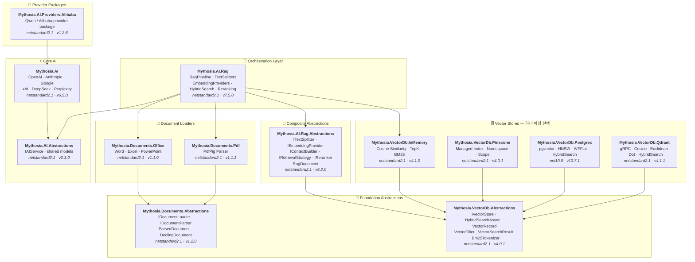

<div align="center">

🌐 [English](../../README.md) · [한국어](README.md) · [日本語](../ja/README.md) · [Français](../fr/README.md) · [Deutsch](../de/README.md) · [Русский](../ru/README.md) · [Українська](../uk/README.md) · [简体中文](../zh-Hans/README.md) · [繁體中文](../zh-Hant/README.md) · [Tiếng Việt](../vi/README.md) · [ภาษาไทย](../th/README.md) · [Português](../pt/README.md) · [Español](../es/README.md)

<br>

[](https://github.com/AJ-comp/Mythosia.AI)


### 지능형 애플리케이션을 위한 모듈형 .NET AI 라이브러리

**프로바이더 교체, RAG 적용, 문서 로딩 — 하나의 통합 API로 해결합니다.**

<br>

[](https://www.nuget.org/packages/Mythosia.AI)
[](https://www.nuget.org/packages/Mythosia.AI)
[](https://aj-comp.github.io/Mythosia.AI/)
[](https://dotnet.microsoft.com)

<br>

**[📖 시작하기](https://aj-comp.github.io/Mythosia.AI/)** &nbsp;·&nbsp; **[API 레퍼런스](https://aj-comp.github.io/Mythosia.AI/api/)** &nbsp;·&nbsp; **[GitHub ↗](https://github.com/AJ-comp/Mythosia.AI)**

<br>

</div>

---

### 어떤 패키지를 설치하면 되나요?

```
dotnet add package Mythosia.AI                    # 여기서 시작 (이것만 있으면 됩니다)
dotnet add package Mythosia.AI.Rag                # 선택: RAG가 필요할 때
dotnet add package Mythosia.VectorDb.Postgres     # 선택: 프로덕션 벡터 저장소가 필요할 때
```

| 단계 | 패키지 | 용도 |
| :--: | --- | --- |
| **1** | **`Mythosia.AI`** | **여기서 시작** — 완성(completion), 스트리밍, 함수 호출, 구조화된 출력 (OpenAI / Claude / Gemini / Grok / DeepSeek / Perplexity) |
| **2** | **`Mythosia.AI.Rag`** | RAG가 필요할 때 — 텍스트 분할, 임베딩, 하이브리드 검색, 리랭킹, InMemory 벡터 저장소, 문서 로더 (Word / Excel / PowerPoint / PDF) |
| **3** | **`Mythosia.VectorDb.Postgres`** / **`Qdrant`** / **`Pinecone`** | InMemory 대신 프로덕션 벡터 저장소가 필요할 때 — 하나 선택 |

## 아키텍처



## 데모 / 테스트 베드 (Chat UI)

이 저장소에는 Mythosia.AI 기반으로 만들어진 샘플 Chat UI가 포함되어 있습니다. Mythosia.AI.Samples.ChatUi를 실행하면 라이브러리를 직접 체험할 수 있습니다.

### 샘플 실행 방법

**`Mythosia.AI.Samples.ChatUi`**를 로컬에서 실행해 보세요:

```bash
# 저장소 루트에서
dotnet run --project samples/Mythosia.AI.Samples.ChatUi
```

https://github.com/user-attachments/assets/62094afe-9add-4c14-b818-6b31f200dc01


## 빠른 시작

### 기본 AI 완성

```csharp
using Mythosia.AI;

var service = new OpenAIService(apiKey, httpClient);
var response = await service.GetCompletionAsync("Hello!");
```

### 스트리밍

```csharp
await foreach (var token in service.StreamAsync("Tell me a story"))
{
    Console.Write(token);
}
```

### 추론(Reasoning) 스트리밍

추론을 지원하는 모든 프로바이더(OpenAI, Claude, Gemini, Grok, DeepSeek)가 동일한 스트리밍 패턴을 사용합니다:

```csharp
await foreach (var content in service.StreamAsync(message, new StreamOptions().WithReasoning()))
{
    if (content.Type == StreamingContentType.Reasoning)
        Console.Write($"[Think] {content.Content}");
    else if (content.Type == StreamingContentType.Text)
        Console.Write(content.Content);
}
```

### 함수 호출

```csharp
var service = new OpenAIService(apiKey, httpClient)
    .WithFunction(
        "get_weather",
        "Gets the current weather for a location",
        ("location", "The city and country", required: true),
        (string location) => $"The weather in {location} is sunny, 22C"
    );

var response = await service.GetCompletionAsync("What's the weather in Seoul?");
```

### 구조화된 출력 (기본)

```csharp
// LLM 응답을 C# POCO로 직접 역직렬화 + 자동 복구
var result = await service.GetCompletionAsync<WeatherResponse>(
    "What's the weather in Seoul?");
```

### 구조화된 출력 (리스트)

```csharp
// 컬렉션 타입도 래퍼 DTO 없이 바로 동작
var items = await service.GetCompletionAsync<List<ItemDto>>(
    "Extract all entities from this document...");
```

### 구조화된 출력 (스트리밍)

```csharp
// 실시간 텍스트 스트리밍 + 최종 역직렬화 객체 수신
var run = service.BeginStream(prompt).As<MyDto>();

await foreach (var chunk in run.Stream())
    Console.Write(chunk);          // 실시간 UI

MyDto dto = await run.Result;      // 파싱 및 자동 복구 완료
```

### 대화 요약 정책

```csharp
// 대화가 길어지면 이전 메시지를 자동 요약
service.ConversationPolicy = SummaryConversationPolicy.ByMessage(
    triggerCount: 20,
    keepRecentCount: 5
);

// 토큰 기반 트리거
service.ConversationPolicy = SummaryConversationPolicy.ByToken(
    triggerTokens: 3000,
    keepRecentTokens: 1000
);

// 평소대로 사용 — 요약은 자동으로 처리됩니다
await service.GetCompletionAsync("Continue our conversation...");

// 스트리밍의 경우 StreamAsync() 호출 전에 요약 정책을 명시적으로 적용
await service.ApplySummaryPolicyIfNeededAsync();
await foreach (var chunk in service.StreamAsync("Continue..."))
    Console.Write(chunk.Content);

// 세션 간 요약 저장/복원
string saved = service.ConversationPolicy.CurrentSummary;
policy.LoadSummary(saved);
```

### RAG (검색 증강 생성)

```bash
dotnet add package Mythosia.AI.Rag
```

```csharp
using Mythosia.AI.Rag;

var service = new AnthropicService(apiKey, httpClient)
    .WithRag(rag => rag
        .AddDocument("manual.txt")
        .AddDocument("policy.txt")
    );

var response = await service.GetCompletionAsync("What is the refund policy?");
```

## 지원 프로바이더

| 프로바이더 | 패키지 | 모델 |
| --- | --- | --- |
| **OpenAI** | `Mythosia.AI` | GPT-5.5 / 5.5 Pro / 5.4 / 5.4 Mini / 5.4 Nano / 5.4 Pro / 5.3 Codex / 5.2 / 5.2 Pro / 5.2 Codex / 5.1 / 5 / 5 Pro / 5 Mini / 5 Nano, GPT-4.1 / 4.1 Mini / 4.1 Nano, GPT-4o / 4o Mini, o3 / o3 Pro |
| **Anthropic** | `Mythosia.AI` | Claude Opus 4.8 / 4.7 / 4.6 / 4.5 / 4.1 / 4, Sonnet 4.6 / 4.5, Haiku 4.5 |
| **Google** | `Mythosia.AI` | Gemini 3.1 Pro Preview, Gemini 3.5 Flash, Gemini 3 Flash Preview, Gemini 3.1 Flash-Lite, Gemini 2.5 Pro/Flash/Flash-Lite |
| **xAI** | `Mythosia.AI` | Grok 4.3, Grok 4.20 (reasoning / non-reasoning), Grok Build 0.1, Grok 3 Mini |
| **DeepSeek** | `Mythosia.AI` | Chat, Reasoner |
| **Perplexity** | `Mythosia.AI` | Sonar, Sonar Pro, Sonar Reasoning Pro |
| **Alibaba / Qwen** | `Mythosia.AI.Providers.Alibaba` | Qwen Max / Plus / Turbo / Qwen3 / Qwen3.5 variants |

## 패키지 구성

### 코어

| 패키지 | NuGet | 설명 |
| --- | --- | --- |
| [Mythosia.AI](../../src/core/Mythosia.AI/) | [](https://www.nuget.org/packages/Mythosia.AI) | 핵심 라이브러리 — 빌트인 프로바이더, 스트리밍, 함수 호출, 멀티모달 지원 |
| [Mythosia.AI.Abstractions](../../src/core/Mythosia.AI.Abstractions/) | [](https://www.nuget.org/packages/Mythosia.AI.Abstractions) | `IAIService` 인터페이스 및 공유 모델 — 라이브러리용 경량 계약 패키지 |
| [Mythosia.AI.Providers.Alibaba](../../src/core/Mythosia.AI.Providers.Alibaba/) | [](https://www.nuget.org/packages/Mythosia.AI.Providers.Alibaba) | `Mythosia.AI` 기반 Alibaba / Qwen 프로바이더 패키지 |

### RAG

| 패키지 | NuGet | 설명 |
| --- | --- | --- |
| [Mythosia.AI.Rag](../../src/rag/Mythosia.AI.Rag/) | [](https://www.nuget.org/packages/Mythosia.AI.Rag) | `.WithRag()` API를 통한 IAIService용 Fluent RAG 확장 |
| [Mythosia.AI.Rag.Abstractions](../../src/rag/Mythosia.AI.Rag.Abstractions/) | [](https://www.nuget.org/packages/Mythosia.AI.Rag.Abstractions) | RAG 파이프라인 구성 요소의 인터페이스 및 모델 |

### 문서 로더

| 패키지 | NuGet | 설명 |
| --- | --- | --- |
| [Mythosia.Documents.Abstractions](../../src/loaders/Mythosia.Documents.Abstractions/) | [](https://www.nuget.org/packages/Mythosia.Documents.Abstractions) | 문서 로더 인터페이스 및 모델 (`IDocumentLoader`, `DoclingDocument`) |
| [Mythosia.Documents.Office](../../src/loaders/Mythosia.Documents.Office/) | [](https://www.nuget.org/packages/Mythosia.Documents.Office) | Word / Excel / PowerPoint용 OpenXml 파서 |
| [Mythosia.Documents.Pdf](../../src/loaders/Mythosia.Documents.Pdf/) | [](https://www.nuget.org/packages/Mythosia.Documents.Pdf) | PdfPig 기반 PDF 파서 |

### 벡터 저장소

> **하나 이상 선택** — 모두 Abstractions 패키지의 `IVectorStore`를 구현합니다.

| 패키지 | NuGet | 설명 |
| --- | --- | --- |
| [Mythosia.VectorDb.Abstractions](../../src/vectordb/Mythosia.VectorDb.Abstractions/) | [](https://www.nuget.org/packages/Mythosia.VectorDb.Abstractions) | `IVectorStore` · `VectorRecord` · `VectorFilter` 계약 |
| [Mythosia.VectorDb.InMemory](../../src/vectordb/Mythosia.VectorDb.InMemory/) | [](https://www.nuget.org/packages/Mythosia.VectorDb.InMemory) | 인메모리 저장소 — 인프라 없이 바로 사용, 프로토타이핑에 적합 |
| [Mythosia.VectorDb.Pinecone](../../src/vectordb/Mythosia.VectorDb.Pinecone/) | [](https://www.nuget.org/packages/Mythosia.VectorDb.Pinecone) | Pinecone HTTP API — 관리형 벡터 DB의 인덱스/네임스페이스/스코프 분리 |
| [Mythosia.VectorDb.Postgres](../../src/vectordb/Mythosia.VectorDb.Postgres/) | [](https://www.nuget.org/packages/Mythosia.VectorDb.Postgres) | PostgreSQL + pgvector — HNSW / IVFFlat 인덱스, 프로덕션 환경에 적합 |
| [Mythosia.VectorDb.Qdrant](../../src/vectordb/Mythosia.VectorDb.Qdrant/) | [](https://www.nuget.org/packages/Mythosia.VectorDb.Qdrant) | Qdrant gRPC 클라이언트 — Cosine / Euclidean / Dot, 자동 프로비저닝 |

## 저장소 구조

```text
src/
  core/
    Mythosia.AI/                        # 핵심 AI 서비스 라이브러리
    Mythosia.AI.Abstractions/           # IAIService 인터페이스 및 공유 모델
    Mythosia.AI.Providers.Alibaba/      # Alibaba / Qwen 프로바이더 패키지
  loaders/
    Mythosia.Documents.Abstractions/    # 문서 로더 계약 (IDocumentLoader, DoclingDocument)
    Mythosia.Documents.Office/          # Office 문서 로더 (Word/Excel/PowerPoint)
    Mythosia.Documents.Pdf/             # PDF 문서 로더
  rag/
    Mythosia.AI.Rag/                    # RAG Fluent API 및 파이프라인
    Mythosia.AI.Rag.Abstractions/       # RAG 인터페이스 및 모델 (RagDocument)
  vectordb/
    Mythosia.VectorDb.Abstractions/     # 벡터 저장소 계약
    Mythosia.VectorDb.InMemory/         # 인메모리 벡터 저장소
    Mythosia.VectorDb.Pinecone/         # Pinecone 벡터 저장소
    Mythosia.VectorDb.Postgres/         # PostgreSQL + pgvector 저장소
    Mythosia.VectorDb.Qdrant/           # Qdrant 벡터 저장소
samples/                                # 샘플 애플리케이션
tests/                                  # 유닛/통합 테스트 프로젝트
```

## 설치

```bash
dotnet add package Mythosia.AI
```

스트림에서 고급 LINQ 연산을 사용하려면:

```bash
dotnet add package System.Linq.Async
```

## 문서

- [기본 사용 가이드](https://github.com/AJ-comp/Mythosia.AI/wiki)
- [Mythosia.AI README](../../src/core/Mythosia.AI/README.md)  함수 호출, 스트리밍, 모델 설정 등 전체 API 레퍼런스
- [Mythosia.AI.Rag README](../../src/rag/Mythosia.AI.Rag/README.md)  RAG 파이프라인 사용법 및 커스텀 구현
- [로더 가이드](document-loaders.md)
- [릴리즈 노트](../../src/core/Mythosia.AI/RELEASE_NOTES.md)

## 라이선스

이 프로젝트는 [MIT 라이선스](../../LICENSE)로 배포됩니다.

## 원래 프로젝트

이 프로젝트는 원래 [Mythosia](https://github.com/AJ-comp/Mythosia)의 일부였습니다.
