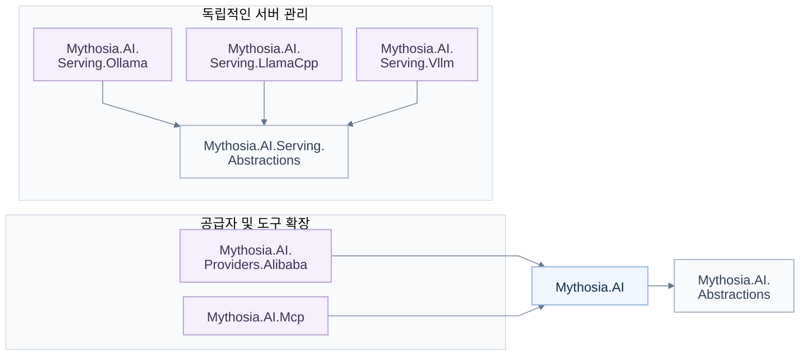
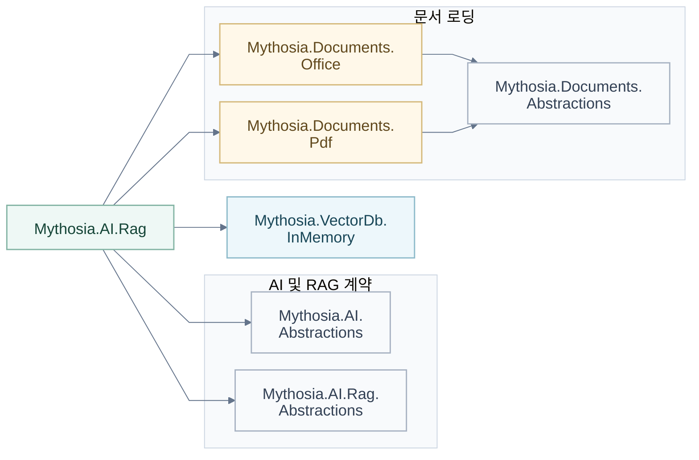
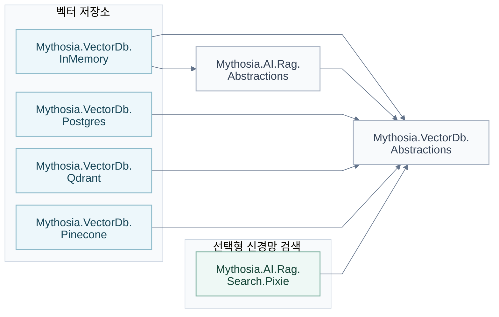

<div align="center">

🌐 [English](../../README.md) · [한국어](README.md) · [日本語](../ja/README.md) · [Français](../fr/README.md) · [Deutsch](../de/README.md) · [Русский](../ru/README.md) · [Українська](../uk/README.md) · [简体中文](../zh-Hans/README.md) · [繁體中文](../zh-Hant/README.md) · [Tiếng Việt](../vi/README.md) · [ภาษาไทย](../th/README.md) · [Português](../pt/README.md) · [Español](../es/README.md)

<br>

[](https://github.com/AJ-comp/Mythosia.AI)


### 지능형 애플리케이션을 위한 모듈형 .NET AI 라이브러리

**프로바이더 교체, RAG 적용, 문서 로딩 — 하나의 통합 API로 해결합니다.**

<br>

[](https://www.nuget.org/packages/Mythosia.AI)
[](https://www.nuget.org/packages/Mythosia.AI)
[](https://aj-comp.github.io/Mythosia.AI/)
[](https://dotnet.microsoft.com)

<br>

**[📖 시작하기](https://aj-comp.github.io/Mythosia.AI/)** &nbsp;·&nbsp; **[API 레퍼런스](https://aj-comp.github.io/Mythosia.AI/api/)** &nbsp;·&nbsp; **[GitHub ↗](https://github.com/AJ-comp/Mythosia.AI)**

<br>

</div>

## 데모 / 테스트 베드 (Chat UI)

통합 코드를 작성하기 전에 Playground에서 모델과 문서 검색을 시험해 보세요.

현재 Playground의 실제 화면을 녹화한 영상에서 모델 탐색, 언어 전환, 문서 및 RAG 파이프라인 설정을 살펴볼 수 있습니다. 영상에는 영어 자막이 포함되어 있습니다.

https://github.com/user-attachments/assets/4cf90210-b000-41be-8317-a467e93e7504

### 샘플 실행 방법

**`Mythosia.AI.Samples.ChatUi`**를 로컬에서 실행해 보세요:

```bash
# 저장소 루트에서
dotnet run --project apps/Mythosia.AI.Samples.ChatUi
```

<details>
<summary>Playground 조작과 언어</summary>

왼쪽에서 모델명·공급자로 모델을 찾고 요청을 설정한 뒤, 중앙에서 대화하고 오른쪽 Inspector에서 처리 정보를 확인하며 애플리케이션에 연결하기 전에 시험해 보세요. Stop으로 응답 대기를 중단할 수 있으며, 속도는 지원하는 모델·접속 방식에서만 선택할 수 있고 Fast는 추가 요금이 발생할 수 있습니다. 좁은 화면에서는 Models와 Inspector가 펼쳐지는 패널로 열리며, 로컬 실행·문서 등록·검색 파이프라인 설정은 [Chat UI 사용 안내](https://github.com/AJ-comp/Mythosia.AI/blob/main/apps/Mythosia.AI.Samples.ChatUi/README.md)를 참고하세요.

파이프라인에서 Voyage Context 4, Gemini Embedding 2, Perplexity 문맥 임베딩의 키·차원·시간 제한을 설정할 수 있습니다. 문서 화면에서 청크·벡터 수를 확인하고 색인을 취소하세요. 저장된 설정, DB 재연결과 코드 예제에도 선택한 구성이 반영됩니다. 임베딩 모델이나 차원을 바꾸면 다시 색인해야 합니다.

상단 언어 선택기로 입력 내용이나 설정을 유지하면서 13개 언어로 화면을 전환할 수 있습니다. 모델 목록은 7개 공급자를 모두 접힌 그룹으로 보여 주며, 원하는 공급자를 펼치거나 모델을 검색하면 됩니다.

</details>

## 왜 Mythosia.AI인가요?

- **하나의 API로 AI 공급자를 전환**하며 채팅, 스트리밍, 도구 호출과 구조화된 응답을 사용합니다.
- **내 문서를 근거로 답변을 구성**하도록 로더, 임베딩, 검색과 재순위화를 연결합니다.
- **요청별 설정을 독립적으로 유지**하고 공통 Run API로 진행 중인 작업을 제어합니다.
- 코어 라이브러리부터 선택형 RAG·벡터 저장소 연동까지 **필요한 패키지만 선택**합니다.

## 어떤 패키지를 설치하면 되나요?

```
dotnet add package Mythosia.AI                    # 여기서 시작 (이것만 있으면 됩니다)
dotnet add package Mythosia.AI.Rag                # 선택: RAG가 필요할 때
dotnet add package Mythosia.VectorDb.Postgres     # 선택: 프로덕션 벡터 저장소가 필요할 때
```

| 단계 | 패키지 | 용도 |
| :--: | --- | --- |
| **1** | **`Mythosia.AI`** | **여기서 시작** — 완성(completion), 스트리밍, 함수 호출, 구조화된 출력 (OpenAI / Claude / Gemini / Grok / DeepSeek / Perplexity) |
| **2** | **`Mythosia.AI.Rag`** | RAG가 필요할 때 — 텍스트 분할, 임베딩, 하이브리드 검색, 리랭킹, InMemory 벡터 저장소, 문서 로더 (Word / Excel / PowerPoint / PDF) |
| **3** | **`Mythosia.VectorDb.Postgres`** / **`Qdrant`** / **`Pinecone`** | InMemory 대신 프로덕션 벡터 저장소가 필요할 때 — 하나 선택 |

다른 요청에 영향을 주지 않고 설정을 준비하세요. `CreateRequest(...).WithTemperature(...).GetCompletionAsync()`는 독립적이며 재사용할 수 있는 요청 빌더를 사용합니다. 변경 전후 예제, Run, 프로필과 공유 대화의 제약은 [요청 설정 안내](request-building.md)를 참고하세요.

사용자가 기다리는 시간을 줄여야 하는 요청에는 [처리 속도](request-building.md#inference-speed)를 선택할 수 있습니다. `WithSpeed`는 모델과 추론 수준을 유지하고, `Processing`은 공급자가 실제 적용한 모드를 보여줍니다. Fast는 지원 조합에서 사용하는 유료 옵션입니다.

## 빠른 시작

### 기본 AI 완성

```csharp
using Mythosia.AI.Services.OpenAI;

var service = new OpenAIService(apiKey, httpClient);
var response = await service.GetCompletionAsync("Hello!");
```

### 스트리밍

```csharp
await using var run = await service.StartRunAsync(
    "Tell me a story",
    onText: text => Console.Write(text));
string answer = (await run.Result).Text;
```

### 추론(Reasoning) 스트리밍

OpenAI, Claude, Gemini, Grok, DeepSeek Flash는 같은 스트리밍 패턴으로 제공자 추론을 반환합니다. 서비스 또는 요청에서 추론을 켠 뒤 `StreamOptions.WithReasoning()`으로 관찰하세요:

```csharp
await using var run = await service.StartRunAsync(
    message, options: new StreamOptions().WithReasoning());
await foreach (var content in run.StreamAsync())
{
    if (content.Type == StreamingContentType.Reasoning)
        Console.Write($"[Think] {content.Content}");
    else if (content.Type == StreamingContentType.Text)
        Console.Write(content.Content);
}
```

### 함수 호출

```csharp
using Mythosia.AI.Extensions;
using Mythosia.AI.Services.OpenAI;

var service = new OpenAIService(apiKey, httpClient)
    .WithFunction(
        "get_weather",
        "Gets the current weather for a location",
        ("location", "The city and country", required: true),
        (string location) => $"The weather in {location} is sunny, 22C"
    );

var response = await service.GetCompletionAsync("What's the weather in Seoul?");
```

한 번의 모델 응답에 포함된 호출은 기본적으로 순차 실행됩니다. 등록한 함수들이 서로 독립적이라면 동시 실행 수를 제한하는 병렬 핸들러 실행을 선택할 수 있습니다:

```csharp
using Mythosia.AI.Models.Functions;

service.DefaultPolicy = new FunctionCallingPolicy
{
    ExecutionMode = FunctionExecutionMode.Parallel,
    MaxConcurrency = 3
};
```

일반 배치 결과는 공급자가 반환한 원래 호출 순서대로 모델에 전달됩니다. 취소하면 아직 시작하지 않은 호출을 건너뛰고 그에 맞는 취소 결과를 제공합니다. 시작한 도구에는 지원되는 경우 취소 토큰을 전달하고 완료를 기다려 호출과 결과 이력이 짝을 유지하도록 합니다. `FunctionCallingPolicy.TimeoutSeconds`는 응답 헤더와 SSE 본문을 포함한 전체 스트리밍 라운드 루프에 적용되며 도구 라운드 사이에 초기화되지 않습니다. 정책 제한 시간이 지나면 `AIServiceException`이 발생하고, 호출자 취소는 호출자의 토큰에 연결된 `OperationCanceledException`으로 유지됩니다.

느린 조회가 진행되는 동안에도 모델은 날씨 예보가 도착하기 전에 일반적인 여행 준비물을 설명하는 등 독립적인 작업을 할 수 있습니다. `FunctionDefinition.AllowAsync = true` 또는 `FunctionBuilder.WithAsync()`를 설정하면 지원 모델이 해당 함수 실행 중에도 계속 작업할 수 있습니다. 기본값은 `false`입니다. GPT-6 Astra / Sol / Luna는 Responses API에서 이 옵션을 사용합니다. 미지원 모델은 지원하지 않는 API 옵션을 전송하지 않고 같은 핸들러의 결과를 기다립니다. 이는 C# `async` 핸들러나 병렬 핸들러 스케줄링과 별개입니다. 예제와 요청 수명 동작은 [비동기 도구 호출](function-calling.md#async-tool-calling)을 참고하세요.

### 이미지 생성과 편집

OpenAI, Google, xAI가 공유하는 선택형 기능으로 텍스트에서 이미지 시안을 만들거나 기존 이미지를 수정할 수 있습니다. 이미지 모델은 선택한 채팅 모델과 독립적입니다:

```csharp
using Mythosia.AI.Models.Images;
using Mythosia.AI.Services;
using Mythosia.AI.Services.OpenAI;

IImageGenerationService images = new OpenAIService(apiKey, httpClient);
var generated = await images.GenerateImagesAsync(new ImageGenerationRequest
{
    Prompt = "A glass pavilion at sunrise",
    Size = ImageSize.Pixels(1024, 1024),
    OutputFormat = ImageOutputFormat.Png
});

await File.WriteAllBytesAsync("pavilion.png", generated.Images[0].Data);
```

생성과 편집 방법은 [공급자 안내](providers.md#image-generation)를, 주요 API 변경 사항은 [타입이 지정된 이미지 옵션과 마이그레이션](providers.md#image-options-migration)을 참고하세요. xAI는 `ImageOutputFormat.Auto`를 사용하며, 출력 확장자는 `GeneratedImage.MediaType`에 맞춰 선택합니다.

Google 이미지 프리셋은 모델마다 다릅니다. Flash는 512/1K/2K/4K, Flash-Lite는 현재 1K, Pro는 1K/2K/4K를 지원합니다. Flash/Lite는 화면 비율 14개, Pro는 표준 비율 10개를 제공하며 모두 `Auto`를 허용합니다. 선택지를 표시하기 전에 `GetImageCapabilities(model)`을 확인하세요. 지원하지 않는 크기나 비율을 명시하면 생성과 편집 모두 HTTP 요청 전에 실패합니다. [모델별 지원 표와 Flash-Lite 문서 불일치 안내](providers.md#google-image-options)를 참고하세요.

### 구조화된 출력 (기본)

```csharp
// LLM 응답을 C# POCO로 직접 역직렬화 + 자동 복구
var result = await service.GetCompletionAsync<WeatherResponse>(
    "What's the weather in Seoul?");
```

### 구조화된 출력 (리스트)

```csharp
// 컬렉션 타입도 래퍼 DTO 없이 바로 동작
var items = await service.GetCompletionAsync<List<ItemDto>>(
    "Extract all entities from this document...");
```

### 구조화된 출력 (스트리밍)

```csharp
// 실시간 텍스트 스트리밍 + 최종 역직렬화 객체 수신
var run = service.BeginStream(prompt).As<MyDto>();

await foreach (var chunk in run.Stream())
    Console.Write(chunk);          // 실시간 UI

MyDto dto = await run.Result;      // 파싱 및 자동 복구 완료
```

### 대화 요약 정책

```csharp
// 대화가 길어지면 이전 메시지를 자동 요약
service.ConversationPolicy = SummaryConversationPolicy.ByMessage(
    triggerCount: 20,
    keepRecentCount: 5
);

// 토큰 기반 트리거
service.ConversationPolicy = SummaryConversationPolicy.ByToken(
    triggerTokens: 3000,
    keepRecentTokens: 1000
);

// 평소대로 사용 — 요약은 자동으로 처리됩니다
await service.GetCompletionAsync("Continue our conversation...");

// 스트리밍의 경우 StreamAsync() 호출 전에 요약 정책을 명시적으로 적용
await service.ApplySummaryPolicyIfNeededAsync();
await foreach (var chunk in service.StreamAsync("Continue..."))
    Console.Write(chunk.Content);

// 세션 간 요약 저장/복원
string saved = service.ConversationPolicy.CurrentSummary;
policy.LoadSummary(saved);
```

### RAG (검색 증강 생성)

모든 검색에 질문 임베딩을 강제하지 않고 키워드·의미·하이브리드 검색을 선택합니다. `UseKeywordSearch()`는 질문 임베딩을 생략하고, `UseRetriever(...)`는 외부 색인을 연결하며, `UseHybridSearch(HybridSearchOptions)`는 명시적인 가중치와 후보 설정을 전달합니다. 문서 등록 시에는 여전히 벡터를 생성합니다. [검색 방식과 저장소 지원](rag-hybrid-search.md)을 참고하세요.

```bash
dotnet add package Mythosia.AI.Rag
```

```csharp
using Mythosia.AI.Rag;
using Mythosia.AI.Services.Anthropic;

var service = new AnthropicService(apiKey, httpClient)
    .WithRag(rag => rag
        .AddDocument("manual.txt")
        .AddDocument("policy.txt")
    );

var response = await service.GetCompletionAsync("What is the refund policy?");
```

에이전트가 검색을 제어하도록 하려면 `WithAgenticRag(...)`로 저장소를 등록하고 `service.WithMaxRounds(10).StartRunAsync(...)`로 작업을 시작하세요. 같은 작업에서 `run.Result`를 기다리거나 `run.StreamAsync()`를 관찰할 수 있습니다. 전체 예제는 [Mythosia.AI.Rag README](../../src/rag/Mythosia.AI.Rag/README.md)를 참고하세요.

#### 문서 문맥과 질문의 검색 목적 유지하기

청크를 이해하려면 이웃 문단이 필요할 수 있고, 검색 질문은 색인 문서와 역할이 다릅니다. RAG 8.2.0은 TXT·Markdown·PDF에서 추출한 텍스트에 Voyage 문맥 임베딩과 Gemini Embedding 2를 제공합니다.

```csharp
using Mythosia.AI.Rag;

var store = await RagStore.BuildAsync(rag => rag
    .UseVoyageEmbedding(voyageApiKey, httpClient)
    .AddDocument("policy.pdf"));
var result = await store.QueryAsync("What is the refund period?");
```

[설정과 제공자 계약](rag-embedding.md#retrieval-aware-embeddings): `UseVoyageEmbedding(...)`, `UseGeminiEmbedding(...)`, `IRetrievalEmbeddingProvider` / `EmbeddingDocument` (RAG 8.2.0, RAG Abstractions 6.4.0).

## 지원 프로바이더

> Grok 4.7: Mythosia.AI 8.1.0 / Abstractions 4.1.0이 필요합니다. [모델 선택·추론·처리 속도](providers.md#grok-47)

> GPT-6 Sol/Luna: Mythosia.AI 8.1.0 / Abstractions 4.1.0이 필요합니다. [모델 선택과 필요 버전](providers.md#gpt-6-sol-luna)

> Claude Opus 5.5: Mythosia.AI 8.1.0 / Abstractions 4.1.0이 필요합니다. [설정과 전환 안내](providers.md#claude-opus-55)

| 프로바이더 | 패키지 | 모델 |
| --- | --- | --- |
| **OpenAI** | `Mythosia.AI` | GPT-6 Astra / Sol / Luna, GPT-5.6 Sol / Terra / Luna, GPT-5.5 / 5.5 Pro / 5.4 / 5.4 Mini / 5.4 Nano / 5.4 Pro / 5.3 Codex / 5.2 / 5.2 Pro / 5.1, GPT-4.1 / 4.1 Mini, GPT-4o / 4o Mini |
| **Anthropic** | `Mythosia.AI` | Claude Fable 5.1 / 5, Mythos 5.1 / 5 (제한적 제공), [Opus 5.5](providers.md#claude-opus-55) / 5 / 4.8 / 4.7 / 4.6 / 4.5, Sonnet 5 / 4.6 / 4.5, Haiku 4.5 |
| **Google** | `Mythosia.AI` | Gemini 3.8 Flash, Gemini 3.7 Flash, Gemini 3.6 Flash, Gemini 3.5 Flash/Flash-Lite, Gemini 3.1 Pro Preview/Flash-Lite, Gemini 3 Flash Preview, Gemini 2.5 Pro/Flash/Flash-Lite, Gemini 3.1 Flash Image, Gemini 3.1 Flash-Lite Image, Gemini 3 Pro Image |
| **xAI** | `Mythosia.AI` | Grok 4.7, Grok 4.6, Grok 4.5 (기본값), Grok 4.3, Grok 4.20 (추론 / 비추론), Grok Build |
| **DeepSeek** | `Mythosia.AI` | Flash (V4.1 Flash), V4 Pro |
| **Perplexity** | `Mythosia.AI` | Agent API 프리셋 및 `perplexity/sonar` |
| **Alibaba / Qwen** | `Mythosia.AI.Providers.Alibaba` | Qwen Max / Plus / Turbo / Qwen3 / Qwen3.5 계열 |

최신 정보를 바탕으로 답하고 사용자가 출처를 확인해야 할 때 Perplexity를 사용합니다. `PerplexityService`는 Agent API를 호출하며, 독립 검색과 임베딩은 직접 선택한 답변 모델의 검색 기반을 구성할 때 사용합니다. [Perplexity Agent API, 검색과 임베딩](perplexity.md).

긴 문서를 검토하거나 도구를 여러 차례 호출하는 작업에 Gemini 3.7 Flash 또는 3.8 Flash를 선택할 수 있습니다. `Mythosia.AI` 8.0.0 / `Mythosia.AI.Abstractions` 4.0.0부터 기존 Google 어댑터로 제공하며, 서비스 기본 모델은 Gemini 3.6 Flash로 유지합니다.

빠른 초안 뒤에 깊이 있는 검토가 필요하면 Grok 4.6을 명시적으로 선택하고 `Low`부터 `XHigh`까지 추론 수준을 지정할 수 있습니다. `Mythosia.AI` 8.0.0 / `Mythosia.AI.Abstractions` 4.0.0부터 지원하며 `XAIService` 기본 모델은 Grok 4.5로 유지합니다. [Grok 설정](providers.md#xai-xaiservice)을 참고하세요.

이미지 시안을 만들거나 참조 사진을 합칠 때는 `IImageGenerationService`로 [Grok Imagine Image 2.0](providers.md#grok-imagine-image-20)을 사용하세요. `OutputFormat = ImageOutputFormat.Auto`로 두고 `MediaType`에 맞는 확장자를 선택합니다. xAI는 출력 코덱을 선택할 수 없습니다. [이미지 옵션 타입 전환](providers.md#image-options-migration)을 참고하세요. 채팅 모델은 바뀌지 않습니다.

빠른 이미지 시안에는 Flare, 정밀한 수정에는 Sunburst를 선택하세요. [GPT Image 2.5 생성·편집](providers.md#gpt-image-25)은 기존 이미지 API에서 요청별 모델을 명시해 사용하며, OpenAI 기본 모델은 GPT Image 2를 유지합니다.

차트·스크린샷 분석, 로컬 함수 호출, 빠른 답변 뒤의 깊은 검토에는 [DeepSeek Flash](providers.md#deepseek-deepseekservice) (`AIModels.DeepSeek.Flash`, V4.1 Flash)를 사용할 수 있습니다. 추론은 기본적으로 꺼져 있으며 `WithDeepSeekReasoning(...)` 또는 요청별 `WithReasoning(...)`으로 켭니다.

텍스트 작업에는 `AIModels.DeepSeek.V4Pro` (`deepseek-v4-pro`, V4-Pro-0813)를 선택할 수 있습니다. 기본 모델 Flash는 이미지를 지원하며 두 모델 모두 Low/High/Max 추론과 같은 출력 한도를 제공합니다. 기존 완성 응답·스트리밍·Run·로컬 함수 API에서 DeepSeek Responses를 사용하려면 요청 생성 전에 `UseResponsesApi = true`를 설정하세요. 기존 앱의 Chat Completions 동작을 유지하도록 기본값은 `false`이며, 설정은 요청과 후속 도구 라운드 전체에 캡처됩니다. Responses는 서버에 저장된 응답 ID 대신 전체 대화와 원본 추론 이력을 다시 전송합니다.

같은 이미지를 여러 번 질문하려면 업로드한 이미지를 `DeepSeekImageFileContent`로 참조하세요. Flash의 Chat Completions·Responses에서 재사용할 수 있으며, 텍스트 전용 V4 Pro는 이미지를 거부합니다. [이미지 업로드·재사용·제한](providers.md#deepseek-deepseekservice)을 참고하세요. Mythosia.AI 8.1.0 / Abstractions 4.1.0이 필요합니다.

> Claude Fable 5와 Claude Mythos 5는 30일 데이터 보존이 필요하며 데이터 무보존 약정 대상이 아닙니다. 적응형 추론은 항상 켜져 있습니다. 호출자가 추론 끄기를 요청하면 Mythosia는 낮은 추론 수준을 사용하고 요약된 추론을 생략합니다. Mythos 5는 승인된 Project Glasswing 고객만 사용할 수 있습니다.

## 가이드와 마이그레이션

TXT·Markdown은 문서 구조에 맞게 [규칙 기반 분할기](text-splitters.md)를 선택하세요. 크기 검증, 겹침, Unicode 경계를 처리하며 Markdown의 제목·코드 블록·표 행을 보존합니다. 문자·단어 수는 모델 토큰 상한과 다릅니다. 표 셀의 조건과 코드 들여쓰기 의미를 보존하며, Markdown 문맥 반복이 과도하게 커지면 명확한 예외로 중단합니다.

색인은 성공했는데 청크가 덮이거나 잘못된 벡터와 연결되는 일을 막도록, [색인 검증](rag-pipeline.md#indexing-validation)은 잘못된 ID와 임베딩 배치를 저장 전에 거부합니다. 사용자 정의 분할기는 고유한 ID를 부여하고 문서 메타데이터를 상속해야 합니다.

[파일 ID 안정화](document-loaders.md#file-source-identity), [질문 벡터 검증](rag-embedding.md#query-embedding-validation), [문서 단위 저장 콜백과 URL 취소](rag-pipeline.md#custom-persistence)로 중복 등록·잘못된 검색·오래된 청크 잔존을 방지합니다.

로컬 신경망 희소 검색과 기존 검색을 비교하려면 선택 패키지 `Mythosia.AI.Rag.Search.Pixie` 프리뷰를 사용하세요. 기존 의미 임베딩 공급자를 유지하며 PIXIE 색인은 메모리에 보관합니다. 영구 저장소의 변환이나 기본 검색의 자동 교체는 수행하지 않습니다. [PIXIE 연결과 비교 안내](rag-pixie-search.md).

[검색 평가 인프라](https://github.com/AJ-comp/Mythosia.AI/blob/main/tests/Mythosia.AI.Rag.Evaluation/README.md)에서 데이터셋과 검색 어댑터를 추가하고, 실행 이력과 이전 결과 대비 성능 저하를 확인할 수 있습니다. 새로운 검색 방식과 실제 사용할 문서도 같은 평가기에 연결합니다.

요청별 설정을 독립적으로 관리하고, 작업을 중지하며, 답변과 사용량·출처를 함께 받으세요. [v8 업그레이드 안내](v8-migration.md)에 여섯 가지 구조 변경, 전환 예제와 검증 범위를 정리했습니다.

> 이 문서의 패키지 기준 버전: [Mythosia.AI 8.1.0](../../src/core/Mythosia.AI/RELEASE_NOTES.md#v810), [Abstractions 4.1.0](../../src/core/Mythosia.AI.Abstractions/RELEASE_NOTES.md#v410), [Alibaba 3.0.1](../../src/core/Mythosia.AI.Providers.Alibaba/RELEASE_NOTES.md#v301), [RAG 8.2.0](../../src/rag/Mythosia.AI.Rag/RELEASE_NOTES.md#v820), [PostgreSQL 10.8.1](../../src/vectordb/Mythosia.VectorDb.Postgres/RELEASE_NOTES.md#v1081), [MCP 0.1.1-preview](../../src/integrations/Mythosia.AI.Mcp/RELEASE_NOTES.md#v011-preview), [Serving.Abstractions 1.0.0](../../src/serving/Mythosia.AI.Serving.Abstractions/RELEASE_NOTES.md#v100), [Serving.Ollama 1.0.0](../../src/serving/Mythosia.AI.Serving.Ollama/RELEASE_NOTES.md#v100), [Serving.LlamaCpp 1.0.0](../../src/serving/Mythosia.AI.Serving.LlamaCpp/RELEASE_NOTES.md#v100), [Serving.Vllm 1.1.0](../../src/serving/Mythosia.AI.Serving.Vllm/RELEASE_NOTES.md#v110). 나머지 검색·문서·벡터 패키지 버전은 [이전 패치 버전 표](https://github.com/AJ-comp/Mythosia.AI/blob/main/RELEASE_NOTES.md#v811)와 [이전 통합 릴리스](https://github.com/AJ-comp/Mythosia.AI/blob/main/RELEASE_NOTES.md#v810)를 참고하세요.

> [RAG 8.1.1 / PostgreSQL 10.8.1 패치](https://github.com/AJ-comp/Mythosia.AI/blob/main/RELEASE_NOTES.md#v811): 기존 RAG 래퍼에 실행 중 재작성기 변경을 반영하고, PostgreSQL 혼합 하이브리드 검색에도 벡터 검색 설정을 적용합니다. 코어 `Mythosia.AI`는 8.1.0을 유지합니다.

---

## 아키텍처

<a href="../assets/architecture.svg">
  <picture>
    <source media="(prefers-color-scheme: dark)" srcset="../assets/architecture-dark.svg">
    
  </picture>
</a>

### 패키지 의존성 상세

화살표는 직접 참조하는 패키지를 가리킵니다. 공통 패키지는 여러 그림에 반복되며, Serving 클라이언트는 관리 인터페이스를 공유하고 핵심 AI와 독립적입니다.

#### 핵심 AI와 확장


```mermaid
%%{init: {"theme":"base","look":"classic","htmlLabels":false,"themeVariables":{"fontFamily":"Arial, sans-serif","fontSize":"18px","primaryTextColor":"#172c46","lineColor":"#64748b","clusterBkg":"#f8fafc","clusterBorder":"#cbd5e1"},"flowchart":{"htmlLabels":false,"curve":"linear","nodeSpacing":20,"rankSpacing":36,"padding":16,"wrappingWidth":300},"fontFamily":"Arial, sans-serif","fontSize":18}}%%
flowchart LR
    subgraph Extensions["공급자 및 도구 확장"]
        Alibaba["Mythosia.AI.<br/>Providers.Alibaba"]:::extension
        Mcp["Mythosia.AI.Mcp"]:::extension
    end
    AI["Mythosia.AI"]:::core
    AIAbs["Mythosia.AI.<br/>Abstractions"]:::contract
    subgraph Independent["독립적인 서버 관리"]
        ServingAbs["Mythosia.AI.Serving.<br/>Abstractions"]:::contract
        OllamaServing["Mythosia.AI.<br/>Serving.Ollama"]:::extension
        LlamaCppServing["Mythosia.AI.<br/>Serving.LlamaCpp"]:::extension
        VllmServing["Mythosia.AI.<br/>Serving.Vllm"]:::extension
        OllamaServing --> ServingAbs
        LlamaCppServing --> ServingAbs
        VllmServing --> ServingAbs
    end
    Alibaba --> AI
    Mcp --> AI
    AI --> AIAbs
    classDef core fill:#eff6ff,stroke:#93b4de,color:#172c46,stroke-width:1.5px
    classDef rag fill:#eef8f5,stroke:#83b4a4,color:#164638,stroke-width:1.5px
    classDef extension fill:#f5f0fc,stroke:#b9a4d4,color:#403054,stroke-width:1.5px
    classDef documents fill:#fff8e9,stroke:#d4b879,color:#61491d,stroke-width:1.5px
    classDef store fill:#edf7fb,stroke:#8dbaca,color:#194758,stroke-width:1.5px
    classDef contract fill:#f8fafc,stroke:#a7b2c2,color:#334155,stroke-width:1.5px
```

#### RAG와 문서 로딩


```mermaid
%%{init: {"theme":"base","look":"classic","htmlLabels":false,"themeVariables":{"fontFamily":"Arial, sans-serif","fontSize":"18px","primaryTextColor":"#172c46","lineColor":"#64748b","clusterBkg":"#f8fafc","clusterBorder":"#cbd5e1"},"flowchart":{"htmlLabels":false,"curve":"linear","nodeSpacing":20,"rankSpacing":36,"padding":16,"wrappingWidth":300},"fontFamily":"Arial, sans-serif","fontSize":18}}%%
flowchart LR
    Rag["Mythosia.AI.Rag"]:::rag
    subgraph Contracts["AI 및 RAG 계약"]
        AIAbs["Mythosia.AI.<br/>Abstractions"]:::contract
        RagAbs["Mythosia.AI.Rag.<br/>Abstractions"]:::contract
    end
    InMem["Mythosia.VectorDb.<br/>InMemory"]:::store
    subgraph Documents["문서 로딩"]
        Office["Mythosia.Documents.<br/>Office"]:::documents
        Pdf["Mythosia.Documents.<br/>Pdf"]:::documents
        LoaderAbs["Mythosia.Documents.<br/>Abstractions"]:::contract
        Office --> LoaderAbs
        Pdf --> LoaderAbs
    end
    Rag --> AIAbs
    Rag --> RagAbs
    Rag --> InMem
    Rag --> Office
    Rag --> Pdf
    classDef core fill:#eff6ff,stroke:#93b4de,color:#172c46,stroke-width:1.5px
    classDef rag fill:#eef8f5,stroke:#83b4a4,color:#164638,stroke-width:1.5px
    classDef extension fill:#f5f0fc,stroke:#b9a4d4,color:#403054,stroke-width:1.5px
    classDef documents fill:#fff8e9,stroke:#d4b879,color:#61491d,stroke-width:1.5px
    classDef store fill:#edf7fb,stroke:#8dbaca,color:#194758,stroke-width:1.5px
    classDef contract fill:#f8fafc,stroke:#a7b2c2,color:#334155,stroke-width:1.5px
```

#### 벡터 저장소와 검색


```mermaid
%%{init: {"theme":"base","look":"classic","htmlLabels":false,"themeVariables":{"fontFamily":"Arial, sans-serif","fontSize":"18px","primaryTextColor":"#172c46","lineColor":"#64748b","clusterBkg":"#f8fafc","clusterBorder":"#cbd5e1"},"flowchart":{"htmlLabels":false,"curve":"linear","nodeSpacing":20,"rankSpacing":36,"padding":16,"wrappingWidth":300},"fontFamily":"Arial, sans-serif","fontSize":18}}%%
flowchart LR
    subgraph Stores["벡터 저장소"]
        InMem["Mythosia.VectorDb.<br/>InMemory"]:::store
        Pg["Mythosia.VectorDb.<br/>Postgres"]:::store
        Qd["Mythosia.VectorDb.<br/>Qdrant"]:::store
        Pine["Mythosia.VectorDb.<br/>Pinecone"]:::store
    end
    subgraph Search["선택형 신경망 검색"]
        Pixie["Mythosia.AI.Rag.<br/>Search.Pixie"]:::rag
    end
    RagAbs["Mythosia.AI.Rag.<br/>Abstractions"]:::contract
    VdbAbs["Mythosia.VectorDb.<br/>Abstractions"]:::contract
    InMem --> RagAbs
    InMem --> VdbAbs
    RagAbs --> VdbAbs
    Pg --> VdbAbs
    Qd --> VdbAbs
    Pine --> VdbAbs
    Pixie --> VdbAbs
    classDef core fill:#eff6ff,stroke:#93b4de,color:#172c46,stroke-width:1.5px
    classDef rag fill:#eef8f5,stroke:#83b4a4,color:#164638,stroke-width:1.5px
    classDef extension fill:#f5f0fc,stroke:#b9a4d4,color:#403054,stroke-width:1.5px
    classDef documents fill:#fff8e9,stroke:#d4b879,color:#61491d,stroke-width:1.5px
    classDef store fill:#edf7fb,stroke:#8dbaca,color:#194758,stroke-width:1.5px
    classDef contract fill:#f8fafc,stroke:#a7b2c2,color:#334155,stroke-width:1.5px
```

## 패키지 구성

### 코어

| 패키지 | NuGet | 설명 |
| --- | --- | --- |
| [Mythosia.AI](../../src/core/Mythosia.AI/README.md) | [](https://www.nuget.org/packages/Mythosia.AI) | 핵심 라이브러리 — 빌트인 프로바이더, 스트리밍, 함수 호출, 멀티모달 지원 |
| [Mythosia.AI.Abstractions](../../src/core/Mythosia.AI.Abstractions/README.md) | [](https://www.nuget.org/packages/Mythosia.AI.Abstractions) | `IAIService` 인터페이스 및 공유 모델 — 라이브러리용 경량 계약 패키지 |
| [Mythosia.AI.Providers.Alibaba](../../src/core/Mythosia.AI.Providers.Alibaba/README.md) | [](https://www.nuget.org/packages/Mythosia.AI.Providers.Alibaba) | `Mythosia.AI` 기반 Alibaba / Qwen 프로바이더 패키지 |

### RAG

| 패키지 | NuGet | 설명 |
| --- | --- | --- |
| [Mythosia.AI.Rag](../../src/rag/Mythosia.AI.Rag/README.md) | [](https://www.nuget.org/packages/Mythosia.AI.Rag) | `.WithRag()` API를 통한 IAIService용 Fluent RAG 확장 |
| [Mythosia.AI.Rag.Abstractions](../../src/rag/Mythosia.AI.Rag.Abstractions/README.md) | [](https://www.nuget.org/packages/Mythosia.AI.Rag.Abstractions) | RAG 파이프라인 구성 요소의 인터페이스 및 모델 |

### 문서 로더

| 패키지 | NuGet | 설명 |
| --- | --- | --- |
| [Mythosia.Documents.Abstractions](../../src/loaders/Mythosia.Documents.Abstractions/README.md) | [](https://www.nuget.org/packages/Mythosia.Documents.Abstractions) | 문서 로더 인터페이스 및 모델 (`IDocumentLoader`, `DoclingDocument`) |
| [Mythosia.Documents.Office](../../src/loaders/Mythosia.Documents.Office/README.md) | [](https://www.nuget.org/packages/Mythosia.Documents.Office) | Word / Excel / PowerPoint용 OpenXml 파서 |
| [Mythosia.Documents.Pdf](../../src/loaders/Mythosia.Documents.Pdf/README.md) | [](https://www.nuget.org/packages/Mythosia.Documents.Pdf) | PdfPig 기반 PDF 파서 |

### 벡터 저장소

> **하나 이상 선택** — 모두 Abstractions 패키지의 `IVectorStore`를 구현합니다.

| 패키지 | NuGet | 설명 |
| --- | --- | --- |
| [Mythosia.VectorDb.Abstractions](../../src/vectordb/Mythosia.VectorDb.Abstractions/README.md) | [](https://www.nuget.org/packages/Mythosia.VectorDb.Abstractions) | `IVectorStore` · `VectorRecord` · `VectorFilter` 계약 |
| [Mythosia.VectorDb.InMemory](../../src/vectordb/Mythosia.VectorDb.InMemory/README.md) | [](https://www.nuget.org/packages/Mythosia.VectorDb.InMemory) | 인메모리 저장소 — 인프라 없이 바로 사용, 프로토타이핑에 적합 |
| [Mythosia.VectorDb.Pinecone](../../src/vectordb/Mythosia.VectorDb.Pinecone/README.md) | [](https://www.nuget.org/packages/Mythosia.VectorDb.Pinecone) | Pinecone HTTP API — 관리형 벡터 DB의 인덱스/네임스페이스/스코프 분리 |
| [Mythosia.VectorDb.Postgres](../../src/vectordb/Mythosia.VectorDb.Postgres/README.md) | [](https://www.nuget.org/packages/Mythosia.VectorDb.Postgres) | PostgreSQL + pgvector — HNSW / IVFFlat 인덱스, 프로덕션 환경에 적합 |
| [Mythosia.VectorDb.Qdrant](../../src/vectordb/Mythosia.VectorDb.Qdrant/README.md) | [](https://www.nuget.org/packages/Mythosia.VectorDb.Qdrant) | Qdrant gRPC 클라이언트 — Cosine / Euclidean / Dot, 자동 프로비저닝 |

### 서빙 — 컨트롤 플레인

실행 중인 Ollama, llama.cpp, vLLM을 위한 모델 선택기와 서버 상태 화면을 하나의 관리 API로 구현할 수 있습니다. `IModelServer`는 상태, 모델, 지원 기능을 조회하며, 조회 과정에서 모델을 로드하거나 다운로드하지 않습니다. 이 클라이언트는 기존 서버에 연결하며 런타임을 호스팅하거나 채팅 요청을 보내지 않습니다.

선택적 `IModelLifecycle`, `IModelDownloader`, `IModelMetricsProvider`는 해당 기능이 제공될 때 명시적인 관리 작업을 수행합니다. 연결한 서버의 기능을 확인하세요. `Unknown`은 근거가 부족하다는 뜻으로 `Unsupported`와 다르며, `Supported`도 모든 모델에서 성공을 보장하지는 않습니다. 확인할 수 없는 설치·로드 상태는 알 수 없음으로 유지합니다.

Ollama **0.34.4**(`qwen2.5:0.5b`), llama.cpp **b11146**의 Router 및 단일 모델 모드(Qwen2.5 0.5B, Q4_K_M), vLLM **0.30.0**(소형 Qwen 모델)에서 실제 서버 검증을 통과했습니다. 결과는 검증한 구성에 한정됩니다. 검증한 작업과 런타임별 제약은 [서버 관리 가이드](serving.md)를 참고하세요.

| 패키지 | NuGet | 설명 |
| --- | --- | --- |
| [Mythosia.AI.Serving.Abstractions](../../src/serving/Mythosia.AI.Serving.Abstractions/README.md) | [](https://www.nuget.org/packages/Mythosia.AI.Serving.Abstractions) | 공통 관리 인터페이스와 변경할 수 없는 서버·모델·기능 상태 정보. |
| [Mythosia.AI.Serving.Ollama](../../src/serving/Mythosia.AI.Serving.Ollama/README.md) | [](https://www.nuget.org/packages/Mythosia.AI.Serving.Ollama) | Ollama 모델 목록·상태, 명시적 미리 로드·언로드와 스트리밍 다운로드. |
| [Mythosia.AI.Serving.LlamaCpp](../../src/serving/Mythosia.AI.Serving.LlamaCpp/README.md) | [](https://www.nuget.org/packages/Mythosia.AI.Serving.LlamaCpp) | llama.cpp 조회, 라우터 확인 후 수명 주기·다운로드 및 자동 로드 없는 메트릭. |
| [Mythosia.AI.Serving.Vllm](../../src/serving/Mythosia.AI.Serving.Vllm/README.md) | [](https://www.nuget.org/packages/Mythosia.AI.Serving.Vllm) | vLLM 모델 카드·상태·버전·라벨 보존 메트릭. 기존 구체 API 유지. |

## 저장소 구조

```text
src/
  core/
    Mythosia.AI/                        # 핵심 AI 서비스 라이브러리
    Mythosia.AI.Abstractions/           # IAIService 인터페이스 및 공유 모델
    Mythosia.AI.Providers.Alibaba/      # Alibaba / Qwen 프로바이더 패키지
  loaders/
    Mythosia.Documents.Abstractions/    # 문서 로더 계약 (IDocumentLoader, DoclingDocument)
    Mythosia.Documents.Office/          # Office 문서 로더 (Word/Excel/PowerPoint)
    Mythosia.Documents.Pdf/             # PDF 문서 로더
  rag/
    Mythosia.AI.Rag/                    # RAG Fluent API 및 파이프라인
    Mythosia.AI.Rag.Abstractions/       # RAG 인터페이스 및 모델 (RagDocument)
  serving/
    Mythosia.AI.Serving.Abstractions/  # 공통 모델 서버 관리 인터페이스
    Mythosia.AI.Serving.Ollama/        # Ollama 관리와 명시적 다운로드
    Mythosia.AI.Serving.LlamaCpp/      # llama.cpp 단일 모델·라우터 관리
    Mythosia.AI.Serving.Vllm/          # vLLM 관리와 메트릭
  vectordb/
    Mythosia.VectorDb.Abstractions/     # 벡터 저장소 계약
    Mythosia.VectorDb.InMemory/         # 인메모리 벡터 저장소
    Mythosia.VectorDb.Pinecone/         # Pinecone 벡터 저장소
    Mythosia.VectorDb.Postgres/         # PostgreSQL + pgvector 저장소
    Mythosia.VectorDb.Qdrant/           # Qdrant 벡터 저장소
apps/                                   # 샘플 애플리케이션
tests/                                  # 유닛/통합 테스트 프로젝트
```

## 설치

```bash
dotnet add package Mythosia.AI
```

스트림에서 고급 LINQ 연산을 사용하려면:

```bash
dotnet add package System.Linq.Async
```

## 문서

빠른 초안 다음에 깊은 검토가 필요하거나 최신 정보·등록 문서를 근거로 답해야 한다면 [추론 깊이와 출처를 사용하는 방법](reasoning-and-search.md)을 참고하세요.

- **[📖 전체 문서 사이트](https://aj-comp.github.io/Mythosia.AI/)** — 모든 기능, RAG 파이프라인, 벡터 저장소와 API 레퍼런스를 다루는 DocFX 생성 문서
- [기본 사용 가이드](getting-started.md)
- [Mythosia.AI README](../../src/core/Mythosia.AI/README.md)  함수 호출, 스트리밍, 모델 설정 등 전체 API 레퍼런스
- [Mythosia.AI.Rag README](../../src/rag/Mythosia.AI.Rag/README.md)  RAG 파이프라인 사용법 및 커스텀 구현
- [로더 가이드](document-loaders.md)
- [릴리즈 노트](../../src/core/Mythosia.AI/RELEASE_NOTES.md)

## 실제 공급자로 처리 속도 검증하기

저장소 루트에서 실행하세요:

```powershell
./build/test-inference-speed-live.ps1
```

이 유료 테스트는 기존 테스트 Key Vault 설정과 합성 프롬프트를 사용합니다. Anthropic Opus 5.5, OpenAI GPT-6 Astra, Gemini 3.8 Flash, Grok 4.6의 ProviderDefault/Standard/Fast와 완성 응답/Run 경로를 조합한 24개 사례를 검사합니다. 계정 접근 오류, 적용 모드 보고 누락, 서버의 하위 모드 전환은 Fast 검증 성공으로 인정하지 않으며 모든 사례가 건너뛰기 없이 통과해야 합니다. 보고서는 `artifacts/test-results/inference-speed-live`에 저장됩니다. `-NoBuild`는 현재 Release 테스트를 빌드한 뒤에만 사용하세요. 이 명령은 실행 방법을 안내하며, 현재 계정의 통과를 의미하지 않습니다.

## 라이선스

이 프로젝트는 [MIT 라이선스](https://github.com/AJ-comp/Mythosia.AI/blob/main/LICENSE)로 배포됩니다.

## 원래 프로젝트

이 프로젝트는 원래 [Mythosia](https://github.com/AJ-comp/Mythosia)의 일부였습니다.

[공통 지원 정의로 모델별 기능 선택지 구성하기](model-capabilities.md).
