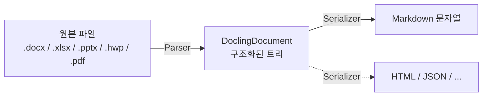
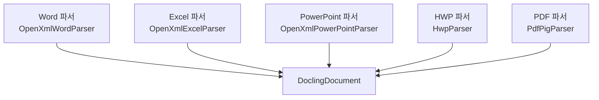

# 문서 파싱 동작 원리 — 기본 개념

이 문서는 `Mythosia.Documents.*` 로더가 내부적으로 어떻게 작동하는지를 처음 접하시는 분을 위한 안내입니다.
마크다운 추출만 필요하실 경우 이 페이지를 읽지 않으셔도 됩니다 — 다음 두 줄이면 충분합니다.

```csharp
var docs = await new WordDocumentLoader().LoadAsync("report.docx");
string markdown = docs[0].ToMarkdown();
```

다만 다음 중 하나라도 해당하신다면 이 페이지가 도움이 되실 수 있습니다.

- 표가 의도한 형태로 렌더링되지 않아 출력 방식을 바꾸고 싶으신 경우
- RAG 파이프라인에서 슬라이드 또는 시트 단위로 청크를 나누고 싶으신 경우
- 새로운 파일 형식(ODT, RTF 등)에 대한 지원을 추가하고 싶으신 경우
- 마크다운이 아닌 HTML, JSON 등 다른 형식으로 출력하고 싶으신 경우

---

## 변환은 한 번이 아닌 두 단계로 이루어집니다

겉보기에는 "파일 → 마크다운"의 단순 변환처럼 보이지만, 실제로는 두 단계를 거칩니다.



- **1단계 (Parser)**: 원본 파일을 읽어 그 안에 포함된 제목, 문단, 표, 리스트 등을 **`DoclingDocument`라는 트리 자료구조**로 옮깁니다. 이 단계에서는 마크다운에 관한 어떠한 정보도 다루지 않습니다.
- **2단계 (Serializer)**: `DoclingDocument` 트리를 순회하며 마크다운 문자열을 생성합니다. 표는 `TableSerializer`라는 별도의 컴포넌트가 처리합니다.

`ToMarkdown()`을 호출하면 이 두 단계가 한 번에 실행되는 것처럼 보이지만, 실제로는 **`DoclingDocument`라는 중간 산출물이 메모리에 잠시 존재한 뒤 마크다운으로 변환되는 구조**입니다.

---

## 두 단계로 분리한 이유

"한 번에 변환하면 되지 않는가?"라는 의문이 들 수 있습니다. 두 단계로 분리한 데에는 네 가지 이유가 있습니다.

### 1. 동일한 구조에서 여러 출력 형식을 생성할 수 있습니다

마크다운은 가능한 출력 형식 중 하나일 뿐입니다. 동일한 `DoclingDocument`로부터 HTML, JSON, plain text 등을 추가로 생성할 수 있습니다 (현재는 마크다운만 구현되어 있습니다).

### 2. 표 렌더링 방식을 런타임에 변경할 수 있습니다

같은 표라도 용도에 따라 다른 형태로 표현하고 싶은 경우가 있습니다.

```csharp
var doc = (await new ExcelDocumentLoader().LoadAsync("data.xlsx"))[0];

// 기본: 표준 마크다운 파이프 표
string md1 = doc.ToMarkdown();

// 의미 단위로 그룹화한 형태 (RAG에 유리)
doc.TableSerializer = new SemanticTableSerializer();
string md2 = doc.ToMarkdown();
```

원본 파일을 다시 읽지 않고도 출력 방식만 변경할 수 있는 이유는, 1단계에서 만들어 둔 구조(`DoclingDocument`)가 메모리에 그대로 남아 있기 때문입니다.

### 3. RAG 청킹에는 "텍스트"가 아닌 "구조"가 필요합니다

RAG에서 긴 문서를 작은 청크로 나눌 때, **마크다운 문자열을 직접 분할하면 다음과 같은 문제가 발생할 수 있습니다.**

- 표 중간에서 잘려 헤더와 데이터가 분리되는 경우
- "## 결론"과 같은 섹션 제목이 본문과 분리되어 컨텍스트가 사라지는 경우
- 리스트 중간이 잘려 항목의 의미가 손상되는 경우

`DoclingDocument` 트리를 활용하면 "표는 항상 하나의 청크로", "섹션 제목은 그 아래 본문과 함께" 같은 규칙을 안전하게 적용할 수 있습니다.

### 4. 파일 형식마다 파서는 다르지만 결과 구조는 동일합니다



파서마다 원본 라이브러리(OpenXml SDK, HwpLibSharp, PdfPig 등)는 다르지만, **모두 동일한 형태의 `DoclingDocument`를 생성하므로 그 이후 단계(시리얼라이저, RAG, 청킹)는 파일 형식에 관계없이 동작합니다.**

---

## 이 구조가 실제 사용에 미치는 영향

| 목적 | 권장 접근 방식 |
|---|---|
| 마크다운 단순 추출 | `LoadAsync()` → `ToMarkdown()` (이 페이지를 더 읽지 않으셔도 됩니다) |
| 표 스타일만 변경 | `doc.TableSerializer = new ...` 한 줄로 처리 |
| 슬라이드/시트 단위 청킹 | `DoclingDocument` 트리에서 `GroupItem` 추출 |
| 헤더 컨텍스트 보존 청킹 | `DoclingDocument` 트리 순회 (마크다운 문자열 분할 지양) |
| 새 파일 형식 지원 | `IDocumentParser` 구현 |
| 새 출력 형식 (HTML 등) | `DoclingDocument`를 받는 시리얼라이저 작성 |

---

## 더 읽어보기

- **[DoclingDocument 안에 무엇이 들어있을까?](document-architecture-data-model.md)** — 트리 구조와 각 요소 타입을 예시와 함께 설명합니다.
- **[출력 커스터마이징](document-architecture-customization.md)** — TableSerializer 교체, 청킹, 커스텀 파서 작성 등 실용적인 레시피를 다룹니다.
