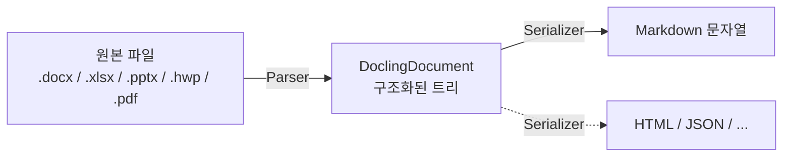
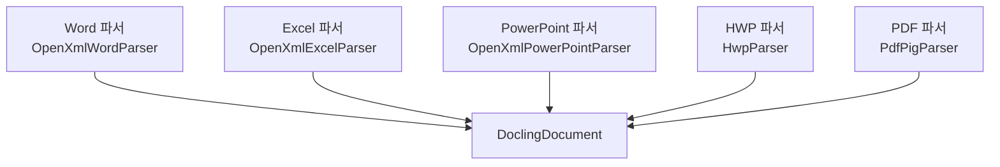

# 문서 파싱은 어떻게 동작하나 — 기본 개념

이 문서는 `Mythosia.Documents.*` 로더들이 내부적으로 어떻게 작동하는지 처음 보는 분을 위한 안내입니다.
단순히 "마크다운 뽑기"만 할 거라면 이 페이지를 안 읽어도 됩니다 — 다음 두 줄이면 끝입니다.

```csharp
var docs = await new WordDocumentLoader().LoadAsync("report.docx");
string markdown = docs[0].ToMarkdown();
```

하지만 다음 중 하나라도 해당된다면 이 페이지가 도움이 됩니다.

- 표가 마음대로 렌더링되지 않아 다른 방식으로 바꾸고 싶다
- RAG에서 슬라이드/시트 단위로 청크를 나누고 싶다
- 새 파일 형식(예: ODT, RTF)을 지원하고 싶다
- 마크다운이 아니라 HTML이나 JSON으로 뽑고 싶다

---

## 한 번이 아니라 두 번에 걸쳐 변환됩니다

표면적으로는 "파일 → 마크다운"처럼 보이지만, 실제로는 두 단계를 거칩니다.



- **1단계 (Parser)**: 원본 파일을 읽고, 그 안에 들어있는 제목/문단/표/리스트 등을 **`DoclingDocument`라는 트리 자료구조**로 옮깁니다. 이 단계는 마크다운에 대해 아무것도 모릅니다.
- **2단계 (Serializer)**: `DoclingDocument` 트리를 순회하면서 마크다운 문자열을 만듭니다. 표는 `TableSerializer`라는 별도 컴포넌트가 처리합니다.

`ToMarkdown()`을 호출하면 이 두 단계가 한 번에 실행되는 것처럼 보이지만, 사실 **`DoclingDocument`라는 중간 산출물이 메모리에 잠시 존재하다가 마크다운으로 바뀌는 것**입니다.

---

## 왜 이렇게 두 단계로 나눴나?

"한 번에 바꾸면 안 되나?"라는 질문이 자연스럽습니다. 두 단계로 분리한 데에는 네 가지 이유가 있습니다.

### 1. 같은 구조에서 여러 출력 형식을 뽑을 수 있다

마크다운은 출력 옵션 중 하나일 뿐입니다. 같은 `DoclingDocument`에서 HTML, JSON, plain text 등을 추가로 만들 수 있습니다 (현재는 마크다운만 구현됨).

### 2. 표 렌더링 방식을 런타임에 바꿀 수 있다

같은 표라도 용도에 따라 다르게 보여주고 싶을 때가 있습니다.

```csharp
var doc = (await new ExcelDocumentLoader().LoadAsync("data.xlsx"))[0];

// 기본: 표준 마크다운 파이프 표
string md1 = doc.ToMarkdown();

// 의미 단위로 그룹화한 형태 (RAG에 유리)
doc.TableSerializer = new SemanticTableSerializer();
string md2 = doc.ToMarkdown();
```

원본 파일을 다시 읽지 않고 출력 방식만 바꿀 수 있는 것은, 1단계에서 만들어둔 구조(`DoclingDocument`)가 여전히 메모리에 있기 때문입니다.

### 3. RAG 청킹에는 "텍스트"가 아니라 "구조"가 필요하다

RAG에서 긴 문서를 작은 청크로 나눌 때, **마크다운 문자열을 직접 자르면 위험합니다**:

- 표 한가운데에서 잘려서 헤더와 데이터가 분리될 수 있음
- "## 결론" 같은 섹션 제목이 그 아래 본문과 떨어져서 컨텍스트를 잃을 수 있음
- 리스트 중간이 잘려서 의미가 깨질 수 있음

`DoclingDocument` 트리를 알면 "표는 통째로 한 청크로", "섹션 제목은 항상 그 아래 본문과 함께" 같은 규칙을 안전하게 적용할 수 있습니다.

### 4. 파일 형식마다 파서가 다르지만 결과 모양은 동일하다



파서마다 원본 라이브러리(OpenXml SDK, HwpLibSharp, PdfPig 등)가 다르지만, **모두 같은 모양의 `DoclingDocument`를 만들어내기 때문에 그 뒤 단계(시리얼라이저, RAG, 청킹)는 형식에 무관하게 동작합니다.**

---

## 이 분리가 일상 사용에 주는 영향

| 하고 싶은 것 | 권장 접근 |
|---|---|
| 마크다운 한 번 뽑기 | `LoadAsync()` → `ToMarkdown()` (이 페이지 더 안 읽어도 됨) |
| 표 스타일만 바꾸기 | `doc.TableSerializer = new ...` 한 줄 |
| 슬라이드/시트 단위 청킹 | `DoclingDocument` 트리에서 `GroupItem` 추출 |
| 헤더 컨텍스트 보존 청킹 | `DoclingDocument` 트리 순회 (마크다운 자르기 X) |
| 새 파일 형식 지원 | `IDocumentParser` 구현 |
| 새 출력 형식 (HTML 등) | `DoclingDocument`를 받는 시리얼라이저 작성 |

---

## 다음에 읽을 것

- **[DoclingDocument 안에 뭐가 들어있나](document-architecture-data-model.md)** — 트리 구조와 각 요소 타입을 예시와 함께 설명합니다.
- **[원하는 대로 출력 바꾸기](document-architecture-customization.md)** — TableSerializer 교체, 청킹, 커스텀 파서 작성 등 실용 레시피.
