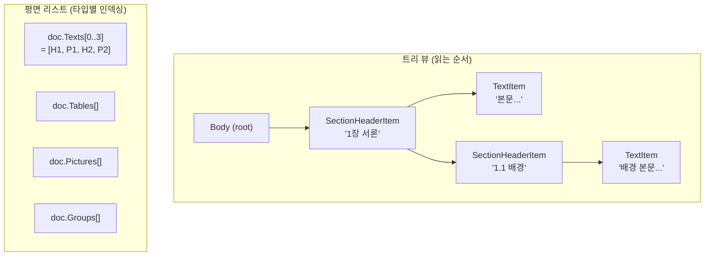

# DoclingDocument 안에 뭐가 들어있나

[이전 페이지](document-architecture-concept.md)에서 파일이 먼저 `DoclingDocument`라는 트리로 변환된다고 했습니다.
이 페이지에서는 그 트리에 정확히 어떤 것들이 들어있는지 설명합니다.

> 비유하자면, `DoclingDocument`는 Word의 "개요 보기(Outline View)"를 코드로 다룰 수 있게 만든 것입니다.
> 문서의 **시각적 표현(폰트, 색상, 여백)** 은 버리고, **구조(제목 / 문단 / 표 / 리스트)** 만 남깁니다.

---

## 같은 데이터를 두 가지 방식으로 본다

`DoclingDocument`는 같은 내용을 **두 가지 방식**으로 동시에 보관합니다.



- **트리 뷰**: 사람이 읽는 순서대로 부모/자식 관계가 잡혀있습니다. 마크다운 출력은 이 트리를 깊이 우선 탐색(DFS)으로 순회하면서 생성됩니다.
- **평면 리스트**: 같은 요소들을 타입별 리스트로도 보관합니다 (`doc.Texts`, `doc.Tables`, `doc.Pictures`, `doc.Groups`). "전체 표 개수"나 "n번째 그림" 같은 인덱싱이 빠릅니다.

**같은 객체를 두 곳에서 가리키는 것이지, 데이터가 두 벌 있는 게 아닙니다.** 트리의 노드와 평면 리스트의 항목은 동일한 인스턴스입니다.

---

## 요소 타입 일람

각 타입은 문서 안의 어떤 의미 단위를 표현하는지로 구분됩니다.

### TitleItem — 문서 제목

문서의 메인 제목입니다 (Word의 "Title" 스타일, 마크다운의 `#`).

```csharp
doc.AddTitle("2026년 사업 계획서");
// → "# 2026년 사업 계획서"
```

### SectionHeaderItem — 섹션/하위 섹션 제목

Word의 "Heading 1", "Heading 2", PowerPoint의 슬라이드 제목, Excel의 시트명 등이 모두 여기에 매핑됩니다.

```csharp
doc.AddHeading("1장 서론", level: 1);   // → "## 1장 서론"
doc.AddHeading("1.1 배경",  level: 2);  // → "### 1.1 배경"
```

`Level`은 1부터 시작합니다. 마크다운 출력 시 `#` 개수는 `Level + 1`개로 변환되며 (Title이 `#`이라 헤딩은 `##`부터 시작), 최대 6개로 클램프됩니다.

### TextItem — 일반 문단

본문 텍스트 한 단락입니다.

```csharp
doc.AddParagraph("이 문서는 회사의 2026년 사업 방향을 정리한 것입니다.");
```

`Label` 속성으로 좀 더 세분화할 수 있습니다 (`Paragraph`, `Text`, `Title`, `SectionHeader`, ...). 일반 본문은 `DocItemLabel.Paragraph`입니다.

### DocListItem — 리스트 항목 하나

불릿 포인트나 번호 매김 항목 하나에 해당합니다.

```csharp
doc.AddListItem("첫째 항목");                                      // → "- 첫째 항목"
doc.AddListItem("첫째 항목", enumerated: true, marker: "1.");       // → "1. 첫째 항목"
```

리스트 전체가 아니라 **항목 하나**가 한 노드입니다. 같은 부모 아래 여러 `DocListItem`이 연속되면 하나의 리스트로 렌더링됩니다.

### TableItem + TableData + TableCell — 표

`TableItem`은 표 자체, `TableData`는 행/열 정보, `TableCell`은 개별 셀입니다.

```csharp
var data = new TableData { NumRows = 2, NumCols = 3 };
data.TableCells.Add(new TableCell {
    Text = "헤더1",
    StartRowOffsetIdx = 0, EndRowOffsetIdx = 1,
    StartColOffsetIdx = 0, EndColOffsetIdx = 1,
    ColumnHeader = true,
});
// ... 나머지 셀들
doc.AddTable(data);
```

셀의 `RowSpan`/`ColSpan`과 `StartRowOffsetIdx`/`EndRowOffsetIdx`/`StartColOffsetIdx`/`EndColOffsetIdx`로 병합 셀까지 표현할 수 있습니다.

`ColumnHeader = true`인 셀이 있으면 그 행을 헤더로 인식합니다. 명시적으로 표시된 헤더 셀이 하나도 없으면 `GridTableSerializer`는 첫 번째 행을 헤더로 간주합니다 (fallback).

> **주의**: HWP 파서는 작성자가 명시한 `TitleCell` 플래그만 따릅니다. HWP에서는 "왼쪽 열이 헤더"인 표가 흔하기 때문입니다 (Office 파서들은 항상 첫 행을 헤더로 잡음).

### PictureItem — 이미지

문서 안의 이미지 자리표시자입니다.

```csharp
doc.AddPicture();
// → "<!-- image -->" (기본 placeholder, MarkdownSerializer.ImagePlaceholder로 변경 가능)
```

현재 로더들은 이미지 바이너리를 추출하지 않고 자리표시자만 삽입합니다.

### GroupItem — 컨테이너

자식 요소를 묶는 컨테이너입니다. **시각적 출력은 없고**, 자식들만 그대로 렌더링됩니다.

용도:
- **PowerPoint**: 각 슬라이드가 `GroupItem`(label = `Slide`)
- **Excel**: 각 시트가 `GroupItem`(label = `Sheet`)
- **그 외**: 임의의 그루핑 (장, 절, 리스트 그룹 등)

```csharp
var slideGroup = doc.AddGroup("Slide 1", GroupLabel.Slide);
doc.AddHeading("슬라이드 제목", 2, slideGroup);
doc.AddParagraph("슬라이드 본문", slideGroup);
```

이 구조 덕에 RAG에서 "슬라이드 단위로 청크를 나누고 싶다"는 요구를 `doc.Groups.Where(g => g.Label == GroupLabel.Slide)` 한 줄로 처리할 수 있습니다.

### CodeItem, FormulaItem — 코드 블록과 수식 (드물게 사용)

```csharp
doc.AddCode("print('hello')", language: "python");
// → ```python
//   print('hello')
//   ```
```

수식은 `$$...$$` (블록 LaTeX)로 출력됩니다. 일반 Office 문서에서는 거의 만들어지지 않고, 주로 PDF나 마크다운 입력에서 사용됩니다.

---

## 파일 형식별 매핑 표

각 파서가 원본 요소를 어떤 `DoclingDocument` 요소로 변환하는지:

| 원본 요소 | Word | Excel | PowerPoint | HWP |
|---|---|---|---|---|
| 문서 제목 | "Title" 스타일 → `TitleItem` | — | — | — |
| 헤딩 | "Heading1~9" → `SectionHeaderItem` | 시트명 → `SectionHeaderItem` (level 2) | 슬라이드 제목 placeholder → `SectionHeaderItem` (level 2) | "개요 1~9" → `SectionHeaderItem` |
| 본문 단락 | 일반 paragraph → `TextItem` | — | 텍스트 박스 단락 → `TextItem` | 일반 paragraph → `TextItem` |
| 리스트 | NumberingProperty 있는 paragraph → `DocListItem` | — | bullet/autonum 단락 → `DocListItem` | 리스트 단락 → `DocListItem` |
| 표 | `<w:tbl>` → `TableItem` (병합 셀 포함) | 시트 전체 → 하나의 `TableItem` | `<a:tbl>` → `TableItem` | `ControlTable` → `TableItem` |
| 이미지 | (현재 미지원) | — | (현재 미지원) | (현재 미지원) |
| 컨테이너 | — | 각 시트 → `GroupItem(Sheet)` | 각 슬라이드 → `GroupItem(Slide)` | — |

---

## RefItem이란? (필요할 때만 읽기)

트리에서 부모/자식을 가리킬 때 객체 참조를 직접 쓰지 않고 **`RefItem`이라는 문자열 포인터**를 씁니다.

```csharp
item.Parent = new RefItem("#/body");        // 부모는 body 루트
parent.Children.Add(new RefItem("#/texts/0")); // 첫 번째 text 항목
```

이 형식은 [JSON Pointer](https://datatracker.ietf.org/doc/html/rfc6901)와 비슷한 docling 컨벤션입니다.

**왜 객체 참조를 안 쓰고 문자열을 쓰나?**
- `DoclingDocument`를 JSON으로 직렬화/역직렬화할 수 있어야 함 (순환 참조 회피)
- 외부 시스템(파일, 데이터베이스, API 응답)으로 주고받을 때 안정적인 식별자가 필요함

`refItem.Resolve(doc)`을 호출하면 실제 객체를 다시 얻을 수 있습니다.

---

## 다음에 읽을 것

- **[원하는 대로 출력 바꾸기](document-architecture-customization.md)** — 표 렌더링 교체, 청킹 패턴, 커스텀 파서 작성 등 실용 레시피.
- **[개념 페이지로 돌아가기](document-architecture-concept.md)** — 두 단계 파이프라인의 큰 그림.
