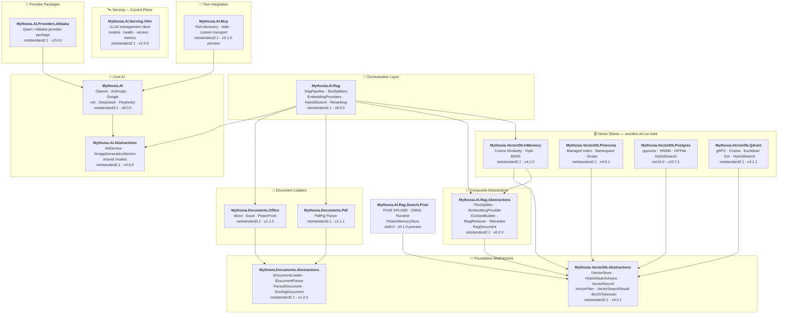

<div align="center">

🌐 [English](../../README.md) · [한국어](../ko/README.md) · [日本語](../ja/README.md) · [Français](../fr/README.md) · [Deutsch](../de/README.md) · [Русский](../ru/README.md) · [Українська](../uk/README.md) · [简体中文](../zh-Hans/README.md) · [繁體中文](../zh-Hant/README.md) · [Tiếng Việt](../vi/README.md) · [ภาษาไทย](../th/README.md) · [Português](README.md) · [Español](../es/README.md)

<br>

[](https://github.com/AJ-comp/Mythosia.AI)


### Biblioteca .NET modular para construir aplicações de IA inteligentes

**Troque de provider, conecte RAG, carregue documentos — tudo por uma API unificada.**

<br>

[](https://www.nuget.org/packages/Mythosia.AI)
[](https://www.nuget.org/packages/Mythosia.AI)
[](https://aj-comp.github.io/Mythosia.AI/)
[](https://dotnet.microsoft.com)

<br>

**[📖 Primeiros Passos](https://aj-comp.github.io/Mythosia.AI/)** &nbsp;·&nbsp; **[Referência de API](https://aj-comp.github.io/Mythosia.AI/api/)** &nbsp;·&nbsp; **[GitHub ↗](https://github.com/AJ-comp/Mythosia.AI)**

<br>

</div>

Para TXT e Markdown, escolha um [splitter por regras](text-splitters.md) adequado à estrutura. Tamanho, overlap e limites Unicode são verificados; Markdown preserva títulos, código e linhas de tabelas. Caracteres e palavras não são limites de tokens do modelo. Condições de tabela e indentação mantêm seu significado; a repetição excessiva de contexto Markdown para com uma exceção explícita.

Para evitar que uma indexação aparentemente correta sobrescreva fragmentos ou os associe a vetores errados, a [validação da indexação](rag-pipeline.md#indexing-validation) rejeita IDs e lotes de embeddings inválidos antes da persistência. Divisores personalizados devem fornecer IDs únicos e herdar os metadados do documento.

[Identidades de arquivo estáveis](document-loaders.md#file-source-identity), [vetores de pergunta validados](rag-embedding.md#query-embedding-validation) e [persistência por documento com cancelamento URL](rag-pipeline.md#custom-persistence) evitam duplicações, buscas inválidas e chunks obsoletos.

A prévia opcional `Mythosia.AI.Rag.Search.Pixie` permite comparar busca neural esparsa local com a busca existente. Mantém o provedor de embeddings densos e um índice PIXIE em memória, sem migrar armazenamentos persistentes nem substituir a busca padrão. [Guia PIXIE e comparação (inglês)](../rag-pixie-search.md).

Isole as configurações, interrompa o trabalho em curso e receba respostas com consumo e fontes. O [guia de migração v8](v8-migration.md) reúne seis mudanças de arquitetura, exemplos e o alcance da validação.

> Versões dos pacotes documentadas aqui: [Mythosia.AI 8.0.0](../../src/core/Mythosia.AI/RELEASE_NOTES.md#v800), [Abstractions 4.0.0](../../src/core/Mythosia.AI.Abstractions/RELEASE_NOTES.md#v400), [Alibaba 3.0.0](../../src/core/Mythosia.AI.Providers.Alibaba/RELEASE_NOTES.md#v300), [RAG 8.0.0](../../src/rag/Mythosia.AI.Rag/RELEASE_NOTES.md#v800), [MCP 0.1.0-preview](../../src/integrations/Mythosia.AI.Mcp/RELEASE_NOTES.md#v010-preview), [Serving.Vllm 1.0.0](../../src/serving/Mythosia.AI.Serving.Vllm/RELEASE_NOTES.md#v100).

---

### Qual pacote instalar?

```
dotnet add package Mythosia.AI                    # comece por aqui (só este é suficiente)
dotnet add package Mythosia.AI.Rag                # opcional: quando precisar de RAG
dotnet add package Mythosia.VectorDb.Postgres     # opcional: vector store para produção
```

| Passo | Pacote | Quando |
| :--: | --- | --- |
| **1** | **`Mythosia.AI`** | **Comece aqui** — geração de texto, streaming, function calling, structured output (OpenAI / Claude / Gemini / Grok / DeepSeek / Perplexity) |
| **2** | **`Mythosia.AI.Rag`** | Quando precisar de RAG — chunking, embedding, hybrid search, reranking, InMemory store, document loaders (Word / Excel / PowerPoint / PDF) |
| **3** | **`Mythosia.VectorDb.Postgres`** / **`Qdrant`** / **`Pinecone`** | Quando precisar de vector store de produção em vez de InMemory — escolha um |

Prepare configurações independentes com `CreateRequest(...).WithTemperature(...).GetCompletionAsync()`. O [guia de solicitações](request-building.md) explica Before/After, Run, perfis e limites das conversas compartilhadas.

Para pedidos sensíveis ao tempo de espera, escolha a [velocidade de processamento](request-building.md#inference-speed). `WithSpeed` mantém modelo e esforço; `Processing` informa o modo aplicado. Fast é pago nas combinações suportadas.

## Arquitetura

<a href="../assets/architecture.svg">
  <picture>
    <source media="(prefers-color-scheme: dark)" srcset="../assets/architecture-dark.svg">
    
  </picture>
</a>

<details>
<summary>Detalhes das dependências dos pacotes</summary>



</details>

## Demo / Experimente (Chat UI)

Este repositório inclui um exemplo de Chat UI construído com Mythosia.AI — execute `Mythosia.AI.Samples.ChatUi` para experimentar a biblioteca diretamente.

### Executar o exemplo

Inicie o **`Mythosia.AI.Samples.ChatUi`** na sua máquina:

```bash
# a partir do diretório raiz do repositório
dotnet run --project apps/Mythosia.AI.Samples.ChatUi
```

https://github.com/user-attachments/assets/62094afe-9add-4c14-b818-6b31f200dc01


## Início Rápido

### Geração de texto básica

```csharp
using Mythosia.AI;

var service = new OpenAIService(apiKey, httpClient);
var response = await service.GetCompletionAsync("Olá!");
```

### Streaming

```csharp
await foreach (var token in service.StreamAsync("Me conte uma história"))
{
    Console.Write(token);
}
```

### Streaming com raciocínio

OpenAI, Claude, Gemini, Grok e DeepSeek Flash expõem o raciocínio do provedor pelo mesmo padrão de streaming. Ative-o no serviço ou solicitação e observe com `StreamOptions.WithReasoning()`:

```csharp
await foreach (var content in service.StreamAsync(message, new StreamOptions().WithReasoning()))
{
    if (content.Type == StreamingContentType.Reasoning)
        Console.Write($"[Raciocínio] {content.Content}");
    else if (content.Type == StreamingContentType.Text)
        Console.Write(content.Content);
}
```

Quando uma tarefa precisar de mais raciocínio ou de fontes atuais ou documentais, use as [opções comuns de raciocínio e busca](reasoning-and-search.md).

### Function Calling

```csharp
var service = new OpenAIService(apiKey, httpClient)
    .WithFunction(
        "get_weather",
        "Obter informações climáticas atuais para um local",
        ("location", "Nome da cidade e país", required: true),
        (string location) => $"O clima em {location} está ensolarado, 28°C"
    );

var response = await service.GetCompletionAsync("Como está o tempo em São Paulo?");
```

Uma consulta lenta não precisa interromper toda a resposta. Enquanto os dados do clima são carregados, por exemplo, o modelo pode explicar dicas gerais de viagem que não dependem do resultado.

`FunctionDefinition.AllowAsync = true` ou `FunctionBuilder.WithAsync()` permite habilitar chamadas assíncronas para GPT-6 Astra / Sol / Luna via Responses. O padrão é `false`; modelos sem suporte aguardam o resultado do mesmo handler. Veja exemplos e o ciclo de vida da solicitação no [guia de chamadas de função](function-calling.md).

### Structured Output (básico)

```csharp
// Desserializa a resposta do LLM diretamente em um POCO C# com auto-recuperação
var result = await service.GetCompletionAsync<WeatherResponse>(
    "Como está o tempo em São Paulo?");
```

### Structured Output (lista)

```csharp
// Collections funcionam diretamente — sem wrapper necessário
var items = await service.GetCompletionAsync<List<ItemDto>>(
    "Extraia todas as entidades deste documento...");
```

### Structured Output (streaming)

```csharp
// Transmite cada trecho de texto em tempo real + recebe o objeto desserializado ao final
var run = service.BeginStream(prompt).As<MyDto>();

await foreach (var chunk in run.Stream())
    Console.Write(chunk);          // interface em tempo real

MyDto dto = await run.Result;      // parseado e auto-recuperado
```

### Política de Resumo de Conversa

```csharp
// Resume automaticamente mensagens antigas quando a conversa fica longa
service.ConversationPolicy = SummaryConversationPolicy.ByMessage(
    triggerCount: 20,
    keepRecentCount: 5
);

// Dispara por contagem de tokens
service.ConversationPolicy = SummaryConversationPolicy.ByToken(
    triggerTokens: 3000,
    keepRecentTokens: 1000
);

// Use normalmente — o resumo acontece automaticamente
await service.GetCompletionAsync("Continue a conversa...");

// No streaming, aplique a política de resumo antes de StreamAsync()
await service.ApplySummaryPolicyIfNeededAsync();
await foreach (var chunk in service.StreamAsync("Continue..."))
    Console.Write(chunk.Content);

// Salvar/restaurar resumo entre sessões
string saved = service.ConversationPolicy.CurrentSummary;
policy.LoadSummary(saved);
```

### RAG (Retrieval-Augmented Generation)

Escolha pesquisa lexical, semântica ou híbrida sem impor embeddings a cada consulta. [Guia de pesquisa](rag-hybrid-search.md).

```bash
dotnet add package Mythosia.AI.Rag
```

```csharp
using Mythosia.AI.Rag;

var service = new AnthropicService(apiKey, httpClient)
    .WithRag(rag => rag
        .AddDocument("manual.txt")
        .AddDocument("policy.txt")
    );

var response = await service.GetCompletionAsync("Qual é a política de reembolso?");
```

## Providers Suportados

> Grok 4.7 é uma adição ainda não publicada; veja [seleção do modelo, raciocínio e velocidade](providers.md#grok-47).

> GPT-6 Sol/Luna ainda não foram publicados. Veja [seleção do modelo e requisitos](providers.md#gpt-6-sol-luna).

> Claude Opus 5.5 requer builds compatíveis de Core e Abstractions ainda não publicados; consulte [configuração e migração](providers.md#claude-opus-55).

| Provider | Pacote | Modelos |
| --- | --- | --- |
| **OpenAI** | `Mythosia.AI` | GPT-6 Astra / Sol / Luna, GPT-5.6 Sol / Terra / Luna, GPT-5.5 / 5.5 Pro / 5.4 / 5.4 Mini / 5.4 Nano / 5.4 Pro / 5.3 Codex / 5.2 / 5.2 Pro / 5.1, GPT-4.1 / 4.1 Mini, GPT-4o / 4o Mini |
| **Anthropic** | `Mythosia.AI` | Claude Fable 5.1 / 5, Mythos 5.1 / 5 (limited), [Opus 5.5](providers.md#claude-opus-55) / 5 / 4.8 / 4.7 / 4.6 / 4.5, Sonnet 5 / 4.6 / 4.5, Haiku 4.5 |
| **Google** | `Mythosia.AI` | Gemini 3.8 Flash, Gemini 3.7 Flash, Gemini 3.6 Flash, Gemini 3.5 Flash/Flash-Lite, Gemini 3.1 Pro Preview/Flash-Lite, Gemini 3 Flash Preview, Gemini 2.5 Pro/Flash/Flash-Lite, Gemini 3.1 Flash Image, Gemini 3.1 Flash-Lite Image, Gemini 3 Pro Image |
| **xAI** | `Mythosia.AI` | Grok 4.7, Grok 4.6, Grok 4.5 (padrão), Grok 4.3, Grok 4.20 (reasoning / non-reasoning), Grok Build |
| **DeepSeek** | `Mythosia.AI` | Flash (V4.1 Flash), V4 Pro |
| **Perplexity** | `Mythosia.AI` | Presets da Agent API e `perplexity/sonar` |
| **Alibaba / Qwen** | `Mythosia.AI.Providers.Alibaba` | Qwen Max / Plus / Turbo / Qwen3 / Qwen3.5 variants |

Use o Perplexity quando a resposta precisar de informações recentes e fontes que o leitor possa verificar. `PerplexityService` chama a Agent API; a pesquisa e os embeddings independentes permitem montar a recuperação de documentos com o modelo de resposta que preferir. [Perplexity Agent API, pesquisa e embeddings](perplexity.md).

Para revisar documentos longos e realizar tarefas com várias rodadas de ferramentas, escolha Gemini 3.7 Flash ou 3.8 Flash pelo adaptador Google existente. O suporte começa em `Mythosia.AI` 8.0.0 / `Mythosia.AI.Abstractions` 4.0.0; o padrão continua sendo Gemini 3.6 Flash.

Para passar de um rascunho rápido a uma revisão exigente, selecione Grok 4.6 explicitamente e um esforço de `Low` a `XHigh`. Disponível a partir de `Mythosia.AI` 8.0.0 / `Mythosia.AI.Abstractions` 4.0.0; Grok 4.5 continua como padrão de `XAIService`. Consulte a [configuração do Grok](providers.md#xai-xaiservice).

Para criar rascunhos ou combinar referências, use [Grok Imagine Image 2.0](providers.md#grok-imagine-image-20) via `IImageGenerationService`. Mantenha `OutputFormat = ImageOutputFormat.Auto` e escolha a extensão por `MediaType`; xAI não permite escolher codec. Veja a [migração das opções de imagem](providers.md#image-options-migration). O modelo de chat não muda.

Escolha Flare para rascunhos visuais rápidos e Sunburst para alterações precisas. A [geração e edição com GPT Image 2.5](providers.md#gpt-image-25) usa a API existente com seleção explícita por requisição; o padrão OpenAI permanece GPT Image 2.

Para escolher tamanhos válidos ao gerar ou editar imagens, consulte as [opções de imagem do Google por modelo](providers.md#google-image-options). Flash aceita 512/1K/2K/4K, Flash-Lite atualmente 1K e Pro 1K/2K/4K. Flash/Lite oferecem 14 proporções e Pro as 10 padrão; todos aceitam `Auto`. Tamanhos ou proporções explícitos não compatíveis são rejeitados antes da requisição HTTP.

Para analisar gráficos e capturas, chamar funções locais ou revisar uma resposta rápida, use [DeepSeek Flash](providers.md#deepseek-deepseekservice) (`AIModels.DeepSeek.Flash`, V4.1 Flash). O raciocínio fica desativado por padrão; ative com `WithDeepSeekReasoning(...)` ou `WithReasoning(...)` por solicitação.

Para texto, selecione `AIModels.DeepSeek.V4Pro` (`deepseek-v4-pro`, V4-Pro-0813). Flash continua como padrão e aceita imagens; ambos oferecem raciocínio Low/High/Max e o mesmo limite de saída. Defina `UseResponsesApi = true` antes de criar a solicitação para usar Responses com as APIs existentes de completion, streaming, Run e funções locais. O padrão permanece `false` para preservar Chat Completions nas aplicações atuais; a escolha é capturada para toda a solicitação e suas rodadas. Responses reenvia o histórico completo da conversa e do raciocínio nativo sem depender de IDs de respostas armazenadas.

Reutilize uma imagem enviada em várias perguntas ao Flash com `DeepSeekImageFileContent`, via Chat Completions ou Responses; o V4 Pro, exclusivo para texto, rejeita imagens. As adições V4 Pro, Responses e Files exigem builds compatíveis de Core e Abstractions ainda não publicados e não estão nas versões publicadas 8.0.0 / 4.0.0. Consulte [envio, reutilização e limites de imagens](providers.md#deepseek-deepseekservice).

## Pacotes

### Core

| Pacote | NuGet | Descrição |
| --- | --- | --- |
| [Mythosia.AI](../../src/core/Mythosia.AI/README.md) | [](https://www.nuget.org/packages/Mythosia.AI) | Biblioteca core — providers integrados, streaming, function calling e suporte multimodal |
| [Mythosia.AI.Abstractions](../../src/core/Mythosia.AI.Abstractions/README.md) | [](https://www.nuget.org/packages/Mythosia.AI.Abstractions) | Interface `IAIService` e modelos compartilhados — pacote de contrato leve para bibliotecas |
| [Mythosia.AI.Providers.Alibaba](../../src/core/Mythosia.AI.Providers.Alibaba/README.md) | [](https://www.nuget.org/packages/Mythosia.AI.Providers.Alibaba) | Pacote provider Alibaba / Qwen baseado em `Mythosia.AI` |

### RAG

| Pacote | NuGet | Descrição |
| --- | --- | --- |
| [Mythosia.AI.Rag](../../src/rag/Mythosia.AI.Rag/README.md) | [](https://www.nuget.org/packages/Mythosia.AI.Rag) | Extensão RAG fluente para IAIService com API `.WithRag()` |
| [Mythosia.AI.Rag.Abstractions](../../src/rag/Mythosia.AI.Rag.Abstractions/README.md) | [](https://www.nuget.org/packages/Mythosia.AI.Rag.Abstractions) | Interfaces e modelos dos componentes do pipeline RAG |

### Document Loaders

| Pacote | NuGet | Descrição |
| --- | --- | --- |
| [Mythosia.Documents.Abstractions](../../src/loaders/Mythosia.Documents.Abstractions/README.md) | [](https://www.nuget.org/packages/Mythosia.Documents.Abstractions) | Interfaces e modelos do loader de documentos (`IDocumentLoader`, `DoclingDocument`) |
| [Mythosia.Documents.Office](../../src/loaders/Mythosia.Documents.Office/README.md) | [](https://www.nuget.org/packages/Mythosia.Documents.Office) | Parser OpenXml para Word / Excel / PowerPoint |
| [Mythosia.Documents.Pdf](../../src/loaders/Mythosia.Documents.Pdf/README.md) | [](https://www.nuget.org/packages/Mythosia.Documents.Pdf) | Parser PDF baseado em PdfPig |

### Vector Stores

> **Escolha um ou mais** — todos implementam `IVectorStore` do pacote Abstractions.

| Pacote | NuGet | Descrição |
| --- | --- | --- |
| [Mythosia.VectorDb.Abstractions](../../src/vectordb/Mythosia.VectorDb.Abstractions/README.md) | [](https://www.nuget.org/packages/Mythosia.VectorDb.Abstractions) | Contrato `IVectorStore` · `VectorRecord` · `VectorFilter` |
| [Mythosia.VectorDb.InMemory](../../src/vectordb/Mythosia.VectorDb.InMemory/README.md) | [](https://www.nuget.org/packages/Mythosia.VectorDb.InMemory) | Store em memória — sem infraestrutura, ideal para prototipagem |
| [Mythosia.VectorDb.Pinecone](../../src/vectordb/Mythosia.VectorDb.Pinecone/README.md) | [](https://www.nuget.org/packages/Mythosia.VectorDb.Pinecone) | Pinecone HTTP API — isolamento por index/namespace/scope |
| [Mythosia.VectorDb.Postgres](../../src/vectordb/Mythosia.VectorDb.Postgres/README.md) | [](https://www.nuget.org/packages/Mythosia.VectorDb.Postgres) | PostgreSQL + pgvector — índices HNSW / IVFFlat, pronto para produção |
| [Mythosia.VectorDb.Qdrant](../../src/vectordb/Mythosia.VectorDb.Qdrant/README.md) | [](https://www.nuget.org/packages/Mythosia.VectorDb.Qdrant) | Qdrant gRPC client — Cosine / Euclidean / Dot, provisionamento automático |

### Serving — Control Plane

> Clientes de gerenciamento/introspecção para runtimes de serving de modelos. O chat permanece nos pacotes de provider: `Providers.*` = data plane de chat, `Serving.*` = control plane do servidor.

| Pacote | NuGet | Descrição |
| --- | --- | --- |
| [Mythosia.AI.Serving.Vllm](../../src/serving/Mythosia.AI.Serving.Vllm/README.md) | [](https://www.nuget.org/packages/Mythosia.AI.Serving.Vllm) | Cliente de control plane do vLLM — model cards (o modelo realmente carregado via `root`), health, versão do servidor, métricas do Prometheus |

## Estrutura do Repositório

```text
src/
  core/
    Mythosia.AI/                        # Biblioteca AI core
    Mythosia.AI.Abstractions/           # Interface IAIService e modelos compartilhados
    Mythosia.AI.Providers.Alibaba/      # Pacote provider Alibaba / Qwen
  loaders/
    Mythosia.Documents.Abstractions/    # Contrato document loader (IDocumentLoader, DoclingDocument)
    Mythosia.Documents.Office/          # Loader de documentos Office (Word/Excel/PowerPoint)
    Mythosia.Documents.Pdf/             # Loader de documentos PDF
  rag/
    Mythosia.AI.Rag/                    # RAG Fluent API e pipeline
    Mythosia.AI.Rag.Abstractions/       # Interfaces e modelos RAG (RagDocument)
  serving/
    Mythosia.AI.Serving.Vllm/           # Cliente de control plane do vLLM (models/health/version/metrics)
  vectordb/
    Mythosia.VectorDb.Abstractions/     # Contrato vector store
    Mythosia.VectorDb.InMemory/         # Vector store em memória
    Mythosia.VectorDb.Pinecone/         # Vector store Pinecone
    Mythosia.VectorDb.Postgres/         # PostgreSQL + pgvector
    Mythosia.VectorDb.Qdrant/           # Vector store Qdrant
apps/                                   # Aplicações de exemplo
tests/                                  # Projetos de teste unitário / integração
```

## Instalação

```bash
dotnet add package Mythosia.AI
```

Para operações LINQ avançadas com streams:

```bash
dotnet add package System.Linq.Async
```

## Documentação

- [Guia de introdução](getting-started.md)
- [README Mythosia.AI](../../src/core/Mythosia.AI/README.md) — Referência completa de API: function calling, streaming e configuração de modelos
- [README Mythosia.AI.Rag](../../src/rag/Mythosia.AI.Rag/README.md) — Uso do pipeline RAG e implementações customizadas
- [Guia de loaders](document-loaders.md)
- [Notas de versão](../../src/core/Mythosia.AI/RELEASE_NOTES.md)

## Licença

Este projeto é distribuído sob a [licença MIT](https://github.com/AJ-comp/Mythosia.AI/blob/main/LICENSE).

## Origem

Este projeto era originalmente parte do [Mythosia](https://github.com/AJ-comp/Mythosia).

[Criar opções de modelo com definições compartilhadas](model-capabilities.md).
