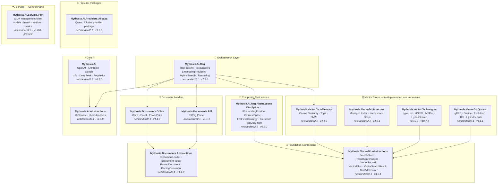

<div align="center">

🌐 [English](../../README.md) · [한국어](../ko/README.md) · [日本語](../ja/README.md) · [Français](../fr/README.md) · [Deutsch](../de/README.md) · [Русский](README.md) · [Українська](../uk/README.md) · [简体中文](../zh-Hans/README.md) · [繁體中文](../zh-Hant/README.md) · [Tiếng Việt](../vi/README.md) · [ภาษาไทย](../th/README.md) · [Português](../pt/README.md) · [Español](../es/README.md)

<br>

[](https://github.com/AJ-comp/Mythosia.AI)


### Модульная .NET-библиотека для создания интеллектуальных приложений

**Смена провайдеров, подключение RAG, загрузка документов — всё через единый API.**

<br>

[](https://www.nuget.org/packages/Mythosia.AI)
[](https://www.nuget.org/packages/Mythosia.AI)
[](https://aj-comp.github.io/Mythosia.AI/)
[](https://dotnet.microsoft.com)

<br>

**[📖 Начало работы](https://aj-comp.github.io/Mythosia.AI/)** &nbsp;·&nbsp; **[Справочник API](https://aj-comp.github.io/Mythosia.AI/api/)** &nbsp;·&nbsp; **[GitHub ↗](https://github.com/AJ-comp/Mythosia.AI)**

<br>

</div>

---

### Какие пакеты установить?

```
dotnet add package Mythosia.AI                    # начните отсюда (это всё, что нужно)
dotnet add package Mythosia.AI.Rag                # опционально: если нужен RAG
dotnet add package Mythosia.VectorDb.Postgres     # опционально: если нужно продуктивное векторное хранилище
```

| Шаг | Пакет | Когда |
| :--: | --- | --- |
| **1** | **`Mythosia.AI`** | **Начните отсюда** — генерация текста, стриминг, вызов функций, структурированный вывод (OpenAI / Claude / Gemini / Grok / DeepSeek / Perplexity) |
| **2** | **`Mythosia.AI.Rag`** | Когда нужен RAG — разбивка текста, эмбеддинги, гибридный поиск, реранкинг, InMemory-хранилище, загрузчики документов (Word / Excel / PowerPoint / PDF) |
| **3** | **`Mythosia.VectorDb.Postgres`** / **`Qdrant`** / **`Pinecone`** | Когда вместо InMemory нужно продуктивное векторное хранилище — выберите одно |

## Архитектура



## Демо / тестовый стенд (Chat UI)

В этом репозитории есть пример Chat UI на базе Mythosia.AI — запустите Mythosia.AI.Samples.ChatUi, чтобы попробовать библиотеку в деле.

### Запуск примера

Запустите **`Mythosia.AI.Samples.ChatUi`** локально:

```bash
# из корня репозитория
dotnet run --project samples/Mythosia.AI.Samples.ChatUi
```

https://github.com/user-attachments/assets/62094afe-9add-4c14-b818-6b31f200dc01


## Быстрый старт

### Базовая генерация текста

```csharp
using Mythosia.AI;

var service = new OpenAIService(apiKey, httpClient);
var response = await service.GetCompletionAsync("Hello!");
```

### Стриминг

```csharp
await foreach (var token in service.StreamAsync("Tell me a story"))
{
    Console.Write(token);
}
```

### Стриминг с рассуждениями

Все провайдеры с поддержкой рассуждений (OpenAI, Claude, Gemini, Grok, DeepSeek) используют одинаковый паттерн стриминга:

```csharp
await foreach (var content in service.StreamAsync(message, new StreamOptions().WithReasoning()))
{
    if (content.Type == StreamingContentType.Reasoning)
        Console.Write($"[Think] {content.Content}");
    else if (content.Type == StreamingContentType.Text)
        Console.Write(content.Content);
}
```

### Вызов функций

```csharp
var service = new OpenAIService(apiKey, httpClient)
    .WithFunction(
        "get_weather",
        "Gets the current weather for a location",
        ("location", "The city and country", required: true),
        (string location) => $"The weather in {location} is sunny, 22C"
    );

var response = await service.GetCompletionAsync("What's the weather in Seoul?");
```

### Структурированный вывод (базовый)

```csharp
// Десериализация ответов LLM напрямую в C# POCO с автовосстановлением
var result = await service.GetCompletionAsync<WeatherResponse>(
    "What's the weather in Seoul?");
```

### Структурированный вывод (список)

```csharp
// Коллекции работают напрямую — никаких обёрток не нужно
var items = await service.GetCompletionAsync<List<ItemDto>>(
    "Extract all entities from this document...");
```

### Структурированный вывод (стриминг)

```csharp
// Стримите фрагменты текста в реальном времени + получайте финальный десериализованный объект
var run = service.BeginStream(prompt).As<MyDto>();

await foreach (var chunk in run.Stream())
    Console.Write(chunk);          // интерфейс в реальном времени

MyDto dto = await run.Result;      // распарсено и автоматически восстановлено
```

### Политика резюмирования диалога

```csharp
// Автоматическое резюмирование старых сообщений при длинном диалоге
service.ConversationPolicy = SummaryConversationPolicy.ByMessage(
    triggerCount: 20,
    keepRecentCount: 5
);

// Триггер по количеству токенов
service.ConversationPolicy = SummaryConversationPolicy.ByToken(
    triggerTokens: 3000,
    keepRecentTokens: 1000
);

// Используйте как обычно — резюмирование происходит автоматически
await service.GetCompletionAsync("Continue our conversation...");

// При стриминге вызовите политику резюмирования явно перед StreamAsync()
await service.ApplySummaryPolicyIfNeededAsync();
await foreach (var chunk in service.StreamAsync("Continue..."))
    Console.Write(chunk.Content);

// Сохранение/восстановление резюме между сессиями
string saved = service.ConversationPolicy.CurrentSummary;
policy.LoadSummary(saved);
```

### RAG (генерация с дополненным извлечением)

```bash
dotnet add package Mythosia.AI.Rag
```

```csharp
using Mythosia.AI.Rag;

var service = new AnthropicService(apiKey, httpClient)
    .WithRag(rag => rag
        .AddDocument("manual.txt")
        .AddDocument("policy.txt")
    );

var response = await service.GetCompletionAsync("What is the refund policy?");
```

## Поддерживаемые провайдеры

| Провайдер | Пакет | Модели |
| --- | --- | --- |
| **OpenAI** | `Mythosia.AI` | GPT-5.5 / 5.5 Pro / 5.4 / 5.4 Mini / 5.4 Nano / 5.4 Pro / 5.3 Codex / 5.2 / 5.2 Pro / 5.2 Codex / 5.1 / 5 / 5 Pro / 5 Mini / 5 Nano, GPT-4.1 / 4.1 Mini / 4.1 Nano, GPT-4o / 4o Mini, o3 / o3 Pro |
| **Anthropic** | `Mythosia.AI` | Claude Fable 5, Opus 4.8 / 4.7 / 4.6 / 4.5 / 4.1 / 4, Sonnet 4.6 / 4.5, Haiku 4.5 |
| **Google** | `Mythosia.AI` | Gemini 3.1 Pro Preview, Gemini 3.5 Flash, Gemini 3 Flash Preview, Gemini 3.1 Flash-Lite, Gemini 2.5 Pro/Flash/Flash-Lite |
| **xAI** | `Mythosia.AI` | Grok 4.3, Grok 4.20 (reasoning / non-reasoning), Grok Build 0.1, Grok 3 Mini |
| **DeepSeek** | `Mythosia.AI` | Chat, Reasoner |
| **Perplexity** | `Mythosia.AI` | Sonar, Sonar Pro, Sonar Reasoning Pro |
| **Alibaba / Qwen** | `Mythosia.AI.Providers.Alibaba` | Qwen Max / Plus / Turbo / Qwen3 / Qwen3.5 варианты |

## Пакеты

### Ядро

| Пакет | NuGet | Описание |
| --- | --- | --- |
| [Mythosia.AI](../../src/core/Mythosia.AI/) | [](https://www.nuget.org/packages/Mythosia.AI) | Основная библиотека — встроенные провайдеры, стриминг, вызов функций и мультимодальная поддержка |
| [Mythosia.AI.Abstractions](../../src/core/Mythosia.AI.Abstractions/) | [](https://www.nuget.org/packages/Mythosia.AI.Abstractions) | Интерфейс `IAIService` и общие модели — лёгкий контрактный пакет для библиотек |
| [Mythosia.AI.Providers.Alibaba](../../src/core/Mythosia.AI.Providers.Alibaba/) | [](https://www.nuget.org/packages/Mythosia.AI.Providers.Alibaba) | Пакет провайдера Alibaba / Qwen на базе `Mythosia.AI` |

### RAG

| Пакет | NuGet | Описание |
| --- | --- | --- |
| [Mythosia.AI.Rag](../../src/rag/Mythosia.AI.Rag/) | [](https://www.nuget.org/packages/Mythosia.AI.Rag) | Fluent-расширение RAG для IAIService с API `.WithRag()` |
| [Mythosia.AI.Rag.Abstractions](../../src/rag/Mythosia.AI.Rag.Abstractions/) | [](https://www.nuget.org/packages/Mythosia.AI.Rag.Abstractions) | Интерфейсы и модели компонентов RAG-пайплайна |

### Загрузчики документов

| Пакет | NuGet | Описание |
| --- | --- | --- |
| [Mythosia.Documents.Abstractions](../../src/loaders/Mythosia.Documents.Abstractions/) | [](https://www.nuget.org/packages/Mythosia.Documents.Abstractions) | Интерфейсы и модели загрузчиков документов (`IDocumentLoader`, `DoclingDocument`) |
| [Mythosia.Documents.Office](../../src/loaders/Mythosia.Documents.Office/) | [](https://www.nuget.org/packages/Mythosia.Documents.Office) | OpenXml-парсеры для Word / Excel / PowerPoint |
| [Mythosia.Documents.Pdf](../../src/loaders/Mythosia.Documents.Pdf/) | [](https://www.nuget.org/packages/Mythosia.Documents.Pdf) | PDF-парсер на базе PdfPig |

### Векторные хранилища

> **Выберите одно или несколько** — все реализуют `IVectorStore` из пакета Abstractions.

| Пакет | NuGet | Описание |
| --- | --- | --- |
| [Mythosia.VectorDb.Abstractions](../../src/vectordb/Mythosia.VectorDb.Abstractions/) | [](https://www.nuget.org/packages/Mythosia.VectorDb.Abstractions) | Контракты `IVectorStore` · `VectorRecord` · `VectorFilter` |
| [Mythosia.VectorDb.InMemory](../../src/vectordb/Mythosia.VectorDb.InMemory/) | [](https://www.nuget.org/packages/Mythosia.VectorDb.InMemory) | Хранилище в памяти — без инфраструктуры, идеально для прототипирования |
| [Mythosia.VectorDb.Pinecone](../../src/vectordb/Mythosia.VectorDb.Pinecone/) | [](https://www.nuget.org/packages/Mythosia.VectorDb.Pinecone) | Pinecone HTTP API — изоляция по индексу/namespace/scope для управляемой векторной БД |
| [Mythosia.VectorDb.Postgres](../../src/vectordb/Mythosia.VectorDb.Postgres/) | [](https://www.nuget.org/packages/Mythosia.VectorDb.Postgres) | PostgreSQL + pgvector — индексы HNSW / IVFFlat, готово для продакшена |
| [Mythosia.VectorDb.Qdrant](../../src/vectordb/Mythosia.VectorDb.Qdrant/) | [](https://www.nuget.org/packages/Mythosia.VectorDb.Qdrant) | Qdrant gRPC-клиент — Cosine / Euclidean / Dot, автоматическое развёртывание |

### Сервинг — плоскость управления

> Клиенты управления/интроспекции для сред сервинга моделей. Чат остаётся в пакетах провайдеров: `Providers.*` = плоскость данных чата, `Serving.*` = плоскость управления сервером.

| Пакет | NuGet | Описание |
| --- | --- | --- |
| [Mythosia.AI.Serving.Vllm](../../src/serving/Mythosia.AI.Serving.Vllm/) | [](https://www.nuget.org/packages/Mythosia.AI.Serving.Vllm) | Клиент плоскости управления vLLM — карточки моделей (фактически загруженная модель через `root`), работоспособность, версия сервера, метрики Prometheus |

## Структура репозитория

```text
src/
  core/
    Mythosia.AI/                        # Основная AI-библиотека
    Mythosia.AI.Abstractions/           # Интерфейс IAIService и общие модели
    Mythosia.AI.Providers.Alibaba/      # Пакет провайдера Alibaba / Qwen
  loaders/
    Mythosia.Documents.Abstractions/    # Контракты загрузчиков документов (IDocumentLoader, DoclingDocument)
    Mythosia.Documents.Office/          # Загрузчики документов Office (Word/Excel/PowerPoint)
    Mythosia.Documents.Pdf/             # Загрузчик PDF-документов
  rag/
    Mythosia.AI.Rag/                    # RAG Fluent API и пайплайн
    Mythosia.AI.Rag.Abstractions/       # Интерфейсы и модели RAG (RagDocument)
  serving/
    Mythosia.AI.Serving.Vllm/           # Клиент плоскости управления vLLM (модели/работоспособность/версия/метрики)
  vectordb/
    Mythosia.VectorDb.Abstractions/     # Контракты векторных хранилищ
    Mythosia.VectorDb.InMemory/         # Векторное хранилище в памяти
    Mythosia.VectorDb.Pinecone/         # Векторное хранилище Pinecone
    Mythosia.VectorDb.Postgres/         # Хранилище PostgreSQL + pgvector
    Mythosia.VectorDb.Qdrant/           # Векторное хранилище Qdrant
samples/                                # Примеры приложений
tests/                                  # Проекты модульных / интеграционных тестов
```

## Установка

```bash
dotnet add package Mythosia.AI
```

Для расширенных LINQ-операций с потоками:

```bash
dotnet add package System.Linq.Async
```

## Документация

- [Руководство по основам](https://github.com/AJ-comp/Mythosia.AI/wiki)
- [README Mythosia.AI](../../src/core/Mythosia.AI/README.md)  Полный справочник API: вызов функций, стриминг и настройка моделей
- [README Mythosia.AI.Rag](../../src/rag/Mythosia.AI.Rag/README.md)  Использование RAG-пайплайна и пользовательские реализации
- [Руководство по загрузчикам](document-loaders.md)
- [Примечания к релизам](../../src/core/Mythosia.AI/RELEASE_NOTES.md)

## Лицензия

Проект распространяется под [лицензией MIT](../../LICENSE).

## Происхождение

Изначально этот проект был частью [Mythosia](https://github.com/AJ-comp/Mythosia).
