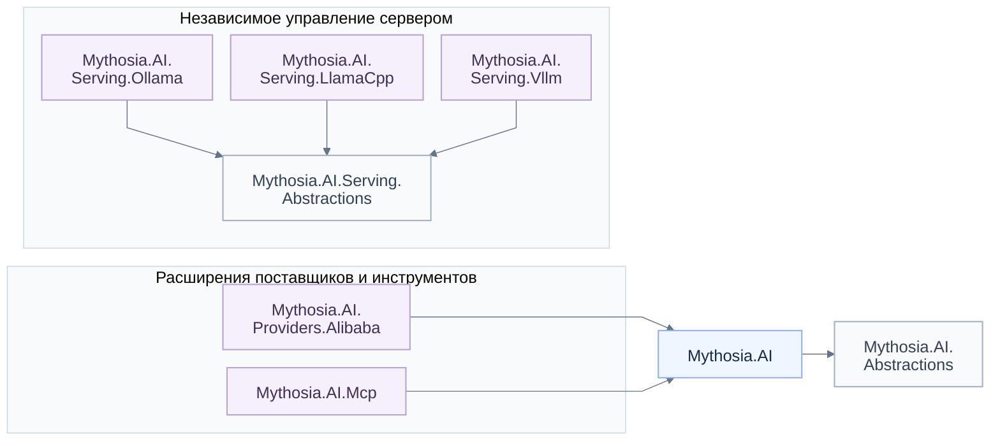
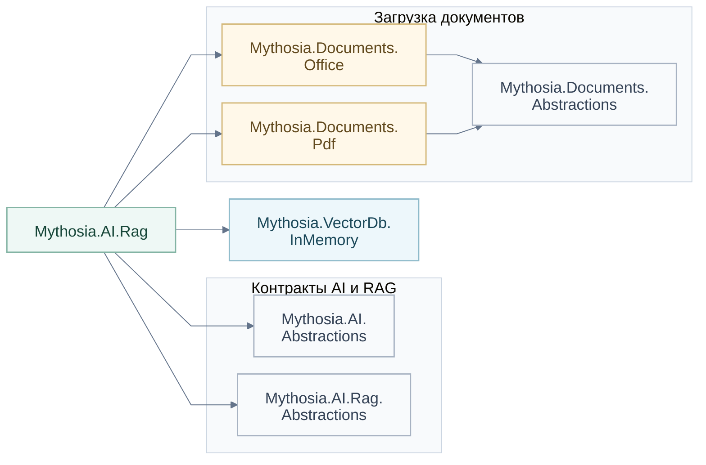
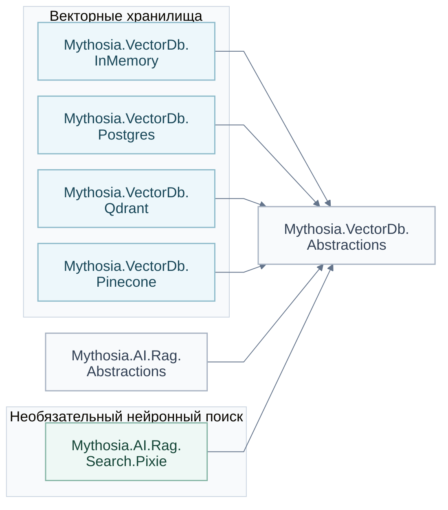

<div align="center">

🌐 [English](../../README.md) · [한국어](../ko/README.md) · [日本語](../ja/README.md) · [Français](../fr/README.md) · [Deutsch](../de/README.md) · [Русский](README.md) · [Українська](../uk/README.md) · [简体中文](../zh-Hans/README.md) · [繁體中文](../zh-Hant/README.md) · [Tiếng Việt](../vi/README.md) · [ภาษาไทย](../th/README.md) · [Português](../pt/README.md) · [Español](../es/README.md)

<br>

[](https://github.com/AJ-comp/Mythosia.AI)


### Модульная .NET-библиотека для создания интеллектуальных приложений

**Смена провайдеров, подключение RAG, загрузка документов — всё через единый API.**

<br>

[](https://www.nuget.org/packages/Mythosia.AI)
[](https://www.nuget.org/packages/Mythosia.AI)
[](https://aj-comp.github.io/Mythosia.AI/)
[](https://dotnet.microsoft.com)

<br>

**[📖 Начало работы](https://aj-comp.github.io/Mythosia.AI/)** &nbsp;·&nbsp; **[Справочник API](https://aj-comp.github.io/Mythosia.AI/api/)** &nbsp;·&nbsp; **[GitHub ↗](https://github.com/AJ-comp/Mythosia.AI)**

<br>

</div>

## Демо / тестовый стенд (Chat UI)

Попробуйте модели и поиск по документам в Playground до написания кода интеграции.

Посмотрите видео, записанное в текущем интерфейсе Playground: выбор моделей, смена языка, настройки документов и конвейера RAG. В видео встроены английские субтитры.

https://github.com/user-attachments/assets/4cf90210-b000-41be-8317-a467e93e7504

### Запуск примера

Запустите **`Mythosia.AI.Samples.ChatUi`** локально:

```bash
# из корня репозитория
dotnet run --project apps/Mythosia.AI.Samples.ChatUi
```

<details>
<summary>Элементы управления и языки Playground</summary>

Слева найдите модель по названию или поставщику и настройте запрос, общайтесь в центре и проверяйте сведения об обработке в панели Inspector справа перед интеграцией в приложение. Кнопка Stop прекращает ожидание ответа; выбор скорости доступен только для поддерживаемых моделей и точек подключения, а Fast может оплачиваться дополнительно. На небольших экранах Models и Inspector открываются как выдвижные панели; локальный запуск, документы и настройки конвейера описаны в [руководстве Chat UI](https://github.com/AJ-comp/Mythosia.AI/blob/main/apps/Mythosia.AI.Samples.ChatUi/README.md).

Панель Pipeline позволяет задать ключи, размерность и тайм-аут для Voyage Context 4, Gemini Embedding 2 и контекстных эмбеддингов Perplexity. В Documents видны количества фрагментов и векторов, а индексацию можно отменить. Сохранённые настройки, переподключение БД и примеры кода используют выбранную конфигурацию. После смены модели или размерности нужна повторная индексация.

Переключатель в верхней части страницы позволяет выбрать один из 13 языков интерфейса, сохранив введённые данные и настройки. Все семь поставщиков отображаются свёрнутыми группами; раскройте нужную группу или найдите модель через поиск.

</details>

## Почему Mythosia.AI?

- **Меняйте провайдеров через единый API** для чата, стриминга, инструментов и структурированных ответов.
- **Стройте ответы на своих документах** с помощью загрузчиков, эмбеддингов, поиска и реранкинга.
- **Сохраняйте независимость настроек запросов** и управляйте текущей работой через общий Run API.
- **Устанавливайте только нужные пакеты**: основную библиотеку, RAG и интеграции векторных хранилищ.

## Какие пакеты установить?

```
dotnet add package Mythosia.AI                    # начните отсюда (это всё, что нужно)
dotnet add package Mythosia.AI.Rag                # опционально: если нужен RAG
dotnet add package Mythosia.VectorDb.Postgres     # опционально: если нужно продуктивное векторное хранилище
```

| Шаг | Пакет | Когда |
| :--: | --- | --- |
| **1** | **`Mythosia.AI`** | **Начните отсюда** — генерация текста, стриминг, вызов функций, структурированный вывод (OpenAI / Claude / Gemini / Grok / DeepSeek / Perplexity) |
| **2** | **`Mythosia.AI.Rag`** | Когда нужен RAG — разбивка текста, эмбеддинги, гибридный поиск, реранкинг, InMemory-хранилище, загрузчики документов (Word / Excel / PowerPoint / PDF) |
| **3** | **`Mythosia.VectorDb.Postgres`** / **`Qdrant`** / **`Pinecone`** | Когда вместо InMemory нужно продуктивное векторное хранилище — выберите одно |

Создавайте независимые настройки через `CreateRequest(...).WithTemperature(...).GetCompletionAsync()`. В [руководстве по запросам](request-building.md) описаны Before/After, Run, профили и ограничения общего диалога.

Completion, потоковая и структурированная выдача и Run один раз применяют фактический профиль и проверяют итоговые настройки до резюмирования, изменения истории и передачи запроса. Вспомогательные запросы изолируют родительский диалог и схему вывода, сохраняя нативную проверку провайдера. См. [руководство по настройкам запросов](request-building.md).

Вызовы приложения независимы, включая обычные вызовы из callback-функций контекста или инструментов и вызовы с повторным использованием профиля или сообщения. В виртуальном адаптере провайдера, вызванном фреймворком, первый вызов соответствующей точки входа базового класса продолжает подготовленный запрос, даже при замене входных данных. Независимому вспомогательному вызову той же точки входа перед передачей запроса нужен `BeginIndependentRequestScope()`; см. [правила адаптеров](request-building.md#provider-request-adapters). Копии входных данных защищают принятую историю от изменений последующими вызовами.

Изменённые адаптером профили проверяются до автоматического резюме; потоковый callback ожидает очистки. Сжатие Claude сохраняет зависимости инструментов в заменённых входных сообщениях и связанный thinking Mythos 5.1. Запросы OpenAI без состояния сохраняют защиту родительской истории.

Для запросов с важным временем ожидания выбирайте [скорость обработки](request-building.md#inference-speed). `WithSpeed` сохраняет модель и усилие; `Processing` показывает применённый режим. Fast — платная опция для поддерживаемых сочетаний.

## Быстрый старт

### Базовая генерация текста

```csharp
using Mythosia.AI.Services.OpenAI;

var service = new OpenAIService(apiKey, httpClient);
var response = await service.GetCompletionAsync("Hello!");
```

### Стриминг

```csharp
await using var run = await service.StartRunAsync(
    "Tell me a story",
    onText: text => Console.Write(text));
string answer = (await run.Result).Text;
```

### Стриминг с рассуждениями

OpenAI, Claude, Gemini, Grok и DeepSeek Flash передают рассуждение провайдера по одной схеме стриминга. Включите рассуждение в сервисе или запросе, затем наблюдайте через `StreamOptions.WithReasoning()`:

```csharp
await using var run = await service.StartRunAsync(
    message, options: new StreamOptions().WithReasoning());
await foreach (var content in run.StreamAsync())
{
    if (content.Type == StreamingContentType.Reasoning)
        Console.Write($"[Think] {content.Content}");
    else if (content.Type == StreamingContentType.Text)
        Console.Write(content.Content);
}
```

### Вызов функций

```csharp
using Mythosia.AI.Extensions;
using Mythosia.AI.Services.OpenAI;

var service = new OpenAIService(apiKey, httpClient)
    .WithFunction(
        "get_weather",
        "Gets the current weather for a location",
        ("location", "The city and country", required: true),
        (string location) => $"The weather in {location} is sunny, 22C"
    );

var response = await service.GetCompletionAsync("What's the weather in Seoul?");
```

По умолчанию вызовы из одного ответа модели выполняются последовательно. Если зарегистрированные функции независимы, можно явно включить параллельное выполнение с ограничением числа обработчиков:

```csharp
using Mythosia.AI.Models.Functions;

service.DefaultPolicy = new FunctionCallingPolicy
{
    ExecutionMode = FunctionExecutionMode.Parallel,
    MaxConcurrency = 3
};
```

Результаты обычного пакета возвращаются модели в исходном порядке вызовов провайдера. При отмене ещё не запущенные вызовы пропускаются и получают соответствующие результаты отмены. Уже запущенные инструменты получают токен, если поддерживают его, и ожидаются до завершения, чтобы пары вызов/результат в истории не нарушались.

`FunctionCallingPolicy.TimeoutSeconds` охватывает весь цикл раундов стриминга, включая заголовки ответа и тело SSE, без сброса между раундами инструментов. Истечение тайм-аута политики вызывает `AIServiceException`; отмена вызывающей стороной остаётся `OperationCanceledException`, связанной с её токеном. Для пользовательского `HttpContent` с буферизацией тела есть известное исключение на этапе получения потока SSE; см. [ограничения отмены](streaming.md#sse-acquisition-cancellation-limitation).

Когда модель может выполнять независимую часть задачи — например, объяснять, что взять в поездку, пока инструмент загружает погоду, — ожидание результата не должно блокировать весь ответ. `FunctionDefinition.AllowAsync = true` или `FunctionBuilder.WithAsync()` разрешает асинхронные вызовы для GPT-6.1 Sol / GPT-6 Astra / Sol / Luna через Responses. По умолчанию используется `false`; неподдерживаемые модели ждут результата того же обработчика. Примеры и жизненный цикл запроса описаны в [руководстве по вызовам функций](function-calling.md#async-tool-calling).

Это отличается от обработчиков C# `async` и параллельного планирования вызовов. Неподдерживаемым моделям не отправляется неподдерживаемая опция API.

### Генерация и редактирование изображений

Создавайте визуальные черновики по тексту или редактируйте изображения через дополнительную возможность, общую для OpenAI, Google и xAI. Модель изображений выбирается независимо от модели чата:

```csharp
using Mythosia.AI.Models.Images;
using Mythosia.AI.Services;
using Mythosia.AI.Services.OpenAI;

IImageGenerationService images = new OpenAIService(apiKey, httpClient);
var generated = await images.GenerateImagesAsync(new ImageGenerationRequest
{
    Prompt = "A glass pavilion at sunrise",
    Size = ImageSize.Pixels(1024, 1024),
    OutputFormat = ImageOutputFormat.Png
});

await File.WriteAllBytesAsync("pavilion.png", generated.Images[0].Data);
```

Примеры генерации и редактирования — в [руководстве по провайдерам](providers.md#image-generation); изменения основного API — в [руководстве по типизированным параметрам и миграции](providers.md#image-options-migration). Для xAI используйте `ImageOutputFormat.Auto` и выбирайте расширение файла по `GeneratedImage.MediaType`.

Параметры Google зависят от модели: Flash поддерживает 512/1K/2K/4K, Flash-Lite пока допускает 1K, Pro — 1K/2K/4K. Flash/Lite предлагают 14 соотношений сторон, Pro — 10 стандартных. Все принимают `Auto`. Перед показом вариантов проверяйте `GetImageCapabilities(model)`; явно заданные неподдерживаемые размеры или пропорции отклоняются до HTTP-запроса как при генерации, так и при редактировании. См. [таблицу моделей и расхождение в документации Flash-Lite](providers.md#google-image-options).

### Структурированный вывод (базовый)

```csharp
// Десериализация ответов LLM напрямую в C# POCO с автовосстановлением
var result = await service.GetCompletionAsync<WeatherResponse>(
    "What's the weather in Seoul?");
```

### Структурированный вывод (список)

```csharp
// Коллекции работают напрямую — никаких обёрток не нужно
var items = await service.GetCompletionAsync<List<ItemDto>>(
    "Extract all entities from this document...");
```

### Структурированный вывод (стриминг)

```csharp
// Стримите фрагменты текста в реальном времени + получайте финальный десериализованный объект
var run = service.BeginStream(prompt).As<MyDto>();

await foreach (var chunk in run.Stream())
    Console.Write(chunk);          // интерфейс в реальном времени

MyDto dto = await run.Result;      // распарсено и автоматически восстановлено
```

### Политика резюмирования диалога

```csharp
// Автоматическое резюмирование старых сообщений при длинном диалоге
service.ConversationPolicy = SummaryConversationPolicy.ByMessage(
    triggerCount: 20,
    keepRecentCount: 5
);

// Триггер по количеству токенов
service.ConversationPolicy = SummaryConversationPolicy.ByToken(
    triggerTokens: 3000,
    keepRecentTokens: 1000
);

// Используйте как обычно — резюмирование происходит автоматически
await service.GetCompletionAsync("Continue our conversation...");

// При стриминге вызовите политику резюмирования явно перед StreamAsync()
await service.ApplySummaryPolicyIfNeededAsync();
await foreach (var chunk in service.StreamAsync("Continue..."))
    Console.Write(chunk.Content);

// Сохранение/восстановление резюме между сессиями
string saved = service.ConversationPolicy.CurrentSummary;
policy.LoadSummary(saved);
```

### RAG (генерация с дополненным извлечением)

Выбирайте лексический, семантический или гибридный поиск без обязательного эмбеддинга каждого запроса. `UseKeywordSearch()` пропускает эмбеддинг запроса; `UseRetriever(...)` подключает внешний индекс; `UseHybridSearch(HybridSearchOptions)` передаёт явные веса и параметры кандидатов. При индексации документов векторы по-прежнему создаются. См. [режимы поиска и поддержку хранилищ](rag-hybrid-search.md).

```bash
dotnet add package Mythosia.AI.Rag
```

```csharp
using Mythosia.AI.Rag;
using Mythosia.AI.Services.Anthropic;

var service = new AnthropicService(apiKey, httpClient)
    .WithRag(rag => rag
        .AddDocument("manual.txt")
        .AddDocument("policy.txt")
    );

var response = await service.GetCompletionAsync("What is the refund policy?");
```

Чтобы агент сам управлял поиском, подключите хранилище через `WithAgenticRag(...)` и запустите работу вызовом `service.WithMaxRounds(10).StartRunAsync(...)`. Получайте `run.Result` или наблюдайте `run.StreamAsync()` в рамках одной задачи. Полные примеры — в [README Mythosia.AI.Rag](../../src/rag/Mythosia.AI.Rag/README.md).

#### Сохранение контекста документа и назначения запроса

Смысл фрагмента может зависеть от соседних абзацев, а поисковый вопрос и индексируемый документ играют разные роли. RAG 8.2.0 добавляет контекстные эмбеддинги Voyage и Gemini Embedding 2 для текста, извлечённого из TXT, Markdown и PDF.

```csharp
using Mythosia.AI.Rag;

var store = await RagStore.BuildAsync(rag => rag
    .UseVoyageEmbedding(voyageApiKey, httpClient)
    .AddDocument("policy.pdf"));
var result = await store.QueryAsync("What is the refund period?");
```

[Настройка и контракты провайдеров](rag-embedding.md#retrieval-aware-embeddings): `UseVoyageEmbedding(...)`, `UseGeminiEmbedding(...)`, `IRetrievalEmbeddingProvider` / `EmbeddingDocument` (RAG 8.2.0, RAG Abstractions 6.4.0).

## Поддерживаемые провайдеры

> Grok 4.7: Требуются Mythosia.AI 8.1.0 / Abstractions 4.1.0. [выбор модели, рассуждение и скорость обработки](providers.md#grok-47)

> GPT-6.1 Sol: Нужны Mythosia.AI 8.2.0 / Abstractions 4.2.0. [Выбор модели и миграция](providers.md#gpt-61-sol)

> GPT-6 Sol/Luna: Требуются Mythosia.AI 8.1.0 / Abstractions 4.1.0. [выбор модели и требования](providers.md#gpt-6-sol-luna)

> Claude Sonnet 5.5: Требуются Mythosia.AI 8.2.0 / Abstractions 4.2.0. [Настройка и миграция](providers.md#claude-sonnet-55)

> Claude Opus 5.5: Требуются Mythosia.AI 8.1.0 / Abstractions 4.1.0. [настройку и миграцию](providers.md#claude-opus-55)

| Провайдер | Пакет | Модели |
| --- | --- | --- |
| **OpenAI** | `Mythosia.AI` | GPT-6.1 Sol / GPT-6 Astra / Sol / Luna, GPT-5.6 Sol / Terra / Luna, GPT-5.5 / 5.5 Pro / 5.4 / 5.4 Mini / 5.4 Nano / 5.4 Pro / 5.3 Codex / 5.2 / 5.2 Pro / 5.1, GPT-4.1 / 4.1 Mini, GPT-4o / 4o Mini |
| **Anthropic** | `Mythosia.AI` | Claude Fable 5.1 / 5, Mythos 5.1 / 5 (limited), [Opus 5.5](providers.md#claude-opus-55) / 5 / 4.8 / 4.7 / 4.6 / 4.5, [Sonnet 5.5](providers.md#claude-sonnet-55) / 5 / 4.6 / 4.5, Haiku 4.5 |
| **Google** | `Mythosia.AI` | Gemini 3.8 Flash, Gemini 3.7 Flash, Gemini 3.6 Flash, Gemini 3.5 Flash/Flash-Lite, Gemini 3.1 Pro Preview/Flash-Lite, Gemini 3 Flash Preview, Gemini 2.5 Pro/Flash/Flash-Lite, Gemini 3.1 Flash Image, Gemini 3.1 Flash-Lite Image, Gemini 3 Pro Image |
| **xAI** | `Mythosia.AI` | Grok 4.7, Grok 4.6, Grok 4.5 (по умолчанию), Grok 4.3, Grok 4.20 (reasoning / non-reasoning), Grok Build |
| **DeepSeek** | `Mythosia.AI` | Flash (V4.1 Flash), V4 Pro |
| **Perplexity** | `Mythosia.AI` | Пресеты Agent API и `perplexity/sonar` |
| **Alibaba / Qwen** | `Mythosia.AI.Providers.Alibaba` | Qwen Max / Plus / Turbo / Qwen3 / Qwen3.5 варианты |

Используйте Perplexity, когда ответу нужны свежие сведения и источники, которые читатель может проверить. `PerplexityService` вызывает Agent API, а отдельные поиск и эмбеддинги позволяют построить извлечение документов для выбранной вами модели ответов. [Perplexity Agent API, поиск и эмбеддинги](perplexity.md).

Для анализа длинных документов и задач с несколькими раундами инструментов можно выбрать Gemini 3.7 Flash или 3.8 Flash в существующем адаптере Google. Поддержка доступна с `Mythosia.AI` 8.0.0 / `Mythosia.AI.Abstractions` 4.0.0; модель по умолчанию остаётся Gemini 3.6 Flash.

Для быстрого черновика с последующей глубокой проверкой явно выберите Grok 4.6 и уровень от `Low` до `XHigh`. Поддержка доступна с `Mythosia.AI` 8.0.0 / `Mythosia.AI.Abstractions` 4.0.0; моделью по умолчанию в `XAIService` остаётся Grok 4.5. См. [настройку Grok](providers.md#xai-xaiservice).

Для эскизов и объединения изображений используйте [Grok Imagine Image 2.0](providers.md#grok-imagine-image-20) через `IImageGenerationService`. Оставьте `OutputFormat = ImageOutputFormat.Auto` и выбирайте расширение по `MediaType`: xAI не позволяет выбрать кодек. См. [миграцию параметров изображений](providers.md#image-options-migration). Модель чата не меняется.

Для быстрых визуальных эскизов выбирайте Flare, для точных правок — Sunburst. [Генерация и редактирование GPT Image 2.5](providers.md#gpt-image-25) используют существующий API с явным выбором модели в запросе; модель OpenAI по умолчанию остаётся GPT Image 2.

Для анализа графиков и снимков экрана, локальных функций или углублённой проверки ответа используйте [DeepSeek Flash](providers.md#deepseek-deepseekservice) (`AIModels.DeepSeek.Flash`, V4.1 Flash). Рассуждение по умолчанию выключено; включайте его через `WithDeepSeekReasoning(...)` или `WithReasoning(...)` на запрос.

Для текстовых задач выберите `AIModels.DeepSeek.V4Pro` (`deepseek-v4-pro`, V4-Pro-0813). Flash остаётся моделью по умолчанию и поддерживает изображения; обе модели имеют Low/High/Max и одинаковый предел вывода. Установите `UseResponsesApi = true` до создания запроса, чтобы использовать Responses через существующие API ответов, потоков, Run и локальных функций. Значение по умолчанию — `false`: текущие приложения сохраняют Chat Completions. Выбор фиксируется на запрос и все раунды инструментов. Responses повторно передаёт всю историю диалога и исходных рассуждений, не опираясь на сохранённые сервером ID ответов.

Повторно используйте загруженное изображение в вопросах к Flash через `DeepSeekImageFileContent` в Chat Completions или Responses; текстовая модель V4 Pro отклоняет изображения. См. [загрузку, повторное использование и ограничения изображений](providers.md#deepseek-deepseekservice). Требуются Mythosia.AI 8.1.0 / Abstractions 4.1.0.

> Claude Fable 5 и Claude Mythos 5 требуют хранения данных в течение 30 дней и не поддерживают соглашения о нулевом хранении. Адаптивное рассуждение у них всегда включено; при запросе отключения рассуждений Mythosia выбирает низкое усилие и не запрашивает краткое изложение рассуждений. Mythos 5 доступен только одобренным клиентам Project Glasswing.

## Руководства и миграция

Для TXT и Markdown выбирайте [разделитель на правилах](text-splitters.md) по структуре документа. Размер, перекрытие и границы Unicode проверяются; Markdown сохраняет заголовки, код и строки таблиц. Число символов или слов не является лимитом токенов модели. Условия таблиц и отступы кода сохраняют смысл; чрезмерное повторение контекста Markdown останавливается явным исключением.

Чтобы внешне успешная индексация не перезаписывала фрагменты и не связывала их с неверными векторами, [проверка индексации](rag-pipeline.md#indexing-validation) отклоняет некорректные ID и пакеты эмбеддингов до сохранения. Пользовательские разделители должны задавать уникальные ID и наследовать метаданные документа.

Стабильные [ID файлов](document-loaders.md#file-source-identity), проверенные [векторы вопросов](rag-embedding.md#query-embedding-validation) и [сохранение по документам с отменой URL](rag-pipeline.md#custom-persistence) предотвращают дубликаты, некорректный поиск и устаревшие фрагменты.

Необязательная предварительная версия `Mythosia.AI.Rag.Search.Pixie` позволяет сравнить локальный нейронный разреженный поиск с существующим. Она сохраняет поставщика плотных эмбеддингов и хранит индекс PIXIE в памяти, не переносит постоянные хранилища и не заменяет стандартный поиск. [Настройка PIXIE и сравнение (английский)](../rag-pixie-search.md).

[Инфраструктура оценки поиска](https://github.com/AJ-comp/Mythosia.AI/blob/main/tests/Mythosia.AI.Rag.Evaluation/README.md) поддерживает повторно используемые наборы данных, адаптеры поиска, сохраняемые отчёты и проверки регрессий. Расширяйте тот же инструмент для новых методов поиска и собственных коллекций документов.

Настраивайте запросы независимо, останавливайте работу и получайте ответы с расходом токенов и источниками. [Руководство по переходу на v8](v8-migration.md) описывает шесть изменений, примеры миграции и границы проверки.

> Версии пакетов, описанные в этой документации: [Mythosia.AI 8.2.0](../../src/core/Mythosia.AI/RELEASE_NOTES.md#v820), [Abstractions 4.2.0](../../src/core/Mythosia.AI.Abstractions/RELEASE_NOTES.md#v420), [Alibaba 3.0.2](../../src/core/Mythosia.AI.Providers.Alibaba/RELEASE_NOTES.md#v302), [RAG 9.0.0](../../src/rag/Mythosia.AI.Rag/RELEASE_NOTES.md#v900), [RAG Abstractions 6.5.0](../../src/rag/Mythosia.AI.Rag.Abstractions/RELEASE_NOTES.md#v650), [VectorDb Abstractions 4.2.0](../../src/vectordb/Mythosia.VectorDb.Abstractions/RELEASE_NOTES.md#v420), [InMemory 5.0.0](../../src/vectordb/Mythosia.VectorDb.InMemory/RELEASE_NOTES.md#v500), [PostgreSQL 10.8.1](../../src/vectordb/Mythosia.VectorDb.Postgres/RELEASE_NOTES.md#v1081), [MCP 0.1.1-preview](../../src/integrations/Mythosia.AI.Mcp/RELEASE_NOTES.md#v011-preview), [Serving.Abstractions 1.0.0](../../src/serving/Mythosia.AI.Serving.Abstractions/RELEASE_NOTES.md#v100), [Serving.Ollama 1.0.0](../../src/serving/Mythosia.AI.Serving.Ollama/RELEASE_NOTES.md#v100), [Serving.LlamaCpp 1.0.0](../../src/serving/Mythosia.AI.Serving.LlamaCpp/RELEASE_NOTES.md#v100), [Serving.Vllm 1.1.0](../../src/serving/Mythosia.AI.Serving.Vllm/RELEASE_NOTES.md#v110). Остальные версии пакетов поиска, документов и векторных хранилищ приведены в [матрице предыдущего патча](https://github.com/AJ-comp/Mythosia.AI/blob/main/RELEASE_NOTES.md#v811) и [предыдущем согласованном выпуске](https://github.com/AJ-comp/Mythosia.AI/blob/main/RELEASE_NOTES.md#v810).

> **Релиз ожидает публикации — известные ограничения:** Sonnet 5.5 / Opus 5.5 могут отклонить продолжение `pause_turn`, заканчивающееся ещё не выполненным `server_tool_use`; см. [ограничения продолжения Claude](providers.md#claude-native-continuation-limitation). Пользовательский `HttpContent` с буферизацией тела может задержать отмену или срабатывание тайм-аута политики при получении потока тела успешного SSE-ответа и оставить Run активным; см. [ограничения отмены SSE](streaming.md#sse-acquisition-cancellation-limitation).
>
> Эти страницы описывают изменения, ожидающие публикации, и не подтверждают завершение проверки релиза. Включённые изменения, оставшиеся ограничения и область проверки описаны в [примечаниях к выпуску](https://github.com/AJ-comp/Mythosia.AI/blob/main/RELEASE_NOTES.md).

> [Исправления RAG 8.1.1 / PostgreSQL 10.8.1](https://github.com/AJ-comp/Mythosia.AI/blob/main/RELEASE_NOTES.md#v811): существующие обёртки RAG учитывают смену переписывателя во время работы, а смешанный гибридный поиск PostgreSQL применяет заданные настройки векторного поиска. В этом исправлении основной пакет `Mythosia.AI` оставался на версии 8.1.0.

---

## Архитектура

<a href="../assets/architecture.svg">
  <picture>
    <source media="(prefers-color-scheme: dark)" srcset="../assets/architecture-dark.svg">
    
  </picture>
</a>

### Подробности зависимостей пакетов

Стрелки показывают прямые ссылки на пакеты. Общие пакеты повторяются в разных представлениях; клиенты Serving используют общие контракты управления и не зависят от ядра ИИ.

#### Ядро ИИ и расширения


```mermaid
%%{init: {"theme":"base","look":"classic","htmlLabels":false,"themeVariables":{"fontFamily":"Arial, sans-serif","fontSize":"18px","primaryTextColor":"#172c46","lineColor":"#64748b","clusterBkg":"#f8fafc","clusterBorder":"#cbd5e1"},"flowchart":{"htmlLabels":false,"curve":"linear","nodeSpacing":20,"rankSpacing":36,"padding":16,"wrappingWidth":300},"fontFamily":"Arial, sans-serif","fontSize":18}}%%
flowchart LR
    subgraph Extensions["Расширения поставщиков и инструментов"]
        Alibaba["Mythosia.AI.<br/>Providers.Alibaba"]:::extension
        Mcp["Mythosia.AI.Mcp"]:::extension
    end
    AI["Mythosia.AI"]:::core
    AIAbs["Mythosia.AI.<br/>Abstractions"]:::contract
    subgraph Independent["Независимое управление сервером"]
        ServingAbs["Mythosia.AI.Serving.<br/>Abstractions"]:::contract
        OllamaServing["Mythosia.AI.<br/>Serving.Ollama"]:::extension
        LlamaCppServing["Mythosia.AI.<br/>Serving.LlamaCpp"]:::extension
        VllmServing["Mythosia.AI.<br/>Serving.Vllm"]:::extension
        OllamaServing --> ServingAbs
        LlamaCppServing --> ServingAbs
        VllmServing --> ServingAbs
    end
    Alibaba --> AI
    Mcp --> AI
    AI --> AIAbs
    classDef core fill:#eff6ff,stroke:#93b4de,color:#172c46,stroke-width:1.5px
    classDef rag fill:#eef8f5,stroke:#83b4a4,color:#164638,stroke-width:1.5px
    classDef extension fill:#f5f0fc,stroke:#b9a4d4,color:#403054,stroke-width:1.5px
    classDef documents fill:#fff8e9,stroke:#d4b879,color:#61491d,stroke-width:1.5px
    classDef store fill:#edf7fb,stroke:#8dbaca,color:#194758,stroke-width:1.5px
    classDef contract fill:#f8fafc,stroke:#a7b2c2,color:#334155,stroke-width:1.5px
```

#### RAG и загрузка документов


```mermaid
%%{init: {"theme":"base","look":"classic","htmlLabels":false,"themeVariables":{"fontFamily":"Arial, sans-serif","fontSize":"18px","primaryTextColor":"#172c46","lineColor":"#64748b","clusterBkg":"#f8fafc","clusterBorder":"#cbd5e1"},"flowchart":{"htmlLabels":false,"curve":"linear","nodeSpacing":20,"rankSpacing":36,"padding":16,"wrappingWidth":300},"fontFamily":"Arial, sans-serif","fontSize":18}}%%
flowchart LR
    Rag["Mythosia.AI.Rag"]:::rag
    subgraph Contracts["Контракты AI и RAG"]
        AIAbs["Mythosia.AI.<br/>Abstractions"]:::contract
        RagAbs["Mythosia.AI.Rag.<br/>Abstractions"]:::contract
    end
    InMem["Mythosia.VectorDb.<br/>InMemory"]:::store
    subgraph Documents["Загрузка документов"]
        Office["Mythosia.Documents.<br/>Office"]:::documents
        Pdf["Mythosia.Documents.<br/>Pdf"]:::documents
        LoaderAbs["Mythosia.Documents.<br/>Abstractions"]:::contract
        Office --> LoaderAbs
        Pdf --> LoaderAbs
    end
    Rag --> AIAbs
    Rag --> RagAbs
    Rag --> InMem
    Rag --> Office
    Rag --> Pdf
    classDef core fill:#eff6ff,stroke:#93b4de,color:#172c46,stroke-width:1.5px
    classDef rag fill:#eef8f5,stroke:#83b4a4,color:#164638,stroke-width:1.5px
    classDef extension fill:#f5f0fc,stroke:#b9a4d4,color:#403054,stroke-width:1.5px
    classDef documents fill:#fff8e9,stroke:#d4b879,color:#61491d,stroke-width:1.5px
    classDef store fill:#edf7fb,stroke:#8dbaca,color:#194758,stroke-width:1.5px
    classDef contract fill:#f8fafc,stroke:#a7b2c2,color:#334155,stroke-width:1.5px
```

#### Векторные хранилища и поиск


```mermaid
%%{init: {"theme":"base","look":"classic","htmlLabels":false,"themeVariables":{"fontFamily":"Arial, sans-serif","fontSize":"18px","primaryTextColor":"#172c46","lineColor":"#64748b","clusterBkg":"#f8fafc","clusterBorder":"#cbd5e1"},"flowchart":{"htmlLabels":false,"curve":"linear","nodeSpacing":20,"rankSpacing":36,"padding":16,"wrappingWidth":300},"fontFamily":"Arial, sans-serif","fontSize":18}}%%
flowchart LR
    subgraph Stores["Векторные хранилища"]
        InMem["Mythosia.VectorDb.<br/>InMemory"]:::store
        Pg["Mythosia.VectorDb.<br/>Postgres"]:::store
        Qd["Mythosia.VectorDb.<br/>Qdrant"]:::store
        Pine["Mythosia.VectorDb.<br/>Pinecone"]:::store
    end
    subgraph Search["Необязательный нейронный поиск"]
        Pixie["Mythosia.AI.Rag.<br/>Search.Pixie"]:::rag
    end
    RagAbs["Mythosia.AI.Rag.<br/>Abstractions"]:::contract
    VdbAbs["Mythosia.VectorDb.<br/>Abstractions"]:::contract
    InMem --> VdbAbs
    RagAbs --> VdbAbs
    Pg --> VdbAbs
    Qd --> VdbAbs
    Pine --> VdbAbs
    Pixie --> VdbAbs
    classDef core fill:#eff6ff,stroke:#93b4de,color:#172c46,stroke-width:1.5px
    classDef rag fill:#eef8f5,stroke:#83b4a4,color:#164638,stroke-width:1.5px
    classDef extension fill:#f5f0fc,stroke:#b9a4d4,color:#403054,stroke-width:1.5px
    classDef documents fill:#fff8e9,stroke:#d4b879,color:#61491d,stroke-width:1.5px
    classDef store fill:#edf7fb,stroke:#8dbaca,color:#194758,stroke-width:1.5px
    classDef contract fill:#f8fafc,stroke:#a7b2c2,color:#334155,stroke-width:1.5px
```

## Пакеты

### Ядро

| Пакет | NuGet | Описание |
| --- | --- | --- |
| [Mythosia.AI](../../src/core/Mythosia.AI/README.md) | [](https://www.nuget.org/packages/Mythosia.AI) | Основная библиотека — встроенные провайдеры, стриминг, вызов функций и мультимодальная поддержка |
| [Mythosia.AI.Abstractions](../../src/core/Mythosia.AI.Abstractions/README.md) | [](https://www.nuget.org/packages/Mythosia.AI.Abstractions) | Интерфейс `IAIService` и общие модели — лёгкий контрактный пакет для библиотек |
| [Mythosia.AI.Providers.Alibaba](../../src/core/Mythosia.AI.Providers.Alibaba/README.md) | [](https://www.nuget.org/packages/Mythosia.AI.Providers.Alibaba) | Пакет провайдера Alibaba / Qwen на базе `Mythosia.AI` |

### RAG

| Пакет | NuGet | Описание |
| --- | --- | --- |
| [Mythosia.AI.Rag](../../src/rag/Mythosia.AI.Rag/README.md) | [](https://www.nuget.org/packages/Mythosia.AI.Rag) | Fluent-расширение RAG для IAIService с API `.WithRag()` |
| [Mythosia.AI.Rag.Abstractions](../../src/rag/Mythosia.AI.Rag.Abstractions/README.md) | [](https://www.nuget.org/packages/Mythosia.AI.Rag.Abstractions) | Интерфейсы и модели компонентов RAG-пайплайна |

### Загрузчики документов

| Пакет | NuGet | Описание |
| --- | --- | --- |
| [Mythosia.Documents.Abstractions](../../src/loaders/Mythosia.Documents.Abstractions/README.md) | [](https://www.nuget.org/packages/Mythosia.Documents.Abstractions) | Интерфейсы и модели загрузчиков документов (`IDocumentLoader`, `DoclingDocument`) |
| [Mythosia.Documents.Office](../../src/loaders/Mythosia.Documents.Office/README.md) | [](https://www.nuget.org/packages/Mythosia.Documents.Office) | OpenXml-парсеры для Word / Excel / PowerPoint |
| [Mythosia.Documents.Pdf](../../src/loaders/Mythosia.Documents.Pdf/README.md) | [](https://www.nuget.org/packages/Mythosia.Documents.Pdf) | PDF-парсер на базе PdfPig |

### Векторные хранилища

> **Выберите одно или несколько** — все реализуют `IVectorStore` из пакета Abstractions.

| Пакет | NuGet | Описание |
| --- | --- | --- |
| [Mythosia.VectorDb.Abstractions](../../src/vectordb/Mythosia.VectorDb.Abstractions/README.md) | [](https://www.nuget.org/packages/Mythosia.VectorDb.Abstractions) | Контракты `IVectorStore` · `IVectorStoreDiagnostics` · `VectorRecord` · `VectorFilter` |
| [Mythosia.VectorDb.InMemory](../../src/vectordb/Mythosia.VectorDb.InMemory/README.md) | [](https://www.nuget.org/packages/Mythosia.VectorDb.InMemory) | Хранилище в памяти — без инфраструктуры, идеально для прототипирования |
| [Mythosia.VectorDb.Pinecone](../../src/vectordb/Mythosia.VectorDb.Pinecone/README.md) | [](https://www.nuget.org/packages/Mythosia.VectorDb.Pinecone) | Pinecone HTTP API — изоляция по индексу/namespace/scope для управляемой векторной БД |
| [Mythosia.VectorDb.Postgres](../../src/vectordb/Mythosia.VectorDb.Postgres/README.md) | [](https://www.nuget.org/packages/Mythosia.VectorDb.Postgres) | PostgreSQL + pgvector — индексы HNSW / IVFFlat, готово для продакшена |
| [Mythosia.VectorDb.Qdrant](../../src/vectordb/Mythosia.VectorDb.Qdrant/README.md) | [](https://www.nuget.org/packages/Mythosia.VectorDb.Qdrant) | Qdrant gRPC-клиент — Cosine / Euclidean / Dot, автоматическое развёртывание |

Для дополнительной проверки хранилища используется `IVectorStoreDiagnostics` из `Mythosia.VectorDb.Abstractions`. InMemory 5.0.0 больше не зависит от абстракций RAG; `RagDiagnostics` и `RagDiagnosticSession` остаются в RAG 9.0.0. Обновляйте RAG и InMemory вместе и замените приведения к `IRagDiagnosticsStore`. [Диагностика и миграция](vectordb-backends.md#vector-store-diagnostics).

### Сервинг — плоскость управления

Создавайте экраны выбора моделей и состояния серверов через единый API управления работающими экземплярами Ollama, llama.cpp и vLLM. `IModelServer` получает сведения о состоянии, моделях и возможностях; при обнаружении модели не загружаются и не скачиваются. Эти клиенты подключаются к существующим серверам, не размещают движки и не отправляют запросы чата.

Необязательные интерфейсы `IModelLifecycle`, `IModelDownloader` и `IModelMetricsProvider` предоставляют явные операции, когда они доступны. Проверяйте возможности подключённого сервера: `Unknown` означает недостаток подтверждений, а не `Unsupported`; значение `Supported` также не гарантирует успех для каждой модели. Неизвестные состояния установки и загрузки сохраняются как неизвестные.

Проверки на реальных серверах прошли для Ollama **0.34.4** (`qwen2.5:0.5b`), llama.cpp **b11146** в режимах Router и одной модели (Qwen2.5 0.5B, Q4_K_M), а также vLLM **0.30.0** (небольшая модель Qwen). Результаты относятся только к проверенным конфигурациям. Перечень проверенных операций и ограничения движков приведены в [руководстве по управлению серверами](serving.md).

| Пакет | NuGet | Описание |
| --- | --- | --- |
| [Mythosia.AI.Serving.Abstractions](../../src/serving/Mythosia.AI.Serving.Abstractions/README.md) | [](https://www.nuget.org/packages/Mythosia.AI.Serving.Abstractions) | Общие контракты управления и неизменяемые снимки серверов, моделей и возможностей. |
| [Mythosia.AI.Serving.Ollama](../../src/serving/Mythosia.AI.Serving.Ollama/README.md) | [](https://www.nuget.org/packages/Mythosia.AI.Serving.Ollama) | Список моделей и состояние Ollama, явная загрузка/выгрузка и потоковое скачивание. |
| [Mythosia.AI.Serving.LlamaCpp](../../src/serving/Mythosia.AI.Serving.LlamaCpp/README.md) | [](https://www.nuget.org/packages/Mythosia.AI.Serving.LlamaCpp) | Проверки llama.cpp, подтверждённые команды маршрутизатора и метрики без автозагрузки. |
| [Mythosia.AI.Serving.Vllm](../../src/serving/Mythosia.AI.Serving.Vllm/README.md) | [](https://www.nuget.org/packages/Mythosia.AI.Serving.Vllm) | Карточки моделей, состояние, версия и метрики vLLM с метками; прежний API сохранён. |

## Структура репозитория

```text
src/
  core/
    Mythosia.AI/                        # Основная AI-библиотека
    Mythosia.AI.Abstractions/           # Интерфейс IAIService и общие модели
    Mythosia.AI.Providers.Alibaba/      # Пакет провайдера Alibaba / Qwen
  loaders/
    Mythosia.Documents.Abstractions/    # Контракты загрузчиков документов (IDocumentLoader, DoclingDocument)
    Mythosia.Documents.Office/          # Загрузчики документов Office (Word/Excel/PowerPoint)
    Mythosia.Documents.Pdf/             # Загрузчик PDF-документов
  rag/
    Mythosia.AI.Rag/                    # RAG Fluent API и пайплайн
    Mythosia.AI.Rag.Abstractions/       # Интерфейсы и модели RAG (RagDocument)
  serving/
    Mythosia.AI.Serving.Abstractions/  # Общие контракты управления серверами моделей
    Mythosia.AI.Serving.Ollama/        # Управление Ollama и явное скачивание
    Mythosia.AI.Serving.LlamaCpp/      # Управление llama.cpp в одиночном режиме и маршрутизаторе
    Mythosia.AI.Serving.Vllm/          # Управление и метрики vLLM
  vectordb/
    Mythosia.VectorDb.Abstractions/     # Контракты векторных хранилищ
    Mythosia.VectorDb.InMemory/         # Векторное хранилище в памяти
    Mythosia.VectorDb.Pinecone/         # Векторное хранилище Pinecone
    Mythosia.VectorDb.Postgres/         # Хранилище PostgreSQL + pgvector
    Mythosia.VectorDb.Qdrant/           # Векторное хранилище Qdrant
apps/                                   # Примеры приложений
tests/                                  # Проекты модульных / интеграционных тестов
```

## Установка

```bash
dotnet add package Mythosia.AI
```

Для расширенных LINQ-операций с потоками:

```bash
dotnet add package System.Linq.Async
```

## Документация

Для быстрого черновика с последующей глубокой проверкой или ответов на основе актуальной информации и размещённых документов см. [рассуждение и поиск с источниками](reasoning-and-search.md).

- **[📖 Полный сайт документации](https://aj-comp.github.io/Mythosia.AI/)** — документация DocFX по всем возможностям, конвейеру RAG, векторным хранилищам и API
- [Руководство по основам](getting-started.md)
- [README Mythosia.AI](../../src/core/Mythosia.AI/README.md)  Полный справочник API: вызов функций, стриминг и настройка моделей
- [README Mythosia.AI.Rag](../../src/rag/Mythosia.AI.Rag/README.md)  Использование RAG-пайплайна и пользовательские реализации
- [Руководство по загрузчикам](document-loaders.md)
- [Примечания к релизам](../../src/core/Mythosia.AI/RELEASE_NOTES.md)

## Проверка скорости обработки у реальных провайдеров

Из корня репозитория выполните:

```powershell
./build/test-inference-speed-live.ps1
```

Платный набор использует существующую тестовую конфигурацию Key Vault и синтетические запросы. Он проверяет Anthropic Opus 5.5, OpenAI GPT-6 Astra, Gemini 3.8 Flash и Grok 4.6 в режимах ProviderDefault/Standard/Fast через completion и Run: всего 24 случая. Ошибки доступа, отсутствие сведений о фактически применённом режиме и понижение режима сервером не считаются успешной проверкой Fast; все случаи должны пройти без пропусков. Отчёты сохраняются в `artifacts/test-results/inference-speed-live`. Используйте `-NoBuild` только после сборки актуальных тестов в Release. Эта команда описывает запуск набора и не утверждает, что текущая учётная запись уже прошла проверку.

## Лицензия

Проект распространяется под [лицензией MIT](https://github.com/AJ-comp/Mythosia.AI/blob/main/LICENSE).

## Происхождение

Изначально этот проект был частью [Mythosia](https://github.com/AJ-comp/Mythosia).

[Формировать настройки модели по общим определениям возможностей](model-capabilities.md).
