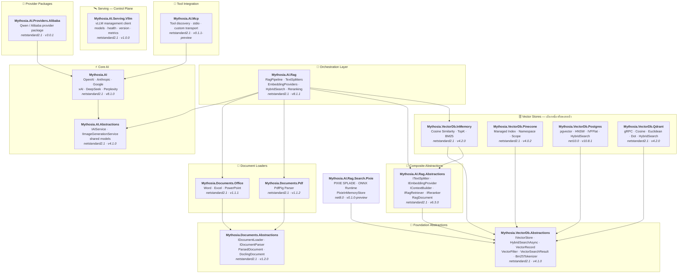

<div align="center">

🌐 [English](../../README.md) · [한국어](../ko/README.md) · [日本語](../ja/README.md) · [Français](../fr/README.md) · [Deutsch](../de/README.md) · [Русский](../ru/README.md) · [Українська](../uk/README.md) · [简体中文](../zh-Hans/README.md) · [繁體中文](../zh-Hant/README.md) · [Tiếng Việt](../vi/README.md) · [ภาษาไทย](README.md) · [Português](../pt/README.md) · [Español](../es/README.md)

<br>

[](https://github.com/AJ-comp/Mythosia.AI)


### ไลบรารี .NET แบบโมดูลสำหรับสร้างแอปพลิเคชัน AI อัจฉริยะ

**เปลี่ยน provider เชื่อม RAG โหลดเอกสาร — ทั้งหมดผ่าน API เดียว**

<br>

[](https://www.nuget.org/packages/Mythosia.AI)
[](https://www.nuget.org/packages/Mythosia.AI)
[](https://aj-comp.github.io/Mythosia.AI/)
[](https://dotnet.microsoft.com)

<br>

**[📖 เริ่มต้นใช้งาน](https://aj-comp.github.io/Mythosia.AI/)** &nbsp;·&nbsp; **[API Reference](https://aj-comp.github.io/Mythosia.AI/api/)** &nbsp;·&nbsp; **[GitHub ↗](https://github.com/AJ-comp/Mythosia.AI)**

<br>

</div>

สำหรับ TXT และ Markdown ให้เลือก[ตัวแบ่งตามกฎ](text-splitters.md) ตามโครงสร้างเอกสาร มีการตรวจขนาด overlap และขอบเขต Unicode พร้อมเก็บหัวข้อ โค้ด และแถวตารางของ Markdown จำนวนอักขระหรือคำไม่ใช่เพดาน token ของโมเดล เงื่อนไขตารางและการเยื้องโค้ดยังคงความหมายเดิม ส่วนการทำซ้ำบริบท Markdown ที่มากเกินไปจะหยุดด้วยข้อยกเว้นที่ชัดเจน

เพื่อไม่ให้การทำดัชนีที่ดูเหมือนสำเร็จเขียนทับชังก์หรือจับคู่เวกเตอร์ผิด [การตรวจสอบดัชนี](rag-pipeline.md#indexing-validation) จะปฏิเสธ ID และ batch embedding ที่ไม่ถูกต้องก่อนบันทึก ตัวแบ่งที่กำหนดเองต้องสร้าง ID ที่ไม่ซ้ำและสืบทอดเมทาดาทาของเอกสาร

[ID ไฟล์ที่คงที่](document-loaders.md#file-source-identity) [การตรวจสอบเวกเตอร์คำถาม](rag-embedding.md#query-embedding-validation) และ[การจัดเก็บรายเอกสารพร้อมยกเลิก URL](rag-pipeline.md#custom-persistence) ช่วยป้องกันการลงทะเบียนซ้ำ การค้นหาที่ผิด และชิ้นข้อมูลเก่าค้างอยู่

แพ็กเกจพรีวิวเสริม `Mythosia.AI.Rag.Search.Pixie` ใช้เปรียบเทียบการค้นหานิวรัลแบบ sparse ในเครื่องกับการค้นหาเดิม โดยคงผู้ให้บริการ dense embedding และเก็บดัชนี PIXIE ในหน่วยความจำ ไม่ย้ายสโตร์ถาวรหรือเปลี่ยนการค้นหาเริ่มต้นโดยอัตโนมัติ [คู่มือเชื่อมต่อและเปรียบเทียบ PIXIE (ภาษาอังกฤษ)](../rag-pixie-search.md).

แยกการตั้งค่าคำขอ หยุดงาน และรับคำตอบพร้อมการใช้โทเค็นและแหล่งที่มา [คู่มือย้ายไป v8](v8-migration.md) รวมการเปลี่ยนสถาปัตยกรรมหกด้าน ตัวอย่าง และขอบเขตการตรวจสอบ

> เวอร์ชันแพ็กเกจที่เอกสารนี้อ้างอิง: [Mythosia.AI 8.1.0](../../src/core/Mythosia.AI/RELEASE_NOTES.md#v810), [Abstractions 4.1.0](../../src/core/Mythosia.AI.Abstractions/RELEASE_NOTES.md#v410), [Alibaba 3.0.1](../../src/core/Mythosia.AI.Providers.Alibaba/RELEASE_NOTES.md#v301), [RAG 8.1.1](../../src/rag/Mythosia.AI.Rag/RELEASE_NOTES.md#v811), [PostgreSQL 10.8.1](../../src/vectordb/Mythosia.VectorDb.Postgres/RELEASE_NOTES.md#v1081), [MCP 0.1.1-preview](../../src/integrations/Mythosia.AI.Mcp/RELEASE_NOTES.md#v011-preview), [Serving.Vllm 1.0.0](../../src/serving/Mythosia.AI.Serving.Vllm/RELEASE_NOTES.md#v100).

> [แพตช์ RAG 8.1.1 / PostgreSQL 10.8.1](https://github.com/AJ-comp/Mythosia.AI/blob/main/RELEASE_NOTES.md#v811): แรปเปอร์ RAG ที่เชื่อมต่ออยู่แล้วจะรับการเปลี่ยนตัวเขียนคำถามใหม่ระหว่างทำงาน และการค้นหาไฮบริดแบบผสมของ PostgreSQL จะใช้การตั้งค่าค้นหาเวกเตอร์ที่กำหนดไว้ แพ็กเกจหลัก `Mythosia.AI` ยังคงเป็น 8.1.0

---

### ติดตั้ง Package ไหน?

```
dotnet add package Mythosia.AI                    # เริ่มจากนี้ (แค่นี้ก็พอ)
dotnet add package Mythosia.AI.Rag                # เพิ่มเติม: ถ้าต้องการ RAG
dotnet add package Mythosia.VectorDb.Postgres     # เพิ่มเติม: ถ้าต้องการ vector store สำหรับ production
```

| ขั้นตอน | Package | เมื่อไหร่ |
| :--: | --- | --- |
| **1** | **`Mythosia.AI`** | **เริ่มจากนี้** — สร้างข้อความ streaming เรียกฟังก์ชัน structured output (OpenAI / Claude / Gemini / Grok / DeepSeek / Perplexity) |
| **2** | **`Mythosia.AI.Rag`** | เมื่อต้องการ RAG — แบ่งข้อความ embedding hybrid search reranking InMemory store document loaders (Word / Excel / PowerPoint / PDF) |
| **3** | **`Mythosia.VectorDb.Postgres`** / **`Qdrant`** / **`Pinecone`** | เมื่อต้องการ vector store สำหรับ production แทน InMemory — เลือกหนึ่งตัว |

เตรียมการตั้งค่าอิสระด้วย `CreateRequest(...).WithTemperature(...).GetCompletionAsync()` ดู Before/After, Run, profile และข้อจำกัดของบทสนทนาร่วมกันใน [คู่มือคำขอ](request-building.md)

คำขอที่ต้องคำนึงถึงเวลารอสามารถเลือก[ความเร็วในการประมวลผล](request-building.md#inference-speed) ได้ `WithSpeed` คงโมเดลและระดับการคิด ส่วน `Processing` รายงานโหมดที่ใช้จริง Fast เป็นตัวเลือกเสียเงินสำหรับการผสมที่รองรับ

## สถาปัตยกรรม

<a href="../assets/architecture.svg">
  <picture>
    <source media="(prefers-color-scheme: dark)" srcset="../assets/architecture-dark.svg">
    
  </picture>
</a>

<details>
<summary>รายละเอียดการพึ่งพาของแพ็กเกจ</summary>



</details>

## Demo / ทดสอบ (Chat UI)

ค้นหาโมเดลตามชื่อหรือผู้ให้บริการและปรับการตั้งค่าทางด้านซ้าย สนทนาตรงกลาง และดูข้อมูลการประมวลผลใน Inspector ทางด้านขวาเพื่อทดลองก่อนนำไปใช้ในแอปพลิเคชัน กด Stop เพื่อหยุดรอคำตอบ โดยจะเลือกความเร็วได้เฉพาะกับโมเดลและจุดเชื่อมต่อที่รองรับ และ Fast อาจมีค่าใช้จ่ายเพิ่มเติม บนหน้าจอขนาดเล็ก Models และ Inspector จะเปิดเป็นแผงเลื่อน ดูวิธีรันในเครื่อง เพิ่มเอกสาร และตั้งค่ากระบวนการค้นคืนได้ใน[คู่มือ Chat UI](https://github.com/AJ-comp/Mythosia.AI/blob/main/apps/Mythosia.AI.Samples.ChatUi/README.md)

ใช้ตัวเลือกภาษาด้านบนเพื่อสลับภาษาหน้าจอได้ 13 ภาษา โดยไม่สูญเสียข้อความที่พิมพ์หรือการตั้งค่า ผู้ให้บริการทั้งเจ็ดรายจะแสดงเป็นกลุ่มที่พับไว้ เลือกขยายกลุ่มหรือค้นหาโมเดลได้

### รันตัวอย่าง

รัน **`Mythosia.AI.Samples.ChatUi`** บนเครื่องของคุณ:

```bash
# จาก root ของ repository
dotnet run --project apps/Mythosia.AI.Samples.ChatUi
```

ชมวิดีโอที่บันทึกจากหน้าจอ Playground เวอร์ชันปัจจุบัน ซึ่งแสดงการเลือกดูโมเดล การสลับภาษา และการตั้งค่าเอกสารกับกระบวนการ RAG คลิกภาพเพื่อเล่นวิดีโอ

[](https://aj-comp.github.io/Mythosia.AI/docs/playground-demo.html)

## เริ่มต้นอย่างรวดเร็ว

### สร้างข้อความพื้นฐาน

```csharp
using Mythosia.AI;

var service = new OpenAIService(apiKey, httpClient);
var response = await service.GetCompletionAsync("สวัสดี!");
```

### Streaming

ตัวอย่างนี้ใช้ `service.StreamAsync` แบบรับอินพุตเดิมที่เก็บไว้เพื่อความเข้ากันได้ โค้ดใหม่ดู[การอ่านสตรีมผ่าน Run](execution-api-transition.md)

```csharp
await foreach (var token in service.StreamAsync("เล่าเรื่องให้ฟังหน่อย"))
{
    Console.Write(token);
}
```

### Streaming พร้อม reasoning

OpenAI, Claude, Gemini, Grok และ DeepSeek Flash ส่งเนื้อหาการใช้เหตุผลของผู้ให้บริการผ่านรูปแบบ streaming เดียวกัน เปิดการใช้เหตุผลในบริการหรือคำขอ แล้วสังเกตด้วย `StreamOptions.WithReasoning()`:

```csharp
await foreach (var content in service.StreamAsync(message, new StreamOptions().WithReasoning()))
{
    if (content.Type == StreamingContentType.Reasoning)
        Console.Write($"[คิด] {content.Content}");
    else if (content.Type == StreamingContentType.Text)
        Console.Write(content.Content);
}
```

### การเรียกใช้ฟังก์ชัน

```csharp
var service = new OpenAIService(apiKey, httpClient)
    .WithFunction(
        "get_weather",
        "ดึงข้อมูลสภาพอากาศปัจจุบันของสถานที่",
        ("location", "ชื่อเมืองและประเทศ", required: true),
        (string location) => $"สภาพอากาศที่ {location} แดดออก 32°C"
    );

var response = await service.GetCompletionAsync("อากาศที่กรุงเทพเป็นอย่างไร?");
```

หากมีงานที่ทำได้โดยไม่ต้องรอผล เช่น อธิบายของที่ควรเตรียมเดินทางระหว่างเครื่องมือกำลังดึงข้อมูลอากาศ โมเดลสามารถทำส่วนนั้นก่อนได้โดยไม่ต้องหยุดรอทั้งคำตอบ ใช้ `FunctionDefinition.AllowAsync = true` หรือ `FunctionBuilder.WithAsync()` เพื่อเลือกอนุญาตการเรียกเครื่องมือแบบอะซิงโครนัสของ GPT-6 Astra / Sol / Luna ผ่าน Responses ค่าเริ่มต้นคือ `false` ส่วนโมเดลที่ไม่รองรับจะรอผลจาก handler เดิม ดูตัวอย่างและอายุของคำขอใน[คู่มือการเรียกฟังก์ชัน](function-calling.md)

หากคำตอบต้องใช้ข้อมูลใหม่หรือหลักฐานจากเอกสาร ดู[คู่มือการให้เหตุผลและการค้นหา](reasoning-and-search.md) เพื่อเปิดการค้นหาเว็บหรือใช้ที่เก็บเอกสารที่มีอยู่ผ่านตัวเลือกร่วม และรับแหล่งอ้างอิงของคำตอบ

### Structured output (พื้นฐาน)

```csharp
// Deserialize ผลลัพธ์ LLM เป็น C# POCO โดยตรง พร้อม auto-recovery
var result = await service.GetCompletionAsync<WeatherResponse>(
    "อากาศที่กรุงเทพเป็นอย่างไร?");
```

### Structured output (รายการ)

```csharp
// Collection ทำงานได้โดยตรง ไม่ต้องมี wrapper
var items = await service.GetCompletionAsync<List<ItemDto>>(
    "ดึง entity ทั้งหมดจากเอกสารนี้...");
```

### Structured output (streaming)

```csharp
// Stream fragment แบบ real-time + รับ object ที่ deserialize แล้วเมื่อเสร็จ
var run = service.BeginStream(prompt).As<MyDto>();

await foreach (var chunk in run.Stream())
    Console.Write(chunk);          // UI real-time

MyDto dto = await run.Result;      // parse และ auto-recovery แล้ว
```

### นโยบายสรุปบทสนทนา

```csharp
// สรุปข้อความเก่าอัตโนมัติเมื่อบทสนทนายาว
service.ConversationPolicy = SummaryConversationPolicy.ByMessage(
    triggerCount: 20,
    keepRecentCount: 5
);

// Trigger ตามจำนวน token
service.ConversationPolicy = SummaryConversationPolicy.ByToken(
    triggerTokens: 3000,
    keepRecentTokens: 1000
);

// ใช้งานตามปกติ — การสรุปเกิดขึ้นอัตโนมัติ
await service.GetCompletionAsync("ต่อการสนทนา...");

// เมื่อ streaming ให้เรียก policy สรุปก่อน StreamAsync()
await service.ApplySummaryPolicyIfNeededAsync();
await foreach (var chunk in service.StreamAsync("ต่อไป..."))
    Console.Write(chunk.Content);

// บันทึก/โหลดสรุประหว่าง session
string saved = service.ConversationPolicy.CurrentSummary;
policy.LoadSummary(saved);
```

### RAG (Retrieval-Augmented Generation)

เลือกค้นหาคำ ความหมาย หรือ hybrid โดยไม่บังคับ embedding ทุกคำถาม [คู่มือ](rag-hybrid-search.md)

```bash
dotnet add package Mythosia.AI.Rag
```

```csharp
using Mythosia.AI.Rag;

var service = new AnthropicService(apiKey, httpClient)
    .WithRag(rag => rag
        .AddDocument("manual.txt")
        .AddDocument("policy.txt")
    );

var response = await service.GetCompletionAsync("นโยบายการคืนสินค้าคืออะไร?");
```

## Provider ที่รองรับ

> Grok 4.7: ต้องใช้ Mythosia.AI 8.1.0 / Abstractions 4.1.0 [การเลือกโมเดล การให้เหตุผล และความเร็ว](providers.md#grok-47)

> GPT-6 Sol/Luna: ต้องใช้ Mythosia.AI 8.1.0 / Abstractions 4.1.0 [การเลือกโมเดลและรุ่นที่ต้องใช้](providers.md#gpt-6-sol-luna)

> Claude Opus 5.5: ต้องใช้ Mythosia.AI 8.1.0 / Abstractions 4.1.0 [การตั้งค่าและการย้ายมาใช้](providers.md#claude-opus-55)

| Provider | Package | Model |
| --- | --- | --- |
| **OpenAI** | `Mythosia.AI` | GPT-6 Astra / Sol / Luna, GPT-5.6 Sol / Terra / Luna, GPT-5.5 / 5.5 Pro / 5.4 / 5.4 Mini / 5.4 Nano / 5.4 Pro / 5.3 Codex / 5.2 / 5.2 Pro / 5.1, GPT-4.1 / 4.1 Mini, GPT-4o / 4o Mini |
| **Anthropic** | `Mythosia.AI` | Claude Fable 5.1 / 5, Mythos 5.1 / 5 (limited), [Opus 5.5](providers.md#claude-opus-55) / 5 / 4.8 / 4.7 / 4.6 / 4.5, Sonnet 5 / 4.6 / 4.5, Haiku 4.5 |
| **Google** | `Mythosia.AI` | Gemini 3.8 Flash, Gemini 3.7 Flash, Gemini 3.6 Flash, Gemini 3.5 Flash/Flash-Lite, Gemini 3.1 Pro Preview/Flash-Lite, Gemini 3 Flash Preview, Gemini 2.5 Pro/Flash/Flash-Lite, Gemini 3.1 Flash Image, Gemini 3.1 Flash-Lite Image, Gemini 3 Pro Image |
| **xAI** | `Mythosia.AI` | Grok 4.7, Grok 4.6, Grok 4.5 (ค่าเริ่มต้น), Grok 4.3, Grok 4.20 (reasoning / non-reasoning), Grok Build |
| **DeepSeek** | `Mythosia.AI` | Flash (V4.1 Flash), V4 Pro |
| **Perplexity** | `Mythosia.AI` | Preset ของ Agent API และ `perplexity/sonar` |
| **Alibaba / Qwen** | `Mythosia.AI.Providers.Alibaba` | Qwen Max / Plus / Turbo / Qwen3 / Qwen3.5 variants |

ใช้ Perplexity เมื่อคำตอบต้องอาศัยข้อมูลล่าสุดและมีแหล่งอ้างอิงให้ผู้อ่านตรวจสอบ `PerplexityService` เรียก Agent API ส่วนการค้นหาและ embedding แบบแยกใช้สร้างการดึงเอกสารให้โมเดลตอบคำถามที่คุณเลือกได้ [Perplexity Agent API การค้นหา และ embedding](perplexity.md).

สำหรับการตรวจเอกสารยาวหรืองานที่เรียกเครื่องมือหลายรอบ สามารถเลือก Gemini 3.7 Flash หรือ 3.8 Flash ผ่านอะแดปเตอร์ Google เดิมได้ รองรับตั้งแต่ `Mythosia.AI` 8.0.0 / `Mythosia.AI.Abstractions` 4.0.0 โดยโมเดลเริ่มต้นยังเป็น Gemini 3.6 Flash

หากต้องการร่างอย่างรวดเร็วแล้วตรวจทานเชิงลึก ให้เลือก Grok 4.6 อย่างชัดเจนและตั้งระดับ `Low` ถึง `XHigh` รองรับตั้งแต่ `Mythosia.AI` 8.0.0 / `Mythosia.AI.Abstractions` 4.0.0 โดย `XAIService` ยังใช้ Grok 4.5 เป็นค่าเริ่มต้น ดู[การตั้งค่า Grok](providers.md#xai-xaiservice)

สร้างภาพร่างหรือรวมภาพอ้างอิงด้วย [Grok Imagine Image 2.0](providers.md#grok-imagine-image-20) ผ่าน `IImageGenerationService` ใช้ `OutputFormat = ImageOutputFormat.Auto` และเลือกนามสกุลตาม `MediaType` เพราะ xAI เลือก codec ไม่ได้ ดู[การย้ายตัวเลือกภาพ](providers.md#image-options-migration) โมเดลแชตไม่เปลี่ยน

เลือก Flare สำหรับภาพร่างที่รวดเร็ว และ Sunburst สำหรับการแก้ไขอย่างแม่นยำ [การสร้างและแก้ไขภาพ GPT Image 2.5](providers.md#gpt-image-25) ใช้ API ภาพเดิมโดยระบุโมเดลต่อคำขอ ค่าเริ่มต้นของ OpenAI ยังคงเป็น GPT Image 2

เลือกขนาดที่ใช้ได้ในการสร้างหรือแก้ไขภาพจาก[ตัวเลือกภาพ Google แยกตามโมเดล](providers.md#google-image-options) Flash รองรับ 512/1K/2K/4K, Flash-Lite รองรับ 1K ในขณะนี้ และ Pro รองรับ 1K/2K/4K โดย Flash/Lite มีอัตราส่วน 14 แบบ ส่วน Pro มี 10 แบบมาตรฐาน ทั้งหมดรับ `Auto` หากระบุขนาดหรืออัตราส่วนที่ไม่รองรับ ระบบจะปฏิเสธก่อนส่ง HTTP

สำหรับวิเคราะห์กราฟ ภาพหน้าจอ เรียกฟังก์ชันภายใน หรือตรวจคำตอบเชิงลึก ใช้ [DeepSeek Flash](providers.md#deepseek-deepseekservice) (`AIModels.DeepSeek.Flash`, V4.1 Flash) การใช้เหตุผลปิดโดยค่าเริ่มต้น เปิดด้วย `WithDeepSeekReasoning(...)` หรือ `WithReasoning(...)` ต่อคำขอ

งานข้อความล้วนเลือก `AIModels.DeepSeek.V4Pro` (`deepseek-v4-pro`, V4-Pro-0813) ได้ Flash ยังเป็นค่าเริ่มต้นและรองรับภาพ ทั้งสองรองรับเหตุผล Low/High/Max และขีดจำกัดเอาต์พุตเดียวกัน ตั้ง `UseResponsesApi = true` ก่อนสร้างคำขอเพื่อใช้ Responses ผ่าน API completion, streaming, Run และฟังก์ชันภายในเดิม ค่าเริ่มต้นยังเป็น `false` เพื่อคง Chat Completions ของแอปเดิม และจะเก็บตัวเลือกนี้ตลอดคำขอรวมรอบเครื่องมือ Responses ส่งประวัติสนทนาและเหตุผลต้นฉบับทั้งหมดซ้ำ โดยไม่พึ่ง ID คำตอบที่เก็บบนเซิร์ฟเวอร์

ใช้ภาพที่อัปโหลดซ้ำในหลายคำถามกับ Flash ผ่าน `DeepSeekImageFileContent` ได้ทั้ง Chat Completions และ Responses ส่วน V4 Pro รองรับเฉพาะข้อความและปฏิเสธภาพ ต้องใช้ Mythosia.AI 8.1.0 / Abstractions 4.1.0 [การอัปโหลด ใช้ภาพซ้ำ และข้อจำกัด](providers.md#deepseek-deepseekservice)

## Package ทั้งหมด

### Core

| Package | NuGet | คำอธิบาย |
| --- | --- | --- |
| [Mythosia.AI](../../src/core/Mythosia.AI/README.md) | [](https://www.nuget.org/packages/Mythosia.AI) | ไลบรารี core — provider ในตัว streaming เรียกฟังก์ชัน และรองรับ multimodal |
| [Mythosia.AI.Abstractions](../../src/core/Mythosia.AI.Abstractions/README.md) | [](https://www.nuget.org/packages/Mythosia.AI.Abstractions) | Interface `IAIService` และ model ร่วม — contract package สำหรับไลบรารี |
| [Mythosia.AI.Providers.Alibaba](../../src/core/Mythosia.AI.Providers.Alibaba/README.md) | [](https://www.nuget.org/packages/Mythosia.AI.Providers.Alibaba) | Package provider Alibaba / Qwen บน `Mythosia.AI` |

### RAG

| Package | NuGet | คำอธิบาย |
| --- | --- | --- |
| [Mythosia.AI.Rag](../../src/rag/Mythosia.AI.Rag/README.md) | [](https://www.nuget.org/packages/Mythosia.AI.Rag) | Fluent extension RAG สำหรับ IAIService ด้วย API `.WithRag()` |
| [Mythosia.AI.Rag.Abstractions](../../src/rag/Mythosia.AI.Rag.Abstractions/README.md) | [](https://www.nuget.org/packages/Mythosia.AI.Rag.Abstractions) | Interface และ model ของ component ใน RAG pipeline |

### Document Loaders

| Package | NuGet | คำอธิบาย |
| --- | --- | --- |
| [Mythosia.Documents.Abstractions](../../src/loaders/Mythosia.Documents.Abstractions/README.md) | [](https://www.nuget.org/packages/Mythosia.Documents.Abstractions) | Interface และ model ของ document loader (`IDocumentLoader`, `DoclingDocument`) |
| [Mythosia.Documents.Office](../../src/loaders/Mythosia.Documents.Office/README.md) | [](https://www.nuget.org/packages/Mythosia.Documents.Office) | Parser OpenXml สำหรับ Word / Excel / PowerPoint |
| [Mythosia.Documents.Pdf](../../src/loaders/Mythosia.Documents.Pdf/README.md) | [](https://www.nuget.org/packages/Mythosia.Documents.Pdf) | Parser PDF โดยใช้ PdfPig |

### Vector Stores

> **เลือกหนึ่งหรือหลายตัว** — ทุกตัว implement `IVectorStore` จาก package Abstractions

| Package | NuGet | คำอธิบาย |
| --- | --- | --- |
| [Mythosia.VectorDb.Abstractions](../../src/vectordb/Mythosia.VectorDb.Abstractions/README.md) | [](https://www.nuget.org/packages/Mythosia.VectorDb.Abstractions) | Contract `IVectorStore` · `VectorRecord` · `VectorFilter` |
| [Mythosia.VectorDb.InMemory](../../src/vectordb/Mythosia.VectorDb.InMemory/README.md) | [](https://www.nuget.org/packages/Mythosia.VectorDb.InMemory) | Store ใน RAM — ไม่ต้องมี infrastructure เหมาะสำหรับ prototype |
| [Mythosia.VectorDb.Pinecone](../../src/vectordb/Mythosia.VectorDb.Pinecone/README.md) | [](https://www.nuget.org/packages/Mythosia.VectorDb.Pinecone) | Pinecone HTTP API — แยกตาม index/namespace/scope |
| [Mythosia.VectorDb.Postgres](../../src/vectordb/Mythosia.VectorDb.Postgres/README.md) | [](https://www.nuget.org/packages/Mythosia.VectorDb.Postgres) | PostgreSQL + pgvector — index HNSW / IVFFlat พร้อม production |
| [Mythosia.VectorDb.Qdrant](../../src/vectordb/Mythosia.VectorDb.Qdrant/README.md) | [](https://www.nuget.org/packages/Mythosia.VectorDb.Qdrant) | Qdrant gRPC client — Cosine / Euclidean / Dot auto-provision |

### Serving — Control Plane

> Client สำหรับจัดการ/ตรวจสอบ runtime ที่ serve model — แชทยังคงอยู่บน package ของ provider: `Providers.*` = data plane ของแชท, `Serving.*` = control plane ของ server

| Package | NuGet | คำอธิบาย |
| --- | --- | --- |
| [Mythosia.AI.Serving.Vllm](../../src/serving/Mythosia.AI.Serving.Vllm/README.md) | [](https://www.nuget.org/packages/Mythosia.AI.Serving.Vllm) | Client control-plane ของ vLLM — model card (model ที่โหลดจริงผ่าน `root`) health เวอร์ชันของ server และ Prometheus metrics |

## โครงสร้าง Repository

```text
src/
  core/
    Mythosia.AI/                        # ไลบรารี AI หลัก
    Mythosia.AI.Abstractions/           # Interface IAIService และ model ร่วม
    Mythosia.AI.Providers.Alibaba/      # Package provider Alibaba / Qwen
  loaders/
    Mythosia.Documents.Abstractions/    # Contract document loader (IDocumentLoader, DoclingDocument)
    Mythosia.Documents.Office/          # Loader เอกสาร Office (Word/Excel/PowerPoint)
    Mythosia.Documents.Pdf/             # Loader เอกสาร PDF
  rag/
    Mythosia.AI.Rag/                    # RAG Fluent API และ pipeline
    Mythosia.AI.Rag.Abstractions/       # Interface และ model RAG (RagDocument)
  serving/
    Mythosia.AI.Serving.Vllm/           # Client control-plane ของ vLLM (models/health/version/metrics)
  vectordb/
    Mythosia.VectorDb.Abstractions/     # Contract vector store
    Mythosia.VectorDb.InMemory/         # Vector store ใน RAM
    Mythosia.VectorDb.Pinecone/         # Vector store Pinecone
    Mythosia.VectorDb.Postgres/         # PostgreSQL + pgvector
    Mythosia.VectorDb.Qdrant/           # Vector store Qdrant
apps/                                   # แอปพลิเคชันตัวอย่าง
tests/                                  # Project test unit / integration
```

## การติดตั้ง

```bash
dotnet add package Mythosia.AI
```

สำหรับ LINQ operation ขั้นสูงกับ stream:

```bash
dotnet add package System.Linq.Async
```

## เอกสาร

- [คู่มือเริ่มต้น](getting-started.md)
- [README Mythosia.AI](../../src/core/Mythosia.AI/README.md) — API reference ฉบับสมบูรณ์: เรียกฟังก์ชัน streaming และตั้งค่า model
- [README Mythosia.AI.Rag](../../src/rag/Mythosia.AI.Rag/README.md) — การใช้งาน RAG pipeline และ custom implementation
- [คู่มือ loader](document-loaders.md)
- [Release notes](../../src/core/Mythosia.AI/RELEASE_NOTES.md)

## สัญญาอนุญาต

โปรเจกต์นี้เผยแพร่ภายใต้ [สัญญาอนุญาต MIT](https://github.com/AJ-comp/Mythosia.AI/blob/main/LICENSE)

## ที่มา

เดิมโปรเจกต์นี้เป็นส่วนหนึ่งของ [Mythosia](https://github.com/AJ-comp/Mythosia)

[สร้างตัวเลือกโมเดลจากคำนิยามการรองรับร่วมกัน](model-capabilities.md).
