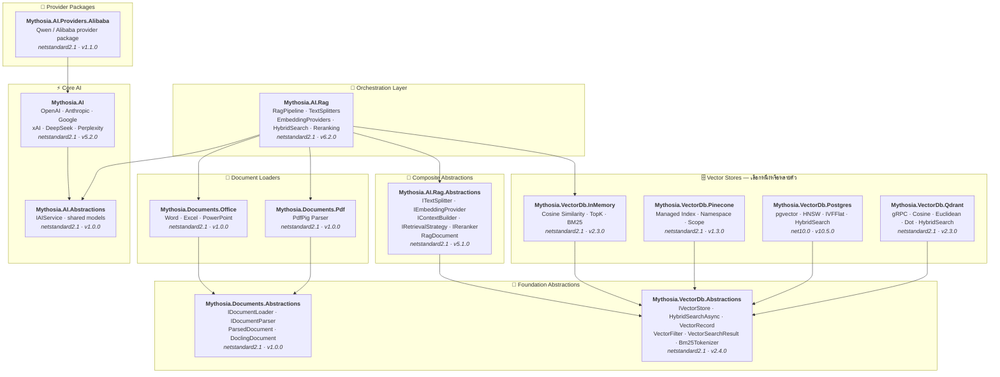

<div align="center">

🌐 [English](../../README.md) · [한국어](../ko/README.md) · [日本語](../ja/README.md) · [Français](../fr/README.md) · [Deutsch](../de/README.md) · [Русский](../ru/README.md) · [Українська](../uk/README.md) · [简体中文](../zh-Hans/README.md) · [繁體中文](../zh-Hant/README.md) · [Tiếng Việt](../vi/README.md) · [ภาษาไทย](README.md) · [Português](../pt/README.md) · [Español](../es/README.md)

<br>

[](https://github.com/AJ-comp/Mythosia.AI)


### ไลบรารี .NET แบบโมดูลสำหรับสร้างแอปพลิเคชัน AI อัจฉริยะ

**เปลี่ยน provider เชื่อม RAG โหลดเอกสาร — ทั้งหมดผ่าน API เดียว**

<br>

[](https://www.nuget.org/packages/Mythosia.AI)
[](https://www.nuget.org/packages/Mythosia.AI)
[](https://aj-comp.github.io/Mythosia.AI/)
[](https://dotnet.microsoft.com)

<br>

**[📖 เริ่มต้นใช้งาน](https://aj-comp.github.io/Mythosia.AI/)** &nbsp;·&nbsp; **[API Reference](https://aj-comp.github.io/Mythosia.AI/api/)** &nbsp;·&nbsp; **[GitHub ↗](https://github.com/AJ-comp/Mythosia.AI)**

<br>

</div>

---

### ติดตั้ง Package ไหน?

```
dotnet add package Mythosia.AI                    # เริ่มจากนี้ (แค่นี้ก็พอ)
dotnet add package Mythosia.AI.Rag                # เพิ่มเติม: ถ้าต้องการ RAG
dotnet add package Mythosia.VectorDb.Postgres     # เพิ่มเติม: ถ้าต้องการ vector store สำหรับ production
```

| ขั้นตอน | Package | เมื่อไหร่ |
| :--: | --- | --- |
| **1** | **`Mythosia.AI`** | **เริ่มจากนี้** — สร้างข้อความ streaming เรียกฟังก์ชัน structured output (OpenAI / Claude / Gemini / Grok / DeepSeek / Perplexity) |
| **2** | **`Mythosia.AI.Rag`** | เมื่อต้องการ RAG — แบ่งข้อความ embedding hybrid search reranking InMemory store document loaders (Word / Excel / PowerPoint / PDF) |
| **3** | **`Mythosia.VectorDb.Postgres`** / **`Qdrant`** / **`Pinecone`** | เมื่อต้องการ vector store สำหรับ production แทน InMemory — เลือกหนึ่งตัว |

## สถาปัตยกรรม



## Demo / ทดสอบ (Chat UI)

Repository นี้มีตัวอย่าง Chat UI ที่สร้างบน Mythosia.AI — รัน `Mythosia.AI.Samples.ChatUi` เพื่อลองใช้ไลบรารีจริง

### รันตัวอย่าง

รัน **`Mythosia.AI.Samples.ChatUi`** บนเครื่องของคุณ:

```bash
# จาก root ของ repository
dotnet run --project samples/Mythosia.AI.Samples.ChatUi
```

https://github.com/user-attachments/assets/62094afe-9add-4c14-b818-6b31f200dc01


## เริ่มต้นอย่างรวดเร็ว

### สร้างข้อความพื้นฐาน

```csharp
using Mythosia.AI;

var service = new OpenAIService(apiKey, httpClient);
var response = await service.GetCompletionAsync("สวัสดี!");
```

### Streaming

```csharp
await foreach (var token in service.StreamAsync("เล่าเรื่องให้ฟังหน่อย"))
{
    Console.Write(token);
}
```

### Streaming พร้อม reasoning

Provider ที่รองรับ reasoning ทั้งหมด (OpenAI, Claude, Gemini, Grok, DeepSeek) ใช้ pattern เดียวกัน:

```csharp
await foreach (var content in service.StreamAsync(message, new StreamOptions().WithReasoning()))
{
    if (content.Type == StreamingContentType.Reasoning)
        Console.Write($"[คิด] {content.Content}");
    else if (content.Type == StreamingContentType.Text)
        Console.Write(content.Content);
}
```

### การเรียกใช้ฟังก์ชัน

```csharp
var service = new OpenAIService(apiKey, httpClient)
    .WithFunction(
        "get_weather",
        "ดึงข้อมูลสภาพอากาศปัจจุบันของสถานที่",
        ("location", "ชื่อเมืองและประเทศ", required: true),
        (string location) => $"สภาพอากาศที่ {location} แดดออก 32°C"
    );

var response = await service.GetCompletionAsync("อากาศที่กรุงเทพเป็นอย่างไร?");
```

### Structured output (พื้นฐาน)

```csharp
// Deserialize ผลลัพธ์ LLM เป็น C# POCO โดยตรง พร้อม auto-recovery
var result = await service.GetCompletionAsync<WeatherResponse>(
    "อากาศที่กรุงเทพเป็นอย่างไร?");
```

### Structured output (รายการ)

```csharp
// Collection ทำงานได้โดยตรง ไม่ต้องมี wrapper
var items = await service.GetCompletionAsync<List<ItemDto>>(
    "ดึง entity ทั้งหมดจากเอกสารนี้...");
```

### Structured output (streaming)

```csharp
// Stream fragment แบบ real-time + รับ object ที่ deserialize แล้วเมื่อเสร็จ
var run = service.BeginStream(prompt).As<MyDto>();

await foreach (var chunk in run.Stream())
    Console.Write(chunk);          // UI real-time

MyDto dto = await run.Result;      // parse และ auto-recovery แล้ว
```

### นโยบายสรุปบทสนทนา

```csharp
// สรุปข้อความเก่าอัตโนมัติเมื่อบทสนทนายาว
service.ConversationPolicy = SummaryConversationPolicy.ByMessage(
    triggerCount: 20,
    keepRecentCount: 5
);

// Trigger ตามจำนวน token
service.ConversationPolicy = SummaryConversationPolicy.ByToken(
    triggerTokens: 3000,
    keepRecentTokens: 1000
);

// ใช้งานตามปกติ — การสรุปเกิดขึ้นอัตโนมัติ
await service.GetCompletionAsync("ต่อการสนทนา...");

// เมื่อ streaming ให้เรียก policy สรุปก่อน StreamAsync()
await service.ApplySummaryPolicyIfNeededAsync();
await foreach (var chunk in service.StreamAsync("ต่อไป..."))
    Console.Write(chunk.Content);

// บันทึก/โหลดสรุประหว่าง session
string saved = service.ConversationPolicy.CurrentSummary;
policy.LoadSummary(saved);
```

### RAG (Retrieval-Augmented Generation)

```bash
dotnet add package Mythosia.AI.Rag
```

```csharp
using Mythosia.AI.Rag;

var service = new AnthropicService(apiKey, httpClient)
    .WithRag(rag => rag
        .AddDocument("manual.txt")
        .AddDocument("policy.txt")
    );

var response = await service.GetCompletionAsync("นโยบายการคืนสินค้าคืออะไร?");
```

## Provider ที่รองรับ

| Provider | Package | Model |
| --- | --- | --- |
| **OpenAI** | `Mythosia.AI` | GPT-5.5 / 5.5 Pro / 5.4 / 5.4 Mini / 5.4 Nano / 5.4 Pro / 5.3 Codex / 5.2 / 5.2 Pro / 5.2 Codex / 5.1 / 5 / 5 Pro / 5 Mini / 5 Nano, GPT-4.1 / 4.1 Mini / 4.1 Nano, GPT-4o / 4o Mini, o3 / o3 Pro |
| **Anthropic** | `Mythosia.AI` | Claude Opus 4.8 / 4.7 / 4.6 / 4.5 / 4.1 / 4, Sonnet 4.6 / 4.5, Haiku 4.5 |
| **Google** | `Mythosia.AI` | Gemini 3.1 Pro Preview, Gemini 3.5 Flash, Gemini 3 Flash Preview, Gemini 3.1 Flash-Lite, Gemini 2.5 Pro/Flash/Flash-Lite |
| **xAI** | `Mythosia.AI` | Grok 4.3, Grok 4.20 (reasoning / non-reasoning), Grok Build 0.1, Grok 3 Mini |
| **DeepSeek** | `Mythosia.AI` | Chat, Reasoner |
| **Perplexity** | `Mythosia.AI` | Sonar, Sonar Pro, Sonar Reasoning Pro |
| **Alibaba / Qwen** | `Mythosia.AI.Providers.Alibaba` | Qwen Max / Plus / Turbo / Qwen3 / Qwen3.5 variants |

## Package ทั้งหมด

### Core

| Package | NuGet | คำอธิบาย |
| --- | --- | --- |
| [Mythosia.AI](../../src/core/Mythosia.AI/) | [](https://www.nuget.org/packages/Mythosia.AI) | ไลบรารี core — provider ในตัว streaming เรียกฟังก์ชัน และรองรับ multimodal |
| [Mythosia.AI.Abstractions](../../src/core/Mythosia.AI.Abstractions/) | [](https://www.nuget.org/packages/Mythosia.AI.Abstractions) | Interface `IAIService` และ model ร่วม — contract package สำหรับไลบรารี |
| [Mythosia.AI.Providers.Alibaba](../../src/core/Mythosia.AI.Providers.Alibaba/) | [](https://www.nuget.org/packages/Mythosia.AI.Providers.Alibaba) | Package provider Alibaba / Qwen บน `Mythosia.AI` |

### RAG

| Package | NuGet | คำอธิบาย |
| --- | --- | --- |
| [Mythosia.AI.Rag](../../src/rag/Mythosia.AI.Rag/) | [](https://www.nuget.org/packages/Mythosia.AI.Rag) | Fluent extension RAG สำหรับ IAIService ด้วย API `.WithRag()` |
| [Mythosia.AI.Rag.Abstractions](../../src/rag/Mythosia.AI.Rag.Abstractions/) | [](https://www.nuget.org/packages/Mythosia.AI.Rag.Abstractions) | Interface และ model ของ component ใน RAG pipeline |

### Document Loaders

| Package | NuGet | คำอธิบาย |
| --- | --- | --- |
| [Mythosia.Documents.Abstractions](../../src/loaders/Mythosia.Documents.Abstractions/) | [](https://www.nuget.org/packages/Mythosia.Documents.Abstractions) | Interface และ model ของ document loader (`IDocumentLoader`, `DoclingDocument`) |
| [Mythosia.Documents.Office](../../src/loaders/Mythosia.Documents.Office/) | [](https://www.nuget.org/packages/Mythosia.Documents.Office) | Parser OpenXml สำหรับ Word / Excel / PowerPoint |
| [Mythosia.Documents.Pdf](../../src/loaders/Mythosia.Documents.Pdf/) | [](https://www.nuget.org/packages/Mythosia.Documents.Pdf) | Parser PDF โดยใช้ PdfPig |

### Vector Stores

> **เลือกหนึ่งหรือหลายตัว** — ทุกตัว implement `IVectorStore` จาก package Abstractions

| Package | NuGet | คำอธิบาย |
| --- | --- | --- |
| [Mythosia.VectorDb.Abstractions](../../src/vectordb/Mythosia.VectorDb.Abstractions/) | [](https://www.nuget.org/packages/Mythosia.VectorDb.Abstractions) | Contract `IVectorStore` · `VectorRecord` · `VectorFilter` |
| [Mythosia.VectorDb.InMemory](../../src/vectordb/Mythosia.VectorDb.InMemory/) | [](https://www.nuget.org/packages/Mythosia.VectorDb.InMemory) | Store ใน RAM — ไม่ต้องมี infrastructure เหมาะสำหรับ prototype |
| [Mythosia.VectorDb.Pinecone](../../src/vectordb/Mythosia.VectorDb.Pinecone/) | [](https://www.nuget.org/packages/Mythosia.VectorDb.Pinecone) | Pinecone HTTP API — แยกตาม index/namespace/scope |
| [Mythosia.VectorDb.Postgres](../../src/vectordb/Mythosia.VectorDb.Postgres/) | [](https://www.nuget.org/packages/Mythosia.VectorDb.Postgres) | PostgreSQL + pgvector — index HNSW / IVFFlat พร้อม production |
| [Mythosia.VectorDb.Qdrant](../../src/vectordb/Mythosia.VectorDb.Qdrant/) | [](https://www.nuget.org/packages/Mythosia.VectorDb.Qdrant) | Qdrant gRPC client — Cosine / Euclidean / Dot auto-provision |

## โครงสร้าง Repository

```text
src/
  core/
    Mythosia.AI/                        # ไลบรารี AI หลัก
    Mythosia.AI.Abstractions/           # Interface IAIService และ model ร่วม
    Mythosia.AI.Providers.Alibaba/      # Package provider Alibaba / Qwen
  loaders/
    Mythosia.Documents.Abstractions/    # Contract document loader (IDocumentLoader, DoclingDocument)
    Mythosia.Documents.Office/          # Loader เอกสาร Office (Word/Excel/PowerPoint)
    Mythosia.Documents.Pdf/             # Loader เอกสาร PDF
  rag/
    Mythosia.AI.Rag/                    # RAG Fluent API และ pipeline
    Mythosia.AI.Rag.Abstractions/       # Interface และ model RAG (RagDocument)
  vectordb/
    Mythosia.VectorDb.Abstractions/     # Contract vector store
    Mythosia.VectorDb.InMemory/         # Vector store ใน RAM
    Mythosia.VectorDb.Pinecone/         # Vector store Pinecone
    Mythosia.VectorDb.Postgres/         # PostgreSQL + pgvector
    Mythosia.VectorDb.Qdrant/           # Vector store Qdrant
samples/                                # แอปพลิเคชันตัวอย่าง
tests/                                  # Project test unit / integration
```

## การติดตั้ง

```bash
dotnet add package Mythosia.AI
```

สำหรับ LINQ operation ขั้นสูงกับ stream:

```bash
dotnet add package System.Linq.Async
```

## เอกสาร

- [คู่มือเริ่มต้น](https://github.com/AJ-comp/Mythosia.AI/wiki)
- [README Mythosia.AI](../../src/core/Mythosia.AI/README.md) — API reference ฉบับสมบูรณ์: เรียกฟังก์ชัน streaming และตั้งค่า model
- [README Mythosia.AI.Rag](../../src/rag/Mythosia.AI.Rag/README.md) — การใช้งาน RAG pipeline และ custom implementation
- [คู่มือ loader](document-loaders.md)
- [Release notes](../../src/core/Mythosia.AI/RELEASE_NOTES.md)

## สัญญาอนุญาต

โปรเจกต์นี้เผยแพร่ภายใต้ [สัญญาอนุญาต MIT](../../LICENSE)

## ที่มา

เดิมโปรเจกต์นี้เป็นส่วนหนึ่งของ [Mythosia](https://github.com/AJ-comp/Mythosia)
