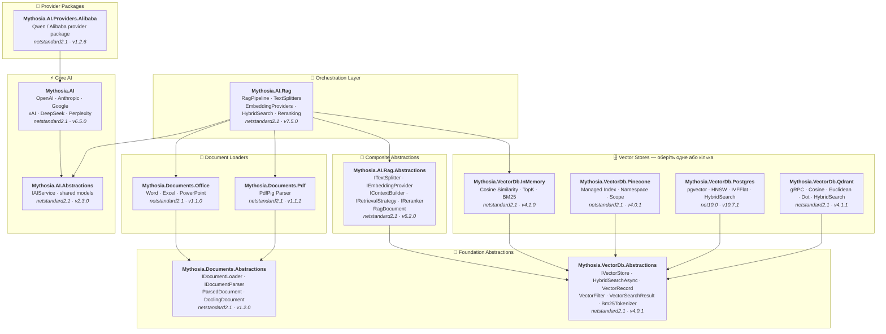

<div align="center">

🌐 [English](../../README.md) · [한국어](../ko/README.md) · [日本語](../ja/README.md) · [Français](../fr/README.md) · [Deutsch](../de/README.md) · [Русский](../ru/README.md) · [Українська](README.md) · [简体中文](../zh-Hans/README.md) · [繁體中文](../zh-Hant/README.md) · [Tiếng Việt](../vi/README.md) · [ภาษาไทย](../th/README.md) · [Português](../pt/README.md) · [Español](../es/README.md)

<br>

[](https://github.com/AJ-comp/Mythosia.AI)


### Модульна .NET-бібліотека для створення інтелектуальних застосунків

**Змінюйте провайдерів, додавайте RAG, завантажуйте документи — все через єдиний API.**

<br>

[](https://www.nuget.org/packages/Mythosia.AI)
[](https://www.nuget.org/packages/Mythosia.AI)
[](https://aj-comp.github.io/Mythosia.AI/)
[](https://dotnet.microsoft.com)

<br>

**[📖 Початок роботи](https://aj-comp.github.io/Mythosia.AI/)** &nbsp;·&nbsp; **[Довідник API](https://aj-comp.github.io/Mythosia.AI/api/)** &nbsp;·&nbsp; **[GitHub ↗](https://github.com/AJ-comp/Mythosia.AI)**

<br>

</div>

---

### Які пакети потрібно встановити?

```
dotnet add package Mythosia.AI                    # почніть звідси (це все, що потрібно)
dotnet add package Mythosia.AI.Rag                # опціонально: коли потрібен RAG
dotnet add package Mythosia.VectorDb.Postgres     # опціонально: коли потрібне продуктивне векторне сховище
```

| Крок | Пакет | Коли |
| :--: | --- | --- |
| **1** | **`Mythosia.AI`** | **Почніть звідси** — генерація тексту, стрімінг, виклик функцій, структурований вивід (OpenAI / Claude / Gemini / Grok / DeepSeek / Perplexity) |
| **2** | **`Mythosia.AI.Rag`** | Коли потрібен RAG — розбивка тексту, ембедінги, гібридний пошук, реранкінг, InMemory-сховище, завантажувачі документів (Word / Excel / PowerPoint / PDF) |
| **3** | **`Mythosia.VectorDb.Postgres`** / **`Qdrant`** / **`Pinecone`** | Коли замість InMemory потрібне продуктивне векторне сховище — оберіть одне |

## Архітектура



## Демо / тестовий стенд (Chat UI)

Цей репозиторій містить приклад Chat UI на базі Mythosia.AI — запустіть Mythosia.AI.Samples.ChatUi, щоб випробувати бібліотеку на практиці.

### Запуск прикладу

Запустіть **`Mythosia.AI.Samples.ChatUi`** локально:

```bash
# з кореня репозиторію
dotnet run --project samples/Mythosia.AI.Samples.ChatUi
```

https://github.com/user-attachments/assets/62094afe-9add-4c14-b818-6b31f200dc01


## Швидкий старт

### Базова генерація тексту

```csharp
using Mythosia.AI;

var service = new OpenAIService(apiKey, httpClient);
var response = await service.GetCompletionAsync("Hello!");
```

### Стрімінг

```csharp
await foreach (var token in service.StreamAsync("Tell me a story"))
{
    Console.Write(token);
}
```

### Стрімінг з міркуваннями

Усі провайдери з підтримкою міркувань (OpenAI, Claude, Gemini, Grok, DeepSeek) використовують однаковий патерн стрімінгу:

```csharp
await foreach (var content in service.StreamAsync(message, new StreamOptions().WithReasoning()))
{
    if (content.Type == StreamingContentType.Reasoning)
        Console.Write($"[Think] {content.Content}");
    else if (content.Type == StreamingContentType.Text)
        Console.Write(content.Content);
}
```

### Виклик функцій

```csharp
var service = new OpenAIService(apiKey, httpClient)
    .WithFunction(
        "get_weather",
        "Gets the current weather for a location",
        ("location", "The city and country", required: true),
        (string location) => $"The weather in {location} is sunny, 22C"
    );

var response = await service.GetCompletionAsync("What's the weather in Seoul?");
```

### Структурований вивід (базовий)

```csharp
// Десеріалізація відповідей LLM напряму в C# POCO з автовідновленням
var result = await service.GetCompletionAsync<WeatherResponse>(
    "What's the weather in Seoul?");
```

### Структурований вивід (список)

```csharp
// Колекції працюють напряму — жодних обгорток не потрібно
var items = await service.GetCompletionAsync<List<ItemDto>>(
    "Extract all entities from this document...");
```

### Структурований вивід (стрімінг)

```csharp
// Стрімте фрагменти тексту в реальному часі + отримуйте фінальний десеріалізований об'єкт
var run = service.BeginStream(prompt).As<MyDto>();

await foreach (var chunk in run.Stream())
    Console.Write(chunk);          // інтерфейс у реальному часі

MyDto dto = await run.Result;      // розпарсено й автоматично відновлено
```

### Політика резюмування діалогу

```csharp
// Автоматичне резюмування старих повідомлень при довгому діалозі
service.ConversationPolicy = SummaryConversationPolicy.ByMessage(
    triggerCount: 20,
    keepRecentCount: 5
);

// Тригер за кількістю токенів
service.ConversationPolicy = SummaryConversationPolicy.ByToken(
    triggerTokens: 3000,
    keepRecentTokens: 1000
);

// Використовуйте як звичайно — резюмування відбувається автоматично
await service.GetCompletionAsync("Continue our conversation...");

// При стрімінгу викличте політику резюмування явно перед StreamAsync()
await service.ApplySummaryPolicyIfNeededAsync();
await foreach (var chunk in service.StreamAsync("Continue..."))
    Console.Write(chunk.Content);

// Збереження/відновлення резюме між сесіями
string saved = service.ConversationPolicy.CurrentSummary;
policy.LoadSummary(saved);
```

### RAG (генерація з доповненим вилученням)

```bash
dotnet add package Mythosia.AI.Rag
```

```csharp
using Mythosia.AI.Rag;

var service = new AnthropicService(apiKey, httpClient)
    .WithRag(rag => rag
        .AddDocument("manual.txt")
        .AddDocument("policy.txt")
    );

var response = await service.GetCompletionAsync("What is the refund policy?");
```

## Підтримувані провайдери

| Провайдер | Пакет | Моделі |
| --- | --- | --- |
| **OpenAI** | `Mythosia.AI` | GPT-5.5 / 5.5 Pro / 5.4 / 5.4 Mini / 5.4 Nano / 5.4 Pro / 5.3 Codex / 5.2 / 5.2 Pro / 5.2 Codex / 5.1 / 5 / 5 Pro / 5 Mini / 5 Nano, GPT-4.1 / 4.1 Mini / 4.1 Nano, GPT-4o / 4o Mini, o3 / o3 Pro |
| **Anthropic** | `Mythosia.AI` | Claude Opus 4.8 / 4.7 / 4.6 / 4.5 / 4.1 / 4, Sonnet 4.6 / 4.5, Haiku 4.5 |
| **Google** | `Mythosia.AI` | Gemini 3.1 Pro Preview, Gemini 3.5 Flash, Gemini 3 Flash Preview, Gemini 3.1 Flash-Lite, Gemini 2.5 Pro/Flash/Flash-Lite |
| **xAI** | `Mythosia.AI` | Grok 4.3, Grok 4.20 (reasoning / non-reasoning), Grok Build 0.1, Grok 3 Mini |
| **DeepSeek** | `Mythosia.AI` | Chat, Reasoner |
| **Perplexity** | `Mythosia.AI` | Sonar, Sonar Pro, Sonar Reasoning Pro |
| **Alibaba / Qwen** | `Mythosia.AI.Providers.Alibaba` | Qwen Max / Plus / Turbo / Qwen3 / Qwen3.5 варіанти |

## Пакети

### Ядро

| Пакет | NuGet | Опис |
| --- | --- | --- |
| [Mythosia.AI](../../src/core/Mythosia.AI/) | [](https://www.nuget.org/packages/Mythosia.AI) | Основна бібліотека — вбудовані провайдери, стрімінг, виклик функцій та мультимодальна підтримка |
| [Mythosia.AI.Abstractions](../../src/core/Mythosia.AI.Abstractions/) | [](https://www.nuget.org/packages/Mythosia.AI.Abstractions) | Інтерфейс `IAIService` та спільні моделі — легкий контрактний пакет для бібліотек |
| [Mythosia.AI.Providers.Alibaba](../../src/core/Mythosia.AI.Providers.Alibaba/) | [](https://www.nuget.org/packages/Mythosia.AI.Providers.Alibaba) | Пакет провайдера Alibaba / Qwen на базі `Mythosia.AI` |

### RAG

| Пакет | NuGet | Опис |
| --- | --- | --- |
| [Mythosia.AI.Rag](../../src/rag/Mythosia.AI.Rag/) | [](https://www.nuget.org/packages/Mythosia.AI.Rag) | Fluent-розширення RAG для IAIService з API `.WithRag()` |
| [Mythosia.AI.Rag.Abstractions](../../src/rag/Mythosia.AI.Rag.Abstractions/) | [](https://www.nuget.org/packages/Mythosia.AI.Rag.Abstractions) | Інтерфейси та моделі компонентів RAG-пайплайну |

### Завантажувачі документів

| Пакет | NuGet | Опис |
| --- | --- | --- |
| [Mythosia.Documents.Abstractions](../../src/loaders/Mythosia.Documents.Abstractions/) | [](https://www.nuget.org/packages/Mythosia.Documents.Abstractions) | Інтерфейси та моделі завантажувачів документів (`IDocumentLoader`, `DoclingDocument`) |
| [Mythosia.Documents.Office](../../src/loaders/Mythosia.Documents.Office/) | [](https://www.nuget.org/packages/Mythosia.Documents.Office) | OpenXml-парсери для Word / Excel / PowerPoint |
| [Mythosia.Documents.Pdf](../../src/loaders/Mythosia.Documents.Pdf/) | [](https://www.nuget.org/packages/Mythosia.Documents.Pdf) | PDF-парсер на базі PdfPig |

### Векторні сховища

> **Оберіть одне або кілька** — усі реалізують `IVectorStore` з пакету Abstractions.

| Пакет | NuGet | Опис |
| --- | --- | --- |
| [Mythosia.VectorDb.Abstractions](../../src/vectordb/Mythosia.VectorDb.Abstractions/) | [](https://www.nuget.org/packages/Mythosia.VectorDb.Abstractions) | Контракти `IVectorStore` · `VectorRecord` · `VectorFilter` |
| [Mythosia.VectorDb.InMemory](../../src/vectordb/Mythosia.VectorDb.InMemory/) | [](https://www.nuget.org/packages/Mythosia.VectorDb.InMemory) | Сховище в пам'яті — без інфраструктури, ідеально для прототипування |
| [Mythosia.VectorDb.Pinecone](../../src/vectordb/Mythosia.VectorDb.Pinecone/) | [](https://www.nuget.org/packages/Mythosia.VectorDb.Pinecone) | Pinecone HTTP API — ізоляція за індексом/namespace/scope для керованої векторної БД |
| [Mythosia.VectorDb.Postgres](../../src/vectordb/Mythosia.VectorDb.Postgres/) | [](https://www.nuget.org/packages/Mythosia.VectorDb.Postgres) | PostgreSQL + pgvector — індекси HNSW / IVFFlat, готово для продакшену |
| [Mythosia.VectorDb.Qdrant](../../src/vectordb/Mythosia.VectorDb.Qdrant/) | [](https://www.nuget.org/packages/Mythosia.VectorDb.Qdrant) | Qdrant gRPC-клієнт — Cosine / Euclidean / Dot, автоматичне розгортання |

## Структура репозиторію

```text
src/
  core/
    Mythosia.AI/                        # Основна AI-бібліотека
    Mythosia.AI.Abstractions/           # Інтерфейс IAIService та спільні моделі
    Mythosia.AI.Providers.Alibaba/      # Пакет провайдера Alibaba / Qwen
  loaders/
    Mythosia.Documents.Abstractions/    # Контракти завантажувачів документів (IDocumentLoader, DoclingDocument)
    Mythosia.Documents.Office/          # Завантажувачі документів Office (Word/Excel/PowerPoint)
    Mythosia.Documents.Pdf/             # Завантажувач PDF-документів
  rag/
    Mythosia.AI.Rag/                    # RAG Fluent API та пайплайн
    Mythosia.AI.Rag.Abstractions/       # Інтерфейси та моделі RAG (RagDocument)
  vectordb/
    Mythosia.VectorDb.Abstractions/     # Контракти векторних сховищ
    Mythosia.VectorDb.InMemory/         # Векторне сховище в пам'яті
    Mythosia.VectorDb.Pinecone/         # Векторне сховище Pinecone
    Mythosia.VectorDb.Postgres/         # Сховище PostgreSQL + pgvector
    Mythosia.VectorDb.Qdrant/           # Векторне сховище Qdrant
samples/                                # Приклади застосунків
tests/                                  # Проєкти модульних / інтеграційних тестів
```

## Встановлення

```bash
dotnet add package Mythosia.AI
```

Для розширених LINQ-операцій з потоками:

```bash
dotnet add package System.Linq.Async
```

## Документація

- [Посібник з основ](https://github.com/AJ-comp/Mythosia.AI/wiki)
- [README Mythosia.AI](../../src/core/Mythosia.AI/README.md)  Повний довідник API: виклик функцій, стрімінг та налаштування моделей
- [README Mythosia.AI.Rag](../../src/rag/Mythosia.AI.Rag/README.md)  Використання RAG-пайплайну та власні реалізації
- [Посібник із завантажувачів](document-loaders.md)
- [Примітки до релізів](../../src/core/Mythosia.AI/RELEASE_NOTES.md)

## Ліцензія

Проєкт розповсюджується під [ліцензією MIT](../../LICENSE).

## Походження

Спочатку цей проєкт був частиною [Mythosia](https://github.com/AJ-comp/Mythosia).
