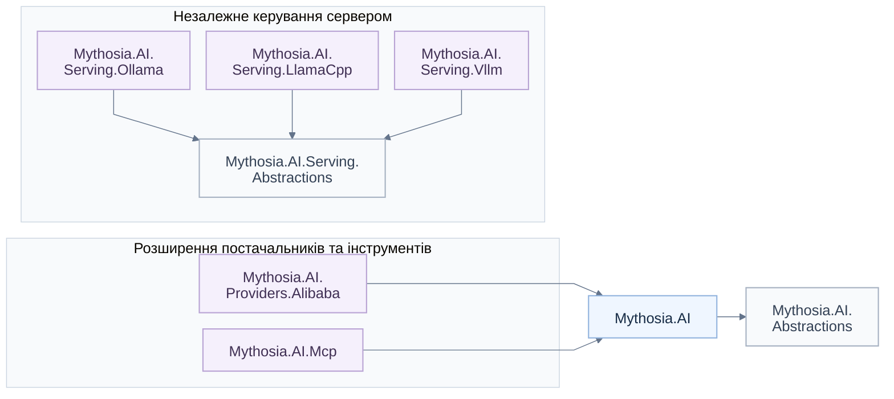
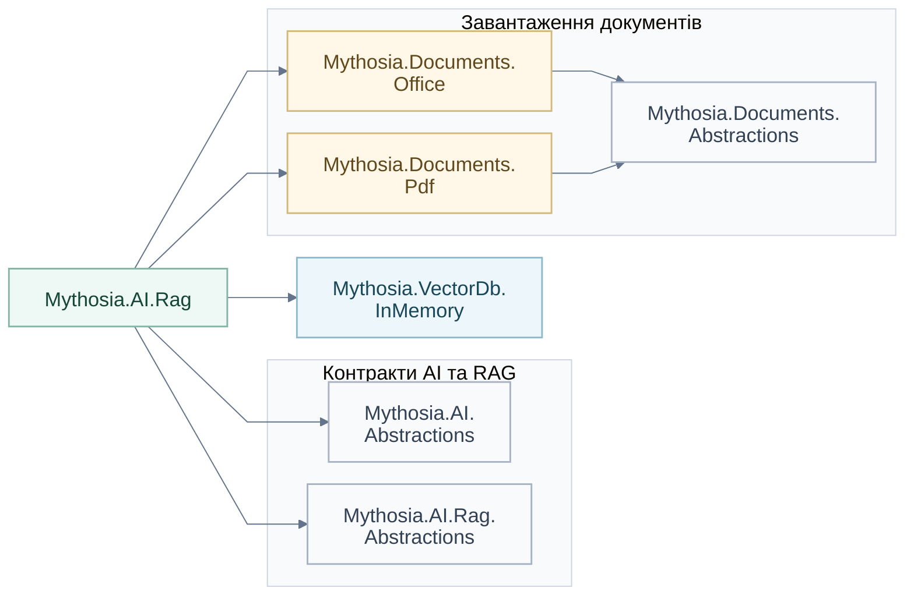
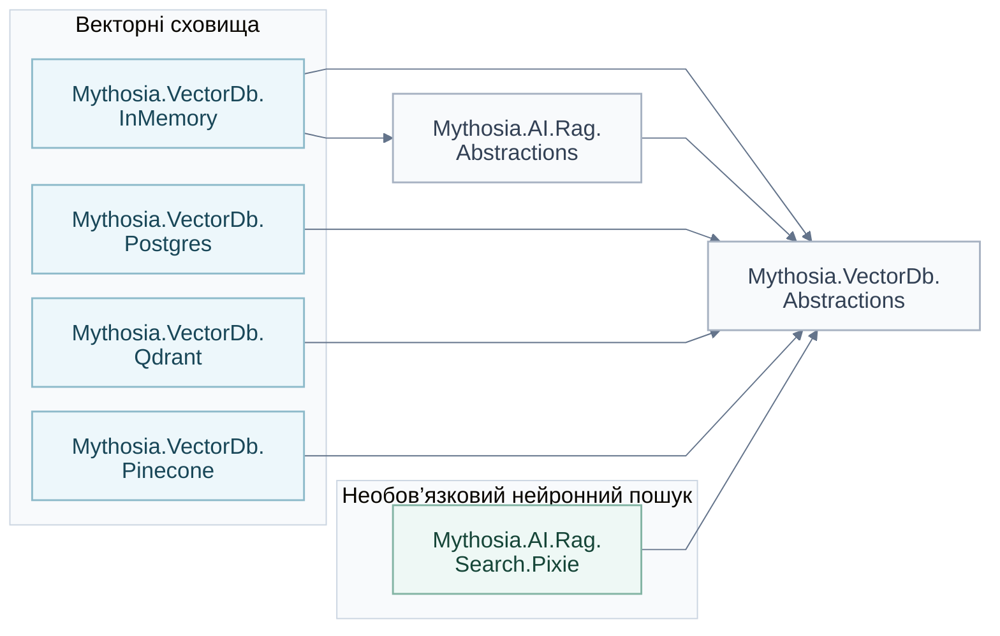

<div align="center">

🌐 [English](../../README.md) · [한국어](../ko/README.md) · [日本語](../ja/README.md) · [Français](../fr/README.md) · [Deutsch](../de/README.md) · [Русский](../ru/README.md) · [Українська](README.md) · [简体中文](../zh-Hans/README.md) · [繁體中文](../zh-Hant/README.md) · [Tiếng Việt](../vi/README.md) · [ภาษาไทย](../th/README.md) · [Português](../pt/README.md) · [Español](../es/README.md)

<br>

[](https://github.com/AJ-comp/Mythosia.AI)


### Модульна .NET-бібліотека для створення інтелектуальних застосунків

**Змінюйте провайдерів, додавайте RAG, завантажуйте документи — все через єдиний API.**

<br>

[](https://www.nuget.org/packages/Mythosia.AI)
[](https://www.nuget.org/packages/Mythosia.AI)
[](https://aj-comp.github.io/Mythosia.AI/)
[](https://dotnet.microsoft.com)

<br>

**[📖 Початок роботи](https://aj-comp.github.io/Mythosia.AI/)** &nbsp;·&nbsp; **[Довідник API](https://aj-comp.github.io/Mythosia.AI/api/)** &nbsp;·&nbsp; **[GitHub ↗](https://github.com/AJ-comp/Mythosia.AI)**

<br>

</div>

## Демо / тестовий стенд (Chat UI)

Випробуйте моделі й пошук у документах у Playground перед написанням коду інтеграції.

Перегляньте відео з поточного інтерфейсу Playground: вибір моделей, зміна мови, налаштування документів і конвеєра RAG. Відео містить англійські субтитри.

https://github.com/user-attachments/assets/4cf90210-b000-41be-8317-a467e93e7504

### Запуск прикладу

Запустіть **`Mythosia.AI.Samples.ChatUi`** локально:

```bash
# з кореня репозиторію
dotnet run --project apps/Mythosia.AI.Samples.ChatUi
```

<details>
<summary>Елементи керування та мови Playground</summary>

Ліворуч знайдіть модель за назвою або постачальником і налаштуйте запит, спілкуйтеся в центрі та перевіряйте відомості про обробку в панелі Inspector праворуч перед інтеграцією в застосунок. Кнопка Stop припиняє очікування відповіді; вибір швидкості доступний лише для підтримуваних моделей і точок підключення, а Fast може потребувати додаткової оплати. На невеликих екранах Models та Inspector відкриваються як висувні панелі; локальний запуск, документи й налаштування конвеєра описано в [посібнику Chat UI](https://github.com/AJ-comp/Mythosia.AI/blob/main/apps/Mythosia.AI.Samples.ChatUi/README.md).

Панель Pipeline дає змогу налаштувати ключі, розмірність і час очікування для Voyage Context 4, Gemini Embedding 2 та контекстних ембеддингів Perplexity. Documents показує кількість фрагментів і векторів та дає змогу скасувати індексацію. Збережені налаштування, повторне підключення БД і приклади коду використовують вибрану конфігурацію. Після зміни моделі чи розмірності потрібна повторна індексація.

Перемикач угорі сторінки дає змогу вибрати одну з 13 мов інтерфейсу, зберігши введені дані й налаштування. Усі сім постачальників показано згорнутими групами; розгорніть потрібну групу або знайдіть модель через пошук.

</details>

## Чому Mythosia.AI?

- **Змінюйте провайдерів через єдиний API** для чату, стрімінгу, інструментів і структурованих відповідей.
- **Будуйте відповіді на власних документах** за допомогою завантажувачів, ембеддингів, пошуку й реранкінгу.
- **Зберігайте незалежність налаштувань запитів** і керуйте поточною роботою через спільний Run API.
- **Встановлюйте лише потрібні пакети**: основну бібліотеку, RAG та інтеграції векторних сховищ.

## Які пакети потрібно встановити?

```
dotnet add package Mythosia.AI                    # почніть звідси (це все, що потрібно)
dotnet add package Mythosia.AI.Rag                # опціонально: коли потрібен RAG
dotnet add package Mythosia.VectorDb.Postgres     # опціонально: коли потрібне продуктивне векторне сховище
```

| Крок | Пакет | Коли |
| :--: | --- | --- |
| **1** | **`Mythosia.AI`** | **Почніть звідси** — генерація тексту, стрімінг, виклик функцій, структурований вивід (OpenAI / Claude / Gemini / Grok / DeepSeek / Perplexity) |
| **2** | **`Mythosia.AI.Rag`** | Коли потрібен RAG — розбивка тексту, ембедінги, гібридний пошук, реранкінг, InMemory-сховище, завантажувачі документів (Word / Excel / PowerPoint / PDF) |
| **3** | **`Mythosia.VectorDb.Postgres`** / **`Qdrant`** / **`Pinecone`** | Коли замість InMemory потрібне продуктивне векторне сховище — оберіть одне |

Створюйте незалежні налаштування через `CreateRequest(...).WithTemperature(...).GetCompletionAsync()`. [Посібник із запитів](request-building.md) пояснює Before/After, Run, профілі та обмеження спільної розмови.

Для запитів із важливим часом очікування вибирайте [швидкість обробки](request-building.md#inference-speed). `WithSpeed` зберігає модель і зусилля; `Processing` показує застосований режим. Fast є платною опцією для підтримуваних поєднань.

## Швидкий старт

### Базова генерація тексту

```csharp
using Mythosia.AI.Services.OpenAI;

var service = new OpenAIService(apiKey, httpClient);
var response = await service.GetCompletionAsync("Hello!");
```

### Стрімінг

```csharp
await using var run = await service.StartRunAsync(
    "Tell me a story",
    onText: text => Console.Write(text));
string answer = (await run.Result).Text;
```

### Стрімінг з міркуваннями

OpenAI, Claude, Gemini, Grok і DeepSeek Flash передають міркування провайдера за однією схемою стримінгу. Увімкніть міркування в сервісі або запиті, потім спостерігайте через `StreamOptions.WithReasoning()`:

```csharp
await using var run = await service.StartRunAsync(
    message, options: new StreamOptions().WithReasoning());
await foreach (var content in run.StreamAsync())
{
    if (content.Type == StreamingContentType.Reasoning)
        Console.Write($"[Think] {content.Content}");
    else if (content.Type == StreamingContentType.Text)
        Console.Write(content.Content);
}
```

### Виклик функцій

```csharp
using Mythosia.AI.Extensions;
using Mythosia.AI.Services.OpenAI;

var service = new OpenAIService(apiKey, httpClient)
    .WithFunction(
        "get_weather",
        "Gets the current weather for a location",
        ("location", "The city and country", required: true),
        (string location) => $"The weather in {location} is sunny, 22C"
    );

var response = await service.GetCompletionAsync("What's the weather in Seoul?");
```

За замовчуванням виклики з однієї відповіді моделі виконуються послідовно. Якщо зареєстровані функції незалежні, можна явно ввімкнути паралельне виконання з обмеженням кількості обробників:

```csharp
using Mythosia.AI.Models.Functions;

service.DefaultPolicy = new FunctionCallingPolicy
{
    ExecutionMode = FunctionExecutionMode.Parallel,
    MaxConcurrency = 3
};
```

Результати звичайного пакета повертаються моделі в початковому порядку викликів провайдера. Скасування пропускає ще не запущені виклики та додає відповідні результати скасування. Запущені інструменти отримують токен, якщо підтримують його, і очікуються до завершення, щоб зберегти пари виклик/результат в історії.

`FunctionCallingPolicy.TimeoutSeconds` охоплює весь цикл раундів стрімінгу, включно із заголовками відповіді та тілом SSE, без скидання між раундами інструментів. Завершення тайм-ауту політики спричиняє `AIServiceException`; скасування з боку викликача залишається `OperationCanceledException`, пов’язаним із його токеном.

Коли модель може виконувати незалежну частину завдання — наприклад, пояснювати, що взяти в подорож, поки інструмент завантажує погоду, — очікування результату не має блокувати всю відповідь. `FunctionDefinition.AllowAsync = true` або `FunctionBuilder.WithAsync()` дозволяє асинхронні виклики для GPT-6 Astra / Sol / Luna через Responses. За замовчуванням використовується `false`; моделі без підтримки чекають результату того самого обробника. Приклади та життєвий цикл запиту описано в [посібнику з виклику функцій](function-calling.md#async-tool-calling).

Це відрізняється від обробників C# `async` і паралельного планування викликів. Моделям без підтримки не надсилається непідтримувана опція API.

### Генерація та редагування зображень

Створюйте візуальні чернетки за текстом або редагуйте зображення через додаткову можливість, спільну для OpenAI, Google та xAI. Модель зображень обирається незалежно від моделі чату:

```csharp
using Mythosia.AI.Models.Images;
using Mythosia.AI.Services;
using Mythosia.AI.Services.OpenAI;

IImageGenerationService images = new OpenAIService(apiKey, httpClient);
var generated = await images.GenerateImagesAsync(new ImageGenerationRequest
{
    Prompt = "A glass pavilion at sunrise",
    Size = ImageSize.Pixels(1024, 1024),
    OutputFormat = ImageOutputFormat.Png
});

await File.WriteAllBytesAsync("pavilion.png", generated.Images[0].Data);
```

Приклади генерації й редагування наведено в [посібнику провайдерів](providers.md#image-generation), а зміни основного API — у [посібнику типізованих параметрів і міграції](providers.md#image-options-migration). Для xAI використовуйте `ImageOutputFormat.Auto` та обирайте розширення файлу за `GeneratedImage.MediaType`.

Параметри Google залежать від моделі: Flash підтримує 512/1K/2K/4K, Flash-Lite поки допускає 1K, Pro — 1K/2K/4K. Flash/Lite пропонують 14 співвідношень сторін, Pro — 10 стандартних. Усі приймають `Auto`. Перед показом варіантів перевіряйте `GetImageCapabilities(model)`; явно задані непідтримувані розміри або пропорції відхиляються до HTTP-запиту під час генерації й редагування. Див. [таблицю моделей і розбіжність у документації Flash-Lite](providers.md#google-image-options).

### Структурований вивід (базовий)

```csharp
// Десеріалізація відповідей LLM напряму в C# POCO з автовідновленням
var result = await service.GetCompletionAsync<WeatherResponse>(
    "What's the weather in Seoul?");
```

### Структурований вивід (список)

```csharp
// Колекції працюють напряму — жодних обгорток не потрібно
var items = await service.GetCompletionAsync<List<ItemDto>>(
    "Extract all entities from this document...");
```

### Структурований вивід (стрімінг)

```csharp
// Стрімте фрагменти тексту в реальному часі + отримуйте фінальний десеріалізований об'єкт
var run = service.BeginStream(prompt).As<MyDto>();

await foreach (var chunk in run.Stream())
    Console.Write(chunk);          // інтерфейс у реальному часі

MyDto dto = await run.Result;      // розпарсено й автоматично відновлено
```

### Політика резюмування діалогу

```csharp
// Автоматичне резюмування старих повідомлень при довгому діалозі
service.ConversationPolicy = SummaryConversationPolicy.ByMessage(
    triggerCount: 20,
    keepRecentCount: 5
);

// Тригер за кількістю токенів
service.ConversationPolicy = SummaryConversationPolicy.ByToken(
    triggerTokens: 3000,
    keepRecentTokens: 1000
);

// Використовуйте як звичайно — резюмування відбувається автоматично
await service.GetCompletionAsync("Continue our conversation...");

// При стрімінгу викличте політику резюмування явно перед StreamAsync()
await service.ApplySummaryPolicyIfNeededAsync();
await foreach (var chunk in service.StreamAsync("Continue..."))
    Console.Write(chunk.Content);

// Збереження/відновлення резюме між сесіями
string saved = service.ConversationPolicy.CurrentSummary;
policy.LoadSummary(saved);
```

### RAG (генерація з доповненим вилученням)

Обирайте лексичний, семантичний або гібридний пошук без обов’язкового ембеддингу кожного запиту. `UseKeywordSearch()` пропускає ембеддинг запиту; `UseRetriever(...)` підключає зовнішній індекс; `UseHybridSearch(HybridSearchOptions)` передає явні ваги та параметри кандидатів. Під час індексації документів вектори й далі створюються. Див. [режими пошуку та підтримку сховищ](rag-hybrid-search.md).

```bash
dotnet add package Mythosia.AI.Rag
```

```csharp
using Mythosia.AI.Rag;
using Mythosia.AI.Services.Anthropic;

var service = new AnthropicService(apiKey, httpClient)
    .WithRag(rag => rag
        .AddDocument("manual.txt")
        .AddDocument("policy.txt")
    );

var response = await service.GetCompletionAsync("What is the refund policy?");
```

Щоб агент сам керував пошуком, підключіть сховище через `WithAgenticRag(...)` і запустіть роботу викликом `service.WithMaxRounds(10).StartRunAsync(...)`. Отримуйте `run.Result` або спостерігайте за `run.StreamAsync()` у межах одного завдання. Повні приклади — у [README Mythosia.AI.Rag](../../src/rag/Mythosia.AI.Rag/README.md).

#### Збереження контексту документа та призначення запиту

Зміст фрагмента може залежати від сусідніх абзаців, а пошукове запитання й індексований документ мають різні ролі. RAG 8.2.0 додає контекстні ембеддинги Voyage та Gemini Embedding 2 для тексту, вилученого з TXT, Markdown і PDF.

```csharp
using Mythosia.AI.Rag;

var store = await RagStore.BuildAsync(rag => rag
    .UseVoyageEmbedding(voyageApiKey, httpClient)
    .AddDocument("policy.pdf"));
var result = await store.QueryAsync("What is the refund period?");
```

[Налаштування та контракти постачальників](rag-embedding.md#retrieval-aware-embeddings): `UseVoyageEmbedding(...)`, `UseGeminiEmbedding(...)`, `IRetrievalEmbeddingProvider` / `EmbeddingDocument` (RAG 8.2.0, RAG Abstractions 6.4.0).

## Підтримувані провайдери

> Grok 4.7: Потрібні Mythosia.AI 8.1.0 / Abstractions 4.1.0. [вибір моделі, міркування та швидкість обробки](providers.md#grok-47)

> GPT-6 Sol/Luna: Потрібні Mythosia.AI 8.1.0 / Abstractions 4.1.0. [вибір моделі та вимоги](providers.md#gpt-6-sol-luna)

> Claude Opus 5.5: Потрібні Mythosia.AI 8.1.0 / Abstractions 4.1.0. [налаштування й міграцію](providers.md#claude-opus-55)

| Провайдер | Пакет | Моделі |
| --- | --- | --- |
| **OpenAI** | `Mythosia.AI` | GPT-6 Astra / Sol / Luna, GPT-5.6 Sol / Terra / Luna, GPT-5.5 / 5.5 Pro / 5.4 / 5.4 Mini / 5.4 Nano / 5.4 Pro / 5.3 Codex / 5.2 / 5.2 Pro / 5.1, GPT-4.1 / 4.1 Mini, GPT-4o / 4o Mini |
| **Anthropic** | `Mythosia.AI` | Claude Fable 5.1 / 5, Mythos 5.1 / 5 (limited), [Opus 5.5](providers.md#claude-opus-55) / 5 / 4.8 / 4.7 / 4.6 / 4.5, Sonnet 5 / 4.6 / 4.5, Haiku 4.5 |
| **Google** | `Mythosia.AI` | Gemini 3.8 Flash, Gemini 3.7 Flash, Gemini 3.6 Flash, Gemini 3.5 Flash/Flash-Lite, Gemini 3.1 Pro Preview/Flash-Lite, Gemini 3 Flash Preview, Gemini 2.5 Pro/Flash/Flash-Lite, Gemini 3.1 Flash Image, Gemini 3.1 Flash-Lite Image, Gemini 3 Pro Image |
| **xAI** | `Mythosia.AI` | Grok 4.7, Grok 4.6, Grok 4.5 (типово), Grok 4.3, Grok 4.20 (reasoning / non-reasoning), Grok Build |
| **DeepSeek** | `Mythosia.AI` | Flash (V4.1 Flash), V4 Pro |
| **Perplexity** | `Mythosia.AI` | Пресети Agent API та `perplexity/sonar` |
| **Alibaba / Qwen** | `Mythosia.AI.Providers.Alibaba` | Qwen Max / Plus / Turbo / Qwen3 / Qwen3.5 варіанти |

Використовуйте Perplexity, коли відповіді потрібні свіжі відомості та джерела, які читач може перевірити. `PerplexityService` викликає Agent API, а окремі пошук та ембеддинги дають змогу побудувати отримання документів для обраної вами моделі відповідей. [Perplexity Agent API, пошук та ембеддинги](perplexity.md).

Для аналізу довгих документів і завдань із кількома раундами інструментів можна вибрати Gemini 3.7 Flash або 3.8 Flash у наявному адаптері Google. Підтримка доступна з `Mythosia.AI` 8.0.0 / `Mythosia.AI.Abstractions` 4.0.0; типовою моделлю залишається Gemini 3.6 Flash.

Для швидкої чернетки з подальшою ретельною перевіркою явно виберіть Grok 4.6 і рівень від `Low` до `XHigh`. Підтримка доступна з `Mythosia.AI` 8.0.0 / `Mythosia.AI.Abstractions` 4.0.0; типовою моделлю `XAIService` залишається Grok 4.5. Див. [налаштування Grok](providers.md#xai-xaiservice).

Для ескізів і поєднання зображень використовуйте [Grok Imagine Image 2.0](providers.md#grok-imagine-image-20) через `IImageGenerationService`. Залиште `OutputFormat = ImageOutputFormat.Auto` і вибирайте розширення за `MediaType`: xAI не дозволяє вибрати кодек. Див. [перехід параметрів зображень](providers.md#image-options-migration). Модель чату не змінюється.

Для швидких візуальних ескізів вибирайте Flare, для точних змін — Sunburst. [Генерація й редагування GPT Image 2.5](providers.md#gpt-image-25) використовують наявний API з явним вибором моделі в запиті; типовою моделлю OpenAI залишається GPT Image 2.

Для аналізу графіків і знімків екрана, локальних функцій або поглибленої перевірки відповіді використовуйте [DeepSeek Flash](providers.md#deepseek-deepseekservice) (`AIModels.DeepSeek.Flash`, V4.1 Flash). Міркування типово вимкнене; вмикайте через `WithDeepSeekReasoning(...)` або `WithReasoning(...)` для запиту.

Для текстових завдань виберіть `AIModels.DeepSeek.V4Pro` (`deepseek-v4-pro`, V4-Pro-0813). Flash залишається типовою моделлю та підтримує зображення; обидві мають Low/High/Max і однакову межу виводу. Установіть `UseResponsesApi = true` перед створенням запиту, щоб використовувати Responses через наявні API відповідей, потоків, Run і локальних функцій. Типове значення `false` зберігає Chat Completions у поточних застосунках. Вибір фіксується для запиту й усіх раундів інструментів. Responses повторно передає всю історію діалогу й нативних міркувань без залежності від збережених сервером ID відповідей.

Повторно використовуйте завантажене зображення в запитаннях до Flash через `DeepSeekImageFileContent` у Chat Completions або Responses; текстова модель V4 Pro відхиляє зображення. Див. [завантаження, повторне використання й обмеження зображень](providers.md#deepseek-deepseekservice). Потрібні Mythosia.AI 8.1.0 / Abstractions 4.1.0.

> Claude Fable 5 та Claude Mythos 5 вимагають зберігання даних протягом 30 днів і не підтримують угоди про нульове зберігання. Їхнє адаптивне міркування завжди ввімкнене; коли користувач просить вимкнути міркування, Mythosia задає низьке зусилля та не запитує стислий виклад міркувань. Mythos 5 доступний лише схваленим клієнтам Project Glasswing.

## Посібники та міграція

Для TXT і Markdown обирайте [розділювач за правилами](text-splitters.md) відповідно до структури. Розмір, перекриття та межі Unicode перевіряються; Markdown зберігає заголовки, код і рядки таблиць. Кількість символів чи слів не є лімітом токенів моделі. Умови таблиць і відступи коду зберігають значення; надмірне повторення контексту Markdown зупиняється явним винятком.

Щоб зовні успішна індексація не перезаписувала фрагменти й не пов’язувала їх із неправильними векторами, [перевірка індексації](rag-pipeline.md#indexing-validation) відхиляє некоректні ID та пакети ембеддингів до збереження. Користувацькі розділювачі мають задавати унікальні ID й успадковувати метадані документа.

Сталі [ID файлів](document-loaders.md#file-source-identity), перевірені [вектори запитань](rag-embedding.md#query-embedding-validation) і [збереження за документами зі скасуванням URL](rag-pipeline.md#custom-persistence) запобігають дублям, некоректному пошуку й застарілим фрагментам.

Необов’язкова попередня версія `Mythosia.AI.Rag.Search.Pixie` дає змогу порівняти локальний нейронний розріджений пошук із наявним. Вона зберігає постачальника щільних ембедингів та індекс PIXIE у пам’яті, не переносить постійні сховища й не замінює типовий пошук. [Налаштування PIXIE та порівняння (англійською)](../rag-pixie-search.md).

[Інфраструктура оцінювання пошуку](https://github.com/AJ-comp/Mythosia.AI/blob/main/tests/Mythosia.AI.Rag.Evaluation/README.md) підтримує повторно використовувані набори даних, адаптери пошуку, збережені звіти та перевірки регресій. Розширюйте той самий інструмент для нових методів пошуку й власних колекцій документів.

Налаштовуйте запити незалежно, зупиняйте роботу й отримуйте відповіді з використанням токенів та джерелами. [Посібник переходу на v8](v8-migration.md) містить шість змін, приклади міграції та межі перевірки.

> Версії пакетів, описані в цій документації: [Mythosia.AI 8.1.0](../../src/core/Mythosia.AI/RELEASE_NOTES.md#v810), [Abstractions 4.1.0](../../src/core/Mythosia.AI.Abstractions/RELEASE_NOTES.md#v410), [Alibaba 3.0.1](../../src/core/Mythosia.AI.Providers.Alibaba/RELEASE_NOTES.md#v301), [RAG 8.2.0](../../src/rag/Mythosia.AI.Rag/RELEASE_NOTES.md#v820), [PostgreSQL 10.8.1](../../src/vectordb/Mythosia.VectorDb.Postgres/RELEASE_NOTES.md#v1081), [MCP 0.1.1-preview](../../src/integrations/Mythosia.AI.Mcp/RELEASE_NOTES.md#v011-preview), [Serving.Abstractions 1.0.0](../../src/serving/Mythosia.AI.Serving.Abstractions/RELEASE_NOTES.md#v100), [Serving.Ollama 1.0.0](../../src/serving/Mythosia.AI.Serving.Ollama/RELEASE_NOTES.md#v100), [Serving.LlamaCpp 1.0.0](../../src/serving/Mythosia.AI.Serving.LlamaCpp/RELEASE_NOTES.md#v100), [Serving.Vllm 1.1.0](../../src/serving/Mythosia.AI.Serving.Vllm/RELEASE_NOTES.md#v110). Інші версії пакетів пошуку, документів і векторних сховищ наведено в [матриці попереднього патча](https://github.com/AJ-comp/Mythosia.AI/blob/main/RELEASE_NOTES.md#v811) та [попередньому узгодженому випуску](https://github.com/AJ-comp/Mythosia.AI/blob/main/RELEASE_NOTES.md#v810).

> [Виправлення RAG 8.1.1 / PostgreSQL 10.8.1](https://github.com/AJ-comp/Mythosia.AI/blob/main/RELEASE_NOTES.md#v811): наявні обгортки RAG враховують зміну переписувача під час роботи, а змішаний гібридний пошук PostgreSQL застосовує задані параметри векторного пошуку. Основний пакет `Mythosia.AI` залишається на версії 8.1.0.

---

## Архітектура

<a href="../assets/architecture.svg">
  <picture>
    <source media="(prefers-color-scheme: dark)" srcset="../assets/architecture-dark.svg">
    
  </picture>
</a>

### Деталі залежностей пакетів

Стрілки показують прямі посилання на пакети. Спільні пакети повторюються в різних поданнях; клієнти Serving використовують спільні контракти керування й не залежать від ядра ШІ.

#### Ядро ШІ та розширення


```mermaid
%%{init: {"theme":"base","look":"classic","htmlLabels":false,"themeVariables":{"fontFamily":"Arial, sans-serif","fontSize":"18px","primaryTextColor":"#172c46","lineColor":"#64748b","clusterBkg":"#f8fafc","clusterBorder":"#cbd5e1"},"flowchart":{"htmlLabels":false,"curve":"linear","nodeSpacing":20,"rankSpacing":36,"padding":16,"wrappingWidth":300},"fontFamily":"Arial, sans-serif","fontSize":18}}%%
flowchart LR
    subgraph Extensions["Розширення постачальників та інструментів"]
        Alibaba["Mythosia.AI.<br/>Providers.Alibaba"]:::extension
        Mcp["Mythosia.AI.Mcp"]:::extension
    end
    AI["Mythosia.AI"]:::core
    AIAbs["Mythosia.AI.<br/>Abstractions"]:::contract
    subgraph Independent["Незалежне керування сервером"]
        ServingAbs["Mythosia.AI.Serving.<br/>Abstractions"]:::contract
        OllamaServing["Mythosia.AI.<br/>Serving.Ollama"]:::extension
        LlamaCppServing["Mythosia.AI.<br/>Serving.LlamaCpp"]:::extension
        VllmServing["Mythosia.AI.<br/>Serving.Vllm"]:::extension
        OllamaServing --> ServingAbs
        LlamaCppServing --> ServingAbs
        VllmServing --> ServingAbs
    end
    Alibaba --> AI
    Mcp --> AI
    AI --> AIAbs
    classDef core fill:#eff6ff,stroke:#93b4de,color:#172c46,stroke-width:1.5px
    classDef rag fill:#eef8f5,stroke:#83b4a4,color:#164638,stroke-width:1.5px
    classDef extension fill:#f5f0fc,stroke:#b9a4d4,color:#403054,stroke-width:1.5px
    classDef documents fill:#fff8e9,stroke:#d4b879,color:#61491d,stroke-width:1.5px
    classDef store fill:#edf7fb,stroke:#8dbaca,color:#194758,stroke-width:1.5px
    classDef contract fill:#f8fafc,stroke:#a7b2c2,color:#334155,stroke-width:1.5px
```

#### RAG і завантаження документів


```mermaid
%%{init: {"theme":"base","look":"classic","htmlLabels":false,"themeVariables":{"fontFamily":"Arial, sans-serif","fontSize":"18px","primaryTextColor":"#172c46","lineColor":"#64748b","clusterBkg":"#f8fafc","clusterBorder":"#cbd5e1"},"flowchart":{"htmlLabels":false,"curve":"linear","nodeSpacing":20,"rankSpacing":36,"padding":16,"wrappingWidth":300},"fontFamily":"Arial, sans-serif","fontSize":18}}%%
flowchart LR
    Rag["Mythosia.AI.Rag"]:::rag
    subgraph Contracts["Контракти AI та RAG"]
        AIAbs["Mythosia.AI.<br/>Abstractions"]:::contract
        RagAbs["Mythosia.AI.Rag.<br/>Abstractions"]:::contract
    end
    InMem["Mythosia.VectorDb.<br/>InMemory"]:::store
    subgraph Documents["Завантаження документів"]
        Office["Mythosia.Documents.<br/>Office"]:::documents
        Pdf["Mythosia.Documents.<br/>Pdf"]:::documents
        LoaderAbs["Mythosia.Documents.<br/>Abstractions"]:::contract
        Office --> LoaderAbs
        Pdf --> LoaderAbs
    end
    Rag --> AIAbs
    Rag --> RagAbs
    Rag --> InMem
    Rag --> Office
    Rag --> Pdf
    classDef core fill:#eff6ff,stroke:#93b4de,color:#172c46,stroke-width:1.5px
    classDef rag fill:#eef8f5,stroke:#83b4a4,color:#164638,stroke-width:1.5px
    classDef extension fill:#f5f0fc,stroke:#b9a4d4,color:#403054,stroke-width:1.5px
    classDef documents fill:#fff8e9,stroke:#d4b879,color:#61491d,stroke-width:1.5px
    classDef store fill:#edf7fb,stroke:#8dbaca,color:#194758,stroke-width:1.5px
    classDef contract fill:#f8fafc,stroke:#a7b2c2,color:#334155,stroke-width:1.5px
```

#### Векторні сховища та пошук


```mermaid
%%{init: {"theme":"base","look":"classic","htmlLabels":false,"themeVariables":{"fontFamily":"Arial, sans-serif","fontSize":"18px","primaryTextColor":"#172c46","lineColor":"#64748b","clusterBkg":"#f8fafc","clusterBorder":"#cbd5e1"},"flowchart":{"htmlLabels":false,"curve":"linear","nodeSpacing":20,"rankSpacing":36,"padding":16,"wrappingWidth":300},"fontFamily":"Arial, sans-serif","fontSize":18}}%%
flowchart LR
    subgraph Stores["Векторні сховища"]
        InMem["Mythosia.VectorDb.<br/>InMemory"]:::store
        Pg["Mythosia.VectorDb.<br/>Postgres"]:::store
        Qd["Mythosia.VectorDb.<br/>Qdrant"]:::store
        Pine["Mythosia.VectorDb.<br/>Pinecone"]:::store
    end
    subgraph Search["Необов’язковий нейронний пошук"]
        Pixie["Mythosia.AI.Rag.<br/>Search.Pixie"]:::rag
    end
    RagAbs["Mythosia.AI.Rag.<br/>Abstractions"]:::contract
    VdbAbs["Mythosia.VectorDb.<br/>Abstractions"]:::contract
    InMem --> RagAbs
    InMem --> VdbAbs
    RagAbs --> VdbAbs
    Pg --> VdbAbs
    Qd --> VdbAbs
    Pine --> VdbAbs
    Pixie --> VdbAbs
    classDef core fill:#eff6ff,stroke:#93b4de,color:#172c46,stroke-width:1.5px
    classDef rag fill:#eef8f5,stroke:#83b4a4,color:#164638,stroke-width:1.5px
    classDef extension fill:#f5f0fc,stroke:#b9a4d4,color:#403054,stroke-width:1.5px
    classDef documents fill:#fff8e9,stroke:#d4b879,color:#61491d,stroke-width:1.5px
    classDef store fill:#edf7fb,stroke:#8dbaca,color:#194758,stroke-width:1.5px
    classDef contract fill:#f8fafc,stroke:#a7b2c2,color:#334155,stroke-width:1.5px
```

## Пакети

### Ядро

| Пакет | NuGet | Опис |
| --- | --- | --- |
| [Mythosia.AI](../../src/core/Mythosia.AI/README.md) | [](https://www.nuget.org/packages/Mythosia.AI) | Основна бібліотека — вбудовані провайдери, стрімінг, виклик функцій та мультимодальна підтримка |
| [Mythosia.AI.Abstractions](../../src/core/Mythosia.AI.Abstractions/README.md) | [](https://www.nuget.org/packages/Mythosia.AI.Abstractions) | Інтерфейс `IAIService` та спільні моделі — легкий контрактний пакет для бібліотек |
| [Mythosia.AI.Providers.Alibaba](../../src/core/Mythosia.AI.Providers.Alibaba/README.md) | [](https://www.nuget.org/packages/Mythosia.AI.Providers.Alibaba) | Пакет провайдера Alibaba / Qwen на базі `Mythosia.AI` |

### RAG

| Пакет | NuGet | Опис |
| --- | --- | --- |
| [Mythosia.AI.Rag](../../src/rag/Mythosia.AI.Rag/README.md) | [](https://www.nuget.org/packages/Mythosia.AI.Rag) | Fluent-розширення RAG для IAIService з API `.WithRag()` |
| [Mythosia.AI.Rag.Abstractions](../../src/rag/Mythosia.AI.Rag.Abstractions/README.md) | [](https://www.nuget.org/packages/Mythosia.AI.Rag.Abstractions) | Інтерфейси та моделі компонентів RAG-пайплайну |

### Завантажувачі документів

| Пакет | NuGet | Опис |
| --- | --- | --- |
| [Mythosia.Documents.Abstractions](../../src/loaders/Mythosia.Documents.Abstractions/README.md) | [](https://www.nuget.org/packages/Mythosia.Documents.Abstractions) | Інтерфейси та моделі завантажувачів документів (`IDocumentLoader`, `DoclingDocument`) |
| [Mythosia.Documents.Office](../../src/loaders/Mythosia.Documents.Office/README.md) | [](https://www.nuget.org/packages/Mythosia.Documents.Office) | OpenXml-парсери для Word / Excel / PowerPoint |
| [Mythosia.Documents.Pdf](../../src/loaders/Mythosia.Documents.Pdf/README.md) | [](https://www.nuget.org/packages/Mythosia.Documents.Pdf) | PDF-парсер на базі PdfPig |

### Векторні сховища

> **Оберіть одне або кілька** — усі реалізують `IVectorStore` з пакету Abstractions.

| Пакет | NuGet | Опис |
| --- | --- | --- |
| [Mythosia.VectorDb.Abstractions](../../src/vectordb/Mythosia.VectorDb.Abstractions/README.md) | [](https://www.nuget.org/packages/Mythosia.VectorDb.Abstractions) | Контракти `IVectorStore` · `VectorRecord` · `VectorFilter` |
| [Mythosia.VectorDb.InMemory](../../src/vectordb/Mythosia.VectorDb.InMemory/README.md) | [](https://www.nuget.org/packages/Mythosia.VectorDb.InMemory) | Сховище в пам'яті — без інфраструктури, ідеально для прототипування |
| [Mythosia.VectorDb.Pinecone](../../src/vectordb/Mythosia.VectorDb.Pinecone/README.md) | [](https://www.nuget.org/packages/Mythosia.VectorDb.Pinecone) | Pinecone HTTP API — ізоляція за індексом/namespace/scope для керованої векторної БД |
| [Mythosia.VectorDb.Postgres](../../src/vectordb/Mythosia.VectorDb.Postgres/README.md) | [](https://www.nuget.org/packages/Mythosia.VectorDb.Postgres) | PostgreSQL + pgvector — індекси HNSW / IVFFlat, готово для продакшену |
| [Mythosia.VectorDb.Qdrant](../../src/vectordb/Mythosia.VectorDb.Qdrant/README.md) | [](https://www.nuget.org/packages/Mythosia.VectorDb.Qdrant) | Qdrant gRPC-клієнт — Cosine / Euclidean / Dot, автоматичне розгортання |

### Сервінг — площина керування

Створюйте екрани вибору моделей і стану серверів через спільний API керування запущеними екземплярами Ollama, llama.cpp і vLLM. `IModelServer` отримує відомості про стан, моделі та можливості; під час виявлення моделі не завантажуються в пам'ять і не скачуються. Ці клієнти підключаються до наявних серверів, не розміщують рушії та не надсилають запити чату.

Необов'язкові інтерфейси `IModelLifecycle`, `IModelDownloader` та `IModelMetricsProvider` надають явні операції, коли вони доступні. Перевіряйте можливості підключеного сервера: `Unknown` означає недостатність підтверджень, а не `Unsupported`; значення `Supported` також не гарантує успіху для кожної моделі. Невідомі стани встановлення та завантаження залишаються невідомими.

Перевірки на реальних серверах пройшли для Ollama **0.34.4** (`qwen2.5:0.5b`), llama.cpp **b11146** у режимах Router та однієї моделі (Qwen2.5 0.5B, Q4_K_M), а також vLLM **0.30.0** (невелика модель Qwen). Результати стосуються лише перевірених конфігурацій. Перевірені операції та обмеження рушіїв наведено в [посібнику з керування серверами](serving.md).

| Пакет | NuGet | Опис |
| --- | --- | --- |
| [Mythosia.AI.Serving.Abstractions](../../src/serving/Mythosia.AI.Serving.Abstractions/README.md) | [](https://www.nuget.org/packages/Mythosia.AI.Serving.Abstractions) | Спільні контракти керування та незмінні знімки серверів, моделей і можливостей. |
| [Mythosia.AI.Serving.Ollama](../../src/serving/Mythosia.AI.Serving.Ollama/README.md) | [](https://www.nuget.org/packages/Mythosia.AI.Serving.Ollama) | Перелік і стан Ollama, явне завантаження/вивантаження та потокове скачування. |
| [Mythosia.AI.Serving.LlamaCpp](../../src/serving/Mythosia.AI.Serving.LlamaCpp/README.md) | [](https://www.nuget.org/packages/Mythosia.AI.Serving.LlamaCpp) | Перевірки llama.cpp, підтверджені команди маршрутизатора й метрики без автозавантаження. |
| [Mythosia.AI.Serving.Vllm](../../src/serving/Mythosia.AI.Serving.Vllm/README.md) | [](https://www.nuget.org/packages/Mythosia.AI.Serving.Vllm) | Картки моделей, стан, версія й метрики vLLM з мітками; конкретний API збережено. |

## Структура репозиторію

```text
src/
  core/
    Mythosia.AI/                        # Основна AI-бібліотека
    Mythosia.AI.Abstractions/           # Інтерфейс IAIService та спільні моделі
    Mythosia.AI.Providers.Alibaba/      # Пакет провайдера Alibaba / Qwen
  loaders/
    Mythosia.Documents.Abstractions/    # Контракти завантажувачів документів (IDocumentLoader, DoclingDocument)
    Mythosia.Documents.Office/          # Завантажувачі документів Office (Word/Excel/PowerPoint)
    Mythosia.Documents.Pdf/             # Завантажувач PDF-документів
  rag/
    Mythosia.AI.Rag/                    # RAG Fluent API та пайплайн
    Mythosia.AI.Rag.Abstractions/       # Інтерфейси та моделі RAG (RagDocument)
  serving/
    Mythosia.AI.Serving.Abstractions/  # Спільні контракти керування серверами моделей
    Mythosia.AI.Serving.Ollama/        # Керування Ollama та явне скачування
    Mythosia.AI.Serving.LlamaCpp/      # Керування llama.cpp в одиночному режимі й маршрутизаторі
    Mythosia.AI.Serving.Vllm/          # Керування й метрики vLLM
  vectordb/
    Mythosia.VectorDb.Abstractions/     # Контракти векторних сховищ
    Mythosia.VectorDb.InMemory/         # Векторне сховище в пам'яті
    Mythosia.VectorDb.Pinecone/         # Векторне сховище Pinecone
    Mythosia.VectorDb.Postgres/         # Сховище PostgreSQL + pgvector
    Mythosia.VectorDb.Qdrant/           # Векторне сховище Qdrant
apps/                                   # Приклади застосунків
tests/                                  # Проєкти модульних / інтеграційних тестів
```

## Встановлення

```bash
dotnet add package Mythosia.AI
```

Для розширених LINQ-операцій з потоками:

```bash
dotnet add package System.Linq.Async
```

## Документація

Для швидкої чернетки з подальшою глибшою перевіркою або відповідей на основі актуальної інформації та розміщених документів див. [міркування й пошук із джерелами](reasoning-and-search.md).

- **[📖 Повний сайт документації](https://aj-comp.github.io/Mythosia.AI/)** — документація DocFX про всі можливості, конвеєр RAG, векторні сховища та API
- [Посібник з основ](getting-started.md)
- [README Mythosia.AI](../../src/core/Mythosia.AI/README.md)  Повний довідник API: виклик функцій, стрімінг та налаштування моделей
- [README Mythosia.AI.Rag](../../src/rag/Mythosia.AI.Rag/README.md)  Використання RAG-пайплайну та власні реалізації
- [Посібник із завантажувачів](document-loaders.md)
- [Примітки до релізів](../../src/core/Mythosia.AI/RELEASE_NOTES.md)

## Перевірка швидкості обробки в реальних провайдерів

З кореня репозиторію виконайте:

```powershell
./build/test-inference-speed-live.ps1
```

Платний набір використовує наявну тестову конфігурацію Key Vault і синтетичні запити. Він перевіряє Anthropic Opus 5.5, OpenAI GPT-6 Astra, Gemini 3.8 Flash та Grok 4.6 у режимах ProviderDefault/Standard/Fast через completion і Run: загалом 24 випадки. Помилки доступу, відсутність відомостей про застосований режим і пониження режиму сервером не вважаються успішною перевіркою Fast; усі випадки мають пройти без пропусків. Звіти зберігаються в `artifacts/test-results/inference-speed-live`. Використовуйте `-NoBuild` лише після збирання актуальних тестів у Release. Команда описує запуск набору, а не стверджує, що поточний обліковий запис уже пройшов перевірку.

## Ліцензія

Проєкт розповсюджується під [ліцензією MIT](https://github.com/AJ-comp/Mythosia.AI/blob/main/LICENSE).

## Походження

Спочатку цей проєкт був частиною [Mythosia](https://github.com/AJ-comp/Mythosia).

[Створювати налаштування моделі за спільними визначеннями можливостей](model-capabilities.md).
