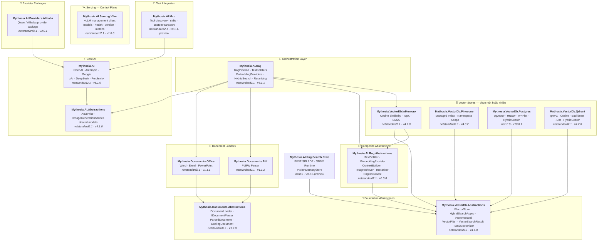

<div align="center">

🌐 [English](../../README.md) · [한국어](../ko/README.md) · [日本語](../ja/README.md) · [Français](../fr/README.md) · [Deutsch](../de/README.md) · [Русский](../ru/README.md) · [Українська](../uk/README.md) · [简体中文](../zh-Hans/README.md) · [繁體中文](../zh-Hant/README.md) · [Tiếng Việt](README.md) · [ภาษาไทย](../th/README.md)

<br>

[](https://github.com/AJ-comp/Mythosia.AI)


### Thư viện .NET mô-đun để xây dựng ứng dụng AI thông minh

**Đổi provider, kết nối RAG, tải tài liệu — tất cả qua một API thống nhất.**

<br>

[](https://www.nuget.org/packages/Mythosia.AI)
[](https://www.nuget.org/packages/Mythosia.AI)
[](https://aj-comp.github.io/Mythosia.AI/)
[](https://dotnet.microsoft.com)

<br>

**[📖 Bắt đầu](https://aj-comp.github.io/Mythosia.AI/)** &nbsp;·&nbsp; **[Tham chiếu API](https://aj-comp.github.io/Mythosia.AI/api/)** &nbsp;·&nbsp; **[GitHub ↗](https://github.com/AJ-comp/Mythosia.AI)**

<br>

</div>

Với TXT và Markdown, chọn [splitter theo quy tắc](text-splitters.md) theo cấu trúc tài liệu. Kích thước, overlap và ranh giới Unicode được kiểm tra; Markdown giữ tiêu đề, khối mã và hàng bảng. Số ký tự hay từ không phải giới hạn token của mô hình. Điều kiện bảng và thụt lề mã giữ nguyên ý nghĩa; việc lặp ngữ cảnh Markdown quá lớn sẽ dừng bằng ngoại lệ rõ ràng.

Để tránh lập chỉ mục có vẻ thành công nhưng ghi đè đoạn hoặc ghép nhầm vector, [kiểm tra lập chỉ mục](rag-pipeline.md#indexing-validation) từ chối ID và batch embedding không hợp lệ trước khi lưu. Splitter tùy chỉnh phải cấp ID duy nhất và kế thừa metadata của tài liệu.

[Định danh tệp ổn định](document-loaders.md#file-source-identity), [kiểm tra vector câu hỏi](rag-embedding.md#query-embedding-validation) và [lưu theo tài liệu cùng hủy URL](rag-pipeline.md#custom-persistence) giúp tránh đăng ký trùng, tìm kiếm sai và đoạn cũ còn sót.

Bản xem trước tùy chọn `Mythosia.AI.Rag.Search.Pixie` cho phép so sánh tìm kiếm thưa bằng nơ-ron cục bộ với cách tìm hiện tại. Nó giữ nhà cung cấp embedding đặc và dùng chỉ mục PIXIE trong bộ nhớ, không chuyển kho bền vững hay thay tìm kiếm mặc định. [Hướng dẫn PIXIE và so sánh (tiếng Anh)](../rag-pixie-search.md).

Tách cấu hình yêu cầu, dừng tác vụ và nhận câu trả lời cùng mức sử dụng và nguồn. [Hướng dẫn nâng cấp v8](v8-migration.md) tổng hợp sáu thay đổi kiến trúc, ví dụ chuyển đổi và phạm vi xác minh.

> Các phiên bản gói được mô tả trong tài liệu này: [Mythosia.AI 8.1.0](../../src/core/Mythosia.AI/RELEASE_NOTES.md#v810), [Abstractions 4.1.0](../../src/core/Mythosia.AI.Abstractions/RELEASE_NOTES.md#v410), [Alibaba 3.0.1](../../src/core/Mythosia.AI.Providers.Alibaba/RELEASE_NOTES.md#v301), [RAG 8.1.1](../../src/rag/Mythosia.AI.Rag/RELEASE_NOTES.md#v811), [PostgreSQL 10.8.1](../../src/vectordb/Mythosia.VectorDb.Postgres/RELEASE_NOTES.md#v1081), [MCP 0.1.1-preview](../../src/integrations/Mythosia.AI.Mcp/RELEASE_NOTES.md#v011-preview), [Serving.Vllm 1.0.0](../../src/serving/Mythosia.AI.Serving.Vllm/RELEASE_NOTES.md#v100).

> [Bản vá RAG 8.1.1 / PostgreSQL 10.8.1](https://github.com/AJ-comp/Mythosia.AI/blob/main/RELEASE_NOTES.md#v811): các wrapper RAG đã kết nối nhận thay đổi bộ viết lại trong lúc chạy, và tìm kiếm hybrid kết hợp của PostgreSQL áp dụng cấu hình tìm kiếm vector. Gói lõi `Mythosia.AI` vẫn ở phiên bản 8.1.0.

---

### Cài package nào?

```
dotnet add package Mythosia.AI                    # bắt đầu từ đây (chỉ cần cái này)
dotnet add package Mythosia.AI.Rag                # tùy chọn: khi cần RAG
dotnet add package Mythosia.VectorDb.Postgres     # tùy chọn: khi cần vector store production
```

| Bước | Package | Khi nào |
| :--: | --- | --- |
| **1** | **`Mythosia.AI`** | **Bắt đầu từ đây** — tạo văn bản, streaming, gọi hàm, structured output (OpenAI / Claude / Gemini / Grok / DeepSeek / Perplexity) |
| **2** | **`Mythosia.AI.Rag`** | Khi cần RAG — chia văn bản, embedding, hybrid search, reranking, InMemory store, document loaders (Word / Excel / PowerPoint / PDF) |
| **3** | **`Mythosia.VectorDb.Postgres`** / **`Qdrant`** / **`Pinecone`** | Khi cần vector store production thay vì InMemory — chọn một |

Chuẩn bị cấu hình độc lập bằng `CreateRequest(...).WithTemperature(...).GetCompletionAsync()`. [Hướng dẫn yêu cầu](request-building.md) giải thích Before/After, Run, profile và giới hạn hội thoại chung.

Với yêu cầu nhạy cảm về thời gian chờ, chọn [tốc độ xử lý](request-building.md#inference-speed). `WithSpeed` giữ mô hình và mức suy luận; `Processing` báo chế độ thực tế. Fast là tùy chọn trả phí trên các tổ hợp được hỗ trợ.

## Kiến trúc

<a href="../assets/architecture.svg">
  <picture>
    <source media="(prefers-color-scheme: dark)" srcset="../assets/architecture-dark.svg">
    
  </picture>
</a>

<details>
<summary>Chi tiết phụ thuộc của các gói</summary>



</details>

## Demo / Thử nghiệm (Chat UI)

Tìm mô hình theo tên hoặc nhà cung cấp và điều chỉnh yêu cầu ở bên trái, trò chuyện ở giữa và xem thông tin xử lý trong Inspector bên phải trước khi tích hợp vào ứng dụng. Dùng Stop để ngừng chờ phản hồi; chỉ có thể chọn tốc độ với mô hình và điểm kết nối được hỗ trợ, còn Fast có thể phát sinh phí bổ sung. Trên màn hình nhỏ, Models và Inspector mở thành các bảng trượt; xem [hướng dẫn Chat UI](https://github.com/AJ-comp/Mythosia.AI/blob/main/apps/Mythosia.AI.Samples.ChatUi/README.md) để chạy cục bộ, thêm tài liệu và cấu hình quy trình truy xuất.

Dùng bộ chọn ngôn ngữ ở đầu trang để chuyển giữa 13 ngôn ngữ giao diện mà không mất nội dung đã nhập hoặc cài đặt. Cả bảy nhà cung cấp đều hiển thị dưới dạng nhóm thu gọn; mở một nhóm hoặc tìm kiếm mô hình.

### Chạy ví dụ

Khởi động **`Mythosia.AI.Samples.ChatUi`** trên máy:

```bash
# từ thư mục gốc repository
dotnet run --project apps/Mythosia.AI.Samples.ChatUi
```

*Video dưới đây sử dụng giao diện cũ; màn hình hiện tại có thể khác.*

https://github.com/user-attachments/assets/62094afe-9add-4c14-b818-6b31f200dc01


## Bắt đầu nhanh

### Tạo văn bản cơ bản

```csharp
using Mythosia.AI;

var service = new OpenAIService(apiKey, httpClient);
var response = await service.GetCompletionAsync("Xin chào!");
```

### Streaming

```csharp
await foreach (var token in service.StreamAsync("Kể cho tôi nghe một câu chuyện"))
{
    Console.Write(token);
}
```

### Streaming với reasoning

OpenAI, Claude, Gemini, Grok và DeepSeek Flash trả suy luận của nhà cung cấp qua cùng mẫu streaming. Bật suy luận ở dịch vụ hoặc yêu cầu rồi quan sát bằng `StreamOptions.WithReasoning()`:

```csharp
await foreach (var content in service.StreamAsync(message, new StreamOptions().WithReasoning()))
{
    if (content.Type == StreamingContentType.Reasoning)
        Console.Write($"[Suy luận] {content.Content}");
    else if (content.Type == StreamingContentType.Text)
        Console.Write(content.Content);
}
```

### Gọi hàm

```csharp
var service = new OpenAIService(apiKey, httpClient)
    .WithFunction(
        "get_weather",
        "Lấy thông tin thời tiết hiện tại cho một địa điểm",
        ("location", "Tên thành phố và quốc gia", required: true),
        (string location) => $"Thời tiết ở {location} đang nắng, 28°C"
    );

var response = await service.GetCompletionAsync("Thời tiết ở Hà Nội thế nào?");
```

Trong khi chờ truy vấn thời tiết chậm, mô hình vẫn có thể giới thiệu đồ dùng du lịch thông thường không phụ thuộc kết quả thời tiết. Gọi công cụ bất đồng bộ ở cấp mô hình giúp tiếp tục công việc độc lập trong thời gian chờ; quyết định phụ thuộc kết quả vẫn phải đợi kết quả trả về.

Dùng `FunctionDefinition.AllowAsync = true` hoặc `FunctionBuilder.WithAsync()` để cho phép gọi công cụ bất đồng bộ với GPT-6 Astra / Sol / Luna qua Responses. Mặc định là `false`; mô hình chưa hỗ trợ vẫn chờ kết quả từ cùng handler. Xem ví dụ và vòng đời yêu cầu trong [hướng dẫn gọi hàm](function-calling.md).

Khi câu trả lời cần thông tin mới hoặc căn cứ từ tài liệu, xem [hướng dẫn suy luận và tìm kiếm](reasoning-and-search.md). Các tùy chọn chung cho phép tìm trên web hoặc dùng kho tài liệu hiện có, đồng thời lấy nguồn của câu trả lời.

### Structured output (cơ bản)

```csharp
// Deserialize phản hồi LLM trực tiếp thành C# POCO với tự phục hồi
var result = await service.GetCompletionAsync<WeatherResponse>(
    "Thời tiết ở Hà Nội thế nào?");
```

### Structured output (danh sách)

```csharp
// Collection hoạt động trực tiếp — không cần wrapper
var items = await service.GetCompletionAsync<List<ItemDto>>(
    "Trích xuất tất cả thực thể từ tài liệu này...");
```

### Structured output (streaming)

```csharp
// Stream từng đoạn văn bản theo thời gian thực + nhận object đã deserialize khi kết thúc
var run = service.BeginStream(prompt).As<MyDto>();

await foreach (var chunk in run.Stream())
    Console.Write(chunk);          // giao diện thời gian thực

MyDto dto = await run.Result;      // đã parse và tự phục hồi
```

### Chính sách tóm tắt hội thoại

```csharp
// Tự động tóm tắt tin nhắn cũ khi hội thoại dài
service.ConversationPolicy = SummaryConversationPolicy.ByMessage(
    triggerCount: 20,
    keepRecentCount: 5
);

// Trigger theo số lượng token
service.ConversationPolicy = SummaryConversationPolicy.ByToken(
    triggerTokens: 3000,
    keepRecentTokens: 1000
);

// Dùng như thường — tóm tắt xảy ra tự động
await service.GetCompletionAsync("Tiếp tục cuộc trò chuyện...");

// Khi streaming, gọi policy tóm tắt trước StreamAsync()
await service.ApplySummaryPolicyIfNeededAsync();
await foreach (var chunk in service.StreamAsync("Tiếp tục..."))
    Console.Write(chunk.Content);

// Lưu/khôi phục tóm tắt giữa các session
string saved = service.ConversationPolicy.CurrentSummary;
policy.LoadSummary(saved);
```

### RAG (Retrieval-Augmented Generation)

Chọn tìm từ khóa, ngữ nghĩa hoặc hybrid không bắt buộc embedding mọi truy vấn. [Hướng dẫn](rag-hybrid-search.md).

```bash
dotnet add package Mythosia.AI.Rag
```

```csharp
using Mythosia.AI.Rag;

var service = new AnthropicService(apiKey, httpClient)
    .WithRag(rag => rag
        .AddDocument("manual.txt")
        .AddDocument("policy.txt")
    );

var response = await service.GetCompletionAsync("Chính sách hoàn tiền là gì?");
```

## Provider được hỗ trợ

> Grok 4.7: Cần Mythosia.AI 8.1.0 / Abstractions 4.1.0. [chọn mô hình, suy luận và tốc độ xử lý](providers.md#grok-47)

> GPT-6 Sol/Luna: Cần Mythosia.AI 8.1.0 / Abstractions 4.1.0. [chọn mô hình và yêu cầu phiên bản](providers.md#gpt-6-sol-luna)

> Claude Opus 5.5: Cần Mythosia.AI 8.1.0 / Abstractions 4.1.0. [cấu hình và chuyển đổi](providers.md#claude-opus-55)

| Provider | Package | Model |
| --- | --- | --- |
| **OpenAI** | `Mythosia.AI` | GPT-6 Astra / Sol / Luna, GPT-5.6 Sol / Terra / Luna, GPT-5.5 / 5.5 Pro / 5.4 / 5.4 Mini / 5.4 Nano / 5.4 Pro / 5.3 Codex / 5.2 / 5.2 Pro / 5.1, GPT-4.1 / 4.1 Mini, GPT-4o / 4o Mini |
| **Anthropic** | `Mythosia.AI` | Claude Fable 5.1 / 5, Mythos 5.1 / 5 (limited), [Opus 5.5](providers.md#claude-opus-55) / 5 / 4.8 / 4.7 / 4.6 / 4.5, Sonnet 5 / 4.6 / 4.5, Haiku 4.5 |
| **Google** | `Mythosia.AI` | Gemini 3.8 Flash, Gemini 3.7 Flash, Gemini 3.6 Flash, Gemini 3.5 Flash/Flash-Lite, Gemini 3.1 Pro Preview/Flash-Lite, Gemini 3 Flash Preview, Gemini 2.5 Pro/Flash/Flash-Lite, Gemini 3.1 Flash Image, Gemini 3.1 Flash-Lite Image, Gemini 3 Pro Image |
| **xAI** | `Mythosia.AI` | Grok 4.7, Grok 4.6, Grok 4.5 (mặc định), Grok 4.3, Grok 4.20 (reasoning / non-reasoning), Grok Build |
| **DeepSeek** | `Mythosia.AI` | Flash (V4.1 Flash), V4 Pro |
| **Perplexity** | `Mythosia.AI` | Preset Agent API và `perplexity/sonar` |
| **Alibaba / Qwen** | `Mythosia.AI.Providers.Alibaba` | Qwen Max / Plus / Turbo / Qwen3 / Qwen3.5 variants |

Dùng Perplexity khi câu trả lời cần thông tin mới và nguồn để người đọc kiểm chứng. `PerplexityService` gọi Agent API; tìm kiếm và embedding độc lập giúp xây dựng khả năng truy xuất tài liệu cho mô hình trả lời mà bạn chọn. [Perplexity Agent API, tìm kiếm và embedding](perplexity.md).

Để đánh giá tài liệu dài hoặc xử lý nhiều vòng gọi công cụ, bạn có thể chọn Gemini 3.7 Flash hay 3.8 Flash qua adapter Google hiện có. Hỗ trợ bắt đầu từ `Mythosia.AI` 8.0.0 / `Mythosia.AI.Abstractions` 4.0.0; mô hình mặc định vẫn là Gemini 3.6 Flash.

Để có bản nháp nhanh rồi rà soát chuyên sâu, hãy chọn Grok 4.6 tường minh và mức từ `Low` đến `XHigh`. Hỗ trợ từ `Mythosia.AI` 8.0.0 / `Mythosia.AI.Abstractions` 4.0.0; `XAIService` vẫn mặc định dùng Grok 4.5. Xem [cấu hình Grok](providers.md#xai-xaiservice).

Để tạo bản phác thảo hoặc ghép ảnh tham chiếu, dùng [Grok Imagine Image 2.0](providers.md#grok-imagine-image-20) qua `IImageGenerationService`. Giữ `OutputFormat = ImageOutputFormat.Auto` và chọn phần mở rộng theo `MediaType`; xAI không chọn được codec. Xem [chuyển đổi tùy chọn ảnh](providers.md#image-options-migration). Mô hình chat không đổi.

Chọn Flare cho bản phác thảo nhanh, Sunburst cho chỉnh sửa chính xác. [Tạo và chỉnh sửa ảnh GPT Image 2.5](providers.md#gpt-image-25) dùng API ảnh hiện có với mô hình được chọn rõ theo yêu cầu; mặc định OpenAI vẫn là GPT Image 2.

Để chọn kích thước hợp lệ khi tạo hoặc chỉnh sửa ảnh, xem [tùy chọn ảnh Google theo mô hình](providers.md#google-image-options). Flash hỗ trợ 512/1K/2K/4K, Flash-Lite hiện hỗ trợ 1K và Pro hỗ trợ 1K/2K/4K. Flash/Lite có 14 tỷ lệ khung hình, Pro có 10 tỷ lệ tiêu chuẩn; tất cả chấp nhận `Auto`. Kích thước hoặc tỷ lệ được chỉ định nhưng không hỗ trợ sẽ bị từ chối trước yêu cầu HTTP.

Để phân tích biểu đồ, ảnh chụp, gọi hàm cục bộ hoặc rà soát kỹ câu trả lời, dùng [DeepSeek Flash](providers.md#deepseek-deepseekservice) (`AIModels.DeepSeek.Flash`, V4.1 Flash). Suy luận mặc định tắt; bật bằng `WithDeepSeekReasoning(...)` hoặc `WithReasoning(...)` cho từng yêu cầu.

Chọn `AIModels.DeepSeek.V4Pro` (`deepseek-v4-pro`, V4-Pro-0813) cho tác vụ chỉ có văn bản. Flash vẫn là mặc định và hỗ trợ ảnh; cả hai có suy luận Low/High/Max và cùng giới hạn đầu ra. Đặt `UseResponsesApi = true` trước khi tạo yêu cầu để dùng Responses với các API completion, streaming, Run và hàm cục bộ hiện có. Mặc định vẫn là `false` để giữ Chat Completions cho ứng dụng hiện tại; lựa chọn được giữ suốt yêu cầu và các vòng công cụ. Responses gửi lại toàn bộ hội thoại và suy luận gốc thay vì dựa vào ID phản hồi lưu trên máy chủ.

Tái sử dụng ảnh đã tải lên cho nhiều câu hỏi với Flash bằng `DeepSeekImageFileContent`, qua Chat Completions hoặc Responses; V4 Pro chỉ hỗ trợ văn bản nên từ chối ảnh. Xem [tải lên, tái sử dụng và giới hạn ảnh](providers.md#deepseek-deepseekservice). Cần Mythosia.AI 8.1.0 / Abstractions 4.1.0.

## Các package

### Core

| Package | NuGet | Mô tả |
| --- | --- | --- |
| [Mythosia.AI](../../src/core/Mythosia.AI/README.md) | [](https://www.nuget.org/packages/Mythosia.AI) | Thư viện core — provider tích hợp sẵn, streaming, gọi hàm và hỗ trợ đa phương thức |
| [Mythosia.AI.Abstractions](../../src/core/Mythosia.AI.Abstractions/README.md) | [](https://www.nuget.org/packages/Mythosia.AI.Abstractions) | Interface `IAIService` và model chung — package contract nhẹ cho thư viện |
| [Mythosia.AI.Providers.Alibaba](../../src/core/Mythosia.AI.Providers.Alibaba/README.md) | [](https://www.nuget.org/packages/Mythosia.AI.Providers.Alibaba) | Package provider Alibaba / Qwen dựa trên `Mythosia.AI` |

### RAG

| Package | NuGet | Mô tả |
| --- | --- | --- |
| [Mythosia.AI.Rag](../../src/rag/Mythosia.AI.Rag/README.md) | [](https://www.nuget.org/packages/Mythosia.AI.Rag) | Fluent extension RAG cho IAIService với API `.WithRag()` |
| [Mythosia.AI.Rag.Abstractions](../../src/rag/Mythosia.AI.Rag.Abstractions/README.md) | [](https://www.nuget.org/packages/Mythosia.AI.Rag.Abstractions) | Interface và model của các thành phần RAG pipeline |

### Document Loaders

| Package | NuGet | Mô tả |
| --- | --- | --- |
| [Mythosia.Documents.Abstractions](../../src/loaders/Mythosia.Documents.Abstractions/README.md) | [](https://www.nuget.org/packages/Mythosia.Documents.Abstractions) | Interface và model loader tài liệu (`IDocumentLoader`, `DoclingDocument`) |
| [Mythosia.Documents.Office](../../src/loaders/Mythosia.Documents.Office/README.md) | [](https://www.nuget.org/packages/Mythosia.Documents.Office) | Parser OpenXml cho Word / Excel / PowerPoint |
| [Mythosia.Documents.Pdf](../../src/loaders/Mythosia.Documents.Pdf/README.md) | [](https://www.nuget.org/packages/Mythosia.Documents.Pdf) | Parser PDF dựa trên PdfPig |

### Vector Stores

> **Chọn một hoặc nhiều** — tất cả đều implement `IVectorStore` từ package Abstractions.

| Package | NuGet | Mô tả |
| --- | --- | --- |
| [Mythosia.VectorDb.Abstractions](../../src/vectordb/Mythosia.VectorDb.Abstractions/README.md) | [](https://www.nuget.org/packages/Mythosia.VectorDb.Abstractions) | Contract `IVectorStore` · `VectorRecord` · `VectorFilter` |
| [Mythosia.VectorDb.InMemory](../../src/vectordb/Mythosia.VectorDb.InMemory/README.md) | [](https://www.nuget.org/packages/Mythosia.VectorDb.InMemory) | Store trong bộ nhớ — không cần infrastructure, lý tưởng cho prototyping |
| [Mythosia.VectorDb.Pinecone](../../src/vectordb/Mythosia.VectorDb.Pinecone/README.md) | [](https://www.nuget.org/packages/Mythosia.VectorDb.Pinecone) | Pinecone HTTP API — cách ly theo index/namespace/scope |
| [Mythosia.VectorDb.Postgres](../../src/vectordb/Mythosia.VectorDb.Postgres/README.md) | [](https://www.nuget.org/packages/Mythosia.VectorDb.Postgres) | PostgreSQL + pgvector — index HNSW / IVFFlat, sẵn sàng production |
| [Mythosia.VectorDb.Qdrant](../../src/vectordb/Mythosia.VectorDb.Qdrant/README.md) | [](https://www.nuget.org/packages/Mythosia.VectorDb.Qdrant) | Qdrant gRPC client — Cosine / Euclidean / Dot, tự động provision |

### Serving — Control Plane

> Client quản lý/introspection cho các runtime phục vụ model. Chat vẫn nằm ở các package provider: `Providers.*` = data plane cho chat, `Serving.*` = control plane cho server.

| Package | NuGet | Mô tả |
| --- | --- | --- |
| [Mythosia.AI.Serving.Vllm](../../src/serving/Mythosia.AI.Serving.Vllm/README.md) | [](https://www.nuget.org/packages/Mythosia.AI.Serving.Vllm) | Client control-plane cho vLLM — model card (model thực sự được nạp qua `root`), health, phiên bản server, metrics Prometheus |

## Cấu trúc repository

```text
src/
  core/
    Mythosia.AI/                        # Thư viện AI core
    Mythosia.AI.Abstractions/           # Interface IAIService và model chung
    Mythosia.AI.Providers.Alibaba/      # Package provider Alibaba / Qwen
  loaders/
    Mythosia.Documents.Abstractions/    # Contract document loader (IDocumentLoader, DoclingDocument)
    Mythosia.Documents.Office/          # Loader tài liệu Office (Word/Excel/PowerPoint)
    Mythosia.Documents.Pdf/             # Loader tài liệu PDF
  rag/
    Mythosia.AI.Rag/                    # RAG Fluent API và pipeline
    Mythosia.AI.Rag.Abstractions/       # Interface và model RAG (RagDocument)
  serving/
    Mythosia.AI.Serving.Vllm/           # Client control-plane cho vLLM (models/health/version/metrics)
  vectordb/
    Mythosia.VectorDb.Abstractions/     # Contract vector store
    Mythosia.VectorDb.InMemory/         # Vector store trong bộ nhớ
    Mythosia.VectorDb.Pinecone/         # Vector store Pinecone
    Mythosia.VectorDb.Postgres/         # PostgreSQL + pgvector
    Mythosia.VectorDb.Qdrant/           # Vector store Qdrant
apps/                                   # Ứng dụng ví dụ
tests/                                  # Project test unit / integration
```

## Cài đặt

```bash
dotnet add package Mythosia.AI
```

Cho các thao tác LINQ nâng cao với stream:

```bash
dotnet add package System.Linq.Async
```

## Tài liệu

- [Hướng dẫn cơ bản](getting-started.md)
- [README Mythosia.AI](../../src/core/Mythosia.AI/README.md) — Tham chiếu API đầy đủ: gọi hàm, streaming và cấu hình model
- [README Mythosia.AI.Rag](../../src/rag/Mythosia.AI.Rag/README.md) — Sử dụng RAG pipeline và custom implementation
- [Hướng dẫn loader](document-loaders.md)
- [Ghi chú phát hành](../../src/core/Mythosia.AI/RELEASE_NOTES.md)

## Giấy phép

Dự án này được phân phối theo [giấy phép MIT](https://github.com/AJ-comp/Mythosia.AI/blob/main/LICENSE).

## Nguồn gốc

Ban đầu dự án này là một phần của [Mythosia](https://github.com/AJ-comp/Mythosia).

[Tạo tùy chọn mô hình bằng định nghĩa hỗ trợ dùng chung](model-capabilities.md).
