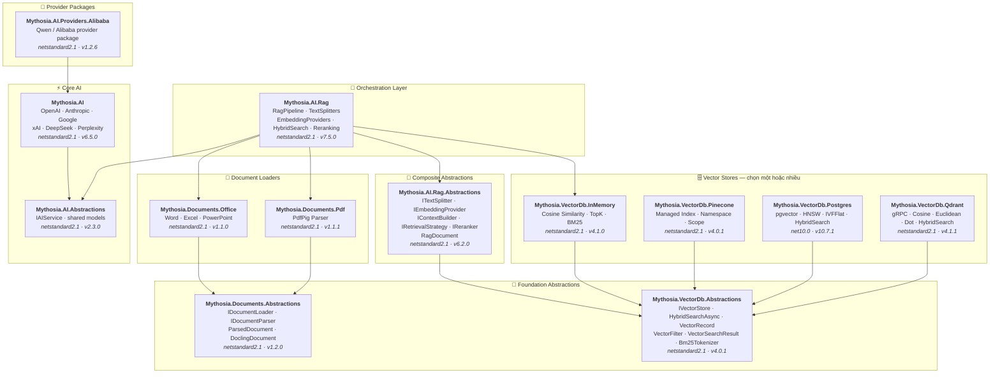

<div align="center">

🌐 [English](../../README.md) · [한국어](../ko/README.md) · [日本語](../ja/README.md) · [Français](../fr/README.md) · [Deutsch](../de/README.md) · [Русский](../ru/README.md) · [Українська](../uk/README.md) · [简体中文](../zh-Hans/README.md) · [繁體中文](../zh-Hant/README.md) · [Tiếng Việt](README.md) · [ภาษาไทย](../th/README.md)

<br>

[](https://github.com/AJ-comp/Mythosia.AI)


### Thư viện .NET mô-đun để xây dựng ứng dụng AI thông minh

**Đổi provider, kết nối RAG, tải tài liệu — tất cả qua một API thống nhất.**

<br>

[](https://www.nuget.org/packages/Mythosia.AI)
[](https://www.nuget.org/packages/Mythosia.AI)
[](https://aj-comp.github.io/Mythosia.AI/)
[](https://dotnet.microsoft.com)

<br>

**[📖 Bắt đầu](https://aj-comp.github.io/Mythosia.AI/)** &nbsp;·&nbsp; **[Tham chiếu API](https://aj-comp.github.io/Mythosia.AI/api/)** &nbsp;·&nbsp; **[GitHub ↗](https://github.com/AJ-comp/Mythosia.AI)**

<br>

</div>

---

### Cài package nào?

```
dotnet add package Mythosia.AI                    # bắt đầu từ đây (chỉ cần cái này)
dotnet add package Mythosia.AI.Rag                # tùy chọn: khi cần RAG
dotnet add package Mythosia.VectorDb.Postgres     # tùy chọn: khi cần vector store production
```

| Bước | Package | Khi nào |
| :--: | --- | --- |
| **1** | **`Mythosia.AI`** | **Bắt đầu từ đây** — tạo văn bản, streaming, gọi hàm, structured output (OpenAI / Claude / Gemini / Grok / DeepSeek / Perplexity) |
| **2** | **`Mythosia.AI.Rag`** | Khi cần RAG — chia văn bản, embedding, hybrid search, reranking, InMemory store, document loaders (Word / Excel / PowerPoint / PDF) |
| **3** | **`Mythosia.VectorDb.Postgres`** / **`Qdrant`** / **`Pinecone`** | Khi cần vector store production thay vì InMemory — chọn một |

## Kiến trúc



## Demo / Thử nghiệm (Chat UI)

Repository này có ví dụ Chat UI xây dựng trên Mythosia.AI — chạy `Mythosia.AI.Samples.ChatUi` để trải nghiệm thư viện trực tiếp.

### Chạy ví dụ

Khởi động **`Mythosia.AI.Samples.ChatUi`** trên máy:

```bash
# từ thư mục gốc repository
dotnet run --project samples/Mythosia.AI.Samples.ChatUi
```

https://github.com/user-attachments/assets/62094afe-9add-4c14-b818-6b31f200dc01


## Bắt đầu nhanh

### Tạo văn bản cơ bản

```csharp
using Mythosia.AI;

var service = new OpenAIService(apiKey, httpClient);
var response = await service.GetCompletionAsync("Xin chào!");
```

### Streaming

```csharp
await foreach (var token in service.StreamAsync("Kể cho tôi nghe một câu chuyện"))
{
    Console.Write(token);
}
```

### Streaming với reasoning

Tất cả provider hỗ trợ reasoning (OpenAI, Claude, Gemini, Grok, DeepSeek) dùng cùng một pattern:

```csharp
await foreach (var content in service.StreamAsync(message, new StreamOptions().WithReasoning()))
{
    if (content.Type == StreamingContentType.Reasoning)
        Console.Write($"[Suy luận] {content.Content}");
    else if (content.Type == StreamingContentType.Text)
        Console.Write(content.Content);
}
```

### Gọi hàm

```csharp
var service = new OpenAIService(apiKey, httpClient)
    .WithFunction(
        "get_weather",
        "Lấy thông tin thời tiết hiện tại cho một địa điểm",
        ("location", "Tên thành phố và quốc gia", required: true),
        (string location) => $"Thời tiết ở {location} đang nắng, 28°C"
    );

var response = await service.GetCompletionAsync("Thời tiết ở Hà Nội thế nào?");
```

### Structured output (cơ bản)

```csharp
// Deserialize phản hồi LLM trực tiếp thành C# POCO với tự phục hồi
var result = await service.GetCompletionAsync<WeatherResponse>(
    "Thời tiết ở Hà Nội thế nào?");
```

### Structured output (danh sách)

```csharp
// Collection hoạt động trực tiếp — không cần wrapper
var items = await service.GetCompletionAsync<List<ItemDto>>(
    "Trích xuất tất cả thực thể từ tài liệu này...");
```

### Structured output (streaming)

```csharp
// Stream từng đoạn văn bản theo thời gian thực + nhận object đã deserialize khi kết thúc
var run = service.BeginStream(prompt).As<MyDto>();

await foreach (var chunk in run.Stream())
    Console.Write(chunk);          // giao diện thời gian thực

MyDto dto = await run.Result;      // đã parse và tự phục hồi
```

### Chính sách tóm tắt hội thoại

```csharp
// Tự động tóm tắt tin nhắn cũ khi hội thoại dài
service.ConversationPolicy = SummaryConversationPolicy.ByMessage(
    triggerCount: 20,
    keepRecentCount: 5
);

// Trigger theo số lượng token
service.ConversationPolicy = SummaryConversationPolicy.ByToken(
    triggerTokens: 3000,
    keepRecentTokens: 1000
);

// Dùng như thường — tóm tắt xảy ra tự động
await service.GetCompletionAsync("Tiếp tục cuộc trò chuyện...");

// Khi streaming, gọi policy tóm tắt trước StreamAsync()
await service.ApplySummaryPolicyIfNeededAsync();
await foreach (var chunk in service.StreamAsync("Tiếp tục..."))
    Console.Write(chunk.Content);

// Lưu/khôi phục tóm tắt giữa các session
string saved = service.ConversationPolicy.CurrentSummary;
policy.LoadSummary(saved);
```

### RAG (Retrieval-Augmented Generation)

```bash
dotnet add package Mythosia.AI.Rag
```

```csharp
using Mythosia.AI.Rag;

var service = new AnthropicService(apiKey, httpClient)
    .WithRag(rag => rag
        .AddDocument("manual.txt")
        .AddDocument("policy.txt")
    );

var response = await service.GetCompletionAsync("Chính sách hoàn tiền là gì?");
```

## Provider được hỗ trợ

| Provider | Package | Model |
| --- | --- | --- |
| **OpenAI** | `Mythosia.AI` | GPT-5.5 / 5.5 Pro / 5.4 / 5.4 Mini / 5.4 Nano / 5.4 Pro / 5.3 Codex / 5.2 / 5.2 Pro / 5.2 Codex / 5.1 / 5 / 5 Pro / 5 Mini / 5 Nano, GPT-4.1 / 4.1 Mini / 4.1 Nano, GPT-4o / 4o Mini, o3 / o3 Pro |
| **Anthropic** | `Mythosia.AI` | Claude Fable 5, Opus 4.8 / 4.7 / 4.6 / 4.5 / 4.1 / 4, Sonnet 4.6 / 4.5, Haiku 4.5 |
| **Google** | `Mythosia.AI` | Gemini 3.1 Pro Preview, Gemini 3.5 Flash, Gemini 3 Flash Preview, Gemini 3.1 Flash-Lite, Gemini 2.5 Pro/Flash/Flash-Lite |
| **xAI** | `Mythosia.AI` | Grok 4.3, Grok 4.20 (reasoning / non-reasoning), Grok Build 0.1, Grok 3 Mini |
| **DeepSeek** | `Mythosia.AI` | Chat, Reasoner |
| **Perplexity** | `Mythosia.AI` | Sonar, Sonar Pro, Sonar Reasoning Pro |
| **Alibaba / Qwen** | `Mythosia.AI.Providers.Alibaba` | Qwen Max / Plus / Turbo / Qwen3 / Qwen3.5 variants |

## Các package

### Core

| Package | NuGet | Mô tả |
| --- | --- | --- |
| [Mythosia.AI](../../src/core/Mythosia.AI/) | [](https://www.nuget.org/packages/Mythosia.AI) | Thư viện core — provider tích hợp sẵn, streaming, gọi hàm và hỗ trợ đa phương thức |
| [Mythosia.AI.Abstractions](../../src/core/Mythosia.AI.Abstractions/) | [](https://www.nuget.org/packages/Mythosia.AI.Abstractions) | Interface `IAIService` và model chung — package contract nhẹ cho thư viện |
| [Mythosia.AI.Providers.Alibaba](../../src/core/Mythosia.AI.Providers.Alibaba/) | [](https://www.nuget.org/packages/Mythosia.AI.Providers.Alibaba) | Package provider Alibaba / Qwen dựa trên `Mythosia.AI` |

### RAG

| Package | NuGet | Mô tả |
| --- | --- | --- |
| [Mythosia.AI.Rag](../../src/rag/Mythosia.AI.Rag/) | [](https://www.nuget.org/packages/Mythosia.AI.Rag) | Fluent extension RAG cho IAIService với API `.WithRag()` |
| [Mythosia.AI.Rag.Abstractions](../../src/rag/Mythosia.AI.Rag.Abstractions/) | [](https://www.nuget.org/packages/Mythosia.AI.Rag.Abstractions) | Interface và model của các thành phần RAG pipeline |

### Document Loaders

| Package | NuGet | Mô tả |
| --- | --- | --- |
| [Mythosia.Documents.Abstractions](../../src/loaders/Mythosia.Documents.Abstractions/) | [](https://www.nuget.org/packages/Mythosia.Documents.Abstractions) | Interface và model loader tài liệu (`IDocumentLoader`, `DoclingDocument`) |
| [Mythosia.Documents.Office](../../src/loaders/Mythosia.Documents.Office/) | [](https://www.nuget.org/packages/Mythosia.Documents.Office) | Parser OpenXml cho Word / Excel / PowerPoint |
| [Mythosia.Documents.Pdf](../../src/loaders/Mythosia.Documents.Pdf/) | [](https://www.nuget.org/packages/Mythosia.Documents.Pdf) | Parser PDF dựa trên PdfPig |

### Vector Stores

> **Chọn một hoặc nhiều** — tất cả đều implement `IVectorStore` từ package Abstractions.

| Package | NuGet | Mô tả |
| --- | --- | --- |
| [Mythosia.VectorDb.Abstractions](../../src/vectordb/Mythosia.VectorDb.Abstractions/) | [](https://www.nuget.org/packages/Mythosia.VectorDb.Abstractions) | Contract `IVectorStore` · `VectorRecord` · `VectorFilter` |
| [Mythosia.VectorDb.InMemory](../../src/vectordb/Mythosia.VectorDb.InMemory/) | [](https://www.nuget.org/packages/Mythosia.VectorDb.InMemory) | Store trong bộ nhớ — không cần infrastructure, lý tưởng cho prototyping |
| [Mythosia.VectorDb.Pinecone](../../src/vectordb/Mythosia.VectorDb.Pinecone/) | [](https://www.nuget.org/packages/Mythosia.VectorDb.Pinecone) | Pinecone HTTP API — cách ly theo index/namespace/scope |
| [Mythosia.VectorDb.Postgres](../../src/vectordb/Mythosia.VectorDb.Postgres/) | [](https://www.nuget.org/packages/Mythosia.VectorDb.Postgres) | PostgreSQL + pgvector — index HNSW / IVFFlat, sẵn sàng production |
| [Mythosia.VectorDb.Qdrant](../../src/vectordb/Mythosia.VectorDb.Qdrant/) | [](https://www.nuget.org/packages/Mythosia.VectorDb.Qdrant) | Qdrant gRPC client — Cosine / Euclidean / Dot, tự động provision |

## Cấu trúc repository

```text
src/
  core/
    Mythosia.AI/                        # Thư viện AI core
    Mythosia.AI.Abstractions/           # Interface IAIService và model chung
    Mythosia.AI.Providers.Alibaba/      # Package provider Alibaba / Qwen
  loaders/
    Mythosia.Documents.Abstractions/    # Contract document loader (IDocumentLoader, DoclingDocument)
    Mythosia.Documents.Office/          # Loader tài liệu Office (Word/Excel/PowerPoint)
    Mythosia.Documents.Pdf/             # Loader tài liệu PDF
  rag/
    Mythosia.AI.Rag/                    # RAG Fluent API và pipeline
    Mythosia.AI.Rag.Abstractions/       # Interface và model RAG (RagDocument)
  vectordb/
    Mythosia.VectorDb.Abstractions/     # Contract vector store
    Mythosia.VectorDb.InMemory/         # Vector store trong bộ nhớ
    Mythosia.VectorDb.Pinecone/         # Vector store Pinecone
    Mythosia.VectorDb.Postgres/         # PostgreSQL + pgvector
    Mythosia.VectorDb.Qdrant/           # Vector store Qdrant
samples/                                # Ứng dụng ví dụ
tests/                                  # Project test unit / integration
```

## Cài đặt

```bash
dotnet add package Mythosia.AI
```

Cho các thao tác LINQ nâng cao với stream:

```bash
dotnet add package System.Linq.Async
```

## Tài liệu

- [Hướng dẫn cơ bản](https://github.com/AJ-comp/Mythosia.AI/wiki)
- [README Mythosia.AI](../../src/core/Mythosia.AI/README.md) — Tham chiếu API đầy đủ: gọi hàm, streaming và cấu hình model
- [README Mythosia.AI.Rag](../../src/rag/Mythosia.AI.Rag/README.md) — Sử dụng RAG pipeline và custom implementation
- [Hướng dẫn loader](document-loaders.md)
- [Ghi chú phát hành](../../src/core/Mythosia.AI/RELEASE_NOTES.md)

## Giấy phép

Dự án này được phân phối theo [giấy phép MIT](../../LICENSE).

## Nguồn gốc

Ban đầu dự án này là một phần của [Mythosia](https://github.com/AJ-comp/Mythosia).
