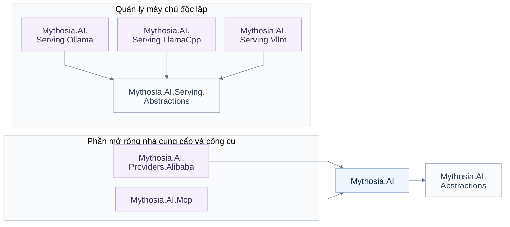
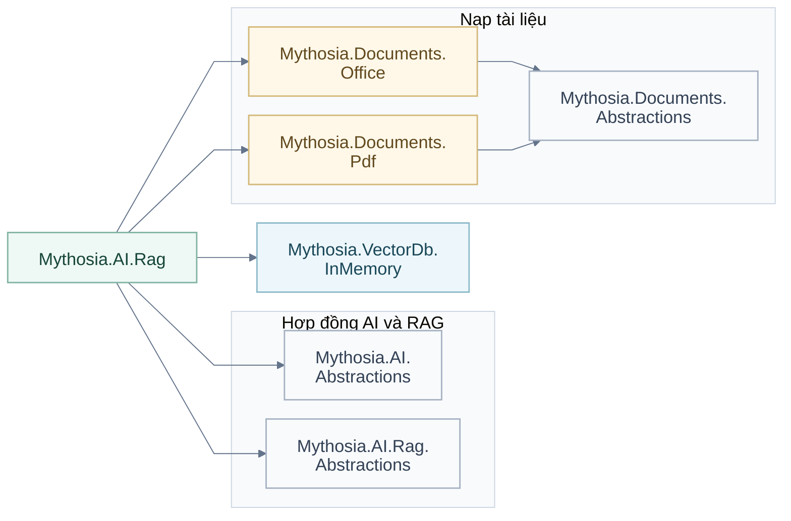
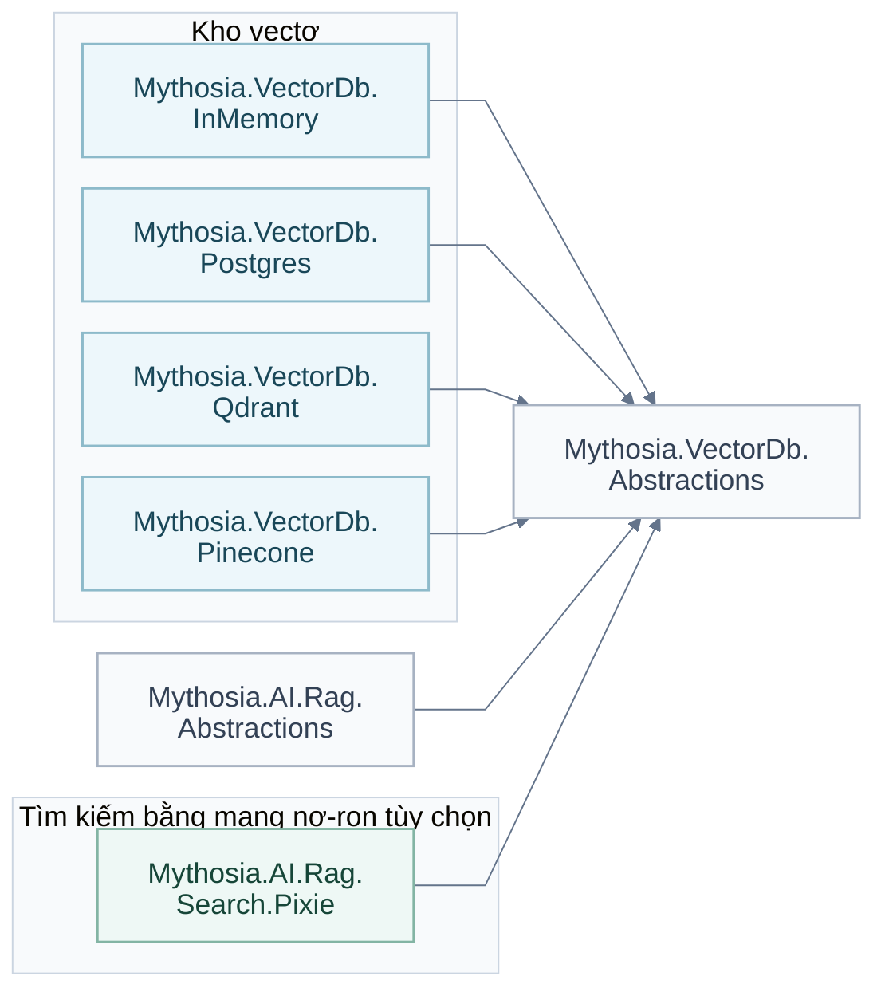

<div align="center">

🌐 [English](../../README.md) · [한국어](../ko/README.md) · [日本語](../ja/README.md) · [Français](../fr/README.md) · [Deutsch](../de/README.md) · [Русский](../ru/README.md) · [Українська](../uk/README.md) · [简体中文](../zh-Hans/README.md) · [繁體中文](../zh-Hant/README.md) · [Tiếng Việt](README.md) · [ภาษาไทย](../th/README.md)

<br>

[](https://github.com/AJ-comp/Mythosia.AI)


### Thư viện .NET mô-đun để xây dựng ứng dụng AI thông minh

**Đổi provider, kết nối RAG, tải tài liệu — tất cả qua một API thống nhất.**

<br>

[](https://www.nuget.org/packages/Mythosia.AI)
[](https://www.nuget.org/packages/Mythosia.AI)
[](https://aj-comp.github.io/Mythosia.AI/)
[](https://dotnet.microsoft.com)

<br>

**[📖 Bắt đầu](https://aj-comp.github.io/Mythosia.AI/)** &nbsp;·&nbsp; **[Tham chiếu API](https://aj-comp.github.io/Mythosia.AI/api/)** &nbsp;·&nbsp; **[GitHub ↗](https://github.com/AJ-comp/Mythosia.AI)**

<br>

</div>

## Demo / Thử nghiệm (Chat UI)

Thử mô hình và tìm kiếm tài liệu trong Playground trước khi viết mã tích hợp.

Xem video được ghi trong giao diện Playground hiện tại: chọn mô hình, đổi ngôn ngữ và khám phá cấu hình tài liệu cùng pipeline RAG. Video có phụ đề tiếng Anh.

https://github.com/user-attachments/assets/4cf90210-b000-41be-8317-a467e93e7504

### Chạy ví dụ

Khởi động **`Mythosia.AI.Samples.ChatUi`** trên máy:

```bash
# từ thư mục gốc repository
dotnet run --project apps/Mythosia.AI.Samples.ChatUi
```

<details>
<summary>Điều khiển và ngôn ngữ của Playground</summary>

Tìm mô hình theo tên hoặc nhà cung cấp và điều chỉnh yêu cầu ở bên trái, trò chuyện ở giữa và xem thông tin xử lý trong Inspector bên phải trước khi tích hợp vào ứng dụng. Dùng Stop để ngừng chờ phản hồi; chỉ có thể chọn tốc độ với mô hình và điểm kết nối được hỗ trợ, còn Fast có thể phát sinh phí bổ sung. Trên màn hình nhỏ, Models và Inspector mở thành các bảng trượt; xem [hướng dẫn Chat UI](https://github.com/AJ-comp/Mythosia.AI/blob/main/apps/Mythosia.AI.Samples.ChatUi/README.md) để chạy cục bộ, thêm tài liệu và cấu hình quy trình truy xuất.

Bảng Pipeline hỗ trợ khóa, số chiều và thời gian chờ cho Voyage Context 4, Gemini Embedding 2 cùng embedding ngữ cảnh Perplexity. Documents hiển thị số đoạn, số vector và cho phép hủy lập chỉ mục. Cài đặt đã lưu, kết nối lại cơ sở dữ liệu và ví dụ mã đều dùng cấu hình đã chọn. Lập lại chỉ mục khi đổi mô hình hoặc số chiều.

Dùng bộ chọn ngôn ngữ ở đầu trang để chuyển giữa 13 ngôn ngữ giao diện mà không mất nội dung đã nhập hoặc cài đặt. Cả bảy nhà cung cấp đều hiển thị dưới dạng nhóm thu gọn; mở một nhóm hoặc tìm kiếm mô hình.

</details>

## Vì sao chọn Mythosia.AI?

- **Đổi nhà cung cấp qua một API chung** cho chat, streaming, gọi công cụ và câu trả lời có cấu trúc.
- **Tạo câu trả lời từ tài liệu của bạn** bằng bộ tải, embedding, truy xuất và xếp hạng lại.
- **Giữ cấu hình từng yêu cầu độc lập** và điều khiển tác vụ đang chạy qua Run API chung.
- **Chọn đúng các gói cần dùng**, từ thư viện lõi đến RAG và tích hợp kho vector tùy chọn.

## Cài package nào?

```
dotnet add package Mythosia.AI                    # bắt đầu từ đây (chỉ cần cái này)
dotnet add package Mythosia.AI.Rag                # tùy chọn: khi cần RAG
dotnet add package Mythosia.VectorDb.Postgres     # tùy chọn: khi cần vector store production
```

| Bước | Package | Khi nào |
| :--: | --- | --- |
| **1** | **`Mythosia.AI`** | **Bắt đầu từ đây** — tạo văn bản, streaming, gọi hàm, structured output (OpenAI / Claude / Gemini / Grok / DeepSeek / Perplexity) |
| **2** | **`Mythosia.AI.Rag`** | Khi cần RAG — chia văn bản, embedding, hybrid search, reranking, InMemory store, document loaders (Word / Excel / PowerPoint / PDF) |
| **3** | **`Mythosia.VectorDb.Postgres`** / **`Qdrant`** / **`Pinecone`** | Khi cần vector store production thay vì InMemory — chọn một |

Chuẩn bị cấu hình độc lập bằng `CreateRequest(...).WithTemperature(...).GetCompletionAsync()`. [Hướng dẫn yêu cầu](request-building.md) giải thích Before/After, Run, profile và giới hạn hội thoại chung.

Completion, streaming, đầu ra có cấu trúc và Run áp dụng profile thực tế một lần rồi kiểm tra cài đặt trước khi tóm tắt, thay đổi lịch sử hoặc truyền yêu cầu. Yêu cầu phụ tách hội thoại và schema đầu ra của yêu cầu cha nhưng vẫn kiểm tra tùy chọn riêng của nhà cung cấp. Xem [hướng dẫn cài đặt yêu cầu](request-building.md).

Lời gọi từ ứng dụng và lời gọi thông thường từ callback ngữ cảnh hoặc công cụ vẫn độc lập khi dùng lại profile hay thông điệp. Với adapter nhà cung cấp virtual do framework gọi, lời gọi đầu tiên tới phương thức cơ sở tương ứng tiếp tục yêu cầu đã chuẩn bị, ngay cả khi thay thế đầu vào. Lời gọi phụ trợ không liên quan tới cùng phương thức cơ sở trước khi chuyển tiếp cần dùng `BeginIndependentRequestScope()`; xem [quy tắc adapter nhà cung cấp](request-building.md#provider-request-adapters). Bản sao đầu vào ngăn lời gọi sau viết lại lịch sử đã được chấp nhận.

Hồ sơ do bộ điều hợp thay đổi được xác thực trước tóm tắt tự động; streaming qua callback chờ dọn dẹp. Nén Claude giữ phụ thuộc công cụ trong đầu vào thay thế và thinking có ràng buộc của Mythos 5.1. Yêu cầu phụ OpenAI không trạng thái giữ cơ chế bảo vệ lịch sử cha.

Với yêu cầu nhạy cảm về thời gian chờ, chọn [tốc độ xử lý](request-building.md#inference-speed). `WithSpeed` giữ mô hình và mức suy luận; `Processing` báo chế độ thực tế. Fast là tùy chọn trả phí trên các tổ hợp được hỗ trợ.

## Bắt đầu nhanh

### Tạo văn bản cơ bản

```csharp
using Mythosia.AI.Services.OpenAI;

var service = new OpenAIService(apiKey, httpClient);
var response = await service.GetCompletionAsync("Xin chào!");
```

### Streaming

```csharp
await using var run = await service.StartRunAsync(
    "Kể cho tôi nghe một câu chuyện",
    onText: text => Console.Write(text));
string answer = (await run.Result).Text;
```

### Streaming với reasoning

OpenAI, Claude, Gemini, Grok và DeepSeek Flash trả suy luận của nhà cung cấp qua cùng mẫu streaming. Bật suy luận ở dịch vụ hoặc yêu cầu rồi quan sát bằng `StreamOptions.WithReasoning()`:

```csharp
await using var run = await service.StartRunAsync(
    message, options: new StreamOptions().WithReasoning());
await foreach (var content in run.StreamAsync())
{
    if (content.Type == StreamingContentType.Reasoning)
        Console.Write($"[Suy luận] {content.Content}");
    else if (content.Type == StreamingContentType.Text)
        Console.Write(content.Content);
}
```

### Gọi hàm

```csharp
using Mythosia.AI.Extensions;
using Mythosia.AI.Services.OpenAI;

var service = new OpenAIService(apiKey, httpClient)
    .WithFunction(
        "get_weather",
        "Lấy thông tin thời tiết hiện tại cho một địa điểm",
        ("location", "Tên thành phố và quốc gia", required: true),
        (string location) => $"Thời tiết ở {location} đang nắng, 28°C"
    );

var response = await service.GetCompletionAsync("Thời tiết ở Hà Nội thế nào?");
```

Mặc định, các lời gọi trong cùng một phản hồi của mô hình chạy tuần tự. Nếu các hàm đã đăng ký độc lập với nhau, bạn có thể chủ động bật thực thi song song có giới hạn:

```csharp
using Mythosia.AI.Models.Functions;

service.DefaultPolicy = new FunctionCallingPolicy
{
    ExecutionMode = FunctionExecutionMode.Parallel,
    MaxConcurrency = 3
};
```

Kết quả của batch thông thường được gửi lại cho mô hình theo thứ tự gọi ban đầu của nhà cung cấp. Khi hủy, các lời gọi chưa bắt đầu được bỏ qua và nhận kết quả hủy tương ứng. Công cụ đã bắt đầu sẽ nhận token nếu được hỗ trợ và được chờ hoàn tất để lịch sử luôn ghép đúng lời gọi với kết quả.

`FunctionCallingPolicy.TimeoutSeconds` bao phủ toàn bộ vòng lặp các lượt streaming, gồm header phản hồi và phần thân SSE, không đặt lại giữa các lượt công cụ. Hết thời gian của policy gây `AIServiceException`; việc người gọi hủy vẫn gây `OperationCanceledException` gắn với token của người gọi. `HttpContent` tùy chỉnh có đệm nội dung có một ngoại lệ đã biết khi lấy luồng nội dung SSE; xem [giới hạn hủy](streaming.md#sse-acquisition-cancellation-limitation).

Trong khi chờ truy vấn thời tiết chậm, mô hình vẫn có thể giới thiệu đồ dùng du lịch thông thường không phụ thuộc kết quả thời tiết. Gọi công cụ bất đồng bộ ở cấp mô hình giúp tiếp tục công việc độc lập trong thời gian chờ; quyết định phụ thuộc kết quả vẫn phải đợi kết quả trả về.

Dùng `FunctionDefinition.AllowAsync = true` hoặc `FunctionBuilder.WithAsync()` để cho phép gọi công cụ bất đồng bộ với GPT-6.1 Sol / GPT-6 Astra / Sol / Luna qua Responses. Mặc định là `false`; mô hình chưa hỗ trợ vẫn chờ kết quả từ cùng handler. Xem ví dụ và vòng đời yêu cầu trong [hướng dẫn gọi hàm](function-calling.md#async-tool-calling).

Cơ chế này khác với handler C# `async` và việc lập lịch handler song song. Tùy chọn API không được gửi tới mô hình chưa hỗ trợ.

### Tạo và chỉnh sửa hình ảnh

Tạo bản phác thảo từ văn bản hoặc sửa ảnh hiện có bằng khả năng tùy chọn chung cho OpenAI, Google và xAI. Mô hình ảnh được chọn độc lập với mô hình chat:

```csharp
using Mythosia.AI.Models.Images;
using Mythosia.AI.Services;
using Mythosia.AI.Services.OpenAI;

IImageGenerationService images = new OpenAIService(apiKey, httpClient);
var generated = await images.GenerateImagesAsync(new ImageGenerationRequest
{
    Prompt = "A glass pavilion at sunrise",
    Size = ImageSize.Pixels(1024, 1024),
    OutputFormat = ImageOutputFormat.Png
});

await File.WriteAllBytesAsync("pavilion.png", generated.Images[0].Data);
```

Xem [hướng dẫn nhà cung cấp](providers.md#image-generation) để tạo và sửa ảnh, hoặc [tùy chọn ảnh định kiểu và chuyển đổi](providers.md#image-options-migration) cho thay đổi API lớn. xAI dùng `ImageOutputFormat.Auto`; chọn phần mở rộng từ `GeneratedImage.MediaType`.

Preset ảnh Google phụ thuộc vào mô hình: Flash hỗ trợ 512/1K/2K/4K, Flash-Lite hiện cho phép 1K, còn Pro hỗ trợ 1K/2K/4K. Flash/Lite có 14 tỉ lệ khung hình; Pro có 10 tỉ lệ chuẩn. Tất cả chấp nhận `Auto`. Kiểm tra `GetImageCapabilities(model)` trước khi hiển thị lựa chọn; kích thước hoặc tỉ lệ không được hỗ trợ bị từ chối trước HTTP khi tạo và sửa ảnh. Xem [bảng mô hình và khác biệt trong tài liệu Flash-Lite](providers.md#google-image-options).

### Structured output (cơ bản)

```csharp
// Deserialize phản hồi LLM trực tiếp thành C# POCO với tự phục hồi
var result = await service.GetCompletionAsync<WeatherResponse>(
    "Thời tiết ở Hà Nội thế nào?");
```

### Structured output (danh sách)

```csharp
// Collection hoạt động trực tiếp — không cần wrapper
var items = await service.GetCompletionAsync<List<ItemDto>>(
    "Trích xuất tất cả thực thể từ tài liệu này...");
```

### Structured output (streaming)

```csharp
// Stream từng đoạn văn bản theo thời gian thực + nhận object đã deserialize khi kết thúc
var run = service.BeginStream(prompt).As<MyDto>();

await foreach (var chunk in run.Stream())
    Console.Write(chunk);          // giao diện thời gian thực

MyDto dto = await run.Result;      // đã parse và tự phục hồi
```

### Chính sách tóm tắt hội thoại

```csharp
// Tự động tóm tắt tin nhắn cũ khi hội thoại dài
service.ConversationPolicy = SummaryConversationPolicy.ByMessage(
    triggerCount: 20,
    keepRecentCount: 5
);

// Trigger theo số lượng token
service.ConversationPolicy = SummaryConversationPolicy.ByToken(
    triggerTokens: 3000,
    keepRecentTokens: 1000
);

// Dùng như thường — tóm tắt xảy ra tự động
await service.GetCompletionAsync("Tiếp tục cuộc trò chuyện...");

// Khi streaming, gọi policy tóm tắt trước StreamAsync()
await service.ApplySummaryPolicyIfNeededAsync();
await foreach (var chunk in service.StreamAsync("Tiếp tục..."))
    Console.Write(chunk.Content);

// Lưu/khôi phục tóm tắt giữa các session
string saved = service.ConversationPolicy.CurrentSummary;
policy.LoadSummary(saved);
```

### RAG (Retrieval-Augmented Generation)

Chọn truy xuất từ khóa, ngữ nghĩa hoặc hybrid mà không bắt mọi truy vấn phải tạo embedding. `UseKeywordSearch()` bỏ qua embedding truy vấn; `UseRetriever(...)` kết nối chỉ mục bên ngoài; `UseHybridSearch(HybridSearchOptions)` chuyển rõ trọng số và cấu hình ứng viên. Quá trình nhập tài liệu vẫn tạo vector. Xem [chế độ truy xuất và khả năng của kho](rag-hybrid-search.md).

```bash
dotnet add package Mythosia.AI.Rag
```

```csharp
using Mythosia.AI.Rag;
using Mythosia.AI.Services.Anthropic;

var service = new AnthropicService(apiKey, httpClient)
    .WithRag(rag => rag
        .AddDocument("manual.txt")
        .AddDocument("policy.txt")
    );

var response = await service.GetCompletionAsync("Chính sách hoàn tiền là gì?");
```

Để agent điều khiển truy xuất, đăng ký kho bằng `WithAgenticRag(...)` rồi bắt đầu với `service.WithMaxRounds(10).StartRunAsync(...)`. Chờ `run.Result` hoặc theo dõi `run.StreamAsync()` trên cùng tác vụ. Xem ví dụ đầy đủ trong [README Mythosia.AI.Rag](../../src/rag/Mythosia.AI.Rag/README.md).

#### Giữ ngữ cảnh tài liệu và mục đích truy vấn

Một đoạn có thể phụ thuộc vào nội dung lân cận, còn câu hỏi tìm kiếm và tài liệu được lập chỉ mục có vai trò khác nhau. RAG 8.2.0 bổ sung embedding ngữ cảnh Voyage và Gemini Embedding 2 cho văn bản trích xuất từ TXT, Markdown và PDF.

```csharp
using Mythosia.AI.Rag;

var store = await RagStore.BuildAsync(rag => rag
    .UseVoyageEmbedding(voyageApiKey, httpClient)
    .AddDocument("policy.pdf"));
var result = await store.QueryAsync("What is the refund period?");
```

[Cấu hình và hợp đồng provider](rag-embedding.md#retrieval-aware-embeddings): `UseVoyageEmbedding(...)`, `UseGeminiEmbedding(...)`, `IRetrievalEmbeddingProvider` / `EmbeddingDocument` (RAG 8.2.0, RAG Abstractions 6.4.0).

## Provider được hỗ trợ

> Grok 4.7: Cần Mythosia.AI 8.1.0 / Abstractions 4.1.0. [chọn mô hình, suy luận và tốc độ xử lý](providers.md#grok-47)

> GPT-6.1 Sol: Cần Mythosia.AI 8.2.0 / Abstractions 4.2.0. [Chọn mô hình và chuyển đổi](providers.md#gpt-61-sol)

> GPT-6 Sol/Luna: Cần Mythosia.AI 8.1.0 / Abstractions 4.1.0. [chọn mô hình và yêu cầu phiên bản](providers.md#gpt-6-sol-luna)

> Claude Sonnet 5.5: Cần Mythosia.AI 8.2.0 / Abstractions 4.2.0. [Cấu hình và chuyển đổi](providers.md#claude-sonnet-55)

> Claude Opus 5.5: Cần Mythosia.AI 8.1.0 / Abstractions 4.1.0. [cấu hình và chuyển đổi](providers.md#claude-opus-55)

| Provider | Package | Model |
| --- | --- | --- |
| **OpenAI** | `Mythosia.AI` | GPT-6.1 Sol / GPT-6 Astra / Sol / Luna, GPT-5.6 Sol / Terra / Luna, GPT-5.5 / 5.5 Pro / 5.4 / 5.4 Mini / 5.4 Nano / 5.4 Pro / 5.3 Codex / 5.2 / 5.2 Pro / 5.1, GPT-4.1 / 4.1 Mini, GPT-4o / 4o Mini |
| **Anthropic** | `Mythosia.AI` | Claude Fable 5.1 / 5, Mythos 5.1 / 5 (limited), [Opus 5.5](providers.md#claude-opus-55) / 5 / 4.8 / 4.7 / 4.6 / 4.5, [Sonnet 5.5](providers.md#claude-sonnet-55) / 5 / 4.6 / 4.5, Haiku 4.5 |
| **Google** | `Mythosia.AI` | Gemini 3.8 Flash, Gemini 3.7 Flash, Gemini 3.6 Flash, Gemini 3.5 Flash/Flash-Lite, Gemini 3.1 Pro Preview/Flash-Lite, Gemini 3 Flash Preview, Gemini 2.5 Pro/Flash/Flash-Lite, Gemini 3.1 Flash Image, Gemini 3.1 Flash-Lite Image, Gemini 3 Pro Image |
| **xAI** | `Mythosia.AI` | Grok 4.7, Grok 4.6, Grok 4.5 (mặc định), Grok 4.3, Grok 4.20 (reasoning / non-reasoning), Grok Build |
| **DeepSeek** | `Mythosia.AI` | Flash (V4.1 Flash), V4 Pro |
| **Perplexity** | `Mythosia.AI` | Preset Agent API và `perplexity/sonar` |
| **Alibaba / Qwen** | `Mythosia.AI.Providers.Alibaba` | Qwen Max / Plus / Turbo / Qwen3 / Qwen3.5 variants |

Dùng Perplexity khi câu trả lời cần thông tin mới và nguồn để người đọc kiểm chứng. `PerplexityService` gọi Agent API; tìm kiếm và embedding độc lập giúp xây dựng khả năng truy xuất tài liệu cho mô hình trả lời mà bạn chọn. [Perplexity Agent API, tìm kiếm và embedding](perplexity.md).

Để đánh giá tài liệu dài hoặc xử lý nhiều vòng gọi công cụ, bạn có thể chọn Gemini 3.7 Flash hay 3.8 Flash qua adapter Google hiện có. Hỗ trợ bắt đầu từ `Mythosia.AI` 8.0.0 / `Mythosia.AI.Abstractions` 4.0.0; mô hình mặc định vẫn là Gemini 3.6 Flash.

Để có bản nháp nhanh rồi rà soát chuyên sâu, hãy chọn Grok 4.6 tường minh và mức từ `Low` đến `XHigh`. Hỗ trợ từ `Mythosia.AI` 8.0.0 / `Mythosia.AI.Abstractions` 4.0.0; `XAIService` vẫn mặc định dùng Grok 4.5. Xem [cấu hình Grok](providers.md#xai-xaiservice).

Để tạo bản phác thảo hoặc ghép ảnh tham chiếu, dùng [Grok Imagine Image 2.0](providers.md#grok-imagine-image-20) qua `IImageGenerationService`. Giữ `OutputFormat = ImageOutputFormat.Auto` và chọn phần mở rộng theo `MediaType`; xAI không chọn được codec. Xem [chuyển đổi tùy chọn ảnh](providers.md#image-options-migration). Mô hình chat không đổi.

Chọn Flare cho bản phác thảo nhanh, Sunburst cho chỉnh sửa chính xác. [Tạo và chỉnh sửa ảnh GPT Image 2.5](providers.md#gpt-image-25) dùng API ảnh hiện có với mô hình được chọn rõ theo yêu cầu; mặc định OpenAI vẫn là GPT Image 2.

Để phân tích biểu đồ, ảnh chụp, gọi hàm cục bộ hoặc rà soát kỹ câu trả lời, dùng [DeepSeek Flash](providers.md#deepseek-deepseekservice) (`AIModels.DeepSeek.Flash`, V4.1 Flash). Suy luận mặc định tắt; bật bằng `WithDeepSeekReasoning(...)` hoặc `WithReasoning(...)` cho từng yêu cầu.

Chọn `AIModels.DeepSeek.V4Pro` (`deepseek-v4-pro`, V4-Pro-0813) cho tác vụ chỉ có văn bản. Flash vẫn là mặc định và hỗ trợ ảnh; cả hai có suy luận Low/High/Max và cùng giới hạn đầu ra. Đặt `UseResponsesApi = true` trước khi tạo yêu cầu để dùng Responses với các API completion, streaming, Run và hàm cục bộ hiện có. Mặc định vẫn là `false` để giữ Chat Completions cho ứng dụng hiện tại; lựa chọn được giữ suốt yêu cầu và các vòng công cụ. Responses gửi lại toàn bộ hội thoại và suy luận gốc thay vì dựa vào ID phản hồi lưu trên máy chủ.

Tái sử dụng ảnh đã tải lên cho nhiều câu hỏi với Flash bằng `DeepSeekImageFileContent`, qua Chat Completions hoặc Responses; V4 Pro chỉ hỗ trợ văn bản nên từ chối ảnh. Xem [tải lên, tái sử dụng và giới hạn ảnh](providers.md#deepseek-deepseekservice). Cần Mythosia.AI 8.1.0 / Abstractions 4.1.0.

> Claude Fable 5 và Claude Mythos 5 yêu cầu lưu dữ liệu 30 ngày và không đủ điều kiện cho thỏa thuận không lưu dữ liệu. Adaptive thinking luôn bật; khi người gọi yêu cầu tắt suy luận, Mythosia dùng mức low và bỏ phần tóm tắt suy luận. Mythos 5 chỉ dành cho khách hàng Project Glasswing được phê duyệt.

## Hướng dẫn và chuyển đổi

Với TXT và Markdown, chọn [splitter theo quy tắc](text-splitters.md) theo cấu trúc tài liệu. Kích thước, overlap và ranh giới Unicode được kiểm tra; Markdown giữ tiêu đề, khối mã và hàng bảng. Số ký tự hay từ không phải giới hạn token của mô hình. Điều kiện bảng và thụt lề mã giữ nguyên ý nghĩa; việc lặp ngữ cảnh Markdown quá lớn sẽ dừng bằng ngoại lệ rõ ràng.

Để tránh lập chỉ mục có vẻ thành công nhưng ghi đè đoạn hoặc ghép nhầm vector, [kiểm tra lập chỉ mục](rag-pipeline.md#indexing-validation) từ chối ID và batch embedding không hợp lệ trước khi lưu. Splitter tùy chỉnh phải cấp ID duy nhất và kế thừa metadata của tài liệu.

[Định danh tệp ổn định](document-loaders.md#file-source-identity), [kiểm tra vector câu hỏi](rag-embedding.md#query-embedding-validation) và [lưu theo tài liệu cùng hủy URL](rag-pipeline.md#custom-persistence) giúp tránh đăng ký trùng, tìm kiếm sai và đoạn cũ còn sót.

Bản xem trước tùy chọn `Mythosia.AI.Rag.Search.Pixie` cho phép so sánh tìm kiếm thưa bằng nơ-ron cục bộ với cách tìm hiện tại. Nó giữ nhà cung cấp embedding đặc và dùng chỉ mục PIXIE trong bộ nhớ, không chuyển kho bền vững hay thay tìm kiếm mặc định. [Hướng dẫn PIXIE và so sánh (tiếng Anh)](../rag-pixie-search.md).

[Hạ tầng đánh giá truy xuất](https://github.com/AJ-comp/Mythosia.AI/blob/main/tests/Mythosia.AI.Rag.Evaluation/README.md) hỗ trợ bộ dữ liệu tái sử dụng, adapter tìm kiếm, báo cáo lưu lâu dài và kiểm tra hồi quy. Mở rộng cùng bộ đánh giá cho cách tìm kiếm mới và tập tài liệu riêng.

Tách cấu hình yêu cầu, dừng tác vụ và nhận câu trả lời cùng mức sử dụng và nguồn. [Hướng dẫn nâng cấp v8](v8-migration.md) tổng hợp sáu thay đổi kiến trúc, ví dụ chuyển đổi và phạm vi xác minh.

> Các phiên bản gói được mô tả trong tài liệu này: [Mythosia.AI 8.2.0](../../src/core/Mythosia.AI/RELEASE_NOTES.md#v820), [Abstractions 4.2.0](../../src/core/Mythosia.AI.Abstractions/RELEASE_NOTES.md#v420), [Alibaba 3.0.2](../../src/core/Mythosia.AI.Providers.Alibaba/RELEASE_NOTES.md#v302), [RAG 8.3.0](../../src/rag/Mythosia.AI.Rag/RELEASE_NOTES.md#v830), [RAG Abstractions 6.5.0](../../src/rag/Mythosia.AI.Rag.Abstractions/RELEASE_NOTES.md#v650), [VectorDb Abstractions 4.2.0](../../src/vectordb/Mythosia.VectorDb.Abstractions/RELEASE_NOTES.md#v420), [InMemory 4.3.0](../../src/vectordb/Mythosia.VectorDb.InMemory/RELEASE_NOTES.md#v430), [PostgreSQL 10.8.1](../../src/vectordb/Mythosia.VectorDb.Postgres/RELEASE_NOTES.md#v1081), [MCP 0.1.1-preview](../../src/integrations/Mythosia.AI.Mcp/RELEASE_NOTES.md#v011-preview), [Serving.Abstractions 1.0.0](../../src/serving/Mythosia.AI.Serving.Abstractions/RELEASE_NOTES.md#v100), [Serving.Ollama 1.0.0](../../src/serving/Mythosia.AI.Serving.Ollama/RELEASE_NOTES.md#v100), [Serving.LlamaCpp 1.0.0](../../src/serving/Mythosia.AI.Serving.LlamaCpp/RELEASE_NOTES.md#v100), [Serving.Vllm 1.1.0](../../src/serving/Mythosia.AI.Serving.Vllm/RELEASE_NOTES.md#v110). Xem [bảng bản vá trước](https://github.com/AJ-comp/Mythosia.AI/blob/main/RELEASE_NOTES.md#v811) và [đợt phát hành đồng bộ trước](https://github.com/AJ-comp/Mythosia.AI/blob/main/RELEASE_NOTES.md#v810) để biết phiên bản các gói truy xuất, tài liệu và vector còn lại.

> **Bản phát hành đang chờ — giới hạn đã biết:** Sonnet 5.5 / Opus 5.5 có thể từ chối yêu cầu tiếp tục `pause_turn` kết thúc bằng `server_tool_use` chưa được thực thi; xem [giới hạn tiếp tục của Claude](providers.md#claude-native-continuation-limitation). `HttpContent` tùy chỉnh có đệm nội dung có thể trì hoãn việc hủy hoặc hết thời gian của chính sách khi lấy luồng nội dung của phản hồi SSE thành công và giữ Run hoạt động; xem [giới hạn hủy SSE](streaming.md#sse-acquisition-cancellation-limitation).
>
> Các trang này mô tả những thay đổi đang chờ phát hành, không xác nhận rằng việc kiểm tra bản phát hành đã hoàn tất. Xem [ghi chú phát hành](https://github.com/AJ-comp/Mythosia.AI/blob/main/RELEASE_NOTES.md) về các thay đổi đã có, giới hạn còn lại và phạm vi kiểm tra.

> [Bản vá RAG 8.1.1 / PostgreSQL 10.8.1](https://github.com/AJ-comp/Mythosia.AI/blob/main/RELEASE_NOTES.md#v811): các wrapper RAG đã kết nối nhận thay đổi bộ viết lại trong lúc chạy, và tìm kiếm hybrid kết hợp của PostgreSQL áp dụng cấu hình tìm kiếm vector. Trong bản vá đó, gói lõi `Mythosia.AI` vẫn ở phiên bản 8.1.0.

---

## Kiến trúc

<a href="../assets/architecture.svg">
  <picture>
    <source media="(prefers-color-scheme: dark)" srcset="../assets/architecture-dark.svg">
    
  </picture>
</a>

### Chi tiết phụ thuộc của các gói

Mũi tên thể hiện tham chiếu gói trực tiếp. Gói chung xuất hiện ở nhiều sơ đồ; máy khách Serving chia sẻ giao diện quản lý và độc lập với AI cốt lõi.

#### AI cốt lõi và phần mở rộng


```mermaid
%%{init: {"theme":"base","look":"classic","htmlLabels":false,"themeVariables":{"fontFamily":"Arial, sans-serif","fontSize":"18px","primaryTextColor":"#172c46","lineColor":"#64748b","clusterBkg":"#f8fafc","clusterBorder":"#cbd5e1"},"flowchart":{"htmlLabels":false,"curve":"linear","nodeSpacing":20,"rankSpacing":36,"padding":16,"wrappingWidth":300},"fontFamily":"Arial, sans-serif","fontSize":18}}%%
flowchart LR
    subgraph Extensions["Phần mở rộng nhà cung cấp và công cụ"]
        Alibaba["Mythosia.AI.<br/>Providers.Alibaba"]:::extension
        Mcp["Mythosia.AI.Mcp"]:::extension
    end
    AI["Mythosia.AI"]:::core
    AIAbs["Mythosia.AI.<br/>Abstractions"]:::contract
    subgraph Independent["Quản lý máy chủ độc lập"]
        ServingAbs["Mythosia.AI.Serving.<br/>Abstractions"]:::contract
        OllamaServing["Mythosia.AI.<br/>Serving.Ollama"]:::extension
        LlamaCppServing["Mythosia.AI.<br/>Serving.LlamaCpp"]:::extension
        VllmServing["Mythosia.AI.<br/>Serving.Vllm"]:::extension
        OllamaServing --> ServingAbs
        LlamaCppServing --> ServingAbs
        VllmServing --> ServingAbs
    end
    Alibaba --> AI
    Mcp --> AI
    AI --> AIAbs
    classDef core fill:#eff6ff,stroke:#93b4de,color:#172c46,stroke-width:1.5px
    classDef rag fill:#eef8f5,stroke:#83b4a4,color:#164638,stroke-width:1.5px
    classDef extension fill:#f5f0fc,stroke:#b9a4d4,color:#403054,stroke-width:1.5px
    classDef documents fill:#fff8e9,stroke:#d4b879,color:#61491d,stroke-width:1.5px
    classDef store fill:#edf7fb,stroke:#8dbaca,color:#194758,stroke-width:1.5px
    classDef contract fill:#f8fafc,stroke:#a7b2c2,color:#334155,stroke-width:1.5px
```

#### RAG và nạp tài liệu


```mermaid
%%{init: {"theme":"base","look":"classic","htmlLabels":false,"themeVariables":{"fontFamily":"Arial, sans-serif","fontSize":"18px","primaryTextColor":"#172c46","lineColor":"#64748b","clusterBkg":"#f8fafc","clusterBorder":"#cbd5e1"},"flowchart":{"htmlLabels":false,"curve":"linear","nodeSpacing":20,"rankSpacing":36,"padding":16,"wrappingWidth":300},"fontFamily":"Arial, sans-serif","fontSize":18}}%%
flowchart LR
    Rag["Mythosia.AI.Rag"]:::rag
    subgraph Contracts["Hợp đồng AI và RAG"]
        AIAbs["Mythosia.AI.<br/>Abstractions"]:::contract
        RagAbs["Mythosia.AI.Rag.<br/>Abstractions"]:::contract
    end
    InMem["Mythosia.VectorDb.<br/>InMemory"]:::store
    subgraph Documents["Nạp tài liệu"]
        Office["Mythosia.Documents.<br/>Office"]:::documents
        Pdf["Mythosia.Documents.<br/>Pdf"]:::documents
        LoaderAbs["Mythosia.Documents.<br/>Abstractions"]:::contract
        Office --> LoaderAbs
        Pdf --> LoaderAbs
    end
    Rag --> AIAbs
    Rag --> RagAbs
    Rag --> InMem
    Rag --> Office
    Rag --> Pdf
    classDef core fill:#eff6ff,stroke:#93b4de,color:#172c46,stroke-width:1.5px
    classDef rag fill:#eef8f5,stroke:#83b4a4,color:#164638,stroke-width:1.5px
    classDef extension fill:#f5f0fc,stroke:#b9a4d4,color:#403054,stroke-width:1.5px
    classDef documents fill:#fff8e9,stroke:#d4b879,color:#61491d,stroke-width:1.5px
    classDef store fill:#edf7fb,stroke:#8dbaca,color:#194758,stroke-width:1.5px
    classDef contract fill:#f8fafc,stroke:#a7b2c2,color:#334155,stroke-width:1.5px
```

#### Kho vectơ và tìm kiếm


```mermaid
%%{init: {"theme":"base","look":"classic","htmlLabels":false,"themeVariables":{"fontFamily":"Arial, sans-serif","fontSize":"18px","primaryTextColor":"#172c46","lineColor":"#64748b","clusterBkg":"#f8fafc","clusterBorder":"#cbd5e1"},"flowchart":{"htmlLabels":false,"curve":"linear","nodeSpacing":20,"rankSpacing":36,"padding":16,"wrappingWidth":300},"fontFamily":"Arial, sans-serif","fontSize":18}}%%
flowchart LR
    subgraph Stores["Kho vectơ"]
        InMem["Mythosia.VectorDb.<br/>InMemory"]:::store
        Pg["Mythosia.VectorDb.<br/>Postgres"]:::store
        Qd["Mythosia.VectorDb.<br/>Qdrant"]:::store
        Pine["Mythosia.VectorDb.<br/>Pinecone"]:::store
    end
    subgraph Search["Tìm kiếm bằng mạng nơ-ron tùy chọn"]
        Pixie["Mythosia.AI.Rag.<br/>Search.Pixie"]:::rag
    end
    RagAbs["Mythosia.AI.Rag.<br/>Abstractions"]:::contract
    VdbAbs["Mythosia.VectorDb.<br/>Abstractions"]:::contract
    InMem --> VdbAbs
    RagAbs --> VdbAbs
    Pg --> VdbAbs
    Qd --> VdbAbs
    Pine --> VdbAbs
    Pixie --> VdbAbs
    classDef core fill:#eff6ff,stroke:#93b4de,color:#172c46,stroke-width:1.5px
    classDef rag fill:#eef8f5,stroke:#83b4a4,color:#164638,stroke-width:1.5px
    classDef extension fill:#f5f0fc,stroke:#b9a4d4,color:#403054,stroke-width:1.5px
    classDef documents fill:#fff8e9,stroke:#d4b879,color:#61491d,stroke-width:1.5px
    classDef store fill:#edf7fb,stroke:#8dbaca,color:#194758,stroke-width:1.5px
    classDef contract fill:#f8fafc,stroke:#a7b2c2,color:#334155,stroke-width:1.5px
```

## Các package

### Core

| Package | NuGet | Mô tả |
| --- | --- | --- |
| [Mythosia.AI](../../src/core/Mythosia.AI/README.md) | [](https://www.nuget.org/packages/Mythosia.AI) | Thư viện core — provider tích hợp sẵn, streaming, gọi hàm và hỗ trợ đa phương thức |
| [Mythosia.AI.Abstractions](../../src/core/Mythosia.AI.Abstractions/README.md) | [](https://www.nuget.org/packages/Mythosia.AI.Abstractions) | Interface `IAIService` và model chung — package contract nhẹ cho thư viện |
| [Mythosia.AI.Providers.Alibaba](../../src/core/Mythosia.AI.Providers.Alibaba/README.md) | [](https://www.nuget.org/packages/Mythosia.AI.Providers.Alibaba) | Package provider Alibaba / Qwen dựa trên `Mythosia.AI` |

### RAG

| Package | NuGet | Mô tả |
| --- | --- | --- |
| [Mythosia.AI.Rag](../../src/rag/Mythosia.AI.Rag/README.md) | [](https://www.nuget.org/packages/Mythosia.AI.Rag) | Fluent extension RAG cho IAIService với API `.WithRag()` |
| [Mythosia.AI.Rag.Abstractions](../../src/rag/Mythosia.AI.Rag.Abstractions/README.md) | [](https://www.nuget.org/packages/Mythosia.AI.Rag.Abstractions) | Interface và model của các thành phần RAG pipeline |

### Document Loaders

| Package | NuGet | Mô tả |
| --- | --- | --- |
| [Mythosia.Documents.Abstractions](../../src/loaders/Mythosia.Documents.Abstractions/README.md) | [](https://www.nuget.org/packages/Mythosia.Documents.Abstractions) | Interface và model loader tài liệu (`IDocumentLoader`, `DoclingDocument`) |
| [Mythosia.Documents.Office](../../src/loaders/Mythosia.Documents.Office/README.md) | [](https://www.nuget.org/packages/Mythosia.Documents.Office) | Parser OpenXml cho Word / Excel / PowerPoint |
| [Mythosia.Documents.Pdf](../../src/loaders/Mythosia.Documents.Pdf/README.md) | [](https://www.nuget.org/packages/Mythosia.Documents.Pdf) | Parser PDF dựa trên PdfPig |

### Vector Stores

> **Chọn một hoặc nhiều** — tất cả đều implement `IVectorStore` từ package Abstractions.

| Package | NuGet | Mô tả |
| --- | --- | --- |
| [Mythosia.VectorDb.Abstractions](../../src/vectordb/Mythosia.VectorDb.Abstractions/README.md) | [](https://www.nuget.org/packages/Mythosia.VectorDb.Abstractions) | Contract `IVectorStore` · `IVectorStoreDiagnostics` · `VectorRecord` · `VectorFilter` |
| [Mythosia.VectorDb.InMemory](../../src/vectordb/Mythosia.VectorDb.InMemory/README.md) | [](https://www.nuget.org/packages/Mythosia.VectorDb.InMemory) | Store trong bộ nhớ — không cần infrastructure, lý tưởng cho prototyping |
| [Mythosia.VectorDb.Pinecone](../../src/vectordb/Mythosia.VectorDb.Pinecone/README.md) | [](https://www.nuget.org/packages/Mythosia.VectorDb.Pinecone) | Pinecone HTTP API — cách ly theo index/namespace/scope |
| [Mythosia.VectorDb.Postgres](../../src/vectordb/Mythosia.VectorDb.Postgres/README.md) | [](https://www.nuget.org/packages/Mythosia.VectorDb.Postgres) | PostgreSQL + pgvector — index HNSW / IVFFlat, sẵn sàng production |
| [Mythosia.VectorDb.Qdrant](../../src/vectordb/Mythosia.VectorDb.Qdrant/README.md) | [](https://www.nuget.org/packages/Mythosia.VectorDb.Qdrant) | Qdrant gRPC client — Cosine / Euclidean / Dot, tự động provision |

Khả năng kiểm tra kho tùy chọn dùng `IVectorStoreDiagnostics` từ `Mythosia.VectorDb.Abstractions`. InMemory 4.3.0 không còn phụ thuộc vào các abstraction RAG; `RagDiagnostics` và `RagDiagnosticSession` vẫn thuộc RAG 8.3.0. Hãy nâng cấp RAG và InMemory cùng nhau, đồng thời chuyển các phép ép kiểu `IRagDiagnosticsStore` cũ. [Chẩn đoán và chuyển đổi](vectordb-backends.md#vector-store-diagnostics).

Đợt phát hành này chủ ý đưa thay đổi interface phá vỡ tương thích vào các phiên bản minor RAG 8.3.0 và InMemory 4.3.0. Đây là ngoại lệ về cách đánh số phiên bản chỉ dành cho đợt phát hành này: mã hiện có sử dụng InMemory qua `IRagDiagnosticsStore` phải chuyển sang `IVectorStoreDiagnostics` dù số phiên bản major không đổi.

### Serving — Control Plane

Xây dựng màn hình chọn mô hình và theo dõi trạng thái máy chủ bằng một API quản lý chung cho các phiên bản Ollama, llama.cpp và vLLM đang chạy. `IModelServer` đọc tình trạng, mô hình và khả năng hỗ trợ; quá trình dò tìm không nạp hay tải xuống mô hình. Các máy khách này kết nối với máy chủ hiện có, không vận hành bộ máy suy luận hay gửi yêu cầu trò chuyện.

Các giao diện tùy chọn `IModelLifecycle`, `IModelDownloader` và `IModelMetricsProvider` cung cấp thao tác tường minh khi khả dụng. Hãy kiểm tra khả năng của máy chủ đang kết nối: `Unknown` nghĩa là chưa đủ bằng chứng, không phải `Unsupported`; `Supported` cũng không bảo đảm thành công với mọi mô hình. Trạng thái cài đặt và nạp chưa xác định được giữ nguyên là chưa xác định.

Kiểm tra trên máy chủ thật đã thành công với Ollama **0.34.4** (`qwen2.5:0.5b`), llama.cpp **b11146** ở chế độ Router và một mô hình (Qwen2.5 0.5B, Q4_K_M), cùng vLLM **0.30.0** (một mô hình Qwen nhỏ). Kết quả chỉ áp dụng cho những cấu hình đã kiểm tra. Xem [hướng dẫn quản lý máy chủ](serving.md) để biết các thao tác đã kiểm tra và giới hạn của từng bộ máy.

| Package | NuGet | Mô tả |
| --- | --- | --- |
| [Mythosia.AI.Serving.Abstractions](../../src/serving/Mythosia.AI.Serving.Abstractions/README.md) | [](https://www.nuget.org/packages/Mythosia.AI.Serving.Abstractions) | Giao diện quản lý chung và ảnh chụp bất biến của máy chủ, mô hình, khả năng. |
| [Mythosia.AI.Serving.Ollama](../../src/serving/Mythosia.AI.Serving.Ollama/README.md) | [](https://www.nuget.org/packages/Mythosia.AI.Serving.Ollama) | Danh sách và tình trạng Ollama, nạp/dỡ tường minh và tải xuống dạng luồng. |
| [Mythosia.AI.Serving.LlamaCpp](../../src/serving/Mythosia.AI.Serving.LlamaCpp/README.md) | [](https://www.nuget.org/packages/Mythosia.AI.Serving.LlamaCpp) | Tra cứu llama.cpp, quản lý bộ định tuyến có xác minh và số liệu không tự nạp. |
| [Mythosia.AI.Serving.Vllm](../../src/serving/Mythosia.AI.Serving.Vllm/README.md) | [](https://www.nuget.org/packages/Mythosia.AI.Serving.Vllm) | Thẻ mô hình, tình trạng, phiên bản và số liệu có nhãn vLLM; giữ API cụ thể cũ. |

## Cấu trúc repository

```text
src/
  core/
    Mythosia.AI/                        # Thư viện AI core
    Mythosia.AI.Abstractions/           # Interface IAIService và model chung
    Mythosia.AI.Providers.Alibaba/      # Package provider Alibaba / Qwen
  loaders/
    Mythosia.Documents.Abstractions/    # Contract document loader (IDocumentLoader, DoclingDocument)
    Mythosia.Documents.Office/          # Loader tài liệu Office (Word/Excel/PowerPoint)
    Mythosia.Documents.Pdf/             # Loader tài liệu PDF
  rag/
    Mythosia.AI.Rag/                    # RAG Fluent API và pipeline
    Mythosia.AI.Rag.Abstractions/       # Interface và model RAG (RagDocument)
  serving/
    Mythosia.AI.Serving.Abstractions/  # Giao diện quản lý máy chủ mô hình chung
    Mythosia.AI.Serving.Ollama/        # Quản lý Ollama và tải xuống tường minh
    Mythosia.AI.Serving.LlamaCpp/      # Quản lý llama.cpp một mô hình và bộ định tuyến
    Mythosia.AI.Serving.Vllm/          # Quản lý và số liệu vLLM
  vectordb/
    Mythosia.VectorDb.Abstractions/     # Contract vector store
    Mythosia.VectorDb.InMemory/         # Vector store trong bộ nhớ
    Mythosia.VectorDb.Pinecone/         # Vector store Pinecone
    Mythosia.VectorDb.Postgres/         # PostgreSQL + pgvector
    Mythosia.VectorDb.Qdrant/           # Vector store Qdrant
apps/                                   # Ứng dụng ví dụ
tests/                                  # Project test unit / integration
```

## Cài đặt

```bash
dotnet add package Mythosia.AI
```

Cho các thao tác LINQ nâng cao với stream:

```bash
dotnet add package System.Linq.Async
```

## Tài liệu

Để tạo bản nháp nhanh rồi đánh giá kỹ hơn, hoặc trả lời dựa trên thông tin mới và tài liệu được lưu trữ, xem [suy luận và tìm kiếm có nguồn](reasoning-and-search.md).

- **[📖 Trang tài liệu đầy đủ](https://aj-comp.github.io/Mythosia.AI/)** — tài liệu tạo bằng DocFX bao quát mọi tính năng, pipeline RAG, kho vector và tham chiếu API
- [Hướng dẫn cơ bản](getting-started.md)
- [README Mythosia.AI](../../src/core/Mythosia.AI/README.md) — Tham chiếu API đầy đủ: gọi hàm, streaming và cấu hình model
- [README Mythosia.AI.Rag](../../src/rag/Mythosia.AI.Rag/README.md) — Sử dụng RAG pipeline và custom implementation
- [Hướng dẫn loader](document-loaders.md)
- [Ghi chú phát hành](../../src/core/Mythosia.AI/RELEASE_NOTES.md)

## Kiểm chứng tốc độ xử lý với nhà cung cấp thực

Chạy từ thư mục gốc repository:

```powershell
./build/test-inference-speed-live.ps1
```

Bộ kiểm tra có tính phí dùng cấu hình Key Vault hiện có và prompt tổng hợp. Nó kiểm tra Anthropic Opus 5.5, OpenAI GPT-6 Astra, Gemini 3.8 Flash và Grok 4.6 với ProviderDefault/Standard/Fast qua completion và Run: tổng cộng 24 trường hợp. Lỗi quyền truy cập tài khoản, thiếu thông tin chế độ thực tế hoặc máy chủ hạ chế độ không được tính là Fast thành công; mọi trường hợp phải đạt và không được bỏ qua. Báo cáo nằm trong `artifacts/test-results/inference-speed-live`. Chỉ dùng `-NoBuild` sau khi đã build bộ kiểm tra Release hiện tại. Lệnh này mô tả cách chạy, không khẳng định tài khoản hiện tại đã vượt qua bộ kiểm tra.

## Giấy phép

Dự án này được phân phối theo [giấy phép MIT](https://github.com/AJ-comp/Mythosia.AI/blob/main/LICENSE).

## Nguồn gốc

Ban đầu dự án này là một phần của [Mythosia](https://github.com/AJ-comp/Mythosia).

[Tạo tùy chọn mô hình bằng định nghĩa hỗ trợ dùng chung](model-capabilities.md).
