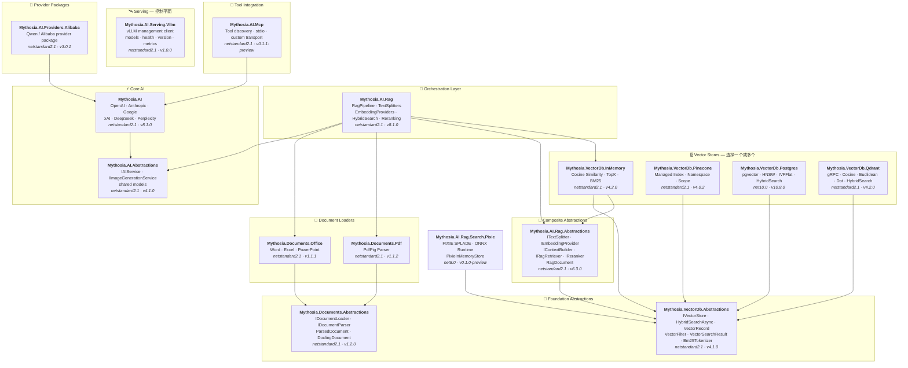

<div align="center">

🌐 [English](../../README.md) · [한국어](../ko/README.md) · [日本語](../ja/README.md) · [Français](../fr/README.md) · [Deutsch](../de/README.md) · [Русский](../ru/README.md) · [Українська](../uk/README.md) · [简体中文](README.md) · [繁體中文](../zh-Hant/README.md) · [Tiếng Việt](../vi/README.md) · [ภาษาไทย](../th/README.md) · [Português](../pt/README.md) · [Español](../es/README.md)

<br>

[](https://github.com/AJ-comp/Mythosia.AI)


### 用于构建智能应用的模块化 .NET AI 库

**切换提供商、接入 RAG、加载文档 — 一套统一的 API 全部搞定。**

<br>

[](https://www.nuget.org/packages/Mythosia.AI)
[](https://www.nuget.org/packages/Mythosia.AI)
[](https://aj-comp.github.io/Mythosia.AI/)
[](https://dotnet.microsoft.com)

<br>

**[📖 快速入门](https://aj-comp.github.io/Mythosia.AI/)** &nbsp;·&nbsp; **[API 参考](https://aj-comp.github.io/Mythosia.AI/api/)** &nbsp;·&nbsp; **[GitHub ↗](https://github.com/AJ-comp/Mythosia.AI)**

<br>

</div>

TXT 与 Markdown 应按文档结构选择[规则分割器](text-splitters.md)。实现会检查大小、重叠和 Unicode 边界，并保留 Markdown 标题、代码块和表格行。字符或单词数量不等于模型 token 上限。 表格条件和代码缩进的含义会保留；Markdown 上下文重复过量时会明确抛出异常并停止。

为避免索引看似成功却覆盖分块或关联错误向量，[索引验证](rag-pipeline.md#indexing-validation)会在持久化前拒绝无效 ID 和嵌入批次。自定义分割器必须提供唯一 ID 并继承文档元数据。

稳定的[文件标识](document-loaders.md#file-source-identity)、[问题向量验证](rag-embedding.md#query-embedding-validation)及[按文档持久化与 URL 取消](rag-pipeline.md#custom-persistence)可防止重复注册、无效搜索和旧分块残留。

可选的 `Mythosia.AI.Rag.Search.Pixie` 预览版可比较本地神经网络稀疏搜索与现有搜索。它保留现有稠密嵌入服务，将 PIXIE 索引放在内存中，不迁移持久化存储，也不自动替换默认搜索。 [PIXIE 配置与比较指南（英文）](../rag-pixie-search.md).

独立管理请求设置，停止进行中的任务，并同时获取答案、用量和来源。[v8 升级指南](v8-migration.md)整理了六项架构变更、迁移示例和验证范围。

> 本文档对应的包版本: [Mythosia.AI 8.1.0](../../src/core/Mythosia.AI/RELEASE_NOTES.md#v810), [Abstractions 4.1.0](../../src/core/Mythosia.AI.Abstractions/RELEASE_NOTES.md#v410), [Alibaba 3.0.1](../../src/core/Mythosia.AI.Providers.Alibaba/RELEASE_NOTES.md#v301), [RAG 8.1.0](../../src/rag/Mythosia.AI.Rag/RELEASE_NOTES.md#v810), [MCP 0.1.1-preview](../../src/integrations/Mythosia.AI.Mcp/RELEASE_NOTES.md#v011-preview), [Serving.Vllm 1.0.0](../../src/serving/Mythosia.AI.Serving.Vllm/RELEASE_NOTES.md#v100).

---

### 需要安装哪些包？

```
dotnet add package Mythosia.AI                    # 从这里开始（这就够了）
dotnet add package Mythosia.AI.Rag                # 可选：需要 RAG 时安装
dotnet add package Mythosia.VectorDb.Postgres     # 可选：需要生产级向量存储时安装
```

| 步骤 | 包 | 适用场景 |
| :--: | --- | --- |
| **1** | **`Mythosia.AI`** | **从这里开始** — 补全、流式输出、函数调用、结构化输出 (OpenAI / Claude / Gemini / Grok / DeepSeek / Perplexity) |
| **2** | **`Mythosia.AI.Rag`** | 需要 RAG 时 — 文本分割、嵌入、混合搜索、重排序、InMemory 向量存储、文档加载器 (Word / Excel / PowerPoint / PDF) |
| **3** | **`Mythosia.VectorDb.Postgres`** / **`Qdrant`** / **`Pinecone`** | 需要生产级向量存储替代 InMemory 时 — 选择其一 |

使用`CreateRequest(...).WithTemperature(...).GetCompletionAsync()`准备独立请求，不改变其他请求的设置。[请求设置指南](request-building.md)包含Before/After、Run、配置档及共享会话限制。

对等待时间敏感的请求可选择[处理速度](request-building.md#inference-speed)。`WithSpeed` 保持模型和推理级别，`Processing` 显示供应商实际应用的模式。Fast 是受支持组合上的付费选项。

## 架构

<a href="../assets/architecture.svg">
  <picture>
    <source media="(prefers-color-scheme: dark)" srcset="../assets/architecture-dark.svg">
    
  </picture>
</a>

<details>
<summary>包依赖关系详情</summary>



</details>

## 演示 / 测试平台 (Chat UI)

本仓库包含一个基于 Mythosia.AI 构建的示例 Chat UI — 启动 Mythosia.AI.Samples.ChatUi 即可体验库的实际效果。

### 运行示例

在本地运行 **`Mythosia.AI.Samples.ChatUi`**：

```bash
# 在仓库根目录下
dotnet run --project apps/Mythosia.AI.Samples.ChatUi
```

https://github.com/user-attachments/assets/62094afe-9add-4c14-b818-6b31f200dc01


## 快速开始

### 基础 AI 补全

```csharp
using Mythosia.AI;

var service = new OpenAIService(apiKey, httpClient);
var response = await service.GetCompletionAsync("Hello!");
```

### 流式输出

```csharp
await foreach (var token in service.StreamAsync("Tell me a story"))
{
    Console.Write(token);
}
```

### 推理流式输出

OpenAI、Claude、Gemini、Grok 和 DeepSeek Flash 通过相同流式模式返回提供方推理。先在服务或请求中开启推理，再用 `StreamOptions.WithReasoning()` 观察：

```csharp
await foreach (var content in service.StreamAsync(message, new StreamOptions().WithReasoning()))
{
    if (content.Type == StreamingContentType.Reasoning)
        Console.Write($"[Think] {content.Content}");
    else if (content.Type == StreamingContentType.Text)
        Console.Write(content.Content);
}
```

### 函数调用

```csharp
var service = new OpenAIService(apiKey, httpClient)
    .WithFunction(
        "get_weather",
        "Gets the current weather for a location",
        ("location", "The city and country", required: true),
        (string location) => $"The weather in {location} is sunny, 22C"
    );

var response = await service.GetCompletionAsync("What's the weather in Seoul?");
```

天气查询较慢时，模型仍可先介绍不依赖天气结果的通用旅行用品。模型原生异步工具调用用于在这种等待期间继续独立工作；依赖查询结果的判断仍应等结果返回后再进行。

通过 `FunctionDefinition.AllowAsync = true` 或 `FunctionBuilder.WithAsync()`，可选择允许 GPT-6 Astra / Sol / Luna 在 Responses API 中异步调用工具。默认值为 `false`；不支持的模型仍等待同一个处理器的结果。示例和请求生命周期见[函数调用指南](function-calling.md)。

如果回答需要最新信息或文档依据，请参阅[推理与搜索指南](reasoning-and-search.md)。通用选项可启用网页搜索或已有文档存储，并获取回答的来源引用。

### 结构化输出（基础）

```csharp
// 将 LLM 响应直接反序列化为 C# POCO，支持自动修复
var result = await service.GetCompletionAsync<WeatherResponse>(
    "What's the weather in Seoul?");
```

### 结构化输出（列表）

```csharp
// 集合类型直接可用 — 无需包装 DTO
var items = await service.GetCompletionAsync<List<ItemDto>>(
    "Extract all entities from this document...");
```

### 结构化输出（流式）

```csharp
// 实时流式接收文本片段 + 获取最终反序列化对象
var run = service.BeginStream(prompt).As<MyDto>();

await foreach (var chunk in run.Stream())
    Console.Write(chunk);          // 实时 UI

MyDto dto = await run.Result;      // 已解析并自动修复
```

### 对话摘要策略

```csharp
// 当对话变长时自动摘要旧消息
service.ConversationPolicy = SummaryConversationPolicy.ByMessage(
    triggerCount: 20,
    keepRecentCount: 5
);

// 基于 Token 的触发
service.ConversationPolicy = SummaryConversationPolicy.ByToken(
    triggerTokens: 3000,
    keepRecentTokens: 1000
);

// 正常使用即可 — 摘要会自动进行
await service.GetCompletionAsync("Continue our conversation...");

// 流式输出时，在 StreamAsync() 前显式应用摘要策略
await service.ApplySummaryPolicyIfNeededAsync();
await foreach (var chunk in service.StreamAsync("Continue..."))
    Console.Write(chunk.Content);

// 跨会话保存/恢复摘要
string saved = service.ConversationPolicy.CurrentSummary;
policy.LoadSummary(saved);
```

### RAG（检索增强生成）

选择关键词、语义或混合检索，无需强制每次搜索生成问题嵌入。[检索指南](rag-hybrid-search.md)。

```bash
dotnet add package Mythosia.AI.Rag
```

```csharp
using Mythosia.AI.Rag;

var service = new AnthropicService(apiKey, httpClient)
    .WithRag(rag => rag
        .AddDocument("manual.txt")
        .AddDocument("policy.txt")
    );

var response = await service.GetCompletionAsync("What is the refund policy?");
```

## 支持的提供商

> Grok 4.7: 需要 Mythosia.AI 8.1.0 / Abstractions 4.1.0。 [模型选择、推理与处理速度](providers.md#grok-47)

> GPT-6 Sol/Luna: 需要 Mythosia.AI 8.1.0 / Abstractions 4.1.0。 [模型选择与版本要求](providers.md#gpt-6-sol-luna)

> Claude Opus 5.5: 需要 Mythosia.AI 8.1.0 / Abstractions 4.1.0。 [配置与迁移](providers.md#claude-opus-55)

| 提供商 | 包 | 模型 |
| --- | --- | --- |
| **OpenAI** | `Mythosia.AI` | GPT-6 Astra / Sol / Luna, GPT-5.6 Sol / Terra / Luna, GPT-5.5 / 5.5 Pro / 5.4 / 5.4 Mini / 5.4 Nano / 5.4 Pro / 5.3 Codex / 5.2 / 5.2 Pro / 5.1, GPT-4.1 / 4.1 Mini, GPT-4o / 4o Mini |
| **Anthropic** | `Mythosia.AI` | Claude Fable 5.1 / 5, Mythos 5.1 / 5 (limited), [Opus 5.5](providers.md#claude-opus-55) / 5 / 4.8 / 4.7 / 4.6 / 4.5, Sonnet 5 / 4.6 / 4.5, Haiku 4.5 |
| **Google** | `Mythosia.AI` | Gemini 3.8 Flash, Gemini 3.7 Flash, Gemini 3.6 Flash, Gemini 3.5 Flash/Flash-Lite, Gemini 3.1 Pro Preview/Flash-Lite, Gemini 3 Flash Preview, Gemini 2.5 Pro/Flash/Flash-Lite, Gemini 3.1 Flash Image, Gemini 3.1 Flash-Lite Image, Gemini 3 Pro Image |
| **xAI** | `Mythosia.AI` | Grok 4.7, Grok 4.6, Grok 4.5 (默认), Grok 4.3, Grok 4.20 (reasoning / non-reasoning), Grok Build |
| **DeepSeek** | `Mythosia.AI` | Flash (V4.1 Flash), V4 Pro |
| **Perplexity** | `Mythosia.AI` | Agent API 预设与 `perplexity/sonar` |
| **Alibaba / Qwen** | `Mythosia.AI.Providers.Alibaba` | Qwen Max / Plus / Turbo / Qwen3 / Qwen3.5 系列 |

当回答需要基于最新信息，并让读者能够核对来源时，可以使用 Perplexity。`PerplexityService` 调用 Agent API；独立搜索和嵌入则用于为自行选择的回答模型构建检索能力。 [Perplexity Agent API、搜索与嵌入](perplexity.md).

审查长文档或执行多轮工具任务时，可以通过现有 Google 适配器选择 Gemini 3.7 Flash 或 3.8 Flash。支持从 `Mythosia.AI` 8.0.0 / `Mythosia.AI.Abstractions` 4.0.0 开始，服务默认模型仍为 Gemini 3.6 Flash。

需要快速起草再深入审查时，可显式选择 Grok 4.6，并设置 `Low` 至 `XHigh` 的推理强度。支持从 `Mythosia.AI` 8.0.0 / `Mythosia.AI.Abstractions` 4.0.0 开始，`XAIService` 默认模型仍为 Grok 4.5。参阅 [Grok 配置](providers.md#xai-xaiservice)。

创建图片草稿或组合参考图时，通过`IImageGenerationService`使用[Grok Imagine Image 2.0](providers.md#grok-imagine-image-20)。保留`OutputFormat = ImageOutputFormat.Auto`，并根据`MediaType`选择扩展名；xAI不能选择输出编码。参见[图片选项类型迁移](providers.md#image-options-migration)。聊天模型保持不变。

快速制作视觉草稿可选 Flare，精细修改可选 Sunburst。[GPT Image 2.5 生成与编辑](providers.md#gpt-image-25)通过现有图像 API 为每个请求指定模型；OpenAI 默认仍为 GPT Image 2。

生成或编辑图像时，请通过 [Google 各模型的图像选项](providers.md#google-image-options)选择有效尺寸。Flash 支持 512/1K/2K/4K，Flash-Lite 目前支持 1K，Pro 支持 1K/2K/4K。Flash/Lite 提供 14 种宽高比，Pro 提供 10 种标准宽高比；全部接受 `Auto`。显式指定不支持的尺寸或宽高比会在 HTTP 请求前被拒绝。

图表和截图分析、本地函数调用、快速回答后的深入审查可使用 [DeepSeek Flash](providers.md#deepseek-deepseekservice) (`AIModels.DeepSeek.Flash`, V4.1 Flash)。推理默认关闭，通过 `WithDeepSeekReasoning(...)` 或请求级 `WithReasoning(...)` 开启。

纯文本任务可选择 `AIModels.DeepSeek.V4Pro` (`deepseek-v4-pro`, V4-Pro-0813)。默认模型 Flash 支持图像，两者均提供 Low/High/Max 推理和相同输出上限。若要通过现有补全、流式、Run 和本地函数 API 使用 Responses，请在创建请求前设置 `UseResponsesApi = true`。默认仍为 `false`，以保留现有应用的 Chat Completions 行为；设置会固定到该请求及后续工具轮次。Responses 重发完整对话和原始推理历史，不依赖服务器保存的响应 ID。

使用 `DeepSeekImageFileContent`，可在 Flash 的 Chat Completions 或 Responses 中为多次提问复用已上传图像；仅支持文本的 V4 Pro 会拒绝图像。 请参阅[图像上传、复用与限制](providers.md#deepseek-deepseekservice)。 需要 Mythosia.AI 8.1.0 / Abstractions 4.1.0。

## 包列表

### 核心

| 包 | NuGet | 描述 |
| --- | --- | --- |
| [Mythosia.AI](../../src/core/Mythosia.AI/README.md) | [](https://www.nuget.org/packages/Mythosia.AI) | 核心库 — 内置提供商、流式输出、函数调用及多模态支持 |
| [Mythosia.AI.Abstractions](../../src/core/Mythosia.AI.Abstractions/README.md) | [](https://www.nuget.org/packages/Mythosia.AI.Abstractions) | `IAIService` 接口和共享模型 — 面向库的轻量契约包 |
| [Mythosia.AI.Providers.Alibaba](../../src/core/Mythosia.AI.Providers.Alibaba/README.md) | [](https://www.nuget.org/packages/Mythosia.AI.Providers.Alibaba) | 基于 `Mythosia.AI` 的 Alibaba / Qwen 提供商包 |

### RAG

| 包 | NuGet | 描述 |
| --- | --- | --- |
| [Mythosia.AI.Rag](../../src/rag/Mythosia.AI.Rag/README.md) | [](https://www.nuget.org/packages/Mythosia.AI.Rag) | 通过 `.WithRag()` API 为 IAIService 提供 Fluent RAG 扩展 |
| [Mythosia.AI.Rag.Abstractions](../../src/rag/Mythosia.AI.Rag.Abstractions/README.md) | [](https://www.nuget.org/packages/Mythosia.AI.Rag.Abstractions) | RAG 管道组件的接口和模型 |

### 文档加载器

| 包 | NuGet | 描述 |
| --- | --- | --- |
| [Mythosia.Documents.Abstractions](../../src/loaders/Mythosia.Documents.Abstractions/README.md) | [](https://www.nuget.org/packages/Mythosia.Documents.Abstractions) | 文档加载器接口和模型 (`IDocumentLoader`, `DoclingDocument`) |
| [Mythosia.Documents.Office](../../src/loaders/Mythosia.Documents.Office/README.md) | [](https://www.nuget.org/packages/Mythosia.Documents.Office) | Word / Excel / PowerPoint 的 OpenXml 解析器 |
| [Mythosia.Documents.Pdf](../../src/loaders/Mythosia.Documents.Pdf/README.md) | [](https://www.nuget.org/packages/Mythosia.Documents.Pdf) | 基于 PdfPig 的 PDF 解析器 |

### 向量存储

> **选择一个或多个** — 均实现 Abstractions 包中的 `IVectorStore`。

| 包 | NuGet | 描述 |
| --- | --- | --- |
| [Mythosia.VectorDb.Abstractions](../../src/vectordb/Mythosia.VectorDb.Abstractions/README.md) | [](https://www.nuget.org/packages/Mythosia.VectorDb.Abstractions) | `IVectorStore` · `VectorRecord` · `VectorFilter` 契约 |
| [Mythosia.VectorDb.InMemory](../../src/vectordb/Mythosia.VectorDb.InMemory/README.md) | [](https://www.nuget.org/packages/Mythosia.VectorDb.InMemory) | 内存存储 — 零基础设施，非常适合原型开发 |
| [Mythosia.VectorDb.Pinecone](../../src/vectordb/Mythosia.VectorDb.Pinecone/README.md) | [](https://www.nuget.org/packages/Mythosia.VectorDb.Pinecone) | Pinecone HTTP API — 托管向量数据库的索引/命名空间/作用域隔离 |
| [Mythosia.VectorDb.Postgres](../../src/vectordb/Mythosia.VectorDb.Postgres/README.md) | [](https://www.nuget.org/packages/Mythosia.VectorDb.Postgres) | PostgreSQL + pgvector — HNSW / IVFFlat 索引，可用于生产环境 |
| [Mythosia.VectorDb.Qdrant](../../src/vectordb/Mythosia.VectorDb.Qdrant/README.md) | [](https://www.nuget.org/packages/Mythosia.VectorDb.Qdrant) | Qdrant gRPC 客户端 — Cosine / Euclidean / Dot，自动配置 |

### Serving — 控制平面

> 面向模型服务运行时的管理/内省客户端。聊天仍由提供商包负责：`Providers.*` = 聊天数据平面，`Serving.*` = 服务器控制平面。

| 包 | NuGet | 描述 |
| --- | --- | --- |
| [Mythosia.AI.Serving.Vllm](../../src/serving/Mythosia.AI.Serving.Vllm/README.md) | [](https://www.nuget.org/packages/Mythosia.AI.Serving.Vllm) | vLLM 控制平面客户端 — 模型卡（通过 `root` 获取实际加载的模型）、健康检查、服务器版本、Prometheus 指标 |

## 仓库结构

```text
src/
  core/
    Mythosia.AI/                        # 核心 AI 服务库
    Mythosia.AI.Abstractions/           # IAIService 接口和共享模型
    Mythosia.AI.Providers.Alibaba/      # Alibaba / Qwen 提供商包
  loaders/
    Mythosia.Documents.Abstractions/    # 文档加载器契约 (IDocumentLoader, DoclingDocument)
    Mythosia.Documents.Office/          # Office 文档加载器 (Word/Excel/PowerPoint)
    Mythosia.Documents.Pdf/             # PDF 文档加载器
  rag/
    Mythosia.AI.Rag/                    # RAG Fluent API 和管道
    Mythosia.AI.Rag.Abstractions/       # RAG 接口和模型 (RagDocument)
  serving/
    Mythosia.AI.Serving.Vllm/           # vLLM 控制平面客户端 (模型/健康/版本/指标)
  vectordb/
    Mythosia.VectorDb.Abstractions/     # 向量存储契约
    Mythosia.VectorDb.InMemory/         # 内存向量存储
    Mythosia.VectorDb.Pinecone/         # Pinecone 向量存储
    Mythosia.VectorDb.Postgres/         # PostgreSQL + pgvector 存储
    Mythosia.VectorDb.Qdrant/           # Qdrant 向量存储
apps/                                   # 示例应用
tests/                                  # 单元/集成测试项目
```

## 安装

```bash
dotnet add package Mythosia.AI
```

如需对流进行高级 LINQ 操作：

```bash
dotnet add package System.Linq.Async
```

## 文档

- [基础使用指南](getting-started.md)
- [Mythosia.AI README](../../src/core/Mythosia.AI/README.md)  包含函数调用、流式输出和模型配置的完整 API 参考
- [Mythosia.AI.Rag README](../../src/rag/Mythosia.AI.Rag/README.md)  RAG 管道使用方法和自定义实现
- [加载器指南](document-loaders.md)
- [发布说明](../../src/core/Mythosia.AI/RELEASE_NOTES.md)

## 许可证

本项目基于 [MIT 许可证](https://github.com/AJ-comp/Mythosia.AI/blob/main/LICENSE) 发布。

## 前身

本项目最初是 [Mythosia](https://github.com/AJ-comp/Mythosia) 的一部分。

[用共享支持定义构建模型功能选项](model-capabilities.md).
