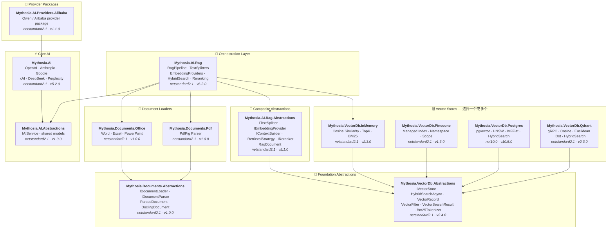

<div align="center">

🌐 [English](../../README.md) · [한국어](../ko/README.md) · [日本語](../ja/README.md) · [Français](../fr/README.md) · [Deutsch](../de/README.md) · [Русский](../ru/README.md) · [Українська](../uk/README.md) · [简体中文](README.md) · [繁體中文](../zh-Hant/README.md) · [Tiếng Việt](../vi/README.md) · [ภาษาไทย](../th/README.md) · [Português](../pt/README.md) · [Español](../es/README.md)

<br>

[](https://github.com/AJ-comp/Mythosia.AI)


### 用于构建智能应用的模块化 .NET AI 库

**切换提供商、接入 RAG、加载文档 — 一套统一的 API 全部搞定。**

<br>

[](https://www.nuget.org/packages/Mythosia.AI)
[](https://www.nuget.org/packages/Mythosia.AI)
[](https://aj-comp.github.io/Mythosia.AI/)
[](https://dotnet.microsoft.com)

<br>

**[📖 快速入门](https://aj-comp.github.io/Mythosia.AI/)** &nbsp;·&nbsp; **[API 参考](https://aj-comp.github.io/Mythosia.AI/api/)** &nbsp;·&nbsp; **[GitHub ↗](https://github.com/AJ-comp/Mythosia.AI)**

<br>

</div>

---

### 需要安装哪些包？

```
dotnet add package Mythosia.AI                    # 从这里开始（这就够了）
dotnet add package Mythosia.AI.Rag                # 可选：需要 RAG 时安装
dotnet add package Mythosia.VectorDb.Postgres     # 可选：需要生产级向量存储时安装
```

| 步骤 | 包 | 适用场景 |
| :--: | --- | --- |
| **1** | **`Mythosia.AI`** | **从这里开始** — 补全、流式输出、函数调用、结构化输出 (OpenAI / Claude / Gemini / Grok / DeepSeek / Perplexity) |
| **2** | **`Mythosia.AI.Rag`** | 需要 RAG 时 — 文本分割、嵌入、混合搜索、重排序、InMemory 向量存储、文档加载器 (Word / Excel / PowerPoint / PDF) |
| **3** | **`Mythosia.VectorDb.Postgres`** / **`Qdrant`** / **`Pinecone`** | 需要生产级向量存储替代 InMemory 时 — 选择其一 |

## 架构



## 演示 / 测试平台 (Chat UI)

本仓库包含一个基于 Mythosia.AI 构建的示例 Chat UI — 启动 Mythosia.AI.Samples.ChatUi 即可体验库的实际效果。

### 运行示例

在本地运行 **`Mythosia.AI.Samples.ChatUi`**：

```bash
# 在仓库根目录下
dotnet run --project samples/Mythosia.AI.Samples.ChatUi
```

https://github.com/user-attachments/assets/62094afe-9add-4c14-b818-6b31f200dc01


## 快速开始

### 基础 AI 补全

```csharp
using Mythosia.AI;

var service = new OpenAIService(apiKey, httpClient);
var response = await service.GetCompletionAsync("Hello!");
```

### 流式输出

```csharp
await foreach (var token in service.StreamAsync("Tell me a story"))
{
    Console.Write(token);
}
```

### 推理流式输出

所有支持推理的提供商（OpenAI、Claude、Gemini、Grok、DeepSeek）都使用相同的流式模式：

```csharp
await foreach (var content in service.StreamAsync(message, new StreamOptions().WithReasoning()))
{
    if (content.Type == StreamingContentType.Reasoning)
        Console.Write($"[Think] {content.Content}");
    else if (content.Type == StreamingContentType.Text)
        Console.Write(content.Content);
}
```

### 函数调用

```csharp
var service = new OpenAIService(apiKey, httpClient)
    .WithFunction(
        "get_weather",
        "Gets the current weather for a location",
        ("location", "The city and country", required: true),
        (string location) => $"The weather in {location} is sunny, 22C"
    );

var response = await service.GetCompletionAsync("What's the weather in Seoul?");
```

### 结构化输出（基础）

```csharp
// 将 LLM 响应直接反序列化为 C# POCO，支持自动修复
var result = await service.GetCompletionAsync<WeatherResponse>(
    "What's the weather in Seoul?");
```

### 结构化输出（列表）

```csharp
// 集合类型直接可用 — 无需包装 DTO
var items = await service.GetCompletionAsync<List<ItemDto>>(
    "Extract all entities from this document...");
```

### 结构化输出（流式）

```csharp
// 实时流式接收文本片段 + 获取最终反序列化对象
var run = service.BeginStream(prompt).As<MyDto>();

await foreach (var chunk in run.Stream())
    Console.Write(chunk);          // 实时 UI

MyDto dto = await run.Result;      // 已解析并自动修复
```

### 对话摘要策略

```csharp
// 当对话变长时自动摘要旧消息
service.ConversationPolicy = SummaryConversationPolicy.ByMessage(
    triggerCount: 20,
    keepRecentCount: 5
);

// 基于 Token 的触发
service.ConversationPolicy = SummaryConversationPolicy.ByToken(
    triggerTokens: 3000,
    keepRecentTokens: 1000
);

// 正常使用即可 — 摘要会自动进行
await service.GetCompletionAsync("Continue our conversation...");

// 流式输出时，在 StreamAsync() 前显式应用摘要策略
await service.ApplySummaryPolicyIfNeededAsync();
await foreach (var chunk in service.StreamAsync("Continue..."))
    Console.Write(chunk.Content);

// 跨会话保存/恢复摘要
string saved = service.ConversationPolicy.CurrentSummary;
policy.LoadSummary(saved);
```

### RAG（检索增强生成）

```bash
dotnet add package Mythosia.AI.Rag
```

```csharp
using Mythosia.AI.Rag;

var service = new AnthropicService(apiKey, httpClient)
    .WithRag(rag => rag
        .AddDocument("manual.txt")
        .AddDocument("policy.txt")
    );

var response = await service.GetCompletionAsync("What is the refund policy?");
```

## 支持的提供商

| 提供商 | 包 | 模型 |
| --- | --- | --- |
| **OpenAI** | `Mythosia.AI` | GPT-5.4 / 5.4 Mini / 5.4 Nano / 5.4 Pro / 5.3 Codex / 5.2 / 5.2 Pro / 5.2 Codex / 5.1 / 5 / 5 Mini / 5 Nano, GPT-4.1 / 4.1 Mini / 4.1 Nano, GPT-4o / 4o Mini, o3 / o3 Pro |
| **Anthropic** | `Mythosia.AI` | Claude Opus 4.6 / 4.5 / 4.1 / 4, Sonnet 4.6 / 4.5 / 4, Haiku 4.5 |
| **Google** | `Mythosia.AI` | Gemini 3 Flash/Pro Preview, Gemini 2.5 Pro/Flash/Flash-Lite |
| **xAI** | `Mythosia.AI` | Grok 4, Grok 4.1 Fast, Grok 3, Grok 3 Mini |
| **DeepSeek** | `Mythosia.AI` | Chat, Reasoner |
| **Perplexity** | `Mythosia.AI` | Sonar, Sonar Pro, Sonar Reasoning |
| **Alibaba / Qwen** | `Mythosia.AI.Providers.Alibaba` | Qwen Max / Plus / Turbo / Qwen3 / Qwen3.5 系列 |

## 包列表

### 核心

| 包 | NuGet | 描述 |
| --- | --- | --- |
| [Mythosia.AI](../../src/core/Mythosia.AI/) | [](https://www.nuget.org/packages/Mythosia.AI) | 核心库 — 内置提供商、流式输出、函数调用及多模态支持 |
| [Mythosia.AI.Abstractions](../../src/core/Mythosia.AI.Abstractions/) | [](https://www.nuget.org/packages/Mythosia.AI.Abstractions) | `IAIService` 接口和共享模型 — 面向库的轻量契约包 |
| [Mythosia.AI.Providers.Alibaba](../../src/core/Mythosia.AI.Providers.Alibaba/) | [](https://www.nuget.org/packages/Mythosia.AI.Providers.Alibaba) | 基于 `Mythosia.AI` 的 Alibaba / Qwen 提供商包 |

### RAG

| 包 | NuGet | 描述 |
| --- | --- | --- |
| [Mythosia.AI.Rag](../../src/rag/Mythosia.AI.Rag/) | [](https://www.nuget.org/packages/Mythosia.AI.Rag) | 通过 `.WithRag()` API 为 IAIService 提供 Fluent RAG 扩展 |
| [Mythosia.AI.Rag.Abstractions](../../src/rag/Mythosia.AI.Rag.Abstractions/) | [](https://www.nuget.org/packages/Mythosia.AI.Rag.Abstractions) | RAG 管道组件的接口和模型 |

### 文档加载器

| 包 | NuGet | 描述 |
| --- | --- | --- |
| [Mythosia.Documents.Abstractions](../../src/loaders/Mythosia.Documents.Abstractions/) | [](https://www.nuget.org/packages/Mythosia.Documents.Abstractions) | 文档加载器接口和模型 (`IDocumentLoader`, `DoclingDocument`) |
| [Mythosia.Documents.Office](../../src/loaders/Mythosia.Documents.Office/) | [](https://www.nuget.org/packages/Mythosia.Documents.Office) | Word / Excel / PowerPoint 的 OpenXml 解析器 |
| [Mythosia.Documents.Pdf](../../src/loaders/Mythosia.Documents.Pdf/) | [](https://www.nuget.org/packages/Mythosia.Documents.Pdf) | 基于 PdfPig 的 PDF 解析器 |

### 向量存储

> **选择一个或多个** — 均实现 Abstractions 包中的 `IVectorStore`。

| 包 | NuGet | 描述 |
| --- | --- | --- |
| [Mythosia.VectorDb.Abstractions](../../src/vectordb/Mythosia.VectorDb.Abstractions/) | [](https://www.nuget.org/packages/Mythosia.VectorDb.Abstractions) | `IVectorStore` · `VectorRecord` · `VectorFilter` 契约 |
| [Mythosia.VectorDb.InMemory](../../src/vectordb/Mythosia.VectorDb.InMemory/) | [](https://www.nuget.org/packages/Mythosia.VectorDb.InMemory) | 内存存储 — 零基础设施，非常适合原型开发 |
| [Mythosia.VectorDb.Pinecone](../../src/vectordb/Mythosia.VectorDb.Pinecone/) | [](https://www.nuget.org/packages/Mythosia.VectorDb.Pinecone) | Pinecone HTTP API — 托管向量数据库的索引/命名空间/作用域隔离 |
| [Mythosia.VectorDb.Postgres](../../src/vectordb/Mythosia.VectorDb.Postgres/) | [](https://www.nuget.org/packages/Mythosia.VectorDb.Postgres) | PostgreSQL + pgvector — HNSW / IVFFlat 索引，可用于生产环境 |
| [Mythosia.VectorDb.Qdrant](../../src/vectordb/Mythosia.VectorDb.Qdrant/) | [](https://www.nuget.org/packages/Mythosia.VectorDb.Qdrant) | Qdrant gRPC 客户端 — Cosine / Euclidean / Dot，自动配置 |

## 仓库结构

```text
src/
  core/
    Mythosia.AI/                        # 核心 AI 服务库
    Mythosia.AI.Abstractions/           # IAIService 接口和共享模型
    Mythosia.AI.Providers.Alibaba/      # Alibaba / Qwen 提供商包
  loaders/
    Mythosia.Documents.Abstractions/    # 文档加载器契约 (IDocumentLoader, DoclingDocument)
    Mythosia.Documents.Office/          # Office 文档加载器 (Word/Excel/PowerPoint)
    Mythosia.Documents.Pdf/             # PDF 文档加载器
  rag/
    Mythosia.AI.Rag/                    # RAG Fluent API 和管道
    Mythosia.AI.Rag.Abstractions/       # RAG 接口和模型 (RagDocument)
  vectordb/
    Mythosia.VectorDb.Abstractions/     # 向量存储契约
    Mythosia.VectorDb.InMemory/         # 内存向量存储
    Mythosia.VectorDb.Pinecone/         # Pinecone 向量存储
    Mythosia.VectorDb.Postgres/         # PostgreSQL + pgvector 存储
    Mythosia.VectorDb.Qdrant/           # Qdrant 向量存储
samples/                                # 示例应用
tests/                                  # 单元/集成测试项目
```

## 安装

```bash
dotnet add package Mythosia.AI
```

如需对流进行高级 LINQ 操作：

```bash
dotnet add package System.Linq.Async
```

## 文档

- [基础使用指南](https://github.com/AJ-comp/Mythosia.AI/wiki)
- [Mythosia.AI README](../../src/core/Mythosia.AI/README.md)  包含函数调用、流式输出和模型配置的完整 API 参考
- [Mythosia.AI.Rag README](../../src/rag/Mythosia.AI.Rag/README.md)  RAG 管道使用方法和自定义实现
- [加载器指南](document-loaders.md)
- [发布说明](../../src/core/Mythosia.AI/RELEASE_NOTES.md)

## 许可证

本项目基于 [MIT 许可证](../../LICENSE) 发布。

## 前身

本项目最初是 [Mythosia](https://github.com/AJ-comp/Mythosia) 的一部分。
