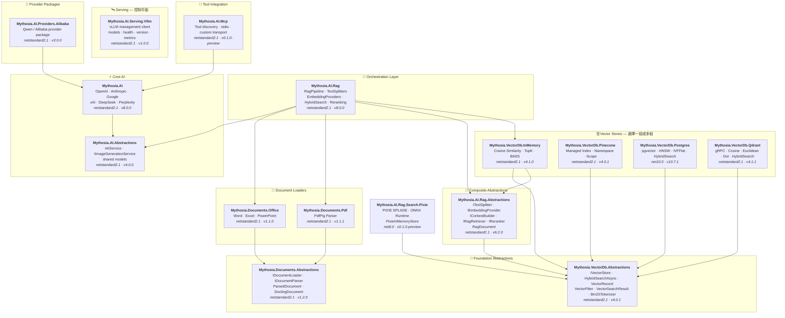

<div align="center">

🌐 [English](../../README.md) · [한국어](../ko/README.md) · [日本語](../ja/README.md) · [Français](../fr/README.md) · [Deutsch](../de/README.md) · [Русский](../ru/README.md) · [Українська](../uk/README.md) · [简体中文](../zh-Hans/README.md) · [繁體中文](README.md) · [Tiếng Việt](../vi/README.md) · [ภาษาไทย](../th/README.md) · [Português](../pt/README.md) · [Español](../es/README.md)

<br>

[](https://github.com/AJ-comp/Mythosia.AI)


### 用於建構智慧應用的模組化 .NET AI 函式庫

**切換供應商、加入 RAG、載入文件 — 一套統一的 API 全部搞定。**

<br>

[](https://www.nuget.org/packages/Mythosia.AI)
[](https://www.nuget.org/packages/Mythosia.AI)
[](https://aj-comp.github.io/Mythosia.AI/)
[](https://dotnet.microsoft.com)

<br>

**[📖 快速入門](https://aj-comp.github.io/Mythosia.AI/)** &nbsp;·&nbsp; **[API 參考](https://aj-comp.github.io/Mythosia.AI/api/)** &nbsp;·&nbsp; **[GitHub ↗](https://github.com/AJ-comp/Mythosia.AI)**

<br>

</div>

TXT 與 Markdown 應依文件結構選擇[規則式分割器](text-splitters.md)。實作會檢查大小、重疊與 Unicode 邊界，並保留 Markdown 標題、程式碼區塊及表格列。字元或單字數量不等於模型 token 上限。 表格條件與程式碼縮排的含義會保留；Markdown 上下文重複過量時會明確擲出例外並停止。

為避免索引看似成功卻覆寫區塊或關聯錯誤向量，[索引驗證](rag-pipeline.md#indexing-validation)會在持久化前拒絕無效 ID 和嵌入批次。自訂分割器必須提供唯一 ID 並繼承文件中繼資料。

穩定的[檔案識別](document-loaders.md#file-source-identity)、[問題向量驗證](rag-embedding.md#query-embedding-validation)及[文件單位持久化與 URL 取消](rag-pipeline.md#custom-persistence)可防止重複註冊、無效搜尋與舊區塊殘留。

選用的 `Mythosia.AI.Rag.Search.Pixie` 預覽版可比較本機神經網路稀疏搜尋與既有搜尋。它保留既有稠密嵌入服務，將 PIXIE 索引放在記憶體中，不遷移持久化儲存區，也不自動取代預設搜尋。 [PIXIE 設定與比較指南（英文）](../rag-pixie-search.md).

獨立管理請求設定，停止進行中的工作，並同時取得答案、用量與來源。[v8 升級指南](v8-migration.md)整理了六項架構變更、遷移範例與驗證範圍。

> 本文件對應的套件版本: [Mythosia.AI 8.0.0](../../src/core/Mythosia.AI/RELEASE_NOTES.md#v800), [Abstractions 4.0.0](../../src/core/Mythosia.AI.Abstractions/RELEASE_NOTES.md#v400), [Alibaba 3.0.0](../../src/core/Mythosia.AI.Providers.Alibaba/RELEASE_NOTES.md#v300), [RAG 8.0.0](../../src/rag/Mythosia.AI.Rag/RELEASE_NOTES.md#v800), [MCP 0.1.0-preview](../../src/integrations/Mythosia.AI.Mcp/RELEASE_NOTES.md#v010-preview), [Serving.Vllm 1.0.0](../../src/serving/Mythosia.AI.Serving.Vllm/RELEASE_NOTES.md#v100).

---

### 需要安裝哪些套件？

```
dotnet add package Mythosia.AI                    # 從這裡開始（這就夠了）
dotnet add package Mythosia.AI.Rag                # 可選：需要 RAG 時安裝
dotnet add package Mythosia.VectorDb.Postgres     # 可選：需要正式環境向量儲存時安裝
```

| 步驟 | 套件 | 適用情境 |
| :--: | --- | --- |
| **1** | **`Mythosia.AI`** | **從這裡開始** — 補全、串流、函式呼叫、結構化輸出 (OpenAI / Claude / Gemini / Grok / DeepSeek / Perplexity) |
| **2** | **`Mythosia.AI.Rag`** | 需要 RAG 時 — 文字切割、嵌入、混合搜尋、重排序、InMemory 向量儲存、文件載入器 (Word / Excel / PowerPoint / PDF) |
| **3** | **`Mythosia.VectorDb.Postgres`** / **`Qdrant`** / **`Pinecone`** | 需要正式環境向量儲存取代 InMemory 時 — 擇一使用 |

使用`CreateRequest(...).WithTemperature(...).GetCompletionAsync()`準備獨立請求，不改變其他請求的設定。[請求設定指南](request-building.md)包含Before/After、Run、設定檔與共用對話限制。

對等待時間敏感的請求可選擇[處理速度](request-building.md#inference-speed)。`WithSpeed` 保持模型和推理層級，`Processing` 顯示供應商實際套用的模式。Fast 是受支援組合上的付費選項。

## 架構

<a href="../assets/architecture.svg">
  <picture>
    <source media="(prefers-color-scheme: dark)" srcset="../assets/architecture-dark.svg">
    
  </picture>
</a>

<details>
<summary>套件相依關係詳情</summary>



</details>

## 展示 / 測試平台 (Chat UI)

本儲存庫包含一個以 Mythosia.AI 建構的範例 Chat UI — 啟動 Mythosia.AI.Samples.ChatUi 即可實際體驗函式庫的運作。

### 執行範例

在本機執行 **`Mythosia.AI.Samples.ChatUi`**：

```bash
# 在儲存庫根目錄下
dotnet run --project apps/Mythosia.AI.Samples.ChatUi
```

https://github.com/user-attachments/assets/62094afe-9add-4c14-b818-6b31f200dc01


## 快速開始

### 基礎 AI 補全

```csharp
using Mythosia.AI;

var service = new OpenAIService(apiKey, httpClient);
var response = await service.GetCompletionAsync("Hello!");
```

### 串流輸出

```csharp
await foreach (var token in service.StreamAsync("Tell me a story"))
{
    Console.Write(token);
}
```

### 推理串流輸出

OpenAI、Claude、Gemini、Grok 和 DeepSeek Flash 透過相同串流模式回傳供應商推理。先在服務或請求中開啟推理，再用 `StreamOptions.WithReasoning()` 觀察：

```csharp
await foreach (var content in service.StreamAsync(message, new StreamOptions().WithReasoning()))
{
    if (content.Type == StreamingContentType.Reasoning)
        Console.Write($"[Think] {content.Content}");
    else if (content.Type == StreamingContentType.Text)
        Console.Write(content.Content);
}
```

### 函式呼叫

```csharp
var service = new OpenAIService(apiKey, httpClient)
    .WithFunction(
        "get_weather",
        "Gets the current weather for a location",
        ("location", "The city and country", required: true),
        (string location) => $"The weather in {location} is sunny, 22C"
    );

var response = await service.GetCompletionAsync("What's the weather in Seoul?");
```

天氣查詢較慢時，模型仍可先介紹不依賴天氣結果的一般旅行用品。模型原生非同步工具呼叫用於在這種等待期間繼續獨立工作；依賴查詢結果的判斷仍應等結果傳回後再進行。

透過 `FunctionDefinition.AllowAsync = true` 或 `FunctionBuilder.WithAsync()`，可選擇允許 GPT-6 Astra / Sol / Luna 在 Responses API 中非同步呼叫工具。預設值為 `false`；不支援的模型仍等待同一個處理常式的結果。範例與請求生命週期請參見[函式呼叫指南](function-calling.md)。

如果回答需要最新資訊或文件依據，請參閱[推理與搜尋指南](reasoning-and-search.md)。共用選項可啟用網頁搜尋或現有文件儲存區，並取得回答的來源引用。

### 結構化輸出（基礎）

```csharp
// 將 LLM 回應直接反序列化為 C# POCO，支援自動修復
var result = await service.GetCompletionAsync<WeatherResponse>(
    "What's the weather in Seoul?");
```

### 結構化輸出（列表）

```csharp
// 集合型別直接可用 — 不需要包裝 DTO
var items = await service.GetCompletionAsync<List<ItemDto>>(
    "Extract all entities from this document...");
```

### 結構化輸出（串流）

```csharp
// 即時串流接收文字片段 + 取得最終反序列化物件
var run = service.BeginStream(prompt).As<MyDto>();

await foreach (var chunk in run.Stream())
    Console.Write(chunk);          // 即時 UI

MyDto dto = await run.Result;      // 已解析並自動修復
```

### 對話摘要策略

```csharp
// 當對話變長時自動摘要舊訊息
service.ConversationPolicy = SummaryConversationPolicy.ByMessage(
    triggerCount: 20,
    keepRecentCount: 5
);

// 基於 Token 的觸發
service.ConversationPolicy = SummaryConversationPolicy.ByToken(
    triggerTokens: 3000,
    keepRecentTokens: 1000
);

// 正常使用即可 — 摘要會自動進行
await service.GetCompletionAsync("Continue our conversation...");

// 串流輸出時，在 StreamAsync() 前顯式套用摘要策略
await service.ApplySummaryPolicyIfNeededAsync();
await foreach (var chunk in service.StreamAsync("Continue..."))
    Console.Write(chunk.Content);

// 跨工作階段儲存/還原摘要
string saved = service.ConversationPolicy.CurrentSummary;
policy.LoadSummary(saved);
```

### RAG（檢索增強生成）

選擇關鍵字、語意或混合檢索，無需強制每次搜尋產生問題嵌入。[檢索指南](rag-hybrid-search.md)。

```bash
dotnet add package Mythosia.AI.Rag
```

```csharp
using Mythosia.AI.Rag;

var service = new AnthropicService(apiKey, httpClient)
    .WithRag(rag => rag
        .AddDocument("manual.txt")
        .AddDocument("policy.txt")
    );

var response = await service.GetCompletionAsync("What is the refund policy?");
```

## 支援的供應商

> Grok 4.7 是尚未發布的新增功能；請參閱[模型選擇、推理與處理速度](providers.md#grok-47)。

> GPT-6 Sol/Luna 是尚未發布的新增功能。參見[模型選擇與版本需求](providers.md#gpt-6-sol-luna)。

> Claude Opus 5.5 需要配套的未發布 Core 與 Abstractions 組建；請參閱[設定與移轉](providers.md#claude-opus-55)。

| 供應商 | 套件 | 模型 |
| --- | --- | --- |
| **OpenAI** | `Mythosia.AI` | GPT-6 Astra / Sol / Luna, GPT-5.6 Sol / Terra / Luna, GPT-5.5 / 5.5 Pro / 5.4 / 5.4 Mini / 5.4 Nano / 5.4 Pro / 5.3 Codex / 5.2 / 5.2 Pro / 5.1, GPT-4.1 / 4.1 Mini, GPT-4o / 4o Mini |
| **Anthropic** | `Mythosia.AI` | Claude Fable 5.1 / 5, Mythos 5.1 / 5 (limited), [Opus 5.5](providers.md#claude-opus-55) / 5 / 4.8 / 4.7 / 4.6 / 4.5, Sonnet 5 / 4.6 / 4.5, Haiku 4.5 |
| **Google** | `Mythosia.AI` | Gemini 3.8 Flash, Gemini 3.7 Flash, Gemini 3.6 Flash, Gemini 3.5 Flash/Flash-Lite, Gemini 3.1 Pro Preview/Flash-Lite, Gemini 3 Flash Preview, Gemini 2.5 Pro/Flash/Flash-Lite, Gemini 3.1 Flash Image, Gemini 3.1 Flash-Lite Image, Gemini 3 Pro Image |
| **xAI** | `Mythosia.AI` | Grok 4.7, Grok 4.6, Grok 4.5 (預設), Grok 4.3, Grok 4.20 (reasoning / non-reasoning), Grok Build |
| **DeepSeek** | `Mythosia.AI` | Flash (V4.1 Flash), V4 Pro |
| **Perplexity** | `Mythosia.AI` | Agent API 預設與 `perplexity/sonar` |
| **Alibaba / Qwen** | `Mythosia.AI.Providers.Alibaba` | Qwen Max / Plus / Turbo / Qwen3 / Qwen3.5 系列 |

當回答需要根據最新資訊，並讓讀者能夠核對來源時，可以使用 Perplexity。`PerplexityService` 呼叫 Agent API；獨立搜尋與嵌入則用於替自行選擇的回答模型建立檢索能力。 [Perplexity Agent API、搜尋與嵌入](perplexity.md).

審查長文件或執行多輪工具任務時，可以透過現有 Google 適配器選擇 Gemini 3.7 Flash 或 3.8 Flash。支援從 `Mythosia.AI` 8.0.0 / `Mythosia.AI.Abstractions` 4.0.0 開始，服務預設模型仍為 Gemini 3.6 Flash。

需要快速起草再深入審查時，可明確選擇 Grok 4.6，並設定 `Low` 至 `XHigh` 的推理強度。支援從 `Mythosia.AI` 8.0.0 / `Mythosia.AI.Abstractions` 4.0.0 開始，`XAIService` 預設模型仍為 Grok 4.5。參閱 [Grok 設定](providers.md#xai-xaiservice)。

建立圖片草稿或組合參考圖時，透過`IImageGenerationService`使用[Grok Imagine Image 2.0](providers.md#grok-imagine-image-20)。保留`OutputFormat = ImageOutputFormat.Auto`，並依`MediaType`選擇副檔名；xAI不能選擇輸出編碼。參見[圖片選項型別遷移](providers.md#image-options-migration)。聊天模型維持不變。

快速製作視覺草稿可選 Flare，精細修改可選 Sunburst。[GPT Image 2.5 生成與編輯](providers.md#gpt-image-25)透過現有影像 API 為每個請求指定模型；OpenAI 預設仍為 GPT Image 2。

產生或編輯影像時，請透過 [Google 各模型的影像選項](providers.md#google-image-options)選擇有效尺寸。Flash 支援 512/1K/2K/4K，Flash-Lite 目前支援 1K，Pro 支援 1K/2K/4K。Flash/Lite 提供 14 種長寬比，Pro 提供 10 種標準長寬比；全部接受 `Auto`。明確指定不支援的尺寸或長寬比會在 HTTP 請求前遭到拒絕。

圖表和截圖分析、本地函式呼叫、快速回答後的深入審查可使用 [DeepSeek Flash](providers.md#deepseek-deepseekservice) (`AIModels.DeepSeek.Flash`, V4.1 Flash)。推理預設關閉，透過 `WithDeepSeekReasoning(...)` 或請求級 `WithReasoning(...)` 開啟。

純文字任務可選擇 `AIModels.DeepSeek.V4Pro` (`deepseek-v4-pro`, V4-Pro-0813)。預設模型 Flash 支援影像，兩者均提供 Low/High/Max 推理和相同輸出上限。若要透過既有補全、串流、Run 和本機函式 API 使用 Responses，請在建立請求前設定 `UseResponsesApi = true`。預設仍為 `false`，以保留既有應用程式的 Chat Completions 行為；設定會固定到該請求及後續工具輪次。Responses 重送完整對話和原始推理歷史，不依賴伺服器儲存的回應 ID。

使用 `DeepSeekImageFileContent`，可在 Flash 的 Chat Completions 或 Responses 中於多次提問重複使用已上傳影像；僅支援文字的 V4 Pro 會拒絕影像。V4 Pro、Responses 和 Files 新增功能需要配套的未發布 Core 與 Abstractions 組建，已發布的 8.0.0 / 4.0.0 不包含這些功能。請參閱[影像上傳、重複使用與限制](providers.md#deepseek-deepseekservice)。

## 套件列表

### 核心

| 套件 | NuGet | 描述 |
| --- | --- | --- |
| [Mythosia.AI](../../src/core/Mythosia.AI/README.md) | [](https://www.nuget.org/packages/Mythosia.AI) | 核心函式庫 — 內建供應商、串流、函式呼叫及多模態支援 |
| [Mythosia.AI.Abstractions](../../src/core/Mythosia.AI.Abstractions/README.md) | [](https://www.nuget.org/packages/Mythosia.AI.Abstractions) | `IAIService` 介面和共用模型 — 面向函式庫的輕量契約套件 |
| [Mythosia.AI.Providers.Alibaba](../../src/core/Mythosia.AI.Providers.Alibaba/README.md) | [](https://www.nuget.org/packages/Mythosia.AI.Providers.Alibaba) | 基於 `Mythosia.AI` 的 Alibaba / Qwen 供應商套件 |

### RAG

| 套件 | NuGet | 描述 |
| --- | --- | --- |
| [Mythosia.AI.Rag](../../src/rag/Mythosia.AI.Rag/README.md) | [](https://www.nuget.org/packages/Mythosia.AI.Rag) | 透過 `.WithRag()` API 為 IAIService 提供 Fluent RAG 擴充 |
| [Mythosia.AI.Rag.Abstractions](../../src/rag/Mythosia.AI.Rag.Abstractions/README.md) | [](https://www.nuget.org/packages/Mythosia.AI.Rag.Abstractions) | RAG 管線元件的介面和模型 |

### 文件載入器

| 套件 | NuGet | 描述 |
| --- | --- | --- |
| [Mythosia.Documents.Abstractions](../../src/loaders/Mythosia.Documents.Abstractions/README.md) | [](https://www.nuget.org/packages/Mythosia.Documents.Abstractions) | 文件載入器介面和模型 (`IDocumentLoader`, `DoclingDocument`) |
| [Mythosia.Documents.Office](../../src/loaders/Mythosia.Documents.Office/README.md) | [](https://www.nuget.org/packages/Mythosia.Documents.Office) | Word / Excel / PowerPoint 的 OpenXml 剖析器 |
| [Mythosia.Documents.Pdf](../../src/loaders/Mythosia.Documents.Pdf/README.md) | [](https://www.nuget.org/packages/Mythosia.Documents.Pdf) | 基於 PdfPig 的 PDF 剖析器 |

### 向量儲存

> **選擇一個或多個** — 皆實作 Abstractions 套件中的 `IVectorStore`。

| 套件 | NuGet | 描述 |
| --- | --- | --- |
| [Mythosia.VectorDb.Abstractions](../../src/vectordb/Mythosia.VectorDb.Abstractions/README.md) | [](https://www.nuget.org/packages/Mythosia.VectorDb.Abstractions) | `IVectorStore` · `VectorRecord` · `VectorFilter` 契約 |
| [Mythosia.VectorDb.InMemory](../../src/vectordb/Mythosia.VectorDb.InMemory/README.md) | [](https://www.nuget.org/packages/Mythosia.VectorDb.InMemory) | 記憶體內儲存 — 零基礎設施，非常適合原型開發 |
| [Mythosia.VectorDb.Pinecone](../../src/vectordb/Mythosia.VectorDb.Pinecone/README.md) | [](https://www.nuget.org/packages/Mythosia.VectorDb.Pinecone) | Pinecone HTTP API — 託管向量資料庫的索引/命名空間/作用域隔離 |
| [Mythosia.VectorDb.Postgres](../../src/vectordb/Mythosia.VectorDb.Postgres/README.md) | [](https://www.nuget.org/packages/Mythosia.VectorDb.Postgres) | PostgreSQL + pgvector — HNSW / IVFFlat 索引，可用於正式環境 |
| [Mythosia.VectorDb.Qdrant](../../src/vectordb/Mythosia.VectorDb.Qdrant/README.md) | [](https://www.nuget.org/packages/Mythosia.VectorDb.Qdrant) | Qdrant gRPC 用戶端 — Cosine / Euclidean / Dot，自動佈建 |

### Serving — 控制平面

> 模型服務執行階段的管理/內省用戶端。聊天仍由供應商套件負責：`Providers.*` = 聊天資料平面，`Serving.*` = 伺服器控制平面。

| 套件 | NuGet | 描述 |
| --- | --- | --- |
| [Mythosia.AI.Serving.Vllm](../../src/serving/Mythosia.AI.Serving.Vllm/README.md) | [](https://www.nuget.org/packages/Mythosia.AI.Serving.Vllm) | vLLM 控制平面用戶端 — 模型卡 (透過 `root` 取得實際載入的模型)、健康狀態、伺服器版本、Prometheus 指標 |

## 儲存庫結構

```text
src/
  core/
    Mythosia.AI/                        # 核心 AI 服務函式庫
    Mythosia.AI.Abstractions/           # IAIService 介面和共用模型
    Mythosia.AI.Providers.Alibaba/      # Alibaba / Qwen 供應商套件
  loaders/
    Mythosia.Documents.Abstractions/    # 文件載入器契約 (IDocumentLoader, DoclingDocument)
    Mythosia.Documents.Office/          # Office 文件載入器 (Word/Excel/PowerPoint)
    Mythosia.Documents.Pdf/             # PDF 文件載入器
  rag/
    Mythosia.AI.Rag/                    # RAG Fluent API 和管線
    Mythosia.AI.Rag.Abstractions/       # RAG 介面和模型 (RagDocument)
  serving/
    Mythosia.AI.Serving.Vllm/           # vLLM 控制平面用戶端 (模型/健康狀態/版本/指標)
  vectordb/
    Mythosia.VectorDb.Abstractions/     # 向量儲存契約
    Mythosia.VectorDb.InMemory/         # 記憶體內向量儲存
    Mythosia.VectorDb.Pinecone/         # Pinecone 向量儲存
    Mythosia.VectorDb.Postgres/         # PostgreSQL + pgvector 儲存
    Mythosia.VectorDb.Qdrant/           # Qdrant 向量儲存
apps/                                   # 範例應用程式
tests/                                  # 單元/整合測試專案
```

## 安裝

```bash
dotnet add package Mythosia.AI
```

如需對串流進行進階 LINQ 操作：

```bash
dotnet add package System.Linq.Async
```

## 文件

- [基礎使用指南](getting-started.md)
- [Mythosia.AI README](../../src/core/Mythosia.AI/README.md)  包含函式呼叫、串流和模型設定的完整 API 參考
- [Mythosia.AI.Rag README](../../src/rag/Mythosia.AI.Rag/README.md)  RAG 管線使用方式和自訂實作
- [載入器指南](document-loaders.md)
- [版本說明](../../src/core/Mythosia.AI/RELEASE_NOTES.md)

## 授權

本專案採用 [MIT 授權](https://github.com/AJ-comp/Mythosia.AI/blob/main/LICENSE) 發布。

## 前身

本專案原為 [Mythosia](https://github.com/AJ-comp/Mythosia) 的一部分。

[用共用支援定義建立模型功能選項](model-capabilities.md).
