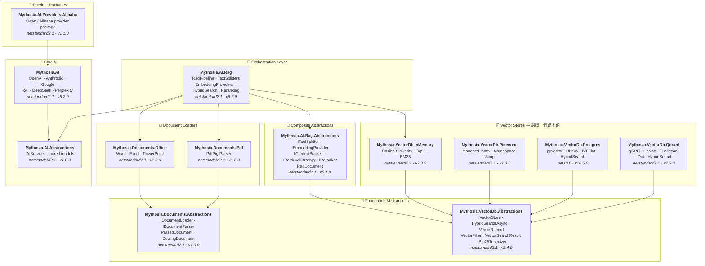

<div align="center">

🌐 [English](../../README.md) · [한국어](../ko/README.md) · [日本語](../ja/README.md) · [Français](../fr/README.md) · [Deutsch](../de/README.md) · [Русский](../ru/README.md) · [Українська](../uk/README.md) · [简体中文](../zh-Hans/README.md) · [繁體中文](README.md) · [Tiếng Việt](../vi/README.md) · [ภาษาไทย](../th/README.md) · [Português](../pt/README.md) · [Español](../es/README.md)

<br>

[](https://github.com/AJ-comp/Mythosia.AI)


### 用於建構智慧應用的模組化 .NET AI 函式庫

**切換供應商、加入 RAG、載入文件 — 一套統一的 API 全部搞定。**

<br>

[](https://www.nuget.org/packages/Mythosia.AI)
[](https://www.nuget.org/packages/Mythosia.AI)
[](https://aj-comp.github.io/Mythosia.AI/)
[](https://dotnet.microsoft.com)

<br>

**[📖 快速入門](https://aj-comp.github.io/Mythosia.AI/)** &nbsp;·&nbsp; **[API 參考](https://aj-comp.github.io/Mythosia.AI/api/)** &nbsp;·&nbsp; **[GitHub ↗](https://github.com/AJ-comp/Mythosia.AI)**

<br>

</div>

---

### 需要安裝哪些套件？

```
dotnet add package Mythosia.AI                    # 從這裡開始（這就夠了）
dotnet add package Mythosia.AI.Rag                # 可選：需要 RAG 時安裝
dotnet add package Mythosia.VectorDb.Postgres     # 可選：需要正式環境向量儲存時安裝
```

| 步驟 | 套件 | 適用情境 |
| :--: | --- | --- |
| **1** | **`Mythosia.AI`** | **從這裡開始** — 補全、串流、函式呼叫、結構化輸出 (OpenAI / Claude / Gemini / Grok / DeepSeek / Perplexity) |
| **2** | **`Mythosia.AI.Rag`** | 需要 RAG 時 — 文字切割、嵌入、混合搜尋、重排序、InMemory 向量儲存、文件載入器 (Word / Excel / PowerPoint / PDF) |
| **3** | **`Mythosia.VectorDb.Postgres`** / **`Qdrant`** / **`Pinecone`** | 需要正式環境向量儲存取代 InMemory 時 — 擇一使用 |

## 架構



## 展示 / 測試平台 (Chat UI)

本儲存庫包含一個以 Mythosia.AI 建構的範例 Chat UI — 啟動 Mythosia.AI.Samples.ChatUi 即可實際體驗函式庫的運作。

### 執行範例

在本機執行 **`Mythosia.AI.Samples.ChatUi`**：

```bash
# 在儲存庫根目錄下
dotnet run --project samples/Mythosia.AI.Samples.ChatUi
```

https://github.com/user-attachments/assets/62094afe-9add-4c14-b818-6b31f200dc01


## 快速開始

### 基礎 AI 補全

```csharp
using Mythosia.AI;

var service = new OpenAIService(apiKey, httpClient);
var response = await service.GetCompletionAsync("Hello!");
```

### 串流輸出

```csharp
await foreach (var token in service.StreamAsync("Tell me a story"))
{
    Console.Write(token);
}
```

### 推理串流輸出

所有支援推理的供應商（OpenAI、Claude、Gemini、Grok、DeepSeek）都採用相同的串流模式：

```csharp
await foreach (var content in service.StreamAsync(message, new StreamOptions().WithReasoning()))
{
    if (content.Type == StreamingContentType.Reasoning)
        Console.Write($"[Think] {content.Content}");
    else if (content.Type == StreamingContentType.Text)
        Console.Write(content.Content);
}
```

### 函式呼叫

```csharp
var service = new OpenAIService(apiKey, httpClient)
    .WithFunction(
        "get_weather",
        "Gets the current weather for a location",
        ("location", "The city and country", required: true),
        (string location) => $"The weather in {location} is sunny, 22C"
    );

var response = await service.GetCompletionAsync("What's the weather in Seoul?");
```

### 結構化輸出（基礎）

```csharp
// 將 LLM 回應直接反序列化為 C# POCO，支援自動修復
var result = await service.GetCompletionAsync<WeatherResponse>(
    "What's the weather in Seoul?");
```

### 結構化輸出（列表）

```csharp
// 集合型別直接可用 — 不需要包裝 DTO
var items = await service.GetCompletionAsync<List<ItemDto>>(
    "Extract all entities from this document...");
```

### 結構化輸出（串流）

```csharp
// 即時串流接收文字片段 + 取得最終反序列化物件
var run = service.BeginStream(prompt).As<MyDto>();

await foreach (var chunk in run.Stream())
    Console.Write(chunk);          // 即時 UI

MyDto dto = await run.Result;      // 已解析並自動修復
```

### 對話摘要策略

```csharp
// 當對話變長時自動摘要舊訊息
service.ConversationPolicy = SummaryConversationPolicy.ByMessage(
    triggerCount: 20,
    keepRecentCount: 5
);

// 基於 Token 的觸發
service.ConversationPolicy = SummaryConversationPolicy.ByToken(
    triggerTokens: 3000,
    keepRecentTokens: 1000
);

// 正常使用即可 — 摘要會自動進行
await service.GetCompletionAsync("Continue our conversation...");

// 串流輸出時，在 StreamAsync() 前顯式套用摘要策略
await service.ApplySummaryPolicyIfNeededAsync();
await foreach (var chunk in service.StreamAsync("Continue..."))
    Console.Write(chunk.Content);

// 跨工作階段儲存/還原摘要
string saved = service.ConversationPolicy.CurrentSummary;
policy.LoadSummary(saved);
```

### RAG（檢索增強生成）

```bash
dotnet add package Mythosia.AI.Rag
```

```csharp
using Mythosia.AI.Rag;

var service = new AnthropicService(apiKey, httpClient)
    .WithRag(rag => rag
        .AddDocument("manual.txt")
        .AddDocument("policy.txt")
    );

var response = await service.GetCompletionAsync("What is the refund policy?");
```

## 支援的供應商

| 供應商 | 套件 | 模型 |
| --- | --- | --- |
| **OpenAI** | `Mythosia.AI` | GPT-5.5 / 5.5 Pro / 5.4 / 5.4 Mini / 5.4 Nano / 5.4 Pro / 5.3 Codex / 5.2 / 5.2 Pro / 5.2 Codex / 5.1 / 5 / 5 Pro / 5 Mini / 5 Nano, GPT-4.1 / 4.1 Mini / 4.1 Nano, GPT-4o / 4o Mini, o3 / o3 Pro |
| **Anthropic** | `Mythosia.AI` | Claude Opus 4.8 / 4.7 / 4.6 / 4.5 / 4.1 / 4, Sonnet 4.6 / 4.5, Haiku 4.5 |
| **Google** | `Mythosia.AI` | Gemini 3.1 Pro Preview, Gemini 3.5 Flash, Gemini 3 Flash Preview, Gemini 3.1 Flash-Lite, Gemini 2.5 Pro/Flash/Flash-Lite |
| **xAI** | `Mythosia.AI` | Grok 4.3, Grok 4.20 (reasoning / non-reasoning), Grok Build 0.1, Grok 3 Mini |
| **DeepSeek** | `Mythosia.AI` | Chat, Reasoner |
| **Perplexity** | `Mythosia.AI` | Sonar, Sonar Pro, Sonar Reasoning Pro |
| **Alibaba / Qwen** | `Mythosia.AI.Providers.Alibaba` | Qwen Max / Plus / Turbo / Qwen3 / Qwen3.5 系列 |

## 套件列表

### 核心

| 套件 | NuGet | 描述 |
| --- | --- | --- |
| [Mythosia.AI](../../src/core/Mythosia.AI/) | [](https://www.nuget.org/packages/Mythosia.AI) | 核心函式庫 — 內建供應商、串流、函式呼叫及多模態支援 |
| [Mythosia.AI.Abstractions](../../src/core/Mythosia.AI.Abstractions/) | [](https://www.nuget.org/packages/Mythosia.AI.Abstractions) | `IAIService` 介面和共用模型 — 面向函式庫的輕量契約套件 |
| [Mythosia.AI.Providers.Alibaba](../../src/core/Mythosia.AI.Providers.Alibaba/) | [](https://www.nuget.org/packages/Mythosia.AI.Providers.Alibaba) | 基於 `Mythosia.AI` 的 Alibaba / Qwen 供應商套件 |

### RAG

| 套件 | NuGet | 描述 |
| --- | --- | --- |
| [Mythosia.AI.Rag](../../src/rag/Mythosia.AI.Rag/) | [](https://www.nuget.org/packages/Mythosia.AI.Rag) | 透過 `.WithRag()` API 為 IAIService 提供 Fluent RAG 擴充 |
| [Mythosia.AI.Rag.Abstractions](../../src/rag/Mythosia.AI.Rag.Abstractions/) | [](https://www.nuget.org/packages/Mythosia.AI.Rag.Abstractions) | RAG 管線元件的介面和模型 |

### 文件載入器

| 套件 | NuGet | 描述 |
| --- | --- | --- |
| [Mythosia.Documents.Abstractions](../../src/loaders/Mythosia.Documents.Abstractions/) | [](https://www.nuget.org/packages/Mythosia.Documents.Abstractions) | 文件載入器介面和模型 (`IDocumentLoader`, `DoclingDocument`) |
| [Mythosia.Documents.Office](../../src/loaders/Mythosia.Documents.Office/) | [](https://www.nuget.org/packages/Mythosia.Documents.Office) | Word / Excel / PowerPoint 的 OpenXml 剖析器 |
| [Mythosia.Documents.Pdf](../../src/loaders/Mythosia.Documents.Pdf/) | [](https://www.nuget.org/packages/Mythosia.Documents.Pdf) | 基於 PdfPig 的 PDF 剖析器 |

### 向量儲存

> **選擇一個或多個** — 皆實作 Abstractions 套件中的 `IVectorStore`。

| 套件 | NuGet | 描述 |
| --- | --- | --- |
| [Mythosia.VectorDb.Abstractions](../../src/vectordb/Mythosia.VectorDb.Abstractions/) | [](https://www.nuget.org/packages/Mythosia.VectorDb.Abstractions) | `IVectorStore` · `VectorRecord` · `VectorFilter` 契約 |
| [Mythosia.VectorDb.InMemory](../../src/vectordb/Mythosia.VectorDb.InMemory/) | [](https://www.nuget.org/packages/Mythosia.VectorDb.InMemory) | 記憶體內儲存 — 零基礎設施，非常適合原型開發 |
| [Mythosia.VectorDb.Pinecone](../../src/vectordb/Mythosia.VectorDb.Pinecone/) | [](https://www.nuget.org/packages/Mythosia.VectorDb.Pinecone) | Pinecone HTTP API — 託管向量資料庫的索引/命名空間/作用域隔離 |
| [Mythosia.VectorDb.Postgres](../../src/vectordb/Mythosia.VectorDb.Postgres/) | [](https://www.nuget.org/packages/Mythosia.VectorDb.Postgres) | PostgreSQL + pgvector — HNSW / IVFFlat 索引，可用於正式環境 |
| [Mythosia.VectorDb.Qdrant](../../src/vectordb/Mythosia.VectorDb.Qdrant/) | [](https://www.nuget.org/packages/Mythosia.VectorDb.Qdrant) | Qdrant gRPC 用戶端 — Cosine / Euclidean / Dot，自動佈建 |

## 儲存庫結構

```text
src/
  core/
    Mythosia.AI/                        # 核心 AI 服務函式庫
    Mythosia.AI.Abstractions/           # IAIService 介面和共用模型
    Mythosia.AI.Providers.Alibaba/      # Alibaba / Qwen 供應商套件
  loaders/
    Mythosia.Documents.Abstractions/    # 文件載入器契約 (IDocumentLoader, DoclingDocument)
    Mythosia.Documents.Office/          # Office 文件載入器 (Word/Excel/PowerPoint)
    Mythosia.Documents.Pdf/             # PDF 文件載入器
  rag/
    Mythosia.AI.Rag/                    # RAG Fluent API 和管線
    Mythosia.AI.Rag.Abstractions/       # RAG 介面和模型 (RagDocument)
  vectordb/
    Mythosia.VectorDb.Abstractions/     # 向量儲存契約
    Mythosia.VectorDb.InMemory/         # 記憶體內向量儲存
    Mythosia.VectorDb.Pinecone/         # Pinecone 向量儲存
    Mythosia.VectorDb.Postgres/         # PostgreSQL + pgvector 儲存
    Mythosia.VectorDb.Qdrant/           # Qdrant 向量儲存
samples/                                # 範例應用程式
tests/                                  # 單元/整合測試專案
```

## 安裝

```bash
dotnet add package Mythosia.AI
```

如需對串流進行進階 LINQ 操作：

```bash
dotnet add package System.Linq.Async
```

## 文件

- [基礎使用指南](https://github.com/AJ-comp/Mythosia.AI/wiki)
- [Mythosia.AI README](../../src/core/Mythosia.AI/README.md)  包含函式呼叫、串流和模型設定的完整 API 參考
- [Mythosia.AI.Rag README](../../src/rag/Mythosia.AI.Rag/README.md)  RAG 管線使用方式和自訂實作
- [載入器指南](document-loaders.md)
- [版本說明](../../src/core/Mythosia.AI/RELEASE_NOTES.md)

## 授權

本專案採用 [MIT 授權](../../LICENSE) 發布。

## 前身

本專案原為 [Mythosia](https://github.com/AJ-comp/Mythosia) 的一部分。
