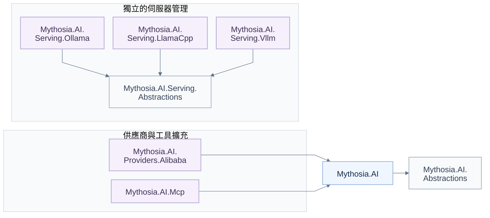
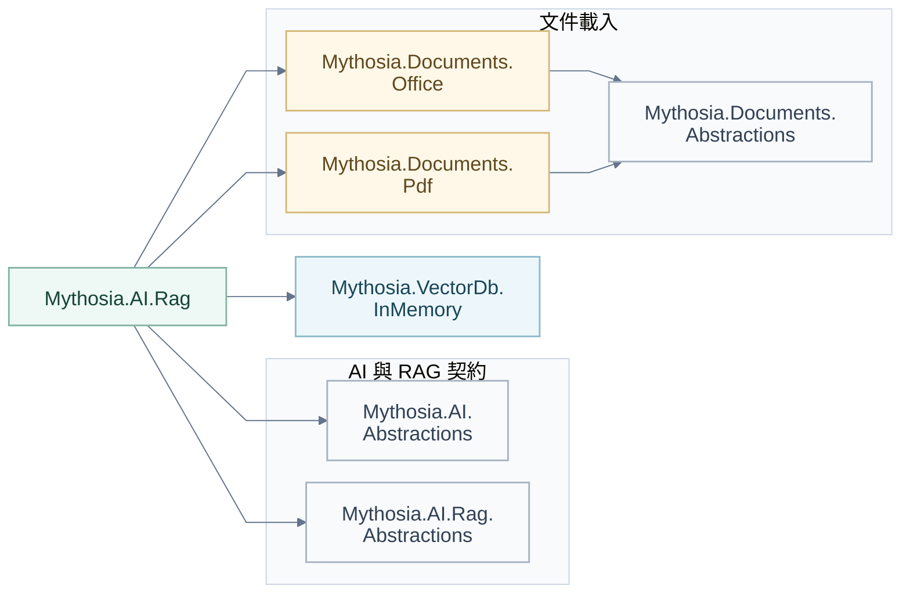
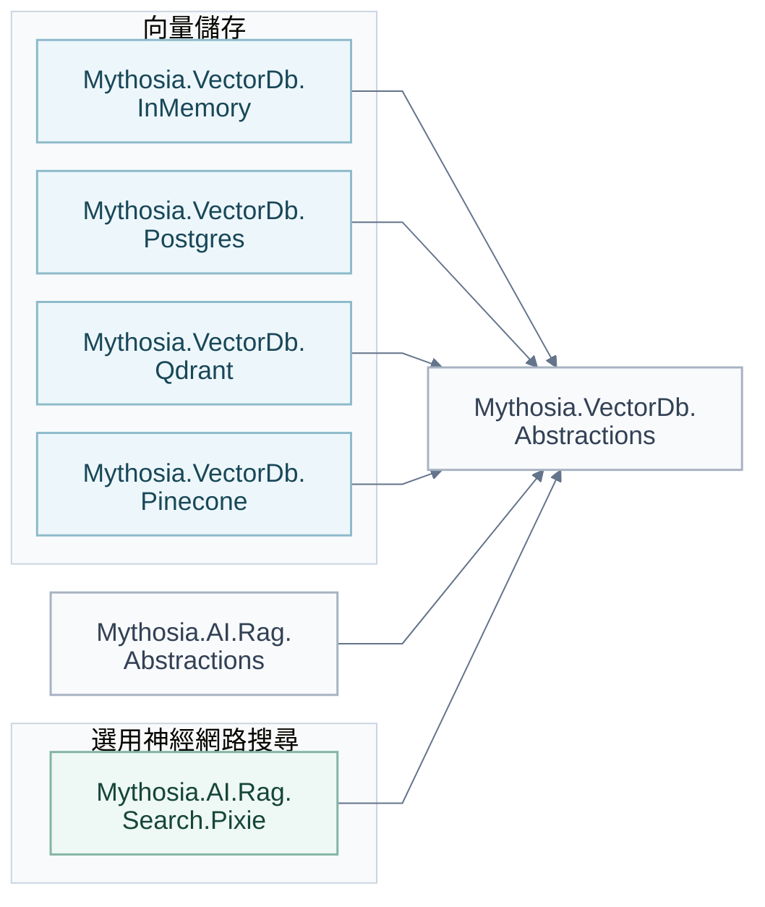

<div align="center">

🌐 [English](../../README.md) · [한국어](../ko/README.md) · [日本語](../ja/README.md) · [Français](../fr/README.md) · [Deutsch](../de/README.md) · [Русский](../ru/README.md) · [Українська](../uk/README.md) · [简体中文](../zh-Hans/README.md) · [繁體中文](README.md) · [Tiếng Việt](../vi/README.md) · [ภาษาไทย](../th/README.md) · [Português](../pt/README.md) · [Español](../es/README.md)

<br>

[](https://github.com/AJ-comp/Mythosia.AI)


### 用於建構智慧應用的模組化 .NET AI 函式庫

**切換供應商、加入 RAG、載入文件 — 一套統一的 API 全部搞定。**

<br>

[](https://www.nuget.org/packages/Mythosia.AI)
[](https://www.nuget.org/packages/Mythosia.AI)
[](https://aj-comp.github.io/Mythosia.AI/)
[](https://dotnet.microsoft.com)

<br>

**[📖 快速入門](https://aj-comp.github.io/Mythosia.AI/)** &nbsp;·&nbsp; **[API 參考](https://aj-comp.github.io/Mythosia.AI/api/)** &nbsp;·&nbsp; **[GitHub ↗](https://github.com/AJ-comp/Mythosia.AI)**

<br>

</div>

## 展示 / 測試平台 (Chat UI)

撰寫整合程式碼前，先在 Playground 中試用模型和文件搜尋。

觀看目前 Playground 實際介面的螢幕錄影，了解如何瀏覽模型、切換語言，以及查看文件與 RAG 管線設定。影片包含英文字幕。

https://github.com/user-attachments/assets/4cf90210-b000-41be-8317-a467e93e7504

### 執行範例

在本機執行 **`Mythosia.AI.Samples.ChatUi`**：

```bash
# 在儲存庫根目錄下
dotnet run --project apps/Mythosia.AI.Samples.ChatUi
```

<details>
<summary>Playground 操作與語言</summary>

在整合至應用程式前，可在左側依模型名稱或供應商搜尋並調整請求設定，在中央對話，並在右側 Inspector 中查看處理資訊。Stop 可停止等待目前的回應；速度選項僅對支援的模型與服務端點啟用，Fast 可能產生額外費用。在較窄的螢幕上，Models 與 Inspector 會以抽屜面板開啟；本機執行、文件匯入與檢索流程設定請參閱 [Chat UI 指南](https://github.com/AJ-comp/Mythosia.AI/blob/main/apps/Mythosia.AI.Samples.ChatUi/README.md)。

管線面板支援 Voyage Context 4、Gemini Embedding 2 和 Perplexity 情境嵌入的金鑰、維度及逾時設定。文件頁面可查看區塊和向量數量並取消索引。儲存設定、資料庫重新連線和程式碼範例均使用所選組態；更換嵌入模型或維度後須重新索引。

使用頂部的語言選擇器可在13種介面語言之間切換，並保留輸入內容與設定。模型清單預設顯示全部7個供應商的摺疊群組，可展開群組或搜尋模型。

</details>

## 為什麼選擇 Mythosia.AI？

- **透過統一 API 切換 AI 供應商**，使用聊天、串流、工具呼叫和結構化回應。
- 結合載入器、嵌入、檢索和重排序，**根據自己的文件建構答案**。
- **獨立保留請求設定**，透過共用 Run API 控制進行中的工作。
- 從核心函式庫到選用的 RAG 和向量儲存整合，**只選擇需要的套件**。

## 需要安裝哪些套件？

```
dotnet add package Mythosia.AI                    # 從這裡開始（這就夠了）
dotnet add package Mythosia.AI.Rag                # 可選：需要 RAG 時安裝
dotnet add package Mythosia.VectorDb.Postgres     # 可選：需要正式環境向量儲存時安裝
```

| 步驟 | 套件 | 適用情境 |
| :--: | --- | --- |
| **1** | **`Mythosia.AI`** | **從這裡開始** — 補全、串流、函式呼叫、結構化輸出 (OpenAI / Claude / Gemini / Grok / DeepSeek / Perplexity) |
| **2** | **`Mythosia.AI.Rag`** | 需要 RAG 時 — 文字切割、嵌入、混合搜尋、重排序、InMemory 向量儲存、文件載入器 (Word / Excel / PowerPoint / PDF) |
| **3** | **`Mythosia.VectorDb.Postgres`** / **`Qdrant`** / **`Pinecone`** | 需要正式環境向量儲存取代 InMemory 時 — 擇一使用 |

準備不同設定時無須改變其他請求：`CreateRequest(...).WithTemperature(...).GetCompletionAsync()` 使用獨立且可重複使用的請求建構器。[請求設定指南](request-building.md)提供前後對照範例、Run、設定檔和共用對話限制。

完成、串流、結構化輸出和 Run 先執行一次實際設定檔處理並驗證最終設定，再進行自動摘要、歷史修改和傳輸。輔助請求隔離父對話及輸出結構描述，同時保留供應者原生驗證。請參閱[請求設定指南](request-building.md)。

應用程式發起的呼叫以及上下文或工具回呼中的一般呼叫保持獨立，即使重複使用設定檔或訊息也是如此。框架呼叫虛擬提供者配接器時，對相應基底類別入口的第一次呼叫會延續已準備的請求，即使替換了輸入也不例外。在轉送前透過同一個基底類別入口執行無關的輔助呼叫時，須使用 `BeginIndependentRequestScope()`；請參閱[提供者配接器規則](request-building.md#provider-request-adapters)。內建輸入副本可防止後續呼叫改寫已接受的歷史。

介接器修改的設定在自動摘要前驗證，回呼串流會等待內部清理。Claude 壓縮保護替換輸入中保留的工具相依關係和 Mythos 5.1 綁定的 thinking；OpenAI 無狀態輔助請求保留父歷程的保護狀態。

對等待時間敏感的請求可選擇[處理速度](request-building.md#inference-speed)。`WithSpeed` 保持模型和推理層級，`Processing` 顯示供應商實際套用的模式。Fast 是受支援組合上的付費選項。

## 快速開始

### 基礎 AI 補全

```csharp
using Mythosia.AI.Services.OpenAI;

var service = new OpenAIService(apiKey, httpClient);
var response = await service.GetCompletionAsync("Hello!");
```

### 串流輸出

```csharp
await using var run = await service.StartRunAsync(
    "Tell me a story",
    onText: text => Console.Write(text));
string answer = (await run.Result).Text;
```

### 推理串流輸出

OpenAI、Claude、Gemini、Grok 和 DeepSeek Flash 透過相同串流模式回傳供應商推理。先在服務或請求中開啟推理，再用 `StreamOptions.WithReasoning()` 觀察：

```csharp
await using var run = await service.StartRunAsync(
    message, options: new StreamOptions().WithReasoning());
await foreach (var content in run.StreamAsync())
{
    if (content.Type == StreamingContentType.Reasoning)
        Console.Write($"[Think] {content.Content}");
    else if (content.Type == StreamingContentType.Text)
        Console.Write(content.Content);
}
```

### 函式呼叫

```csharp
using Mythosia.AI.Extensions;
using Mythosia.AI.Services.OpenAI;

var service = new OpenAIService(apiKey, httpClient)
    .WithFunction(
        "get_weather",
        "Gets the current weather for a location",
        ("location", "The city and country", required: true),
        (string location) => $"The weather in {location} is sunny, 22C"
    );

var response = await service.GetCompletionAsync("What's the weather in Seoul?");
```

一次模型回應傳回的呼叫預設依序執行。如果註冊的函式彼此獨立，可以選擇限制並行數量的平行處理常式執行：

```csharp
using Mythosia.AI.Models.Functions;

service.DefaultPolicy = new FunctionCallingPolicy
{
    ExecutionMode = FunctionExecutionMode.Parallel,
    MaxConcurrency = 3
};
```

一般批次的結果會按供應商原始呼叫順序傳回模型。取消操作會略過尚未開始的呼叫，並提供對應的取消結果。已開始的工具在支援時接收取消權杖，並等待完成，以維持呼叫與結果歷程一一對應。`FunctionCallingPolicy.TimeoutSeconds` 涵蓋整個串流回合迴圈，包括回應標頭和 SSE 本文，不會在工具回合之間重設。原則逾時會擲出 `AIServiceException`；呼叫端取消仍表現為與其權杖關聯的 `OperationCanceledException`。 緩衝本文的自訂 `HttpContent` 在取得 SSE 本文串流時存在已知例外；請參閱[取消限制](streaming.md#sse-acquisition-cancellation-limitation)。

慢速查詢進行期間，模型仍可完成有用的獨立工作，例如在天氣預報傳回前介紹一般旅行用品。設定 `FunctionDefinition.AllowAsync = true` 或使用 `FunctionBuilder.WithAsync()`，可讓支援的模型在函式執行時繼續工作。預設值為 `false`。GPT-6.1 Sol / GPT-6 Astra / Sol / Luna 透過 Responses API 使用此選項；不支援的模型不會傳送未支援的 API 選項，而是等待同一個處理常式的結果。此功能與 C# `async` 處理常式和平行處理常式排程彼此獨立。範例及請求生命週期行為請見[非同步工具呼叫](function-calling.md#async-tool-calling)。

### 影像生成與編輯

透過 OpenAI、Google 和 xAI 共用的選用功能，可以根據文字建立影像草稿或修改既有影像。影像模型獨立於所選聊天模型：

```csharp
using Mythosia.AI.Models.Images;
using Mythosia.AI.Services;
using Mythosia.AI.Services.OpenAI;

IImageGenerationService images = new OpenAIService(apiKey, httpClient);
var generated = await images.GenerateImagesAsync(new ImageGenerationRequest
{
    Prompt = "A glass pavilion at sunrise",
    Size = ImageSize.Pixels(1024, 1024),
    OutputFormat = ImageOutputFormat.Png
});

await File.WriteAllBytesAsync("pavilion.png", generated.Images[0].Data);
```

生成和編輯方法請見[供應商指南](providers.md#image-generation)，重大 API 變更請見[具型別的影像選項與遷移](providers.md#image-options-migration)。xAI 使用 `ImageOutputFormat.Auto`；請根據 `GeneratedImage.MediaType` 選擇輸出副檔名。

Google 影像預設選項因模型而異：Flash 支援 512/1K/2K/4K，Flash-Lite 目前支援 1K，Pro 支援 1K/2K/4K。Flash/Lite 提供 14 種長寬比，Pro 提供 10 種標準長寬比，全部接受 `Auto`。顯示選項前請檢查 `GetImageCapabilities(model)`；生成和編輯時，明確指定不支援的尺寸或長寬比都會在 HTTP 請求前失敗。參閱[模型支援表與 Flash-Lite 文件差異](providers.md#google-image-options)。

### 結構化輸出（基礎）

```csharp
// 將 LLM 回應直接反序列化為 C# POCO，支援自動修復
var result = await service.GetCompletionAsync<WeatherResponse>(
    "What's the weather in Seoul?");
```

### 結構化輸出（列表）

```csharp
// 集合型別直接可用 — 不需要包裝 DTO
var items = await service.GetCompletionAsync<List<ItemDto>>(
    "Extract all entities from this document...");
```

### 結構化輸出（串流）

```csharp
// 即時串流接收文字片段 + 取得最終反序列化物件
var run = service.BeginStream(prompt).As<MyDto>();

await foreach (var chunk in run.Stream())
    Console.Write(chunk);          // 即時 UI

MyDto dto = await run.Result;      // 已解析並自動修復
```

### 對話摘要策略

```csharp
// 當對話變長時自動摘要舊訊息
service.ConversationPolicy = SummaryConversationPolicy.ByMessage(
    triggerCount: 20,
    keepRecentCount: 5
);

// 基於 Token 的觸發
service.ConversationPolicy = SummaryConversationPolicy.ByToken(
    triggerTokens: 3000,
    keepRecentTokens: 1000
);

// 正常使用即可 — 摘要會自動進行
await service.GetCompletionAsync("Continue our conversation...");

// 串流輸出時，在 StreamAsync() 前顯式套用摘要策略
await service.ApplySummaryPolicyIfNeededAsync();
await foreach (var chunk in service.StreamAsync("Continue..."))
    Console.Write(chunk.Content);

// 跨工作階段儲存/還原摘要
string saved = service.ConversationPolicy.CurrentSummary;
policy.LoadSummary(saved);
```

### RAG（檢索增強生成）

選擇關鍵字、語意或混合檢索，無須強制每次搜尋產生問題嵌入。`UseKeywordSearch()` 略過問題嵌入；`UseRetriever(...)` 連接外部索引；`UseHybridSearch(HybridSearchOptions)` 傳遞明確的權重和候選設定。文件擷取仍會建立向量。參閱[檢索模式與儲存區支援](rag-hybrid-search.md)。

```bash
dotnet add package Mythosia.AI.Rag
```

```csharp
using Mythosia.AI.Rag;
using Mythosia.AI.Services.Anthropic;

var service = new AnthropicService(apiKey, httpClient)
    .WithRag(rag => rag
        .AddDocument("manual.txt")
        .AddDocument("policy.txt")
    );

var response = await service.GetCompletionAsync("What is the refund policy?");
```

若要讓代理程式控制檢索，請透過 `WithAgenticRag(...)` 註冊儲存區，並透過 `service.WithMaxRounds(10).StartRunAsync(...)` 啟動工作。可等待同一工作的 `run.Result`，或觀察 `run.StreamAsync()`。完整範例請見 [Mythosia.AI.Rag README](../../src/rag/Mythosia.AI.Rag/README.md)。

#### 保留文件上下文和查詢用途

區塊的含義可能依賴相鄰段落，搜尋問題與索引文件的用途也不同。RAG 8.2.0 為從 TXT、Markdown 和 PDF 擷取的文字提供 Voyage 上下文嵌入和 Gemini Embedding 2。

```csharp
using Mythosia.AI.Rag;

var store = await RagStore.BuildAsync(rag => rag
    .UseVoyageEmbedding(voyageApiKey, httpClient)
    .AddDocument("policy.pdf"));
var result = await store.QueryAsync("What is the refund period?");
```

[設定和提供者契約](rag-embedding.md#retrieval-aware-embeddings): `UseVoyageEmbedding(...)`, `UseGeminiEmbedding(...)`, `IRetrievalEmbeddingProvider` / `EmbeddingDocument` (RAG 8.2.0, RAG Abstractions 6.4.0).

## 支援的供應商

> Grok 4.7: 需要 Mythosia.AI 8.1.0 / Abstractions 4.1.0。 [模型選擇、推理與處理速度](providers.md#grok-47)

> GPT-6.1 Sol: 需要 Mythosia.AI 8.2.0 / Abstractions 4.2.0。[模型選擇與遷移](providers.md#gpt-61-sol)

> GPT-6 Sol/Luna: 需要 Mythosia.AI 8.1.0 / Abstractions 4.1.0。 [模型選擇與版本需求](providers.md#gpt-6-sol-luna)

> Claude Sonnet 5.5: 需要 Mythosia.AI 8.2.0 / Abstractions 4.2.0。[設定與移轉](providers.md#claude-sonnet-55)

> Claude Opus 5.5: 需要 Mythosia.AI 8.1.0 / Abstractions 4.1.0。 [設定與移轉](providers.md#claude-opus-55)

| 供應商 | 套件 | 模型 |
| --- | --- | --- |
| **OpenAI** | `Mythosia.AI` | GPT-6.1 Sol / GPT-6 Astra / Sol / Luna, GPT-5.6 Sol / Terra / Luna, GPT-5.5 / 5.5 Pro / 5.4 / 5.4 Mini / 5.4 Nano / 5.4 Pro / 5.3 Codex / 5.2 / 5.2 Pro / 5.1, GPT-4.1 / 4.1 Mini, GPT-4o / 4o Mini |
| **Anthropic** | `Mythosia.AI` | Claude Fable 5.1 / 5, Mythos 5.1 / 5 (有限開放), [Opus 5.5](providers.md#claude-opus-55) / 5 / 4.8 / 4.7 / 4.6 / 4.5, [Sonnet 5.5](providers.md#claude-sonnet-55) / 5 / 4.6 / 4.5, Haiku 4.5 |
| **Google** | `Mythosia.AI` | Gemini 3.8 Flash, Gemini 3.7 Flash, Gemini 3.6 Flash, Gemini 3.5 Flash/Flash-Lite, Gemini 3.1 Pro Preview/Flash-Lite, Gemini 3 Flash Preview, Gemini 2.5 Pro/Flash/Flash-Lite, Gemini 3.1 Flash Image, Gemini 3.1 Flash-Lite Image, Gemini 3 Pro Image |
| **xAI** | `Mythosia.AI` | Grok 4.7, Grok 4.6, Grok 4.5 (預設), Grok 4.3, Grok 4.20 (推理 / 非推理), Grok Build |
| **DeepSeek** | `Mythosia.AI` | Flash (V4.1 Flash), V4 Pro |
| **Perplexity** | `Mythosia.AI` | Agent API 預設與 `perplexity/sonar` |
| **Alibaba / Qwen** | `Mythosia.AI.Providers.Alibaba` | Qwen Max / Plus / Turbo / Qwen3 / Qwen3.5 系列 |

當回答需要根據最新資訊，並讓讀者能夠核對來源時，可以使用 Perplexity。`PerplexityService` 呼叫 Agent API；獨立搜尋與嵌入則用於替自行選擇的回答模型建立檢索能力。 [Perplexity Agent API、搜尋與嵌入](perplexity.md).

審查長文件或執行多輪工具任務時，可以透過現有 Google 適配器選擇 Gemini 3.7 Flash 或 3.8 Flash。支援從 `Mythosia.AI` 8.0.0 / `Mythosia.AI.Abstractions` 4.0.0 開始，服務預設模型仍為 Gemini 3.6 Flash。

需要快速起草再深入審查時，可明確選擇 Grok 4.6，並設定 `Low` 至 `XHigh` 的推理強度。支援從 `Mythosia.AI` 8.0.0 / `Mythosia.AI.Abstractions` 4.0.0 開始，`XAIService` 預設模型仍為 Grok 4.5。參閱 [Grok 設定](providers.md#xai-xaiservice)。

建立圖片草稿或組合參考圖時，透過`IImageGenerationService`使用[Grok Imagine Image 2.0](providers.md#grok-imagine-image-20)。保留`OutputFormat = ImageOutputFormat.Auto`，並依`MediaType`選擇副檔名；xAI不能選擇輸出編碼。參見[圖片選項型別遷移](providers.md#image-options-migration)。聊天模型維持不變。

快速製作視覺草稿可選 Flare，精細修改可選 Sunburst。[GPT Image 2.5 生成與編輯](providers.md#gpt-image-25)透過現有影像 API 為每個請求指定模型；OpenAI 預設仍為 GPT Image 2。

圖表和截圖分析、本地函式呼叫、快速回答後的深入審查可使用 [DeepSeek Flash](providers.md#deepseek-deepseekservice) (`AIModels.DeepSeek.Flash`, V4.1 Flash)。推理預設關閉，透過 `WithDeepSeekReasoning(...)` 或請求級 `WithReasoning(...)` 開啟。

純文字任務可選擇 `AIModels.DeepSeek.V4Pro` (`deepseek-v4-pro`, V4-Pro-0813)。預設模型 Flash 支援影像，兩者均提供 Low/High/Max 推理和相同輸出上限。若要透過既有補全、串流、Run 和本機函式 API 使用 Responses，請在建立請求前設定 `UseResponsesApi = true`。預設仍為 `false`，以保留既有應用程式的 Chat Completions 行為；設定會固定到該請求及後續工具輪次。Responses 重送完整對話和原始推理歷史，不依賴伺服器儲存的回應 ID。

使用 `DeepSeekImageFileContent`，可在 Flash 的 Chat Completions 或 Responses 中於多次提問重複使用已上傳影像；僅支援文字的 V4 Pro 會拒絕影像。 請參閱[影像上傳、重複使用與限制](providers.md#deepseek-deepseekservice)。 需要 Mythosia.AI 8.1.0 / Abstractions 4.1.0。

> Claude Fable 5 和 Claude Mythos 5 要求保留資料 30 天，不適用於零資料保留安排。它們的適應性推理始終開啟；呼叫端要求關閉推理時，Mythosia 使用低推理強度並省略推理摘要。Mythos 5 僅限獲准的 Project Glasswing 客戶使用。

## 指南與遷移

TXT 與 Markdown 應依文件結構選擇[規則式分割器](text-splitters.md)。實作會檢查大小、重疊與 Unicode 邊界，並保留 Markdown 標題、程式碼區塊及表格列。字元或單字數量不等於模型 token 上限。 表格條件與程式碼縮排的含義會保留；Markdown 上下文重複過量時會明確擲出例外並停止。

為避免索引看似成功卻覆寫區塊或關聯錯誤向量，[索引驗證](rag-pipeline.md#indexing-validation)會在持久化前拒絕無效 ID 和嵌入批次。自訂分割器必須提供唯一 ID 並繼承文件中繼資料。

穩定的[檔案識別](document-loaders.md#file-source-identity)、[問題向量驗證](rag-embedding.md#query-embedding-validation)及[文件單位持久化與 URL 取消](rag-pipeline.md#custom-persistence)可防止重複註冊、無效搜尋與舊區塊殘留。

選用的 `Mythosia.AI.Rag.Search.Pixie` 預覽版可比較本機神經網路稀疏搜尋與既有搜尋。它保留既有稠密嵌入服務，將 PIXIE 索引放在記憶體中，不遷移持久化儲存區，也不自動取代預設搜尋。 [PIXIE 設定與比較指南（英文）](../rag-pixie-search.md).

[檢索評估基礎設施](https://github.com/AJ-comp/Mythosia.AI/blob/main/tests/Mythosia.AI.Rag.Evaluation/README.md)支援可重複使用的資料集、搜尋配接器、執行報告持久化和回歸檢查。可擴充同一個評估器，用於新的搜尋方法和自己的文件集合。

獨立管理請求設定，停止進行中的工作，並同時取得答案、用量與來源。[v8 升級指南](v8-migration.md)整理了六項架構變更、遷移範例與驗證範圍。

> 本文件對應的套件版本: [Mythosia.AI 8.2.0](../../src/core/Mythosia.AI/RELEASE_NOTES.md#v820), [Abstractions 4.2.0](../../src/core/Mythosia.AI.Abstractions/RELEASE_NOTES.md#v420), [Alibaba 3.0.2](../../src/core/Mythosia.AI.Providers.Alibaba/RELEASE_NOTES.md#v302), [RAG 8.3.0](../../src/rag/Mythosia.AI.Rag/RELEASE_NOTES.md#v830), [RAG Abstractions 6.5.0](../../src/rag/Mythosia.AI.Rag.Abstractions/RELEASE_NOTES.md#v650), [VectorDb Abstractions 4.2.0](../../src/vectordb/Mythosia.VectorDb.Abstractions/RELEASE_NOTES.md#v420), [InMemory 4.3.0](../../src/vectordb/Mythosia.VectorDb.InMemory/RELEASE_NOTES.md#v430), [PostgreSQL 10.8.1](../../src/vectordb/Mythosia.VectorDb.Postgres/RELEASE_NOTES.md#v1081), [MCP 0.1.1-preview](../../src/integrations/Mythosia.AI.Mcp/RELEASE_NOTES.md#v011-preview), [Serving.Abstractions 1.0.0](../../src/serving/Mythosia.AI.Serving.Abstractions/RELEASE_NOTES.md#v100), [Serving.Ollama 1.0.0](../../src/serving/Mythosia.AI.Serving.Ollama/RELEASE_NOTES.md#v100), [Serving.LlamaCpp 1.0.0](../../src/serving/Mythosia.AI.Serving.LlamaCpp/RELEASE_NOTES.md#v100), [Serving.Vllm 1.1.0](../../src/serving/Mythosia.AI.Serving.Vllm/RELEASE_NOTES.md#v110). 其餘檢索、文件和向量套件的版本請見[先前修補版本表](https://github.com/AJ-comp/Mythosia.AI/blob/main/RELEASE_NOTES.md#v811)及[先前聯合發行](https://github.com/AJ-comp/Mythosia.AI/blob/main/RELEASE_NOTES.md#v810)。

> **待發佈版本的已知限制：** Sonnet 5.5 / Opus 5.5 可能拒絕以尚未執行的 `server_tool_use` 結尾的 `pause_turn` 接續請求；請參閱 [Claude 接續限制](providers.md#claude-native-continuation-limitation)。緩衝本文的自訂 `HttpContent` 可能在取得成功 SSE 回應的本文串流時延遲取消或原則逾時處理，使 Run 保持作用中狀態；請參閱 [SSE 取消限制](streaming.md#sse-acquisition-cancellation-limitation)。
>
> 這些頁面描述待發佈的變更，並不代表發佈驗證已完成。已包含的變更、剩餘限制及驗證範圍請參閱[版本說明](https://github.com/AJ-comp/Mythosia.AI/blob/main/RELEASE_NOTES.md)。

> [RAG 8.1.1 / PostgreSQL 10.8.1 修補版本](https://github.com/AJ-comp/Mythosia.AI/blob/main/RELEASE_NOTES.md#v811)：現有 RAG 包裝器會採用執行期間變更的改寫器，PostgreSQL 混合檢索也會套用設定的向量搜尋參數。該修補版本中的核心套件 `Mythosia.AI` 維持為 8.1.0。

---

## 架構

<a href="../assets/architecture.svg">
  <picture>
    <source media="(prefers-color-scheme: dark)" srcset="../assets/architecture-dark.svg">
    
  </picture>
</a>

### 套件相依關係詳情

箭頭表示直接套件參照。共用套件出現在多個檢視中；Serving 用戶端共用管理契約，並獨立於核心 AI。

#### 核心 AI 與擴充


```mermaid
%%{init: {"theme":"base","look":"classic","htmlLabels":false,"themeVariables":{"fontFamily":"Arial, sans-serif","fontSize":"18px","primaryTextColor":"#172c46","lineColor":"#64748b","clusterBkg":"#f8fafc","clusterBorder":"#cbd5e1"},"flowchart":{"htmlLabels":false,"curve":"linear","nodeSpacing":20,"rankSpacing":36,"padding":16,"wrappingWidth":300},"fontFamily":"Arial, sans-serif","fontSize":18}}%%
flowchart LR
    subgraph Extensions["供應商與工具擴充"]
        Alibaba["Mythosia.AI.<br/>Providers.Alibaba"]:::extension
        Mcp["Mythosia.AI.Mcp"]:::extension
    end
    AI["Mythosia.AI"]:::core
    AIAbs["Mythosia.AI.<br/>Abstractions"]:::contract
    subgraph Independent["獨立的伺服器管理"]
        ServingAbs["Mythosia.AI.Serving.<br/>Abstractions"]:::contract
        OllamaServing["Mythosia.AI.<br/>Serving.Ollama"]:::extension
        LlamaCppServing["Mythosia.AI.<br/>Serving.LlamaCpp"]:::extension
        VllmServing["Mythosia.AI.<br/>Serving.Vllm"]:::extension
        OllamaServing --> ServingAbs
        LlamaCppServing --> ServingAbs
        VllmServing --> ServingAbs
    end
    Alibaba --> AI
    Mcp --> AI
    AI --> AIAbs
    classDef core fill:#eff6ff,stroke:#93b4de,color:#172c46,stroke-width:1.5px
    classDef rag fill:#eef8f5,stroke:#83b4a4,color:#164638,stroke-width:1.5px
    classDef extension fill:#f5f0fc,stroke:#b9a4d4,color:#403054,stroke-width:1.5px
    classDef documents fill:#fff8e9,stroke:#d4b879,color:#61491d,stroke-width:1.5px
    classDef store fill:#edf7fb,stroke:#8dbaca,color:#194758,stroke-width:1.5px
    classDef contract fill:#f8fafc,stroke:#a7b2c2,color:#334155,stroke-width:1.5px
```

#### RAG 與文件載入


```mermaid
%%{init: {"theme":"base","look":"classic","htmlLabels":false,"themeVariables":{"fontFamily":"Arial, sans-serif","fontSize":"18px","primaryTextColor":"#172c46","lineColor":"#64748b","clusterBkg":"#f8fafc","clusterBorder":"#cbd5e1"},"flowchart":{"htmlLabels":false,"curve":"linear","nodeSpacing":20,"rankSpacing":36,"padding":16,"wrappingWidth":300},"fontFamily":"Arial, sans-serif","fontSize":18}}%%
flowchart LR
    Rag["Mythosia.AI.Rag"]:::rag
    subgraph Contracts["AI 與 RAG 契約"]
        AIAbs["Mythosia.AI.<br/>Abstractions"]:::contract
        RagAbs["Mythosia.AI.Rag.<br/>Abstractions"]:::contract
    end
    InMem["Mythosia.VectorDb.<br/>InMemory"]:::store
    subgraph Documents["文件載入"]
        Office["Mythosia.Documents.<br/>Office"]:::documents
        Pdf["Mythosia.Documents.<br/>Pdf"]:::documents
        LoaderAbs["Mythosia.Documents.<br/>Abstractions"]:::contract
        Office --> LoaderAbs
        Pdf --> LoaderAbs
    end
    Rag --> AIAbs
    Rag --> RagAbs
    Rag --> InMem
    Rag --> Office
    Rag --> Pdf
    classDef core fill:#eff6ff,stroke:#93b4de,color:#172c46,stroke-width:1.5px
    classDef rag fill:#eef8f5,stroke:#83b4a4,color:#164638,stroke-width:1.5px
    classDef extension fill:#f5f0fc,stroke:#b9a4d4,color:#403054,stroke-width:1.5px
    classDef documents fill:#fff8e9,stroke:#d4b879,color:#61491d,stroke-width:1.5px
    classDef store fill:#edf7fb,stroke:#8dbaca,color:#194758,stroke-width:1.5px
    classDef contract fill:#f8fafc,stroke:#a7b2c2,color:#334155,stroke-width:1.5px
```

#### 向量儲存與搜尋


```mermaid
%%{init: {"theme":"base","look":"classic","htmlLabels":false,"themeVariables":{"fontFamily":"Arial, sans-serif","fontSize":"18px","primaryTextColor":"#172c46","lineColor":"#64748b","clusterBkg":"#f8fafc","clusterBorder":"#cbd5e1"},"flowchart":{"htmlLabels":false,"curve":"linear","nodeSpacing":20,"rankSpacing":36,"padding":16,"wrappingWidth":300},"fontFamily":"Arial, sans-serif","fontSize":18}}%%
flowchart LR
    subgraph Stores["向量儲存"]
        InMem["Mythosia.VectorDb.<br/>InMemory"]:::store
        Pg["Mythosia.VectorDb.<br/>Postgres"]:::store
        Qd["Mythosia.VectorDb.<br/>Qdrant"]:::store
        Pine["Mythosia.VectorDb.<br/>Pinecone"]:::store
    end
    subgraph Search["選用神經網路搜尋"]
        Pixie["Mythosia.AI.Rag.<br/>Search.Pixie"]:::rag
    end
    RagAbs["Mythosia.AI.Rag.<br/>Abstractions"]:::contract
    VdbAbs["Mythosia.VectorDb.<br/>Abstractions"]:::contract
    InMem --> VdbAbs
    RagAbs --> VdbAbs
    Pg --> VdbAbs
    Qd --> VdbAbs
    Pine --> VdbAbs
    Pixie --> VdbAbs
    classDef core fill:#eff6ff,stroke:#93b4de,color:#172c46,stroke-width:1.5px
    classDef rag fill:#eef8f5,stroke:#83b4a4,color:#164638,stroke-width:1.5px
    classDef extension fill:#f5f0fc,stroke:#b9a4d4,color:#403054,stroke-width:1.5px
    classDef documents fill:#fff8e9,stroke:#d4b879,color:#61491d,stroke-width:1.5px
    classDef store fill:#edf7fb,stroke:#8dbaca,color:#194758,stroke-width:1.5px
    classDef contract fill:#f8fafc,stroke:#a7b2c2,color:#334155,stroke-width:1.5px
```

## 套件列表

### 核心

| 套件 | NuGet | 描述 |
| --- | --- | --- |
| [Mythosia.AI](../../src/core/Mythosia.AI/README.md) | [](https://www.nuget.org/packages/Mythosia.AI) | 核心函式庫 — 內建供應商、串流、函式呼叫及多模態支援 |
| [Mythosia.AI.Abstractions](../../src/core/Mythosia.AI.Abstractions/README.md) | [](https://www.nuget.org/packages/Mythosia.AI.Abstractions) | `IAIService` 介面和共用模型 — 面向函式庫的輕量契約套件 |
| [Mythosia.AI.Providers.Alibaba](../../src/core/Mythosia.AI.Providers.Alibaba/README.md) | [](https://www.nuget.org/packages/Mythosia.AI.Providers.Alibaba) | 基於 `Mythosia.AI` 的 Alibaba / Qwen 供應商套件 |

### RAG

| 套件 | NuGet | 描述 |
| --- | --- | --- |
| [Mythosia.AI.Rag](../../src/rag/Mythosia.AI.Rag/README.md) | [](https://www.nuget.org/packages/Mythosia.AI.Rag) | 透過 `.WithRag()` API 為 IAIService 提供 Fluent RAG 擴充 |
| [Mythosia.AI.Rag.Abstractions](../../src/rag/Mythosia.AI.Rag.Abstractions/README.md) | [](https://www.nuget.org/packages/Mythosia.AI.Rag.Abstractions) | RAG 管線元件的介面和模型 |

### 文件載入器

| 套件 | NuGet | 描述 |
| --- | --- | --- |
| [Mythosia.Documents.Abstractions](../../src/loaders/Mythosia.Documents.Abstractions/README.md) | [](https://www.nuget.org/packages/Mythosia.Documents.Abstractions) | 文件載入器介面和模型 (`IDocumentLoader`, `DoclingDocument`) |
| [Mythosia.Documents.Office](../../src/loaders/Mythosia.Documents.Office/README.md) | [](https://www.nuget.org/packages/Mythosia.Documents.Office) | Word / Excel / PowerPoint 的 OpenXml 剖析器 |
| [Mythosia.Documents.Pdf](../../src/loaders/Mythosia.Documents.Pdf/README.md) | [](https://www.nuget.org/packages/Mythosia.Documents.Pdf) | 基於 PdfPig 的 PDF 剖析器 |

### 向量儲存

> **選擇一個或多個** — 皆實作 Abstractions 套件中的 `IVectorStore`。

| 套件 | NuGet | 描述 |
| --- | --- | --- |
| [Mythosia.VectorDb.Abstractions](../../src/vectordb/Mythosia.VectorDb.Abstractions/README.md) | [](https://www.nuget.org/packages/Mythosia.VectorDb.Abstractions) | `IVectorStore` · `IVectorStoreDiagnostics` · `VectorRecord` · `VectorFilter` 契約 |
| [Mythosia.VectorDb.InMemory](../../src/vectordb/Mythosia.VectorDb.InMemory/README.md) | [](https://www.nuget.org/packages/Mythosia.VectorDb.InMemory) | 記憶體內儲存 — 零基礎設施，非常適合原型開發 |
| [Mythosia.VectorDb.Pinecone](../../src/vectordb/Mythosia.VectorDb.Pinecone/README.md) | [](https://www.nuget.org/packages/Mythosia.VectorDb.Pinecone) | Pinecone HTTP API — 託管向量資料庫的索引/命名空間/作用域隔離 |
| [Mythosia.VectorDb.Postgres](../../src/vectordb/Mythosia.VectorDb.Postgres/README.md) | [](https://www.nuget.org/packages/Mythosia.VectorDb.Postgres) | PostgreSQL + pgvector — HNSW / IVFFlat 索引，可用於正式環境 |
| [Mythosia.VectorDb.Qdrant](../../src/vectordb/Mythosia.VectorDb.Qdrant/README.md) | [](https://www.nuget.org/packages/Mythosia.VectorDb.Qdrant) | Qdrant gRPC 用戶端 — Cosine / Euclidean / Dot，自動佈建 |

選用的儲存檢查使用 `Mythosia.VectorDb.Abstractions` 中的 `IVectorStoreDiagnostics`。InMemory 4.3.0 不再依賴 RAG 抽象，`RagDiagnostics` 和 `RagDiagnosticSession` 仍屬於 RAG 8.3.0。請同時升級 RAG 與 InMemory，並遷移舊的 `IRagDiagnosticsStore` 型別轉換。[診斷與遷移](vectordb-backends.md#vector-store-diagnostics)。

本次發行有意在次版本 RAG 8.3.0 和 InMemory 4.3.0 中包含破壞相容性的介面遷移。這是僅針對本次發行的版本編號例外：即使主版本號未變，透過 `IRagDiagnosticsStore` 使用 InMemory 的現有呼叫端也必須遷移至 `IVectorStoreDiagnostics`。

### Serving — 控制平面

透過統一的管理 API，為執行中的 Ollama、llama.cpp 和 vLLM 建立模型選擇器與伺服器狀態頁面。`IModelServer` 查詢健康狀態、模型和可用功能；查詢不會載入或下載模型。這些用戶端連線至現有伺服器，不託管執行階段，也不傳送聊天請求。

選用的 `IModelLifecycle`、`IModelDownloader` 和 `IModelMetricsProvider` 在功能可用時提供明確的管理操作。請檢查所連線伺服器的功能：`Unknown` 表示證據不足，不等於 `Unsupported`；`Supported` 也不保證每個模型都能操作成功。無法確定的安裝與載入狀態仍保留為未知。

已通過實際伺服器驗證的設定包括 Ollama **0.34.4**（`qwen2.5:0.5b`）、llama.cpp **b11146** 的 Router 與單模型模式（Qwen2.5 0.5B、Q4_K_M），以及 vLLM **0.30.0**（小型 Qwen 模型）。結果僅適用於這些已驗證設定。操作涵蓋範圍與執行階段限制請參閱[伺服器管理指南](serving.md)。

| 套件 | NuGet | 描述 |
| --- | --- | --- |
| [Mythosia.AI.Serving.Abstractions](../../src/serving/Mythosia.AI.Serving.Abstractions/README.md) | [](https://www.nuget.org/packages/Mythosia.AI.Serving.Abstractions) | 共用管理契約與不可變的伺服器、模型及功能快照。 |
| [Mythosia.AI.Serving.Ollama](../../src/serving/Mythosia.AI.Serving.Ollama/README.md) | [](https://www.nuget.org/packages/Mythosia.AI.Serving.Ollama) | Ollama 模型清單、健康狀態、明確預載/卸載及串流下載。 |
| [Mythosia.AI.Serving.LlamaCpp](../../src/serving/Mythosia.AI.Serving.LlamaCpp/README.md) | [](https://www.nuget.org/packages/Mythosia.AI.Serving.LlamaCpp) | llama.cpp 查詢、路由器確認後的生命週期/下載及無自動載入的指標。 |
| [Mythosia.AI.Serving.Vllm](../../src/serving/Mythosia.AI.Serving.Vllm/README.md) | [](https://www.nuget.org/packages/Mythosia.AI.Serving.Vllm) | vLLM 模型卡、健康狀態、版本及附標籤指標；保留既有具體 API。 |

## 儲存庫結構

```text
src/
  core/
    Mythosia.AI/                        # 核心 AI 服務函式庫
    Mythosia.AI.Abstractions/           # IAIService 介面和共用模型
    Mythosia.AI.Providers.Alibaba/      # Alibaba / Qwen 供應商套件
  loaders/
    Mythosia.Documents.Abstractions/    # 文件載入器契約 (IDocumentLoader, DoclingDocument)
    Mythosia.Documents.Office/          # Office 文件載入器 (Word/Excel/PowerPoint)
    Mythosia.Documents.Pdf/             # PDF 文件載入器
  rag/
    Mythosia.AI.Rag/                    # RAG Fluent API 和管線
    Mythosia.AI.Rag.Abstractions/       # RAG 介面和模型 (RagDocument)
  serving/
    Mythosia.AI.Serving.Abstractions/  # 共用模型伺服器管理契約
    Mythosia.AI.Serving.Ollama/        # Ollama 管理與明確下載
    Mythosia.AI.Serving.LlamaCpp/      # llama.cpp 單模型/路由器管理
    Mythosia.AI.Serving.Vllm/          # vLLM 管理與指標
  vectordb/
    Mythosia.VectorDb.Abstractions/     # 向量儲存契約
    Mythosia.VectorDb.InMemory/         # 記憶體內向量儲存
    Mythosia.VectorDb.Pinecone/         # Pinecone 向量儲存
    Mythosia.VectorDb.Postgres/         # PostgreSQL + pgvector 儲存
    Mythosia.VectorDb.Qdrant/           # Qdrant 向量儲存
apps/                                   # 範例應用程式
tests/                                  # 單元/整合測試專案
```

## 安裝

```bash
dotnet add package Mythosia.AI
```

如需對串流進行進階 LINQ 操作：

```bash
dotnet add package System.Linq.Async
```

## 文件

需要先快速起草再深入審查，或根據最新資訊和已託管文件回答時，請參閱[推理與附來源的搜尋](reasoning-and-search.md)。

- **[📖 完整文件網站](https://aj-comp.github.io/Mythosia.AI/)** — 由 DocFX 產生，涵蓋所有功能、RAG 管線、向量儲存及 API 參考
- [基礎使用指南](getting-started.md)
- [Mythosia.AI README](../../src/core/Mythosia.AI/README.md)  包含函式呼叫、串流和模型設定的完整 API 參考
- [Mythosia.AI.Rag README](../../src/rag/Mythosia.AI.Rag/README.md)  RAG 管線使用方式和自訂實作
- [載入器指南](document-loaders.md)
- [版本說明](../../src/core/Mythosia.AI/RELEASE_NOTES.md)

## 使用真實供應商驗證處理速度

在儲存庫根目錄執行：

```powershell
./build/test-inference-speed-live.ps1
```

這套付費測試使用既有測試 Key Vault 組態和合成提示詞，針對 Anthropic Opus 5.5、OpenAI GPT-6 Astra、Gemini 3.8 Flash 和 Grok 4.6，組合 ProviderDefault/Standard/Fast 與補全/Run 路徑，共驗證 24 個案例。帳戶存取錯誤、缺少已套用模式報告或伺服器降級均不算 Fast 驗證成功；所有案例必須無略過地通過。報告儲存至 `artifacts/test-results/inference-speed-live`。只有在建置目前 Release 測試後才能使用 `-NoBuild`。此命令說明如何執行測試，並不代表目前帳戶已通過驗證。

## 授權

本專案採用 [MIT 授權](https://github.com/AJ-comp/Mythosia.AI/blob/main/LICENSE) 發布。

## 前身

本專案原為 [Mythosia](https://github.com/AJ-comp/Mythosia) 的一部分。

[用共用支援定義建立模型功能選項](model-capabilities.md).
