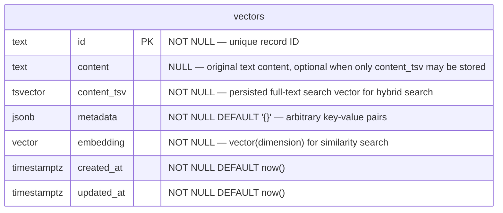

# Mythosia.VectorDb.Postgres

PostgreSQL ([pgvector](https://github.com/pgvector/pgvector)) implementation of `IVectorStore`.
Single-table design with a `metadata` JSONB column for all filtering including logical isolation.
All isolation keys (e.g. `namespace`, `scope`, `category`) are standard metadata entries — there are no framework-reserved keys.

## Prerequisites

- PostgreSQL 12+
- pgvector extension installed:

```sql
CREATE EXTENSION IF NOT EXISTS vector;
```

- (Optional, for `TextSearchMode.Trigram`) pg_trgm extension:

```sql
CREATE EXTENSION IF NOT EXISTS pg_trgm;
```

> `pg_trgm` is a standard PostgreSQL contrib module, available on most managed services (Azure, Supabase, RDS, etc.). When `EnsureSchema = true` and `TextSearchMode = Trigram`, the extension is created automatically.

## Quick Start

```csharp
using Mythosia.VectorDb;
using Mythosia.VectorDb.Postgres;

var store = new PostgresStore(new PostgresOptions
{
    ConnectionString = "Host=localhost;Database=mydb;Username=postgres;Password=secret",
    Dimension = 1536,
    EnsureSchema = true,  // auto-creates table + indexes
    Index = new HnswIndexOptions { M = 16, EfConstruction = 64, EfSearch = 40 }
});

// Upsert records with optional metadata for logical isolation
var record = new VectorRecord("doc-1", embedding, "Hello world");
record.Metadata["namespace"] = "documents";
await store.UpsertAsync(record);

// Search with metadata filter
var filter = new VectorFilter().Where("namespace", "documents");
var results = await store.SearchAsync(queryVector, topK: 5, filter: filter);
```

## ERD



> **Single-table design**: All records share one table. The primary key is `(id)`. Logical isolation is achieved via metadata JSONB conditions.

### Indexes

| Index | Type | Target | Purpose |
| --- | --- | --- | --- |
| PK | btree | `(id)` | Primary key / upsert conflict |
| `idx_*_embedding` | hnsw / ivfflat | `embedding vector_*_ops` | ANN similarity search (distance strategy dependent) |
| `idx_*_metadata` | gin | `metadata` | jsonb containment filter (`@>`) |
| `idx_*_content_tsv` | gin | `content_tsv` | Full-text search index for hybrid lexical retrieval (`TsVector` mode) |
| `idx_*_content_trgm` | gin | `content gin_trgm_ops` | Trigram similarity index for hybrid search (`Trigram` mode, auto-created when configured) |

## Schema

When `EnsureSchema = true`, the following is created automatically:

```sql
CREATE EXTENSION IF NOT EXISTS vector;

CREATE TABLE IF NOT EXISTS "public"."vectors" (
    id          text        NOT NULL PRIMARY KEY,
    content     text        NULL,
    content_tsv tsvector    NOT NULL DEFAULT ''::tsvector,
    metadata    jsonb       NOT NULL DEFAULT '{}'::jsonb,
    embedding   vector(1536) NOT NULL,
    created_at  timestamptz NOT NULL DEFAULT now(),
    updated_at  timestamptz NOT NULL DEFAULT now()
);

COMMENT ON COLUMN "public"."vectors".content IS
    'Nullable to support customer policies that prohibit storing original text while still allowing hybrid search via content_tsv.';

-- Indexes
CREATE INDEX IF NOT EXISTS idx_vectors_metadata
    ON "public"."vectors" USING gin (metadata);

CREATE INDEX IF NOT EXISTS idx_vectors_content_tsv
    ON "public"."vectors" USING gin (content_tsv);

-- vector index (default: HNSW)
CREATE INDEX IF NOT EXISTS idx_vectors_embedding
    ON "public"."vectors" USING hnsw (embedding vector_cosine_ops) WITH (m = 16, ef_construction = 64);
```

Notes:

- The vector index SQL changes by `Index` type (`HnswIndexOptions` / `IvfFlatIndexOptions` / `NoIndexOptions`).
- The operator class changes by `DistanceStrategy`:
  - `Cosine` -> `vector_cosine_ops`
  - `Euclidean` -> `vector_l2_ops`
  - `InnerProduct` -> `vector_ip_ops`

When `EnsureSchema = false` (recommended for production), the table must already exist.
An `InvalidOperationException` is thrown with a clear message if the table is missing.

## Manual Schema Setup (Production)

For production deployments, create the schema manually before starting the application:

```sql
-- 1. Enable pgvector
CREATE EXTENSION IF NOT EXISTS vector;

-- 2. Create table (adjust dimension as needed)
CREATE TABLE public.vectors (
    id          text        NOT NULL PRIMARY KEY,
    content     text        NULL,
    content_tsv tsvector    NOT NULL DEFAULT ''::tsvector,
    metadata    jsonb       NOT NULL DEFAULT '{}'::jsonb,
    embedding   vector(1536) NOT NULL,
    created_at  timestamptz NOT NULL DEFAULT now(),
    updated_at  timestamptz NOT NULL DEFAULT now()
);

COMMENT ON COLUMN public.vectors.content IS
    'Nullable to support customer policies that prohibit storing original text while still allowing hybrid search via content_tsv.';

-- 3. Indexes
CREATE INDEX idx_vectors_metadata
    ON public.vectors USING gin (metadata);

CREATE INDEX idx_vectors_content_tsv
    ON public.vectors USING gin (content_tsv);

-- 4-A. Option A (recommended default): HNSW
CREATE INDEX idx_vectors_embedding
    ON public.vectors USING hnsw (embedding vector_cosine_ops) WITH (m = 16, ef_construction = 64);

-- 4-B. Option B: IVFFlat (create after loading data)
--      ivfflat requires rows to exist for training
-- CREATE INDEX idx_vectors_embedding
--     ON public.vectors USING ivfflat (embedding vector_cosine_ops) WITH (lists = 100);

-- 5. Analyze for query planner (recommended)
ANALYZE public.vectors;

-- 6. (Optional, for TextSearchMode.Trigram) Trigram index
-- CREATE EXTENSION IF NOT EXISTS pg_trgm;
-- CREATE INDEX idx_vectors_content_trgm
--     ON public.vectors USING gin (content gin_trgm_ops);
```

## Legacy Schema Migration

If your Postgres table was created by an earlier version of `Mythosia.VectorDb.Postgres` that used `namespace` and `scope` columns, the migration is handled **automatically** on first use. `PostgresStore` detects legacy columns and:

1. Merges `namespace` / `scope` values into `metadata` JSONB
2. Resolves duplicate IDs across namespaces by prefixing with the namespace value
3. Changes the primary key to `(id)` only
4. Drops the `namespace` and `scope` columns

This runs in a single transaction — on failure, the schema remains unchanged. No manual SQL required.

## Options

| Option | Default | Description |
| --- | --- | --- |
| `ConnectionString` | *(required)* | PostgreSQL connection string |
| `Dimension` | *(required)* | Embedding vector dimension (e.g., 1536 for OpenAI) |
| `SchemaName` | `"public"` | Database schema |
| `TableName` | `"vectors"` | Table name |
| `EnsureSchema` | `false` | Auto-create extension/table/indexes |
| `DistanceStrategy` | `Cosine` | Similarity metric (`Cosine`, `Euclidean`, `InnerProduct`) |
| `Index` | `new HnswIndexOptions()` | Vector index settings object (`HnswIndexOptions`, `IvfFlatIndexOptions`, `NoIndexOptions`) |
| `HnswIndexOptions.M` | `16` | HNSW build param (`m`), typical range `8-64` |
| `HnswIndexOptions.EfConstruction` | `64` | HNSW build param (`ef_construction`), typical range `32-400` |
| `HnswIndexOptions.EfSearch` | `40` | HNSW runtime `ef_search` default |
| `IvfFlatIndexOptions.Lists` | `100` | Number of IVF lists for the ivfflat index |
| `IvfFlatIndexOptions.Probes` | `10` | IVFFlat runtime `probes` default |
| `FailFastOnIndexCreationFailure` | `true` | Throw when vector index creation fails (recommended for production) |
| `TextSearchMode` | `TsVector` | Text search strategy for hybrid search (`TsVector` or `Trigram`) |
| `TextSearchConfig` | `"simple"` | PostgreSQL text search configuration for `to_tsvector` / `to_tsquery` (only used in `TsVector` mode) |

## Runtime Tuning Guide (DX)

- `IvfFlatSearchRuntimeOptions.Probes`: increase for better recall, decrease for lower latency.
- `HnswSearchRuntimeOptions.EfSearch`: increase for better recall, decrease for lower latency.
- `IvfFlatIndexOptions.Lists`: start around `sqrt(total_rows)` and tune from there.

Use runtime options matching your index settings:

- `Index = new HnswIndexOptions(...)` → `HnswSearchRuntimeOptions`
- `Index = new IvfFlatIndexOptions(...)` → `IvfFlatSearchRuntimeOptions`

Use named presets for convenience, or set explicit values:

```csharp
// Named presets (static properties)
await store.SearchAsync(queryVector, topK: 10, filter, HnswSearchRuntimeOptions.Fast);
await store.SearchAsync(queryVector, topK: 10, filter, HnswSearchRuntimeOptions.Balanced);
await store.SearchAsync(queryVector, topK: 10, filter, HnswSearchRuntimeOptions.HighRecall);

// Explicit override
await store.SearchAsync(queryVector, topK: 10, filter, new HnswSearchRuntimeOptions { EfSearch = 80 });
await store.SearchAsync(queryVector, topK: 10, filter, new IvfFlatSearchRuntimeOptions { Probes = 20 });
```

Recommended starting points:

| Goal | `IvfFlatSearchRuntimeOptions.Probes` | `HnswSearchRuntimeOptions.EfSearch` |
| --- | ---: | ---: |
| Fast | 4 | 16 |
| Balanced | 10 | 40 |
| HighRecall | 32 | 120 |

These are practical ranges, not strict hard limits. Final values should be chosen from production latency/recall measurements.

## Metadata Filtering

All filtering is done via the `metadata` JSONB column. SQL per operator:

- `Eq`: `metadata @> @val` (JSONB containment — uses GIN index)
- `Ne`: `metadata->>'key' != @val`
- `In`: `metadata->>'key' = ANY(@vals)`
- `NotIn`: `NOT (metadata->>'key' = ANY(@vals))`
- `Gt / Gte / Lt / Lte`: `metadata->>'key' > @val` (lexicographic)
- `Like`: `metadata->>'key' LIKE @val`
- `Exists`: `jsonb_exists(metadata, 'key')`
- `NotExists`: `NOT jsonb_exists(metadata, 'key')`
- `And / Or groups`: wrapped in `(...)` with `AND` / `OR`

**MinScore filter** (distance-strategy dependent):

- `Cosine`: `1 - (embedding <=> @q::vector) >= @minScore`
- `Euclidean`: `1 / (1 + (embedding <-> @q::vector)) >= @minScore`
- `InnerProduct`: `-(embedding <#> @q::vector) >= @minScore`

### VectorFilter Examples

For the full operator reference and fluent API examples (`Where`, `WhereNot`, `WhereIn`, `WhereLike`, `WhereExists`, `Or`, `And`, `WithMinScore`, etc.), see the [Mythosia.VectorDb.Abstractions README](../Mythosia.VectorDb.Abstractions/README.md#vectorfilter).

## Hybrid Search

`PostgresStore` supports native `IVectorStore.HybridSearchAsync` for hybrid search. When called, it executes a **single SQL query using CTEs** — combining the vector similarity leg and the text search leg — then merges results via **Reciprocal Rank Fusion (RRF)**.

### TextSearchMode.TsVector (default)

Uses PostgreSQL `tsvector / tsquery` full-text search with a persisted `content_tsv` column plus GIN index. Works well for European languages with good built-in text search configurations.

```csharp
var store = new PostgresStore(new PostgresOptions
{
    ConnectionString = connString,
    Dimension = 1536,
    EnsureSchema = true,
    // TextSearchMode = TextSearchMode.TsVector  (default)
});
```

### TextSearchMode.Trigram

Uses `pg_trgm` extension with `word_similarity` matching. Better for **CJK languages** (Korean, Japanese, Chinese) and agglutinative languages where PostgreSQL lacks built-in morphological analysis.

```csharp
var store = new PostgresStore(new PostgresOptions
{
    ConnectionString = connString,
    Dimension = 1536,
    EnsureSchema = true,
    TextSearchMode = TextSearchMode.Trigram  // pg_trgm word_similarity
});
```

> **Why Trigram for Korean/CJK?**
> PostgreSQL's `simple` text search config tokenizes by whitespace only. Korean particles (조사/어미) attach to words, so `"opm에"` ≠ `"opm은"` — no match. Trigram splits text into 3-character grams and uses substring similarity, bypassing morphological analysis entirely.

`content` may remain nullable for deployments where original text storage is prohibited, but `content_tsv` is required for lexical retrieval in `TsVector` mode.

## Batch Get & Count

```csharp
// Fetch multiple records by ID — single query using WHERE id = ANY(@ids)
var records = await store.GetBatchAsync(new[] { "id-1", "id-2", "id-3" });

// Count total vectors
long count = await store.CountAsync();

// Count with metadata filter
long filtered = await store.CountAsync(
    new VectorFilter().Where("category", "finance"));
```

`GetBatchAsync` uses a single `WHERE id = ANY(@ids)` query with Npgsql array binding. Applies metadata conditions in the same `WHERE` clause. `CountAsync` uses `SELECT COUNT(*)` with optional jsonb containment clauses.

## Atomic Vector Replacement

`ReplaceByFilterAsync` wraps DELETE + INSERT in a single PostgreSQL transaction, eliminating the query gap that occurs during re-embedding:

```csharp
var filter = new VectorFilter().Where("full_path", "/docs/policy.md");
await store.ReplaceByFilterAsync(filter, newRecords);
```

**How it works:**

```
BEGIN TRANSACTION
  DELETE FROM vectors WHERE metadata->>'full_path' = '/docs/policy.md'
  INSERT INTO vectors (...) VALUES (...), (...), ...
COMMIT
```

If the INSERT fails, the DELETE is rolled back and existing data remains intact. Queries always see either the old data or the new data, never an empty result.

## RAG Integration

```csharp
var store = await RagStore.BuildAsync(config => config
    .AddText("Your document text here", id: "doc-1")
    .UseLocalEmbedding(512)
    .UseVectorStore(new PostgresStore(new PostgresOptions
    {
        ConnectionString = Environment.GetEnvironmentVariable("MYTHOSIA_PG_CONN")!,
        Dimension = 512,
        EnsureSchema = true,
        Index = new HnswIndexOptions()
    }))
    .WithTopK(5)
);
```

## Connection Verification

Call `VerifyConnectionAsync` to test TCP connectivity and authentication before running queries:

```csharp
var store = new PostgresStore(new PostgresOptions
{
    ConnectionString = connString,
    Dimension = 1536
});

try
{
    await store.VerifyConnectionAsync();
    Console.WriteLine("Connected!");
}
catch (Exception ex)
{
    Console.WriteLine($"Connection failed: {ex.Message}");
}
```

## Resource Disposal

`PostgresStore` implements `IDisposable`. Dispose the store when it is no longer needed to release internal resources (schema initialization lock):

```csharp
using var store = new PostgresStore(options);
// ... use store
```

Each operation opens and closes its own `NpgsqlConnection` from the connection pool — the store itself holds no open connections between calls.

## Performance Tips

- **ivfflat lists**: Rule of thumb — `lists = sqrt(total_rows)`. Default 100 is good for up to ~10K rows.
- Run `ANALYZE vectors;` after bulk inserts for optimal query plans.
