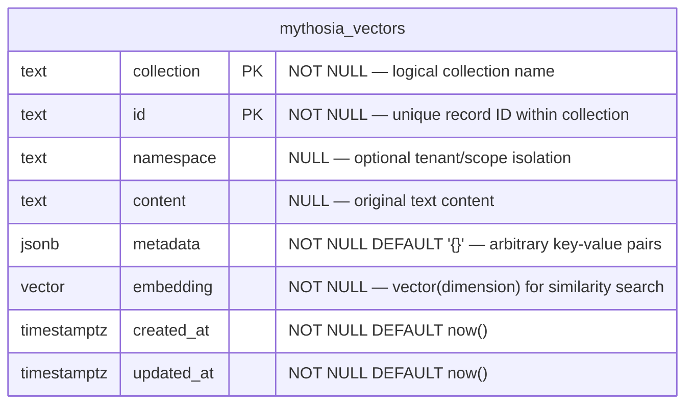

# Mythosia.VectorDb.Postgres

PostgreSQL ([pgvector](https://github.com/pgvector/pgvector)) implementation of `IVectorStore`.  
Single-table design with collection column for logical isolation.

## Prerequisites

- PostgreSQL 12+
- pgvector extension installed:

```sql
CREATE EXTENSION IF NOT EXISTS vector;
```

## Quick Start

```csharp
using Mythosia.VectorDb.Postgres;

var store = new PostgresVectorStore(new PostgresVectorStoreOptions
{
    ConnectionString = "Host=localhost;Database=mydb;Username=postgres;Password=secret",
    Dimension = 1536,
    EnsureSchema = true  // auto-creates table + indexes
});
```

## ERD



> **Single-table design**: All collections share one table. The composite primary key `(collection, id)` ensures uniqueness per collection.

### Indexes

| Index | Type | Target | Purpose |
| --- | --- | --- | --- |
| PK | btree | `(collection, id)` | Primary key / upsert conflict |
| `idx_*_embedding` | ivfflat | `embedding vector_cosine_ops` | Cosine similarity search |
| `idx_*_metadata` | gin | `metadata` | jsonb containment filter (`@>`) |
| `idx_*_collection_ns` | btree | `(collection, namespace)` | Namespace-scoped queries |

## Schema

When `EnsureSchema = true`, the following is created automatically:

```sql
CREATE TABLE IF NOT EXISTS "public"."mythosia_vectors" (
    collection  text        NOT NULL,
    id          text        NOT NULL,
    namespace   text        NULL,
    content     text        NULL,
    metadata    jsonb       NOT NULL DEFAULT '{}'::jsonb,
    embedding   vector(1536) NOT NULL,
    created_at  timestamptz NOT NULL DEFAULT now(),
    updated_at  timestamptz NOT NULL DEFAULT now(),
    PRIMARY KEY (collection, id)
);

-- Indexes
CREATE INDEX IF NOT EXISTS idx_mythosia_vectors_metadata
    ON "public"."mythosia_vectors" USING gin (metadata);

CREATE INDEX IF NOT EXISTS idx_mythosia_vectors_collection_ns
    ON "public"."mythosia_vectors" (collection, namespace);

-- ivfflat (created when data exists)
CREATE INDEX IF NOT EXISTS idx_mythosia_vectors_embedding
    ON "public"."mythosia_vectors" USING ivfflat (embedding vector_cosine_ops) WITH (lists = 100);
```

When `EnsureSchema = false` (recommended for production), the table must already exist.  
An `InvalidOperationException` is thrown with a clear message if the table is missing.

## Manual Schema Setup (Production)

For production deployments, create the schema manually before starting the application:

```sql
-- 1. Enable pgvector
CREATE EXTENSION IF NOT EXISTS vector;

-- 2. Create table (adjust dimension as needed)
CREATE TABLE public.mythosia_vectors (
    collection  text        NOT NULL,
    id          text        NOT NULL,
    namespace   text        NULL,
    content     text        NULL,
    metadata    jsonb       NOT NULL DEFAULT '{}'::jsonb,
    embedding   vector(1536) NOT NULL,
    created_at  timestamptz NOT NULL DEFAULT now(),
    updated_at  timestamptz NOT NULL DEFAULT now(),
    PRIMARY KEY (collection, id)
);

-- 3. Indexes
CREATE INDEX idx_mythosia_vectors_metadata
    ON public.mythosia_vectors USING gin (metadata);

CREATE INDEX idx_mythosia_vectors_collection_ns
    ON public.mythosia_vectors (collection, namespace);

-- 4. Load data first, then create ivfflat index
--    (ivfflat requires rows to exist for training)
CREATE INDEX idx_mythosia_vectors_embedding
    ON public.mythosia_vectors USING ivfflat (embedding vector_cosine_ops) WITH (lists = 100);

-- 5. Analyze for query planner
ANALYZE public.mythosia_vectors;
```

## Options

| Option | Default | Description |
|---|---|---|
| `ConnectionString` | *(required)* | PostgreSQL connection string |
| `Dimension` | *(required)* | Embedding vector dimension (e.g., 1536 for OpenAI) |
| `SchemaName` | `"public"` | Database schema |
| `TableName` | `"mythosia_vectors"` | Table name |
| `EnsureSchema` | `false` | Auto-create extension/table/indexes |
| `IvfflatLists` | `100` | Number of IVF lists for the ivfflat index |

## Collection & Filter Behavior

- **Collections** are stored as a `collection` column in a single shared table (not separate tables).
- `CreateCollectionAsync` is a no-op — collections are implicitly created on upsert.
- `DeleteCollectionAsync` deletes all rows matching the collection.
- **Namespace filter**: `WHERE namespace = @ns`
- **Metadata filter**: `WHERE metadata @> @jsonb` (jsonb containment, AND logic)
- **MinScore filter**: `WHERE (1 - (embedding <=> query)) >= @minScore`

## RAG Integration

```csharp
var store = await RagStore.BuildAsync(config => config
    .AddText("Your document text here", id: "doc-1")
    .UseLocalEmbedding(512)
    .UseVectorStore(new PostgresVectorStore(new PostgresVectorStoreOptions
    {
        ConnectionString = Environment.GetEnvironmentVariable("MYTHOSIA_PG_CONN")!,
        Dimension = 512,
        EnsureSchema = true
    }))
    .WithTopK(5)
);
```

## Performance Tips

- **ivfflat lists**: Rule of thumb — `lists = sqrt(total_rows)`. Default 100 is good for up to ~10K rows.
- Run `ANALYZE mythosia_vectors;` after bulk inserts for optimal query plans.
- For large datasets (1M+ rows), consider HNSW index (`CREATE INDEX ... USING hnsw`) instead of ivfflat.
- Use connection pooling (e.g., `Npgsql` connection string `Pooling=true;Maximum Pool Size=20`).

## EnsureSchema Guidance

- **`EnsureSchema = true`**: Development, testing, local Docker — auto-provisions everything.
- **`EnsureSchema = false`**: Production — schema managed by DBA/migration tools; fails fast with clear error if missing.
