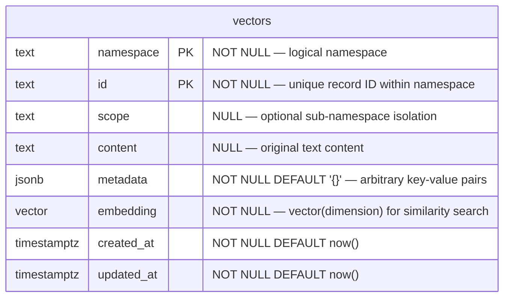

# Mythosia.VectorDb.Postgres

PostgreSQL ([pgvector](https://github.com/pgvector/pgvector)) implementation of `IVectorStore`.  
Single-table design with namespace column for logical isolation.

## Migration from v10.0.0

If upgrading from v10.0.0, run the following SQL migration **before** deploying:

```sql
-- 1. Rename columns (order matters: rename 'namespace' first to avoid conflict)
ALTER TABLE "public"."vectors" RENAME COLUMN namespace TO scope;
ALTER TABLE "public"."vectors" RENAME COLUMN collection TO namespace;

-- 2. Recreate composite index
DROP INDEX IF EXISTS idx_vectors_collection_ns;
CREATE INDEX idx_vectors_ns_scope ON "public"."vectors" (namespace, scope);

-- 3. Recreate primary key
ALTER TABLE "public"."vectors" DROP CONSTRAINT vectors_pkey;
ALTER TABLE "public"."vectors" ADD PRIMARY KEY (namespace, id);
```

## Prerequisites

- PostgreSQL 12+
- pgvector extension installed:

```sql
CREATE EXTENSION IF NOT EXISTS vector;
```

## Quick Start

```csharp
using Mythosia.VectorDb;
using Mythosia.VectorDb.Postgres;

var store = new PostgresStore(new PostgresOptions
{
    ConnectionString = "Host=localhost;Database=mydb;Username=postgres;Password=secret",
    Dimension = 1536,
    EnsureSchema = true,  // auto-creates table + indexes
    Index = new HnswIndexOptions { M = 16, EfConstruction = 64, EfSearch = 40 }
});

// Fluent API (recommended)
var ns = store.InNamespace("my-namespace");
await ns.CreateAsync();
await ns.UpsertAsync(record);
var results = await ns.SearchAsync(queryVector, topK: 5);

// With scope
var scoped = ns.InScope("tenant-1");
await scoped.UpsertAsync(record);   // record.Scope set automatically
var scopedResults = await scoped.SearchAsync(queryVector);
```

## ERD



> **Single-table design**: All namespaces share one table. The composite primary key `(namespace, id)` ensures uniqueness per namespace.

### Indexes

| Index | Type | Target | Purpose |
| --- | --- | --- | --- |
| PK | btree | `(namespace, id)` | Primary key / upsert conflict |
| `idx_*_embedding` | hnsw / ivfflat | `embedding vector_*_ops` | ANN similarity search (distance strategy dependent) |
| `idx_*_metadata` | gin | `metadata` | jsonb containment filter (`@>`) |
| `idx_*_ns_scope` | btree | `(namespace, scope)` | Scope-scoped queries |

## Schema

When `EnsureSchema = true`, the following is created automatically:

```sql
CREATE EXTENSION IF NOT EXISTS vector;

CREATE TABLE IF NOT EXISTS "public"."vectors" (
    namespace   text        NOT NULL,
    id          text        NOT NULL,
    scope       text        NULL,
    content     text        NULL,
    metadata    jsonb       NOT NULL DEFAULT '{}'::jsonb,
    embedding   vector(1536) NOT NULL,
    created_at  timestamptz NOT NULL DEFAULT now(),
    updated_at  timestamptz NOT NULL DEFAULT now(),
    PRIMARY KEY (namespace, id)
);

-- Indexes
CREATE INDEX IF NOT EXISTS idx_vectors_metadata
    ON "public"."vectors" USING gin (metadata);

CREATE INDEX IF NOT EXISTS idx_vectors_ns_scope
    ON "public"."vectors" (namespace, scope);

-- vector index (default: HNSW)
CREATE INDEX IF NOT EXISTS idx_vectors_embedding
    ON "public"."vectors" USING hnsw (embedding vector_cosine_ops) WITH (m = 16, ef_construction = 64);
```

Notes:
- The vector index SQL changes by `Index` type (`HnswIndexOptions` / `IvfFlatIndexOptions` / `NoIndexOptions`).
- The operator class changes by `DistanceStrategy`:
  - `Cosine` -> `vector_cosine_ops`
  - `Euclidean` -> `vector_l2_ops`
  - `InnerProduct` -> `vector_ip_ops`

When `EnsureSchema = false` (recommended for production), the table must already exist.  
An `InvalidOperationException` is thrown with a clear message if the table is missing.

## Manual Schema Setup (Production)

For production deployments, create the schema manually before starting the application:

```sql
-- 1. Enable pgvector
CREATE EXTENSION IF NOT EXISTS vector;

-- 2. Create table (adjust dimension as needed)
CREATE TABLE public.vectors (
    namespace   text        NOT NULL,
    id          text        NOT NULL,
    scope       text        NULL,
    content     text        NULL,
    metadata    jsonb       NOT NULL DEFAULT '{}'::jsonb,
    embedding   vector(1536) NOT NULL,
    created_at  timestamptz NOT NULL DEFAULT now(),
    updated_at  timestamptz NOT NULL DEFAULT now(),
    PRIMARY KEY (namespace, id)
);

-- 3. Indexes
CREATE INDEX idx_vectors_metadata
    ON public.vectors USING gin (metadata);

CREATE INDEX idx_vectors_ns_scope
    ON public.vectors (namespace, scope);

-- 4-A. Option A (recommended default): HNSW
CREATE INDEX idx_vectors_embedding
    ON public.vectors USING hnsw (embedding vector_cosine_ops) WITH (m = 16, ef_construction = 64);

-- 4-B. Option B: IVFFlat (create after loading data)
--      ivfflat requires rows to exist for training
-- CREATE INDEX idx_vectors_embedding
--     ON public.vectors USING ivfflat (embedding vector_cosine_ops) WITH (lists = 100);

-- 5. Analyze for query planner (recommended)
ANALYZE public.vectors;
```

## Options

| Option | Default | Description |
|---|---|---|
| `ConnectionString` | *(required)* | PostgreSQL connection string |
| `Dimension` | *(required)* | Embedding vector dimension (e.g., 1536 for OpenAI) |
| `SchemaName` | `"public"` | Database schema |
| `TableName` | `"vectors"` | Table name |
| `EnsureSchema` | `false` | Auto-create extension/table/indexes |
| `DistanceStrategy` | `Cosine` | Similarity metric (`Cosine`, `Euclidean`, `InnerProduct`) |
| `Index` | `new HnswIndexOptions()` | Vector index settings object (`HnswIndexOptions`, `IvfFlatIndexOptions`, `NoIndexOptions`) |
| `HnswIndexOptions.M` | `16` | HNSW build param (`m`), typical range `8-64` |
| `HnswIndexOptions.EfConstruction` | `64` | HNSW build param (`ef_construction`), typical range `32-400` |
| `HnswIndexOptions.EfSearch` | `40` | HNSW runtime `ef_search` default |
| `IvfFlatIndexOptions.Lists` | `100` | Number of IVF lists for the ivfflat index |
| `IvfFlatIndexOptions.Probes` | `10` | IVFFlat runtime `probes` default |
| `FailFastOnIndexCreationFailure` | `true` | Throw when vector index creation fails (recommended for production) |

## Runtime Tuning Guide (DX)

- `IvfFlatSearchRuntimeOptions.Probes`: increase for better recall, decrease for lower latency.
- `HnswSearchRuntimeOptions.EfSearch`: increase for better recall, decrease for lower latency.
- `IvfFlatIndexOptions.Lists`: start around `sqrt(total_rows)` and tune from there.

Use runtime options matching your index settings:
- `Index = new HnswIndexOptions(...)` -> `HnswSearchRuntimeOptions`
- `Index = new IvfFlatIndexOptions(...)` -> `IvfFlatSearchRuntimeOptions`

Recommended starting points:

| Goal | `IvfFlatSearchRuntimeOptions.Probes` | `HnswSearchRuntimeOptions.EfSearch` |
|---|---:|---:|
| Fast | 4 | 16 |
| Balanced | 10 | 40 |
| HighRecall | 32 | 120 |

These are practical ranges, not strict hard limits. Final values should be chosen from production latency/recall measurements.

## Namespace & Filter Behavior

- **Namespaces** are stored as a `namespace` column in a single shared table (not separate tables).
- `CreateNamespaceAsync` is a no-op — namespaces are implicitly created on upsert.
- `DeleteNamespaceAsync` deletes all rows matching the namespace.
- **Scope filter**: `WHERE scope = @scope`
- **Metadata filter**: `WHERE metadata @> @jsonb` (jsonb containment, AND logic)
- **MinScore filter** (distance-strategy dependent):
  - `Cosine`: `1 - (embedding <=> @q::vector) >= @minScore`
  - `Euclidean`: `1 / (1 + (embedding <-> @q::vector)) >= @minScore`
  - `InnerProduct`: `-(embedding <#> @q::vector) >= @minScore`

## RAG Integration

```csharp
var store = await RagStore.BuildAsync(config => config
    .AddText("Your document text here", id: "doc-1")
    .UseLocalEmbedding(512)
    .UseVectorStore(new PostgresStore(new PostgresOptions
    {
        ConnectionString = Environment.GetEnvironmentVariable("MYTHOSIA_PG_CONN")!,
        Dimension = 512,
        EnsureSchema = true,
        Index = new HnswIndexOptions()
    }))
    .WithTopK(5)
);
```

## Performance Tips

- **ivfflat lists**: Rule of thumb — `lists = sqrt(total_rows)`. Default 100 is good for up to ~10K rows.
- Run `ANALYZE vectors;` after bulk inserts for optimal query plans.
- For large datasets (1M+ rows), consider HNSW index (`CREATE INDEX ... USING hnsw`) instead of ivfflat.
- Use connection pooling (e.g., `Npgsql` connection string `Pooling=true;Maximum Pool Size=20`).

## EnsureSchema Guidance

- **`EnsureSchema = true`**: Development, testing, local Docker — auto-provisions everything.
- **`EnsureSchema = false`**: Production — schema managed by DBA/migration tools; fails fast with clear error if missing.
- For `ivfflat`, index creation can fail on empty tables (PostgreSQL/pgvector behavior). In that case, use `Hnsw` or create `ivfflat` after loading data.
- `FailFastOnIndexCreationFailure = true` (default): throws immediately if vector index creation fails.
- `FailFastOnIndexCreationFailure = false`: startup continues even if vector index creation fails.
